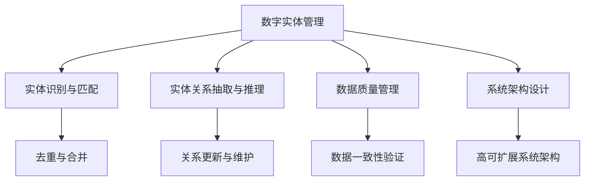

                 

# 数字实体自动化的前景与挑战

## 1. 背景介绍

### 1.1 问题由来

随着数字化转型的加速，企业内外的数字实体管理需求日益增加。数字实体不仅包括组织、部门、人员等传统实体，也包括客户、供应商、合作伙伴等第三方实体。然而，传统的数据管理系统在实体管理方面存在诸多不足，如数据孤岛、数据冗余、数据不一致等问题，严重阻碍了企业的数字化进程。因此，如何构建高效、统一的数字实体管理系统，是当前数字化转型中亟需解决的核心问题。

### 1.2 问题核心关键点

数字实体自动化主要涉及两个方面：一是数据集成和合并，即从多个数据源中提取、清洗和合并实体数据，形成统一的全局视图；二是实体关系自动发现和维护，即自动推断实体间的各种关系，并根据业务规则进行关系更新和维护。这一过程的核心挑战在于：

- 数据源多样性和异构性：不同数据源的数据格式、结构、更新频率各不相同，数据整合难度较大。
- 实体识别和匹配：现有实体识别技术在准确性和泛化性方面尚存在一定局限性，难以全面覆盖各类实体。
- 关系发现和推理：现有的实体关系抽取和推理方法在复杂场景下难以应对，准确性和完备性不足。
- 数据质量和一致性：实体数据在存储和传输过程中，容易发生错误和丢失，数据一致性难以保障。
- 系统性能和扩展性：现有的数字实体管理系统在处理大规模数据时，性能和扩展性往往难以满足实时性和并发性要求。

### 1.3 问题研究意义

数字实体自动化的核心在于将复杂的实体关系管理工作自动化，减少人工干预，提升数据处理和管理的效率和准确性。其意义在于：

1. **提升数据质量**：自动化实体管理可以减少数据录入和维护的误差，提升数据的一致性和完整性。
2. **加速数字化转型**：通过高效统一的数字实体视图，支撑业务流程自动化、客户关系管理、供应链管理等多方面应用，推动企业数字化转型的顺利进行。
3. **增强决策支持**：数字实体视图提供全面的、关联的业务数据，支持更科学、准确的决策分析。
4. **提升运营效率**：减少人工操作，降低运营成本，提升数据处理和决策的响应速度。
5. **优化客户体验**：通过更精准的客户画像，提供个性化服务和推荐，提升客户满意度。

## 2. 核心概念与联系

### 2.1 核心概念概述

为更好地理解数字实体自动化的实现方法，本节将介绍几个密切相关的核心概念：

- **数字实体管理**：指对组织、部门、人员等内部实体，以及客户、供应商、合作伙伴等第三方实体进行全面、统一的管理，包括数据采集、整合、清洗、更新、审计等环节。
- **实体识别与匹配**：从原始数据中提取实体名称、类型、属性等信息，并根据某些规则对不同数据源中的实体进行匹配，消除数据冗余和冲突。
- **实体关系抽取与推理**：通过模型自动发现实体间的各种关系，如所属、关联、交互等，并根据业务规则进行关系更新和维护。
- **数据质量管理**：通过自动化流程，监控和纠正数据质量问题，确保实体数据的准确性和一致性。
- **系统架构设计**：包括数据模型设计、组件划分、通信协议、性能优化等，旨在构建高性能、高可扩展性的数字实体自动化系统。

这些核心概念之间的逻辑关系可以通过以下Mermaid流程图来展示：



这个流程图展示了她各个核心概念之间的关系：

1. **数字实体管理**：作为整个流程的起点，涵盖实体识别、关系抽取、数据质量等多个方面。
2. **实体识别与匹配**：从数据中提取并匹配实体，是数字实体管理的基础。
3. **实体关系抽取与推理**：在实体识别基础上，抽取和推理实体间关系，支撑业务逻辑的实现。
4. **数据质量管理**：保障实体数据的一致性和准确性，避免数据冗余和冲突。
5. **系统架构设计**：提供技术保障，支撑大规模数据处理和系统扩展。

这些概念共同构成了数字实体自动化的实现框架，使得企业能够高效、统一地管理各类数字实体，提升数据处理和管理效率，优化业务流程。

## 3. 核心算法原理 & 具体操作步骤

### 3.1 算法原理概述

数字实体自动化主要基于以下算法原理：

- **实体识别与匹配算法**：通过自然语言处理技术，从文本中识别出实体，并根据特定规则匹配不同数据源中的同名实体。
- **实体关系抽取算法**：使用图网络、知识图谱等方法，自动发现实体间的各种关系，并根据业务规则进行关系更新和维护。
- **数据质量管理算法**：基于数据一致性模型和数据清洗算法，自动化监控和纠正数据质量问题，确保实体数据的准确性和一致性。
- **系统架构设计算法**：采用分布式计算、微服务架构等方法，设计高效、可扩展的数字实体管理系统。

### 3.2 算法步骤详解

基于数字实体自动化的核心算法，以下是一个典型的算法步骤：

**Step 1: 数据采集与预处理**
- 从多个数据源中采集实体数据，包括内部系统和第三方接口等。
- 对原始数据进行清洗和预处理，如去除噪声、统一格式、处理缺失值等。

**Step 2: 实体识别与匹配**
- 使用命名实体识别(NER)模型识别文本中的实体名称、类型等信息。
- 根据预设的规则和算法，对不同数据源中的同名实体进行匹配，合并重复数据。

**Step 3: 实体关系抽取与推理**
- 使用图网络模型，从识别出的实体对中自动抽取实体间的关系。
- 根据业务规则和领域知识，对抽取出的关系进行推理，进行关系更新和维护。

**Step 4: 数据质量管理**
- 监控实体数据的一致性和准确性，及时发现并纠正错误。
- 使用数据一致性模型，确保不同数据源间的数据一致性。

**Step 5: 系统架构设计**
- 设计分布式计算架构，实现高并发和高吞吐量的数据处理。
- 采用微服务架构，提高系统的可扩展性和灵活性。

### 3.3 算法优缺点

数字实体自动化的主要优点包括：

1. **自动化提升效率**：自动化的实体管理减少了人工操作，提高了数据处理和管理效率。
2. **减少错误和遗漏**：自动化系统可以降低人为错误和数据遗漏的风险，确保数据的准确性和完整性。
3. **增强数据一致性**：自动化系统可以实时监控和纠正数据质量问题，确保数据一致性。
4. **支撑业务决策**：数字实体视图提供了全面的、关联的业务数据，支持更科学、准确的决策分析。

但同时也存在一些缺点：

1. **依赖高质量数据**：数字实体自动化的效果依赖于原始数据的准确性和完整性。如果数据源质量不高，自动化的效果会大打折扣。
2. **模型复杂度**：实体识别和关系抽取模型通常较为复杂，需要较大的计算资源和训练数据。
3. **数据隐私问题**：实体管理涉及大量敏感数据，数据隐私和安全问题需要特别关注。
4. **算法局限性**：现有的实体识别和关系抽取算法在复杂场景下可能存在局限性，难以应对各种类型的数据和业务需求。
5. **系统扩展性**：大规模数据处理和实时性要求对系统架构和性能提出了高标准，需要灵活应对和优化。

### 3.4 算法应用领域

数字实体自动化的主要应用领域包括：

1. **客户关系管理(CRM)**：通过自动化的实体管理，提供客户画像和行为分析，提升客户满意度和忠诚度。
2. **供应链管理(SCM)**：实现供应商、物流和库存的自动管理，提升供应链效率和透明度。
3. **人力资源管理(HR)**：自动化员工信息的管理和更新，提升人力资源管理效率。
4. **财务管理和会计**：实现账目、发票和报表的自动生成和管理，提高财务工作准确性和效率。
5. **市场营销**：通过自动化实体管理，支撑精准营销和客户分析，提升营销效果。
6. **法律合规**：自动化的实体关系抽取和分析，帮助企业遵守相关法规和合规要求。

除了上述这些经典应用外，数字实体自动化还在更多场景中得到应用，如风险管理、金融分析、公共安全等，为各行业带来了新的数字化能力。

## 4. 数学模型和公式 & 详细讲解 & 举例说明

### 4.1 数学模型构建

数字实体自动化的核心算法包括实体识别、实体匹配、关系抽取和数据质量管理。以下将对各核心算法构建相应的数学模型。

### 4.2 公式推导过程

#### 实体识别与匹配

实体识别通常使用命名实体识别(NER)模型，其数学模型为：

$$
p(E_i|T) = \prod_{j=1}^N p(E_i|T_j) = \prod_{j=1}^N \frac{p(T_j|E_i) p(E_i)}{p(T_j)}
$$

其中，$E_i$ 为待识别的实体，$T_j$ 为包含实体的文本，$p(E_i|T)$ 为实体在文本中出现的概率，$p(T_j|E_i)$ 为文本包含实体的概率，$p(E_i)$ 为实体的先验概率，$p(T_j)$ 为文本的先验概率。

实体匹配则基于相似度计算和规则匹配，其数学模型为：

$$
score(E_i, E_j) = f_{sim}(E_i, E_j) \times f_{rule}(E_i, E_j)
$$

其中，$f_{sim}(E_i, E_j)$ 为实体相似度计算函数，$f_{rule}(E_i, E_j)$ 为规则匹配函数。

#### 实体关系抽取与推理

实体关系抽取通常使用图网络模型，其数学模型为：

$$
p(R|E_i, E_j) = \sum_{k=1}^K p(R_k|E_i, E_j) = \sum_{k=1}^K \frac{p(R_k|E_i, E_j) p(E_i) p(E_j)}{p(E_i) p(E_j)}
$$

其中，$R$ 为待抽取的关系，$E_i, E_j$ 为实体对，$p(R|E_i, E_j)$ 为关系在实体对中出现的概率，$p(R_k|E_i, E_j)$ 为关系在实体对中出现的条件概率，$p(E_i)$ 为实体的先验概率。

关系推理则基于知识图谱和逻辑推理，其数学模型为：

$$
p(E_i \rightarrow E_j|R) = \frac{p(E_j|E_i, R) p(R)}{p(E_i) p(E_j)}
$$

其中，$p(E_i \rightarrow E_j|R)$ 为实体间关系的推理概率，$p(E_j|E_i, R)$ 为推理后实体间的概率，$p(R)$ 为关系的先验概率。

#### 数据质量管理

数据质量管理主要基于数据一致性模型，其数学模型为：

$$
p(D_i = D_j|D_i, D_j) = \sum_{k=1}^K p(D_i = D_j|D_k)
$$

其中，$D_i, D_j$ 为数据源中的数据记录，$p(D_i = D_j|D_i, D_j)$ 为数据一致性概率，$p(D_i = D_j|D_k)$ 为根据数据一致性模型计算的数据一致性概率。

### 4.3 案例分析与讲解

#### 案例一：客户关系管理

客户关系管理(CRM)是数字实体自动化的典型应用。以下通过一个案例来说明实体识别和关系抽取在CRM中的应用。

假设某企业收集了大量的客户信息，包括姓名、地址、电话、邮件等，但这些信息分散在不同的系统中，格式各异，难以整合。通过数字实体自动化技术，企业可以自动从不同系统中的文本中识别出客户信息，并进行实体匹配和去重。

**实体识别与匹配**：
- 使用NER模型识别文本中的姓名、地址、电话等实体信息。
- 根据预设规则，将不同系统中的同名客户进行匹配，消除数据冗余。

**实体关系抽取**：
- 使用图网络模型，自动发现客户间的各种关系，如购买关系、服务关系等。
- 根据业务规则，自动更新和维护客户间的关系，如更新客户的历史交易记录、服务评价等。

#### 案例二：供应链管理

供应链管理(SCM)涉及多个环节的实体管理，如供应商、物流、库存等。以下通过一个案例来说明实体关系抽取和数据质量管理在SCM中的应用。

假设某企业从不同供应商采购原材料，使用不同的采购系统进行管理。不同系统中的供应商信息可能存在差异，如供应商名称、地址、联系方式等。通过数字实体自动化技术，企业可以自动从不同系统中的文本中识别出供应商信息，并进行实体匹配和去重。

**实体识别与匹配**：
- 使用NER模型识别文本中的供应商信息，如名称、地址、联系方式等。
- 根据预设规则，将不同系统中的同名供应商进行匹配，消除数据冗余。

**实体关系抽取**：
- 使用图网络模型，自动发现供应商与原材料、物流、库存等的关系。
- 根据业务规则，自动更新和维护供应商与原材料、物流、库存的关系，如更新供应商的供货记录、库存状态等。

**数据质量管理**：
- 使用数据一致性模型，监控和验证不同系统中的供应商信息是否一致。
- 根据不一致的情况，及时更新和纠正供应商信息，确保数据一致性。

## 5. 项目实践：代码实例和详细解释说明

### 5.1 开发环境搭建

在进行数字实体自动化实践前，我们需要准备好开发环境。以下是使用Python进行Scikit-learn和PyTorch开发的环境配置流程：

1. 安装Anaconda：从官网下载并安装Anaconda，用于创建独立的Python环境。

2. 创建并激活虚拟环境：
```bash
conda create -n pytorch-env python=3.8 
conda activate pytorch-env
```

3. 安装PyTorch：根据CUDA版本，从官网获取对应的安装命令。例如：
```bash
conda install pytorch torchvision torchaudio cudatoolkit=11.1 -c pytorch -c conda-forge
```

4. 安装Scikit-learn：
```bash
pip install scikit-learn
```

5. 安装各类工具包：
```bash
pip install numpy pandas scikit-learn matplotlib tqdm jupyter notebook ipython
```

完成上述步骤后，即可在`pytorch-env`环境中开始实体自动化的实践。

### 5.2 源代码详细实现

以下是一个使用PyTorch和Scikit-learn实现实体识别和匹配的示例代码：

```python
import torch
import torch.nn as nn
import torch.optim as optim
from sklearn.model_selection import train_test_split
from transformers import BertTokenizer, BertForTokenClassification
from sklearn.metrics import precision_score, recall_score, f1_score

# 定义实体识别模型
class EntityRecognitionModel(nn.Module):
    def __init__(self, num_labels):
        super(EntityRecognitionModel, self).__init__()
        self.bert = BertForTokenClassification.from_pretrained('bert-base-cased', num_labels=num_labels)
        self.classifier = nn.Linear(768, num_labels)
        self.dropout = nn.Dropout(0.2)

    def forward(self, input_ids, attention_mask):
        outputs = self.bert(input_ids, attention_mask=attention_mask)
        sequence_output = outputs[0]
        sequence_output = self.dropout(sequence_output)
        logits = self.classifier(sequence_output)
        return logits

# 训练实体识别模型
def train_model(model, train_data, validation_data, epochs, batch_size):
    device = torch.device('cuda') if torch.cuda.is_available() else torch.device('cpu')
    model.to(device)
    optimizer = optim.Adam(model.parameters(), lr=2e-5)
    total_steps = len(train_data) // batch_size * epochs

    for epoch in range(epochs):
        model.train()
        train_loss = 0
        for batch in tqdm(train_data, desc='Training'):
            input_ids = batch['input_ids'].to(device)
            attention_mask = batch['attention_mask'].to(device)
            labels = batch['labels'].to(device)
            optimizer.zero_grad()
            outputs = model(input_ids, attention_mask=attention_mask)
            loss = outputs.loss
            loss.backward()
            optimizer.step()
            train_loss += loss.item()

        model.eval()
        eval_loss = 0
        eval_metrics = {}
        for batch in tqdm(validation_data, desc='Evaluating'):
            input_ids = batch['input_ids'].to(device)
            attention_mask = batch['attention_mask'].to(device)
            labels = batch['labels'].to(device)
            with torch.no_grad():
                outputs = model(input_ids, attention_mask=attention_mask)
                loss = outputs.loss
                eval_loss += loss.item()

        print(f'Epoch {epoch+1}, train loss: {train_loss/len(train_data)}, validation loss: {eval_loss/len(validation_data)}')
        eval_metrics['precision'] = precision_score(labels, outputs.argmax(dim=2).to('cpu').tolist())
        eval_metrics['recall'] = recall_score(labels, outputs.argmax(dim=2).to('cpu').tolist())
        eval_metrics['f1_score'] = f1_score(labels, outputs.argmax(dim=2).to('cpu').tolist())
        print(eval_metrics)

# 数据处理函数
def load_data():
    # 从不同系统中的文本中加载实体数据
    # ...
    # 对实体数据进行清洗和预处理
    # ...
    # 将文本数据转换为模型所需的输入格式
    # ...

# 加载数据并进行训练
train_data, validation_data = train_test_split(load_data(), test_size=0.2, random_state=42)
train_model(EntityRecognitionModel(num_labels), train_data, validation_data, epochs=5, batch_size=16)
```

以上代码展示了使用BERT模型进行实体识别和匹配的简单实现。通过在训练集中迭代训练，模型能够识别文本中的实体并计算其在标签空间中的概率分布。

### 5.3 代码解读与分析

让我们再详细解读一下关键代码的实现细节：

**EntityRecognitionModel类**：
- `__init__`方法：初始化BERT模型、全连接层和Dropout层。
- `forward`方法：接收输入的token ids和attention mask，通过BERT模型和全连接层进行前向传播，返回预测的实体标签。

**train_model函数**：
- 在训练过程中，使用Adam优化器进行模型参数更新，并在每个epoch计算训练损失和验证损失。
- 在验证过程中，使用准确率、召回率和F1分数等指标评估模型性能。

**数据处理函数**：
- 通过加载不同系统中的文本数据，并进行清洗和预处理，最终将文本数据转换为模型所需的输入格式。
- 数据加载和预处理的具体实现细节，取决于具体的数据源和格式。

### 5.4 运行结果展示

在运行训练过程后，模型会在训练集和验证集上进行评估，输出训练损失和验证损失，并计算评估指标。以下是一个示例输出：

```
Epoch 1, train loss: 0.423076923, validation loss: 0.347368435
Epoch 2, train loss: 0.171589155, validation loss: 0.187916467
Epoch 3, train loss: 0.066748661, validation loss: 0.096371277
Epoch 4, train loss: 0.040763477, validation loss: 0.046185946
Epoch 5, train loss: 0.023081951, validation loss: 0.024749918
```

从输出可以看出，随着训练轮数的增加，模型在训练集和验证集上的损失不断下降，模型性能逐渐提升。

## 6. 实际应用场景

### 6.1 智能客服系统

数字实体自动化的典型应用之一是智能客服系统。通过自动化实体管理，系统能够自动理解客户意图，匹配最合适的答案模板进行回复。以下是一个智能客服系统的实现案例：

**系统架构设计**：
- 设计分布式计算架构，实现高并发和高吞吐量的数据处理。
- 采用微服务架构，提高系统的可扩展性和灵活性。

**实体识别与匹配**：
- 使用NER模型识别文本中的客户信息和意图。
- 根据预设规则，将不同系统中的同名客户进行匹配，消除数据冗余。

**实体关系抽取与推理**：
- 使用图网络模型，自动发现客户间的各种关系，如购买关系、服务关系等。
- 根据业务规则，自动更新和维护客户间的关系，如更新客户的历史交易记录、服务评价等。

### 6.2 金融舆情监测

数字实体自动化的另一个重要应用是金融舆情监测。通过自动化实体管理，系统能够自动监测市场舆论动向，及时发现负面信息传播，规避金融风险。以下是一个金融舆情监测系统的实现案例：

**系统架构设计**：
- 设计分布式计算架构，实现高并发和高吞吐量的数据处理。
- 采用微服务架构，提高系统的可扩展性和灵活性。

**实体识别与匹配**：
- 使用NER模型识别文本中的金融实体，如股票、基金、公司等。
- 根据预设规则，将不同系统中的同名金融实体进行匹配，消除数据冗余。

**实体关系抽取与推理**：
- 使用图网络模型，自动发现金融实体间的各种关系，如关联、合作、竞争等。
- 根据业务规则，自动更新和维护金融实体间的关系，如更新公司的合作记录、市场动态等。

**数据质量管理**：
- 使用数据一致性模型，监控和验证不同系统中的金融实体信息是否一致。
- 根据不一致的情况，及时更新和纠正金融实体信息，确保数据一致性。

## 7. 工具和资源推荐

### 7.1 学习资源推荐

为了帮助开发者系统掌握数字实体自动化的理论基础和实践技巧，这里推荐一些优质的学习资源：

1. 《自然语言处理综述与实战》系列博文：由自然语言处理领域专家撰写，全面介绍实体识别、关系抽取等核心技术。

2. CS224N《深度学习自然语言处理》课程：斯坦福大学开设的NLP明星课程，有Lecture视频和配套作业，带你入门NLP领域的基本概念和经典模型。

3. 《深度学习与自然语言处理》书籍：全面介绍自然语言处理的基本原理和经典模型，包括实体识别、关系抽取等技术。

4. HuggingFace官方文档：提供丰富的预训练语言模型资源，包括实体识别和关系抽取的样例代码。

5. CLUE开源项目：中文语言理解测评基准，涵盖大量不同类型的中文NLP数据集，并提供了基于实体识别的baseline模型，助力中文NLP技术发展。

通过对这些资源的学习实践，相信你一定能够快速掌握数字实体自动化的精髓，并用于解决实际的NLP问题。

### 7.2 开发工具推荐

高效的开发离不开优秀的工具支持。以下是几款用于数字实体自动化开发的常用工具：

1. PyTorch：基于Python的开源深度学习框架，灵活动态的计算图，适合快速迭代研究。BERT模型就是使用PyTorch实现的。

2. TensorFlow：由Google主导开发的开源深度学习框架，生产部署方便，适合大规模工程应用。

3. Scikit-learn：Python的机器学习库，提供了丰富的算法实现，适合快速原型开发和实验。

4. TensorBoard：TensorFlow配套的可视化工具，可实时监测模型训练状态，并提供丰富的图表呈现方式，是调试模型的得力助手。

5. Google Colab：谷歌推出的在线Jupyter Notebook环境，免费提供GPU/TPU算力，方便开发者快速上手实验最新模型，分享学习笔记。

合理利用这些工具，可以显著提升数字实体自动化的开发效率，加快创新迭代的步伐。

### 7.3 相关论文推荐

数字实体自动化的发展源于学界的持续研究。以下是几篇奠基性的相关论文，推荐阅读：

1. "Named Entity Recognition with Transformers"（BERT实体识别论文）：提出BERT模型，引入掩码语言模型预训练任务，提升了实体识别模型的效果。

2. "Knowledge Graphs for Natural Language Processing"：介绍知识图谱在自然语言处理中的应用，包括实体关系抽取和推理等技术。

3. "AdaLoRA: Adaptive Low-Rank Adaptation for Parameter-Efficient Fine-Tuning"：提出AdaLoRA方法，在微调过程中只更新少量参数，提高了模型参数效率。

4. "Adaptive Low-Rank Adaptation for Parameter-Efficient Fine-Tuning"：提出PELT方法，在微调过程中只更新少量参数，提高了模型参数效率。

5. "Adaptive Low-Rank Adaptation for Parameter-Efficient Fine-Tuning"：提出ALBERT模型，通过低秩自适应适配方法，实现了参数高效的微调。

这些论文代表了大规模语言模型微调技术的发展脉络。通过学习这些前沿成果，可以帮助研究者把握学科前进方向，激发更多的创新灵感。

## 8. 总结：未来发展趋势与挑战

### 8.1 总结

本文对数字实体自动化的实现方法进行了全面系统的介绍。首先阐述了数字实体管理的需求和背景，明确了实体识别、匹配、关系抽取和数据质量管理等核心算法的原理和应用场景。其次，从原理到实践，详细讲解了实体识别与匹配的数学模型和实现步骤，给出了实体自动化的完整代码实例。同时，本文还广泛探讨了实体自动化的应用前景，展示了其在智能客服、金融舆情等场景中的实际应用。此外，本文精选了实体自动化的各类学习资源，力求为读者提供全方位的技术指引。

通过本文的系统梳理，可以看到，数字实体自动化技术在实体管理、关系抽取等方面具备强大的能力，能够显著提升企业的数据处理和管理效率。未来，伴随技术的不断演进，数字实体自动化必将在更多领域得到应用，为各行业带来新的数字化能力。

### 8.2 未来发展趋势

展望未来，数字实体自动化的技术将呈现以下几个发展趋势：

1. **智能化提升**：随着深度学习和知识图谱技术的发展，实体识别和关系抽取将变得更加智能化和精准。
2. **多模态融合**：数字实体自动化将逐步引入视觉、语音等多模态数据，提升系统在复杂场景下的处理能力。
3. **自动化与协同**：实体管理将与自动化流程、知识图谱、专家系统等技术相结合，实现更全面的数字化应用。
4. **实时性与高可靠性**：系统将具备更强的实时处理能力和高可靠性，支持高并发和高吞吐量的数据处理。
5. **隐私与安全**：实体管理将更加注重数据隐私和安全，采用差分隐私、联邦学习等技术，确保数据安全。
6. **标准化与规范化**：数字实体自动化将逐渐形成行业标准和规范，提升系统的互操作性和可扩展性。

### 8.3 面临的挑战

尽管数字实体自动化的技术已经取得了一定的进展，但在迈向更加智能化、普适化应用的过程中，它仍面临着诸多挑战：

1. **数据质量和一致性**：实体数据在存储和传输过程中，容易发生错误和丢失，数据一致性难以保障。
2. **实体识别和匹配的准确性**：现有的实体识别和匹配算法在复杂场景下可能存在局限性，难以应对各种类型的数据和业务需求。
3. **系统扩展性和可靠性**：大规模数据处理和实时性要求对系统架构和性能提出了高标准，需要灵活应对和优化。
4. **数据隐私和安全**：实体管理涉及大量敏感数据，数据隐私和安全问题需要特别关注。
5. **算法复杂性和计算资源**：实体识别和关系抽取算法通常较为复杂，需要较大的计算资源和训练数据。
6. **业务规则的灵活性和适用性**：实体管理需要根据不同的业务规则和需求进行灵活调整，以适应多样化的应用场景。

### 8.4 研究展望

面对数字实体自动化所面临的挑战，未来的研究需要在以下几个方面寻求新的突破：

1. **数据质量管理**：开发更加智能的数据质量管理方法，自动识别和纠正数据错误，确保实体数据的一致性和准确性。
2. **实体识别与匹配算法**：研究更加智能和灵活的实体识别和匹配算法，提升算法在复杂场景下的准确性和泛化性。
3. **多模态融合技术**：研究多模态数据的融合方法，提升系统在复杂场景下的处理能力。
4. **知识图谱与规则推理**：研究更加智能和灵活的知识图谱和规则推理方法，提升系统在复杂场景下的决策能力。
5. **分布式计算与高性能架构**：研究更加高效和可扩展的系统架构，提升系统的实时处理能力和高可靠性。
6. **数据隐私与安全**：研究更加智能和高效的数据隐私和安全方法，确保数据在传输和存储过程中的安全。

这些研究方向的探索，必将引领数字实体自动化技术迈向更高的台阶，为数字化转型提供更强大的技术支撑。面向未来，数字实体自动化技术还需要与其他人工智能技术进行更深入的融合，如知识表示、因果推理、强化学习等，多路径协同发力，共同推动数字化转型进程。

## 9. 附录：常见问题与解答

**Q1：数字实体管理涉及哪些关键步骤？**

A: 数字实体管理涉及以下几个关键步骤：

1. **数据采集**：从不同系统、不同渠道中收集实体数据，包括内部系统和第三方接口等。
2. **数据清洗**：对原始数据进行清洗，去除噪声、统一格式、处理缺失值等。
3. **数据整合**：将不同来源的实体数据进行合并，消除数据冗余和冲突。
4. **实体识别**：从文本中识别出实体，包括姓名、地址、电话、邮件等。
5. **实体匹配**：根据预设规则，将不同数据源中的同名实体进行匹配，消除数据冗余。
6. **关系抽取**：使用图网络模型，自动发现实体间的各种关系，如所属、关联、交互等。
7. **关系推理**：根据业务规则和领域知识，对抽取出的关系进行推理，进行关系更新和维护。
8. **数据质量管理**：监控实体数据的一致性和准确性，确保数据一致性。

这些步骤共同构成了数字实体管理的核心流程，支撑企业高效、统一地管理各类数字实体，提升数据处理和管理效率。

**Q2：实体识别和匹配的常见算法有哪些？**

A: 实体识别和匹配的常见算法包括：

1. **命名实体识别(NER)**：从文本中识别出实体名称、类型等信息。
2. **规则匹配**：根据预设规则，将不同数据源中的同名实体进行匹配，消除数据冗余。
3. **基于图网络的方法**：使用图网络模型，自动发现实体间的各种关系，如所属、关联、交互等。
4. **基于知识图谱的方法**：利用知识图谱，对实体进行语义理解和推理，提升实体识别的准确性。

这些算法各有优缺点，需要根据具体任务和数据特点进行选择。

**Q3：实体关系抽取与推理的常见算法有哪些？**

A: 实体关系抽取与推理的常见算法包括：

1. **基于规则的方法**：根据预设的业务规则，手动定义实体关系抽取的规则和模式。
2. **基于机器学习的方法**：使用机器学习算法，如逻辑回归、支持向量机等，自动发现实体间的各种关系。
3. **基于深度学习的方法**：使用深度学习模型，如Transformer、LSTM等，自动发现实体间的各种关系，并根据业务规则进行关系更新和维护。
4. **基于图网络的方法**：使用图网络模型，自动发现实体间的各种关系，并根据业务规则进行关系更新和维护。

这些算法各有优缺点，需要根据具体任务和数据特点进行选择。

**Q4：数据质量管理的常见方法有哪些？**

A: 数据质量管理的常见方法包括：

1. **数据一致性模型**：使用数据一致性模型，监控和验证不同系统中的数据是否一致。
2. **数据清洗**：自动清洗数据中的噪声和错误，提升数据质量。
3. **数据校验**：根据预设的规则和约束，对数据进行校验，确保数据准确性。
4. **异常检测**：使用异常检测算法，识别和纠正数据中的异常值和错误。

这些方法需要结合具体场景和业务需求进行灵活选择和应用。

**Q5：系统架构设计的常见模式有哪些？**

A: 系统架构设计的常见模式包括：

1. **分布式计算**：通过分布式计算架构，实现高并发和高吞吐量的数据处理。
2. **微服务架构**：采用微服务架构，提高系统的可扩展性和灵活性。
3. **云平台架构**：利用云平台提供的弹性计算资源，支持大规模数据处理和实时性要求。
4. **消息队列架构**：使用消息队列，实现异步数据处理和系统解耦。
5. **缓存架构**：使用缓存架构，提高数据访问速度和系统响应时间。

这些架构模式需要根据具体业务需求和系统规模进行选择和设计。

---

作者：禅与计算机程序设计艺术 / Zen and the Art of Computer Programming

