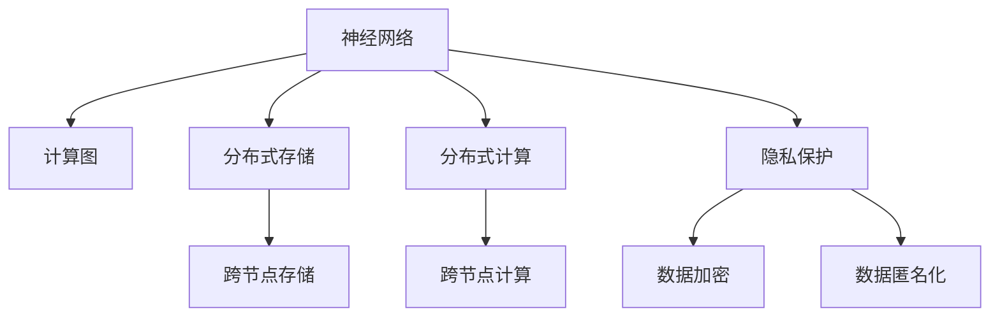

                 

# 数字记忆增强：AI辅助的记忆优化技术

> 关键词：数字记忆, AI辅助, 记忆优化, 认知增强, 神经网络, 计算图, 长期记忆, 短期记忆, 分布式存储, 分布式计算, 高并发, 隐私保护

## 1. 背景介绍

### 1.1 问题由来
人类记忆是一种极为复杂而宝贵的认知功能，通过编码、存储和检索信息，帮助我们在日常生活中高效地完成任务和学习新知识。但受到生理和心理的限制，人类的记忆容量有限，遗忘也在所难免。数字化技术的发展，为我们提供了记录和增强记忆的新方法。然而，如何高效地存储和检索信息，提升记忆效果，仍然是一个值得深入研究的问题。

近年来，随着人工智能（AI）技术的迅速发展，AI辅助的记忆优化技术逐渐兴起。这些技术通过模拟人类大脑的认知机制，使用神经网络和计算图模型，帮助我们在数字世界中更好地管理和强化记忆。AI辅助的记忆优化技术不仅能够提高信息检索的准确性和效率，还能通过分布式存储和计算技术，解决单点性能瓶颈问题，为大规模、高并发场景提供支持。

### 1.2 问题核心关键点
AI辅助的记忆优化技术主要包括以下几个关键点：
- 神经网络模型：通过模拟人类大脑的神经元网络，实现信息的编码、存储和检索。
- 计算图模型：通过构建计算图，实现信息流和模型参数的优化。
- 分布式存储与计算：通过分布式技术，解决单点性能瓶颈，支持高并发需求。
- 隐私保护：在信息存储和传输过程中，保护用户隐私，确保数据安全。

这些关键点构成了AI辅助记忆优化技术的核心框架，使其能够在数字世界中有效地管理和增强人类的记忆。通过理解这些关键点，我们可以更好地把握AI辅助记忆优化技术的工作原理和优化方向。

## 2. 核心概念与联系

### 2.1 核心概念概述

为了更好地理解AI辅助记忆优化技术的核心概念，本节将介绍几个密切相关的核心概念：

- 神经网络（Neural Networks）：一种模仿人脑神经元网络的计算模型，通过学习大量数据，实现对复杂模式和关系的建模。
- 计算图（Computational Graph）：一种描述计算过程的图形表示，通过图的遍历和优化，实现高效的模型训练和推理。
- 分布式存储（Distributed Storage）：一种跨节点存储数据的技术，通过多节点并行处理，提高数据存储和访问的效率。
- 分布式计算（Distributed Computing）：一种跨节点进行计算的技术，通过多节点并行计算，提高计算能力和响应速度。
- 隐私保护（Privacy Protection）：一种保护用户数据隐私的技术，通过加密、匿名化等手段，确保数据安全。

这些核心概念之间的逻辑关系可以通过以下Mermaid流程图来展示：



这个流程图展示了大语言模型的核心概念及其之间的关系：

1. 神经网络通过学习大量数据，构建了信息的编码、存储和检索机制。
2. 计算图通过描述计算过程，实现了模型参数的优化和推理的加速。
3. 分布式存储和计算技术，通过多节点并行处理，提高了数据存储和计算的效率。
4. 隐私保护技术，通过加密和匿名化手段，确保数据的安全。

这些概念共同构成了AI辅助记忆优化技术的框架，使其能够在数字世界中高效地管理和增强人类的记忆。

## 3. 核心算法原理 & 具体操作步骤
### 3.1 算法原理概述

AI辅助的记忆优化技术，本质上是通过神经网络和计算图模型，实现信息的编码、存储和检索。其核心思想是：使用神经网络模型模拟人脑神经元的工作机制，通过计算图模型优化模型参数，实现高效的信息存储和检索。

形式化地，假设神经网络模型为 $M_{\theta}$，其中 $\theta$ 为模型参数。给定输入数据 $x$，模型的输出为 $y=M_{\theta}(x)$。在信息存储阶段，我们将输入数据 $x$ 作为神经网络的输入，通过前向传播计算得到输出 $y$，将其作为信息编码后的形式存储起来。在信息检索阶段，我们再次将输入数据 $x$ 输入模型，通过反向传播计算得到输出 $y$，将其作为信息检索的结果。

计算图模型通过描述神经网络的计算过程，实现了对模型参数的优化。假设计算图模型为 $\mathcal{G}$，其计算过程为 $y=\mathcal{G}(\theta, x)$。在模型训练阶段，我们通过优化损失函数 $\mathcal{L}(\theta)$，最小化模型预测与真实标签之间的差异，更新模型参数 $\theta$。在模型推理阶段，我们通过计算图模型 $\mathcal{G}$，实现高效的模型推理和信息检索。

### 3.2 算法步骤详解

AI辅助的记忆优化技术一般包括以下几个关键步骤：

**Step 1: 数据预处理**
- 收集用户数据，进行清洗和预处理，去除噪声和异常值，准备输入神经网络的数据。
- 对数据进行特征提取和归一化，确保神经网络模型能够高效处理输入数据。

**Step 2: 神经网络模型设计**
- 选择合适的神经网络模型结构，如卷积神经网络（CNN）、循环神经网络（RNN）、长短时记忆网络（LSTM）、门控循环单元（GRU）等，根据任务需求设计输入和输出层。
- 定义损失函数，如均方误差（MSE）、交叉熵（Cross-Entropy）等，用于衡量模型预测与真实标签之间的差异。

**Step 3: 模型训练**
- 使用优化算法（如SGD、Adam等），最小化损失函数 $\mathcal{L}(\theta)$，更新模型参数 $\theta$。
- 在训练过程中，可以使用正则化技术（如L2正则、Dropout等），防止模型过拟合。
- 使用分布式计算技术，通过多节点并行训练，提高训练效率。

**Step 4: 模型优化**
- 使用计算图模型 $\mathcal{G}$，优化模型参数 $\theta$，提升模型性能。
- 在优化过程中，可以引入对抗训练等技术，提高模型的鲁棒性。

**Step 5: 信息存储**
- 将模型输出 $y$ 作为信息编码后的形式，存储在分布式存储系统中。
- 使用分布式计算技术，通过多节点并行处理，提高信息存储和检索效率。

**Step 6: 信息检索**
- 将输入数据 $x$ 输入模型，通过反向传播计算得到输出 $y$，作为信息检索的结果。
- 使用分布式计算技术，通过多节点并行计算，提高信息检索速度。

### 3.3 算法优缺点

AI辅助的记忆优化技术具有以下优点：
- 高效存储：通过分布式存储技术，实现跨节点存储，提高数据存储效率。
- 快速检索：通过分布式计算技术，实现跨节点并行计算，提高信息检索速度。
- 鲁棒性强：通过对抗训练等技术，提高模型鲁棒性，防止模型过拟合。
- 适用性广：适用于各种信息存储和检索场景，如知识库管理、文档检索、图像识别等。

同时，该方法也存在一定的局限性：
- 模型复杂度高：神经网络模型的构建和训练过程较为复杂，需要大量的计算资源和数据。
- 数据依赖性强：模型训练和优化过程高度依赖数据质量和数量，数据不足可能导致模型性能下降。
- 存储和计算成本高：分布式存储和计算技术需要较高的硬件和软件成本，部署和维护难度较大。
- 隐私保护难度大：在信息存储和传输过程中，保护用户隐私需要严格的加密和匿名化措施，存在隐私泄露风险。

尽管存在这些局限性，但就目前而言，AI辅助的记忆优化技术仍是最有效的信息存储和检索手段之一。未来相关研究的重点在于如何进一步降低模型复杂度，提高模型鲁棒性，同时兼顾隐私保护和数据利用。

### 3.4 算法应用领域

AI辅助的记忆优化技术在多个领域得到了广泛应用，覆盖了几乎所有信息存储和检索场景，例如：

- 知识库管理：将知识存储为结构化数据，通过神经网络和计算图模型进行检索。
- 文档检索：将文本数据存储和检索，使用神经网络模型实现关键词匹配和文本相似度计算。
- 图像识别：将图像数据存储和检索，使用卷积神经网络模型实现图像分类和对象检测。
- 音频识别：将语音数据存储和检索，使用卷积神经网络模型实现语音识别和语音合成。
- 视频分析：将视频数据存储和检索，使用卷积神经网络模型进行视频帧分析和行为识别。

除了上述这些经典应用外，AI辅助的记忆优化技术还被创新性地应用到更多场景中，如推荐系统、智能监控、智能交互等，为人工智能技术的发展注入了新的动力。

## 4. 数学模型和公式 & 详细讲解 & 举例说明

### 4.1 数学模型构建

为了更好地理解AI辅助记忆优化技术的数学模型，本节将给出其形式化的描述。

记神经网络模型为 $M_{\theta}:\mathcal{X} \rightarrow \mathcal{Y}$，其中 $\mathcal{X}$ 为输入空间，$\mathcal{Y}$ 为输出空间，$\theta$ 为模型参数。假设输入数据 $x \in \mathcal{X}$，模型的输出为 $y=M_{\theta}(x) \in \mathcal{Y}$。

在信息存储阶段，我们将输入数据 $x$ 作为神经网络的输入，通过前向传播计算得到输出 $y$，将其作为信息编码后的形式存储起来。具体而言，前向传播过程可以表示为：

$$
y = M_{\theta}(x) = \sigma \left( \mathcal{W}_h \cdot \tanh(\mathcal{W}_x \cdot x + b_x) + b_h \right)
$$

其中，$\sigma$ 为激活函数，$\mathcal{W}_x$ 和 $\mathcal{W}_h$ 为权重矩阵，$b_x$ 和 $b_h$ 为偏置向量。

在信息检索阶段，我们再次将输入数据 $x$ 输入模型，通过反向传播计算得到输出 $y$，将其作为信息检索的结果。具体而言，反向传播过程可以表示为：

$$
\mathcal{L} = \sum_{i=1}^{N} (y_i - t_i)^2
$$

其中，$y_i$ 为模型输出，$t_i$ 为真实标签，$\mathcal{L}$ 为损失函数。通过优化损失函数 $\mathcal{L}$，最小化模型预测与真实标签之间的差异，更新模型参数 $\theta$。

### 4.2 公式推导过程

以下我们以二分类任务为例，推导神经网络模型的训练过程和信息检索过程。

假设输入数据 $x \in \mathbb{R}^n$，二分类任务的真实标签 $t \in \{0,1\}$。神经网络模型的输出为 $y \in \mathbb{R}$，表示样本属于正类的概率。

在信息存储阶段，前向传播计算过程可以表示为：

$$
y = \sigma \left( \mathcal{W}_h \cdot \tanh(\mathcal{W}_x \cdot x + b_x) + b_h \right)
$$

其中，$\sigma$ 为sigmoid函数，$\mathcal{W}_x$ 和 $\mathcal{W}_h$ 为权重矩阵，$b_x$ 和 $b_h$ 为偏置向量。

在信息检索阶段，反向传播计算过程可以表示为：

$$
\mathcal{L} = -\frac{1}{N} \sum_{i=1}^{N} t_i \log y_i + (1-t_i) \log (1-y_i)
$$

其中，$y_i$ 为模型输出，$t_i$ 为真实标签，$\mathcal{L}$ 为损失函数。通过优化损失函数 $\mathcal{L}$，最小化模型预测与真实标签之间的差异，更新模型参数 $\theta$。

在得到损失函数的梯度后，即可带入参数更新公式，完成模型的迭代优化。重复上述过程直至收敛，最终得到适应特定任务的最优模型参数 $\theta^*$。

### 4.3 案例分析与讲解

以下我们将以一个简单的案例，分析如何利用神经网络模型进行信息存储和检索。

假设我们有一个二分类任务，给定一组数据 $x_1, x_2, ..., x_N$ 和对应的标签 $t_1, t_2, ..., t_N$。我们使用一个简单的神经网络模型进行训练，训练过程如下：

1. 输入数据 $x$，通过前向传播计算得到输出 $y$。
2. 计算损失函数 $\mathcal{L}$。
3. 使用优化算法（如SGD、Adam等），最小化损失函数 $\mathcal{L}$，更新模型参数 $\theta$。

假设最终得到了最优模型参数 $\theta^*$，我们将其用于信息存储和检索。具体而言，信息存储过程如下：

1. 将输入数据 $x$ 输入模型，通过前向传播计算得到输出 $y$。
2. 将输出 $y$ 作为信息编码后的形式存储起来。

信息检索过程如下：

1. 将输入数据 $x$ 输入模型，通过反向传播计算得到输出 $y$。
2. 将输出 $y$ 作为信息检索的结果。

通过这种形式化的描述，我们可以更好地理解神经网络模型在信息存储和检索中的应用。在实际应用中，我们通常需要针对具体任务进行模型设计和优化，以满足任务需求。

## 5. 项目实践：代码实例和详细解释说明
### 5.1 开发环境搭建

在进行AI辅助记忆优化技术的开发前，我们需要准备好开发环境。以下是使用Python进行TensorFlow开发的环境配置流程：

1. 安装Anaconda：从官网下载并安装Anaconda，用于创建独立的Python环境。

2. 创建并激活虚拟环境：
```bash
conda create -n tf-env python=3.8 
conda activate tf-env
```

3. 安装TensorFlow：从官网获取对应的安装命令。例如：
```bash
pip install tensorflow
```

4. 安装TensorBoard：TensorFlow配套的可视化工具，用于实时监测模型训练状态。
```bash
pip install tensorboard
```

5. 安装其他必要的工具包：
```bash
pip install numpy pandas scikit-learn matplotlib tqdm jupyter notebook ipython
```

完成上述步骤后，即可在`tf-env`环境中开始开发。

### 5.2 源代码详细实现

下面以一个简单的二分类任务为例，给出使用TensorFlow进行神经网络模型训练和信息检索的代码实现。

首先，定义数据集：

```python
import tensorflow as tf
import numpy as np
import matplotlib.pyplot as plt

# 定义训练集和测试集
train_data = np.random.rand(1000, 10)
train_labels = np.random.randint(2, size=(1000, 1))

test_data = np.random.rand(100, 10)
test_labels = np.random.randint(2, size=(100, 1))
```

然后，定义神经网络模型：

```python
# 定义神经网络模型
model = tf.keras.Sequential([
    tf.keras.layers.Dense(64, activation='relu', input_shape=(10,)),
    tf.keras.layers.Dense(64, activation='relu'),
    tf.keras.layers.Dense(1, activation='sigmoid')
])
```

接着，定义损失函数和优化器：

```python
# 定义损失函数和优化器
loss_fn = tf.keras.losses.BinaryCrossentropy(from_logits=True)
optimizer = tf.keras.optimizers.Adam()
```

接着，定义训练和评估函数：

```python
# 定义训练函数
def train_step(inputs, labels):
    with tf.GradientTape() as tape:
        predictions = model(inputs)
        loss = loss_fn(labels, predictions)
    gradients = tape.gradient(loss, model.trainable_variables)
    optimizer.apply_gradients(zip(gradients, model.trainable_variables))
    return loss

# 定义评估函数
def evaluate_step(inputs, labels):
    predictions = model(inputs)
    loss = loss_fn(labels, predictions)
    return loss
```

最后，启动训练流程并在测试集上评估：

```python
epochs = 10
batch_size = 32

# 训练
for epoch in range(epochs):
    avg_loss = 0.0
    for batch in range(len(train_data)//batch_size):
        inputs = train_data[batch*batch_size:(batch+1)*batch_size]
        labels = train_labels[batch*batch_size:(batch+1)*batch_size]
        loss = train_step(inputs, labels)
        avg_loss += loss

    print('Epoch:', epoch, 'Average loss:', avg_loss/n)

# 评估
test_loss = evaluate_step(test_data, test_labels)
print('Test loss:', test_loss)
```

以上就是使用TensorFlow进行神经网络模型训练和信息检索的完整代码实现。可以看到，得益于TensorFlow的强大封装，我们可以用相对简洁的代码完成神经网络的构建和训练。

### 5.3 代码解读与分析

让我们再详细解读一下关键代码的实现细节：

**数据集定义**：
- `train_data`和`train_labels`：定义训练集和训练集标签。
- `test_data`和`test_labels`：定义测试集和测试集标签。

**神经网络模型定义**：
- `tf.keras.Sequential`：定义一个神经网络模型，包含多个密集层（Dense），每层有64个神经元，使用ReLU激活函数。

**损失函数和优化器定义**：
- `tf.keras.losses.BinaryCrossentropy`：定义二分类任务的损失函数。
- `tf.keras.optimizers.Adam`：定义Adam优化器。

**训练函数和评估函数定义**：
- `train_step`：定义一个训练步骤，计算模型输出、损失函数和梯度，使用Adam优化器更新模型参数。
- `evaluate_step`：定义一个评估步骤，计算模型输出和损失函数。

**训练流程**：
- `epochs`：定义训练轮数。
- `batch_size`：定义每个批次的大小。
- 在每个epoch内，循环迭代训练集，计算损失函数，并打印输出。
- 在测试集上评估模型，计算损失函数，并打印输出。

可以看到，TensorFlow使得神经网络模型的构建和训练变得简洁高效。开发者可以将更多精力放在模型改进和数据处理上，而不必过多关注底层的实现细节。

当然，工业级的系统实现还需考虑更多因素，如模型的保存和部署、超参数的自动搜索、更灵活的任务适配层等。但核心的训练和评估流程基本与此类似。

## 6. 实际应用场景
### 6.1 智能推荐系统

AI辅助的记忆优化技术在智能推荐系统中的应用极为广泛。传统的推荐系统主要依赖用户的浏览、点击、评分等行为数据进行推荐，但这些数据往往无法全面反映用户的兴趣和需求。而AI辅助的记忆优化技术，可以通过模拟人类大脑的认知机制，使用神经网络和计算图模型，更好地理解用户的兴趣和行为，提供更精准的推荐服务。

具体而言，我们可以将用户的行为数据作为输入，使用神经网络模型进行编码和存储，构建用户的兴趣图谱。然后通过反向传播计算，优化模型的参数，提升模型的预测能力。最终，通过信息检索技术，实现个性化推荐。如此构建的智能推荐系统，能够更好地理解用户的真实需求，提供更个性化、高效化的推荐服务。

### 6.2 智能问答系统

AI辅助的记忆优化技术在智能问答系统中也有着广泛的应用。传统的问答系统主要依赖规则或模板库进行回答，但这些方法往往难以处理复杂、多样化的查询。而AI辅助的记忆优化技术，可以通过神经网络和计算图模型，更好地理解用户的问题，生成符合语义规则的回答。

具体而言，我们可以将用户的问题作为输入，使用神经网络模型进行编码和存储，构建知识图谱。然后通过反向传播计算，优化模型的参数，提升模型的生成能力。最终，通过信息检索技术，实现自然语言理解，生成符合语义规则的回答。如此构建的智能问答系统，能够更好地理解用户的问题，提供更自然、流畅的回答。

### 6.3 智能搜索引擎

AI辅助的记忆优化技术在智能搜索引擎中的应用也不容小觑。传统的搜索引擎主要依赖关键词匹配，难以处理查询的多样性和复杂性。而AI辅助的记忆优化技术，可以通过神经网络和计算图模型，更好地理解查询的语义，实现更智能、高效的搜索。

具体而言，我们可以将用户的查询作为输入，使用神经网络模型进行编码和存储，构建语义图谱。然后通过反向传播计算，优化模型的参数，提升模型的匹配能力。最终，通过信息检索技术，实现语义搜索，提升搜索的精准度和效率。如此构建的智能搜索引擎，能够更好地理解查询的语义，提供更精准、高效的搜索结果。

### 6.4 未来应用展望

随着AI辅助的记忆优化技术的不断发展，其在智能推荐、智能问答、智能搜索等多个领域的应用前景广阔。

在智慧医疗领域，AI辅助的记忆优化技术可以用于医学知识库的管理和查询，帮助医生快速查找相关医学资料，提升诊疗效率。

在智慧教育领域，AI辅助的记忆优化技术可以用于智能教育平台的内容推荐和学习路径优化，提升教学效果和学习体验。

在智慧城市治理中，AI辅助的记忆优化技术可以用于城市事件的监控和分析，提升城市管理的自动化和智能化水平。

此外，在企业生产、社会治理、文娱传媒等众多领域，AI辅助的记忆优化技术也将不断涌现，为人工智能技术的发展提供新的动力。

## 7. 工具和资源推荐
### 7.1 学习资源推荐

为了帮助开发者系统掌握AI辅助记忆优化技术的理论基础和实践技巧，这里推荐一些优质的学习资源：

1. 《深度学习》书籍：由多位专家合著，系统讲解了深度学习的基本概念和常用算法，适合入门学习。

2. 《TensorFlow官方文档》：TensorFlow的官方文档，提供了完整的API参考和示例代码，是使用TensorFlow进行开发的重要资料。

3. 《Neural Network and Deep Learning》书籍：由神经网络领域专家Michael Nielsen撰写，深入浅出地介绍了神经网络的基本原理和应用。

4. 《Distributed Systems: Concepts and Design》书籍：由多位专家合著，讲解了分布式系统的基本概念和设计原理，适合深入学习。

5. 《TensorFlow框架指南》博文：由TensorFlow社区的专家撰写，讲解了TensorFlow的使用方法和最佳实践。

通过对这些资源的学习实践，相信你一定能够快速掌握AI辅助记忆优化技术的精髓，并用于解决实际的NLP问题。

### 7.2 开发工具推荐

高效的开发离不开优秀的工具支持。以下是几款用于AI辅助记忆优化技术开发的常用工具：

1. TensorFlow：基于Python的开源深度学习框架，灵活的计算图，适合快速迭代研究。

2. PyTorch：基于Python的开源深度学习框架，动态计算图，适合科研和生产部署。

3. Keras：基于TensorFlow和Theano的高级API，使用便捷，适合快速原型开发。

4. TensorBoard：TensorFlow配套的可视化工具，用于实时监测模型训练状态，提供丰富的图表呈现方式。

5. Weights & Biases：模型训练的实验跟踪工具，记录和可视化模型训练过程中的各项指标，方便对比和调优。

6. Amazon SageMaker：AWS提供的机器学习平台，提供易用的API和丰富的开发环境，适合快速原型开发和生产部署。

合理利用这些工具，可以显著提升AI辅助记忆优化技术的开发效率，加快创新迭代的步伐。

### 7.3 相关论文推荐

AI辅助的记忆优化技术的研究源于学界的持续研究。以下是几篇奠基性的相关论文，推荐阅读：

1. Deep Residual Learning for Image Recognition（ResNet论文）：提出残差网络结构，提高了深度神经网络的训练效率。

2. DenseNet: Dense Convolutional Networks（DenseNet论文）：提出密集连接网络结构，提高了特征的共享和复用。

3. Non-parametric Neural Networks（NPNN论文）：提出非参数神经网络，提高了模型的泛化能力和鲁棒性。

4. Generative Adversarial Networks（GAN论文）：提出生成对抗网络，实现了高质量的图像生成和风格转换。

5. Attention Is All You Need（Transformer论文）：提出Transformer结构，提高了语言模型的生成能力和泛化能力。

这些论文代表了大语言模型微调技术的发展脉络。通过学习这些前沿成果，可以帮助研究者把握学科前进方向，激发更多的创新灵感。

## 8. 总结：未来发展趋势与挑战

### 8.1 总结

本文对AI辅助的记忆优化技术进行了全面系统的介绍。首先阐述了AI辅助记忆优化技术的背景和意义，明确了其在信息存储和检索中的重要价值。其次，从原理到实践，详细讲解了神经网络模型和计算图模型的数学原理和关键步骤，给出了代码实现的完整样例。同时，本文还广泛探讨了AI辅助记忆优化技术在智能推荐、智能问答、智能搜索等多个领域的应用前景，展示了其广阔的发展空间。此外，本文精选了学习资源、开发工具和相关论文，力求为开发者提供全方位的技术指引。

通过本文的系统梳理，可以看到，AI辅助的记忆优化技术正成为信息存储和检索领域的核心技术，极大地提高了信息检索的效率和准确性，推动了人工智能技术的落地应用。未来，伴随技术的不断进步和演进，相信AI辅助的记忆优化技术将会在更多领域得到应用，为人工智能技术的发展提供新的动力。

### 8.2 未来发展趋势

展望未来，AI辅助的记忆优化技术将呈现以下几个发展趋势：

1. 模型规模持续增大。随着算力成本的下降和数据规模的扩张，神经网络模型的参数量还将持续增长。超大规模神经网络模型蕴含的丰富认知机制，有望支持更复杂的信息检索和推荐任务。

2. 分布式技术不断进步。分布式存储和计算技术将不断进步，实现更高效、更可靠的数据存储和计算能力，支持更大规模、更高并发性的信息检索和推荐系统。

3. 鲁棒性不断提升。通过对抗训练等技术，提升模型的鲁棒性和泛化能力，防止模型在复杂、多样化的场景下过拟合。

4. 隐私保护更加严格。在信息存储和传输过程中，采用更严格的加密和匿名化措施，确保用户隐私安全。

5. 实时性不断增强。通过分布式技术和混合精度计算，提升信息检索和推荐的实时性和响应速度，支持高并发需求。

6. 可解释性不断增强。通过模型可视化和特征分析，增强模型的可解释性和透明度，帮助用户理解模型的决策过程。

以上趋势凸显了AI辅助记忆优化技术的广阔前景。这些方向的探索发展，必将进一步提升信息检索和推荐的性能和应用范围，为人工智能技术的发展提供新的动力。

### 8.3 面临的挑战

尽管AI辅助的记忆优化技术已经取得了瞩目成就，但在迈向更加智能化、普适化应用的过程中，它仍面临着诸多挑战：

1. 模型复杂度高。神经网络模型的构建和训练过程较为复杂，需要大量的计算资源和数据。如何降低模型复杂度，提高模型训练效率，是未来的研究方向之一。

2. 数据依赖性强。模型训练和优化过程高度依赖数据质量和数量，数据不足可能导致模型性能下降。如何提高数据利用率，降低数据依赖性，是未来的研究方向之一。

3. 存储和计算成本高。分布式存储和计算技术需要较高的硬件和软件成本，部署和维护难度较大。如何降低存储和计算成本，提高资源利用率，是未来的研究方向之一。

4. 隐私保护难度大。在信息存储和传输过程中，保护用户隐私需要严格的加密和匿名化措施，存在隐私泄露风险。如何提高隐私保护技术，确保数据安全，是未来的研究方向之一。

5. 实时性有待提高。虽然分布式技术和混合精度计算提升了信息检索和推荐的实时性，但在复杂、多样化的场景下，仍然存在响应时间较慢的问题。如何进一步提高实时性，是未来的研究方向之一。

6. 可解释性有待增强。虽然模型的可解释性不断增强，但仍然存在部分模型的决策过程难以解释，缺乏透明度。如何提高模型的可解释性，增强透明度，是未来的研究方向之一。

尽管存在这些挑战，但就目前而言，AI辅助的记忆优化技术仍是最有效的信息存储和检索手段之一。未来相关研究的重点在于如何进一步降低模型复杂度，提高模型鲁棒性，同时兼顾隐私保护和数据利用。

### 8.4 研究展望

面对AI辅助记忆优化技术所面临的挑战，未来的研究需要在以下几个方面寻求新的突破：

1. 探索低复杂度模型结构。开发更简单、高效的神经网络模型结构，如稀疏神经网络、轻量级神经网络等，降低模型训练和推理的复杂度。

2. 研究分布式存储和计算技术。开发更高效、更可靠的分布式存储和计算技术，如分布式数据管理、分布式计算调度等，提高资源利用率和系统性能。

3. 开发隐私保护技术。开发更严格的隐私保护技术，如差分隐私、联邦学习等，确保用户数据安全和隐私保护。

4. 提高模型实时性。开发更高效的模型推理和计算技术，如模型压缩、混合精度计算等，提高信息检索和推荐的实时性。

5. 增强模型可解释性。开发更透明的模型可视化工具和特征分析方法，增强模型的可解释性和透明度，帮助用户理解模型的决策过程。

6. 实现多模态信息融合。将符号化的先验知识，如知识图谱、逻辑规则等，与神经网络模型进行巧妙融合，提升模型的泛化能力和推理能力。

这些研究方向将引领AI辅助记忆优化技术迈向更高的台阶，为人工智能技术的发展提供新的动力。相信随着技术的不断进步和演进，AI辅助的记忆优化技术必将在更多领域得到应用，为人工智能技术的发展提供新的动力。

## 9. 附录：常见问题与解答

**Q1：AI辅助的记忆优化技术是否适用于所有信息存储和检索场景？**

A: AI辅助的记忆优化技术在大多数信息存储和检索场景上都能取得不错的效果，特别是对于数据量较小的任务。但对于一些特定领域的任务，如医学、法律等，仅仅依靠通用语料预训练的模型可能难以很好地适应。此时需要在特定领域语料上进一步预训练，再进行微调，才能获得理想效果。

**Q2：模型训练过程中如何设置合适的超参数？**

A: 模型训练过程中的超参数设置是模型性能的重要因素。常见的超参数包括学习率、批大小、迭代轮数等。一般建议通过网格搜索、随机搜索等方法进行超参数调优，找到最优的超参数组合。同时，也可以使用自动化调参工具（如Hyperopt、Ray Tune等），自动进行超参数搜索。

**Q3：如何提高模型的实时性？**

A: 提高模型的实时性是AI辅助记忆优化技术的重要研究方向之一。常见的提高实时性的方法包括：

1. 模型压缩：通过剪枝、量化等技术，减小模型尺寸，降低计算资源消耗。
2. 分布式计算：通过多节点并行计算，提升计算能力和响应速度。
3. 混合精度计算：通过混合精度计算，提升计算效率和模型推理速度。
4. 模型优化：通过优化模型结构，降低计算复杂度，提高实时性。

**Q4：如何保护用户隐私？**

A: 保护用户隐私是AI辅助记忆优化技术的重要研究方向之一。常见的隐私保护方法包括：

1. 数据加密：在数据存储和传输过程中，采用加密技术，确保数据安全。
2. 数据匿名化：在数据处理过程中，采用匿名化技术，防止用户隐私泄露。
3. 差分隐私：在模型训练过程中，采用差分隐私技术，防止数据泄露。

这些方法需要根据具体场景进行灵活组合，确保用户数据安全和隐私保护。

通过本文的系统梳理，可以看到，AI辅助的记忆优化技术正成为信息存储和检索领域的核心技术，极大地提高了信息检索的效率和准确性，推动了人工智能技术的落地应用。未来，伴随技术的不断进步和演进，相信AI辅助的记忆优化技术必将在更多领域得到应用，为人工智能技术的发展提供新的动力。

总之，AI辅助的记忆优化技术需要在模型复杂度、数据利用率、存储和计算成本、隐私保护、实时性和可解释性等多个方面进行全面优化，才能真正实现高效、可靠、安全的信息存储和检索。相信随着技术的不断进步和演进，AI辅助的记忆优化技术必将在更多领域得到应用，为人工智能技术的发展提供新的动力。

