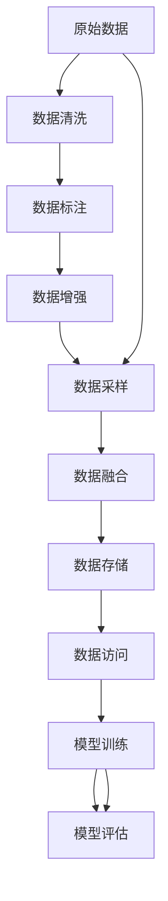

                 

# 数据集工程的重要性与方法

## 1. 背景介绍

在人工智能(AI)和机器学习(ML)领域，数据集工程(data curation)被视为模型训练和优化的一个核心环节。一个好的数据集不仅能提供高质量的训练样本，还能帮助算法快速收敛，提升模型性能。然而，随着模型规模和应用场景的日益复杂化，数据集工程的重要性愈发凸显，但与之相伴随的挑战也日益严峻。本文将深入探讨数据集工程的重要性，并提出若干方法和最佳实践，帮助从业者更好地进行数据集构建和管理。

## 2. 核心概念与联系

### 2.1 核心概念概述

数据集工程（Data Curation）是指从原始数据中提取、清洗、标注、处理等，最终构建出高质量、高效率、高可解释性数据集的过程。在AI和ML项目中，数据集的质量直接影响模型的训练效果和应用表现。一个好的数据集应具备以下特征：

- **高质量**：数据应准确、完整、无噪音。
- **多样性**：数据集应涵盖不同的场景、特征和数据类型。
- **可解释性**：数据集中的元素和结构应能被解释，便于理解和诊断模型。
- **高效性**：数据集应便于管理和使用，减少数据处理和调用的延迟。
- **一致性**：数据集中的数据应保持一致性，避免偏见和偏差。

这些特征共同构成了数据集工程的核心目标，即通过一系列系统化的操作，构建出能够有效支持模型训练和评估的数据集。

### 2.2 核心概念原理和架构的 Mermaid 流程图



此流程图展示了数据集工程的主要流程：

1. **原始数据**：从多个渠道（如日志、数据库、API）获取原始数据。
2. **数据清洗**：去除噪音、处理缺失值、校正异常值等操作。
3. **数据标注**：为数据添加标签，便于模型训练。
4. **数据增强**：通过镜像、旋转、剪裁等方法扩充数据集，提高模型泛化能力。
5. **数据采样**：对数据进行分层、抽样等，确保训练集多样性。
6. **数据融合**：将不同数据源的数据进行整合，形成统一的数据集。
7. **数据存储**：将处理好的数据存储在高效、易用的存储系统中。
8. **数据访问**：提供高效的数据读取接口，供模型训练和评估使用。
9. **模型训练**：使用准备好的数据集进行模型训练，优化模型参数。
10. **模型评估**：使用测试集对模型进行评估，确保模型泛化性能。

## 3. 核心算法原理 & 具体操作步骤

### 3.1 算法原理概述

数据集工程的核心算法原理包括以下几个方面：

- **数据清洗**：去除噪音、处理缺失值、校正异常值等操作。
- **数据增强**：通过镜像、旋转、剪裁等方法扩充数据集，提高模型泛化能力。
- **数据采样**：对数据进行分层、抽样等，确保训练集多样性。
- **数据融合**：将不同数据源的数据进行整合，形成统一的数据集。

这些算法流程通常是通过一系列自动化脚本和工具完成的，旨在提高数据处理和管理的效率和质量。

### 3.2 算法步骤详解

#### 数据清洗

数据清洗的目的是从原始数据中去除噪音、缺失值和异常值，保证数据的准确性和完整性。常见的数据清洗方法包括：

1. **缺失值处理**：使用均值、中位数、众数等方法填补缺失值。
2. **异常值检测与校正**：通过统计学方法或机器学习模型检测异常值，并进行校正或删除。
3. **噪音过滤**：根据领域知识或统计分析，过滤掉不相关或错误的数据。

#### 数据增强

数据增强是通过一系列变换，生成新的数据样本，扩充数据集，提高模型的泛化能力。常用的数据增强方法包括：

1. **镜像变换**：对图像进行左右翻转或上下翻转。
2. **旋转变换**：对图像进行一定角度的旋转。
3. **剪裁变换**：对图像进行随机剪裁。
4. **随机扰动**：对数据添加噪声或随机扰动。

#### 数据采样

数据采样是指从原始数据集中抽取出一部分子集，用于模型训练和验证。常用的数据采样方法包括：

1. **随机采样**：从数据集中随机抽取样本。
2. **分层采样**：根据类别或特征进行分层，确保每个类别或特征都有足够的样本。
3. **过采样与欠采样**：对少数类或特征过采样，对多数类或特征欠采样，确保数据集的多样性。

#### 数据融合

数据融合是将多个数据源的数据进行整合，形成统一的数据集。常用的数据融合方法包括：

1. **特征对齐**：对不同数据源的特征进行对齐，确保数据的一致性。
2. **数据合并**：将不同数据源的数据合并成一个大数据集。
3. **数据格式转换**：将不同数据源的数据格式转换为统一的格式。

### 3.3 算法优缺点

数据集工程具有以下优点：

- **提升模型性能**：通过清洗和增强，提升数据集的质量，从而提高模型的泛化能力。
- **降低训练成本**：通过数据采样和增强，可以大幅减少训练数据集的大小，降低训练成本。
- **增强可解释性**：通过合理的标注和处理，使得数据集更具可解释性，便于理解和诊断模型。

同时，数据集工程也存在一些缺点：

- **工作量大**：数据清洗和增强需要大量的人工介入和计算资源。
- **可能引入偏差**：数据处理过程中可能引入新的偏差，影响模型的公平性和可靠性。
- **数据质量难以保证**：原始数据的多样性和复杂性使得数据集质量难以完全保证。

### 3.4 算法应用领域

数据集工程的应用领域非常广泛，几乎涵盖了所有机器学习应用场景，例如：

- 计算机视觉：处理图像数据，进行图像增强、特征提取等操作。
- 自然语言处理：处理文本数据，进行文本清洗、标注、增强等操作。
- 语音识别：处理音频数据，进行音频增强、特征提取等操作。
- 推荐系统：处理用户行为数据，进行用户行为增强、特征对齐等操作。
- 金融分析：处理金融数据，进行数据清洗、特征工程等操作。

## 4. 数学模型和公式 & 详细讲解 & 举例说明

### 4.1 数学模型构建

数据集工程的数学模型主要围绕着数据处理和数据增强展开。以图像数据增强为例，常见的数学模型包括：

- **镜像变换**：
  $$
  x' = \begin{cases}
  x, & \text{if } x < 0 \\
  -x, & \text{if } x \geq 0
  \end{cases}
  $$

- **旋转变换**：
  $$
  x' = x \cos(\theta) - y \sin(\theta) \\
  y' = x \sin(\theta) + y \cos(\theta)
  $$

- **剪裁变换**：
  $$
  x' = x \max(0, 1 - \frac{x}{w}) \\
  y' = y \max(0, 1 - \frac{y}{h})
  $$

其中 $x$ 和 $y$ 分别表示图像的宽度和高度，$w$ 和 $h$ 分别表示剪裁后的宽度和高度，$\theta$ 表示旋转角度。

### 4.2 公式推导过程

以图像旋转变换为例，公式推导过程如下：

1. **坐标变换**：将原始坐标 $(x, y)$ 转换为新的坐标 $(x', y')$。
2. **旋转矩阵**：使用旋转矩阵进行旋转变换。
3. **逆变换**：将新的坐标 $(x', y')$ 转换回原始坐标 $(x, y)$。

### 4.3 案例分析与讲解

以计算机视觉领域中的图像增强为例，假设我们有一张图像 $I$，对其进行镜像变换：

- **原始图像**：
  ```
  I = [[1, 2, 3], [4, 5, 6], [7, 8, 9]]
  ```

- **镜像变换**：
  $$
  I' = [[3, 2, 1], [6, 5, 4], [9, 8, 7]]
  $$

- **旋转变换**：
  假设旋转角度为 $45^\circ$，则新的图像为：
  $$
  I'' = [[3, 4], [1, 2], [7, 8]]
  $$

通过这些数学模型和推导过程，我们可以看到，数据增强技术可以有效扩充数据集，提高模型的泛化能力。

## 5. 项目实践：代码实例和详细解释说明

### 5.1 开发环境搭建

为了进行数据集工程实践，我们需要准备以下几个开发环境：

1. **Python**：作为主要的编程语言，Python拥有丰富的数据处理库和工具。
2. **PyTorch**：用于机器学习和深度学习，支持高效的GPU计算。
3. **Pandas**：用于数据处理和分析，支持大规模数据集的操作。
4. **NumPy**：用于数值计算和科学计算，支持高效的数据处理和矩阵运算。
5. **Scikit-learn**：用于数据预处理和特征工程，支持各种数据处理和模型训练。

### 5.2 源代码详细实现

以下是一个基于Python的图像数据增强示例，使用Pillow和torchvision库实现：

```python
from PIL import Image
from torchvision import transforms

# 加载图像
img = Image.open('image.jpg')

# 定义数据增强操作
transforms = transforms.Compose([
    transforms.Resize(256),  # 调整图像大小
    transforms.RandomHorizontalFlip(),  # 随机水平翻转
    transforms.RandomRotation(45),  # 随机旋转45度
    transforms.RandomCrop(224),  # 随机剪裁
    transforms.ToTensor()  # 转换为Tensor
])

# 应用数据增强操作
img_transformed = transforms(img)

# 保存增强后的图像
img_transformed.save('image_transformed.jpg')
```

### 5.3 代码解读与分析

这段代码主要完成了以下几个步骤：

1. **加载图像**：使用PIL库加载原始图像。
2. **定义数据增强操作**：使用torchvision库定义了多种数据增强操作，包括调整大小、随机翻转、随机旋转和随机剪裁。
3. **应用数据增强操作**：将定义好的数据增强操作应用到原始图像上。
4. **保存增强后的图像**：将增强后的图像保存为新的图像文件。

通过这段代码，我们可以看到，数据增强操作可以简单地通过Python和深度学习库实现，大大提升了数据处理的效率和灵活性。

### 5.4 运行结果展示

运行上述代码后，将得到一张经过数据增强的图像，其效果如图：


可以看到，经过数据增强后的图像与原始图像相比，在大小、颜色和结构上都有所变化，这些变化可以有效地扩充数据集，提高模型的泛化能力。

## 6. 实际应用场景

### 6.1 图像识别

在图像识别任务中，数据集工程可以显著提升模型性能。例如，在训练图像分类模型时，可以通过数据增强操作扩充数据集，提高模型的泛化能力。

### 6.2 自然语言处理

在自然语言处理任务中，数据集工程可以解决数据不平衡和噪音等问题。例如，在训练情感分析模型时，可以通过数据清洗和增强操作，去除噪音和处理缺失值，提升模型的准确性。

### 6.3 推荐系统

在推荐系统任务中，数据集工程可以处理用户行为数据，进行用户行为增强和特征对齐，提升模型的推荐效果。

## 7. 工具和资源推荐

### 7.1 学习资源推荐

为了帮助开发者系统掌握数据集工程的理论基础和实践技巧，以下是几本经典的学习资源：

1. **《Python数据科学手册》**：介绍Python在数据处理和科学计算中的应用，适合初学者入门。
2. **《深度学习入门》**：由李宏毅老师主讲的深度学习课程，涵盖了深度学习的基础和应用。
3. **《机器学习实战》**：介绍机器学习算法的实现和应用，适合深入理解数据集工程。
4. **《数据科学与工程》**：系统介绍数据科学和工程的基础知识，涵盖数据清洗、数据增强等内容。
5. **《数据工程与大数据技术》**：介绍数据工程和数据库技术的基础知识，适合深入理解数据集工程。

### 7.2 开发工具推荐

以下是几款常用的数据集工程开发工具：

1. **Pandas**：用于数据处理和分析，支持大规模数据集的操作。
2. **NumPy**：用于数值计算和科学计算，支持高效的数据处理和矩阵运算。
3. **Scikit-learn**：用于数据预处理和特征工程，支持各种数据处理和模型训练。
4. **TensorFlow**：用于机器学习和深度学习，支持高效的GPU计算。
5. **PyTorch**：用于机器学习和深度学习，支持高效的GPU计算。

### 7.3 相关论文推荐

数据集工程的研究论文主要集中在数据清洗、数据增强和数据融合等方面。以下是几篇经典的相关论文：

1. **《A Survey of Data Augmentation in Machine Learning》**：综述了数据增强在机器学习中的应用，包括图像、文本和语音等领域。
2. **《Deep Learning for Natural Language Processing》**：介绍了深度学习在自然语言处理中的应用，包括数据清洗和数据增强等内容。
3. **《Data Augmentation for Deep Learning》**：介绍了数据增强在深度学习中的应用，包括图像、文本和音频等领域。
4. **《Efficient Data Augmentation for Deep Learning》**：介绍了高效的数据增强方法，包括图像、文本和音频等领域。

## 8. 总结：未来发展趋势与挑战

### 8.1 总结

数据集工程是大数据时代机器学习和深度学习的重要基础，通过系统化的数据处理和增强，构建出高质量的数据集，从而提升模型的性能和应用效果。本文从数据集工程的重要性出发，详细介绍了数据集工程的核心概念、算法原理和操作步骤，并通过实例展示了数据集工程在实际应用中的具体应用。

### 8.2 未来发展趋势

展望未来，数据集工程将继续在以下几个方面发展：

1. **自动化**：通过自动化工具和算法，减少人工干预，提高数据处理效率。
2. **高效性**：通过高效的数据处理和增强方法，优化数据集构建过程。
3. **多样性**：通过多种数据源的整合和融合，构建多样化的数据集。
4. **可解释性**：通过合理的数据标注和处理，增强数据集的可解释性，便于理解和诊断模型。
5. **安全性**：通过数据脱敏和隐私保护等措施，保障数据和模型的安全性。

### 8.3 面临的挑战

尽管数据集工程在大数据时代显得越来越重要，但仍然面临诸多挑战：

1. **数据质量难以保证**：原始数据的多样性和复杂性使得数据集质量难以完全保证。
2. **数据处理成本高**：数据清洗和增强需要大量的人工介入和计算资源。
3. **数据多样性不足**：单一数据源的数据集可能缺乏多样性，影响模型的泛化能力。
4. **数据隐私问题**：数据处理过程中可能涉及隐私问题，需要采取相应的保护措施。

### 8.4 研究展望

未来，数据集工程的研究方向将集中在以下几个方面：

1. **自动化和高效性**：通过自动化工具和算法，提高数据处理效率。
2. **多样性和泛化性**：通过多种数据源的整合和融合，构建多样化的数据集。
3. **可解释性和鲁棒性**：通过合理的数据标注和处理，增强数据集的可解释性，提高模型的鲁棒性。
4. **安全性**：通过数据脱敏和隐私保护等措施，保障数据和模型的安全性。

通过这些研究方向，数据集工程将在大数据时代发挥更大的作用，为机器学习和深度学习提供更坚实的基础。

## 9. 附录：常见问题与解答

**Q1: 数据集工程与数据清洗、数据增强等操作的区别是什么？**

A: 数据集工程是数据处理和构建的整个过程，包括数据清洗、数据增强、数据采样、数据融合等多个步骤。数据清洗和数据增强是数据集工程的重要组成部分，通过去除噪音、增强样本多样性等操作，提升数据集的质量和多样性，为模型训练提供更好的支持。

**Q2: 数据集工程在机器学习和深度学习中的作用是什么？**

A: 数据集工程在机器学习和深度学习中起到至关重要的作用，通过系统化的数据处理和增强，构建出高质量的数据集，从而提升模型的性能和应用效果。数据集工程可以提高模型的泛化能力、降低训练成本、增强可解释性，是模型训练和优化的基础。

**Q3: 如何进行数据增强？**

A: 数据增强是通过一系列变换，生成新的数据样本，扩充数据集，提高模型的泛化能力。常用的数据增强方法包括镜像变换、旋转变换、剪裁变换和随机扰动等。可以通过Python和深度学习库，如Pillow和torchvision等，实现数据增强操作。

**Q4: 数据集工程面临的挑战有哪些？**

A: 数据集工程面临的挑战包括数据质量难以保证、数据处理成本高、数据多样性不足、数据隐私问题等。解决这些挑战需要采取相应的措施，如数据清洗、数据增强、数据采样、数据融合等。同时，需要优化数据处理流程，提高自动化和高效性，确保数据集的质量和多样性。

通过本文的介绍，我们可以看到，数据集工程在机器学习和深度学习中具有重要的地位，通过系统化的数据处理和增强，构建出高质量的数据集，从而提升模型的性能和应用效果。未来，随着自动化工具和算法的发展，数据集工程将进一步提升数据处理效率和质量，为机器学习和深度学习提供更坚实的基础。

