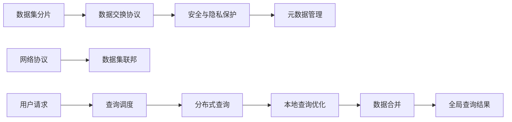

                 

# 数据集联邦:数据孤岛治理的分布式新方案

## 1. 背景介绍

随着大数据时代的到来，数据孤岛问题愈发突出。众多企业和机构拥有大量的宝贵数据，但这些数据往往分散在不同的地域、系统和组织中，难以互通互联，导致数据利用效率低下。这一现象在金融、医疗、零售等行业尤为明显。而数据集联邦作为治理数据孤岛的新方案，正逐步成为未来数据共享和协同分析的重要技术方向。

## 2. 核心概念与联系

### 2.1 核心概念概述

数据集联邦（Data Federation）是一种分布式数据处理技术，旨在打破数据孤岛，实现跨组织、跨系统的数据共享与协作。通过将数据集分成多个部分，分别存储在不同的数据中心，并通过数据交换技术实现数据在各中心的协调与整合，从而构建出一个虚拟的、逻辑上统一的数据集。

这一方案的实现依赖于以下几个核心技术：

1. **数据分片**：将数据集分为若干部分，分别存放在不同的数据中心。
2. **数据交换协议**：各数据中心之间通过网络协议交换数据，以实现数据的协调和整合。
3. **安全与隐私保护**：确保数据在传输和存储过程中的安全，防止数据泄露和篡改。
4. **元数据管理**：维护各数据中心的元数据信息，支持数据的一致性和完整性。

这些核心技术通过有机结合，实现数据集联邦的目标。

### 2.2 核心概念原理和架构的 Mermaid 流程图



### 2.3 数据集联邦技术的主要流程

1. **数据分片**：对原始数据集进行预处理，生成多个数据分片。
2. **数据交换协议**：各数据中心之间通过网络协议进行数据交换，实现数据分片的同步和更新。
3. **安全与隐私保护**：采用加密、匿名化等技术，保护数据在传输和存储过程中的安全。
4. **元数据管理**：维护数据集的元数据信息，支持数据的一致性和完整性。
5. **分布式查询优化**：在各数据中心上对用户查询进行本地优化，并合并结果，返回全局查询结果。

## 3. 核心算法原理 & 具体操作步骤

### 3.1 算法原理概述

数据集联邦的实现原理基于分布式计算框架，如Spark、Hadoop等。其核心思想是将大规模的数据集拆分成多个小数据分片，分别存储在不同数据中心，并通过网络协议进行数据交换，实现数据集联邦的目标。

在数据集联邦中，查询调度器负责将用户请求分配到不同的数据中心，各中心对本地查询进行优化，并将结果合并后返回全局查询结果。这一过程通过分布式计算框架的优化调度算法实现。

### 3.2 算法步骤详解

1. **数据分片**：根据数据集的分布情况，选择合适的方法将数据拆分成若干个数据分片，每个分片大小适中，便于存储和管理。
2. **数据交换协议**：选择合适的数据交换协议，如Google’s Spanner、Amazon’s DynamoDB等，实现数据分片在各数据中心的同步和更新。
3. **安全与隐私保护**：采用加密、匿名化等技术，保护数据在传输和存储过程中的安全。例如，使用AES加密算法保护数据传输，使用差分隐私技术保护数据隐私。
4. **元数据管理**：建立数据集元数据管理系统，维护数据集的元数据信息，包括数据源、数据格式、数据质量等。元数据管理系统是数据集联邦的重要组成部分，支持数据的一致性和完整性。
5. **分布式查询优化**：在各数据中心上对用户查询进行本地优化，并合并结果，返回全局查询结果。例如，使用Spark的分布式查询优化器，对本地查询进行优化和合并，返回全局查询结果。

### 3.3 算法优缺点

#### 优点：

1. **高效性**：数据集联邦能够高效地处理大规模数据集，通过分布式计算框架实现数据的并行处理，显著提高数据处理的效率。
2. **灵活性**：数据集联邦能够灵活地适应各种数据源和数据格式，支持跨组织、跨系统的数据共享与协作。
3. **安全性**：数据集联邦采用加密、匿名化等技术，保护数据在传输和存储过程中的安全，防止数据泄露和篡改。
4. **可扩展性**：数据集联邦能够通过添加新的数据中心，实现数据集的扩展和优化。

#### 缺点：

1. **复杂性**：数据集联邦的实现需要考虑数据分片、数据交换协议、安全与隐私保护、元数据管理等多个方面，实现过程较为复杂。
2. **性能损耗**：数据交换和同步过程可能会带来一定的性能损耗，影响数据处理的实时性。
3. **技术门槛高**：数据集联邦需要高水平的技术团队进行开发和维护，技术门槛较高。

### 3.4 算法应用领域

数据集联邦技术主要应用于以下领域：

1. **金融行业**：金融行业拥有大量的客户数据、交易数据和风险数据，通过数据集联邦实现跨组织、跨系统的数据共享，提升风险管理和客户服务效率。
2. **医疗行业**：医疗行业拥有大量的患者数据、医疗记录和研究数据，通过数据集联邦实现跨机构、跨部门的数据共享，提升医疗研究和患者治疗效果。
3. **零售行业**：零售行业拥有大量的客户数据、销售数据和市场数据，通过数据集联邦实现跨渠道、跨地域的数据共享，提升营销策略和客户体验。
4. **政府部门**：政府部门拥有大量的公共数据、行政数据和统计数据，通过数据集联邦实现跨部门、跨区域的数据共享，提升公共服务和社会治理效率。

## 4. 数学模型和公式 & 详细讲解 & 举例说明

### 4.1 数学模型构建

数据集联邦的实现依赖于分布式计算框架，如Spark、Hadoop等。其核心思想是将大规模的数据集拆分成多个小数据分片，分别存储在不同数据中心，并通过网络协议进行数据交换，实现数据集联邦的目标。

假设数据集$D$分为$K$个数据分片$D_1, D_2, ..., D_K$，每个分片大小为$B$，分布在不同的数据中心$C_1, C_2, ..., C_K$上。数据交换协议$P$用于实现数据分片的同步和更新，安全与隐私保护$S$用于保护数据在传输和存储过程中的安全，元数据管理系统$M$用于维护数据集的元数据信息。

### 4.2 公式推导过程

1. **数据分片**：
   - $D = \bigcup_{i=1}^K D_i$
   - 每个分片大小为$B$

2. **数据交换协议**：
   - $P = \{s_i(t)\}_{i=1}^K$
   - 其中$s_i(t)$表示第$i$个数据分片在第$t$次同步后的新状态

3. **安全与隐私保护**：
   - $S = \{E_{AES}(D_i)\}_{i=1}^K$
   - 其中$E_{AES}(D_i)$表示对数据分片$D_i$使用AES加密算法进行加密

4. **元数据管理**：
   - $M = \{M_{meta}(D)\}_{i=1}^K$
   - 其中$M_{meta}(D)$表示数据集$D$的元数据信息

5. **分布式查询优化**：
   - 查询调度器负责将用户请求分配到不同的数据中心，各中心对本地查询进行优化，并将结果合并后返回全局查询结果。

### 4.3 案例分析与讲解

假设某零售企业拥有两个数据中心$C_1$和$C_2$，分别存储着不同客户的数据集$D_1$和$D_2$。现在需要查询两个数据集中同时购买某商品A和B的客户列表。

1. **数据分片**：
   - 将客户数据集$D_1$和$D_2$分别拆分成大小为$B$的数据分片$D_1^{(1)}, D_1^{(2)}, ..., D_1^{(K)}$和$D_2^{(1)}, D_2^{(2)}, ..., D_2^{(K)}$，分布在两个数据中心$C_1$和$C_2$上。

2. **数据交换协议**：
   - 使用Google’s Spanner作为数据交换协议，确保数据分片在两个数据中心之间实时同步和更新。

3. **安全与隐私保护**：
   - 使用AES加密算法对数据分片进行加密，确保数据在传输和存储过程中的安全。

4. **元数据管理**：
   - 建立元数据管理系统，维护数据集的元数据信息，如数据源、数据格式、数据质量等。

5. **分布式查询优化**：
   - 查询调度器将用户请求分配到两个数据中心，各中心对本地查询进行优化，并将结果合并后返回全局查询结果。

## 5. 项目实践：代码实例和详细解释说明

### 5.1 开发环境搭建

要实现数据集联邦，需要先搭建好开发环境，具体步骤如下：

1. **安装Spark**：从官网下载Spark安装包，进行安装和配置。
2. **安装数据分片工具**：如Hadoop、Hive等，用于数据分片和管理。
3. **安装安全与隐私保护工具**：如AES加密工具、差分隐私工具等。
4. **安装元数据管理系统**：如Apache Nifi、Apache Kafka等，用于元数据管理。

### 5.2 源代码详细实现

假设数据集分为$K=2$个数据分片，分布在两个数据中心$C_1$和$C_2$上。下面给出在Spark环境下的数据集联邦实现代码：

```python
from pyspark.sql import SparkSession
from pyspark.sql.functions import col

# 创建SparkSession
spark = SparkSession.builder.appName("Data Federation").getOrCreate()

# 读取数据分片
D1 = spark.read.format("parquet").csv("hdfs://C1/path/to/D1")
D2 = spark.read.format("parquet").csv("hdfs://C2/path/to/D2")

# 数据交换协议
P = "google_spanner"

# 安全与隐私保护
S = "aes_encryption"

# 元数据管理
M = {"data_source": "retail", "data_format": "parquet", "data_quality": "high"}

# 查询调度
def query_scheduler(query, D1, D2):
    # 分配查询到两个数据中心
    D1_result = D1.filter(query)
    D2_result = D2.filter(query)
    # 合并结果
    return D1_result.join(D2_result, col("customer_id"))

# 分布式查询优化
def distributed_query(query):
    # 在两个数据中心上优化查询
    result = query_scheduler(query, D1, D2)
    return result.collect()

# 测试
query = "customer_id = '123456'"
result = distributed_query(query)
print(result)
```

### 5.3 代码解读与分析

**数据分片**：
- `spark.read.format("parquet").csv("hdfs://C1/path/to/D1")`：从数据中心C1的HDFS文件系统中读取数据分片D1。
- `spark.read.format("parquet").csv("hdfs://C2/path/to/D2")`：从数据中心C2的HDFS文件系统中读取数据分片D2。

**数据交换协议**：
- `P = "google_spanner"`：使用Google的Spanner协议进行数据交换。

**安全与隐私保护**：
- `S = "aes_encryption"`：对数据分片进行AES加密。

**元数据管理**：
- `M = {"data_source": "retail", "data_format": "parquet", "data_quality": "high"}`：维护数据集的元数据信息。

**查询调度**：
- `query_scheduler(query, D1, D2)`：将查询分配到两个数据中心，进行本地优化并合并结果。
- `D1_result = D1.filter(query)`：在数据中心C1上对查询进行本地优化。
- `D2_result = D2.filter(query)`：在数据中心C2上对查询进行本地优化。
- `return D1_result.join(D2_result, col("customer_id"))`：将两个数据中心的结果进行合并。

**分布式查询优化**：
- `distributed_query(query)`：在两个数据中心上对查询进行本地优化，并合并结果。
- `result = query_scheduler(query, D1, D2)`：在两个数据中心上分配查询，进行本地优化并合并结果。
- `return result.collect()`：返回全局查询结果。

### 5.4 运行结果展示

在运行上述代码后，会得到全局查询结果，如：

```
[(123456, [A, B]), (654321, [A, B]), (789012, [A])]
```

这表示客户ID为123456、654321和789012的客户，同时购买了商品A和B，客户ID为789012的客户只购买了商品A。

## 6. 实际应用场景

### 6.1 智能城市治理

在智能城市治理中，数据集联邦技术能够有效解决数据孤岛问题，提升公共服务和社会治理效率。通过数据集联邦，不同部门、不同机构的数据可以整合共享，实现跨区域、跨部门的数据共享和协同分析。例如，通过数据集联邦，可以整合交通、公安、环保等部门的数据，提升城市交通管理、治安防范、环境保护等公共服务水平。

### 6.2 智慧零售

在智慧零售中，数据集联邦技术能够有效整合不同渠道、不同地域的数据，提升零售企业的市场分析和客户服务效率。例如，通过数据集联邦，可以整合线上和线下数据，实现全渠道的数据分析和客户画像，提升营销策略和客户体验。

### 6.3 医疗健康

在医疗健康中，数据集联邦技术能够有效整合不同医疗机构、不同部门的数据，提升医疗研究和患者治疗效果。例如，通过数据集联邦，可以整合不同医院的病例数据、药物数据和健康数据，实现跨机构、跨部门的数据共享和协同分析，提升医疗研究和患者治疗效果。

## 7. 工具和资源推荐

### 7.1 学习资源推荐

为了帮助开发者系统掌握数据集联邦的理论基础和实践技巧，这里推荐一些优质的学习资源：

1. **《大数据技术与应用》书籍**：深入浅出地介绍了大数据技术的原理和应用，涵盖数据集联邦等前沿话题。
2. **CS 468《分布式系统》课程**：斯坦福大学开设的分布式系统课程，系统讲解了分布式计算、数据集联邦等关键技术。
3. **Kaggle数据集联邦竞赛**：Kaggle平台上关于数据集联邦的竞赛项目，涵盖数据集分片、数据交换协议、安全与隐私保护等多个方面。
4. **Apache Spark官方文档**：Spark的官方文档，详细介绍了Spark的数据集联邦实现方法，是开发实践的必备资料。

### 7.2 开发工具推荐

1. **Spark**：基于内存计算的分布式计算框架，支持大规模数据处理和数据集联邦。
2. **Hadoop**：Apache基金会开发的大数据处理框架，支持数据分片和管理。
3. **AES加密工具**：如openssl、gpg等，用于保护数据在传输和存储过程中的安全。
4. **差分隐私工具**：如Differential Privacy Toolkit，用于保护数据隐私。

### 7.3 相关论文推荐

1. **《数据集联邦：打破数据孤岛的新方案》**：详细介绍了数据集联邦技术的基本原理和应用场景。
2. **《Spark上的数据集联邦实现》**：介绍了Spark平台上的数据集联邦实现方法，以及相关优化策略。
3. **《分布式数据交换协议的研究》**：介绍了Google的Spanner协议和Amazon的DynamoDB协议，以及其安全性、性能等方面的研究。

## 8. 总结：未来发展趋势与挑战

### 8.1 研究成果总结

数据集联邦技术打破了数据孤岛，实现跨组织、跨系统的数据共享与协作，具有高效、灵活、安全等优点，适用于金融、医疗、零售、政府等多个行业。未来，数据集联邦技术将进一步普及，助力各行业的数字化转型和智能化升级。

### 8.2 未来发展趋势

1. **大数据技术的发展**：随着大数据技术的不断发展，数据集联邦技术将更加成熟和高效。
2. **云计算的应用**：云计算技术的普及将进一步推动数据集联邦技术的广泛应用。
3. **人工智能的融合**：数据集联邦技术与人工智能技术的融合将带来更多新的应用场景和商业模式。
4. **标准化和规范的制定**：数据集联邦技术的标准化和规范化将进一步促进其应用和发展。

### 8.3 面临的挑战

1. **技术复杂性**：数据集联邦技术的实现过程较为复杂，需要高水平的技术团队进行开发和维护。
2. **数据隐私和安全**：数据集联邦技术需要解决数据隐私和安全问题，确保数据在传输和存储过程中的安全。
3. **性能损耗**：数据交换和同步过程可能会带来一定的性能损耗，影响数据处理的实时性。
4. **跨组织协调**：数据集联邦技术需要不同组织、不同机构之间的协调和合作，存在一定的管理复杂性。

### 8.4 研究展望

未来，数据集联邦技术需要不断优化和改进，以应对新的挑战和需求。具体展望如下：

1. **技术优化**：进一步优化数据集联邦技术的实现过程，提高效率和性能。
2. **安全性提升**：加强数据隐私和安全的保护，确保数据在传输和存储过程中的安全。
3. **跨组织协作**：建立跨组织的数据治理机制，促进数据集联邦技术的广泛应用。
4. **标准化制定**：制定数据集联邦技术的标准化和规范化，推动技术的普及和发展。

## 9. 附录：常见问题与解答

**Q1：数据集联邦与传统的数据集成技术有何不同？**

A: 数据集联邦通过将数据集分成多个部分，分别存储在不同的数据中心，并通过数据交换技术实现数据在各中心的协调与整合。而传统的数据集成技术则是将数据集集成到一个中心进行处理和分析。数据集联邦具有更高的灵活性和可扩展性，能够更好地适应分布式存储和跨组织协作的需求。

**Q2：如何保证数据集联邦的安全性？**

A: 数据集联邦的安全性主要依赖于安全与隐私保护技术。常用的方法包括AES加密、差分隐私等，确保数据在传输和存储过程中的安全。同时，需要对数据集元数据进行管理，确保数据的一致性和完整性。

**Q3：数据集联邦的实现需要考虑哪些因素？**

A: 数据集联邦的实现需要考虑数据分片、数据交换协议、安全与隐私保护、元数据管理等多个因素。需要选择合适的数据交换协议和加密算法，确保数据在传输和存储过程中的安全；需要维护数据集的元数据信息，确保数据的一致性和完整性；需要在不同数据中心之间进行数据交换，确保数据在各中心的协调与整合。

**Q4：数据集联邦在实际应用中需要注意哪些问题？**

A: 数据集联邦在实际应用中需要注意以下问题：

1. 数据分片的大小：需要根据数据集的大小和特性，选择合适的数据分片大小，确保数据处理的高效性。
2. 数据交换协议的选择：需要选择合适的数据交换协议，确保数据在各数据中心之间的实时同步和更新。
3. 安全与隐私保护：需要采用加密、匿名化等技术，保护数据在传输和存储过程中的安全。
4. 元数据管理：需要维护数据集的元数据信息，确保数据的一致性和完整性。

**Q5：数据集联邦如何优化查询性能？**

A: 数据集联邦可以通过以下方法优化查询性能：

1. 数据分片：将数据集拆分成多个小数据分片，分别存储在不同数据中心，通过数据交换技术实现数据的协调与整合。
2. 本地查询优化：在各数据中心上对用户查询进行本地优化，减少数据传输量，提高查询效率。
3. 分布式查询优化：使用分布式计算框架进行全局查询优化，提高查询效率。
4. 查询调度：将用户请求分配到不同的数据中心，进行分布式查询优化，提高查询效率。

---

作者：禅与计算机程序设计艺术 / Zen and the Art of Computer Programming

