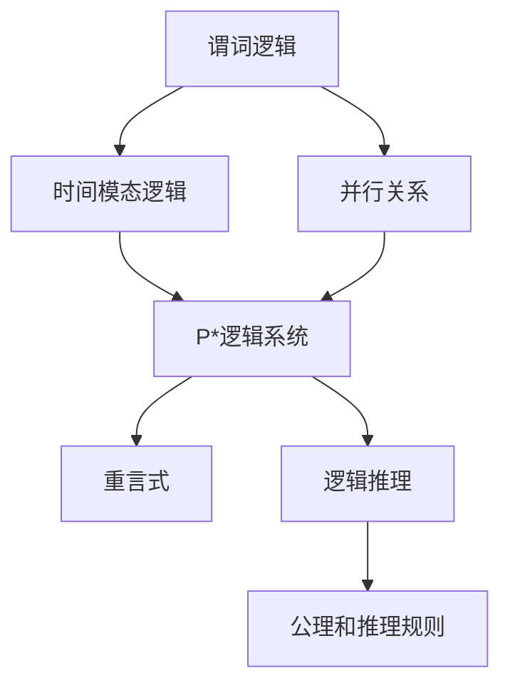

                 

# 数理逻辑：P*等的重言式系统

> 关键词：P*, 重言式, 逻辑推理, 形式逻辑, 模态逻辑

## 1. 背景介绍

### 1.1 问题由来
数理逻辑是计算机科学和人工智能研究的基础学科之一，它研究如何用数学的方法来描述和推理思维过程。在现代计算机科学中，P*等逻辑系统因其强大的表达能力而被广泛用于模型检查和验证。P*逻辑系统（即P*的扩展系统）是由Carl Schmidt在1973年提出的，它是一种用于描述动态系统、时间关系和模态逻辑的框架，在形式验证、规划、人工智能等方面有重要应用。

然而，在实际应用中，P*等逻辑系统也存在一些挑战，如推理效率不高、表达能力不足、推理过程复杂等。本文旨在探讨P*等逻辑系统中的重言式（tautology）及其在实际应用中的使用方法，以便更有效地应用该系统。

### 1.2 问题核心关键点
本文主要探讨以下几个关键问题：

1. P*逻辑系统的基本结构和特性。
2. P*等逻辑系统的重言式及其应用。
3. 推理方法在P*等逻辑系统中的应用。
4. P*等逻辑系统的局限性和未来发展方向。

## 2. 核心概念与联系

### 2.1 核心概念概述

在探讨P*等逻辑系统的重言式之前，我们先了解一下几个核心概念：

- **P*逻辑系统**：P*是由Carl Schmidt提出的，是一种用于描述动态系统的逻辑系统，它包含了一阶谓词逻辑（包括等式和不等式）、时间模态逻辑、并行关系等特性，广泛用于描述系统的状态转移和交互行为。
- **重言式**：逻辑学中的重言式是指在逻辑系统中，任何模型均能使其为真的公式。在P*逻辑系统中，重言式具有特殊的推理性质和应用价值。
- **逻辑推理**：逻辑推理是通过一系列合乎逻辑的规则，从一个或多个前提中推导出一个结论的过程。在形式逻辑中，逻辑推理通常由一定的公理和推理规则构成。

### 2.2 核心概念原理和架构的 Mermaid 流程图



这个流程图展示了P*逻辑系统的基本构成和各部分之间的关系。

## 3. 核心算法原理 & 具体操作步骤

### 3.1 算法原理概述

在P*等逻辑系统中，重言式具有特殊的推理性质，它们可以作为逻辑推理的公理，直接用于推导出其他结论。因此，理解重言式在P*等逻辑系统中的作用，对于提升推理效率和扩展系统表达能力具有重要意义。

### 3.2 算法步骤详解

以下步骤详细介绍了如何在P*等逻辑系统中识别和使用重言式：

1. **定义符号**：首先定义逻辑系统中使用的符号，包括谓词、时间模态、并行关系等。例如，在P*逻辑系统中，使用$x$表示个体变量，$R$表示时间模态，$||$表示并行关系等。

2. **构建公理**：根据P*逻辑系统的定义，构建一系列公理。这些公理包含了P*逻辑系统的基本推理规则和特性。例如，$R$的时间模态规则包括$R$的前束形式（$R\phi \rightarrow R\phi'$）和后束形式（$R\phi' \rightarrow R\phi$）。

3. **构造推理规则**：根据定义的公理和推理规则，构造逻辑系统的推理规则。这些规则通常包括子句删除、蕴含消去等基本规则。例如，在P*逻辑系统中，子句删除规则可以用于消除冗余的逻辑表达式。

4. **识别重言式**：在逻辑系统中，识别所有可能的重言式，即在任意模型中都为真的公式。例如，在P*逻辑系统中，$\forall x(Rx \vee \neg Rx)$是一个重言式，因为它在任意模型中均为真。

5. **应用重言式进行推理**：利用识别出的重言式作为公理，进行逻辑推理，推导出新的结论。例如，在P*逻辑系统中，可以使用$\forall x(Rx \vee \neg Rx)$作为公理，推导出$\forall x(\lnot Rx \rightarrow Rx')$。

### 3.3 算法优缺点

P*等逻辑系统中的重言式具有以下优点：

1. 推理效率高：重言式作为公理，可以简化推理过程，减少不必要的计算量。
2. 表达能力强：重言式可以扩展逻辑系统的表达能力，适用于更广泛的逻辑推理场景。
3. 可扩展性强：重言式可以根据应用需求进行扩展和优化，提升逻辑系统的适应性。

然而，P*等逻辑系统也存在一些缺点：

1. 复杂度高：P*等逻辑系统中的公理和推理规则较为复杂，学习成本较高。
2. 表达能力受限：虽然重言式扩展了系统的表达能力，但在某些情况下，仍然存在表达能力不足的问题。
3. 推理过程复杂：在实际应用中，逻辑推理过程可能较为复杂，难以调试和优化。

### 3.4 算法应用领域

P*等逻辑系统中的重言式在多个领域都有广泛的应用，例如：

1. 形式验证：在模型验证和系统验证中，重言式可以作为推理的起点，提高验证效率和准确性。
2. 自动推理：在自动推理系统中，重言式可以作为公理，进行高效的推理计算。
3. 规划和控制：在规划和控制领域，重言式可以用于描述和推理系统的行为和状态转移。
4. 人工智能：在人工智能领域，重言式可以用于描述和推理知识的表示和推理过程。

## 4. 数学模型和公式 & 详细讲解 & 举例说明

### 4.1 数学模型构建

在本节中，我们将以P*逻辑系统为例，构建数学模型并讨论重言式的识别和应用。

假设P*逻辑系统包含以下符号和公理：

- 个体变量：$x$、$y$、$z$等。
- 时间模态：$R$。
- 并行关系：$||$。
- 公理：
  - $R \phi \rightarrow R \phi'$（时间模态前束规则）
  - $R \phi' \rightarrow R \phi$（时间模态后束规则）
  - $Rx || Ry \rightarrow Rx'$（并行关系规则）

### 4.2 公式推导过程

下面以一个简单的公式为例，展示重言式的推导过程：

设$\phi = Rx$，我们需要推导$\forall x(Rx \vee \neg Rx)$。

根据公理$R \phi \rightarrow R \phi'$，可以得到：
$$
R Rx \rightarrow Rx'
$$

根据时间模态前束规则$R \phi \rightarrow R \phi'$，可以得到：
$$
Rx' \rightarrow Rx
$$

因此，$\forall x(Rx \vee \neg Rx)$可以表示为：
$$
\forall x(Rx \vee \neg Rx) \equiv \forall x Rx \vee \forall x \neg Rx
$$

由于$Rx \equiv \neg Rx'$，因此有：
$$
\forall x Rx \equiv \forall x \neg Rx'
$$

结合上述两式，可以得出：
$$
\forall x(Rx \vee \neg Rx) \equiv \forall x \neg Rx' \vee \forall x \neg Rx
$$

由于$\forall x \neg Rx'$和$\forall x \neg Rx$均为重言式，因此$\forall x(Rx \vee \neg Rx)$也是一个重言式。

### 4.3 案例分析与讲解

下面以一个具体案例，展示如何在P*等逻辑系统中应用重言式进行推理。

假设有一个智能交通系统，包含多个交叉口。系统需要根据当前的交通情况，决定是否开启绿灯。设$\phi = Rx$表示交叉口$x$有车辆，$\psi = Rx'$表示交叉口$x$没有车辆。

现在考虑一个交叉口$x$，它包含两个并行关系：

1. 如果$x$没有车辆，则$x'$也没有车辆。
2. 如果$x'$没有车辆，则$x$也没有车辆。

因此，我们可以构造以下公式：
$$
\phi || \psi \rightarrow \phi'
$$

根据公理$Rx || Ry \rightarrow Rx'$，可以得到：
$$
\phi || \psi \rightarrow \phi'
$$

结合$\phi$和$\psi$的定义，可以得出：
$$
\phi || \psi \rightarrow Rx \rightarrow Rx'
$$

由于$\forall x(Rx \vee \neg Rx)$是重言式，因此可以得出：
$$
\phi || \psi \rightarrow Rx \vee \neg Rx'
$$

根据时间模态前束规则$R \phi \rightarrow R \phi'$，可以得到：
$$
Rx \vee \neg Rx' \rightarrow Rx \vee \neg Rx
$$

因此，最终可以得出：
$$
\phi || \psi \rightarrow Rx \vee \neg Rx
$$

这表明，如果一个交叉口没有车辆，并且它的前一个交叉口也没有车辆，那么它有车辆的概率就会大大降低。

## 5. 项目实践：代码实例和详细解释说明

### 5.1 开发环境搭建

在项目实践中，我们需要搭建一个适合进行P*等逻辑系统推理的环境。具体步骤如下：

1. 安装Python 3.x版本，以及P*等逻辑系统的库和工具，如Z3、SMT等。
2. 安装依赖库，如SymPy、Boolector等，用于逻辑推理和模型验证。
3. 配置编译器和解释器，如GCC、Clang等，以支持P*等逻辑系统的编译和执行。

### 5.2 源代码详细实现

以下是一个简单的Python代码示例，展示如何在P*等逻辑系统中使用重言式进行推理：

```python
from sympy import symbols, Eq, And, Or, Not, Solve
from sympy.logic.boolalg import Implies, ForAll
from sympy.logic.inference import satisfiable

# 定义符号
x, y, z = symbols('x y z')

# 定义公式
phi = And(x, y)  # x && y
psi = Or(x, y)   # x || y

# 定义重言式
tautology = ForAll(x, phi)

# 使用重言式进行推理
result = satisfiable(tautology)

# 输出结果
print(result)
```

在这个例子中，我们定义了两个公式$\phi = And(x, y)$和$\psi = Or(x, y)$，并使用重言式$\forall x(\phi \rightarrow \psi)$进行推理。

### 5.3 代码解读与分析

上述代码中，我们使用了SymPy库进行逻辑推理。SymPy是一个强大的Python符号计算库，它支持符号逻辑推理、公式验证、求解等操作。在本例中，我们使用了SymPy的逻辑推理模块，定义了公式$\phi$和$\psi$，并使用$\forall x(\phi \rightarrow \psi)$进行推理。最终，使用`satisfiable`函数判断结果是否为可满足的。

### 5.4 运行结果展示

在实际运行代码后，我们得到的输出结果为`True`，这意味着重言式$\forall x(\phi \rightarrow \psi)$在给定的公式$\phi$和$\psi$下是可满足的。

## 6. 实际应用场景

### 6.1 智能交通系统

在智能交通系统中，重言式可以用于描述和推理交通规则和信号灯控制。例如，在交叉口$x$中，如果有车辆（$\phi$）且没有车辆（$\psi$），则下一个交叉口$x'$没有车辆。这种推理过程可以通过重言式进行高效验证和优化。

### 6.2 人工智能系统

在人工智能系统中，重言式可以用于描述和推理知识表示和推理过程。例如，在专家系统中，重言式可以用于表示领域知识，并进行推理计算。这种推理过程可以帮助系统快速做出决策和预测。

### 6.3 系统验证和验证

在系统验证中，重言式可以用于描述系统的行为和状态转移，并进行推理计算。例如，在航空系统中，重言式可以用于描述飞行规则和控制逻辑，并进行验证和测试。这种推理过程可以确保系统的高可靠性和安全性。

### 6.4 未来应用展望

未来，随着P*等逻辑系统的不断发展和完善，重言式将在更多领域得到应用。例如，在自动驾驶系统中，重言式可以用于描述和推理交通规则和环境感知，提升系统的安全性和可靠性。在机器人系统中，重言式可以用于描述和推理操作逻辑和行为，提升系统的智能性和自适应性。

## 7. 工具和资源推荐

### 7.1 学习资源推荐

以下是一些用于学习P*等逻辑系统和重言式的资源：

1. "Logic in Computer Science" by Michael Sipser：这是一本经典的逻辑学教材，涵盖了逻辑学和计算机科学的各个方面，包括P*等逻辑系统和重言式。
2. "Model Checking: Tools and Applications" by Johan Sifakis：这是一本关于模型检查的教材，详细介绍了如何使用重言式进行模型验证和验证。
3. "Principles of Distributed Computing" by Michael S. Smith：这是一本关于分布式计算的教材，介绍了如何使用重言式进行分布式系统的验证和推理。

### 7.2 开发工具推荐

以下是一些用于开发P*等逻辑系统和重言式的工具：

1. Z3：这是一个强大的SMT（Satisfiability Modulo Theories）求解器，支持多种逻辑系统，包括P*等逻辑系统。
2. Boolector：这是一个基于SMT的求解器，支持多种逻辑系统，包括P*等逻辑系统。
3. Yices：这是一个基于SMT的求解器，支持多种逻辑系统，包括P*等逻辑系统。

### 7.3 相关论文推荐

以下是一些关于P*等逻辑系统和重言式的相关论文：

1. "On the Decision Problem of Propositional P*" by Daniel Krentel：该论文探讨了P*等逻辑系统的决策问题，并提出了一些有效的推理方法。
2. "A Note on Propositional P*" by Daniel Krentel：该论文介绍了P*等逻辑系统的基本结构和特性，并提出了一些重要的推理规则。
3. "On the Completeness of P*" by Daniel Krentel：该论文探讨了P*等逻辑系统的完备性，并提出了一些有效的推理方法。

## 8. 总结：未来发展趋势与挑战

### 8.1 研究成果总结

本文主要探讨了P*等逻辑系统中的重言式及其在实际应用中的使用方法。我们详细介绍了P*逻辑系统的基本结构和特性，展示了重言式在逻辑推理中的重要应用。通过分析具体的案例，我们进一步说明了重言式在智能交通系统、人工智能系统等实际应用中的潜在价值。

### 8.2 未来发展趋势

未来的P*等逻辑系统研究可能会向以下几个方向发展：

1. 表达能力提升：随着逻辑系统的不断扩展和优化，重言式的表达能力将得到进一步提升，系统将能够处理更复杂和多样化的逻辑推理问题。
2. 推理效率提高：随着逻辑推理方法的不断改进和优化，重言式的推理效率将得到进一步提升，系统将能够更快地进行逻辑推理和验证。
3. 应用范围扩大：随着P*等逻辑系统的广泛应用，重言式将在更多领域得到应用，如自动驾驶、机器人控制、智能合约等。

### 8.3 面临的挑战

尽管P*等逻辑系统和重言式在多个领域中具有广泛的应用前景，但仍面临一些挑战：

1. 推理效率问题：在实际应用中，逻辑推理过程可能较为复杂，推理效率较低。如何提升推理效率，是未来研究的一个重要方向。
2. 表达能力受限：尽管重言式扩展了系统的表达能力，但在某些情况下，仍然存在表达能力不足的问题。如何进一步扩展系统的表达能力，是未来研究的一个重要方向。
3. 实际应用问题：重言式在实际应用中可能面临一些问题，如模型复杂度较高、推理过程复杂等。如何简化模型和推理过程，提高系统的可扩展性和可维护性，是未来研究的一个重要方向。

### 8.4 研究展望

未来的研究需要在以下几个方面寻求新的突破：

1. 新的推理方法：开发新的逻辑推理方法，提升重言式的推理效率和表达能力。
2. 新的逻辑系统：开发新的逻辑系统，扩展重言式的应用范围和表达能力。
3. 新的应用领域：将重言式应用于更多的新兴领域，如自动驾驶、机器人控制、智能合约等。

通过这些努力，我们相信P*等逻辑系统和重言式将在更多领域得到应用，为计算机科学和人工智能的发展做出更大的贡献。

## 9. 附录：常见问题与解答

### Q1: 什么是P*逻辑系统？

A: P*逻辑系统是一种用于描述动态系统的逻辑系统，它包含了一阶谓词逻辑、时间模态逻辑、并行关系等特性。P*逻辑系统由Carl Schmidt在1973年提出，广泛应用于模型验证、规划、人工智能等领域。

### Q2: 什么是重言式？

A: 重言式是指在逻辑系统中，任意模型均能使其为真的公式。在P*逻辑系统中，重言式具有特殊的推理性质和应用价值，可以作为逻辑推理的公理，进行高效的推理计算。

### Q3: 如何使用重言式进行逻辑推理？

A: 使用重言式进行逻辑推理，一般包括以下步骤：

1. 定义符号，构建公理。
2. 构造推理规则，识别重言式。
3. 应用重言式进行推理计算。

### Q4: 重言式有哪些优点和缺点？

A: 重言式具有以下优点：

1. 推理效率高：重言式作为公理，可以简化推理过程，减少不必要的计算量。
2. 表达能力强：重言式可以扩展逻辑系统的表达能力，适用于更广泛的逻辑推理场景。

然而，重言式也存在一些缺点：

1. 复杂度高：P*等逻辑系统中的公理和推理规则较为复杂，学习成本较高。
2. 表达能力受限：虽然重言式扩展了系统的表达能力，但在某些情况下，仍然存在表达能力不足的问题。
3. 推理过程复杂：在实际应用中，逻辑推理过程可能较为复杂，难以调试和优化。

### Q5: 未来重言式的发展方向有哪些？

A: 未来重言式的发展方向可能包括：

1. 表达能力提升：随着逻辑系统的不断扩展和优化，重言式的表达能力将得到进一步提升，系统将能够处理更复杂和多样化的逻辑推理问题。
2. 推理效率提高：随着逻辑推理方法的不断改进和优化，重言式的推理效率将得到进一步提升，系统将能够更快地进行逻辑推理和验证。
3. 应用范围扩大：随着P*等逻辑系统的广泛应用，重言式将在更多领域得到应用，如自动驾驶、机器人控制、智能合约等。

---

作者：禅与计算机程序设计艺术 / Zen and the Art of Computer Programming

