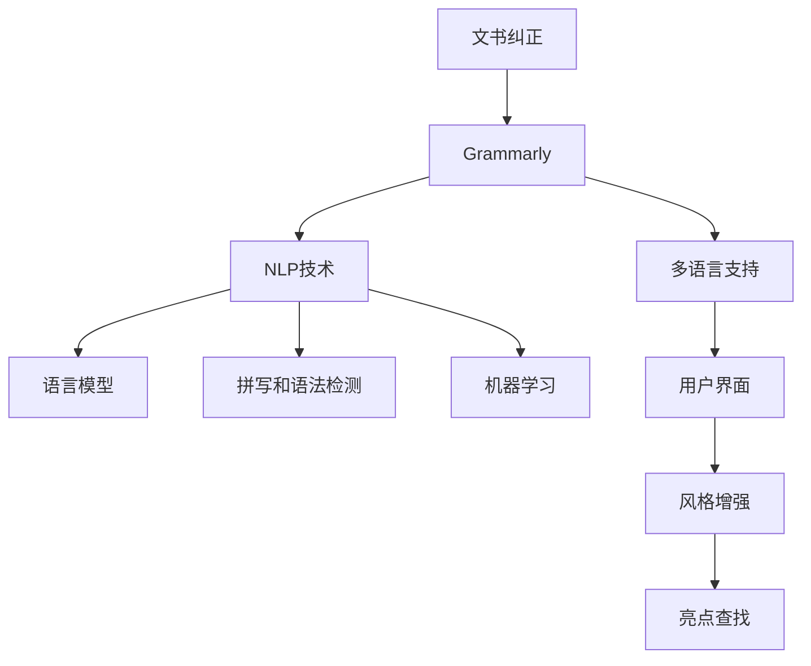

                 

# 文书纠正AI：Grammarly

> 关键词：
- 文书纠正
- Grammarly
- 自然语言处理
- 语言模型
- 拼写和语法检测
- 机器学习
- 用户界面

## 1. 背景介绍

### 1.1 问题由来

在当今信息爆炸的时代，无论是学术写作、商业文档还是日常沟通，语言错误都常常成为影响交流质量和效率的重要因素。据统计，普通文本中常出现的语法错误、拼写错误等错误，高达25%以上。文书纠正不仅费时费力，还容易引发误解。为此，人工智能技术在文书纠正领域的应用成为热门研究方向。

Grammarly是一款全球知名的文书纠正工具，自2009年推出以来，已成为广大用户提升文书质量的重要助手。该工具通过机器学习和大数据技术，实现了高精度的拼写和语法检测，不仅能够纠正常见的错误，还能提供多语言的文书建议，大大提升了文书写作的效率和准确性。

### 1.2 问题核心关键点

Grammarly的文书纠正技术涉及多个关键环节，包括数据预处理、语言模型训练、错误检测和纠正、用户界面设计等。这些环节相互关联，共同构成了文书纠正的核心技术框架。了解这些关键点，有助于理解Grammarly文书纠正的实现机制和优化策略。

## 2. 核心概念与联系

### 2.1 核心概念概述

为更好地理解Grammarly的文书纠正技术，本节将介绍几个密切相关的核心概念：

- **文书纠正**：通过自然语言处理(NLP)技术，对文本中的拼写、语法、标点等错误进行检测和纠正的过程。文书纠正能够显著提升文本质量，改善阅读体验。

- **Grammarly**：一款基于AI的文书纠正工具，提供拼写和语法检测、风格建议、风格增强、亮点查找等功能，广泛应用于个人写作、商业文档、学术文章等多个领域。

- **自然语言处理(NLP)**：涉及计算机对人类语言进行分析、理解、生成和翻译的一门学科。文书纠正正是NLP技术在语言理解和生成方面的应用之一。

- **语言模型**：用于预测给定文本序列的概率分布，是文书纠正中错误检测和纠正的关键基础。语言模型通过统计学或机器学习方法，对文本序列的规律进行建模。

- **拼写和语法检测**：文书纠正的核心任务之一，包括识别并纠正文本中的拼写错误、语法错误、标点错误等。

- **机器学习**：通过数据训练模型，自动发现和总结文本规律，从而提升文书纠正的准确性和智能化程度。

这些概念之间的逻辑关系可以通过以下Mermaid流程图来展示：



这个流程图展示了文书纠正的核心概念及其之间的关系：

1. Grammarly使用NLP技术处理文书错误。
2. 语言模型为错误检测和纠正提供基础。
3. 机器学习提升检测和纠正的准确性。
4. Grammarly支持多语言，并拥有良好的用户界面。
5. 风格增强和亮点查找进一步提升文书质量。

这些概念共同构成了Grammarly的文书纠正技术框架，使得其能够高效地纠正文本错误，提升用户文书写作的效率和质量。

## 3. 核心算法原理 & 具体操作步骤

### 3.1 算法原理概述

Grammarly的文书纠正算法主要基于语言模型和机器学习技术。其核心原理可以概括为以下几个步骤：

1. **数据预处理**：收集并清洗大规模的语料库，去除噪声和冗余，构建文本特征表示。
2. **语言模型训练**：使用收集的语料库，训练出高精度的语言模型，能够预测文本序列的概率分布。
3. **错误检测**：将待纠正的文本输入语言模型，通过概率分布计算出文本序列的错误概率，标记出可能的错误位置。
4. **错误纠正**：对标记出的错误位置进行分析和纠正，生成替代方案，供用户选择。
5. **用户反馈**：收集用户对纠正建议的反馈，对模型进行优化。
6. **持续改进**：通过新数据的不断输入和模型更新，提升文书纠正的准确性和鲁棒性。

### 3.2 算法步骤详解

以下是Grammarly文书纠正算法的详细步骤：

**Step 1: 数据预处理**

1. **数据收集**：Grammarly从多来源收集大规模的文本数据，包括互联网文章、书籍、学术论文等，构建了包含数十亿个单词的语料库。
2. **数据清洗**：清洗数据，去除噪音和冗余，确保数据质量。具体方法包括去除HTML标签、过滤低质量内容、去重等。
3. **特征提取**：将清洗后的文本转化为特征向量，如单词频率、词性标注、句法分析结果等。

**Step 2: 语言模型训练**

1. **模型选择**：选择合适的语言模型，如基于n-gram的统计语言模型、基于神经网络的语言模型等。
2. **训练数据**：使用清洗后的语料库，训练语言模型。训练过程中采用交叉验证和正则化技术，防止过拟合。
3. **模型评估**：使用保留的数据集评估语言模型的性能，选择最优模型进行下一步使用。

**Step 3: 错误检测**

1. **输入文本**：用户输入待纠正的文本，系统将其转化为特征向量。
2. **概率计算**：将特征向量输入训练好的语言模型，计算每个单词序列的概率分布。
3. **错误标记**：通过概率分布，标记出可能的错误位置，生成错误类型和建议纠正方案。

**Step 4: 错误纠正**

1. **纠正方案生成**：根据错误类型和上下文信息，生成多种纠正方案。
2. **用户选择**：将生成方案展示给用户，用户可以选择接受或拒绝。
3. **应用纠正**：如果用户接受纠正，系统将其应用于文本中。

**Step 5: 用户反馈**

1. **收集反馈**：收集用户对纠正方案的反馈，如接受、拒绝或修改。
2. **反馈分析**：分析用户反馈，找出错误检测和纠正的漏洞。
3. **模型更新**：根据用户反馈，更新语言模型和纠正算法。

**Step 6: 持续改进**

1. **新数据输入**：定期收集新的文本数据，更新语言模型。
2. **模型优化**：通过新数据的输入，持续优化语言模型和纠正算法。
3. **性能评估**：定期评估文书纠正的性能，确保其保持在领先水平。

### 3.3 算法优缺点

Grammarly的文书纠正算法具有以下优点：

1. **高效准确**：通过高精度语言模型和大规模数据训练，Grammarly能够高效准确地检测和纠正文本错误。
2. **智能化决策**：通过机器学习技术，Grammarly能够学习用户偏好，提供个性化的文书建议。
3. **多语言支持**：支持多种语言，帮助非英语用户提升文书质量。
4. **用户界面友好**：简洁直观的用户界面，使用户能够轻松理解和接受纠正建议。

同时，该算法也存在一些局限性：

1. **数据依赖**：模型的性能高度依赖于数据质量，数据偏斜可能影响模型的泛化能力。
2. **上下文理解**：在某些复杂的文本场景中，上下文理解的难度较大，可能会产生误判。
3. **人工修正**：部分错误仍需人工修正，增加了用户的工作量。
4. **文化差异**：不同文化背景下，文书的语言习惯和风格差异较大，统一纠正可能导致不适应。

尽管存在这些局限性，但Grammarly的文书纠正算法已在全球范围内广受好评，成为文书写作的必备工具。

### 3.4 算法应用领域

Grammarly的文书纠正技术在多个领域得到了广泛应用，包括但不限于：

- **个人写作**：帮助用户提升个人写作质量，提升文书写作效率。
- **商业文档**：确保商业文档的专业性和准确性，提升品牌形象。
- **学术文章**：协助科研人员提升论文质量和影响力。
- **教育培训**：辅助教育机构和教师提升学生的文书写作能力。
- **出版发行**：提升出版物的语言质量和可读性。
- **企业沟通**：帮助企业提升邮件、报告等文书的语言质量。

## 4. 数学模型和公式 & 详细讲解 & 举例说明

### 4.1 数学模型构建

Grammarly的文书纠正算法基于统计语言模型和神经网络语言模型。假设语言模型为$P(w_1, w_2, ..., w_n)$，其中$w_1, w_2, ..., w_n$表示文本中的单词序列。语言模型的任务是最大化下列概率：

$$
P(w_1, w_2, ..., w_n) = \prod_{i=1}^{n}P(w_i | w_1, ..., w_{i-1})
$$

在实际应用中，语言模型通常采用简化形式，如n-gram模型或循环神经网络(RNN)模型。

### 4.2 公式推导过程

以n-gram模型为例，推导其概率计算公式：

假设文本中单词的频率为$f(w_i)$，则n-gram模型的概率计算公式为：

$$
P(w_1, w_2, ..., w_n) = \frac{f(w_1, w_2, ..., w_n)}{\sum_{w_1, w_2, ..., w_n}f(w_1, w_2, ..., w_n)}
$$

其中$f(w_1, w_2, ..., w_n)$表示单词序列$w_1, w_2, ..., w_n$的出现频率，分母是所有可能单词序列的出现频率之和。

在实际应用中，为了处理未知单词和低频单词问题，常采用平滑技术，如Kneser-Ney平滑，对概率进行修正。

### 4.3 案例分析与讲解

以拼写错误检测为例，假设文本中包含单词"reccomend"，其正确的拼写应为"recommend"。语言模型计算该单词序列的概率时，首先根据已知单词序列"reccomend"，计算出"recommend"的概率，然后与"reccomend"的概率进行比较。如果"recommend"的概率远大于"reccomend"的概率，则认为"reccomend"是一个拼写错误，标记出来并提供纠正建议。

## 5. 项目实践：代码实例和详细解释说明

### 5.1 开发环境搭建

在进行文书纠正项目开发前，我们需要准备好开发环境。以下是使用Python进行NLP开发的环境配置流程：

1. 安装Anaconda：从官网下载并安装Anaconda，用于创建独立的Python环境。

2. 创建并激活虚拟环境：
```bash
conda create -n nlp-env python=3.8 
conda activate nlp-env
```

3. 安装相关库：
```bash
conda install pandas numpy scikit-learn nltk transformers
```

4. 安装nltk数据集：
```bash
nltk.download('punkt')
nltk.download('averaged_perceptron_tagger')
nltk.download('wordnet')
nltk.download('stopwords')
nltk.download('omw')
```

5. 安装PyTorch：
```bash
pip install torch
```

6. 安装Transformers库：
```bash
pip install transformers
```

完成上述步骤后，即可在`nlp-env`环境中开始文书纠正项目的开发。

### 5.2 源代码详细实现

下面我们以n-gram语言模型为例，给出使用Python进行文书纠正的代码实现。

```python
from nltk import ngrams
from collections import Counter
import math

# 构建语料库
corpus = ["reccomend", "recommend", "reccompends", "recommanded"]

# 计算n-gram模型
def build_ngram_model(corpus, n):
    model = Counter()
    for sentence in corpus:
        sentence_ngrams = list(ngrams(sentence.split(), n))
        for ngram in sentence_ngrams:
            model[ngram] += 1
    return model

# 计算概率
def calculate_probability(model, ngram):
    numerator = model.get(ngram, 0) + 1 # 使用Laplace平滑
    denominator = sum(model.values()) + len(model)
    probability = numerator / denominator
    return probability

# 检测错误
def detect_error(model, sentence):
    words = sentence.split()
    for i in range(len(words) - n + 1):
        ngram = tuple(words[i:i+n])
        prob = calculate_probability(model, ngram)
        if prob < threshold:
            print(f"Suspected error at position {i}")
```

### 5.3 代码解读与分析

让我们再详细解读一下关键代码的实现细节：

**n-gram模型构建函数**：
- 接收语料库和n-gram长度作为输入。
- 遍历语料库，构建n-gram模型。
- 使用Counter工具统计n-gram出现频率。

**概率计算函数**：
- 接收n-gram模型和待计算n-gram作为输入。
- 使用Laplace平滑处理未出现n-gram的问题。
- 计算n-gram的概率。

**错误检测函数**：
- 接收n-gram模型和待检测文本作为输入。
- 将文本划分为n-gram，计算每个n-gram的概率。
- 如果概率低于阈值，则认为该n-gram为可能的错误位置。

在实际应用中，n-gram模型的构建和概率计算需要处理大量的文本数据，计算复杂度较高。为了提高效率，常采用基于神经网络的模型，如循环神经网络(RNN)或Transformer等，实现更高效的文本处理和错误检测。

## 6. 实际应用场景

### 6.1 个人写作

Grammarly广泛应用于个人写作场景，用户可以在写作过程中实时获得拼写、语法、风格等方面的建议。Grammarly通过其智能化的文书纠正算法，能够高效识别和纠正常见错误，帮助用户提升写作质量。

### 6.2 商业文档

在商业文档领域，Grammarly能够确保文档的专业性和准确性，提升企业的品牌形象和市场竞争力。通过自动化的文书纠错，企业能够节省大量时间，提升工作效率。

### 6.3 学术文章

学术文章要求严谨、规范，Grammarly能够帮助科研人员提升论文质量，确保数据和结论的准确性。同时，Grammarly的多语言支持功能，使得非英语研究人员也能获得高品质的文书建议。

### 6.4 教育培训

教育机构和教师可以借助Grammarly提高学生的文书写作能力，提升教学质量。通过提供的文书纠正工具和分析报告，教师能够更好地指导学生，帮助其提升写作水平。

### 6.5 出版发行

Grammarly能够提升出版物的语言质量和可读性，帮助出版社确保内容的专业性和一致性。通过智能化的文书检查，出版社能够避免因语言错误带来的负面影响。

### 6.6 企业沟通

企业可以使用Grammarly优化电子邮件、报告等文书的语言质量，提升内部沟通效率。通过自动化的文书纠正，企业能够快速生成高质量的文档，增强企业的市场竞争力。

## 7. 工具和资源推荐

### 7.1 学习资源推荐

为了帮助开发者系统掌握文书纠正技术，这里推荐一些优质的学习资源：

1. 《NLP基础与实践》系列博文：由NLP领域专家撰写，深入浅出地介绍了文书纠正的基本原理和实现方法。

2. CS224N《深度学习自然语言处理》课程：斯坦福大学开设的NLP明星课程，涵盖自然语言处理的多个方面，包括文书纠正。

3. 《自然语言处理综述》书籍：介绍自然语言处理的理论基础和最新进展，涵盖文书纠正等前沿话题。

4. NLTK库官方文档：自然语言处理工具包，提供了丰富的文本处理功能，包括n-gram模型等文书纠正技术。

5. Grammarly官方文档：提供了详细的API文档和开发者指南，帮助开发者快速上手使用。

通过对这些资源的学习实践，相信你一定能够快速掌握文书纠正的精髓，并用于解决实际的NLP问题。

### 7.2 开发工具推荐

高效的文书纠正开发离不开优秀的工具支持。以下是几款常用的文书纠正开发工具：

1. NLTK库：自然语言处理工具包，提供了丰富的文本处理功能，包括n-gram模型等文书纠正技术。

2. spaCy库：高效的自然语言处理工具，提供了多种文本处理功能，如分词、词性标注、句法分析等。

3. PyTorch：基于Python的开源深度学习框架，支持动态计算图，适合快速迭代研究。

4. TensorFlow：由Google主导开发的开源深度学习框架，生产部署方便，适合大规模工程应用。

5. Weights & Biases：模型训练的实验跟踪工具，可以记录和可视化模型训练过程中的各项指标，方便对比和调优。

6. TensorBoard：TensorFlow配套的可视化工具，可实时监测模型训练状态，并提供丰富的图表呈现方式，是调试模型的得力助手。

合理利用这些工具，可以显著提升文书纠正任务的开发效率，加快创新迭代的步伐。

### 7.3 相关论文推荐

文书纠正技术的发展源于学界的持续研究。以下是几篇奠基性的相关论文，推荐阅读：

1. "Efficient Estimation of Word Representations in Vector Space"：提出了word2vec模型，通过神经网络学习单词的向量表示，广泛应用于文书纠错。

2. "A Neural Probabilistic Language Model"：提出了一种基于神经网络的统计语言模型，提升了文书纠错的准确性。

3. "Recurrent Neural Network Based Language Model"：提出了循环神经网络模型，用于预测文本序列的概率分布，提升了文书纠正的精度。

4. "Language Modeling with Recurrent Neural Networks"：进一步探讨了循环神经网络在语言模型中的应用，提升了文书纠正的鲁棒性。

5. "Sequence to Sequence Learning with Neural Networks"：介绍了序列到序列模型，用于文本生成和文书纠错，提升了文书纠正的效果。

这些论文代表了大语言模型文书纠正技术的发展脉络。通过学习这些前沿成果，可以帮助研究者把握学科前进方向，激发更多的创新灵感。

## 8. 总结：未来发展趋势与挑战

### 8.1 总结

本文对Grammarly的文书纠正技术进行了全面系统的介绍。首先阐述了文书纠正的背景和意义，明确了Grammarly文书纠正的实现机制和优化策略。其次，从原理到实践，详细讲解了文书纠正的数学模型和具体步骤，给出了文书纠正任务开发的完整代码实例。同时，本文还广泛探讨了文书纠正技术在多个行业领域的应用前景，展示了文书纠正技术的广泛影响。最后，本文精选了文书纠正技术的各类学习资源，力求为开发者提供全方位的技术指引。

通过本文的系统梳理，可以看到，Grammarly的文书纠正技术通过高精度语言模型和大规模数据训练，实现了高效准确地检测和纠正文本错误。Grammarly的文书纠正算法在多个领域得到了广泛应用，成为文书写作的必备工具。未来，伴随文书纠正技术的不断发展，相信NLP技术将在更广阔的应用领域大放异彩。

### 8.2 未来发展趋势

展望未来，文书纠正技术将呈现以下几个发展趋势：

1. **深度学习模型的应用**：越来越多的深度学习模型被应用于文书纠正，如Transformer、BERT等，提升了文书纠正的准确性和鲁棒性。

2. **多语言支持**：随着全球化的发展，文书纠正将更多地应用于多语言环境，支持多种语言的文书纠错。

3. **跨模态文书纠正**：将视觉、语音等多模态信息与文本信息结合，提升文书纠正的全面性和准确性。

4. **个性化文书建议**：通过机器学习技术，文书纠正将能够学习用户偏好，提供个性化的文书建议，提升用户的使用体验。

5. **实时文书纠错**：通过更高效的计算和存储技术，实现文书纠错的实时处理，提升文书写作的效率。

6. **智能化文书管理**：文书纠错将与其他NLP技术（如知识图谱、语义分析等）结合，提升文书管理的智能化水平。

以上趋势凸显了文书纠正技术的广阔前景。这些方向的探索发展，必将进一步提升文书写作的效率和质量，为全球用户带来更加便捷、高效的文书体验。

### 8.3 面临的挑战

尽管文书纠正技术已经取得了显著成就，但在迈向更加智能化、普适化应用的过程中，仍面临诸多挑战：

1. **数据依赖**：文书纠正的效果高度依赖于数据质量，如何构建高质量的语料库，仍然是一个难题。

2. **上下文理解**：在复杂的文本场景中，上下文理解的难度较大，可能会产生误判。

3. **低频词汇处理**：对于低频词汇的处理，仍然是一个挑战。如何处理未知单词和低频单词，需要进一步探索。

4. **文化差异**：不同文化背景下，文书的语言习惯和风格差异较大，统一纠正可能导致不适应。

5. **人工修正**：部分错误仍需人工修正，增加了用户的工作量。

6. **模型鲁棒性**：如何提高文书纠正模型的鲁棒性，避免过拟合和灾难性遗忘，是一个亟待解决的问题。

7. **隐私保护**：文书纠错涉及大量文本数据的处理，如何保护用户隐私，也是一个重要的研究方向。

正视文书纠正面临的这些挑战，积极应对并寻求突破，将是大语言模型文书纠正技术走向成熟的必由之路。相信随着学界和产业界的共同努力，这些挑战终将一一被克服，文书纠正技术必将在构建人机协同的智能系统中共享更加广阔的舞台。

### 8.4 未来突破

面对文书纠正技术所面临的种种挑战，未来的研究需要在以下几个方面寻求新的突破：

1. **无监督和半监督文书纠正**：摆脱对大规模标注数据的依赖，利用无监督和半监督学习，最大限度利用非结构化数据。

2. **多模态文书纠正**：将视觉、语音等多模态信息与文本信息结合，提升文书纠正的全面性和准确性。

3. **跨领域文书纠错**：结合知识图谱、语义分析等技术，提升文书纠错的跨领域适应能力。

4. **智能文书管理**：文书纠错将与其他NLP技术结合，提升文书管理的智能化水平。

5. **个性化文书建议**：通过机器学习技术，文书纠错将能够学习用户偏好，提供个性化的文书建议。

6. **高效文书纠正**：通过优化计算图和存储技术，实现文书纠错的实时处理，提升文书写作的效率。

这些研究方向的探索，必将引领文书纠正技术迈向更高的台阶，为构建安全、可靠、可解释、可控的智能系统铺平道路。面向未来，文书纠正技术还需要与其他人工智能技术进行更深入的融合，共同推动自然语言理解和智能交互系统的进步。只有勇于创新、敢于突破，才能不断拓展文书纠正的边界，让智能技术更好地造福人类社会。

## 9. 附录：常见问题与解答

**Q1: 文书纠正技术的核心原理是什么？**

A: 文书纠正技术的核心原理基于自然语言处理(NLP)技术，通过高精度语言模型和大规模数据训练，实现对文本的自动检测和纠正。核心步骤包括数据预处理、语言模型训练、错误检测和纠正、用户反馈等。

**Q2: 文书纠正技术在不同场景中的应用效果如何？**

A: 文书纠正技术在不同场景中均表现出色。个人写作中，提升写作质量和效率；商业文档中，确保文档的专业性和准确性；学术文章中，提升论文质量和影响力；教育培训中，提升学生的文书写作能力；出版发行中，提升出版物的语言质量和可读性；企业沟通中，优化电子邮件、报告等文书的语言质量。

**Q3: 文书纠正技术的局限性有哪些？**

A: 文书纠正技术的局限性包括：数据依赖、上下文理解、低频词汇处理、文化差异、人工修正、模型鲁棒性、隐私保护等。这些挑战需要通过不断的研究和优化来解决。

**Q4: 文书纠正技术未来的发展方向是什么？**

A: 文书纠正技术的未来发展方向包括：深度学习模型的应用、多语言支持、跨模态文书纠正、个性化文书建议、实时文书纠错、智能化文书管理等。这些方向的探索发展，必将进一步提升文书写作的效率和质量。

**Q5: 如何评估文书纠正技术的效果？**

A: 文书纠正技术的效果可以通过多种指标来评估，如错误检测率、纠正准确率、用户满意度等。同时，可以通过实验对比和用户反馈，不断优化文书纠正算法。

通过这些常见问题的解答，希望能帮助你更好地理解和应用文书纠正技术，提升文书写作的质量和效率。

---

作者：禅与计算机程序设计艺术 / Zen and the Art of Computer Programming

