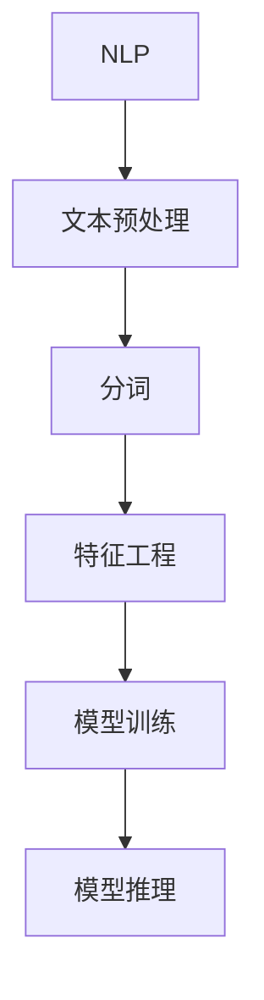

                 

# 文本Tokenization的作用

> 关键词：文本预处理, 自然语言处理(NLP), 分词, 词汇单元, 特征工程

## 1. 背景介绍

在自然语言处理(NLP)领域，文本预处理是一个至关重要的环节。文本数据不同于数值型数据，其特点是无序、非结构化，因此需要进行预处理，以便于后续的特征提取、模型训练等步骤。文本预处理的核心任务之一是Tokenization，即对原始文本进行分词，将其转化为模型能够处理的基本单元。

Tokenization的目的是将文本数据转换为词汇单元，这些词汇单元可以是单词、短语、句子等。通过Tokenization，可以将复杂的文本数据拆解为更小、更易处理的单元，便于后续的特征工程、模型训练和推理等步骤。因此，Tokenization在NLP中的作用不言而喻。

## 2. 核心概念与联系

### 2.1 核心概念概述

本节将介绍几个与Tokenization密切相关的核心概念：

- **自然语言处理(NLP)**：指利用计算机对人类语言进行自动化处理的技术，包括文本预处理、特征提取、模型训练、语义理解等。
- **分词**：将连续的文本切分成独立的词汇单元，是Tokenization的基本操作。
- **词汇单元**：文本中的最小语义单位，可以是单词、短语、句子等。
- **特征工程**：从原始数据中提取有用信息的过程，包括数据清洗、特征选择、特征转换等。
- **模型训练**：利用训练数据训练模型，以学习文本数据的规律和模式。
- **模型推理**：利用训练好的模型对新数据进行预测和推理。

这些核心概念之间的逻辑关系可以通过以下Mermaid流程图来展示：



这个流程图展示了大语言模型的核心概念及其之间的关系：

1. 自然语言处理通过文本预处理、分词、特征工程等步骤，将文本数据转换为模型可处理的形式。
2. 分词是文本预处理中的一个重要环节，将连续的文本切分成独立的词汇单元。
3. 特征工程利用分词后的词汇单元，提取特征信息，为模型训练提供支持。
4. 模型训练通过学习特征和词汇单元，构建出文本分类、情感分析等NLP模型。
5. 模型推理利用训练好的模型，对新文本数据进行预测和推理，得到最终结果。

## 3. 核心算法原理 & 具体操作步骤

### 3.1 算法原理概述

Tokenization的算法原理相对简单，其主要任务是将连续的文本数据拆分为独立的词汇单元。通常有两种方式：基于规则的分词和基于统计的分词。

- **基于规则的分词**：利用预定义的词汇库和语法规则，对文本进行切分。
- **基于统计的分词**：通过统计文本中词汇的分布情况，自动确定词汇边界。

这两种方式各有优缺点，基于规则的分词效率高，但需要手动构建词汇库和语法规则；基于统计的分词灵活性高，但需要大量标注数据作为训练样本。

### 3.2 算法步骤详解

以下是Tokenization的详细步骤：

1. **分词规则定义**：根据任务需求和文本特点，定义分词规则。例如，中文分词通常需要考虑汉字的语义和结构特点，英语分词需要考虑单词的边界。
2. **分词库构建**：根据分词规则，构建分词库，用于切分文本。分词库可以包含固定词汇、词性标注、命名实体等信息。
3. **文本切分**：使用分词库对文本进行切分，将连续的文本转换为独立的词汇单元。
4. **特征提取**：对分词后的词汇单元进行特征提取，如词频、词性、句法结构等。
5. **模型训练**：利用提取的特征信息，训练模型，以进行文本分类、情感分析等任务。

### 3.3 算法优缺点

Tokenization算法具有以下优点：

- **效率高**：分词过程可以通过规则或统计方法高效完成，时间复杂度较低。
- **可扩展性**：可以根据需求自定义分词规则，支持多种语言和文本类型。
- **可复用性**：分词过程可以独立于模型训练和推理，可以复用于不同的NLP任务。

同时，该算法也存在一些局限性：

- **依赖分词库**：分词效果依赖于分词库的质量和完整性，需要手动构建或外部获取。
- **规则复杂**：复杂的规则会导致分词精度降低，甚至出现错误。
- **统计依赖**：基于统计的分词方法需要大量标注数据，对数据量和质量要求较高。

### 3.4 算法应用领域

Tokenization在NLP领域具有广泛的应用，包括但不限于以下领域：

- **文本分类**：对文本进行分类，如新闻分类、情感分类等。
- **命名实体识别**：识别文本中的人名、地名、机构名等特定实体。
- **机器翻译**：将一种语言翻译成另一种语言。
- **问答系统**：对自然语言问题给出答案。
- **文本摘要**：将长文本压缩成简短摘要。
- **信息检索**：从大量文本中检索相关信息。
- **文本生成**：生成自然语言文本，如自动摘要、自动作文等。

## 4. 数学模型和公式 & 详细讲解 & 举例说明

### 4.1 数学模型构建

本节将使用数学语言对Tokenization过程进行更加严格的刻画。

记原始文本为 $X=\{x_1,x_2,\cdots,x_n\}$，其中 $x_i$ 为文本中的一个词汇单元。设分词库为 $\{w_1,w_2,\cdots,w_m\}$，其中 $w_j$ 为词汇单元 $x_i$ 的候选。则分词过程可以表示为：

$$
\text{分词}(X) = \{w_k | w_k \in \{w_1,w_2,\cdots,w_m\}, w_k = x_i \text{ for some } i \}
$$

这里，$\text{分词}(X)$ 表示对文本 $X$ 进行分词后的结果。在实际应用中，通常使用机器学习模型对词汇边界进行预测和标注，以得到最优的分词结果。

### 4.2 公式推导过程

以下以中文分词为例，推导基于规则的分词过程。假设中文分词规则为“双字分隔法”，即每两个汉字之间作为一个词汇单元。则分词过程可以表示为：

$$
\text{分词}(X) = \{x_i | x_i = \{x_{i_1},x_{i_2}\}, x_{i_1} \text{ 和 } x_{i_2} \text{ 都是汉字}, i=1,\cdots,n-1 \}
$$

对于给定的文本 $X=\{x_1,x_2,\cdots,x_n\}$，分词过程可以按照以下步骤进行：

1. **提取候选词汇单元**：遍历文本中的汉字，按照“双字分隔法”提取候选词汇单元。
2. **验证候选词汇单元**：利用正则表达式等方法验证提取的候选词汇单元是否符合规则。
3. **记录分词结果**：将验证通过的词汇单元记录到分词结果中。

### 4.3 案例分析与讲解

下面以英文分词为例，分析基于统计的分词过程。假设我们有一个英文文本 $X=\{x_1,x_2,\cdots,x_n\}$，分词库为 $\{w_1,w_2,\cdots,w_m\}$。假设我们希望将文本按照单词切分，可以得到如下结果：

$$
\text{分词}(X) = \{x_i | x_i = w_j, \text{ 其中 } j \in \{1,\cdots,m\}, w_j \in \{w_1,w_2,\cdots,w_m\} \}
$$

这里，$\text{分词}(X)$ 表示对文本 $X$ 进行分词后的结果。在实际应用中，通常使用统计方法对单词边界进行标注，如最大匹配法、n-gram模型等。

## 5. 项目实践：代码实例和详细解释说明

### 5.1 开发环境搭建

在进行Tokenization实践前，我们需要准备好开发环境。以下是使用Python进行Jupyter Notebook开发的环境配置流程：

1. 安装Anaconda：从官网下载并安装Anaconda，用于创建独立的Python环境。

2. 创建并激活虚拟环境：
```bash
conda create -n nltk-env python=3.8 
conda activate nltk-env
```

3. 安装必要的Python包：
```bash
pip install nltk jieba gensim
```

4. 安装中文分词库jieba：
```bash
pip install jieba
```

完成上述步骤后，即可在`nltk-env`环境中开始Tokenization实践。

### 5.2 源代码详细实现

下面以中文分词为例，给出使用jieba库进行分词的Python代码实现。

```python
import jieba

# 设置分词模式
jieba.set_mode('search')

# 进行分词
text = '我爱自然语言处理'
tokens = jieba.cut(text)

# 输出分词结果
print(tokens)
```

### 5.3 代码解读与分析

让我们再详细解读一下关键代码的实现细节：

**jieba库**：
- `jieba.set_mode('search')`：设置分词模式为“搜索引擎模式”，用于在文本中查找词汇单元。
- `jieba.cut(text)`：对文本进行分词，返回一个生成器对象。
- `print(tokens)`：将分词结果打印输出。

**分词过程**：
- 设置分词模式为“搜索引擎模式”，这意味着分词器会在文本中查找最有可能的词汇单元，而不仅仅是按照预定义的规则进行切分。
- 对文本进行分词，使用生成器返回分词结果。
- 打印分词结果，查看分词效果。

可以看到，jieba库提供了简洁高效的中文字词分词方式，可以满足大部分NLP任务的需求。

## 6. 实际应用场景

### 6.1 智能客服系统

在智能客服系统中，分词技术可以用于自动理解用户的意图和提取关键信息。通过分词技术，将用户输入的自然语言文本转换为词汇单元，可以更准确地理解用户的意图，提高客服系统的响应速度和准确率。

例如，在处理用户输入“我需要订购一台苹果笔记本”时，分词技术可以将其切分为“我需要订购”、“一台”、“苹果”、“笔记本”等词汇单元，从而更准确地识别用户需求。

### 6.2 金融舆情监测

在金融舆情监测中，分词技术可以用于自动分析和识别舆情信息。通过分词技术，可以将金融领域相关的新闻、报道、评论等文本数据切分成独立的词汇单元，便于进一步分析和识别舆情信息。

例如，在分析一条新闻报道“上证指数突破3000点”时，分词技术可以将其切分为“上证指数”、“突破”、“3000点”等词汇单元，从而更准确地判断舆情信息的重要性和方向。

### 6.3 个性化推荐系统

在个性化推荐系统中，分词技术可以用于提取用户的兴趣点和推荐内容。通过分词技术，将用户浏览、点击、评论等行为数据切分成独立的词汇单元，便于提取用户的兴趣点和推荐内容。

例如，在分析用户对某本书的评论“这本书太棒了！”时，分词技术可以将其切分为“这本书”、“太棒了”等词汇单元，从而更准确地提取用户的兴趣点，推荐相关书籍。

### 6.4 未来应用展望

随着分词技术的不断发展和应用，未来的分词技术将呈现以下几个发展趋势：

1. **多语言支持**：分词技术将不仅仅局限于中文，逐渐向多语言扩展，支持更多语言的词汇切分和标注。
2. **语义分析**：分词技术将结合语义分析，更准确地理解词汇的含义和上下文，提高分词精度。
3. **在线实时分词**：分词技术将支持在线实时分词，提高文本处理效率。
4. **自动化标注**：分词技术将结合自动标注技术，减少人工标注工作量，提高分词效率和质量。

## 7. 工具和资源推荐

### 7.1 学习资源推荐

为了帮助开发者系统掌握分词技术的理论基础和实践技巧，这里推荐一些优质的学习资源：

1. **《Python自然语言处理》书籍**：介绍Python中常用的自然语言处理库，包括nltk、spaCy等，并详细讲解了中文分词技术。

2. **自然语言处理（NLP）课程**：斯坦福大学、麻省理工学院等名校开设的NLP课程，涵盖自然语言处理的基本概念、技术和应用。

3. **jieba分词库官方文档**：jieba库的官方文档，提供了丰富的分词算法和应用示例，是快速上手分词技术的必备资料。

4. **NLP开源项目**：开源社区中的NLP项目，如spaCy、NLTK等，提供了丰富的分词算法和应用示例，可以帮助开发者快速上手分词技术。

通过对这些资源的学习实践，相信你一定能够快速掌握分词技术的精髓，并用于解决实际的NLP问题。

### 7.2 开发工具推荐

高效的开发离不开优秀的工具支持。以下是几款用于分词开发的常用工具：

1. **Python编程语言**：Python作为NLP开发的主流语言，具有丰富的库和工具支持，易于上手。

2. **Jupyter Notebook**：交互式编程环境，便于快速迭代和调试代码。

3. **jieba分词库**：中文分词库，支持多种分词模式和应用场景，是中文分词技术的优秀实现。

4. **spaCy库**：英文分词库，支持多种分词算法和语言，是英文分词技术的优秀实现。

5. **NLTK库**：自然语言处理工具库，涵盖多种分词算法和语言，是自然语言处理领域的经典工具。

6. **TextBlob库**：自然语言处理工具库，支持多种语言的分词和文本处理功能，是文本处理的优秀实现。

合理利用这些工具，可以显著提升分词任务的开发效率，加快创新迭代的步伐。

### 7.3 相关论文推荐

分词技术的发展源于学界的持续研究。以下是几篇奠基性的相关论文，推荐阅读：

1. **《中文分词系统实现》**：介绍中文分词系统的实现方法和评价指标，是中文分词技术的经典著作。

2. **《WordTokenization: Space or Byte?》**：讨论英文分词中“空格分词”和“字节分词”两种方法的区别和应用场景，是英文分词技术的经典著作。

3. **《Fine-Grained Word-Level Annotation for Heterogeneous News Sources》**：介绍多源新闻数据的词汇切分方法，是新闻文本处理领域的经典论文。

4. **《Wikipedia-Based Automatic Chinese Word Segmentation》**：介绍基于维基百科的数据驱动中文分词方法，是中文分词技术的经典论文。

这些论文代表了大语言模型微调技术的发展脉络。通过学习这些前沿成果，可以帮助研究者把握学科前进方向，激发更多的创新灵感。

## 8. 总结：未来发展趋势与挑战

### 8.1 总结

本文对分词技术进行了全面系统的介绍。首先阐述了分词技术在大语言处理中的重要性，明确了分词技术在NLP应用中的核心地位。其次，从原理到实践，详细讲解了分词算法的数学模型和具体步骤，给出了分词任务开发的完整代码实例。同时，本文还广泛探讨了分词技术在智能客服、金融舆情、个性化推荐等多个领域的应用前景，展示了分词范式的巨大潜力。此外，本文精选了分词技术的各类学习资源，力求为读者提供全方位的技术指引。

通过本文的系统梳理，可以看到，分词技术在NLP中的核心地位，以及其在实际应用中的广泛应用。分词技术为文本处理提供了坚实的基础，是任何NLP系统必不可少的一部分。未来，伴随分词技术的发展和应用，NLP系统将变得更加高效、智能和通用，为人类认知智能的进化带来深远影响。

### 8.2 未来发展趋势

展望未来，分词技术将呈现以下几个发展趋势：

1. **自动化分词**：未来的分词技术将更加自动化，减少人工标注工作量，提高分词效率和质量。
2. **语义分词**：分词技术将结合语义分析，更准确地理解词汇的含义和上下文，提高分词精度。
3. **多语言支持**：分词技术将支持更多语言，逐渐向多语言扩展，支持更多语言的词汇切分和标注。
4. **在线实时分词**：分词技术将支持在线实时分词，提高文本处理效率。
5. **集成多源数据**：分词技术将集成多源数据，结合文本、语音、图像等多模态数据，提高文本处理能力。

以上趋势凸显了分词技术的广阔前景。这些方向的探索发展，必将进一步提升NLP系统的性能和应用范围，为人类认知智能的进化带来深远影响。

### 8.3 面临的挑战

尽管分词技术已经取得了瞩目成就，但在迈向更加智能化、普适化应用的过程中，它仍面临着诸多挑战：

1. **分词库依赖**：分词效果依赖于分词库的质量和完整性，需要手动构建或外部获取。
2. **规则复杂**：复杂的规则会导致分词精度降低，甚至出现错误。
3. **统计依赖**：基于统计的分词方法需要大量标注数据，对数据量和质量要求较高。
4. **语义理解**：传统的分词技术缺乏语义理解能力，难以处理歧义和同义词。

### 8.4 研究展望

面对分词技术所面临的种种挑战，未来的研究需要在以下几个方面寻求新的突破：

1. **多源数据融合**：结合文本、语音、图像等多模态数据，提高分词精度和语义理解能力。
2. **自动化标注**：减少人工标注工作量，提高分词效率和质量。
3. **语义分析**：结合语义分析，更准确地理解词汇的含义和上下文，提高分词精度。
4. **多语言支持**：支持更多语言，逐渐向多语言扩展，支持更多语言的词汇切分和标注。
5. **集成深度学习**：结合深度学习技术，提高分词精度和自动化程度。

这些研究方向的探索，必将引领分词技术迈向更高的台阶，为构建安全、可靠、可解释、可控的智能系统铺平道路。面向未来，分词技术还需要与其他人工智能技术进行更深入的融合，如知识表示、因果推理、强化学习等，多路径协同发力，共同推动自然语言理解和智能交互系统的进步。只有勇于创新、敢于突破，才能不断拓展分词技术的边界，让智能技术更好地造福人类社会。

## 9. 附录：常见问题与解答

**Q1：分词在NLP中起什么作用？**

A: 分词在NLP中起着重要的作用，它将连续的文本数据拆分成独立的词汇单元，便于后续的特征提取、模型训练和推理等步骤。通过分词，可以更准确地理解文本中的语义信息，提高模型的性能和效果。

**Q2：分词的算法有哪些？**

A: 分词算法主要分为基于规则的分词和基于统计的分词。基于规则的分词依赖预定义的词汇库和语法规则，基于统计的分词依赖大量标注数据。两种算法各有优缺点，需要根据具体需求选择合适的分词算法。

**Q3：如何进行分词？**

A: 分词的过程可以按照以下步骤进行：
1. 定义分词规则或构建分词库。
2. 对文本进行切分，提取候选词汇单元。
3. 验证候选词汇单元，选择最优的分词结果。

**Q4：分词的效率如何？**

A: 分词的效率主要取决于分词算法和分词库的质量。基于规则的分词算法效率高，但需要预定义词汇库；基于统计的分词算法灵活性高，但需要大量标注数据。分词过程的时间复杂度较低，通常可以在很短的时间内完成。

**Q5：分词技术的应用有哪些？**

A: 分词技术在NLP中具有广泛的应用，包括文本分类、命名实体识别、机器翻译、问答系统、文本摘要、信息检索、文本生成等。通过分词，可以更准确地理解文本中的语义信息，提高模型的性能和效果。

---

作者：禅与计算机程序设计艺术 / Zen and the Art of Computer Programming

