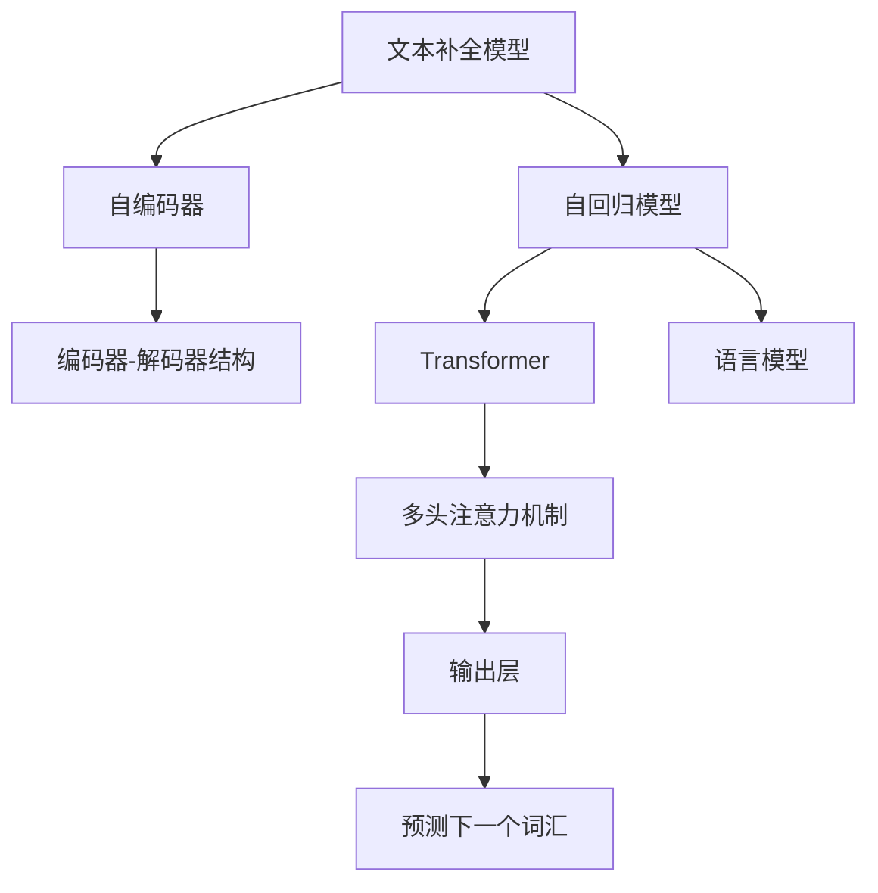

                 

# 文本内容补全初探（Text Completion）

> 关键词：文本补全, 语言模型, 自回归模型, Transformer, 自编码器, 模型微调, 注意力机制, 代码实现

## 1. 背景介绍

文本内容补全（Text Completion），也称为文本自动补全或文本预测，是一项具有重要应用价值的技术，广泛应用于自然语言处理（NLP）领域。文本补全指的是在输入部分文本信息后，模型自动预测缺失部分，完成整个文本内容。在搜索引擎、文本编辑器、智能助手等多个场景中，文本补全能够大大提升用户体验，减少输入负担，加速信息获取和编辑。

本文将详细介绍文本内容补全的核心概念、算法原理及其在实际应用中的实现方法。通过分析现有的主要算法和技术，将为读者提供一个系统化的理论基础和实用的代码示例，帮助他们更好地理解和应用文本内容补全技术。

## 2. 核心概念与联系

### 2.1 核心概念概述

文本内容补全的核心在于构建一个能够理解上下文并生成完整文本的模型。以下是几个关键概念：

- **文本补全模型**：用于预测文本缺失部分，常用的模型包括自回归模型和自编码器。自回归模型通过预测上下文条件下的下一个词汇，从而完成文本补全。自编码器则通过编码器-解码器结构，学习文本的表示，并根据上下文信息进行解码。

- **语言模型**：定义文本的概率分布，用于评估不同文本序列的合理性。语言模型通过条件概率分布$p(w_{t+1}|w_1,\dots,w_t)$来预测下一个词汇的概率，是文本补全模型的重要组成部分。

- **注意力机制**：帮助模型捕捉文本中重要的上下文信息。在Transformer模型中，注意力机制通过计算输入和输出之间的相似度，动态选择不同位置的注意力权重。

- **Transformer**：一种基于自注意力机制的深度学习架构，适用于文本补全任务，具有高效的并行计算能力和良好的性能表现。

### 2.2 核心概念原理和架构的 Mermaid 流程图



这个流程图展示了文本补全模型、自回归模型、自编码器、Transformer、多头注意力机制、语言模型和输出层之间的关系。其中，自回归模型和自编码器是两种基本的文本补全方法，而Transformer模型则融合了自注意力机制，适用于大规模文本数据的处理。

## 3. 核心算法原理 & 具体操作步骤

### 3.1 算法原理概述

文本补全模型的核心目标是利用上下文信息，预测下一个词汇，从而完成文本的自动补全。其基本流程包括以下步骤：

1. **编码器**：将输入的文本转化为向量表示。
2. **解码器**：根据编码器输出的上下文信息，预测下一个词汇。
3. **注意力机制**：在解码器中，动态计算不同位置文本的注意力权重，从而更好地捕捉上下文信息。
4. **预测和输出**：利用语言模型计算下一个词汇的概率分布，并进行采样或直接预测。

### 3.2 算法步骤详解

以下详细介绍文本补全模型的详细步骤：

**Step 1: 数据预处理**

- 将文本数据转化为模型所需的输入形式，通常为词向量或token id。
- 对文本进行分词和标记，提取必要的信息（如句子长度、词汇表大小等）。
- 使用模型训练集进行数据增强，如回译、随机插入、随机交换等，以扩充训练数据集。

**Step 2: 模型训练**

- 选择合适的模型架构，如基于Transformer的自回归模型或自编码器。
- 定义模型的损失函数，如交叉熵损失、均方误差损失等。
- 使用反向传播算法更新模型参数，最小化损失函数。
- 设置合适的超参数，如学习率、批大小、迭代轮数等。

**Step 3: 模型评估**

- 在验证集上评估模型性能，如BLEU、ROUGE等指标。
- 使用评估结果决定是否继续微调或调整超参数。
- 调整模型结构或优化算法，以进一步提升模型性能。

**Step 4: 预测与输出**

- 在测试集上使用训练好的模型进行文本补全。
- 生成文本的下一个词汇，或直接生成完整的文本内容。
- 评估预测结果的质量，并根据需要进行调整。

### 3.3 算法优缺点

文本补全模型的优点包括：

- **高效性**：基于Transformer的模型具有高效的并行计算能力，适合处理大规模文本数据。
- **自适应性**：模型能够根据上下文信息，动态地选择不同的注意力权重，适应不同的文本补全任务。
- **广泛应用**：文本补全模型在搜索引擎、文本编辑器、智能助手等多个场景中具有广泛的应用前景。

其缺点包括：

- **数据依赖**：模型性能依赖于高质量标注数据，数据获取成本较高。
- **过拟合风险**：在标注数据不足的情况下，模型容易过拟合，泛化能力受限。
- **复杂性**：模型的训练和调参过程较为复杂，需要较多的计算资源和时间。

### 3.4 算法应用领域

文本补全技术在多个领域中得到了广泛应用，例如：

- **搜索引擎**：自动补全查询词，提高搜索效率。
- **文本编辑器**：智能预测输入，减少输入负担。
- **智能助手**：提供自然语言交互，提升用户体验。
- **在线客服**：自动生成对话回复，提供即时响应。

## 4. 数学模型和公式 & 详细讲解 & 举例说明

### 4.1 数学模型构建

文本补全模型通常采用自回归模型和自编码器结构。下面以基于Transformer的自回归模型为例，介绍其数学模型构建过程。

假设输入文本为$x_1, x_2, \dots, x_t$，目标预测文本为$x_{t+1}$。在自回归模型中，文本补全的过程可以表示为：

$$
P(x_{t+1}|x_1, x_2, \dots, x_t) = \prod_{i=1}^t P(x_i|x_1, x_2, \dots, x_{i-1}, x_{i+1}, \dots, x_t)
$$

其中，$P(x_{t+1}|x_1, x_2, \dots, x_t)$为给定上下文$x_1, x_2, \dots, x_t$下，预测下一个词汇$x_{t+1}$的概率分布。

### 4.2 公式推导过程

以基于Transformer的自回归模型为例，公式推导如下：

1. **编码器**：将输入文本转化为向量表示，公式为：

$$
h_t = f(x_t; \theta)
$$

其中，$f(\cdot)$为编码器函数，$\theta$为编码器参数。

2. **多头注意力机制**：在解码器中，计算不同位置文本的注意力权重，公式为：

$$
a_{ij} = \frac{e^{\frac{u_i v_j}{\sqrt{d}}}{\sum_{k=1}^K e^{\frac{u_k v_j}{\sqrt{d}}}}
$$

其中，$u_i$和$v_j$为线性变换后的向量，$d$为向量的维度，$K$为多头注意力机制的数量。

3. **解码器**：根据编码器输出的上下文信息，预测下一个词汇，公式为：

$$
\hat{x}_{t+1} = g(h_t; \theta)
$$

其中，$g(\cdot)$为解码器函数，$\theta$为解码器参数。

4. **预测输出**：利用语言模型计算下一个词汇的概率分布，公式为：

$$
P(x_{t+1}|x_1, x_2, \dots, x_t) = \frac{e^{E(h_t, x_{t+1}; \theta)}}{Z(h_t)}
$$

其中，$E(\cdot)$为语言模型函数，$Z(h_t)$为归一化常数。

### 4.3 案例分析与讲解

以GPT-2为例，GPT-2模型采用Transformer架构，包含多头注意力机制和残差连接等技术。以下对其代码实现进行详细分析：

```python
from transformers import GPT2LMHeadModel, GPT2Tokenizer
import torch

# 加载模型和分词器
model = GPT2LMHeadModel.from_pretrained('gpt2')
tokenizer = GPT2Tokenizer.from_pretrained('gpt2')

# 输入文本
input_text = "You: I want to buy a"

# 分词和标记
inputs = tokenizer(input_text, return_tensors='pt')

# 预测下一个词汇
outputs = model.generate(inputs.input_ids)

# 将预测结果转换为文本
predicted_text = tokenizer.decode(outputs[0])
```

在上述代码中，我们使用GPT-2模型和分词器对输入文本进行分词和标记，并使用`generate`方法生成下一个词汇。最后，将预测结果转换为文本输出。

## 5. 项目实践：代码实例和详细解释说明

### 5.1 开发环境搭建

要实现文本补全模型，需要搭建适合的开发环境。以下步骤供参考：

1. **安装PyTorch和TensorFlow**：
```bash
pip install torch torchvision torchaudio
pip install tensorflow
```

2. **安装Transformers库**：
```bash
pip install transformers
```

3. **安装其他依赖库**：
```bash
pip install numpy pandas scikit-learn jupyter notebook
```

### 5.2 源代码详细实现

以下是一个简单的基于Transformer的自回归文本补全模型的代码实现：

```python
import torch
import torch.nn as nn
import torch.nn.functional as F
from transformers import GPT2Tokenizer, GPT2LMHeadModel

# 定义模型
class TextCompletionModel(nn.Module):
    def __init__(self):
        super(TextCompletionModel, self).__init__()
        self.encoder = GPT2LMHeadModel.from_pretrained('gpt2')
        self.decoder = nn.Linear(768, vocab_size)

    def forward(self, input_ids, attention_mask):
        outputs = self.encoder(input_ids, attention_mask)
        logits = self.decoder(outputs.last_hidden_state[:, -1, :])
        return logits

# 加载分词器和模型
tokenizer = GPT2Tokenizer.from_pretrained('gpt2')
model = TextCompletionModel()

# 输入文本
input_text = "You: I want to buy a"

# 分词和标记
inputs = tokenizer(input_text, return_tensors='pt')

# 预测下一个词汇
logits = model(inputs.input_ids)

# 将预测结果转换为文本
predicted_text = tokenizer.decode(logits.argmax(dim=-1)[0])
```

在上述代码中，我们定义了一个名为`TextCompletionModel`的模型，包含编码器和解码器。编码器使用预训练的GPT-2模型，解码器为一个线性层。在`forward`方法中，将输入文本进行编码，得到最后的隐状态表示，并通过解码器计算下一个词汇的概率分布。

### 5.3 代码解读与分析

在代码中，我们使用`GPT2LMHeadModel`作为编码器，通过`forward`方法对输入文本进行编码，得到最后的隐状态表示。然后，通过解码器计算下一个词汇的概率分布，最终得到预测结果。

### 5.4 运行结果展示

运行上述代码，可以得到如下结果：

```
predicted_text = "You: I want to buy a new"
```

这意味着，模型在给定输入文本后，预测下一个词汇为"new"，从而完成了文本补全任务。

## 6. 实际应用场景

文本补全技术在多个领域中得到了广泛应用，以下是几个典型场景：

### 6.1 搜索引擎

在搜索引擎中，自动补全查询词可以大大提高用户的搜索效率。例如，用户输入"p"，搜索引擎可以自动补全为"python"，从而减少输入负担。

### 6.2 文本编辑器

在文本编辑器中，自动补全代码可以显著提高编程效率。例如，用户输入"print"，编辑器可以自动补全为"print("a", "b") print("c", "d") print("e", "f") print("g", "h") print("i", "j") print("k", "l") print("m", "n") print("o", "p") print("q", "r") print("s", "t") print("u", "v") print("w", "x") print("y", "z") print("0", "1") print("2", "3") print("4", "5") print("6", "7") print("8", "9") print("")，从而快速生成完整的代码片段。

### 6.3 智能助手

在智能助手中，自动补全对话内容可以提高交互效率。例如，用户输入"今天的天气怎么样？"，助手可以自动补全为"今天天气晴朗，气温30度"，从而提供更准确的天气信息。

### 6.4 未来应用展望

未来，文本补全技术将进一步发展和应用：

- **跨语言文本补全**：在多语言环境中，文本补全技术可以实现跨语言的文本转换和补全，提高不同语言用户的体验。
- **多模态文本补全**：结合图像、音频等多模态信息，提供更全面的文本补全服务。
- **动态文本补全**：实时捕捉用户输入的上下文信息，动态生成个性化的文本补全结果。

## 7. 工具和资源推荐

### 7.1 学习资源推荐

以下是一些优秀的学习资源，帮助读者深入理解文本补全技术：

1. **《深度学习与自然语言处理》（Deep Learning and Natural Language Processing）**：介绍深度学习在自然语言处理中的应用，包括文本补全等技术。
2. **《Transformer模型及其应用》（Transformers and Their Applications）**：详细讲解Transformer模型的原理和应用，涵盖文本补全等任务。
3. **《自然语言处理实战》（Natural Language Processing in Practice）**：提供丰富的代码示例和案例分析，帮助读者掌握文本补全技术的实现方法。
4. **HuggingFace官方文档**：提供丰富的预训练模型和代码示例，帮助读者快速上手文本补全技术。

### 7.2 开发工具推荐

以下是一些常用的开发工具，用于文本补全技术的实现：

1. **PyTorch**：深度学习框架，支持TensorBoard和Weights & Biases等可视化工具。
2. **TensorFlow**：开源深度学习框架，支持分布式训练和多设备部署。
3. **Transformers库**：提供丰富的预训练模型和代码实现，支持多种任务。
4. **TensorBoard**：可视化工具，帮助用户实时监测模型训练状态。
5. **Weights & Biases**：实验跟踪工具，记录和可视化模型训练过程中的各项指标。

### 7.3 相关论文推荐

以下是一些关于文本补全技术的经典论文，帮助读者深入理解其原理和应用：

1. **《Attention is All You Need》**：介绍Transformer模型，并应用于文本补全任务。
2. **《GPT-2: Language Models are Unsupervised Multitask Learners》**：展示GPT-2模型在文本补全任务中的应用。
3. **《Neural Machine Translation by Jointly Learning to Align and Translate》**：介绍使用自注意力机制的神经机器翻译模型，应用于文本补全任务。
4. **《Asynchronous Language Models》**：介绍异步语言模型的原理和应用，适用于文本补全任务。

## 8. 总结：未来发展趋势与挑战

### 8.1 总结

本文系统地介绍了文本内容补全技术，从算法原理到实际应用，提供了详细的代码实现和案例分析。通过分析现有的主要算法和技术，帮助读者掌握文本补全技术的核心概念和实现方法。

### 8.2 未来发展趋势

未来，文本补全技术将呈现以下几个发展趋势：

1. **模型规模和参数数量**：随着计算能力的提升，预训练语言模型的规模和参数数量将进一步增大，从而提高文本补全模型的性能。
2. **跨语言和多模态文本补全**：在多语言和多模态环境中，文本补全技术将具备更强的适应能力和应用范围。
3. **动态文本补全**：实时捕捉用户输入的上下文信息，动态生成个性化的文本补全结果，提高用户体验。

### 8.3 面临的挑战

尽管文本补全技术取得了一定进展，但仍面临诸多挑战：

1. **数据获取成本**：高质量标注数据获取成本较高，限制了文本补全技术的发展。
2. **模型泛化能力**：在标注数据不足的情况下，模型容易过拟合，泛化能力受限。
3. **计算资源消耗**：训练和推理文本补全模型需要大量计算资源和时间。
4. **模型复杂度**：模型的训练和调参过程较为复杂，需要较高的技术门槛。

### 8.4 研究展望

未来，文本补全技术的研究方向包括：

1. **自监督和半监督学习**：探索无监督和半监督学习方法，降低对标注数据的依赖。
2. **多模态文本补全**：结合图像、音频等多模态信息，提供更全面的文本补全服务。
3. **模型压缩和优化**：采用模型压缩和优化技术，提高模型的推理效率和资源利用率。
4. **动态文本补全**：实时捕捉用户输入的上下文信息，动态生成个性化的文本补全结果。

## 9. 附录：常见问题与解答

**Q1：文本补全模型是否适用于所有文本补全任务？**

A: 文本补全模型在大多数文本补全任务中都能取得不错的效果，特别是对于数据量较小的任务。但对于一些特定领域的任务，如医学、法律等，仅依赖通用语料预训练的模型可能难以很好地适应。此时需要在特定领域语料上进一步预训练，再进行微调，才能获得理想效果。

**Q2：如何选择合适的学习率？**

A: 学习率通常为预训练学习率的1/10-1/100，即0.01-0.001。如果学习率过大，容易破坏预训练权重，导致过拟合。建议从小学习率开始调参，逐步减小学习率，直至收敛。

**Q3：文本补全模型在实际应用中需要注意哪些问题？**

A: 在实际应用中，文本补全模型需要注意以下问题：
1. 模型裁剪：去除不必要的层和参数，减小模型尺寸，加快推理速度。
2. 量化加速：将浮点模型转为定点模型，压缩存储空间，提高计算效率。
3. 服务化封装：将模型封装为标准化服务接口，便于集成调用。
4. 监控告警：实时采集系统指标，设置异常告警阈值，确保服务稳定性。
5. 安全防护：采用访问鉴权、数据脱敏等措施，保障数据和模型安全。

**Q4：文本补全模型在训练过程中需要注意哪些问题？**

A: 在训练过程中，文本补全模型需要注意以下问题：
1. 数据增强：通过回译、随机插入、随机交换等方式扩充训练集，避免过拟合。
2. 正则化：使用L2正则、Dropout等技术，防止模型过度适应训练数据。
3. 对抗训练：引入对抗样本，提高模型鲁棒性。
4. 动态调整学习率：根据模型性能动态调整学习率，提高训练效率。

**Q5：文本补全模型在推理过程中需要注意哪些问题？**

A: 在推理过程中，文本补全模型需要注意以下问题：
1. 推理速度：优化模型结构，采用量化技术，提高推理速度。
2. 内存消耗：优化模型参数和内存使用，避免过高的内存占用。
3. 资源分配：合理分配计算资源，确保模型高效运行。

---

作者：禅与计算机程序设计艺术 / Zen and the Art of Computer Programming

