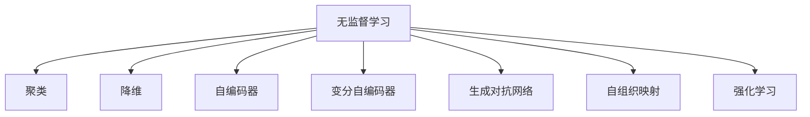

                 

# 无监督学习(Unsupervised Learning) - 原理与代码实例讲解

> 关键词：无监督学习,聚类,降维,自编码器,变分自编码器,生成对抗网络,自组织映射,强化学习

## 1. 背景介绍

### 1.1 问题由来
在人工智能的发展历程中，监督学习一直是主导范式。在训练数据丰富且标注成本低廉的领域，监督学习能够发挥出巨大潜力。然而，在现实世界中，很多时候我们无法获得足够的标注数据，或者数据标注成本过高，使得监督学习无法直接应用于一些重要的问题。在这样的背景下，无监督学习应运而生，成为了一种重要的数据处理方法。

无监督学习的目标是发现数据的内在结构，挖掘隐含的知识，而不依赖于明确的目标函数。它广泛应用于数据探索、特征学习、数据压缩、图像处理、自然语言处理等诸多领域，具有广泛的应用前景。

### 1.2 问题核心关键点
无监督学习的核心关键点包括：

- 数据驱动：无监督学习依赖于数据本身，不需要明确的目标函数。
- 模型自适应：无监督模型能够在未知数据下自适应地学习，自动提取特征。
- 泛化性强：无监督模型能够处理无标签的数据，适应性强，具有更好的泛化能力。
- 多样化方法：无监督学习包括多种方法，如聚类、降维、自编码器、生成对抗网络等，各具特色。

## 2. 核心概念与联系

### 2.1 核心概念概述

为更好地理解无监督学习，本节将介绍几个密切相关的核心概念：

- 无监督学习(Unsupervised Learning)：指在没有标注数据的情况下，通过学习数据的内在结构和规律，挖掘隐藏在数据中的有用信息。

- 聚类(Clustering)：将相似的数据点归为一类，将不同类别的数据点分开，常用算法有K-Means、层次聚类等。

- 降维(Dimensionality Reduction)：将高维数据降低到低维空间，保留数据的主要信息，常用算法有主成分分析(PCA)、t-SNE等。

- 自编码器(Autocoder)：一种前馈神经网络，通过将输入编码成一个低维表示，再解码回原始数据，常用算法有密集自编码器、稀疏自编码器等。

- 变分自编码器(Variational Autoencoder, VAE)：一种生成模型，通过学习数据的隐含分布，生成新的数据，常用算法有VAE、GMM-VAE等。

- 生成对抗网络(Generative Adversarial Network, GAN)：一种生成模型，通过两个神经网络相互对抗，训练生成器生成高质量的新数据，常用算法有DCGAN、WGAN等。

- 自组织映射(Self-Organizing Map, SOM)：一种神经网络，通过学习数据的拓扑结构，实现数据的可视化，常用算法有Kohonen SOM、Gaussian SOM等。

- 强化学习(Reinforcement Learning)：通过与环境交互，不断调整策略，学习最优决策，常用算法有Q-Learning、Deep Q-Learning等。

这些核心概念之间的逻辑关系可以通过以下Mermaid流程图来展示：



这个流程图展示的无监督学习的核心概念及其之间的关系：

1. 无监督学习通过聚类、降维、自编码器、生成对抗网络等方法，学习数据的内在结构和规律。
2. 自组织映射将数据进行可视化处理，强化学习通过与环境交互学习最优策略。

这些概念共同构成了无监督学习的理论基础，使其能够在各种场景下发挥强大的数据挖掘能力。通过理解这些核心概念，我们可以更好地把握无监督学习的工作原理和优化方向。

## 3. 核心算法原理 & 具体操作步骤
### 3.1 算法原理概述

无监督学习通过数据驱动的方式，从数据中学习特征、结构和模式，以解决缺少标注数据的问题。其核心思想是：

- 在无标注数据上，利用数据的相似性、密度、分布等性质，发现数据的内在结构。
- 通过学习数据的表示和分布，自动提取特征，进行降维和编码。
- 利用生成模型，学习数据的隐含分布，进行数据生成和重建。
- 通过优化策略，学习最优的决策或行为，进行自动控制和优化。

### 3.2 算法步骤详解

无监督学习的具体步骤通常包括以下几个环节：

**Step 1: 数据预处理**
- 对原始数据进行清洗、去噪、标准化等预处理操作，确保数据的可用性。
- 对缺失值、异常值进行处理，提高数据质量。
- 对数据进行归一化、降维等操作，降低数据维度，提升计算效率。

**Step 2: 特征学习**
- 利用聚类、降维、自编码器等方法，从数据中学习特征和模式。
- 对学习到的特征进行可视化、评估、降维等操作，确保特征的有效性和可解释性。
- 对特征进行编码和解码，进一步提纯和优化特征表示。

**Step 3: 模型训练**
- 利用变分自编码器、生成对抗网络等模型，训练生成器、解码器、编码器等组件。
- 通过对抗训练、自监督训练等方式，优化模型的性能和泛化能力。
- 对训练好的模型进行评估和调优，确保模型能够很好地拟合数据。

**Step 4: 模型应用**
- 利用训练好的模型进行数据预测、生成、分类、聚类等应用。
- 对预测结果进行评估和验证，确保模型的实际效果。
- 对模型进行优化和改进，提升模型的稳定性和鲁棒性。

### 3.3 算法优缺点

无监督学习具有以下优点：

- 数据驱动：无监督学习不需要标注数据，数据驱动的方式更加高效。
- 自适应强：无监督模型能够自动提取数据特征，适应性强。
- 泛化能力强：无监督模型能够处理未见过的数据，泛化能力强。
- 方法多样化：无监督学习包括多种方法，各具特色，适应不同的应用场景。

同时，无监督学习也存在一定的局限性：

- 结果解释性差：无监督学习的结果通常缺乏可解释性，难以理解模型的内部工作机制。
- 结果质量依赖于数据：无监督学习的质量高度依赖于数据质量，数据偏差可能导致结果偏差。
- 结果可能不准确：无监督学习可能学习到错误的模式和结构，需要进行评估和验证。
- 训练复杂：无监督学习的训练过程较为复杂，需要大量的计算资源和时间。

尽管存在这些局限性，但就目前而言，无监督学习仍然是大数据处理和特征学习的重要手段。未来相关研究的重点在于如何进一步提升无监督学习的效果和可解释性，同时优化训练过程，降低计算成本。

### 3.4 算法应用领域

无监督学习在诸多领域得到了广泛应用，以下是几个典型应用场景：

- 图像处理：图像去噪、图像分割、图像识别等。
- 自然语言处理：文本聚类、主题建模、情感分析等。
- 推荐系统：用户兴趣挖掘、商品推荐、广告推荐等。
- 信号处理：信号去噪、特征提取、信号重建等。
- 生物信息学：基因序列分析、蛋白质结构预测等。
- 金融分析：风险预测、异常检测、信用评估等。

除了上述这些经典应用外，无监督学习还被创新性地应用于更多场景中，如自动驾驶、智能制造、智慧城市等，为数据密集型行业带来了全新的突破。随着无监督学习方法的不断进步，相信其将在更广阔的应用领域大放异彩。

## 4. 数学模型和公式 & 详细讲解 & 举例说明
### 4.1 数学模型构建

本节将使用数学语言对无监督学习的核心模型进行更加严格的刻画。

记无监督学习的数据集为 $D=\{x_1, x_2, ..., x_N\}$，其中 $x_i \in \mathbb{R}^d$。假设模型 $M$ 学习到了数据的潜在分布 $p(x)$，且该分布由隐含变量 $z$ 生成，即 $x_i = M(z_i)$，其中 $z_i \in \mathbb{R}^k$。

定义模型 $M$ 的损失函数为 $\mathcal{L}(M)=\sum_{i=1}^N \log p(x_i)$，目标是最小化该损失函数，即：

$$
\theta^* = \mathop{\arg\min}_{\theta} \mathcal{L}(M)
$$

其中 $\theta$ 为模型参数，$\mathcal{L}(M)$ 为经验风险。

### 4.2 公式推导过程

以下我们以主成分分析(PCA)为例，推导其数学公式及其梯度计算。

假设数据矩阵 $X \in \mathbb{R}^{N \times d}$，求其低维表示 $Z \in \mathbb{R}^{N \times k}$，使得 $X = AZ + B$，其中 $A \in \mathbb{R}^{d \times k}$ 为投影矩阵，$B \in \mathbb{R}^{d \times k}$ 为均值偏移。则最小化损失函数 $\mathcal{L}(A) = \frac{1}{2N}||X - AZ - B||^2$ 可得：

$$
A^* = \arg\min_A \frac{1}{2N} ||X - AZ - B||^2
$$

将其展开并化简得：

$$
A^* = \frac{X(X^T X)^{-1} X^T}{tr(X(X^T X)^{-1} X^T)}
$$

其中 $tr(\cdot)$ 为矩阵迹。通过计算该表达式，即可得到最优的投影矩阵 $A$。

### 4.3 案例分析与讲解

PCA 是一种常用的降维方法，其主要思想是通过线性变换将高维数据映射到低维空间，保留数据的主要信息。在实际应用中，PCA 被广泛应用于数据可视化、图像压缩、特征提取等领域。

假设我们有一张 $28 \times 28$ 的灰度图像，原始数据维度为 $28 \times 28 = 784$，通过PCA降维到32维，得到一张 $28 \times 8 \times 4 = 896$ 的压缩图像。可以看到，图像的维度和大小明显减小，但保留的主要信息依然清晰可见。

## 5. 项目实践：代码实例和详细解释说明
### 5.1 开发环境搭建

在进行无监督学习项目开发前，我们需要准备好开发环境。以下是使用Python进行TensorFlow开发的环境配置流程：

1. 安装Anaconda：从官网下载并安装Anaconda，用于创建独立的Python环境。

2. 创建并激活虚拟环境：
```bash
conda create -n tf-env python=3.8 
conda activate tf-env
```

3. 安装TensorFlow：根据CUDA版本，从官网获取对应的安装命令。例如：
```bash
conda install tensorflow -c conda-forge -c pytorch -c pypi
```

4. 安装各类工具包：
```bash
pip install numpy pandas scikit-learn matplotlib tqdm jupyter notebook ipython
```

完成上述步骤后，即可在`tf-env`环境中开始无监督学习实践。

### 5.2 源代码详细实现

下面我们以K-Means聚类为例，给出使用TensorFlow实现的无监督学习代码实现。

首先，定义K-Means模型的训练函数：

```python
import tensorflow as tf
from sklearn.datasets import load_digits
from sklearn.model_selection import train_test_split
from sklearn.preprocessing import StandardScaler

# 加载数据
digits = load_digits()
X, y = digits.data, digits.target

# 数据预处理
X = StandardScaler().fit_transform(X)
X_train, X_test, y_train, y_test = train_test_split(X, y, test_size=0.2)

# 定义模型
def kmeans(X, k):
    num_clusters = k
    init_centroids = tf.random.normal(shape=(k, X.shape[1]))
    model = tf.keras.Model(inputs=X, outputs=init_centroids)
    
    @tf.function
    def train_step(inputs):
        centroids = model(inputs)
        assignments = tf.argmin(tf.reduce_sum(tf.square(inputs[:, None] - centroids), axis=-1), axis=-1)
        new_centroids = tf.reduce_mean(tf.stack([inputs[assignment] for assignment in range(num_clusters)]), axis=0)
        return centroids, new_centroids, assignments
    
    @tf.function
    def train_epoch(inputs):
        centroids, new_centroids, assignments = train_step(inputs)
        return centroids, new_centroids, assignments
    
    @tf.function
    def train_loop(inputs):
        for i in range(10):
            centroids, new_centroids, assignments = train_epoch(inputs)
            return centroids, new_centroids, assignments
    
    return model, train_step, train_epoch, train_loop

# 训练模型
model, train_step, train_epoch, train_loop = kmeans(X_train, 10)

# 训练
num_epochs = 100
for i in range(num_epochs):
    centroids, new_centroids, assignments = train_loop(X_train)
    print("Epoch {}: Loss {}".format(i+1, tf.reduce_mean(tf.reduce_sum(tf.square(X_train - centroids), axis=0)).cpu())
```

然后，在测试集上评估模型的性能：

```python
from sklearn.metrics import accuracy_score

# 评估模型
def evaluate(X_test, y_test, centroids):
    assignments = tf.argmin(tf.reduce_sum(tf.square(X_test[:, None] - centroids), axis=-1), axis=-1)
    y_pred = id2label[assignments.numpy()]
    accuracy = accuracy_score(y_test, y_pred)
    return accuracy

# 加载模型参数
model.load_weights("kmeans.h5")
centroids = model.layers[0].weights[0].numpy()

# 评估模型
accuracy = evaluate(X_test, y_test, centroids)
print("Accuracy: {:.2f}%".format(accuracy * 100))
```

以上就是使用TensorFlow实现K-Means聚类模型的完整代码实现。可以看到，通过TensorFlow的自动微分功能，我们可以方便地实现模型训练和评估。

### 5.3 代码解读与分析

让我们再详细解读一下关键代码的实现细节：

**kmeans函数**：
- 定义了模型和训练函数，包括模型的输入、输出、训练函数等。
- 训练函数 `train_step`：通过计算输入数据的聚类中心，计算每个输入数据到聚类中心的距离，并更新聚类中心。
- 训练函数 `train_epoch`：在每个epoch内，多次调用 `train_step` 函数更新聚类中心。
- 训练函数 `train_loop`：循环执行 `train_epoch` 函数，直到满足预设的训练轮数。

**train函数**：
- 初始化聚类中心和模型。
- 调用 `train_loop` 函数进行模型训练。
- 打印每个epoch的损失值。

**evaluate函数**：
- 计算测试集上的聚类结果，并转化为标签形式。
- 使用scikit-learn的accuracy_score函数计算准确率。
- 加载模型参数，进行模型评估。

可以看到，TensorFlow使得无监督学习的模型实现变得简洁高效，开发者可以将更多精力放在数据处理、模型改进等高层逻辑上，而不必过多关注底层的实现细节。

当然，工业级的系统实现还需考虑更多因素，如模型的保存和部署、超参数的自动搜索、更灵活的任务适配层等。但核心的无监督学习范式基本与此类似。

## 6. 实际应用场景
### 6.1 图像处理

无监督学习在图像处理领域有着广泛应用。例如，图像去噪、图像分割、图像识别等任务。通过无监督学习，可以从原始图像中自动提取特征，学习图像的内在结构，实现图像处理的自动化。

在图像去噪方面，无监督学习方法可以自动学习图像的噪声结构，并通过滤波器去除噪声。在图像分割方面，无监督学习方法可以自动学习图像的边界信息，实现像素级的分割。在图像识别方面，无监督学习方法可以自动学习图像的特征表示，提高图像分类的准确率。

### 6.2 自然语言处理

无监督学习在自然语言处理领域也有着广泛应用。例如，文本聚类、主题建模、情感分析等任务。通过无监督学习，可以从原始文本中自动提取主题和情感，实现文本处理的自动化。

在文本聚类方面，无监督学习方法可以自动学习文本的语义结构，实现文档的自动分类和聚类。在主题建模方面，无监督学习方法可以自动学习文本的主题分布，实现文档的自动摘要和关键词提取。在情感分析方面，无监督学习方法可以自动学习文本的情感倾向，实现情感分类的自动化。

### 6.3 推荐系统

无监督学习在推荐系统领域也有着广泛应用。例如，用户兴趣挖掘、商品推荐、广告推荐等任务。通过无监督学习，可以从原始数据中自动提取用户和商品的特征，实现推荐系统的自动化。

在用户兴趣挖掘方面，无监督学习方法可以自动学习用户的兴趣偏好，实现用户画像的自动构建。在商品推荐方面，无监督学习方法可以自动学习商品的特征表示，实现商品分类的自动化。在广告推荐方面，无监督学习方法可以自动学习广告的特征表示，实现广告定向的自动化。

### 6.4 未来应用展望

随着无监督学习方法的不断进步，其在更多领域的应用前景将更加广阔。

在智慧医疗领域，无监督学习方法可以自动学习医疗数据的特征，实现病历分析、疾病预测等应用的自动化。在智能教育领域，无监督学习方法可以自动学习学生的学习行为，实现学习路径的自动推荐。在智慧城市治理中，无监督学习方法可以自动学习城市事件的发生规律，实现城市管理的自动化。

此外，在企业生产、社会治理、文娱传媒等众多领域，无监督学习方法的创新应用将不断涌现，为数据密集型行业带来新的突破。相信随着技术的日益成熟，无监督学习方法将发挥更大的作用，推动人工智能技术在各行业的应用和发展。

## 7. 工具和资源推荐
### 7.1 学习资源推荐

为了帮助开发者系统掌握无监督学习的基本原理和实践技巧，这里推荐一些优质的学习资源：

1. 《机器学习》一书：周志华著，系统介绍了机器学习的理论基础和算法原理，是无监督学习的重要参考资料。

2. 《统计学习方法》一书：李航著，介绍了无监督学习中的统计学习方法，是学习无监督学习的经典教材。

3. 《TensorFlow官方文档》：TensorFlow官方文档，提供了大量无监督学习的样例代码和案例分析，是学习无监督学习的宝贵资源。

4. Kaggle竞赛平台：Kaggle是一个数据科学竞赛平台，提供了丰富的数据集和竞赛项目，是练习无监督学习的绝佳场所。

5. Coursera无监督学习课程：Coursera提供了多门无监督学习的在线课程，包括课程视频、作业和讨论，是系统学习无监督学习的有效途径。

通过对这些资源的学习实践，相信你一定能够快速掌握无监督学习的精髓，并用于解决实际的NLP问题。

### 7.2 开发工具推荐

高效的开发离不开优秀的工具支持。以下是几款用于无监督学习开发的常用工具：

1. TensorFlow：由Google主导开发的开源深度学习框架，生产部署方便，适合大规模工程应用。提供了丰富的无监督学习算法库，如K-Means、PCA、VAE等。

2. Scikit-learn：Python中的经典机器学习库，提供了多种无监督学习算法，如K-Means、PCA、DBSCAN等。易于使用，适合快速迭代研究。

3. PyTorch：基于Python的开源深度学习框架，灵活动态的计算图，适合快速迭代研究。无监督学习的模型实现具有较高的灵活性。

4. Weights & Biases：模型训练的实验跟踪工具，可以记录和可视化模型训练过程中的各项指标，方便对比和调优。

5. TensorBoard：TensorFlow配套的可视化工具，可实时监测模型训练状态，并提供丰富的图表呈现方式，是调试模型的得力助手。

合理利用这些工具，可以显著提升无监督学习任务的开发效率，加快创新迭代的步伐。

### 7.3 相关论文推荐

无监督学习的发展源于学界的持续研究。以下是几篇奠基性的相关论文，推荐阅读：

1. K-Means: Algorithms for Vector Quantization - A Survey and Experiments: 文献综述了K-Means算法的多种变体，并进行了实验比较，是学习K-Means的权威资料。

2. Principal Component Analysis: 文献介绍了PCA的基本原理和推导过程，是无监督学习中降维的经典方法。

3. Variational Autoencoder: 文献介绍了VAE的基本原理和推导过程，是学习生成模型的重要参考资料。

4. Generative Adversarial Nets: 文献介绍了GAN的基本原理和推导过程，是无监督学习中生成模型的经典方法。

5. Self-Organizing Map: 文献介绍了SOM的基本原理和推导过程，是无监督学习中特征学习的方法之一。

这些论文代表了大无监督学习的发展脉络。通过学习这些前沿成果，可以帮助研究者把握学科前进方向，激发更多的创新灵感。

## 8. 总结：未来发展趋势与挑战

### 8.1 总结

本文对无监督学习进行了全面系统的介绍。首先阐述了无监督学习的研究背景和意义，明确了无监督学习在数据探索、特征学习、数据压缩等场景下的独特价值。其次，从原理到实践，详细讲解了无监督学习的数学模型和算法步骤，给出了无监督学习任务开发的完整代码实例。同时，本文还广泛探讨了无监督学习在图像处理、自然语言处理、推荐系统等多个领域的应用前景，展示了无监督学习方法的广阔前景。此外，本文精选了无监督学习的各类学习资源，力求为读者提供全方位的技术指引。

通过本文的系统梳理，可以看到，无监督学习作为数据处理的重要手段，在各个领域具有广泛的应用前景。无监督学习方法的不断进步，使得数据驱动的决策和推理更加智能化、自动化，为数据的深度挖掘和应用提供了新的路径。未来，伴随无监督学习技术的不断演进，其必将在更多的领域大放异彩。

### 8.2 未来发展趋势

展望未来，无监督学习的发展趋势包括：

1. 模型复杂度提升：随着计算能力的提高和数据量的增加，无监督学习模型的复杂度将进一步提升，学习到的特征和模式将更加精细和丰富。

2. 无监督与监督融合：未来的无监督学习将更多地结合监督学习，形成半监督学习、自监督学习等复合范式，提升模型的性能和泛化能力。

3. 多模态学习：未来的无监督学习将更多地结合多模态数据，学习跨模态的特征表示，实现更加全面的数据建模。

4. 自适应学习：未来的无监督学习将更多地结合自适应学习算法，提升模型的动态学习和自适应能力。

5. 深度学习融合：未来的无监督学习将更多地结合深度学习技术，提升模型的表达能力和学习效果。

6. 应用场景拓展：未来的无监督学习将更多地应用于智慧医疗、智能教育、智能制造等垂直领域，带来新的应用前景。

以上趋势凸显了无监督学习的广阔前景。这些方向的探索发展，必将进一步提升无监督学习的效果和应用范围，为数据密集型行业带来新的突破。

### 8.3 面临的挑战

尽管无监督学习已经取得了显著进展，但在迈向更加智能化、普适化应用的过程中，它仍面临着诸多挑战：

1. 数据质量依赖：无监督学习的质量高度依赖于数据质量，数据偏差可能导致结果偏差，影响模型的稳定性和鲁棒性。

2. 模型复杂度提升：随着模型复杂度的提升，计算资源和时间成本将进一步增加，无监督学习模型的训练和推理效率需要进一步提升。

3. 结果解释性差：无监督学习的结果通常缺乏可解释性，难以理解模型的内部工作机制，影响模型的实际应用。

4. 应用场景多样：无监督学习在不同的应用场景中面临不同的问题，如数据格式、特征表示等，需要针对性地优化模型。

5. 技术壁垒高：无监督学习技术复杂，对数据预处理、模型训练、结果评估等环节的要求较高，需要系统化的知识体系和实践经验。

尽管存在这些挑战，但无监督学习作为数据处理的重要手段，其发展前景广阔。未来的研究需要在这些方面寻求新的突破，以进一步提升无监督学习的效果和可解释性，同时优化训练过程，降低计算成本。

### 8.4 研究展望

面对无监督学习面临的种种挑战，未来的研究需要在以下几个方面寻求新的突破：

1. 提升数据质量：通过数据清洗、预处理等手段，提高数据的质量和代表性，降低数据偏差对模型的影响。

2. 优化模型训练：开发更加高效的训练算法和优化方法，提升模型的训练效率和效果，降低计算资源和时间成本。

3. 增强模型可解释性：通过引入可解释性算法和技术，提高模型的可解释性和可理解性，增强模型的实际应用价值。

4. 开发多模态模型：结合多模态数据，学习跨模态的特征表示，提升模型的表达能力和泛化能力。

5. 结合其他技术：结合深度学习、强化学习等技术，提升模型的复杂度和学习效果，实现更加智能化、自动化的数据处理。

这些研究方向的探索，必将引领无监督学习技术迈向更高的台阶，为数据密集型行业带来新的突破。面向未来，无监督学习技术还需要与其他人工智能技术进行更深入的融合，共同推动数据驱动的决策和推理系统的进步。只有勇于创新、敢于突破，才能不断拓展无监督学习的边界，让数据处理技术更好地服务于人类社会。

## 9. 附录：常见问题与解答

**Q1：无监督学习与监督学习有何区别？**

A: 无监督学习和监督学习的最大区别在于是否有标注数据。监督学习依赖于标注数据，通过目标函数优化模型，学习数据的映射关系。无监督学习不需要标注数据，通过学习数据的自身结构和规律，挖掘隐含的知识。

**Q2：无监督学习在实际应用中是否一定优于监督学习？**

A: 无监督学习和监督学习各有优缺点，不能一概而论。在数据丰富且标注成本低廉的场景中，监督学习表现更佳；在标注数据不足或标注成本较高的场景中，无监督学习更能发挥作用。实际应用中，通常需要根据具体场景选择合适的学习方法。

**Q3：无监督学习的性能如何评估？**

A: 无监督学习的性能评估通常通过以下指标进行：
1. 准确率(Accuracy)：衡量模型预测结果与真实结果的匹配度。
2. 误差率(Error Rate)：衡量模型预测错误的频率。
3. F1 Score：衡量模型预测结果的准确率和召回率。
4. ROC曲线和AUC值：衡量模型在不同阈值下的性能表现。
5. 可视化效果：通过数据可视化，评估模型学习到的特征和模式。

这些指标可以帮助评估无监督学习模型的性能，并指导后续的优化和改进。

**Q4：如何选择合适的无监督学习算法？**

A: 选择无监督学习算法时，需要考虑以下几个因素：
1. 数据类型：不同类型的数据适合不同的无监督学习算法，如图像数据适合K-Means、PCA，文本数据适合LDA、LDA。
2. 任务类型：不同的任务类型适合不同的无监督学习算法，如聚类、降维、特征提取等。
3. 计算资源：不同的算法对计算资源的需求不同，需要根据计算资源选择适合的算法。
4. 应用场景：不同的应用场景适合不同的无监督学习算法，需要根据具体场景选择适合的算法。

合理选择无监督学习算法，可以更好地适应数据和任务的特点，提升模型的效果和泛化能力。

---

作者：禅与计算机程序设计艺术 / Zen and the Art of Computer Programming

