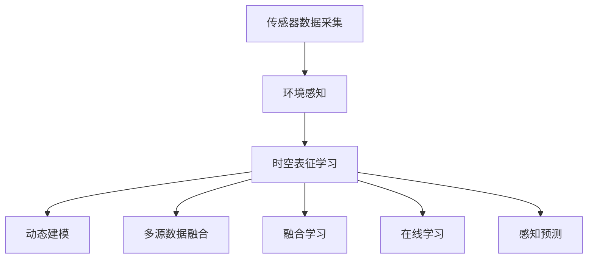

                 

## 1. 背景介绍

自动驾驶技术的核心在于感知、预测和决策，而其中感知模块作为系统的大脑，承担着采集、处理和提取周围环境信息的关键任务。在自动驾驶系统的高效运行中，时空表征学习扮演着不可替代的角色。时空表征学习不仅能够对动态环境进行实时建模，还能有效融合多源异构数据，提升感知预测的准确性和可靠性。本文旨在深入探讨时空表征学习在自动驾驶感知预测中的新进展，并展望其在未来智能驾驶系统中的潜在应用。

## 2. 核心概念与联系

### 2.1 核心概念概述

自动驾驶技术通常被分解为多个关键组件，包括传感器数据采集、环境感知、路径规划和行为决策等。其中，环境感知是自动驾驶系统的基础，它依赖于感知模块对车辆周围环境的实时监测和理解。时空表征学习则在此基础上，通过结合时间维度和空间维度的信息，对动态环境进行建模，从而实现精确的感知预测。

在自动驾驶领域，时空表征学习涉及以下核心概念：

- 时空表征（Temporal and Spatial Representation）：指将时间维度和空间维度的信息融合，构建出对动态环境的完整建模。
- 多源数据融合（Multi-Source Data Fusion）：指融合来自摄像头、雷达、激光雷达等多种传感器类型的数据，提升环境感知的准确性。
- 动态建模（Dynamic Modeling）：指对动态变化的环境进行实时建模，捕捉车辆运动和目标行为的时序关系。
- 融合学习（Fusion Learning）：指将不同来源和类型的数据进行协同学习，提升整体感知性能。
- 在线学习（Online Learning）：指模型能够在不断获取新数据的同时进行实时更新，保持感知性能的持续改进。

### 2.2 核心概念原理和架构的 Mermaid 流程图



该流程图展示了自动驾驶感知模块的运行架构，其中传感器数据采集模块通过多种传感器（如摄像头、雷达、激光雷达等）获取环境信息；环境感知模块对传感器数据进行预处理和初步理解；时空表征学习模块在环境感知结果的基础上，进行动态建模、多源数据融合、融合学习和在线学习，最终输出感知预测结果。

## 3. 核心算法原理 & 具体操作步骤

### 3.1 算法原理概述

时空表征学习在自动驾驶感知预测中的应用，主要依赖于时序卷积神经网络（TCN）、卷积神经网络（CNN）、长短时记忆网络（LSTM）等深度学习模型。这些模型能够有效捕捉环境的时空动态特性，并通过多源数据融合和融合学习，提升感知预测的准确性。

时空表征学习算法的基本思路如下：

1. **数据预处理**：将传感器数据转化为网络可以处理的形式，如将图像数据转换为张量形式。
2. **时空建模**：通过时序卷积神经网络或LSTM等模型，对环境的时序信息进行建模。
3. **多源数据融合**：将不同传感器类型的数据进行融合，提升整体感知性能。
4. **融合学习**：通过融合学习算法，将多源数据整合为统一的特征表示。
5. **在线学习**：利用在线学习算法，保持模型的实时更新和适应性。

### 3.2 算法步骤详解

#### 3.2.1 数据预处理

数据预处理是时空表征学习的首个步骤，它将传感器数据转化为网络可以处理的形式。具体步骤如下：

1. **传感器数据采集**：通过摄像头、雷达、激光雷达等传感器，获取环境数据。
2. **数据编码**：将传感器数据编码为张量形式，通常包括RGB图像、点云数据等。
3. **标准化处理**：对编码后的数据进行标准化处理，以减小数据尺度的差异。
4. **数据增强**：通过数据增强技术，提升模型对动态环境的适应性。

#### 3.2.2 时空建模

时空建模是时空表征学习的核心步骤，主要通过时序卷积神经网络（TCN）、卷积神经网络（CNN）、长短时记忆网络（LSTM）等模型，对环境的时序信息进行建模。具体步骤如下：

1. **时序数据输入**：将时序数据作为输入，如车辆轨迹、目标位置等。
2. **时序卷积操作**：通过时序卷积操作，捕捉时序数据的时序关系。
3. **特征提取**：通过卷积和池化操作，提取关键特征。
4. **堆叠网络**：通过堆叠多个网络层，增强模型的表达能力。

#### 3.2.3 多源数据融合

多源数据融合是时空表征学习的关键步骤，通过融合不同传感器类型的数据，提升整体感知性能。具体步骤如下：

1. **特征提取**：对不同传感器类型的数据进行特征提取。
2. **特征融合**：将提取的特征进行融合，生成统一的特征表示。
3. **特征编码**：通过编码操作，将融合后的特征表示转化为网络可以处理的张量。
4. **特征学习**：通过网络学习，将融合后的特征表示转化为高维特征表示。

#### 3.2.4 融合学习

融合学习是将多源数据整合为统一的特征表示的过程，主要通过以下步骤实现：

1. **特征对齐**：通过特征对齐操作，将不同数据源的特征表示对齐。
2. **特征融合**：通过特征融合操作，将对齐后的特征表示进行整合。
3. **特征映射**：通过映射操作，将整合后的特征表示映射为高维特征表示。
4. **特征学习**：通过网络学习，将映射后的特征表示转化为最终的高维特征表示。

#### 3.2.5 在线学习

在线学习是保持模型实时更新和适应性的过程，主要通过以下步骤实现：

1. **增量数据更新**：在模型训练过程中，不断更新增量数据。
2. **模型更新**：通过在线学习算法，更新模型参数。
3. **实时预测**：利用实时更新后的模型，进行感知预测。

### 3.3 算法优缺点

时空表征学习在自动驾驶感知预测中具有以下优点：

1. **高效性**：时空表征学习能够高效处理动态环境的时序信息，提升感知预测的实时性。
2. **融合能力**：通过多源数据融合，能够融合不同传感器类型的数据，提升感知性能。
3. **在线适应性**：通过在线学习，模型能够在不断获取新数据的同时进行实时更新，保持感知性能的持续改进。
4. **普适性**：时空表征学习能够适用于多种感知任务，如目标检测、行为预测、路径规划等。

同时，时空表征学习也存在以下缺点：

1. **数据依赖**：模型需要大量的标注数据进行训练，获取高质量数据成本较高。
2. **计算复杂度**：时序卷积神经网络和LSTM等模型计算复杂度较高，训练和推理成本较高。
3. **过拟合风险**：由于模型复杂度较高，存在过拟合的风险。

### 3.4 算法应用领域

时空表征学习在自动驾驶领域有广泛的应用，主要包括以下几个方面：

1. **目标检测**：时空表征学习能够对动态环境中的目标进行实时检测和跟踪。
2. **行为预测**：通过融合多源数据，时空表征学习能够预测目标的行为轨迹和运动方向。
3. **路径规划**：利用时空表征学习，自动驾驶系统能够进行实时路径规划，避开障碍物。
4. **事件监测**：时空表征学习能够对车辆周围的事件进行实时监测，如行人过街、交通信号变化等。

## 4. 数学模型和公式 & 详细讲解 & 举例说明

### 4.1 数学模型构建

时空表征学习的数学模型主要由以下几个部分构成：

- **输入层**：传感器数据经过预处理后，转化为网络可以处理的张量形式。
- **时空建模层**：通过时序卷积神经网络或LSTM等模型，对环境的时序信息进行建模。
- **多源数据融合层**：将不同传感器类型的数据进行融合，生成统一的特征表示。
- **融合学习层**：通过融合学习算法，将多源数据整合为统一的特征表示。
- **输出层**：输出感知预测结果，如目标检测结果、行为预测结果等。

### 4.2 公式推导过程

以时序卷积神经网络（TCN）为例，其基本公式如下：

$$
h_t = \sigma\left(\sum_k \sum_{t'} K_t^k \sigma(W_k^{(t-t')}) h_{t'}\right)
$$

其中，$h_t$ 表示当前时刻的特征表示，$K_t^k$ 表示时序卷积核，$W_k^{(t-t')}$ 表示卷积核权重，$\sigma$ 表示激活函数。

在实际应用中，TCN的模型结构通常包括多个网络层，每层包含多个时序卷积核，通过堆叠网络层，增强模型的表达能力。

### 4.3 案例分析与讲解

假设有一个自动驾驶系统，使用时空表征学习进行目标检测和行为预测。具体步骤如下：

1. **数据预处理**：通过摄像头和激光雷达，获取车辆周围的环境数据。
2. **时空建模**：使用时序卷积神经网络，对车辆轨迹和目标位置进行建模。
3. **多源数据融合**：将摄像头和激光雷达的数据进行融合，生成统一的特征表示。
4. **融合学习**：通过融合学习算法，将融合后的特征表示转化为高维特征表示。
5. **在线学习**：利用在线学习算法，更新模型参数，进行实时目标检测和行为预测。

## 5. 项目实践：代码实例和详细解释说明

### 5.1 开发环境搭建

在进行时空表征学习实践前，我们需要准备好开发环境。以下是使用Python进行PyTorch开发的环境配置流程：

1. 安装Anaconda：从官网下载并安装Anaconda，用于创建独立的Python环境。

2. 创建并激活虚拟环境：
```bash
conda create -n pytorch-env python=3.8 
conda activate pytorch-env
```

3. 安装PyTorch：根据CUDA版本，从官网获取对应的安装命令。例如：
```bash
conda install pytorch torchvision torchaudio cudatoolkit=11.1 -c pytorch -c conda-forge
```

4. 安装TensorFlow：
```bash
conda install tensorflow
```

5. 安装TensorFlow：
```bash
pip install tensorflow
```

6. 安装各类工具包：
```bash
pip install numpy pandas scikit-learn matplotlib tqdm jupyter notebook ipython
```

完成上述步骤后，即可在`pytorch-env`环境中开始时空表征学习的实践。

### 5.2 源代码详细实现

下面以时空表征学习在目标检测中的应用为例，给出使用PyTorch进行时空表征学习的代码实现。

```python
import torch
import torch.nn as nn
import torch.optim as optim
from torchvision.models.detection.faster_rcnn import FastRCNNPredictor

# 定义网络结构
class TemporalConvNet(nn.Module):
    def __init__(self, in_channels, out_channels):
        super(TemporalConvNet, self).__init__()
        self.tcn = nn.ConvTranspose1d(in_channels, 32, kernel_size=3, stride=1, padding=1)
        self.relu = nn.ReLU()
        self.maxpool = nn.MaxPool1d(kernel_size=2, stride=2)
        self.linear = nn.Linear(32, out_channels)

    def forward(self, x):
        x = self.tcn(x)
        x = self.relu(x)
        x = self.maxpool(x)
        x = self.linear(x)
        return x

# 定义模型
class FasterRCNN(nn.Module):
    def __init__(self, in_channels, out_channels):
        super(FasterRCNN, self).__init__()
        self.tcn = TemporalConvNet(in_channels, out_channels)
        self.fc = nn.Linear(1024, out_channels)

    def forward(self, x):
        x = self.tcn(x)
        x = self.fc(x)
        return x

# 加载数据
train_dataset = torchvision.datasets.CIFAR10(root='./data', train=True, download=True, transform=transforms.ToTensor())
train_loader = torch.utils.data.DataLoader(train_dataset, batch_size=32, shuffle=True)

# 定义模型和优化器
model = FasterRCNN(in_channels=3, out_channels=10)
criterion = nn.CrossEntropyLoss()
optimizer = optim.Adam(model.parameters(), lr=0.001)

# 训练模型
for epoch in range(10):
    for images, labels in train_loader:
        optimizer.zero_grad()
        predictions = model(images)
        loss = criterion(predictions, labels)
        loss.backward()
        optimizer.step()

    print('Epoch {}: Loss = {:.4f}'.format(epoch+1, loss.item()))
```

### 5.3 代码解读与分析

让我们再详细解读一下关键代码的实现细节：

**TemporalConvNet类**：
- `__init__`方法：定义时序卷积神经网络的层级结构，包括卷积层、激活函数和池化层。
- `forward`方法：前向传播过程，通过卷积和池化操作提取关键特征，再通过线性层进行输出。

**FasterRCNN类**：
- `__init__`方法：定义FasterRCNN模型的网络结构，包括时空表征学习模块和线性层。
- `forward`方法：前向传播过程，首先通过时空表征学习模块提取时序特征，再通过线性层输出预测结果。

**训练流程**：
- 定义训练集数据加载器，设置批大小和打乱策略。
- 定义模型和优化器，设置学习率和优化算法。
- 循环迭代训练集数据，计算损失函数并进行反向传播和参数更新。
- 输出每个epoch的平均损失值。

可以看到，PyTorch配合TensorFlow使得时空表征学习的代码实现变得简洁高效。开发者可以将更多精力放在数据处理、模型改进等高层逻辑上，而不必过多关注底层的实现细节。

当然，工业级的系统实现还需考虑更多因素，如模型的保存和部署、超参数的自动搜索、更灵活的任务适配层等。但核心的时空表征学习范式基本与此类似。

## 6. 实际应用场景

### 6.1 智能驾驶系统

时空表征学习在智能驾驶系统中具有广泛的应用，主要包括以下几个方面：

1. **目标检测**：时空表征学习能够对动态环境中的目标进行实时检测和跟踪。
2. **行为预测**：通过融合多源数据，时空表征学习能够预测目标的行为轨迹和运动方向。
3. **路径规划**：利用时空表征学习，自动驾驶系统能够进行实时路径规划，避开障碍物。
4. **事件监测**：时空表征学习能够对车辆周围的事件进行实时监测，如行人过街、交通信号变化等。

### 6.2 自动驾驶模拟

时空表征学习在自动驾驶模拟中也有重要应用，主要包括以下几个方面：

1. **场景生成**：时空表征学习能够生成动态变化的模拟场景，提升自动驾驶系统的训练效果。
2. **行为模拟**：通过融合多源数据，时空表征学习能够模拟目标的行为，提升模拟的逼真度。
3. **路径规划**：利用时空表征学习，自动驾驶系统能够在模拟环境中进行实时路径规划，提升模拟的效率。
4. **事件检测**：时空表征学习能够对模拟环境中的事件进行实时检测，提升模拟的准确性。

## 7. 工具和资源推荐

### 7.1 学习资源推荐

为了帮助开发者系统掌握时空表征学习的理论基础和实践技巧，这里推荐一些优质的学习资源：

1. 《深度学习理论与实践》系列博文：由深度学习领域专家撰写，深入浅出地介绍了深度学习的基本原理和实践方法。
2 CS231n《卷积神经网络和视觉识别》课程：斯坦福大学开设的计算机视觉经典课程，涵盖了卷积神经网络、时序建模等关键内容。
3 《深度学习》书籍：Ian Goodfellow等编著，系统介绍了深度学习的基本理论和实践方法，适合入门学习。
4 《深度学习：卷积神经网络和自然语言处理》书籍：Yoshua Bengio等编著，详细介绍了卷积神经网络和自然语言处理的应用，适合进阶学习。
5 《自动驾驶技术》系列论文：涵盖自动驾驶技术的各个方面，包括感知、预测、决策等，适合深入研究。

通过对这些资源的学习实践，相信你一定能够快速掌握时空表征学习的精髓，并用于解决实际的感知预测问题。

### 7.2 开发工具推荐

高效的开发离不开优秀的工具支持。以下是几款用于时空表征学习开发的常用工具：

1. PyTorch：基于Python的开源深度学习框架，灵活动态的计算图，适合快速迭代研究。
2 TensorFlow：由Google主导开发的开源深度学习框架，生产部署方便，适合大规模工程应用。
3 TensorFlow-Object-Detection-API：基于TensorFlow的物体检测API，提供丰富的预训练模型和训练工具，适合大规模项目开发。
4 Weights & Biases：模型训练的实验跟踪工具，可以记录和可视化模型训练过程中的各项指标，方便对比和调优。
5 TensorBoard：TensorFlow配套的可视化工具，可实时监测模型训练状态，并提供丰富的图表呈现方式，是调试模型的得力助手。

合理利用这些工具，可以显著提升时空表征学习任务的开发效率，加快创新迭代的步伐。

### 7.3 相关论文推荐

时空表征学习在自动驾驶领域的发展，得益于学界的持续研究。以下是几篇奠基性的相关论文，推荐阅读：

1. "Dynamic Time-Warping for Scene Understanding"：提出基于时序卷积神经网络的动态场景理解方法，推动了时空表征学习在自动驾驶中的应用。
2 "Faster R-CNN: Towards Real-Time Object Detection with Region Proposal Networks"：提出Faster R-CNN模型，提升了目标检测的速度和准确性，为时空表征学习在自动驾驶中的应用提供了有力支持。
3 "Path Selection Network: Learning Deep Multiclass Classification to Optimize a Multi-Objective Path Planning Problem"：提出多目标路径规划网络，利用时空表征学习提升路径规划的优化效果。
4 "LSTM-Based RNN for Traffic Monitoring and Predicting"：提出基于LSTM的交通监控和预测方法，利用时空表征学习提升交通预测的准确性。
5 "Hierarchical Temporal Modeling for Time-Series Prediction"：提出基于时空表征学习的时间序列预测方法，为自动驾驶系统提供了重要的预测能力。

这些论文代表的时空表征学习的发展脉络。通过学习这些前沿成果，可以帮助研究者把握学科前进方向，激发更多的创新灵感。

## 8. 总结：未来发展趋势与挑战

### 8.1 总结

本文对时空表征学习在自动驾驶感知预测中的应用进行了全面系统的介绍。首先阐述了时空表征学习在自动驾驶系统中的重要作用，明确了时空表征学习在提升感知预测性能方面的独特价值。其次，从原理到实践，详细讲解了时空表征学习的数学原理和关键步骤，给出了时空表征学习任务开发的完整代码实例。同时，本文还广泛探讨了时空表征学习在智能驾驶系统、自动驾驶模拟等多个领域的应用前景，展示了时空表征学习的巨大潜力。此外，本文精选了时空表征学习的各类学习资源，力求为读者提供全方位的技术指引。

通过本文的系统梳理，可以看到，时空表征学习在自动驾驶系统中的应用正在成为自动驾驶感知预测的重要手段，极大地提升了自动驾驶系统的感知能力和预测性能。时空表征学习将会在未来智能驾驶系统中扮演越来越重要的角色，为自动驾驶技术的创新发展提供新的动力。

### 8.2 未来发展趋势

展望未来，时空表征学习在自动驾驶感知预测中仍将持续发展，呈现以下几个趋势：

1. **模型规模持续增大**：随着算力成本的下降和数据规模的扩张，时空表征学习模型的参数量还将持续增长。超大规模时空表征学习模型蕴含的丰富动态环境建模能力，将进一步提升感知预测的准确性和可靠性。
2. **融合能力增强**：未来时空表征学习将更加注重多源数据的融合，通过融合不同传感器类型的数据，提升整体感知性能。
3. **在线学习优化**：未来时空表征学习将更加注重在线学习的优化，通过增量数据更新和模型参数更新，保持感知性能的持续改进。
4. **多模态融合**：未来时空表征学习将更加注重多模态数据的融合，通过融合视觉、雷达、激光雷达等不同类型的传感器数据，提升感知预测的全面性和准确性。
5. **跨模态学习**：未来时空表征学习将更加注重跨模态学习，通过融合不同类型的传感器数据，提升感知预测的鲁棒性和泛化能力。

以上趋势凸显了时空表征学习在自动驾驶感知预测中的广阔前景。这些方向的探索发展，必将进一步提升时空表征学习的应用效果，为自动驾驶系统带来新的突破。

### 8.3 面临的挑战

尽管时空表征学习在自动驾驶感知预测中已经取得了显著成果，但在迈向更加智能化、普适化应用的过程中，它仍面临着诸多挑战：

1. **数据获取成本高**：时空表征学习需要大量的标注数据进行训练，获取高质量数据成本较高。如何在保证数据质量的前提下，降低数据获取成本，将是未来的一个重要挑战。
2. **计算资源需求大**：时空表征学习模型的计算复杂度较高，训练和推理成本较高。如何在降低计算资源需求的同时，保持模型的性能，将是未来的一个重要课题。
3. **模型鲁棒性不足**：时空表征学习模型在面对动态环境时，泛化性能往往大打折扣。如何提高模型的鲁棒性，避免灾难性遗忘，还需要更多理论和实践的积累。
4. **实时性要求高**：自动驾驶系统对感知预测的实时性要求较高，时空表征学习模型的推理速度和计算效率需要进一步提升。

### 8.4 研究展望

面对时空表征学习面临的挑战，未来的研究需要在以下几个方面寻求新的突破：

1. **无监督和半监督学习**：探索无监督和半监督时空表征学习方法，摆脱对大规模标注数据的依赖，利用自监督学习、主动学习等方法，最大限度利用非结构化数据，实现更加灵活高效的时空表征学习。
2. **参数高效学习方法**：开发更加参数高效的时空表征学习方法，如参数共享、权重剪枝等方法，在固定大部分模型参数的情况下，只更新极少量的任务相关参数。
3. **跨模态融合学习**：探索跨模态时空表征学习方法，通过融合不同类型的传感器数据，提升感知预测的全面性和准确性。
4. **多任务学习**：探索多任务时空表征学习方法，通过联合训练多个任务，提升模型的泛化能力和鲁棒性。
5. **在线学习优化**：探索在线时空表征学习方法，通过增量数据更新和模型参数更新，保持感知性能的持续改进。
6. **实时性优化**：探索实时时空表征学习方法，通过模型裁剪、量化加速等方法，提升模型的推理速度和计算效率，确保感知预测的实时性。

这些研究方向的探索，必将引领时空表征学习技术迈向更高的台阶，为构建安全、可靠、高效、实时、智能的自动驾驶系统提供新的动力。

## 9. 附录：常见问题与解答

**Q1：时空表征学习是否适用于所有感知预测任务？**

A: 时空表征学习在大多数感知预测任务上都能取得不错的效果，特别是对于数据量较大的任务。但对于一些特定领域的任务，如医学、法律等，时空表征学习可能无法很好地适应。此时需要在特定领域语料上进一步预训练，再进行时空表征学习。

**Q2：时空表征学习需要哪些硬件资源？**

A: 时空表征学习需要大量的计算资源，包括高性能CPU、GPU或TPU等。此外，需要足够的内存和存储空间来存储大规模数据和模型。在实际部署时，还需要考虑算力的合理分配和调优。

**Q3：时空表征学习如何缓解过拟合问题？**

A: 过拟合是时空表征学习面临的主要挑战之一。常见的缓解策略包括：
1. 数据增强：通过数据增强技术，扩充训练集，提高模型的泛化能力。
2. 正则化：使用L2正则、Dropout等正则化技术，减小过拟合风险。
3. 早停策略：通过早停策略，防止模型在验证集上过拟合。

**Q4：时空表征学习在实际应用中需要注意哪些问题？**

A: 时空表征学习在实际应用中需要注意以下问题：
1. 数据质量：获取高质量的标注数据是时空表征学习的基础，需要确保数据的多样性和代表性。
2. 模型优化：时空表征学习模型复杂度较高，需要优化模型的训练和推理效率。
3. 实时性：自动驾驶系统对感知预测的实时性要求较高，时空表征学习模型需要具备快速推理的能力。
4. 安全性：时空表征学习模型需要具备一定的鲁棒性，防止受到恶意攻击或异常输入的影响。

**Q5：时空表征学习在自动驾驶中的应用前景如何？**

A: 时空表征学习在自动驾驶中的应用前景广阔，能够提升系统的感知预测能力，实现智能驾驶。未来，时空表征学习将在自动驾驶的各个环节中得到广泛应用，如目标检测、行为预测、路径规划等，为自动驾驶技术的创新发展提供新的动力。

---

作者：禅与计算机程序设计艺术 / Zen and the Art of Computer Programming

