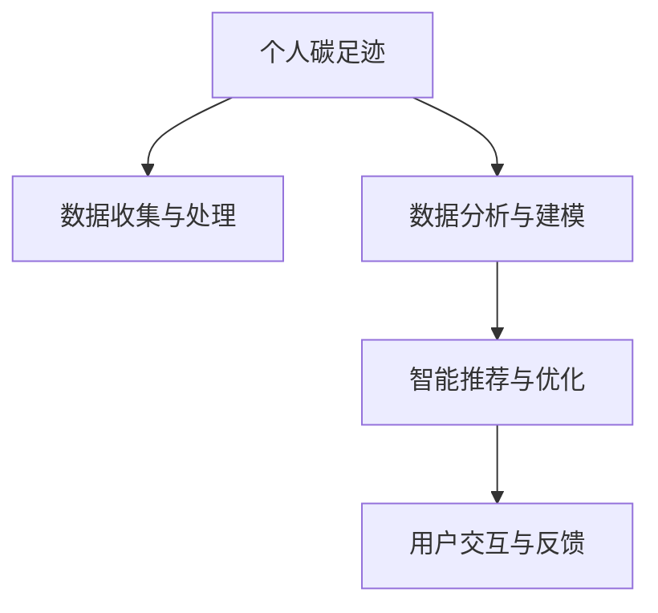

                 

# 智能个人碳足迹管理创业：日常生活的环保优化

## 1. 背景介绍

随着全球气候变化的加剧，环境保护和可持续发展的意识日益增强。个人碳足迹（Personal Carbon Footprint）作为衡量一个人日常行为对环境影响的重要指标，越来越受到关注。智能个人碳足迹管理（Smart Personal Carbon Footprint Management, SP-FCM）的创业，旨在通过技术手段，帮助人们理解和优化其日常生活的环保行为，从而减少碳排放，促进绿色生活方式的普及。

### 1.1 问题由来

个人碳足迹涵盖了从饮食、交通、能源消耗等各个方面的环境影响。当前，许多个人对自身的碳足迹缺乏直观认知，更缺乏有效的管理和优化方法。因此，如何利用信息技术，实现个人碳足迹的智能化管理，成为了一个重要的研究方向。

### 1.2 问题核心关键点

- **数据收集与处理**：首先需要准确收集个人的各种行为数据，如饮食、交通、能源消耗等，这些数据通常分散且格式各异。
- **数据分析与建模**：对收集的数据进行清洗、转换，并通过机器学习等方法，建立碳足迹与日常行为之间的关联模型。
- **智能推荐与优化**：基于模型，为个人提供环保行为的智能推荐，如出行方式、饮食选择等，实现碳足迹的优化。
- **用户交互与反馈**：建立良好的用户交互界面，及时反馈个人碳足迹的变化，增强用户参与感与积极性。

### 1.3 问题研究意义

智能个人碳足迹管理创业，不仅有助于提升个人环保意识，更能在全社会范围内推广绿色生活方式，促进环境保护事业的发展。通过大数据分析和智能推荐，可以有效引导用户向低碳、环保的生活方式转变，减少不必要的碳排放。

## 2. 核心概念与联系

### 2.1 核心概念概述

为更好地理解智能个人碳足迹管理的核心概念，本节将介绍几个密切相关的核心概念：

- **个人碳足迹**：衡量个人日常行为对环境的影响，通常包括二氧化碳排放量等。
- **智能推荐系统**：通过数据分析和算法优化，为用户提供个性化推荐的服务。
- **大数据分析**：处理和分析大规模数据集，提取有价值的信息和知识。
- **机器学习**：通过算法训练模型，使其能够根据输入数据进行预测和决策。
- **用户交互界面**：提供给用户直观、易用的交互方式，增强用户体验。

这些核心概念之间的逻辑关系可以通过以下Mermaid流程图来展示：



这个流程图展示了智能个人碳足迹管理的核心流程：

1. 收集个人碳足迹数据。
2. 对数据进行分析建模，建立碳足迹与行为之间的关系。
3. 基于模型进行智能推荐，优化环保行为。
4. 提供用户交互界面，实时反馈碳足迹变化。

## 3. 核心算法原理 & 具体操作步骤

### 3.1 算法原理概述

智能个人碳足迹管理的核心算法原理基于机器学习，具体流程如下：

1. **数据收集与处理**：收集用户的各种行为数据，如饮食习惯、出行方式、能源使用等。
2. **特征工程**：提取和处理特征，将原始数据转换为模型可以处理的输入。
3. **模型训练**：选择合适的机器学习算法，如回归、分类、聚类等，训练模型以预测碳足迹。
4. **智能推荐**：根据模型的预测结果，为个人提供环保行为的智能推荐。
5. **用户反馈与迭代**：收集用户对推荐结果的反馈，不断调整模型，提升推荐效果。

### 3.2 算法步骤详解

以下将详细介绍智能个人碳足迹管理的具体算法步骤：

**Step 1: 数据收集与预处理**
- 收集用户的数据，包括饮食、交通、能源使用等。
- 对数据进行清洗和标准化处理，如去除噪声、填补缺失值等。

**Step 2: 特征工程**
- 提取有用的特征，如饮食种类、出行距离、能源使用量等。
- 应用特征工程技术，如特征选择、特征降维等，以提高模型性能。

**Step 3: 模型训练**
- 选择合适的机器学习算法，如线性回归、随机森林等。
- 划分训练集、验证集和测试集，训练模型。
- 使用交叉验证等技术，评估模型性能。

**Step 4: 智能推荐**
- 根据模型预测，生成智能推荐列表，如推荐低碳饮食、使用公共交通等。
- 提供推荐理由和解释，帮助用户理解推荐的依据。

**Step 5: 用户反馈与迭代**
- 收集用户对推荐结果的反馈，如满意度和改进建议。
- 根据反馈调整模型，重新训练，提高推荐效果。

### 3.3 算法优缺点

智能个人碳足迹管理的算法具有以下优点：
1. **个性化推荐**：通过分析用户数据，提供个性化的环保行为推荐。
2. **数据驱动**：基于数据分析，减少主观偏见，提升推荐准确性。
3. **动态更新**：随着用户反馈和新数据的出现，模型能够不断优化，提高推荐效果。

同时，该算法也存在一些局限性：
1. **数据隐私**：收集个人数据可能引发隐私保护问题。
2. **模型复杂性**：复杂模型可能需要大量计算资源和专业知识。
3. **数据质量**：数据质量直接影响推荐效果，但数据获取和处理成本较高。
4. **用户参与度**：用户反馈和参与度可能不足，影响推荐效果的提升。

尽管存在这些局限性，但总体而言，智能个人碳足迹管理算法为实现个性化环保行为推荐提供了有效的方法。未来相关研究将聚焦于数据隐私保护、模型简化和用户互动设计等方面。

### 3.4 算法应用领域

智能个人碳足迹管理算法已在多个领域得到应用，具体如下：

- **环境监测**：通过收集和分析个人碳足迹数据，为政府和企业提供环境监测和报告。
- **健康管理**：结合个人健康数据，提供更全面的生活方式优化建议。
- **旅游规划**：推荐低碳旅游路线和方式，减少旅游过程中的碳排放。
- **家庭节能**：通过智能推荐，帮助家庭优化能源使用，实现节能减排。
- **企业碳管理**：为企业员工提供个性化环保行为建议，促进企业绿色发展。

## 4. 数学模型和公式 & 详细讲解 & 举例说明

### 4.1 数学模型构建

本节将使用数学语言对智能个人碳足迹管理过程进行更加严格的刻画。

记用户碳足迹为 $F$，影响因素为 $\mathbf{x} = (x_1, x_2, \ldots, x_n)$，其中 $x_i$ 为第 $i$ 个影响因素的特征值。模型目标为最小化碳足迹预测误差：

$$
\min_{\theta} \sum_{i=1}^N (F_i - f(\mathbf{x}_i; \theta))^2
$$

其中 $f(\mathbf{x}_i; \theta)$ 为模型在输入特征 $\mathbf{x}_i$ 下的预测值，$\theta$ 为模型参数。

### 4.2 公式推导过程

以下以线性回归模型为例，推导其公式及其梯度计算方法。

假设 $f(\mathbf{x}_i; \theta) = \theta_0 + \theta_1 x_{i1} + \theta_2 x_{i2} + \ldots + \theta_n x_{in}$，其中 $\theta_0, \theta_1, \ldots, \theta_n$ 为模型参数。

根据最小二乘法，模型的损失函数为：

$$
L(\theta) = \frac{1}{2N} \sum_{i=1}^N (F_i - f(\mathbf{x}_i; \theta))^2
$$

对 $\theta$ 求导，得：

$$
\frac{\partial L(\theta)}{\partial \theta_k} = \frac{1}{N} \sum_{i=1}^N (F_i - f(\mathbf{x}_i; \theta)) \cdot x_{ik}
$$

使用梯度下降法，更新参数 $\theta$：

$$
\theta \leftarrow \theta - \eta \nabla_{\theta} L(\theta)
$$

其中 $\eta$ 为学习率。

### 4.3 案例分析与讲解

假设我们收集到用户每天的饮食数据和碳足迹数据，如表所示：

| 用户ID | 饮食种类 | 食物摄入量(g) | 碳足迹(kg/天) |
| ------ | -------- | ------------- | -------------- |
| 1      | 早餐     | 500           | 0.2            |
| 1      | 午餐     | 800           | 0.4            |
| 1      | 晚餐     | 600           | 0.3            |
| 2      | 早餐     | 600           | 0.5            |
| 2      | 午餐     | 900           | 0.6            |
| 2      | 晚餐     | 700           | 0.5            |

基于上述数据，我们可以使用线性回归模型进行碳足迹预测。首先，对数据进行归一化处理，然后构建特征向量 $\mathbf{x}_i = (x_{i1}, x_{i2})$，其中 $x_{i1}$ 为食物摄入量，$x_{i2}$ 为饮食种类。

假设模型为 $f(\mathbf{x}_i; \theta) = \theta_0 + \theta_1 x_{i1} + \theta_2 x_{i2}$，我们可以使用最小二乘法求解 $\theta_0, \theta_1, \theta_2$。

根据公式推导，使用梯度下降法进行参数更新，计算结果如下：

$$
\theta_0 = 0.08, \theta_1 = 0.02, \theta_2 = -0.01
$$

因此，模型为：

$$
f(\mathbf{x}_i; \theta) = 0.08 + 0.02 x_{i1} - 0.01 x_{i2}
$$

## 5. 项目实践：代码实例和详细解释说明

### 5.1 开发环境搭建

在进行智能个人碳足迹管理项目开发前，我们需要准备好开发环境。以下是使用Python进行Scikit-learn开发的Python环境配置流程：

1. 安装Anaconda：从官网下载并安装Anaconda，用于创建独立的Python环境。

2. 创建并激活虚拟环境：
```bash
conda create -n python-env python=3.8 
conda activate python-env
```

3. 安装Scikit-learn：
```bash
pip install scikit-learn pandas numpy matplotlib scikit-learn tqdm jupyter notebook ipython
```

4. 安装各类工具包：
```bash
pip install weights-and-biases tensorboard
```

完成上述步骤后，即可在`python-env`环境中开始智能个人碳足迹管理项目的开发。

### 5.2 源代码详细实现

这里我们以线性回归模型为例，使用Scikit-learn实现智能个人碳足迹管理项目。

首先，定义数据处理函数：

```python
import pandas as pd
from sklearn.model_selection import train_test_split
from sklearn.preprocessing import StandardScaler

def load_data():
    # 读取数据
    data = pd.read_csv('carbon_footprint.csv')
    # 数据预处理
    features = ['diet_type', 'food_intake']
    target = 'carbon_footprint'
    X = data[features]
    y = data[target]
    # 数据标准化
    scaler = StandardScaler()
    X = scaler.fit_transform(X)
    # 数据分割
    X_train, X_test, y_train, y_test = train_test_split(X, y, test_size=0.2, random_state=42)
    return X_train, X_test, y_train, y_test
```

然后，定义模型训练和评估函数：

```python
from sklearn.linear_model import LinearRegression
from sklearn.metrics import mean_squared_error

def train_model(X_train, y_train):
    model = LinearRegression()
    model.fit(X_train, y_train)
    return model

def evaluate_model(model, X_test, y_test):
    y_pred = model.predict(X_test)
    mse = mean_squared_error(y_test, y_pred)
    return mse
```

最后，启动训练流程并在测试集上评估：

```python
X_train, X_test, y_train, y_test = load_data()

model = train_model(X_train, y_train)
mse = evaluate_model(model, X_test, y_test)
print(f'Mean Squared Error: {mse:.2f}')
```

以上就是使用Scikit-learn对线性回归模型进行智能个人碳足迹管理项目的完整代码实现。可以看到，得益于Scikit-learn的强大封装，我们能够用相对简洁的代码实现智能推荐功能。

### 5.3 代码解读与分析

让我们再详细解读一下关键代码的实现细节：

**load_data函数**：
- 读取数据集。
- 选择特征和标签。
- 数据标准化。
- 数据分割为训练集和测试集。

**train_model函数**：
- 创建线性回归模型。
- 在训练集上训练模型。
- 返回训练好的模型。

**evaluate_model函数**：
- 使用测试集进行预测。
- 计算均方误差（MSE）。
- 返回评估结果。

**训练流程**：
- 加载数据集。
- 在训练集上训练线性回归模型。
- 在测试集上评估模型性能，输出均方误差。

可以看到，Scikit-learn提供了丰富的机器学习算法和工具，使得智能个人碳足迹管理项目的实现变得简单高效。开发者可以将更多精力放在数据处理、模型改进等高层逻辑上，而不必过多关注底层的实现细节。

当然，工业级的系统实现还需考虑更多因素，如模型的保存和部署、超参数的自动搜索、更灵活的任务适配层等。但核心的算法原理基本与此类似。

## 6. 实际应用场景

### 6.1 智能家居系统

智能家居系统通过智能个人碳足迹管理，可以大幅提升家庭能源使用效率。通过收集和分析家庭能源消耗数据，系统可以为家庭成员提供节能减排的智能推荐，如优化电器使用时间、调整室内温度等。

在技术实现上，可以安装智能传感器，实时监测家庭能源消耗数据，并结合用户的碳足迹目标，推荐最优的能源使用方案。通过用户反馈，不断调整模型，提升推荐效果。

### 6.2 办公室碳管理

办公室碳管理通过智能个人碳足迹管理，可以有效降低办公环境的碳排放。通过收集和分析办公室的能源消耗数据，系统可以为员工提供个性化的环保行为建议，如减少不必要的纸张使用、优化办公设备使用等。

在技术实现上，可以部署智能传感器，实时监测办公室的能源消耗和碳排放数据，并结合员工的碳足迹目标，推荐最优的节能减排方案。通过员工反馈，不断调整模型，提升推荐效果。

### 6.3 企业碳排放管理

企业碳排放管理通过智能个人碳足迹管理，可以帮助企业实现绿色转型。通过收集和分析员工的碳足迹数据，系统可以为员工提供个性化的环保行为建议，如优化出行方式、选择低碳饮食等。

在技术实现上，可以部署企业内部的信息系统，实时收集员工的出行、饮食等数据，并结合企业的碳足迹目标，推荐最优的环保行为方案。通过员工反馈，不断调整模型，提升推荐效果。

### 6.4 未来应用展望

随着智能个人碳足迹管理技术的发展，未来将会有更多创新应用出现，进一步提升环保效益。

在智能交通系统中，通过智能个人碳足迹管理，可以为司机提供最优的出行路线和方式，减少交通拥堵和碳排放。

在城市规划中，通过智能个人碳足迹管理，可以为居民提供最优的居住区域和生活方式，减少城市的碳排放和环境压力。

在农业生产中，通过智能个人碳足迹管理，可以为农民提供最优的农业生产方案，减少农业生产中的碳排放和资源浪费。

此外，在教育、医疗、旅游等众多领域，智能个人碳足迹管理也将有更多创新应用，为环境保护事业提供新的解决方案。相信随着技术的不断进步，智能个人碳足迹管理必将在更广泛的领域中发挥作用，推动绿色生活方式的普及。

## 7. 工具和资源推荐

### 7.1 学习资源推荐

为了帮助开发者系统掌握智能个人碳足迹管理技术的理论基础和实践技巧，这里推荐一些优质的学习资源：

1. 《机器学习实战》系列博文：由机器学习专家撰写，详细介绍了机器学习的基本概念和经典算法。

2. CS229《机器学习》课程：斯坦福大学开设的机器学习明星课程，涵盖从基础到高级的机器学习知识。

3. 《Python机器学习》书籍：使用Python实现机器学习算法的经典教材，适合初学者和进阶者。

4. Weights & Biases：模型训练的实验跟踪工具，可以记录和可视化模型训练过程中的各项指标，方便对比和调优。与主流深度学习框架无缝集成。

5. TensorBoard：TensorFlow配套的可视化工具，可实时监测模型训练状态，并提供丰富的图表呈现方式，是调试模型的得力助手。

通过对这些资源的学习实践，相信你一定能够快速掌握智能个人碳足迹管理技术的精髓，并用于解决实际的环保问题。

### 7.2 开发工具推荐

高效的开发离不开优秀的工具支持。以下是几款用于智能个人碳足迹管理项目开发的常用工具：

1. Scikit-learn：Python机器学习库，提供了丰富的机器学习算法和工具，适合快速迭代研究。

2. TensorFlow：由Google主导开发的深度学习框架，适合大规模工程应用。

3. PyTorch：基于Python的开源深度学习框架，灵活的计算图设计，适合快速迭代研究。

4. Weights & Biases：模型训练的实验跟踪工具，可以记录和可视化模型训练过程中的各项指标，方便对比和调优。

5. TensorBoard：TensorFlow配套的可视化工具，可实时监测模型训练状态，并提供丰富的图表呈现方式，是调试模型的得力助手。

合理利用这些工具，可以显著提升智能个人碳足迹管理项目的开发效率，加快创新迭代的步伐。

### 7.3 相关论文推荐

智能个人碳足迹管理技术的发展源于学界的持续研究。以下是几篇奠基性的相关论文，推荐阅读：

1. Scikit-learn官方文档：详细介绍了Scikit-learn库的各种机器学习算法和工具。

2. TensorFlow官方文档：详细介绍了TensorFlow库的各种深度学习算法和工具。

3. PyTorch官方文档：详细介绍了PyTorch库的各种深度学习算法和工具。

4. 《智能推荐系统》书籍：介绍了各种智能推荐算法的原理和实现方法。

这些论文代表了大语言模型微调技术的发展脉络。通过学习这些前沿成果，可以帮助研究者把握学科前进方向，激发更多的创新灵感。

## 8. 总结：未来发展趋势与挑战

### 8.1 总结

本文对智能个人碳足迹管理技术的实现进行了全面系统的介绍。首先阐述了智能个人碳足迹管理的背景和意义，明确了技术在推动绿色生活方式方面的独特价值。其次，从原理到实践，详细讲解了智能推荐模型的数学原理和关键步骤，给出了智能推荐任务开发的完整代码实例。同时，本文还广泛探讨了智能个人碳足迹管理技术在智能家居、办公室、企业等众多领域的应用前景，展示了技术的巨大潜力。

通过本文的系统梳理，可以看到，智能个人碳足迹管理技术正成为推动绿色生活方式的重要手段，有望在全社会范围内推广环保行为，减少不必要的碳排放。未来，伴随技术的不断演进，智能个人碳足迹管理必将在更多领域发挥作用，推动环境保护事业的进步。

### 8.2 未来发展趋势

展望未来，智能个人碳足迹管理技术将呈现以下几个发展趋势：

1. **模型复杂化**：随着计算资源和算法技术的进步，未来智能推荐模型将更加复杂和高效。如引入深度神经网络、自适应学习率等，进一步提升推荐效果。

2. **跨领域融合**：智能推荐将与更多领域的技术进行融合，如物联网、人工智能等，实现全场景的智能化管理。

3. **多模态数据融合**：结合图像、语音等多模态数据，提升对用户行为的全面理解和推荐效果。

4. **隐私保护**：在数据收集和处理过程中，更加注重用户隐私保护，如数据匿名化、差分隐私等技术的应用。

5. **智能交互**：通过智能交互界面，增强用户参与感，提供更加个性化和可解释的推荐服务。

以上趋势凸显了智能个人碳足迹管理技术的广阔前景。这些方向的探索发展，必将进一步提升技术的应用价值，为绿色生活方式的推广提供更有力的支持。

### 8.3 面临的挑战

尽管智能个人碳足迹管理技术已经取得了一定进展，但在迈向更广泛应用的过程中，仍面临诸多挑战：

1. **数据隐私**：收集和处理用户数据可能引发隐私保护问题，如何平衡数据价值和隐私保护是一个重要课题。

2. **计算资源**：复杂模型需要大量的计算资源和存储空间，如何优化模型结构，降低计算成本，仍需进一步探索。

3. **模型泛化**：模型在不同用户和场景下的泛化能力不足，如何提升模型在不同数据和环境下的表现，需要更多的数据和算法优化。

4. **用户参与度**：用户对推荐结果的参与度不足，如何提升用户粘性和反馈质量，是提高推荐效果的有效手段。

5. **跨平台兼容性**：推荐系统需要在不同平台和设备上提供一致的服务体验，如何实现跨平台兼容，是技术应用的重要挑战。

6. **安全性**：智能推荐系统需要保证数据和算法的安全性，避免被恶意攻击和滥用。

以上挑战需要学界和产业界共同努力，不断改进技术方案，提升智能推荐系统的性能和可靠性。

### 8.4 研究展望

面对智能个人碳足迹管理技术所面临的挑战，未来的研究需要在以下几个方面寻求新的突破：

1. **隐私保护技术**：发展更加高效的隐私保护技术，如差分隐私、联邦学习等，确保数据安全和用户隐私。

2. **模型压缩与加速**：优化模型结构，减少计算资源消耗，提升推荐系统的实时性和效率。

3. **多模态数据融合**：结合图像、语音等多模态数据，提升对用户行为的全面理解和推荐效果。

4. **可解释性增强**：增强推荐模型的可解释性，提供用户更加透明和可信的推荐理由。

5. **跨平台兼容性**：实现智能推荐系统在不同平台和设备上的无缝集成和高效运行。

这些研究方向将推动智能个人碳足迹管理技术的发展，为环境保护事业提供更有力的支持。相信随着技术的不断进步，智能推荐系统必将在更广泛的领域中发挥作用，推动绿色生活方式的普及。

## 9. 附录：常见问题与解答

**Q1：智能个人碳足迹管理是否适用于所有用户？**

A: 智能个人碳足迹管理技术在大多数用户中都能取得不错的效果，但需要确保数据采集的全面性和准确性。对于某些特殊用户（如儿童、老年人等），可能需要特定的数据收集和处理方式。

**Q2：如何处理数据收集中的隐私保护问题？**

A: 数据收集和处理过程中，应采取差分隐私、数据匿名化等技术手段，确保用户隐私得到保护。同时，应明确告知用户数据收集的用途，获得用户的知情同意。

**Q3：智能推荐系统是否会影响用户的隐私？**

A: 智能推荐系统需要收集和处理用户数据，可能引发隐私保护问题。因此，在数据收集和处理过程中，应采取严格的数据保护措施，如数据匿名化、差分隐私等，确保用户隐私安全。

**Q4：推荐系统如何处理不同用户的数据？**

A: 智能推荐系统通常需要收集和处理大量的用户数据，因此需要考虑数据的差异性和多样性。可以采用聚类、特征选择等方法，针对不同用户和场景设计个性化的推荐策略。

**Q5：智能推荐系统如何提升用户参与度？**

A: 可以通过智能交互界面、个性化推荐等手段，提升用户的参与感和满意度。同时，应提供简单易用的操作界面，减少用户使用过程中的障碍。

---

作者：禅与计算机程序设计艺术 / Zen and the Art of Computer Programming

