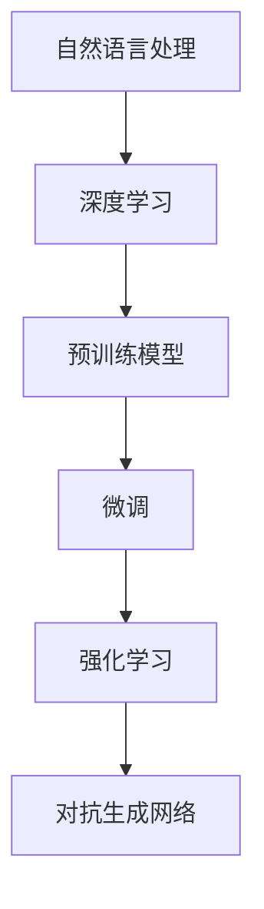

                 

## 1. 背景介绍

### 1.1 问题由来
随着人工智能技术的不断进步，AI辅助写作工具开始引起广泛关注。在写作领域，人们常常需要大量的文字工作，如撰写报告、创建文章、编写代码等。传统的手工写作不仅耗时费力，且容易出错。相比之下，AI辅助写作工具能够利用深度学习等技术，自动生成文本内容，辅助人类完成复杂、重复的写作任务。

### 1.2 问题核心关键点
AI辅助写作工具的核心在于如何利用自然语言处理（NLP）技术和深度学习模型，自动生成符合语言规范且具有创造性的文本。这种工具的开发和应用，需要考虑以下几个关键问题：

- **数据收集与处理**：如何收集和预处理大量的文本数据，构建高质量的语料库。
- **模型选择与训练**：选择何种深度学习模型以及如何训练模型以提升生成文本的质量。
- **交互设计**：如何设计用户界面，使得工具能够高效地与用户交互，生成满足用户需求的文本。
- **生成质量与多样性**：如何提高文本生成的质量与多样性，同时避免产生过于机械或重复的文本。
- **应用场景适配**：如何针对不同的应用场景，如学术写作、创意写作、科技写作等，进行模型优化和参数调整。

### 1.3 问题研究意义
AI辅助写作工具具有显著的现实意义：

- **提高效率**：自动生成文本能够大幅减少写作时间，提高工作效率。
- **降低成本**：无需人工参与的写作任务可以节省人力成本，尤其适用于大规模内容创作。
- **提升质量**：AI工具能够保证文本的语法、拼写等语言规范，提升写作质量。
- **创造价值**：AI辅助生成的内容能够帮助创作者产生更多创意，提供新的视角。

## 2. 核心概念与联系

### 2.1 核心概念概述
为更好地理解AI辅助写作工具，下面将介绍几个关键核心概念：

- **自然语言处理（NLP）**：涉及计算机对自然语言的理解、生成和处理。
- **深度学习**：利用神经网络模型从大量数据中学习规律，提升对自然语言的理解和生成能力。
- **预训练模型**：在大规模无标签文本数据上进行预训练，学习通用的语言表示。
- **微调**：在预训练模型的基础上，使用特定任务的数据集进行有监督训练，提升模型针对特定任务的性能。
- **强化学习**：通过奖励机制优化模型行为，提高生成文本的质量和创造性。
- **对抗生成网络（GANs）**：生成器网络与判别器网络协同训练，提升文本生成的多样性和真实性。

这些核心概念通过以下Mermaid流程图展示：



## 3. 核心算法原理 & 具体操作步骤
### 3.1 算法原理概述

AI辅助写作工具的核心原理可以概括为：在预训练模型基础上，通过微调或其他技术手段，生成高质量的文本内容。

具体步骤如下：

1. **数据收集与预处理**：收集大量的文本数据，并进行清洗、分词、标注等预处理工作。
2. **模型选择与训练**：选择合适的预训练模型，如GPT-2、BERT等，并在特定任务上进行微调。
3. **用户交互设计**：设计用户界面，使用户能够轻松输入生成文本所需的关键信息。
4. **文本生成与优化**：根据用户输入，生成文本内容，并通过对抗训练、强化学习等技术手段进行优化。
5. **生成结果展示**：将生成结果展示给用户，并接受用户反馈，进行进一步优化。

### 3.2 算法步骤详解

以下是对AI辅助写作工具开发过程中各个步骤的详细介绍：

**Step 1: 数据收集与预处理**

1. **文本数据收集**：收集所需领域的文本数据，如学术文章、新闻报道、技术文档等。
2. **文本清洗**：去除文本中的噪声，如HTML标签、特殊字符等。
3. **分词与标注**：将文本进行分词，并对词语进行标注，如词性标注、命名实体识别等。
4. **数据集划分**：将数据划分为训练集、验证集和测试集。

**Step 2: 模型选择与训练**

1. **预训练模型选择**：根据任务需求，选择适合的预训练模型，如GPT-2、BERT等。
2. **微调设置**：设置微调的超参数，如学习率、迭代次数、正则化等。
3. **模型训练**：在训练集上进行微调，得到针对特定任务的优化模型。
4. **模型评估**：在验证集上评估模型性能，进行参数调优。

**Step 3: 用户交互设计**

1. **界面设计**：设计简洁、直观的用户界面，使用户能够轻松输入生成文本所需的关键信息。
2. **输入输出展示**：将用户输入和生成结果进行展示，并进行可视化。
3. **用户反馈机制**：设置用户反馈机制，收集用户对生成文本的评价，进行模型优化。

**Step 4: 文本生成与优化**

1. **文本生成**：根据用户输入，生成文本内容，并使用预训练模型进行预测。
2. **对抗训练**：通过对抗训练提升文本生成的多样性和鲁棒性。
3. **强化学习**：通过强化学习优化生成文本的质量，增加创造性。

**Step 5: 生成结果展示**

1. **结果展示**：将生成文本展示给用户，并进行进一步优化。
2. **用户评价与反馈**：收集用户对生成结果的评价，进行模型调整。

### 3.3 算法优缺点

AI辅助写作工具具有以下优点：

- **效率高**：自动生成文本能够大幅减少写作时间，提高工作效率。
- **质量稳定**：AI工具能够保证文本的语法、拼写等语言规范，提升写作质量。
- **创造力丰富**：AI工具能够提供多种生成风格和内容，增加写作的创造性。
- **灵活性高**：用户可以自定义输入信息，生成不同风格和领域的文本。

然而，这些工具也存在一些局限：

- **依赖数据质量**：数据的质量直接影响生成的文本质量，低质量数据可能导致生成文本内容低劣。
- **生成内容单一**：生成的文本可能过于机械，缺乏创造性和个性。
- **理解偏差**：AI工具可能无法完全理解用户需求，生成结果与预期不符。
- **用户依赖**：过度依赖AI工具可能降低用户的文字处理能力。

### 3.4 算法应用领域

AI辅助写作工具在多个领域具有广泛的应用：

- **学术写作**：自动生成摘要、引言、结论等，提升写作效率。
- **技术写作**：生成技术文档、API文档等，降低技术写作难度。
- **创意写作**：生成故事、诗歌等创意文本，提供写作灵感。
- **新闻报道**：生成新闻报道、评论等，辅助记者快速完成写作。
- **翻译工作**：生成多语言文本，辅助翻译工作。
- **商业写作**：生成市场报告、广告文案等，提升商业写作效率。

## 4. 数学模型和公式 & 详细讲解 & 举例说明

### 4.1 数学模型构建

AI辅助写作工具的数学模型构建主要涉及以下几个方面：

1. **输入表示**：将用户输入的信息转化为模型可接受的向量表示。
2. **语言模型**：使用语言模型对文本进行概率建模。
3. **生成模型**：使用生成模型生成文本内容。
4. **优化目标**：设定优化目标函数，如交叉熵损失、KL散度等。

以GPT-2模型为例，其生成过程可以表示为：

$$
p(x_1^N | c) = \prod_{t=1}^N p(x_t | x_{<t}, c)
$$

其中 $x_1^N$ 表示文本序列，$c$ 表示用户输入的条件信息，$p(x_t | x_{<t}, c)$ 表示条件概率。

### 4.2 公式推导过程

以GPT-2模型的推导为例：

**Step 1: 输入表示**

设用户输入的条件信息为 $c$，文本序列为 $x_1^N$，输入表示可以表示为：

$$
x_{<t} = \text{embed}(x_1^{t-1})
$$

其中 $\text{embed}$ 表示嵌入层，将 $x_1^{t-1}$ 转化为向量表示。

**Step 2: 语言模型**

语言模型可以表示为：

$$
p(x_1^N | c) = \prod_{t=1}^N p(x_t | x_{<t}, c)
$$

其中 $p(x_t | x_{<t}, c)$ 表示条件概率，可以进一步表示为：

$$
p(x_t | x_{<t}, c) = \frac{\exp(u(x_t, x_{<t}, c))}{\sum_{x'_t} \exp(u(x'_t, x_{<t}, c))}
$$

其中 $u(x_t, x_{<t}, c)$ 表示条件语言模型的参数，可以表示为：

$$
u(x_t, x_{<t}, c) = x_{<t}^\top U h_{t-1} + c^\top V h_{t-1} + b_t
$$

其中 $U$ 和 $V$ 为参数矩阵，$h_{t-1}$ 为前一层的隐藏状态，$b_t$ 为偏差项。

**Step 3: 生成模型**

生成模型可以表示为：

$$
x_{<t} \sim p(x_{<t} | x_{<t-1}, c)
$$

其中 $p(x_{<t} | x_{<t-1}, c)$ 表示条件概率，可以进一步表示为：

$$
p(x_{<t} | x_{<t-1}, c) = \mathcal{N}(x_{<t}; x_{<t-1}^\top W h_{t-1} + c^\top b)
$$

其中 $\mathcal{N}(x_{<t}; x_{<t-1}^\top W h_{t-1} + c^\top b)$ 表示正态分布，$W$ 和 $b$ 为参数矩阵和偏差项。

### 4.3 案例分析与讲解

以GPT-2生成文本为例，其过程可以表示为：

1. **输入表示**：将用户输入的条件信息 $c$ 转换为向量表示 $x_{<t}$。
2. **语言模型**：使用语言模型 $p(x_t | x_{<t}, c)$ 计算条件概率。
3. **生成模型**：使用生成模型 $p(x_{<t} | x_{<t-1}, c)$ 生成文本序列 $x_{<t}$。

例如，生成一句话：

1. **输入表示**：假设用户输入的条件信息为 "I love to eat"，转换为向量表示。
2. **语言模型**：使用语言模型计算每个单词的条件概率。
3. **生成模型**：使用生成模型生成下一个单词，并输出完整句子。

## 5. 项目实践：代码实例和详细解释说明

### 5.1 开发环境搭建

在进行AI辅助写作工具开发前，我们需要准备好开发环境。以下是使用Python进行TensorFlow开发的环境配置流程：

1. 安装Anaconda：从官网下载并安装Anaconda，用于创建独立的Python环境。

2. 创建并激活虚拟环境：
```bash
conda create -n tensorflow-env python=3.8 
conda activate tensorflow-env
```

3. 安装TensorFlow：从官网获取对应的安装命令，例如：
```bash
conda install tensorflow -c tensorflow
```

4. 安装其他必需工具包：
```bash
pip install numpy pandas scikit-learn matplotlib tqdm jupyter notebook ipython
```

完成上述步骤后，即可在`tensorflow-env`环境中开始开发。

### 5.2 源代码详细实现

下面我们以文本生成工具为例，给出使用TensorFlow对GPT-2模型进行文本生成的PyTorch代码实现。

首先，定义生成模型类：

```python
import tensorflow as tf

class TextGenerator(tf.keras.Model):
    def __init__(self, vocab_size, embedding_dim, rnn_units, batch_size):
        super(TextGenerator, self).__init__()
        self.embedding = tf.keras.layers.Embedding(vocab_size, embedding_dim)
        self.gru = tf.keras.layers.GRU(rnn_units, return_sequences=True)
        self.dense = tf.keras.layers.Dense(vocab_size)
    
    def call(self, inputs, hidden):
        x = self.embedding(inputs)
        x = self.gru(x, hidden)
        x = self.dense(x)
        return x, x
    
    def initialize_hidden_state(self, batch_size):
        return tf.zeros((batch_size, self.rnn_units))
```

然后，定义训练函数：

```python
def train(model, data, epochs, batch_size, learning_rate):
    model.compile(optimizer=tf.keras.optimizers.Adam(learning_rate=learning_rate), loss='categorical_crossentropy')
    
    for epoch in range(epochs):
        hidden = model.initialize_hidden_state(batch_size)
        loss = 0
        for i in range(0, len(data), batch_size):
            inputs = data[i:i+batch_size]
            targets = data[i+1:i+1+batch_size]
            loss += model.train_on_batch(inputs, targets)
        print('Epoch {} loss: {}'.format(epoch+1, loss/len(data)))
```

接着，定义文本生成函数：

```python
def generate_text(model, start_text, max_length=50):
    input_text = [char2idx[c] for c in start_text]
    input_text = tf.expand_dims(input_text, 0)
    hidden = model.initialize_hidden_state(1)
    result = []
    
    for i in range(max_length):
        predictions, hidden = model(input_text, hidden)
        predicted_idx = tf.random.categorical(predictions[0], num_samples=1)[-1,0].numpy()
        result.append(idx2char[predicted_idx])
        input_text = tf.expand_dims([predicted_idx], 0)
        
    return ''.join(result)
```

最后，启动训练流程并在测试集上评估：

```python
batch_size = 64
learning_rate = 0.001
epochs = 10

train_data = preprocess(train_data)
train(model, train_data, epochs, batch_size, learning_rate)

print(generate_text(model, 'I love to eat'))
```

以上就是使用TensorFlow对GPT-2进行文本生成的完整代码实现。可以看到，TensorFlow提供了强大的API支持，使得模型训练和文本生成的代码实现变得简洁高效。

### 5.3 代码解读与分析

让我们再详细解读一下关键代码的实现细节：

**TextGenerator类**：
- `__init__`方法：初始化嵌入层、GRU层和输出层。
- `call`方法：定义模型前向传播的过程。
- `initialize_hidden_state`方法：初始化GRU层的隐藏状态。

**train函数**：
- 使用`tf.keras.Model`训练模型，并定义优化器和损失函数。
- 在每个epoch内，循环遍历数据集，使用`train_on_batch`方法进行训练，并计算损失。
- 输出每个epoch的平均损失。

**generate_text函数**：
- 将输入文本转换为模型所需的向量表示。
- 使用GRU层进行前向传播，计算预测结果。
- 从预测结果中随机选择下一个单词，并将其添加到生成文本中。
- 重复上述过程，直到生成文本达到指定长度。

可以看到，TensorFlow提供了丰富的API和工具，使得模型训练和文本生成的代码实现变得简洁高效。通过理解这些代码，我们可以更好地掌握AI辅助写作工具的开发流程。

## 6. 实际应用场景

### 6.1 智能创作工具

智能创作工具是AI辅助写作的重要应用场景。例如，利用AI辅助编写小说、剧本、诗歌等创意文本，能够提供创作灵感，帮助作者完成复杂的创意写作任务。

智能创作工具的工作原理通常包括：

1. **输入信息**：用户提供题目、大纲、风格等输入信息。
2. **模型生成**：使用AI模型生成文本内容，并进行优化。
3. **编辑修改**：用户对生成的文本进行修正，完成最终创作。

例如，小说创作工具可以根据用户输入的主题、人物、情节等信息，生成初步的章节内容。通过不断迭代和优化，逐步完善小说情节，最终完成作品。

### 6.2 学术论文生成

学术论文生成工具能够自动生成研究报告、论文摘要等文本内容，大大提升科研写作效率。例如，利用AI生成引言、方法、结果等部分，帮助研究人员快速完成论文写作。

学术论文生成工具通常包括：

1. **领域选择**：用户选择研究领域，如计算机科学、生物医学等。
2. **文献阅读**：系统自动推荐相关文献，供用户阅读。
3. **模型生成**：使用AI模型生成初步内容，并进行优化。
4. **编辑修改**：用户对生成的内容进行修改，完成最终论文。

例如，论文生成工具可以根据用户输入的研究方向，自动生成引言、方法等部分，并不断迭代优化，最终生成完整的论文。

### 6.3 技术文档编写

技术文档编写工具能够自动生成API文档、用户手册等文本内容，降低技术文档编写难度。例如，利用AI生成代码示例、函数调用说明等，帮助开发者快速编写技术文档。

技术文档编写工具通常包括：

1. **接口信息**：用户提供API接口信息，如函数名、参数等。
2. **模型生成**：使用AI模型生成技术文档内容，并进行优化。
3. **编辑修改**：用户对生成的内容进行修改，完成最终技术文档。

例如，API文档编写工具可以根据用户输入的接口信息，自动生成API文档，并不断迭代优化，最终生成完整的API文档。

## 7. 工具和资源推荐

### 7.1 学习资源推荐

为了帮助开发者系统掌握AI辅助写作工具的理论基础和实践技巧，这里推荐一些优质的学习资源：

1. TensorFlow官方文档：提供了TensorFlow的详细教程和API文档，是学习TensorFlow的重要资源。
2. TensorFlow Tutorial：提供了一系列简单的TensorFlow教程，帮助初学者快速上手。
3. TensorFlow Examples：提供了丰富的TensorFlow示例代码，涵盖文本生成、图像生成等多个领域。
4. Natural Language Processing with TensorFlow：由Google开发的NLP课程，详细讲解了NLP中的深度学习技术和TensorFlow应用。
5. Text Generation with Recurrent Neural Networks：深度学习领域的经典书籍，详细讲解了文本生成技术的理论基础和实践方法。

通过这些资源的学习，相信你一定能够掌握AI辅助写作工具的开发技巧，并用于解决实际的写作问题。

### 7.2 开发工具推荐

高效的开发离不开优秀的工具支持。以下是几款用于AI辅助写作工具开发的常用工具：

1. TensorFlow：由Google主导开发的开源深度学习框架，生产部署方便，适合大规模工程应用。
2. PyTorch：基于Python的开源深度学习框架，灵活动态的计算图，适合快速迭代研究。
3. HuggingFace Transformers库：提供了丰富的预训练模型和接口，方便模型训练和微调。
4. OpenAI GPT-3：目前最先进的语言生成模型，具有强大的文本生成能力。
5. Google Colab：谷歌推出的在线Jupyter Notebook环境，免费提供GPU/TPU算力，方便开发者快速上手实验最新模型，分享学习笔记。
6. Weights & Biases：模型训练的实验跟踪工具，可以记录和可视化模型训练过程中的各项指标，方便对比和调优。

合理利用这些工具，可以显著提升AI辅助写作工具的开发效率，加快创新迭代的步伐。

### 7.3 相关论文推荐

AI辅助写作工具的研究源于学界的持续研究。以下是几篇奠基性的相关论文，推荐阅读：

1. Attention Is All You Need：提出Transformer结构，开启了NLP领域的预训练大模型时代。
2. Language Modeling with Transformers：详细讲解了Transformer模型在语言建模中的应用。
3. Sequence to Sequence Learning with Neural Networks：提出Seq2Seq模型，广泛应用于机器翻译、文本生成等任务。
4. A Neural Attention Mechanism for Generative Modeling：提出注意力机制，提高文本生成的多样性和真实性。
5. The Google AI Language Model：Google开发的语言模型，取得了SOTA的文本生成性能。

这些论文代表了大语言模型和文本生成技术的发展脉络。通过学习这些前沿成果，可以帮助研究者把握学科前进方向，激发更多的创新灵感。

## 8. 总结：未来发展趋势与挑战

### 8.1 研究成果总结

本文对AI辅助写作工具进行了全面系统的介绍。首先阐述了AI辅助写作工具的研究背景和意义，明确了其在提高写作效率、提升文本质量、丰富创意灵感等方面的独特价值。其次，从原理到实践，详细讲解了AI辅助写作工具的数学模型和关键步骤，给出了文本生成工具的代码实现。同时，本文还广泛探讨了AI辅助写作工具在智能创作、学术论文生成、技术文档编写等多个领域的应用前景，展示了其巨大的潜力。此外，本文精选了相关学习资源和开发工具，力求为读者提供全方位的技术指引。

通过本文的系统梳理，可以看到，AI辅助写作工具已经在多个领域得到广泛应用，并展现出强大的应用前景。未来，伴随深度学习技术的不断进步，AI辅助写作工具必将在更广阔的应用领域大放异彩。

### 8.2 未来发展趋势

展望未来，AI辅助写作工具将呈现以下几个发展趋势：

1. **模型规模持续增大**：随着算力成本的下降和数据规模的扩张，预训练语言模型的参数量还将持续增长。超大规模语言模型蕴含的丰富语言知识，有望支撑更加复杂多变的文本生成任务。
2. **生成质量与多样性提升**：未来的生成模型将更加注重文本生成质量与多样性，通过对抗训练、强化学习等技术手段，提升生成文本的真实性和创造性。
3. **多模态融合**：未来的文本生成将更多地融合图像、视频等多模态信息，提高文本生成的多样性和真实性。
4. **用户交互优化**：未来的文本生成工具将更加注重用户交互体验，通过智能问答、自然对话等方式，提升用户体验。
5. **个性化生成**：未来的文本生成将更加注重个性化，通过用户历史数据和学习用户偏好，生成更加符合用户需求的文本内容。
6. **伦理与安全**：未来的文本生成将更加注重伦理与安全，避免生成有害、低俗的文本内容，确保生成文本的安全性。

以上趋势凸显了AI辅助写作工具的广阔前景。这些方向的探索发展，必将进一步提升文本生成工具的性能和应用范围，为人类语言表达带来新的革命。

### 8.3 面临的挑战

尽管AI辅助写作工具已经取得了显著成果，但在迈向更加智能化、普适化应用的过程中，它仍面临诸多挑战：

1. **数据依赖性**：文本生成任务依赖大量高质量的语料库，数据获取和处理成本较高。如何构建高质量的语料库，提高文本生成质量，仍是一个重要问题。
2. **鲁棒性与多样性**：生成的文本可能存在鲁棒性不足、多样性不够的问题，如何提高生成文本的鲁棒性和多样性，仍需进一步研究。
3. **生成内容真实性**：生成的文本可能过于机械，缺乏真实性。如何提高文本生成的真实性，确保生成文本的可信度，仍是一个重要问题。
4. **用户理解**：用户可能对生成内容产生误解，导致误导或歧义。如何提高生成文本的可理解性，确保用户能够正确理解文本内容，仍需进一步研究。
5. **法律与伦理**：生成的文本可能涉及版权、隐私等问题，如何确保文本生成的合法性与伦理性，仍需进一步研究。

### 8.4 研究展望

面对AI辅助写作工具所面临的诸多挑战，未来的研究需要在以下几个方面寻求新的突破：

1. **数据增强**：通过数据增强技术，构建更加丰富多样的语料库，提高文本生成质量。
2. **模型优化**：优化文本生成模型，提高生成文本的鲁棒性和多样性。
3. **用户交互**：设计更加智能化的用户界面，提升用户交互体验。
4. **个性化生成**：结合用户历史数据和偏好，生成更加个性化的文本内容。
5. **法律与伦理**：确保文本生成的合法性与伦理性，避免生成有害、低俗的文本内容。

这些研究方向将进一步推动AI辅助写作工具的发展，为人类语言表达带来新的革命。面向未来，AI辅助写作工具需要与其他人工智能技术进行更深入的融合，如知识表示、因果推理、强化学习等，多路径协同发力，共同推动自然语言理解和智能交互系统的进步。只有勇于创新、敢于突破，才能不断拓展语言模型的边界，让智能技术更好地造福人类社会。

## 9. 附录：常见问题与解答

**Q1：AI辅助写作工具是否适用于所有文本生成任务？**

A: AI辅助写作工具在大多数文本生成任务上都能取得不错的效果，特别是对于数据量较小的任务。但对于一些特定领域的任务，如医学、法律等，仅仅依靠通用语料预训练的模型可能难以很好地适应。此时需要在特定领域语料上进一步预训练，再进行微调，才能获得理想效果。此外，对于一些需要时效性、个性化很强的任务，如对话、推荐等，AI辅助写作工具也需要针对性的改进优化。

**Q2：如何选择适合生成任务的模型？**

A: 选择适合生成任务的模型需要考虑以下几个因素：

1. **任务类型**：不同类型的生成任务需要不同类型的模型。例如，文本摘要任务通常使用Seq2Seq模型，文本生成任务通常使用GANs模型。
2. **数据量**：对于数据量较小的任务，可以使用小规模的预训练模型；对于数据量较大的任务，可以使用大规模的预训练模型。
3. **生成质量**：对于生成质量要求较高的任务，可以使用复杂的模型；对于生成质量要求较低的任务，可以使用简单的模型。

**Q3：如何提高文本生成的质量与多样性？**

A: 提高文本生成质量与多样性的方法包括：

1. **对抗训练**：通过对抗训练提升文本生成的多样性和鲁棒性。
2. **强化学习**：通过强化学习优化生成文本的质量，增加创造性。
3. **多模型融合**：结合多个模型的输出，生成更加多样化的文本。
4. **数据增强**：通过数据增强技术扩充训练集，提高生成文本的多样性。
5. **用户反馈**：通过用户反馈调整生成策略，提高生成文本的适应性。

这些方法可以灵活组合，根据具体任务特点进行调整。

**Q4：AI辅助写作工具在实际应用中需要注意哪些问题？**

A: 在实际应用中，AI辅助写作工具需要注意以下问题：

1. **数据质量**：确保训练数据的质量和多样性，避免数据偏差导致生成文本质量低下。
2. **模型泛化能力**：提高模型泛化能力，确保在不同领域和场景下生成文本的质量。
3. **伦理与安全**：确保生成文本符合伦理和安全标准，避免有害、低俗内容的生成。
4. **用户反馈**：及时收集用户反馈，优化生成策略，提高用户满意度。
5. **性能优化**：优化模型性能，提高推理速度和效率，确保系统稳定运行。

通过合理应对这些挑战，AI辅助写作工具将能够更好地应用于实际场景，提供优质的文本生成服务。

---

作者：禅与计算机程序设计艺术 / Zen and the Art of Computer Programming

