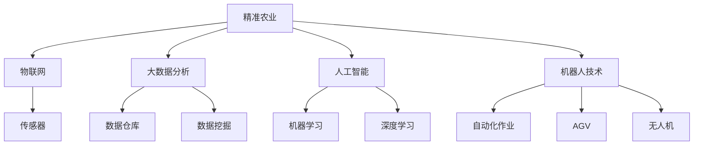

                 

# 智能农场创业：精准农业的未来方向

## 1. 背景介绍

随着现代农业的快速发展，传统的粗放型农业生产方式已难以满足日益增长的粮食和农产品需求。精准农业（Precision Agriculture）作为现代农业的数字化转型方向，通过智能化技术提升农作物的生产效率和品质，已成为农业发展的必然趋势。

### 1.1 问题由来
当前，全球农业面临诸多挑战，如气候变化、病虫害频发、资源浪费等。传统农业生产方式无法有效应对这些问题，且对环境的负面影响巨大。而精准农业通过大数据、物联网、人工智能等技术手段，能够实现对农业生产全过程的精准监控和优化，提高资源利用效率，减少环境污染，促进可持续发展。

### 1.2 问题核心关键点
精准农业的核心在于数据驱动的智能决策。通过收集和分析大量的农业生产数据，精准农业系统能够实时监测农作物的生长状态、环境参数、土壤肥力等，根据分析结果智能调整种植方案，如灌溉、施肥、病虫害防治等。

## 2. 核心概念与联系

### 2.1 核心概念概述

为更好地理解精准农业的实施，本节将介绍几个关键的概念：

- 精准农业(Precision Agriculture)：利用信息技术，实现对农业生产过程的精细化管理，提高资源利用效率，提升农产品品质。
- 物联网(IoT)：通过传感器、通信网络等技术手段，实现对农业环境参数、作物生长状态等的实时监测和数据采集。
- 大数据分析：收集海量农业生产数据，通过数据挖掘和分析，挖掘数据中的潜在价值，实现科学决策。
- 人工智能(AI)：包括机器学习、深度学习等技术，对采集到的数据进行建模和预测，优化农业生产过程。
- 机器人技术(Robotics)：用于自动化作业，如播种、除草、施肥、收获等，提升作业效率和精确度。

这些概念之间的逻辑关系可以通过以下Mermaid流程图来展示：



这个流程图展示出精准农业的技术架构：

1. 精准农业通过物联网设备，实时监测农业环境。
2. 采集到的数据通过大数据分析，挖掘出有用的信息。
3. 人工智能模型对这些信息进行建模和预测，优化农业生产过程。
4. 机器人技术用于自动化作业，提升作业效率和精确度。

## 3. 核心算法原理 & 具体操作步骤
### 3.1 算法原理概述

精准农业的核心算法包括数据采集、数据分析和智能决策。其基本流程如下：

1. **数据采集**：通过传感器、摄像头、无人机等物联网设备，采集农作物的生长状态、环境参数、土壤肥力等数据。
2. **数据分析**：对采集到的数据进行清洗、预处理和特征提取，并通过大数据分析技术，挖掘出对农业生产有指导意义的规律。
3. **智能决策**：利用人工智能模型对分析结果进行建模和预测，得出最优的农业生产方案。
4. **自动化执行**：通过机器人技术，自动执行农业生产方案，如灌溉、施肥、病虫害防治等。

### 3.2 算法步骤详解

精准农业的实施流程包括以下关键步骤：

**Step 1: 数据采集**
- 安装传感器、摄像头、无人机等物联网设备，实时采集农业生产过程中的各种数据。
- 配置数据采集频率，确保数据的时效性和精度。

**Step 2: 数据预处理**
- 对采集到的数据进行清洗和去噪，排除异常值和不完整数据。
- 对数据进行归一化处理，确保数据在不同单位和量级上的可比性。

**Step 3: 特征提取**
- 从预处理后的数据中提取有用的特征，如作物生长状态、土壤肥力、气象条件等。
- 使用特征工程技术，构建适合人工智能模型的特征集。

**Step 4: 模型训练**
- 选择合适的机器学习或深度学习模型，如随机森林、卷积神经网络等。
- 使用历史农业生产数据，训练模型，调整模型参数，使其能够准确预测未来的农业生产状态。

**Step 5: 智能决策**
- 根据训练好的模型，对实时采集的数据进行预测，得出最优的农业生产方案。
- 考虑环境变化和不确定性，制定多方案的农业生产策略。

**Step 6: 自动化执行**
- 通过机器人技术，自动执行农业生产方案，如喷灌、施肥、农药喷洒等。
- 实时监测执行效果，根据反馈调整生产方案。

**Step 7: 反馈优化**
- 收集执行效果的数据，进行反馈分析，优化农业生产方案。
- 定期更新模型，保持其对新环境变化的适应能力。

### 3.3 算法优缺点

精准农业的实施，具有以下优点：
1. 提高生产效率。通过实时监测和数据驱动，实现对农业生产过程的精细化管理，减少资源浪费。
2. 提高作物品质。利用智能决策，优化种植方案，提升农作物的产量和品质。
3. 提升环境友好性。减少化肥、农药的过量使用，降低对环境的污染。
4. 提高农业管理水平。通过数据分析，发现潜在问题，优化农业生产流程。

同时，该方法也存在一定的局限性：
1. 设备成本高。传感器、无人机等设备的购置和维护成本较高。
2. 数据质量要求高。数据采集的精度和完整性直接影响模型的效果。
3. 技术门槛高。需要专业的技术团队进行设备安装、数据处理和模型训练。
4. 数据隐私问题。大量的农业数据涉及隐私保护，需要严格的数据安全措施。

尽管存在这些局限性，但精准农业作为一种先进的农业管理模式，其带来的综合效益已得到广泛认可。未来相关研究的重点在于如何降低技术门槛，提高数据采集和处理的自动化水平，同时兼顾数据隐私和安全性等因素。

### 3.4 算法应用领域

精准农业的技术和应用已经覆盖了农业生产的各个环节，包括：

- 种植管理：通过土壤传感器、气象站等设备，实时监测土壤肥力、水分、温度等参数，优化播种、施肥和灌溉。
- 病虫害防治：利用无人机和图像识别技术，实时监测病虫害发生情况，及时采取防治措施。
- 农作物收割：通过自动驾驶农机，实现精确收割，减少粮食损失和作业时间。
- 农场运营管理：通过农业物联网系统，实现农场生产过程的实时监控和数据分析，提升农场管理效率。
- 农场物流：利用AGV、无人机等自动化设备，优化农产品的物流和仓储，提高物流效率。

这些应用场景展示了精准农业在农业生产中的广泛应用，能够显著提升农业生产的智能化水平和效率。

## 4. 数学模型和公式 & 详细讲解  
### 4.1 数学模型构建

精准农业的数据分析模型通常采用监督学习的方法，通过历史数据训练模型，对未来数据进行预测。这里以作物生长预测为例，介绍一个典型的数学模型。

假设农作物的生长状态可以用一系列特征 $x$ 表示，如土壤湿度、氮肥含量、气温等。则作物生长预测模型可以表示为：

$$
y = f(x) + \epsilon
$$

其中，$f(x)$ 为预测函数，$\epsilon$ 为误差项。在实际应用中，通常使用线性回归或非线性回归模型，通过历史数据 $(x_i,y_i)$ 进行训练，得到最优的预测函数。

### 4.2 公式推导过程

以线性回归模型为例，其推导过程如下：

设训练集为 $D=\{(x_i,y_i)\}_{i=1}^N$，其中 $x_i \in \mathbb{R}^m$，$y_i \in \mathbb{R}$。则线性回归模型的预测函数为：

$$
y = \mathbf{w} \cdot \mathbf{x} + b
$$

其中，$\mathbf{w} \in \mathbb{R}^m$ 为权重向量，$b \in \mathbb{R}$ 为偏置项。

模型的目标是最小化预测误差，即：

$$
\min_{\mathbf{w},b} \sum_{i=1}^N (y_i - (\mathbf{w} \cdot \mathbf{x}_i + b))^2
$$

通过求解上述优化问题，可以得到最优的权重向量 $\mathbf{w}^*$ 和偏置项 $b^*$。

### 4.3 案例分析与讲解

以某农场的数据为例，假设采集到了如下特征：

- 土壤湿度：$x_1$
- 氮肥含量：$x_2$
- 气温：$x_3$
- 降雨量：$x_4$
- 生长天数：$x_5$
- 产量：$y$

通过构建线性回归模型，对历史数据进行训练，可以得到如下预测函数：

$$
y = 2.3x_1 + 1.5x_2 - 0.2x_3 + 0.8x_4 + 0.1x_5
$$

使用该模型对未来数据进行预测，可以得出最优的农业生产方案。

## 5. 项目实践：代码实例和详细解释说明
### 5.1 开发环境搭建

在进行精准农业系统的开发前，我们需要准备好开发环境。以下是使用Python进行TensorFlow开发的环境配置流程：

1. 安装Anaconda：从官网下载并安装Anaconda，用于创建独立的Python环境。

2. 创建并激活虚拟环境：
```bash
conda create -n tf-env python=3.8 
conda activate tf-env
```

3. 安装TensorFlow：根据CUDA版本，从官网获取对应的安装命令。例如：
```bash
conda install tensorflow==2.7 -c conda-forge
```

4. 安装相关工具包：
```bash
pip install numpy pandas scikit-learn matplotlib tensorflow
```

完成上述步骤后，即可在`tf-env`环境中开始精准农业系统的开发。

### 5.2 源代码详细实现

下面我们以作物生长预测为例，给出使用TensorFlow进行线性回归模型训练的Python代码实现。

首先，定义模型和优化器：

```python
import tensorflow as tf

# 定义线性回归模型
def linear_regression(x, w, b):
    return tf.matmul(x, w) + b

# 定义优化器
optimizer = tf.optimizers.Adam(learning_rate=0.01)

# 定义损失函数
def mse_loss(y_true, y_pred):
    return tf.reduce_mean(tf.square(y_true - y_pred))
```

接着，定义训练和评估函数：

```python
# 定义训练函数
def train_model(model, dataset, batch_size, epochs):
    for epoch in range(epochs):
        total_loss = 0
        for batch in dataset:
            inputs, targets = batch
            with tf.GradientTape() as tape:
                predictions = model(inputs)
                loss = mse_loss(targets, predictions)
            gradients = tape.gradient(loss, model.trainable_variables)
            optimizer.apply_gradients(zip(gradients, model.trainable_variables))
            total_loss += loss.numpy()
        print(f"Epoch {epoch+1}, Loss: {total_loss/len(dataset)}")

# 定义评估函数
def evaluate_model(model, dataset, batch_size):
    total_loss = 0
    total_preds = []
    for batch in dataset:
        inputs, targets = batch
        predictions = model(inputs)
        loss = mse_loss(targets, predictions)
        total_loss += loss.numpy()
        total_preds.append(predictions.numpy())
    print(f"Evaluation Loss: {total_loss/len(dataset)}")
    return total_preds
```

最后，启动训练流程并在测试集上评估：

```python
# 准备数据
train_dataset = tf.data.Dataset.from_tensor_slices((train_x, train_y))
train_dataset = train_dataset.shuffle(buffer_size=1000).batch(batch_size)
test_dataset = tf.data.Dataset.from_tensor_slices((test_x, test_y))
test_dataset = test_dataset.batch(batch_size)

# 训练模型
model = tf.keras.Sequential([
    tf.keras.layers.Dense(1, input_shape=[num_features])
])
train_model(model, train_dataset, batch_size, num_epochs)

# 评估模型
preds = evaluate_model(model, test_dataset, batch_size)
```

以上就是使用TensorFlow进行精准农业系统开发的完整代码实现。可以看到，TensorFlow提供了强大的计算图和自动微分功能，使得模型训练和评估变得简单高效。

### 5.3 代码解读与分析

让我们再详细解读一下关键代码的实现细节：

**train_model函数**：
- 使用优化器Adam进行梯度下降，更新模型参数。
- 计算每个batch的预测值和损失函数，并累加损失。
- 在每个epoch结束时输出平均损失。

**evaluate_model函数**：
- 同样使用Adam优化器进行梯度下降。
- 计算每个batch的预测值和损失函数，并累加损失。
- 在测试集上输出平均损失。

**模型定义**：
- 使用Sequential模型定义线性回归模型，包含一个Dense层。
- 使用sigmoid激活函数将模型输出转换为概率值。

这些代码展示了TensorFlow在模型训练和评估中的强大功能，开发者可以快速构建和训练复杂模型。

## 6. 实际应用场景
### 6.1 智能灌溉系统

精准农业的智能灌溉系统通过实时监测土壤湿度和气象条件，智能调整灌溉计划，优化水资源利用。

在技术实现上，可以安装土壤湿度传感器、气象站等物联网设备，实时采集土壤湿度和气象数据。通过数据清洗和特征提取，构建适合线性回归模型的特征集。利用历史灌溉数据训练模型，得到最优的灌溉预测函数。将实时采集的数据输入模型，预测最优的灌溉量，自动控制灌溉系统进行精准灌溉。

### 6.2 智能施肥系统

精准农业的智能施肥系统通过实时监测土壤肥力和作物生长状态，智能调整施肥计划，提高肥料利用率，减少环境污染。

在技术实现上，可以安装土壤肥力传感器、作物生长监测器等物联网设备，实时采集土壤肥力和作物生长状态。通过数据清洗和特征提取，构建适合回归模型的特征集。利用历史施肥数据训练模型，得到最优的施肥预测函数。将实时采集的数据输入模型，预测最优的施肥量，自动控制施肥系统进行精准施肥。

### 6.3 智能病虫害防治系统

精准农业的智能病虫害防治系统通过实时监测病虫害发生情况，智能调整防治计划，减少农药使用，保护生态环境。

在技术实现上，可以安装无人机和图像识别设备，实时采集农田病虫害发生情况。通过数据清洗和特征提取，构建适合分类模型的特征集。利用历史病虫害数据训练模型，得到最优的病虫害预测函数。将实时采集的数据输入模型，预测病虫害发生情况，自动控制防治系统进行病虫害防治。

### 6.4 未来应用展望

随着精准农业技术的不断发展和成熟，未来将在更多领域得到广泛应用，如智能仓储、智能物流、智能温室等，为农业生产带来革命性的变革。

在智慧农业领域，精准农业系统将实现农场全生命周期的智能管理，从播种、种植、施肥、灌溉、病虫害防治、收割到物流、仓储，每个环节都能通过智能系统进行精准控制，实现最大化的资源利用和效益提升。

在农业物联网领域，精准农业将推动物联网设备的普及和标准化，实现农业生产过程的全方位智能化和自动化。

在农业大数据领域，精准农业将构建起强大的农业数据平台，实现数据的集中管理和深度分析，为农业生产提供更精准的决策支持。

此外，在智能温室、智能仓储等更多垂直应用场景中，精准农业也将展现出巨大的应用潜力，推动农业生产的智能化和自动化进程。

## 7. 工具和资源推荐
### 7.1 学习资源推荐

为了帮助开发者系统掌握精准农业的实施，这里推荐一些优质的学习资源：

1. 《深度学习在农业中的应用》书籍：全面介绍了深度学习在精准农业中的应用，包括数据采集、数据分析和智能决策等方面。

2. 《物联网在农业中的应用》课程：介绍物联网在农业中的应用，包括传感器、无人机、农业机器人等技术。

3. 《精准农业技术及应用》视频课程：详细讲解精准农业的实施步骤和案例分析，涵盖数据采集、数据分析和智能决策等方面。

4. 《农业物联网》期刊：定期发布农业物联网技术的最新进展和应用案例，涵盖传感器、通信网络、智能设备等方面。

5. 精准农业开源项目：开源社区提供的精准农业解决方案，包括数据采集、数据分析和智能决策等方面的代码和文档。

通过对这些资源的学习实践，相信你一定能够快速掌握精准农业的实施方法，并应用于实际的农业生产中。

### 7.2 开发工具推荐

高效的开发离不开优秀的工具支持。以下是几款用于精准农业开发的常用工具：

1. TensorFlow：基于Python的开源深度学习框架，灵活的计算图和自动微分功能，适合构建复杂的精准农业模型。

2. TensorBoard：TensorFlow配套的可视化工具，实时监测模型训练状态，提供丰富的图表呈现方式，方便调试和优化模型。

3. Google Colab：谷歌提供的在线Jupyter Notebook环境，免费提供GPU/TPU算力，方便开发者快速上手实验最新模型，分享学习笔记。

4. Pymongo：用于访问MongoDB数据库，方便存储和管理农业生产数据。

5. InfluxDB：开源的实时数据库，支持时间序列数据的存储和查询，适合存储和分析农业物联网数据。

6. Kafka：分布式流处理平台，支持高吞吐量数据采集和传输，适合构建大规模农业物联网系统。

合理利用这些工具，可以显著提升精准农业开发的效率，加速创新迭代的步伐。

### 7.3 相关论文推荐

精准农业技术的发展源于学界的持续研究。以下是几篇奠基性的相关论文，推荐阅读：

1. Precision Agriculture: A Review of Concepts, Methodologies, Technologies and Applications：全面介绍了精准农业的概念、方法和技术，推动了精准农业的全球发展。

2. Agricultural Data Mining: A Survey of Data Collection, Storage, and Analysis Methods in Precision Agriculture：详细分析了农业数据的采集、存储和分析方法，为精准农业的数据处理提供了重要参考。

3. Intelligent Agriculture Management Based on Internet of Things: A Review and Perspectives：综述了物联网技术在精准农业中的应用，为智能农业的管理提供了新的思路。

4. Internet of Things (IoT) Technologies for Precision Agriculture: A Review of Technologies and Applications：介绍了物联网技术在精准农业中的应用，涵盖了传感器、通信网络、智能设备等方面。

5. Data Mining and Statistical Learning Approaches for Precision Agriculture：讨论了数据挖掘和统计学习方法在精准农业中的应用，为精准农业的数据分析和建模提供了理论基础。

这些论文代表了大数据、物联网和人工智能在精准农业中的应用方向，通过学习这些前沿成果，可以帮助研究者把握学科前进方向，激发更多的创新灵感。

## 8. 总结：未来发展趋势与挑战

### 8.1 总结

本文对精准农业的实施方法进行了全面系统的介绍。首先阐述了精准农业的实施背景和意义，明确了数据驱动的智能决策在精准农业中的关键作用。其次，从原理到实践，详细讲解了精准农业的数学模型和关键步骤，给出了精准农业系统开发的完整代码实例。同时，本文还广泛探讨了精准农业在智能灌溉、智能施肥、智能病虫害防治等多个农业生产环节的应用前景，展示了精准农业技术的广泛应用。此外，本文精选了精准农业的学习资源、开发工具和相关论文，力求为读者提供全方位的技术指引。

通过本文的系统梳理，可以看到，精准农业的实施方法在提升农业生产效率和品质、降低环境污染、推动农业可持续发展等方面，具有巨大的潜力。精准农业系统通过数据采集、数据分析和智能决策，实现了对农业生产过程的精细化管理，有助于解决传统农业生产中存在的问题，推动农业生产的智能化和自动化进程。

### 8.2 未来发展趋势

展望未来，精准农业技术将呈现以下几个发展趋势：

1. 物联网技术的普及。未来将有更多的物联网设备进入农业生产，实现对农业生产全过程的实时监测和数据采集。

2. 大数据分析的深化。利用大数据分析技术，挖掘更多有价值的农业数据，为智能决策提供更多依据。

3. 人工智能模型的多样。除了线性回归和深度学习模型，未来的精准农业系统将采用更多类型的模型，如随机森林、支持向量机等。

4. 机器学习的优化。通过机器学习技术的优化，提高模型的泛化能力和鲁棒性，更好地适应不同的农业生产环境。

5. 自动化的提升。通过自动化技术，如智能灌溉、智能施肥、智能病虫害防治等，实现农业生产过程的全自动化。

6. 智慧农业的实现。将精准农业与智慧农业技术结合，实现农场全生命周期的智能化管理。

以上趋势凸显了精准农业技术的广阔前景。这些方向的探索发展，必将进一步提升农业生产的智能化水平和效率，为农业生产的可持续发展提供有力保障。

### 8.3 面临的挑战

尽管精准农业技术已经取得了一定的成果，但在迈向更广泛应用的过程中，仍面临诸多挑战：

1. 技术成本高。物联网设备的购置和维护成本较高，农业机器人等自动化设备的价格也不低。

2. 数据质量问题。农业生产数据存在噪声、缺失等问题，影响模型的准确性和稳定性。

3. 技术门槛高。精准农业系统需要专业的技术团队进行设备安装、数据处理和模型训练，技术门槛较高。

4. 数据隐私问题。大量的农业数据涉及隐私保护，需要严格的数据安全措施。

5. 技术普及度低。虽然精准农业技术具有优势，但在一些偏远地区和中小农户中，技术普及度仍然较低。

尽管存在这些挑战，但精准农业作为一种先进的农业管理模式，其带来的综合效益已得到广泛认可。未来相关研究的重点在于如何降低技术成本，提高数据采集和处理的自动化水平，同时兼顾数据隐私和安全性等因素。

### 8.4 研究展望

面对精准农业面临的挑战，未来的研究需要在以下几个方面寻求新的突破：

1. 探索低成本、高效能的物联网设备和传感器。开发低成本、高精度的传感器，推动精准农业技术的普及。

2. 研究高效的数据清洗和特征提取技术。提高数据采集和处理的自动化水平，减少人工干预。

3. 开发适应性强的智能决策模型。结合农业生产的实际情况，开发适应性强、鲁棒性高的模型。

4. 引入多模态数据融合技术。将物联网设备采集的多模态数据进行融合，提高决策的准确性和可靠性。

5. 开发智能农业机器人。通过机器人技术，实现农业生产过程的自动化和智能化。

6. 探索人工智能与农业的结合。将人工智能技术与农业生产结合，提高农业生产的智能化水平。

这些研究方向将推动精准农业技术的发展，为农业生产的智能化和自动化进程提供新的动力。总之，精准农业技术需要多路径协同发力，共同推动农业生产的数字化转型，实现农业生产的智能化和可持续发展。

## 9. 附录：常见问题与解答

**Q1：精准农业的实施是否适用于所有农业生产类型？**

A: 精准农业的实施主要适用于大型农场和现代化农业生产，对小规模农户和传统农业的适用性有限。但在中小规模农户中，可以采用简单的数据采集和分析方法，实现基本的精准管理。

**Q2：精准农业需要多少投资？**

A: 精准农业的实施需要一定的初始投资，包括物联网设备的购置、数据采集设备的安装、数据分析系统的构建等。但长期来看，精准农业系统通过提高资源利用率和作物品质，能够带来更高的经济效益。

**Q3：精准农业系统如何降低技术门槛？**

A: 通过开源社区和标准化技术的应用，如农业物联网标准、农业数据分析模型等，可以提高精准农业系统的可操作性和可扩展性。同时，通过简化设备安装和操作流程，降低技术门槛。

**Q4：如何保障农业数据的隐私和安全？**

A: 采用加密技术和访问控制策略，对农业数据进行安全传输和存储。建立数据使用协议，明确数据的使用范围和权限。同时，通过数据分析匿名化技术，保护用户隐私。

**Q5：精准农业如何实现自适应性？**

A: 结合农业生产的实际情况，不断优化数据采集和处理流程，改进智能决策模型。通过实时监测和反馈优化，使系统能够不断适应不同的农业生产环境。

这些问题的解答，帮助我们更好地理解精准农业的实施方法，并指导实际应用。精准农业技术的不断发展和成熟，将为农业生产的智能化和可持续发展提供新的动力。相信通过技术创新和协同发展，精准农业将成为推动农业生产变革的重要力量。

---

作者：禅与计算机程序设计艺术 / Zen and the Art of Computer Programming

