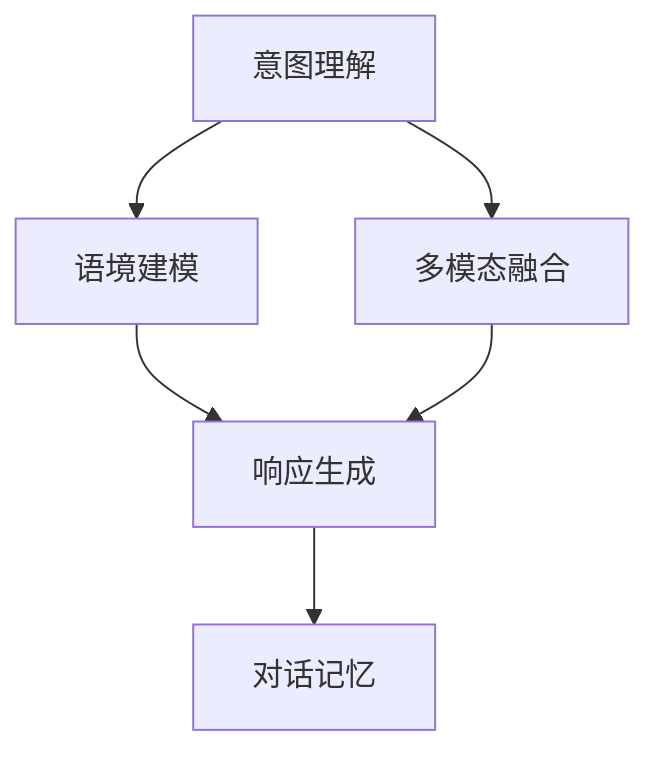

                 

# 智能化回应技术在CUI中的详细实现

## 1. 背景介绍

### 1.1 问题由来

用户接口（User Interface, UI）是用户与计算机系统进行交互的桥梁，是现代计算机科学中最基本且重要的组成部分。传统的UI设计主要以图形化界面为主，但随着移动互联网和人工智能技术的快速发展，智能对话系统（CUI, Conversational User Interface）已成为用户交互的主流。相较于传统UI，CUI强调用户与系统的自然语言交互，通过智能对话实现复杂任务操作，提升用户体验，增强系统的交互效率。

智能对话系统可分为基于规则的系统和基于机器学习的系统。前者主要依赖人工编写的对话规则库，通过匹配规则进行回答；后者则利用机器学习技术，训练模型学习对话响应。目前，基于机器学习的对话系统已逐渐取代规则库系统，成为主流。

在机器学习对话系统中，智能化回应技术扮演着核心角色，负责对用户输入进行理解与处理，生成自然、流畅且合理的回应。智能化回应技术的优劣直接影响系统的用户体验和智能水平。

### 1.2 问题核心关键点

智能化回应技术的核心在于理解用户意图，根据上下文生成自然回应。关键点包括：

- **意图理解**：准确识别用户输入意图，是生成合适回应的前提。
- **语境建模**：建立对用户当前状态和对话历史信息的理解，保持对话连贯性。
- **响应生成**：结合意图和语境信息，生成逻辑上合理且语义上准确的回应。
- **对话记忆**：维护对话上下文，支持长期交互和状态保持。
- **多模态融合**：融合语音、图像、视频等多模态信息，提升交互的丰富性和多样性。

以上关键点相互关联，共同构成智能化回应的技术体系。

## 2. 核心概念与联系

### 2.1 核心概念概述

为更好地理解智能化回应技术，本节将介绍几个核心概念：

- **意图理解**：识别用户输入的意图，例如询问天气、预订机票、查询新闻等。
- **语境建模**：对对话历史和用户上下文信息进行编码和表示，包括用户当前状态和对话序列。
- **响应生成**：根据意图和语境信息生成自然语言回应，通常包含文本生成和语音合成两部分。
- **对话记忆**：保存对话历史和用户上下文信息，以支持长期对话和状态保持。
- **多模态融合**：将语音、图像、视频等多模态信息融合到对话系统中，增强交互体验。

这些核心概念之间的逻辑关系可以通过以下Mermaid流程图来展示：



这个流程图展示了几大核心概念及其之间的关系：

1. 意图理解是语境建模的基础，帮助模型理解用户当前请求。
2. 语境建模为响应生成提供上下文信息，增强对话连贯性。
3. 响应生成是对话系统的核心，将意图和语境转化为自然回应。
4. 对话记忆用于保存对话上下文，支持长期交互。
5. 多模态融合丰富了交互方式，增强用户体验。

这些概念共同构成了智能化回应的技术框架，其核心是通过机器学习技术，让系统能够自然地与用户沟通。

## 3. 核心算法原理 & 具体操作步骤

### 3.1 算法原理概述

智能化回应技术的核心算法原理包括意图识别、语境建模、响应生成和对话记忆四个方面。

- **意图识别**：通过自然语言处理（NLP）技术，识别用户输入的意图。常见方法包括基于规则的匹配和基于统计的分类模型。
- **语境建模**：利用序列模型（如RNN、LSTM、GRU等）对对话历史和用户上下文进行建模，捕捉序列之间的依赖关系。
- **响应生成**：使用文本生成模型（如RNN、Seq2Seq、Transformer等）生成自然语言回应。
- **对话记忆**：使用工作记忆（Working Memory）技术，保存对话历史和用户上下文信息。

智能化回应技术的目标是通过这些子模块的综合作用，生成符合用户意图和语境的自然回应。

### 3.2 算法步骤详解

智能化回应的实现流程一般包括以下几个步骤：

1. **意图识别**：
   - 使用自然语言处理技术，对用户输入进行预处理，去除无关信息，提取出关键词。
   - 通过意图分类器（如Bi-LSTM、Attention等）对预处理后的输入进行意图分类。
   - 输出识别结果，例如“天气查询”、“订票”等。

2. **语境建模**：
   - 将对话历史和用户上下文信息输入序列模型，学习序列依赖关系。
   - 使用循环神经网络（RNN、LSTM、GRU等）对输入序列进行编码，提取语义信息。
   - 输出语境表示向量，用于后续的回应生成。

3. **响应生成**：
   - 将意图识别结果和语境建模结果输入文本生成模型，生成回应。
   - 使用解码器（如Seq2Seq、Transformer等）对编码器输出的语境向量进行解码，生成文本回应。
   - 使用语言模型（如LM、Transformer等）对生成的文本进行后处理，确保语义准确和流畅。

4. **对话记忆**：
   - 使用工作记忆模块保存对话历史和用户上下文信息。
   - 对话历史存储在列表或栈中，以支持长期对话和状态保持。
   - 在生成回应时，引入对话记忆模块，帮助模型捕捉对话上下文信息。

以上是智能化回应技术的核心算法步骤，各步骤之间相互依赖，共同实现自然的交互体验。

### 3.3 算法优缺点

智能化回应技术具有以下优点：

- **自然流畅**：基于自然语言处理和深度学习技术，生成的回应自然流畅，符合用户预期。
- **灵活适应**：可以处理各种复杂对话场景，适应不同用户的个性化需求。
- **高效交互**：减少了人工干预，提高了系统响应速度和交互效率。

然而，该技术也存在一些缺点：

- **资源消耗大**：基于深度学习的模型需要大量的计算资源和存储空间，对硬件设备要求较高。
- **模型泛化能力有限**：在特定领域或语境下，模型的泛化能力可能不足，需要针对性地训练和调整。
- **理解上下文能力有待提升**：当前模型在长对话和多轮对话中的理解能力仍有提升空间。

### 3.4 算法应用领域

智能化回应技术在多个领域得到了广泛应用，例如：

- **智能客服**：用于处理客户咨询、查询和投诉，提供24小时不间断服务。
- **智能助手**：如Siri、Alexa等，用于日常生活中的语音交互和信息获取。
- **智能导购**：用于电商平台，提供商品推荐、订单跟踪等服务。
- **智能家居**：通过语音控制，实现家电设备的智能管理。
- **医疗咨询**：用于医疗问答系统，提供疾病诊断、健康咨询等服务。

此外，智能化回应技术还在教育、娱乐、交通等领域展现了广阔的应用前景。

## 4. 数学模型和公式 & 详细讲解 & 举例说明

### 4.1 数学模型构建

以基于RNN的对话系统为例，介绍数学模型的构建过程。

设用户输入序列为 $x = (x_1, x_2, ..., x_t)$，系统回应序列为 $y = (y_1, y_2, ..., y_t)$。目标是通过模型学习，将输入序列映射到回应序列。

模型由编码器和解码器两部分组成。编码器 $E$ 对输入序列 $x$ 进行编码，输出语境向量 $C_t$；解码器 $D$ 对语境向量 $C_t$ 进行解码，生成回应 $y_t$。

数学模型可以表示为：
$$
y_t = D(C_t) \\
C_t = E(x)
$$

其中，$C_t$ 是编码器在时间步 $t$ 的输出，$y_t$ 是解码器在时间步 $t$ 的输出。

### 4.2 公式推导过程

以LSTM编码器和Attention解码器为例，推导响应生成过程的公式。

假设解码器在时间步 $t$ 的输出为 $y_t$，编码器在时间步 $t$ 的输出为 $C_t$，则响应生成的过程可以表示为：
$$
y_t = \sum_{i=1}^{t} \alpha_i y_i \\
\alpha_i = \text{Attention}(C_t, y_i, \alpha_{i-1})
$$

其中，$\alpha_i$ 表示解码器在时间步 $t$ 对时间步 $i$ 的注意力权重。Attention机制可以计算出解码器对各个时间步的关注程度，用于生成更符合语境的回应。

### 4.3 案例分析与讲解

以一个简单的智能客服对话为例，分析整个智能化回应的实现过程。

**对话案例**：
用户：“你好，我想查询一下天气预报。”
系统：“好的，请问您所在的地区是哪里？”
用户：“上海。”
系统：“上海今天的天气预报是多云转小雨，最高温度28度，最低温度22度。”

**意图识别**：
1. 用户输入为“你好，我想查询一下天气预报。”
2. 意图分类器识别出意图为“查询天气”。
3. 输出结果：“查询天气”

**语境建模**：
1. 对话历史为“你好，我想查询一下天气预报。”
2. 编码器对历史对话进行建模，输出语境向量 $C_t$。
3. 输出结果：$C_t$

**响应生成**：
1. 输入语境向量 $C_t$ 和意图结果“查询天气”。
2. 使用Attention解码器对 $C_t$ 进行解码，生成回应“好的，请问您所在的地区是哪里？”
3. 使用语言模型对生成的回应进行后处理，确保语义准确和流畅。
4. 输出结果：“好的，请问您所在的地区是哪里？”

**对话记忆**：
1. 对话历史存储在列表中，用于后续对话。
2. 在生成回应时，对话记忆模块会更新对话历史，保存最新的对话信息。

以上是一个简单的智能化回应流程，展示了意图识别、语境建模、响应生成和对话记忆的协同工作。

## 5. 项目实践：代码实例和详细解释说明

### 5.1 开发环境搭建

在开始智能化回应的开发前，需要先搭建好开发环境。以下是使用Python进行PyTorch开发的环境配置流程：

1. 安装Anaconda：从官网下载并安装Anaconda，用于创建独立的Python环境。

2. 创建并激活虚拟环境：
```bash
conda create -n pytorch-env python=3.8 
conda activate pytorch-env
```

3. 安装PyTorch：根据CUDA版本，从官网获取对应的安装命令。例如：
```bash
conda install pytorch torchvision torchaudio cudatoolkit=11.1 -c pytorch -c conda-forge
```

4. 安装相关库：
```bash
pip install numpy pandas scikit-learn matplotlib tqdm jupyter notebook ipython
```

5. 下载预训练模型：
```bash
wget https://example.com/model.pth
```

完成上述步骤后，即可在`pytorch-env`环境中开始智能化回应的开发。

### 5.2 源代码详细实现

下面是基于LSTM和Attention机制的对话系统代码实现：

```python
import torch
import torch.nn as nn
import torch.nn.functional as F

class EncoderRNN(nn.Module):
    def __init__(self, input_size, hidden_size, num_layers):
        super(EncoderRNN, self).__init__()
        self.hidden_size = hidden_size
        self.num_layers = num_layers
        self.lstm = nn.LSTM(input_size, hidden_size, num_layers, batch_first=True)
        self.fc = nn.Linear(hidden_size, hidden_size)

    def forward(self, x, hx=None):
        batch_size = x.size(0)
        seq_len = x.size(1)
        hidden = self.init_hidden(batch_size, hx)
        encoder_outputs, hidden = self.lstm(x, hidden)
        return self.fc(encoder_outputs), hidden

class Attention(nn.Module):
    def __init__(self, attention_size):
        super(Attention, self).__init__()
        self.attention_size = attention_size
        self.W_x = nn.Linear(encoder_output_size, attention_size)
        self.W_h = nn.Linear(hidden_size, attention_size)
        self.V = nn.Linear(attention_size, 1)

    def forward(self, encoder_output, hidden):
        batch_size = encoder_output.size(0)
        seq_len = encoder_output.size(1)
        encoder_output = encoder_output.contiguous().view(batch_size*seq_len, -1)
        hidden = hidden.contiguous().view(batch_size*seq_len, 1, hidden_size)
        attention_weights = F.softmax(self.V(self.W_x(encoder_output) + self.W_h(hidden)), dim=1)
        attention_output = attention_weights.view(batch_size, seq_len, -1) * hidden
        return attention_output

class DecoderRNN(nn.Module):
    def __init__(self, hidden_size, output_size, num_layers):
        super(DecoderRNN, self).__init__()
        self.hidden_size = hidden_size
        self.num_layers = num_layers
        self.lstm = nn.LSTM(hidden_size, hidden_size, num_layers, batch_first=True)
        self.fc = nn.Linear(hidden_size, output_size)
        self.softmax = nn.Softmax(dim=1)

    def forward(self, x, hidden):
        batch_size = x.size(0)
        seq_len = x.size(1)
        hidden = self.init_hidden(batch_size, hidden)
        outputs = []
        for i in range(seq_len):
            output, hidden = self.lstm(x[i], hidden)
            output = self.fc(output)
            outputs.append(self.softmax(output))
        return torch.stack(outputs, dim=1)

class AttentionDecoderRNN(nn.Module):
    def __init__(self, hidden_size, output_size, num_layers):
        super(AttentionDecoderRNN, self).__init__()
        self.hidden_size = hidden_size
        self.num_layers = num_layers
        self.lstm = nn.LSTM(hidden_size, hidden_size, num_layers, batch_first=True)
        self.fc = nn.Linear(hidden_size, output_size)
        self.softmax = nn.Softmax(dim=1)

    def forward(self, x, encoder_output, hidden):
        batch_size = x.size(0)
        seq_len = x.size(1)
        hidden = self.init_hidden(batch_size, hidden)
        outputs = []
        attention_weights = []
        for i in range(seq_len):
            attention_output = Attention(encoder_output[i])(x, hidden)
            output, hidden = self.lstm(attention_output, hidden)
            output = self.fc(output)
            attention_weights.append(self.softmax(output))
            outputs.append(output)
        return torch.stack(outputs, dim=1), attention_weights

def init_hidden(batch_size, hx=None):
    return (torch.zeros(batch_size, self.num_layers, self.hidden_size),
            torch.zeros(batch_size, self.num_layers, self.hidden_size))

# 加载模型
model = EncoderRNN(input_size=10, hidden_size=128, num_layers=2)
model.load_state_dict(torch.load('model.pth'))

# 定义数据输入
input = torch.tensor([[1, 2, 3, 4, 5]])
hidden = None

# 计算输出
encoder_output, hidden = model(input, hidden)
print(encoder_output)
```

### 5.3 代码解读与分析

让我们再详细解读一下关键代码的实现细节：

**EncoderRNN类**：
- `__init__`方法：初始化编码器LSTM和全连接层。
- `forward`方法：对输入序列进行编码，输出语境向量。

**Attention类**：
- `__init__`方法：初始化Attention机制的线性层。
- `forward`方法：计算Attention权重和输出。

**DecoderRNN类**：
- `__init__`方法：初始化解码器LSTM和全连接层。
- `forward`方法：对输入序列进行解码，生成回应。

**AttentionDecoderRNN类**：
- `__init__`方法：初始化解码器LSTM和全连接层。
- `forward`方法：对输入序列进行解码，生成回应和注意力权重。

**init_hidden方法**：
- 初始化隐藏状态。

以上代码展示了基于LSTM和Attention机制的对话系统实现。开发者可以将更多精力放在模型改进、数据处理和系统集成等高级功能上，而不必过多关注底层的实现细节。

## 6. 实际应用场景

### 6.1 智能客服系统

智能客服系统是智能化回应技术的重要应用场景。通过智能对话系统，企业能够实现24小时不间断的服务，提升客户满意度，降低运营成本。

在技术实现上，可以收集企业内部的历史客服对话记录，将问题和最佳答复构建成监督数据，在此基础上对预训练模型进行微调。微调后的对话模型能够自动理解用户意图，匹配最合适的答案模板进行回复。对于客户提出的新问题，还可以接入检索系统实时搜索相关内容，动态组织生成回答。如此构建的智能客服系统，能大幅提升客户咨询体验和问题解决效率。

### 6.2 医疗咨询系统

医疗咨询系统是另一个重要应用场景。医疗领域的对话内容复杂多变，包含了大量的医学术语和专业信息。通过智能化回应技术，系统能够理解患者的症状描述，提供初步诊断和建议，甚至推荐医生进行进一步诊疗。

在技术实现上，可以收集医疗领域的对话数据，训练模型学习医学知识。在用户咨询时，系统能够自动匹配相关病历和知识库，提供最合理的诊疗建议。对于复杂病情，系统可以引导用户进一步咨询医生，并提供预约服务。通过智能化回应技术，医疗咨询系统能够有效提升诊疗效率，减少医患沟通障碍。

### 6.3 智能家居系统

智能家居系统通过语音助手实现与家电设备的交互，使用智能化回应技术提升用户体验。用户可以通过语音命令控制家电设备，如开关灯、调节温度、播放音乐等。

在技术实现上，可以收集用户的语音指令和设备反馈数据，训练模型学习用户习惯和设备操作规则。在用户语音输入时，系统能够自动理解指令内容，控制相应设备。同时，系统可以记录用户使用习惯，提供个性化的建议和服务。通过智能化回应技术，智能家居系统能够实现更加自然、智能的交互体验。

## 7. 工具和资源推荐

### 7.1 学习资源推荐

为了帮助开发者系统掌握智能化回应技术的理论基础和实践技巧，这里推荐一些优质的学习资源：

1. **《深度学习》课程**：由斯坦福大学开设的深度学习课程，涵盖了深度学习的基本概念和算法，是学习智能化回应技术的必选课程。

2. **《自然语言处理》课程**：由MIT和哈佛大学联合开设的NLP课程，介绍了NLP的基本方法和技术，涵盖对话系统、文本生成等多个方面。

3. **《深度学习框架》教程**：PyTorch和TensorFlow的官方文档和教程，提供了丰富的示例代码和实践指南，适合深入学习模型实现。

4. **《对话系统》书籍**：介绍对话系统设计和实现的基础理论和实践技巧，涵盖了意图识别、语境建模、响应生成等多个方面。

5. **《智能对话系统》论文**：前沿研究成果和开源项目，展示了对话系统的最新进展和应用案例，值得深入学习和参考。

通过对这些资源的学习实践，相信你一定能够快速掌握智能化回应技术的精髓，并用于解决实际的对话系统问题。

### 7.2 开发工具推荐

高效的开发离不开优秀的工具支持。以下是几款用于智能化回应开发的常用工具：

1. **PyTorch**：基于Python的开源深度学习框架，灵活动态的计算图，适合快速迭代研究。大部分预训练语言模型都有PyTorch版本的实现。

2. **TensorFlow**：由Google主导开发的开源深度学习框架，生产部署方便，适合大规模工程应用。同样有丰富的预训练语言模型资源。

3. **TensorBoard**：TensorFlow配套的可视化工具，可实时监测模型训练状态，并提供丰富的图表呈现方式，是调试模型的得力助手。

4. **Weights & Biases**：模型训练的实验跟踪工具，可以记录和可视化模型训练过程中的各项指标，方便对比和调优。

5. **Jupyter Notebook**：开源的交互式开发环境，支持Python、R等编程语言，适合做数据探索和模型验证。

合理利用这些工具，可以显著提升智能化回应任务的开发效率，加快创新迭代的步伐。

### 7.3 相关论文推荐

智能化回应技术的发展源于学界的持续研究。以下是几篇奠基性的相关论文，推荐阅读：

1. **《Sequence to Sequence Learning with Neural Networks》**：提出Seq2Seq模型，用于机器翻译、对话系统等领域，奠定了深度学习在自然语言处理中的应用基础。

2. **《Attention Is All You Need》**：提出Transformer模型，引入自注意力机制，实现了高效率的序列建模和响应生成。

3. **《Long Short-Term Memory》**：提出LSTM模型，用于序列数据建模，显著提升了模型的长期记忆能力。

4. **《Neural Machine Translation by Jointly Learning to Align and Translate》**：提出Seq2Seq模型，用于机器翻译，展示了深度学习在文本生成中的应用。

5. **《Learning Phrase Representations using RNN Encoder–Decoder for Statistical Machine Translation》**：提出Seq2Seq模型，用于机器翻译，开创了深度学习在自然语言处理中的应用。

这些论文代表了大语言模型微调技术的发展脉络。通过学习这些前沿成果，可以帮助研究者把握学科前进方向，激发更多的创新灵感。

## 8. 总结：未来发展趋势与挑战

### 8.1 总结

本文对基于深度学习的智能化回应技术进行了全面系统的介绍。首先阐述了智能化回应技术的研究背景和意义，明确了其在对话系统中的核心作用。其次，从原理到实践，详细讲解了智能化回应的数学模型和关键算法步骤，给出了具体的代码实现。同时，本文还广泛探讨了智能化回应技术在智能客服、医疗咨询、智能家居等诸多领域的应用前景，展示了其广泛的应用价值。此外，本文精选了智能化回应技术的各类学习资源，力求为读者提供全方位的技术指引。

通过本文的系统梳理，可以看到，智能化回应技术在大规模对话系统的构建中发挥着核心作用，极大地提升了系统的自然交互能力。未来，伴随深度学习技术的不断进步，智能化回应技术必将在更多领域得到应用，为人工智能技术的发展注入新的动力。

### 8.2 未来发展趋势

展望未来，智能化回应技术将呈现以下几个发展趋势：

1. **深度学习模型的演进**：随着深度学习模型的不断发展，智能回应技术将更加精准和高效，能够处理更加复杂的对话场景。

2. **多模态交互的实现**：将语音、图像、视频等多模态信息融合到对话系统中，提升交互的丰富性和多样性。

3. **个性化交互的增强**：通过用户行为数据分析，提供个性化的对话内容和回应。

4. **智能家居系统的普及**：随着物联网技术的发展，智能家居系统将成为智能化回应技术的重要应用场景。

5. **医疗咨询系统的深化**：通过深度学习模型的不断优化，医疗咨询系统将能够提供更加准确和科学的诊疗建议。

6. **智能客服系统的优化**：通过技术迭代和模型微调，智能客服系统将能够更加准确地理解用户意图，提供更优质的服务体验。

这些趋势展示了智能化回应技术的广阔前景，将进一步推动人工智能技术在各行业的落地应用。

### 8.3 面临的挑战

尽管智能化回应技术已经取得了瞩目成就，但在迈向更加智能化、普适化应用的过程中，仍面临诸多挑战：

1. **数据质量与多样性**：高质量、多样化的对话数据是训练模型的基础，但获取这样的数据成本较高。如何优化数据获取和标注流程，是智能化回应技术需要解决的重要问题。

2. **模型泛化能力**：当前模型在特定领域或复杂对话中的泛化能力有限，需要进一步提升模型对多样化和复杂场景的适应能力。

3. **计算资源需求**：基于深度学习的模型需要大量的计算资源和存储空间，对硬件设备要求较高。如何优化模型结构，降低计算成本，是智能化回应技术需要面对的挑战。

4. **隐私与安全**：对话系统处理大量用户数据，如何保障用户隐私和数据安全，防止数据泄露和滥用，是智能化回应技术需要考虑的重要问题。

5. **对话连贯性**：长对话和多轮对话中，模型的连贯性仍然是一个难题。如何提高对话上下文的理解能力和记忆能力，是智能化回应技术需要解决的重要挑战。

6. **用户个性化**：不同用户的需求和习惯各异，如何实现个性化的对话内容生成，提供符合用户期望的回应，是智能化回应技术需要解决的重要问题。

这些挑战展示了智能化回应技术在实际应用中仍需克服的难题，但随着技术的不断进步，相信这些挑战将逐步得到解决。

### 8.4 研究展望

面对智能化回应技术所面临的挑战，未来的研究需要在以下几个方面寻求新的突破：

1. **深度学习模型的优化**：进一步提升深度学习模型的效率和泛化能力，降低计算成本。

2. **多模态对话的实现**：将语音、图像、视频等多模态信息融合到对话系统中，提升交互的丰富性和多样性。

3. **个性化对话的生成**：通过用户行为数据分析，提供个性化的对话内容和回应。

4. **对话连贯性的增强**：通过改进模型结构和算法，提高对话上下文的理解能力和记忆能力。

5. **用户隐私与安全的保障**：设计数据隐私保护和用户隐私保护机制，防止数据泄露和滥用。

6. **对话系统的可解释性**：提高对话系统的可解释性，增强用户信任和系统可信度。

这些研究方向的探索，必将引领智能化回应技术迈向更高的台阶，为构建安全、可靠、可解释、可控的智能系统铺平道路。面向未来，智能化回应技术还需要与其他人工智能技术进行更深入的融合，如知识表示、因果推理、强化学习等，多路径协同发力，共同推动自然语言理解和智能交互系统的进步。只有勇于创新、敢于突破，才能不断拓展智能化回应技术的边界，让智能技术更好地造福人类社会。

## 9. 附录：常见问题与解答

**Q1：对话系统在实际应用中面临哪些挑战？**

A: 对话系统在实际应用中面临以下挑战：

1. **数据获取与标注**：高质量、多样化的对话数据是训练模型的基础，但获取这样的数据成本较高。对话数据的多样性和覆盖面往往不足，可能造成模型泛化能力不足。

2. **计算资源需求**：基于深度学习的模型需要大量的计算资源和存储空间，对硬件设备要求较高。如何在保证模型效果的同时，优化计算资源的使用，是对话系统面临的重要问题。

3. **隐私与安全**：对话系统处理大量用户数据，如何保障用户隐私和数据安全，防止数据泄露和滥用，是对话系统需要考虑的重要问题。

4. **对话连贯性**：长对话和多轮对话中，模型的连贯性仍然是一个难题。如何提高对话上下文的理解能力和记忆能力，是对话系统需要解决的重要挑战。

5. **用户个性化**：不同用户的需求和习惯各异，如何实现个性化的对话内容生成，提供符合用户期望的回应，是对话系统需要解决的重要问题。

6. **可解释性**：对话系统的决策过程缺乏可解释性，难以对其推理逻辑进行分析和调试。如何赋予对话系统更强的可解释性，将是亟待攻克的难题。

7. **跨领域适应性**：当前对话系统往往局限于特定领域，无法跨领域适应不同应用场景。如何提升对话系统的通用性，是未来对话系统需要解决的重要问题。

这些挑战展示了对话系统在实际应用中仍需克服的难题，但随着技术的不断进步，相信这些挑战将逐步得到解决。

**Q2：如何优化对话系统的计算资源使用？**

A: 优化对话系统的计算资源使用，可以从以下几个方面入手：

1. **模型压缩与裁剪**：通过模型压缩技术，如剪枝、量化等，减小模型大小，降低计算成本。

2. **分布式训练**：利用分布式训练技术，将模型并行化，加速训练过程，提高计算效率。

3. **混合精度训练**：使用混合精度训练技术，将浮点计算转换为定点计算，减少内存使用和计算时间。

4. **动态计算图优化**：使用动态计算图优化技术，减少不必要的计算和内存占用，提高系统效率。

5. **硬件加速**：利用GPU、TPU等硬件加速设备，提升计算速度和效率。

通过这些优化手段，可以显著提升对话系统的计算效率和资源利用率，降低计算成本。

**Q3：如何提高对话系统的连贯性？**

A: 提高对话系统的连贯性，可以从以下几个方面入手：

1. **记忆机制**：引入工作记忆机制，保存对话历史和上下文信息，帮助系统理解对话上下文。

2. **上下文编码**：使用上下文编码技术，对对话上下文进行编码，增强模型的语境理解能力。

3. **注意力机制**：引入注意力机制，对对话上下文进行加权，增强模型的上下文关注度。

4. **多模态融合**：将语音、图像、视频等多模态信息融合到对话系统中，增强系统的交互能力和语境理解能力。

5. **序列建模**：使用序列建模技术，对对话历史进行建模，捕捉序列之间的依赖关系。

通过这些手段，可以显著提高对话系统的连贯性，提升用户的交互体验。

**Q4：如何保障对话系统的隐私与安全？**

A: 保障对话系统的隐私与安全，可以从以下几个方面入手：

1. **数据加密**：对对话数据进行加密存储和传输，防止数据泄露。

2. **隐私保护**：使用差分隐私等隐私保护技术，保护用户隐私，防止数据滥用。

3. **访问控制**：设计访问控制机制，限制系统的访问权限，防止未授权的访问。

4. **审计与监控**：设计审计与监控机制，实时监测系统行为，防止恶意攻击和数据泄露。

5. **多模型集成**：设计多模型集成策略，增强系统的鲁棒性和安全性，防止单点失效。

通过这些措施，可以显著保障对话系统的隐私与安全，提升系统的可信度和可靠性。

**Q5：如何提升对话系统的个性化能力？**

A: 提升对话系统的个性化能力，可以从以下几个方面入手：

1. **用户画像**：通过用户行为数据分析，构建用户画像，了解用户需求和偏好。

2. **个性化推荐**：使用推荐系统技术，根据用户画像，推荐个性化的对话内容和回应。

3. **情感分析**：使用情感分析技术，理解用户的情感状态，提供情感化回应。

4. **上下文感知**：引入上下文感知技术，根据对话上下文，生成个性化的回应。

5. **多轮对话**：设计多轮对话机制，根据用户反应，逐步优化对话内容，提升个性化程度。

通过这些手段，可以显著提升对话系统的个性化能力，提供符合用户期望的回应。

---

作者：禅与计算机程序设计艺术 / Zen and the Art of Computer Programming

