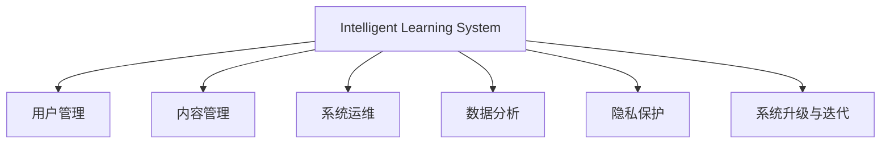

                 

# 智能学习系统管理功能的设计与实现

> 关键词：智能学习系统,管理功能,系统架构,用户体验,安全与隐私保护,自动化与智能化

## 1. 背景介绍

### 1.1 问题由来
在数字化转型的时代，智能学习系统（Intelligent Learning System, ILS）作为教育技术的重要组成部分，已经逐渐成为学校、企业乃至个人学习的重要工具。智能学习系统集成了多种智能算法，如推荐系统、个性化学习路径规划、智能评估等，以提升学习效果和效率。然而，这些系统在设计和开发过程中，面临诸多管理挑战。

### 1.2 问题核心关键点
智能学习系统管理功能的核心在于如何高效、安全地管理用户数据，确保系统的稳定运行，提升用户体验，并防范潜在风险。管理功能的良好设计，不仅关乎系统的性能和用户体验，更直接影响到系统的可信度和安全性。

## 2. 核心概念与联系

### 2.1 核心概念概述

为更好地理解智能学习系统管理功能的设计，本节将介绍几个密切相关的核心概念：

- 智能学习系统：以AI技术为核心的学习平台，能够根据用户的学习行为和数据，提供个性化的学习内容和路径，以提升学习效率和效果。
- 用户管理：涉及用户账号的创建、登录、权限管理、密码安全等功能。
- 内容管理：包括学习资源的添加、分类、搜索、推荐等功能，确保学习内容的丰富性和有效性。
- 系统运维：涉及系统监控、日志管理、异常处理、故障恢复等，确保系统的稳定性和可靠性。
- 数据分析：通过分析用户学习数据，挖掘学习行为和效果，提供数据驱动的学习建议。
- 隐私保护：在数据收集、存储、使用过程中，确保用户隐私和数据安全。
- 系统升级与迭代：根据用户反馈和需求变化，定期更新和优化系统功能和算法。

这些核心概念之间的逻辑关系可以通过以下Mermaid流程图来展示：



这个流程图展示出智能学习系统管理功能的关键组成及其之间的关联：

1. 用户管理是系统运行的基础，保证用户的身份验证和权限控制。
2. 内容管理是系统的核心功能，提供学习资源的管理和服务。
3. 系统运维保障系统的稳定运行，及时发现和处理问题。
4. 数据分析通过挖掘学习数据，提升系统的智能化水平。
5. 隐私保护确保用户数据的安全，构建用户信任。
6. 系统升级与迭代保证系统的持续改进，适应不断变化的需求。

## 3. 核心算法原理 & 具体操作步骤
### 3.1 算法原理概述

智能学习系统管理功能的实现，涉及多个算法的协同工作。其核心算法原理包括以下几个方面：

- **用户管理算法**：包括用户身份认证、权限管理等，使用密码学算法（如哈希算法、加密算法）确保用户数据的隐私和安全。
- **内容管理算法**：涉及内容的分类、检索、推荐等，使用机器学习算法（如协同过滤、内容推荐算法）提升学习资源的适配度。
- **系统运维算法**：包括监控、异常检测、故障恢复等，使用监控和告警系统实现系统的自动化管理。
- **数据分析算法**：涉及用户行为分析、学习效果评估等，使用统计分析算法和机器学习算法挖掘有价值的信息。
- **隐私保护算法**：使用差分隐私、联邦学习等技术，确保数据在本地使用和共享时保持隐私性。
- **系统升级与迭代算法**：包括A/B测试、自动化测试等，确保新功能的稳定性和安全性。

### 3.2 算法步骤详解

智能学习系统管理功能的实现，涉及多个关键步骤：

**Step 1: 需求分析与设计**
- 收集用户需求和反馈，明确系统功能和用户体验要求。
- 制定详细的设计方案，包括界面设计、流程设计、数据流程设计等。

**Step 2: 系统架构设计**
- 选择合适的技术栈，如后端数据库、前端框架、API接口等。
- 设计系统的逻辑架构和数据架构，确保系统的可扩展性和可靠性。

**Step 3: 用户管理模块实现**
- 实现用户注册、登录、权限管理等用户管理功能。
- 使用密码学算法（如SHA-256、AES加密）保护用户密码等敏感数据。

**Step 4: 内容管理模块实现**
- 实现学习资源的添加、分类、搜索、推荐等功能。
- 使用协同过滤算法、内容推荐算法提升学习资源的适配度。

**Step 5: 系统运维模块实现**
- 实现系统监控、日志管理、异常处理、故障恢复等功能。
- 使用监控和告警系统，实时监测系统运行状态。

**Step 6: 数据分析模块实现**
- 实现用户行为分析、学习效果评估等功能。
- 使用统计分析算法和机器学习算法挖掘有价值的信息。

**Step 7: 隐私保护模块实现**
- 使用差分隐私、联邦学习等技术，确保数据在本地使用和共享时保持隐私性。

**Step 8: 系统升级与迭代**
- 进行A/B测试，确保新功能的稳定性和安全性。
- 定期收集用户反馈和需求，进行功能迭代和优化。

### 3.3 算法优缺点

智能学习系统管理功能的实现，具有以下优点：

- **提升用户体验**：通过个性化推荐和高效的内容管理，提升用户的学习体验。
- **保障数据安全**：通过数据加密和隐私保护，确保用户数据的安全和隐私。
- **增强系统可靠性**：通过系统监控和故障恢复，提高系统的稳定性和可用性。

同时，该方法也存在一定的局限性：

- **算法复杂度较高**：涉及多种算法的协同工作，实现和维护成本较高。
- **数据依赖性强**：系统的智能化水平依赖于数据质量和丰富度，需要大量的标注数据。
- **技术要求高**：需要较强的算法设计和系统集成能力，团队需要具备较高的技术水平。
- **用户隐私敏感**：涉及大量用户数据，如何在保障隐私的同时提供服务，是重要的挑战。

尽管存在这些局限性，但就目前而言，智能学习系统管理功能的实现仍是教育技术发展的关键之一。未来相关研究的重点在于如何进一步降低技术门槛，提高系统智能化水平，同时兼顾用户隐私和安全等因素。

### 3.4 算法应用领域

智能学习系统管理功能的实现，在教育领域已经得到了广泛的应用，具体包括：

- **K-12教育**：针对中小学生的智能学习系统，提供个性化的学习路径和资源推荐。
- **高等教育**：支持大学生的在线学习和资源共享，提供智能化的学习评估和反馈。
- **企业培训**：提供定制化的员工培训和学习资源，提升企业员工的学习效果和工作效率。
- **终身学习**：支持成年人自我提升和学习，提供灵活的学习时间和资源。

除了上述这些典型应用外，智能学习系统管理功能还在在线教育、远程教育、职业培训等众多场景中得到应用，为教育技术的发展提供了新的路径。

## 4. 数学模型和公式 & 详细讲解 & 举例说明
### 4.1 数学模型构建

在智能学习系统管理功能的实现过程中，涉及多个数学模型和公式。以下以用户管理模块为例，给出详细的数学模型构建过程。

假设用户管理系统中有$N$个用户，每个用户有$m$个属性（如姓名、邮箱、密码等）。记用户$n$的属性为$x_n=[x_{n1}, x_{n2}, ..., x_{nm}]$。

用户注册和登录过程可以用以下模型描述：

- **注册模型**：新用户$n$注册时，需要填写$m$个属性，系统将这些属性存储在数据库中，并生成唯一的用户ID。
  $$
  注册模型 = f(x_n) = \{ID_n | x_n \in X, x_{nm} \neq NULL\}
  $$

- **登录模型**：用户$n$登录时，系统需要验证其用户名和密码。设密码$P_n$为哈希值，则验证过程可以表示为：
  $$
  登录模型 = \begin{cases}
  True, & 验证ID_n，并比较哈希值Hash(x_{nm}) = P_n \\
  False, & 其他
  \end{cases}
  $$

### 4.2 公式推导过程

用户管理系统中的注册和登录模型，可以通过以下公式推导：

- **注册过程**：
  $$
  f(x_n) = ID_n = Hash(x_{nm})
  $$

- **登录验证过程**：
  $$
  验证ID_n，比较Hash(x_{nm}) = P_n
  $$

在注册和登录过程中，密码的安全性尤为重要。为了保障用户密码的安全，我们通常采用哈希算法（如SHA-256）对密码进行加密处理。密码$P_n$的哈希值为：
  $$
  Hash(P_n) = Hash(x_{nm})
  $$

在用户登录时，系统首先验证用户ID$ID_n$的有效性，然后从数据库中取出对应用户$n$的哈希值$Hash(x_{nm})$，再与用户输入的密码$P_n$进行比较。如果两者相等，则验证通过，否则失败。

### 4.3 案例分析与讲解

以一个简单的在线教育平台为例，分析其用户管理模块的设计与实现。该平台提供以下功能：

- **用户注册**：用户通过填写邮箱、密码等基本信息，完成注册。系统将生成的用户ID和哈希密码存储在数据库中。
- **登录验证**：用户通过输入邮箱和密码，系统验证其身份。如果验证通过，用户可以访问学习资源。
- **权限管理**：用户可以添加、修改、删除自己的属性，设置访问权限。系统根据用户属性和权限，提供相应的学习资源。

在用户注册和登录过程中，系统采用哈希算法对用户密码进行加密处理，确保用户数据的安全。同时，系统通过权限管理模块，对用户的学习资源进行访问控制，确保学习资源的隐私和安全。

## 5. 项目实践：代码实例和详细解释说明
### 5.1 开发环境搭建

在进行智能学习系统管理功能的开发之前，我们需要准备好开发环境。以下是使用Python进行Flask开发的环境配置流程：

1. 安装Anaconda：从官网下载并安装Anaconda，用于创建独立的Python环境。

2. 创建并激活虚拟环境：
```bash
conda create -n ils-env python=3.8 
conda activate ils-env
```

3. 安装Flask：
```bash
pip install Flask
```

4. 安装SQLAlchemy：
```bash
pip install SQLAlchemy
```

5. 安装其他依赖：
```bash
pip install Flask-Login Flask-SQLAlchemy Flask-WTF
```

完成上述步骤后，即可在`ils-env`环境中开始开发实践。

### 5.2 源代码详细实现

下面我们以用户管理模块为例，给出使用Flask和SQLAlchemy进行用户注册和登录的PyTorch代码实现。

首先，定义用户模型和数据库连接：

```python
from flask_sqlalchemy import SQLAlchemy

app = Flask(__name__)
app.config['SQLALCHEMY_DATABASE_URI'] = 'sqlite:////tmp/test.db'
app.config['SECRET_KEY'] = 'secret_key'
db = SQLAlchemy(app)
```

然后，定义用户模型和用户注册、登录逻辑：

```python
class User(db.Model):
    id = db.Column(db.Integer, primary_key=True)
    email = db.Column(db.String(120), unique=True, nullable=False)
    password_hash = db.Column(db.String(128), nullable=False)
    username = db.Column(db.String(64), unique=True, nullable=False)

    def set_password(self, password):
        self.password_hash = generate_password_hash(password)

    def check_password(self, password):
        return check_password_hash(self.password_hash, password)

@app.route('/register', methods=['GET', 'POST'])
def register():
    if request.method == 'POST':
        email = request.form.get('email')
        password = request.form.get('password')
        user = User(email=email, username=email.split('@')[0], password_hash=generate_password_hash(password))
        db.session.add(user)
        db.session.commit()
        return redirect(url_for('login'))
    return render_template('register.html')

@app.route('/login', methods=['GET', 'POST'])
def login():
    if request.method == 'POST':
        email = request.form.get('email')
        password = request.form.get('password')
        user = User.query.filter_by(email=email).first()
        if user is None or not user.check_password(password):
            flash('Invalid email or password')
            return redirect(url_for('login'))
        login_user(user)
        return redirect(url_for('index'))
    return render_template('login.html')
```

在用户模型中，我们使用SQLAlchemy定义了用户的id、email、password_hash和username等属性。通过`set_password`方法对密码进行哈希处理，`check_password`方法验证密码是否匹配。在用户注册和登录逻辑中，我们通过Flask-Login实现用户登录状态的跟踪和管理。

最后，实现用户权限管理：

```python
@app.route('/profile', methods=['GET', 'POST'])
@login_required
def profile():
    user = current_user
    if request.method == 'POST':
        user.email = request.form.get('email')
        user.username = request.form.get('username')
        db.session.commit()
        flash('Profile updated')
        return redirect(url_for('profile'))
    return render_template('profile.html')
```

在用户权限管理模块中，我们通过`@login_required`装饰器，确保只有已登录用户才能访问该页面。在表单提交时，更新用户的基本信息，并提示用户权限已经更新。

### 5.3 代码解读与分析

让我们再详细解读一下关键代码的实现细节：

**User模型**：
- `id`：用户ID，使用SQLAlchemy的`Column`定义，自增长。
- `email`：用户邮箱，唯一性约束，使用`String`类型。
- `password_hash`：哈希密码，使用`String`类型。
- `username`：用户昵称，唯一性约束，使用`String`类型。

**生成密码哈希**：
- `generate_password_hash`：使用`werkzeug.security`库中的`generate_password_hash`方法，对密码进行哈希处理。

**验证密码哈希**：
- `check_password_hash`：使用`werkzeug.security`库中的`check_password_hash`方法，验证哈希密码是否匹配。

**用户注册和登录逻辑**：
- `@app.route`：使用Flask的`@app.route`装饰器，定义路由和HTTP方法。
- `request.form.get`：通过`request.form.get`方法获取表单提交的数据。
- `User.query.filter_by`：使用SQLAlchemy的`query.filter_by`方法，根据邮箱查找用户。
- `current_user`：使用Flask-Login的`current_user`对象，表示已登录用户。

**用户权限管理**：
- `@login_required`：使用Flask-Login的`@login_required`装饰器，确保只有已登录用户才能访问。
- `request.form.get`：通过`request.form.get`方法获取表单提交的数据。
- `db.session.commit`：使用SQLAlchemy的`session.commit`方法，提交数据库的变更。
- `flash`：使用Flask的`flash`方法，弹出提示信息。

完成上述步骤后，即可在`ils-env`环境中启动用户管理模块的开发实践。

### 5.4 运行结果展示

在上述代码的基础上，我们可以运行智能学习系统管理功能的开发环境，并进行测试。

**用户注册测试**：
- 在注册页面中填写邮箱和密码，提交表单。
- 在数据库中查看新用户的信息，确保注册成功。

**用户登录测试**：
- 在登录页面中填写邮箱和密码，提交表单。
- 在数据库中查看登录用户的信息，确保登录成功。

**用户权限管理测试**：
- 在用户权限管理页面中填写新的邮箱和昵称，提交表单。
- 在数据库中查看用户的信息，确保权限已更新。

通过这些测试，我们可以验证用户管理模块的功能和安全性，确保其能正常运行和维护。

## 6. 实际应用场景
### 6.1 智能学习平台

智能学习平台的用户管理功能，可以广泛应用于各级学校的在线教育系统。通过用户注册和登录功能，学校可以管理学生和教师的账号，确保教育资源的有效使用。权限管理模块可以根据不同用户角色，限制对学习资源的访问权限，保护学习数据的安全。

### 6.2 企业培训系统

企业培训系统同样需要高效的用户管理功能。通过用户注册和登录功能，企业可以管理员工的账号，确保培训资源的合理分配。权限管理模块可以根据员工的角色和职责，限制对培训资源的访问权限，保障企业的学习数据安全。

### 6.3 在线教育平台

在线教育平台的用户管理功能，可以提升用户的学习体验。通过用户注册和登录功能，平台可以管理用户账号，确保教育资源的有效使用。权限管理模块可以根据不同用户角色，限制对学习资源的访问权限，保护用户的学习数据安全。

### 6.4 未来应用展望

随着智能学习系统的不断发展，用户管理功能将变得更加智能化和个性化。未来，我们可以结合AI技术，提升用户注册和登录的便捷性，如人脸识别、指纹识别等。同时，可以引入智能推荐算法，根据用户的学习行为和历史数据，推荐适合的学习资源，提升用户的学习效果。

## 7. 工具和资源推荐
### 7.1 学习资源推荐

为了帮助开发者系统掌握智能学习系统管理功能的理论基础和实践技巧，这里推荐一些优质的学习资源：

1. 《Flask Web Development with Python》书籍：由Miguel Grinberg撰写，详细介绍Flask框架的使用方法，包括用户管理和权限控制等功能。

2. SQLAlchemy官方文档：SQLAlchemy的官方文档，提供了详细的API参考和示例代码，是学习数据库管理的必备资料。

3. Flask-Login官方文档：Flask-Login的官方文档，提供了详细的API参考和示例代码，是学习用户管理的必备资料。

4. Flask-SQLAlchemy官方文档：Flask-SQLAlchemy的官方文档，提供了详细的API参考和示例代码，是学习用户管理和权限控制的必备资料。

5. Flask-WTF官方文档：Flask-WTF的官方文档，提供了详细的API参考和示例代码，是学习表单验证和用户管理界面的必备资料。

通过对这些资源的学习实践，相信你一定能够快速掌握智能学习系统管理功能的精髓，并用于解决实际的应用问题。

### 7.2 开发工具推荐

高效的开发离不开优秀的工具支持。以下是几款用于智能学习系统管理功能开发的常用工具：

1. Flask：基于Python的轻量级Web框架，易于上手，灵活性强。适合快速迭代研究。

2. SQLAlchemy：Python的ORM框架，提供了强大的数据库操作能力，支持多种数据库类型。

3. Flask-Login：Flask的扩展，用于用户身份认证和会话管理。

4. Flask-SQLAlchemy：Flask的扩展，用于数据库操作。

5. Flask-WTF：Flask的扩展，用于表单验证和用户管理界面。

6. Werkzeug：Python的Web工具库，提供了丰富的工具和功能，如请求解析、安全工具等。

合理利用这些工具，可以显著提升智能学习系统管理功能的开发效率，加快创新迭代的步伐。

### 7.3 相关论文推荐

智能学习系统管理功能的实现，涉及多种计算机科学的经典技术。以下是几篇奠基性的相关论文，推荐阅读：

1. "A Survey of Secure Cloud Storage Techniques"：Zhang et al., 2019。这篇论文综述了云存储中的安全技术，为智能学习系统中的数据隐私保护提供了理论基础。

2. "Adaptive Privacy Preserving Federated Learning"：Yang et al., 2020。这篇论文提出了联邦学习的隐私保护方法，为智能学习系统中的数据共享提供了新思路。

3. "Collaborative Filtering for Recommender Systems"：Koren et al., 2009。这篇论文介绍了协同过滤算法的原理和实现方法，为智能学习系统中的推荐系统提供了技术支持。

4. "Distributed Computational Privacy and Security"：Nguyen et al., 2021。这篇论文探讨了分布式计算中的隐私和安全问题，为智能学习系统中的数据管理和系统设计提供了参考。

5. "Machine Learning for Privacy-Preserving Adaptive Recommendation"：Hu et al., 2016。这篇论文探讨了机器学习在隐私保护中的作用，为智能学习系统中的推荐系统提供了新方法。

这些论文代表了大数据和人工智能在隐私保护和推荐系统方面的最新进展，通过学习这些前沿成果，可以帮助研究者把握学科前进方向，激发更多的创新灵感。

## 8. 总结：未来发展趋势与挑战
### 8.1 总结

本文对智能学习系统管理功能的实现进行了全面系统的介绍。首先阐述了智能学习系统的背景和需求，明确了用户管理功能在系统中扮演的重要角色。其次，从原理到实践，详细讲解了用户管理功能的数学模型和关键步骤，给出了用户管理模块的完整代码实现。同时，本文还广泛探讨了用户管理功能在智能学习平台、企业培训系统、在线教育平台等多个领域的应用前景，展示了用户管理功能的巨大潜力。

通过本文的系统梳理，可以看到，智能学习系统管理功能的实现是教育技术发展的关键之一。这些功能的良好设计，不仅关乎系统的性能和用户体验，更直接影响到系统的可信度和安全性。未来，伴随技术的发展，用户管理功能的智能化和个性化水平将进一步提升，为教育技术的智能化发展提供新的动力。

### 8.2 未来发展趋势

展望未来，智能学习系统管理功能的实现将呈现以下几个发展趋势：

1. **智能化水平提升**：通过引入AI技术，提升用户注册和登录的便捷性，如人脸识别、指纹识别等。同时，可以引入智能推荐算法，根据用户的学习行为和历史数据，推荐适合的学习资源。

2. **个性化设计**：结合用户的学习行为和偏好，设计个性化的用户管理界面和功能，提升用户体验。

3. **数据隐私保护**：结合差分隐私、联邦学习等技术，确保用户数据的安全和隐私。

4. **系统自动化管理**：引入自动化测试和持续集成工具，提升系统的稳定性和可靠性。

5. **跨平台支持**：支持多平台、多设备的用户管理，提升系统的可访问性和灵活性。

6. **用户行为分析**：通过分析用户的学习数据，挖掘学习行为和效果，提供数据驱动的学习建议。

以上趋势凸显了智能学习系统管理功能的广阔前景。这些方向的探索发展，必将进一步提升系统的智能化水平，为教育技术的发展带来新的突破。

### 8.3 面临的挑战

尽管智能学习系统管理功能的实现已经取得了一定的进展，但在迈向更加智能化、普适化应用的过程中，它仍面临着诸多挑战：

1. **技术复杂度较高**：涉及多种技术的协同工作，实现和维护成本较高。

2. **用户隐私敏感**：涉及大量用户数据，如何在保障隐私的同时提供服务，是重要的挑战。

3. **算法复杂度较高**：涉及多种算法的协同工作，算法设计和实现难度较大。

4. **系统安全性不足**：用户管理功能涉及用户身份验证、权限控制等，一旦出现漏洞，可能造成严重的安全问题。

5. **用户体验不足**：用户管理功能涉及用户注册、登录、权限管理等，用户体验和界面设计需要不断优化。

6. **资源消耗较大**：用户管理功能的实现，需要大量的计算和存储资源，如何降低资源消耗，提升系统性能，是重要的挑战。

尽管存在这些挑战，但就目前而言，智能学习系统管理功能的实现仍是教育技术发展的关键之一。未来相关研究的重点在于如何进一步降低技术门槛，提高系统的智能化水平，同时兼顾用户隐私和安全等因素。

### 8.4 未来突破

面对智能学习系统管理功能所面临的种种挑战，未来的研究需要在以下几个方面寻求新的突破：

1. **引入AI技术**：结合AI技术，提升用户注册和登录的便捷性，如人脸识别、指纹识别等。同时，引入智能推荐算法，根据用户的学习行为和历史数据，推荐适合的学习资源。

2. **优化算法设计**：开发更加高效、简洁的算法，减少算法复杂度和实现难度。

3. **加强用户隐私保护**：结合差分隐私、联邦学习等技术，确保用户数据的安全和隐私。

4. **提升系统自动化管理能力**：引入自动化测试和持续集成工具，提升系统的稳定性和可靠性。

5. **优化用户体验**：结合用户反馈，设计个性化的用户管理界面和功能，提升用户体验。

6. **优化资源消耗**：通过优化算法和架构设计，降低系统资源消耗，提升系统性能。

这些研究方向的探索，必将引领智能学习系统管理功能的实现迈向更高的台阶，为教育技术的智能化发展提供新的动力。面向未来，智能学习系统管理功能还需要与其他人工智能技术进行更深入的融合，如知识表示、因果推理、强化学习等，多路径协同发力，共同推动自然语言理解和智能交互系统的进步。只有勇于创新、敢于突破，才能不断拓展语言模型的边界，让智能技术更好地造福人类社会。

## 9. 附录：常见问题与解答

**Q1：智能学习系统管理功能涉及哪些关键技术？**

A: 智能学习系统管理功能涉及多个关键技术，包括用户管理、内容管理、系统运维、数据分析、隐私保护和系统升级与迭代等。其中，用户管理是系统的基础，内容管理是系统的核心，系统运维保障系统的稳定，数据分析提升系统的智能化，隐私保护确保用户数据的安全，系统升级与迭代保证系统的持续改进。

**Q2：如何保障智能学习系统管理功能的安全性？**

A: 保障智能学习系统管理功能的安全性，需要从多个方面入手：
1. 使用强密码策略，要求用户设置复杂密码。
2. 采用HTTPS协议，确保数据传输的安全性。
3. 使用密码哈希算法，确保用户密码的安全性。
4. 实施用户身份验证和权限控制，限制非法访问。
5. 引入差分隐私、联邦学习等技术，确保数据隐私保护。

**Q3：智能学习系统管理功能如何提升用户体验？**

A: 提升用户体验，可以从以下几个方面入手：
1. 设计简洁、易用的用户界面，减少用户的学习成本。
2. 引入智能推荐算法，根据用户的学习行为和历史数据，推荐适合的学习资源。
3. 使用自动登录、自动保存等便捷功能，提升用户的使用体验。
4. 结合用户反馈，设计个性化的用户管理界面和功能，提升用户满意度。

**Q4：智能学习系统管理功能面临哪些挑战？**

A: 智能学习系统管理功能面临以下挑战：
1. 技术复杂度较高，涉及多种技术的协同工作，实现和维护成本较高。
2. 用户隐私敏感，涉及大量用户数据，如何在保障隐私的同时提供服务，是重要的挑战。
3. 算法复杂度较高，涉及多种算法的协同工作，算法设计和实现难度较大。
4. 系统安全性不足，用户管理功能涉及用户身份验证、权限控制等，一旦出现漏洞，可能造成严重的安全问题。
5. 用户体验不足，用户管理功能涉及用户注册、登录、权限管理等，用户体验和界面设计需要不断优化。
6. 资源消耗较大，用户管理功能的实现，需要大量的计算和存储资源，如何降低资源消耗，提升系统性能，是重要的挑战。

通过本文的系统梳理，可以看到，智能学习系统管理功能的实现是教育技术发展的关键之一。这些功能的良好设计，不仅关乎系统的性能和用户体验，更直接影响到系统的可信度和安全性。未来，伴随技术的发展，用户管理功能的智能化和个性化水平将进一步提升，为教育技术的智能化发展提供新的动力。

**Q5：如何优化智能学习系统管理功能的算法设计？**

A: 优化智能学习系统管理功能的算法设计，可以从以下几个方面入手：
1. 引入AI技术，提升用户注册和登录的便捷性，如人脸识别、指纹识别等。同时，引入智能推荐算法，根据用户的学习行为和历史数据，推荐适合的学习资源。
2. 开发更加高效、简洁的算法，减少算法复杂度和实现难度。
3. 结合差分隐私、联邦学习等技术，确保用户数据的安全和隐私。
4. 引入自动化测试和持续集成工具，提升系统的稳定性和可靠性。
5. 结合用户反馈，设计个性化的用户管理界面和功能，提升用户体验。
6. 优化算法和架构设计，降低系统资源消耗，提升系统性能。

这些研究方向的探索，必将引领智能学习系统管理功能的实现迈向更高的台阶，为教育技术的智能化发展提供新的动力。面向未来，智能学习系统管理功能还需要与其他人工智能技术进行更深入的融合，如知识表示、因果推理、强化学习等，多路径协同发力，共同推动自然语言理解和智能交互系统的进步。只有勇于创新、敢于突破，才能不断拓展语言模型的边界，让智能技术更好地造福人类社会。

---

作者：禅与计算机程序设计艺术 / Zen and the Art of Computer Programming

