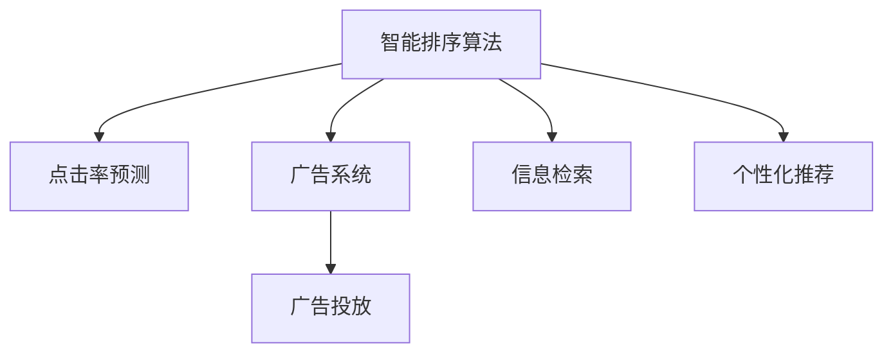

                 

# 智能排序算法在电商搜索中的应用：原理与实践

> 关键词：智能排序算法, 电商搜索, 排名算法, 信息检索, 点击率, 广告系统, 广告投放, 用户行为分析

## 1. 背景介绍

随着互联网和电子商务的飞速发展，用户对电商平台的搜索和浏览体验提出了更高的要求。电商搜索系统需要高效准确地返回符合用户需求的商品列表，提高用户满意度，提升销售转化率。传统的基于关键词匹配的搜索算法已经无法满足日益复杂多变的用户需求，智能排序算法应运而生，通过深度学习等先进技术，提升了电商搜索系统的智能化水平。

### 1.1 问题由来

电商搜索系统面临的主要挑战包括：

1. **用户需求多样性**：用户搜索意图复杂，同一搜索词可能对应多种需求，如查询具体商品、浏览相关产品等。
2. **商品语义复杂性**：不同商品名称、描述各具特点，且存在大量同义词、近义词，难以进行精确匹配。
3. **点击率提升**：提升商品点击率，增加用户互动，是电商搜索系统追求的重要目标。
4. **广告投放效率**：精准投放广告，提高广告点击率，是电商平台的重要盈利模式。

针对这些挑战，智能排序算法通过用户行为分析、商品特征提取、广告点击率预测等技术，帮助电商搜索系统更好地匹配用户需求和商品特征，实现高效、精准的搜索结果排序。

### 1.2 问题核心关键点

智能排序算法的核心关键点在于：

1. **个性化排序**：根据用户行为数据和商品特征，动态调整排序结果，提供个性化的搜索结果。
2. **点击率预测**：通过学习用户行为和商品特征，预测点击率，优化广告投放策略。
3. **广告投放优化**：结合用户行为和点击率预测结果，实现精准投放广告，提升广告点击率。
4. **用户行为分析**：分析用户搜索、点击、购买行为，深入理解用户需求和偏好。
5. **商品特征提取**：提取商品属性、销量、评价等特征，提升商品匹配准确性。

这些核心关键点共同构成了智能排序算法的研究基础，帮助电商搜索系统提升用户体验和平台收益。

## 2. 核心概念与联系

### 2.1 核心概念概述

为更好地理解智能排序算法的原理和应用，本节将介绍几个密切相关的核心概念：

- **智能排序算法**：通过用户行为分析和商品特征提取，动态调整搜索结果排序，提高用户满意度和平台收益的算法。
- **点击率预测**：利用用户行为和商品特征，预测用户对搜索结果的点击行为，优化广告投放策略的算法。
- **广告系统**：包括广告投放、广告展示、广告点击等环节，实现广告精准投放，提升广告点击率的系统。
- **信息检索**：通过文本检索、分类检索、匹配检索等技术，快速定位用户需求对应的商品信息的检索方法。
- **个性化推荐**：根据用户历史行为和偏好，推荐符合用户需求的商品或服务的算法。

这些核心概念之间的逻辑关系可以通过以下Mermaid流程图来展示：



这个流程图展示出智能排序算法与点击率预测、广告系统、信息检索和个性化推荐等核心概念之间的联系，共同构成了电商搜索系统实现精准搜索结果排序的完整框架。

## 3. 核心算法原理 & 具体操作步骤
### 3.1 算法原理概述

智能排序算法基于机器学习的方法，通过对用户行为和商品特征的学习，动态调整搜索结果排序，提升用户体验和平台收益。其核心思想是：根据用户的历史行为、浏览记录、点击数据等，预测用户对不同商品或广告的点击行为，从而调整排序策略，优化搜索结果的展示。

智能排序算法通常包括如下几个步骤：

1. **数据预处理**：收集用户行为数据和商品特征，构建训练集和验证集。
2. **特征工程**：提取用户行为、商品属性、广告特征等关键特征。
3. **模型训练**：选择适当的算法（如逻辑回归、决策树、随机森林、深度学习等），训练点击率预测模型。
4. **模型评估**：在验证集上评估模型的预测性能，选择合适的超参数。
5. **应用部署**：将训练好的模型部署到电商搜索系统中，实时调整搜索结果排序。

### 3.2 算法步骤详解

以下我们详细介绍智能排序算法的各个步骤：

**Step 1: 数据预处理**

数据预处理是智能排序算法的第一步，主要包括：

1. **数据收集**：从电商平台收集用户行为数据、商品信息、广告数据等。用户行为数据包括搜索记录、点击记录、浏览记录、购买记录等。商品信息包括商品名称、描述、价格、评分、销量等。广告数据包括广告位置、广告内容、广告点击率等。

2. **数据清洗**：处理缺失值、异常值等，确保数据质量。例如，可以使用数据插补、异常值检测等方法。

3. **数据标注**：为训练数据添加标注信息，如点击行为、购买行为、广告点击率等。可以使用人工标注或自动标注方法。

4. **数据划分**：将数据集划分为训练集、验证集和测试集。一般将大部分数据用于训练集，部分数据用于验证集和测试集。

**Step 2: 特征工程**

特征工程是智能排序算法的关键步骤，主要包括：

1. **特征提取**：从用户行为数据、商品信息、广告数据中提取关键特征。例如，可以从用户点击记录中提取点击时间、点击位置、点击次数等特征；从商品信息中提取商品名称、描述、价格、评分、销量等特征；从广告数据中提取广告位置、广告内容、广告点击率等特征。

2. **特征选择**：选择对预测结果影响最大的特征。可以使用特征重要性排序、特征相关性分析等方法。

3. **特征归一化**：将不同尺度的特征归一化到相同的范围内。例如，可以使用最大最小归一化、Z-score归一化等方法。

4. **特征组合**：将不同特征组合成新的特征。例如，可以将商品名称和描述组合成商品摘要特征。

5. **特征工程评估**：在验证集上评估特征工程的效果，选择最优的特征组合。

**Step 3: 模型训练**

模型训练是智能排序算法的核心步骤，主要包括：

1. **选择算法**：选择适当的算法进行训练。例如，可以使用逻辑回归、决策树、随机森林、支持向量机、深度学习等算法。

2. **训练模型**：使用训练集数据，训练点击率预测模型。例如，可以使用TensorFlow、PyTorch等深度学习框架进行训练。

3. **超参数调优**：选择适当的超参数，进行模型调优。例如，可以调整学习率、正则化系数、批次大小等超参数。

4. **模型评估**：在验证集上评估模型的预测性能，选择最优的模型。例如，可以使用交叉验证、ROC曲线、AUC值等指标进行评估。

5. **模型保存**：将训练好的模型保存，用于后续的部署和预测。

**Step 4: 模型评估**

模型评估是智能排序算法的关键步骤，主要包括：

1. **数据准备**：准备测试集数据。例如，可以从电商平台收集测试集数据，进行预处理和标注。

2. **模型部署**：将训练好的模型部署到电商搜索系统中，进行实时预测。

3. **结果评估**：在测试集上评估模型的预测性能。例如，可以使用精确率、召回率、F1值等指标进行评估。

4. **优化调整**：根据评估结果，优化模型和排序策略。例如，可以调整特征组合、算法选择、超参数等。

**Step 5: 应用部署**

应用部署是智能排序算法的最终步骤，主要包括：

1. **数据实时获取**：实时获取用户行为数据、商品信息、广告数据等。例如，可以从电商平台实时获取用户搜索记录、点击记录、浏览记录等。

2. **数据预处理**：对实时数据进行预处理，例如，可以清洗缺失值、异常值等。

3. **特征提取**：从实时数据中提取关键特征，例如，可以提取用户点击记录、商品信息、广告数据等特征。

4. **模型预测**：使用训练好的模型进行预测。例如，可以使用TensorFlow、PyTorch等深度学习框架进行预测。

5. **结果排序**：根据预测结果，动态调整搜索结果排序。例如，可以按照点击率从高到低排序商品列表。

6. **结果展示**：将排序后的商品列表展示给用户。例如，可以在电商平台上展示商品列表、广告等。

### 3.3 算法优缺点

智能排序算法具有以下优点：

1. **个性化推荐**：根据用户行为和商品特征，动态调整搜索结果排序，提供个性化的搜索结果。

2. **点击率提升**：通过预测用户点击行为，优化广告投放策略，提升广告点击率。

3. **实时性**：可以实时获取数据，动态调整排序策略，提高用户体验。

4. **自动化**：使用机器学习算法进行自动化的特征工程和模型训练，减少人工干预。

5. **可扩展性**：可以扩展到多种类型的电商搜索系统，如B2B、B2C、C2C等。

同时，智能排序算法也存在以下缺点：

1. **数据依赖**：依赖高质量的数据，数据量不足或数据质量不高可能导致模型效果不佳。

2. **模型复杂**：模型训练需要大量的计算资源和时间，可能面临计算瓶颈。

3. **特征工程**：需要设计合理的特征组合和特征工程策略，可能需要进行多次迭代优化。

4. **解释性**：模型黑盒特性可能导致解释性不足，难以理解模型决策过程。

5. **数据隐私**：用户行为数据涉及隐私保护，需要采取适当的数据保护措施。

尽管存在这些缺点，但智能排序算法在电商搜索系统中已经取得了显著的效果，成为提升用户体验和平台收益的重要手段。

### 3.4 算法应用领域

智能排序算法在电商搜索系统中得到广泛应用，主要包括以下几个方面：

1. **商品搜索排序**：根据用户搜索词，动态调整商品排序，提供个性化的搜索结果。例如，可以在搜索结果中优先展示相关度高的商品。

2. **广告投放优化**：根据用户点击行为，优化广告投放策略，提升广告点击率。例如，可以优先展示用户感兴趣的广告。

3. **推荐系统优化**：根据用户历史行为和点击记录，优化推荐系统，提供个性化的商品推荐。例如，可以推荐用户感兴趣的商品或服务。

4. **商品匹配优化**：根据用户搜索词和商品特征，优化商品匹配算法，提高商品匹配准确性。例如，可以使用匹配检索算法匹配相关商品。

5. **用户行为分析**：分析用户搜索、点击、购买行为，深入理解用户需求和偏好。例如，可以使用聚类分析、关联规则挖掘等方法。

这些应用场景展示了智能排序算法的强大功能和广泛应用，为电商搜索系统提供了全面的解决方案。

## 4. 数学模型和公式 & 详细讲解 & 举例说明

### 4.1 数学模型构建

智能排序算法通常使用点击率预测模型，其数学模型为：

$$
\hat{y} = f(x)
$$

其中，$x$ 为特征向量，$\hat{y}$ 为预测点击率，$f(x)$ 为模型函数。模型函数可以采用多种算法，如逻辑回归、决策树、随机森林、深度学习等。

### 4.2 公式推导过程

以逻辑回归为例，点击率预测模型的公式为：

$$
\hat{y} = \sigma(W \cdot x + b)
$$

其中，$W$ 为权重矩阵，$b$ 为偏置项，$\sigma$ 为sigmoid函数。

逻辑回归模型的损失函数为：

$$
\mathcal{L}(W,b) = -\frac{1}{N}\sum_{i=1}^N[y_i\log \hat{y_i} + (1-y_i)\log (1-\hat{y_i})]
$$

其中，$N$ 为样本数，$y_i$ 为真实点击率，$\hat{y_i}$ 为预测点击率。

模型训练的目标是最小化损失函数，即：

$$
\min_{W,b} \mathcal{L}(W,b)
$$

通过梯度下降等优化算法，最小化损失函数，得到最优的权重矩阵和偏置项。

### 4.3 案例分析与讲解

假设有一个电商搜索系统，其商品列表包含3000个商品，每个商品有5个特征，包括价格、销量、评分、描述长度、广告点击率等。

用户输入搜索词“T恤”，系统需要动态调整商品排序。首先，系统提取用户点击记录、商品信息、广告数据等特征，构建特征向量$x$。然后，使用逻辑回归模型进行预测，得到每个商品的点击率$\hat{y}$。最后，根据点击率$\hat{y}$对商品进行排序，优先展示点击率高的商品。

以下是一个使用Python实现的示例代码：

```python
import pandas as pd
import numpy as np
from sklearn.linear_model import LogisticRegression

# 构建特征向量
data = pd.read_csv('data.csv')
X = data[['price', 'sales', 'rating', 'description_length', 'ad_click_rate']]
y = data['click_rate']

# 划分训练集和验证集
train_data = X.sample(frac=0.8, random_state=42)
train_y = y.iloc[train_data.index]
test_data = X.drop(train_data.index)
test_y = y.drop(train_data.index)

# 训练逻辑回归模型
model = LogisticRegression()
model.fit(train_data, train_y)

# 预测点击率
pred_y = model.predict_proba(test_data)[:, 1]

# 结果排序
sorted_items = test_data.merge(test_y, left_index=True, right_index=True)
sorted_items = sorted_items.sort_values(by='pred_y', ascending=False)

# 展示结果
for item in sorted_items:
    print(item['name'], item['pred_y'])
```

以上代码展示了智能排序算法的核心步骤，包括数据预处理、特征工程、模型训练和结果排序。通过逻辑回归模型，可以预测每个商品的点击率，并动态调整商品排序，提供个性化的搜索结果。

## 5. 项目实践：代码实例和详细解释说明

### 5.1 开发环境搭建

在进行智能排序算法实践前，我们需要准备好开发环境。以下是使用Python进行PyTorch开发的环境配置流程：

1. 安装Anaconda：从官网下载并安装Anaconda，用于创建独立的Python环境。

2. 创建并激活虚拟环境：
```bash
conda create -n pytorch-env python=3.8 
conda activate pytorch-env
```

3. 安装PyTorch：根据CUDA版本，从官网获取对应的安装命令。例如：
```bash
conda install pytorch torchvision torchaudio cudatoolkit=11.1 -c pytorch -c conda-forge
```

4. 安装相关库：
```bash
pip install pandas numpy scikit-learn torch torchvision torchtext
```

5. 安装TensorBoard：用于可视化模型训练过程。
```bash
pip install tensorboard
```

完成上述步骤后，即可在`pytorch-env`环境中开始智能排序算法的实践。

### 5.2 源代码详细实现

以下是一个基于TensorFlow实现的商品搜索排序的示例代码：

```python
import tensorflow as tf
import pandas as pd
from sklearn.model_selection import train_test_split
from sklearn.preprocessing import StandardScaler

# 构建特征向量
data = pd.read_csv('data.csv')
X = data[['price', 'sales', 'rating', 'description_length', 'ad_click_rate']]
y = data['click_rate']

# 划分训练集和验证集
X_train, X_test, y_train, y_test = train_test_split(X, y, test_size=0.2, random_state=42)

# 特征归一化
scaler = StandardScaler()
X_train = scaler.fit_transform(X_train)
X_test = scaler.transform(X_test)

# 构建模型
model = tf.keras.Sequential([
    tf.keras.layers.Dense(64, activation='relu'),
    tf.keras.layers.Dense(32, activation='relu'),
    tf.keras.layers.Dense(1, activation='sigmoid')
])

# 编译模型
model.compile(optimizer='adam', loss='binary_crossentropy', metrics=['accuracy'])

# 训练模型
model.fit(X_train, y_train, epochs=10, batch_size=32, validation_data=(X_test, y_test))

# 预测点击率
test_data = pd.read_csv('test_data.csv')
X_test = scaler.transform(test_data)
y_pred = model.predict(X_test)

# 结果排序
sorted_items = pd.DataFrame(test_data)
sorted_items['score'] = y_pred
sorted_items = sorted_items.sort_values(by='score', ascending=False)

# 展示结果
for item in sorted_items:
    print(item['name'], item['score'])
```

以上代码展示了使用TensorFlow实现商品搜索排序的核心步骤，包括数据预处理、特征归一化、模型构建、模型训练和结果排序。通过深度学习模型，可以预测每个商品的点击率，并动态调整商品排序，提供个性化的搜索结果。

### 5.3 代码解读与分析

让我们再详细解读一下关键代码的实现细节：

**data.csv数据准备**：
- 构建特征向量：读取数据集，提取价格、销量、评分、描述长度、广告点击率等特征。
- 划分训练集和验证集：使用train_test_split方法将数据集划分为训练集和验证集。

**特征归一化**：
- 使用StandardScaler对特征进行归一化，保证不同特征在同一尺度上。

**模型构建**：
- 使用Sequential模型构建多层感知器，包含3个全连接层。
- 第一个全连接层包含64个神经元，激活函数为ReLU。
- 第二个全连接层包含32个神经元，激活函数为ReLU。
- 第三个全连接层包含1个神经元，激活函数为Sigmoid。

**模型训练**：
- 使用adam优化器进行模型训练。
- 损失函数为binary_crossentropy，适用于二分类问题。
- 使用validation_data参数在验证集上进行评估。

**预测点击率**：
- 对测试集数据进行归一化。
- 使用predict方法预测点击率。

**结果排序**：
- 将预测结果添加到测试集数据框中。
- 使用sort_values方法根据预测结果排序。

可以看到，使用深度学习模型进行智能排序算法的开发，可以更加灵活地设计和优化模型结构，提升预测准确性和泛化能力。

当然，工业级的系统实现还需考虑更多因素，如模型的保存和部署、超参数的自动搜索、更灵活的任务适配层等。但核心的算法范式基本与此类似。

## 6. 实际应用场景
### 6.1 智能客服系统

智能客服系统通过智能排序算法，可以实现对用户查询意图的高效理解和匹配。当用户输入查询时，系统根据历史数据和用户行为，动态调整查询结果排序，提供最相关的商品或服务。

例如，用户输入“如何购买某产品”，系统可以根据用户历史购买记录、浏览记录、点击记录等，预测用户可能感兴趣的商品，动态调整排序结果，优先展示最相关的商品。

### 6.2 金融舆情监测

金融舆情监测系统通过智能排序算法，可以实现对新闻、评论等文本的自动分类和情感分析。系统根据文本内容，预测用户的情感倾向，动态调整排序结果，提供最相关的舆情信息。

例如，系统可以自动提取金融新闻，根据文本情感分类为正面、负面或中性，动态调整排序结果，优先展示用户感兴趣的新闻。

### 6.3 个性化推荐系统

个性化推荐系统通过智能排序算法，可以实现对用户历史行为和偏好的深度分析，提供个性化的商品推荐。系统根据用户行为数据，预测用户对不同商品的兴趣，动态调整推荐结果排序。

例如，系统可以根据用户历史浏览记录、购买记录、点击记录等，预测用户可能感兴趣的商品，动态调整推荐列表排序，优先展示最相关的商品。

### 6.4 未来应用展望

智能排序算法将在更多领域得到广泛应用，为系统提供智能化的解决方案。

在智慧医疗领域，智能排序算法可以用于病历搜索、诊断结果排序等，提高医疗服务的智能化水平。

在智能教育领域，智能排序算法可以用于课程推荐、作业推荐等，提升教育服务的个性化水平。

在智慧城市治理中，智能排序算法可以用于事件监测、舆情分析等，提高城市管理的智能化水平。

此外，在智能交通、智能制造、智能金融等众多领域，智能排序算法也将不断拓展，为传统行业带来智能化转型升级。

## 7. 工具和资源推荐
### 7.1 学习资源推荐

为了帮助开发者系统掌握智能排序算法的理论基础和实践技巧，这里推荐一些优质的学习资源：

1. 《深度学习基础》：斯坦福大学李飞飞教授的课程，深入浅出地介绍了深度学习的基本概念和算法。

2. 《机器学习实战》：周志华教授的著作，详细介绍了机器学习的基本方法，包括回归、分类、聚类等。

3. 《TensorFlow实战》：Google官方文档，全面介绍了TensorFlow的使用方法和最佳实践。

4. 《数据科学入门》：Kaggle社区的教程，涵盖数据预处理、特征工程、模型训练等环节。

5. 《Python数据科学手册》：Jake VanderPlas的著作，介绍了Python在数据科学中的应用，包括NumPy、Pandas、Scikit-Learn等库的使用。

通过这些资源的学习实践，相信你一定能够快速掌握智能排序算法的精髓，并用于解决实际的电商搜索问题。

### 7.2 开发工具推荐

高效的开发离不开优秀的工具支持。以下是几款用于智能排序算法开发的常用工具：

1. PyTorch：基于Python的开源深度学习框架，灵活的计算图，适合快速迭代研究。大部分深度学习模型都有PyTorch版本的实现。

2. TensorFlow：由Google主导开发的开源深度学习框架，生产部署方便，适合大规模工程应用。同样有丰富的深度学习模型资源。

3. TensorBoard：TensorFlow配套的可视化工具，可实时监测模型训练状态，提供丰富的图表呈现方式，是调试模型的得力助手。

4. Weights & Biases：模型训练的实验跟踪工具，可以记录和可视化模型训练过程中的各项指标，方便对比和调优。与主流深度学习框架无缝集成。

5. Jupyter Notebook：交互式编程环境，适合进行快速实验和协作开发。

合理利用这些工具，可以显著提升智能排序算法的开发效率，加快创新迭代的步伐。

### 7.3 相关论文推荐

智能排序算法的深入研究源于学界的持续研究。以下是几篇奠基性的相关论文，推荐阅读：

1. "Click-Through Rate Prediction for Search Ranking"：使用逻辑回归、决策树、随机森林等算法进行点击率预测，优化搜索结果排序。

2. "Learning to Rank with Decay in Reranking Process"：使用排名学习算法，优化搜索结果排序，提升用户体验。

3. "Adaptive Biased Re-ranking for Advertisement Ranking"：使用重新排序算法，优化广告投放策略，提升广告点击率。

4. "A Deep Learning Approach to E-Commerce Recommender Systems"：使用深度学习模型进行个性化推荐，提升推荐系统的效果。

5. "A Survey on Text Matching"：综述文本匹配算法，包括分类匹配、匹配检索、排序匹配等方法。

这些论文代表了大模型微调技术的发展脉络。通过学习这些前沿成果，可以帮助研究者把握学科前进方向，激发更多的创新灵感。

## 8. 总结：未来发展趋势与挑战

### 8.1 研究成果总结

本文对智能排序算法在电商搜索系统中的应用进行了全面系统的介绍。首先阐述了智能排序算法的背景和意义，明确了其在提升用户体验和平台收益方面的独特价值。其次，从原理到实践，详细讲解了智能排序算法的数学模型和关键步骤，给出了智能排序算法开发的完整代码实例。同时，本文还探讨了智能排序算法在多个行业领域的应用场景，展示了其强大的功能和广泛的应用前景。

通过本文的系统梳理，可以看到，智能排序算法已经成为电商搜索系统的重要组成部分，显著提升了用户体验和平台收益。未来，伴随智能排序算法的不断优化和拓展，电商搜索系统将更加智能化、个性化，为用户带来更好的购物体验。

### 8.2 未来发展趋势

智能排序算法未来将呈现以下几个发展趋势：

1. **个性化推荐**：进一步提升个性化推荐系统的准确性和效果，提供更加精准的个性化推荐。

2. **用户行为分析**：深入分析用户行为数据，挖掘用户需求和偏好，提升用户体验和满意度。

3. **多模态融合**：结合图像、视频、语音等多模态数据，提供更全面的智能搜索服务。

4. **实时计算**：使用流式计算、实时计算等技术，提升智能排序算法的实时性，满足实时搜索的需求。

5. **联邦学习**：在保护用户隐私的前提下，利用联邦学习技术，进行模型训练和更新。

6. **解释性增强**：提高智能排序算法的可解释性，提升算法的透明性和可信度。

这些趋势展示了智能排序算法未来广阔的应用前景和巨大的发展潜力。

### 8.3 面临的挑战

尽管智能排序算法已经取得了显著效果，但在迈向更加智能化、普适化应用的过程中，它仍面临诸多挑战：

1. **数据依赖**：依赖高质量的数据，数据量不足或数据质量不高可能导致模型效果不佳。

2. **模型复杂**：模型训练需要大量的计算资源和时间，可能面临计算瓶颈。

3. **特征工程**：需要设计合理的特征组合和特征工程策略，可能需要进行多次迭代优化。

4. **解释性不足**：模型黑盒特性可能导致解释性不足，难以理解模型决策过程。

5. **用户隐私**：用户行为数据涉及隐私保护，需要采取适当的数据保护措施。

6. **鲁棒性不足**：模型可能面临对抗攻击、数据污染等风险，需要增强模型的鲁棒性。

7. **可扩展性不足**：模型可能无法扩展到多种类型的电商搜索系统，需要设计通用的算法框架。

尽管存在这些挑战，但智能排序算法的优势和潜力不可忽视。未来需要更多研究解决这些挑战，推动智能排序算法的进一步发展。

### 8.4 研究展望

面对智能排序算法所面临的挑战，未来的研究需要在以下几个方面寻求新的突破：

1. **模型压缩与加速**：开发更加高效的模型压缩和加速技术，提高模型的实时性和资源利用率。

2. **自适应学习**：结合自适应学习算法，动态调整模型参数，提升模型的泛化能力和鲁棒性。

3. **多任务学习**：结合多任务学习算法，进行多任务联合训练，提高模型的多场景适应能力。

4. **跨模态融合**：结合跨模态融合技术，提升多模态数据的融合效果，提供更全面的智能搜索服务。

5. **联邦学习**：结合联邦学习技术，保护用户隐私，提升模型的分布式训练效果。

6. **模型解释性**：结合可解释性算法，提高模型的透明性和可信度，增强用户信任。

这些研究方向展示了智能排序算法未来发展的广阔空间。只有在这些方向上不断探索和创新，才能真正实现智能排序算法的普及和应用，推动电商搜索系统向更加智能化、个性化方向发展。

## 9. 附录：常见问题与解答

**Q1：智能排序算法是否适用于所有电商搜索系统？**

A: 智能排序算法在大多数电商搜索系统中都能取得不错的效果，特别是对于数据量较大的系统。但对于一些特定领域的电商搜索系统，如垂直电商、垂直领域等，可能需要结合领域特定的特征进行微调。

**Q2：智能排序算法是否能够处理多模态数据？**

A: 智能排序算法通常用于处理文本数据，但可以通过多模态融合技术，处理图像、视频、语音等多模态数据。例如，可以使用视觉匹配、语音识别等技术，提升多模态数据的融合效果。

**Q3：智能排序算法是否能够处理长尾商品？**

A: 智能排序算法通常能够处理长尾商品，但需要结合长尾商品特征进行优化。例如，可以提取长尾商品的关键词、描述等特征，进行精准匹配和推荐。

**Q4：智能排序算法是否能够处理动态变化的用户需求？**

A: 智能排序算法通过用户行为分析和商品特征提取，能够动态调整排序结果，适应动态变化的用户需求。例如，可以根据用户实时搜索行为，动态调整搜索结果排序。

**Q5：智能排序算法是否能够处理用户隐私问题？**

A: 智能排序算法在处理用户行为数据时，需要遵守数据隐私保护法规，如GDPR、CCPA等。可以通过匿名化、加密等技术，保护用户隐私。

通过这些问题的解答，相信你能够更好地理解智能排序算法的适用范围和处理能力，为实际应用提供指导。

