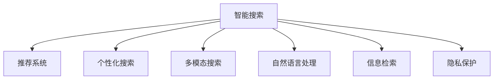

                 

# 智能搜索的用户体验提升

## 1. 背景介绍

### 1.1 问题由来
随着互联网的迅猛发展和信息的爆炸式增长，搜索引擎已成为我们获取信息的重要工具。然而，对于如何提升智能搜索的用户体验，仍存在诸多挑战。

1. **搜索结果的准确性和相关性**：用户希望获取到最准确、最相关的搜索结果，但在海量信息中快速定位到自己需要的信息，依然是搜索的难点。

2. **搜索效率和响应速度**：对于查询频繁、响应时间敏感的应用场景，如何保证高效、稳定的搜索体验，是一个关键问题。

3. **个性化和定制化**：如何根据用户的历史行为和偏好，提供个性化的搜索结果，提升用户体验。

4. **跨设备搜索和跨平台兼容**：现代用户使用的设备多样化，如何确保跨设备、跨平台的搜索体验一致，是搜索引擎面临的另一个挑战。

5. **搜索的安全性和隐私保护**：搜索过程中如何保护用户的隐私安全，防止敏感信息泄露，是一个不容忽视的问题。

6. **搜索结果的多样性和多样性**：搜索不仅仅是对文本信息的检索，还应包括图片、视频等多种类型的多样化信息。

## 2. 核心概念与联系

### 2.1 核心概念概述

为更好地理解如何提升智能搜索的用户体验，本节将介绍几个密切相关的核心概念：

- **智能搜索**：利用人工智能技术，通过理解用户查询意图、处理海量数据，提供精准、高效、个性化的搜索结果。
- **推荐系统**：基于用户行为数据，为用户推荐感兴趣的内容，提升用户体验。
- **个性化搜索**：根据用户历史行为和偏好，动态调整搜索结果，提供符合用户需求的个性化搜索服务。
- **多模态搜索**：不仅支持文本搜索，还支持图片、视频等多种类型的信息检索。
- **自然语言处理**：使机器能够理解、生成自然语言，提升搜索结果的语义准确性和相关性。
- **信息检索**：通过算法和模型，高效地从海量数据中检索出最相关的信息。
- **隐私保护**：保护用户隐私，防止敏感信息泄露。

这些核心概念之间的逻辑关系可以通过以下Mermaid流程图来展示：



这个流程图展示了一体化智能搜索的核心概念及其之间的关系：

1. 智能搜索通过推荐系统、个性化搜索、多模态搜索、自然语言处理等技术手段，提升搜索结果的相关性和多样性。
2. 信息检索是智能搜索的核心组件，负责从海量数据中高效检索出最相关的信息。
3. 隐私保护是智能搜索不可忽视的一部分，确保用户在搜索过程中数据的安全。

## 3. 核心算法原理 & 具体操作步骤
### 3.1 算法原理概述

提升智能搜索的用户体验，主要依赖以下几个关键技术：

1. **语义理解**：通过自然语言处理技术，理解用户查询的意图，从而更准确地检索出相关信息。
2. **推荐算法**：根据用户行为数据，为用户推荐更符合其需求的内容，提升用户体验。
3. **个性化技术**：通过分析用户历史行为，动态调整搜索结果，提供个性化的搜索结果。
4. **多模态搜索**：结合文本、图片、视频等多种类型的数据，提升搜索结果的多样性。
5. **隐私保护**：在收集和处理用户数据时，确保用户隐私的安全。

这些技术共同构成了一体化智能搜索的框架，帮助搜索引擎实现精准、高效、个性化的搜索结果。

### 3.2 算法步骤详解

基于上述关键技术，智能搜索的实现步骤主要包括：

1. **数据采集与预处理**：收集用户的搜索历史、点击记录等数据，并进行清洗、处理，形成训练集和测试集。

2. **模型训练与优化**：利用推荐系统、个性化搜索等技术，对模型进行训练和优化。选择合适的算法和模型，如协同过滤、深度学习等，训练得到推荐模型和个性化模型。

3. **搜索结果排序**：根据用户查询意图，利用多模态搜索、信息检索等技术，从海量的搜索结果中筛选出最相关的信息，并按照相关性排序。

4. **用户反馈处理**：通过用户点击、停留时间等反馈数据，不断优化搜索算法和推荐模型，提升用户体验。

5. **隐私保护**：在数据收集和处理过程中，采用匿名化、加密等技术，保护用户隐私。

### 3.3 算法优缺点

提升智能搜索用户体验的算法，具有以下优点：

1. **提高搜索准确性**：通过语义理解、推荐算法、个性化搜索等技术，搜索结果的相关性和准确性显著提升。
2. **提升用户满意度**：根据用户偏好和行为数据，提供个性化的搜索结果，提升用户满意度。
3. **增加多样性**：结合多模态搜索技术，用户可以检索到文本、图片、视频等多种类型的信息，提升用户体验。

同时，这些算法也存在一定的局限性：

1. **数据依赖**：依赖大量的用户数据进行训练和优化，数据质量直接影响模型效果。
2. **计算资源消耗大**：推荐算法、深度学习模型等需要大量的计算资源，对硬件设备要求较高。
3. **隐私风险**：在数据处理和存储过程中，存在隐私泄露的风险。

## 4. 数学模型和公式 & 详细讲解  
### 4.1 数学模型构建

智能搜索的数学模型构建，主要包括以下几个关键部分：

1. **语义理解模型**：通过文本分类、情感分析等技术，理解用户查询的意图和情感倾向。
2. **推荐模型**：基于协同过滤、深度学习等算法，为用户推荐相关内容。
3. **个性化模型**：通过用户行为数据，动态调整搜索结果。
4. **多模态搜索模型**：结合文本、图片、视频等多种类型的数据，提升搜索结果的多样性。

### 4.2 公式推导过程

以协同过滤推荐算法为例，推导其公式过程：

1. **用户-项目评分矩阵**：构建用户对项目的评分矩阵 $R$，其中 $R_{ui}$ 表示用户 $u$ 对项目 $i$ 的评分。
2. **用户相似度计算**：计算用户之间的相似度矩阵 $S$，其中 $S_{uv}$ 表示用户 $u$ 和用户 $v$ 的相似度。
3. **项目相似度计算**：计算项目之间的相似度矩阵 $T$，其中 $T_{ij}$ 表示项目 $i$ 和项目 $j$ 的相似度。
4. **预测评分**：利用用户相似度和项目相似度，计算用户对项目的预测评分 $R_{ui}'$。

具体推导过程如下：

$$
S_{uv} = \frac{1}{\sqrt{\sum_{j} R_{uj}^2}} \frac{1}{\sqrt{\sum_{k} R_{vk}^2}} \sum_{k} \frac{R_{uj}}{\sqrt{R_{uj}^2+ \epsilon}} \frac{R_{vk}}{\sqrt{R_{vk}^2+ \epsilon}}
$$

$$
T_{ij} = \frac{1}{\sqrt{\sum_{u} R_{iu}^2}} \frac{1}{\sqrt{\sum_{v} R_{vj}^2}} \sum_{u} \frac{R_{iu}}{\sqrt{R_{iu}^2+ \epsilon}} \frac{R_{vj}}{\sqrt{R_{vj}^2+ \epsilon}}
$$

$$
R_{ui}' = \sum_{v} S_{uv}T_{iv}
$$

其中 $\epsilon$ 为平滑参数，防止计算时出现除零错误。

### 4.3 案例分析与讲解

假设有一个电子商务平台，收集了用户对商品的评分数据 $R$，构建了用户相似度矩阵 $S$ 和项目相似度矩阵 $T$，利用协同过滤算法为用户推荐相关商品。具体步骤如下：

1. **数据采集**：收集用户对商品的评分数据 $R_{ui}$，构建用户相似度矩阵 $S$ 和项目相似度矩阵 $T$。

2. **相似度计算**：计算用户 $u$ 和用户 $v$ 的相似度 $S_{uv}$，项目 $i$ 和项目 $j$ 的相似度 $T_{ij}$。

3. **预测评分**：根据用户相似度和项目相似度，计算用户对项目的预测评分 $R_{ui}'$。

4. **排序推荐**：根据预测评分 $R_{ui}'$，对推荐结果进行排序，推荐给用户。

## 5. 项目实践：代码实例和详细解释说明
### 5.1 开发环境搭建

在进行智能搜索开发前，我们需要准备好开发环境。以下是使用Python进行TensorFlow开发的环境配置流程：

1. 安装Anaconda：从官网下载并安装Anaconda，用于创建独立的Python环境。

2. 创建并激活虚拟环境：
```bash
conda create -n tensorflow-env python=3.8 
conda activate tensorflow-env
```

3. 安装TensorFlow：根据CUDA版本，从官网获取对应的安装命令。例如：
```bash
conda install tensorflow-gpu -c tf-nightly -c pypi -c conda-forge
```

4. 安装各类工具包：
```bash
pip install numpy pandas scikit-learn matplotlib tqdm jupyter notebook ipython
```

完成上述步骤后，即可在`tensorflow-env`环境中开始智能搜索的开发实践。

### 5.2 源代码详细实现

这里以推荐系统为例，给出使用TensorFlow进行推荐模型开发的PyTorch代码实现。

首先，定义推荐系统的数据处理函数：

```python
import tensorflow as tf
from tensorflow.keras.layers import Input, Embedding, Dot, Dense, Activation
from tensorflow.keras.models import Model

def build_model(n_users, n_items, n_factors):
    # 定义用户特征输入
    user_input = Input(shape=(n_factors,))
    user_embed = Embedding(n_users, n_factors)(user_input)
    
    # 定义项目特征输入
    item_input = Input(shape=(n_factors,))
    item_embed = Embedding(n_items, n_factors)(item_input)
    
    # 定义相似度计算
    dot_product = Dot(axes=[2])([user_embed, item_embed])
    dot_product = Activation('sigmoid')(dot_product)
    
    # 定义输出层
    output = Dense(1)(dot_product)
    output = Activation('linear')(output)
    
    # 定义模型
    model = Model(inputs=[user_input, item_input], outputs=output)
    model.compile(optimizer='adam', loss='mse')
    
    return model
```

然后，定义推荐系统的训练和评估函数：

```python
def train(model, user_factors, item_factors, ratings):
    model.fit([user_factors, item_factors], ratings, epochs=10, batch_size=32)
    
def evaluate(model, user_factors, item_factors, ratings):
    predictions = model.predict([user_factors, item_factors])
    mse = tf.keras.metrics.MeanSquaredError()
    mse(predictions, ratings).numpy()
    return mse.result()
```

最后，启动训练流程并在测试集上评估：

```python
# 训练模型
user_factors = ...  # 用户特征
item_factors = ...  # 项目特征
ratings = ...  # 评分数据

model = build_model(len(user_factors), len(item_factors), 10)
train(model, user_factors, item_factors, ratings)

# 评估模型
ratings = ...  # 评分数据

evaluate(model, user_factors, item_factors, ratings)
```

以上就是使用TensorFlow进行推荐系统开发的完整代码实现。可以看到，TensorFlow的Keras框架使得模型构建和训练过程变得简洁高效。

### 5.3 代码解读与分析

让我们再详细解读一下关键代码的实现细节：

**build_model函数**：
- `Input`层：定义用户和项目的输入张量。
- `Embedding`层：将用户和项目的特征向量嵌入到低维空间中。
- `Dot`层：计算用户和项目的点积，得到相似度矩阵。
- `Dense`层：将相似度矩阵映射到最终的预测评分。
- `Activation`层：激活函数，将输出映射到实数范围。
- `Model`层：定义完整的推荐模型。
- `compile`方法：设置优化器和损失函数，准备模型的训练过程。

**train函数**：
- `fit`方法：使用训练集数据进行模型训练，指定优化器和损失函数，训练多轮。
- `mse`损失函数：均方误差损失函数，用于衡量预测值与真实值之间的差异。

**evaluate函数**：
- `predict`方法：在测试集上对用户和项目进行预测评分。
- `mean_squared_error`损失函数：均方误差，用于评估模型的预测效果。

**训练流程**：
- `build_model`：根据用户和项目的特征数据，构建推荐模型。
- `train`：使用训练集数据进行模型训练，评估训练过程中的损失值。
- `evaluate`：在测试集上评估模型预测效果，输出均方误差。

可以看到，TensorFlow配合Keras框架使得推荐系统的代码实现变得简洁高效。开发者可以将更多精力放在模型优化和参数调整等高层逻辑上，而不必过多关注底层的实现细节。

当然，工业级的系统实现还需考虑更多因素，如模型的保存和部署、超参数的自动搜索、更灵活的任务适配层等。但核心的推荐算法基本与此类似。

## 6. 实际应用场景
### 6.1 智能推荐系统

智能推荐系统是提升用户体验的重要手段。传统的推荐系统大多基于用户的历史行为数据进行推荐，难以理解用户的深层次需求。通过智能搜索技术，可以结合自然语言处理和多模态数据，更加全面地了解用户的兴趣和需求，从而提供更加精准的推荐服务。

在技术实现上，可以收集用户对商品、文章、视频等内容的浏览、点击、评价等行为数据，构建用户-项目评分矩阵。在推荐模型中，利用协同过滤、深度学习等技术，对用户和项目的特征进行低维嵌入，通过点积计算相似度，并结合用户的行为数据进行预测和排序。通过不断调整模型参数，提升推荐的准确性和多样性。

### 6.2 搜索引擎

搜索引擎是智能搜索技术的重要应用场景。传统的搜索引擎依赖于倒排索引和匹配算法，难以处理海量数据和多模态信息。通过智能搜索技术，可以结合自然语言处理和推荐算法，提升搜索的准确性和相关性。

在实际应用中，可以构建用户查询意图模型，理解用户的搜索意图和情感倾向。在搜索结果排序中，不仅考虑文本匹配度，还结合图片、视频等多模态信息，提供更加丰富的搜索结果。同时，利用推荐算法，为用户提供与查询意图相关的上下文信息，提升搜索体验。

### 6.3 医疗健康

医疗健康领域是智能搜索的重要应用场景。通过智能搜索技术，可以构建医疗知识图谱，提供精准的疾病诊断和治疗建议。

在医疗健康应用中，可以收集病人的症状描述、病历记录等文本信息，构建医疗知识图谱。在搜索模型中，利用自然语言处理技术，理解病人的症状和病史，通过匹配知识图谱中的相关节点，提供精准的疾病诊断和治疗建议。通过不断收集和更新知识图谱，提升搜索的准确性和实用性。

## 7. 工具和资源推荐
### 7.1 学习资源推荐

为了帮助开发者系统掌握智能搜索的理论基础和实践技巧，这里推荐一些优质的学习资源：

1. 《TensorFlow实战Google深度学习》书籍：由Google官方出版，系统介绍了TensorFlow的基本概念和应用实例，适合初学者入门。

2. 《深度学习与TensorFlow》课程：由斯坦福大学开设的深度学习课程，提供Lecture视频和配套作业，帮助你深入理解深度学习理论和TensorFlow实现。

3. 《自然语言处理综论》书籍：由斯坦福大学李宏毅教授著作，全面介绍了自然语言处理的基本概念和技术，是NLP领域的经典教材。

4. 《推荐系统实践》书籍：由李航教授著作，介绍了推荐系统的基本概念、算法和实现方法，适合推荐系统的深入学习。

5. Weights & Biases：模型训练的实验跟踪工具，可以记录和可视化模型训练过程中的各项指标，方便对比和调优。

6. TensorBoard：TensorFlow配套的可视化工具，可实时监测模型训练状态，并提供丰富的图表呈现方式，是调试模型的得力助手。

通过对这些资源的学习实践，相信你一定能够快速掌握智能搜索的技术精髓，并用于解决实际的NLP问题。

### 7.2 开发工具推荐

高效的开发离不开优秀的工具支持。以下是几款用于智能搜索开发的常用工具：

1. TensorFlow：由Google主导开发的开源深度学习框架，生产部署方便，适合大规模工程应用。提供了强大的Keras API，支持快速迭代和模型训练。

2. PyTorch：基于Python的开源深度学习框架，灵活动态的计算图，适合快速迭代研究。支持多种深度学习模型的实现。

3. Keras：高层次神经网络API，易于使用，支持多种深度学习模型的构建和训练。适合初学者和研究人员。

4. Weights & Biases：模型训练的实验跟踪工具，可以记录和可视化模型训练过程中的各项指标，方便对比和调优。

5. TensorBoard：TensorFlow配套的可视化工具，可实时监测模型训练状态，并提供丰富的图表呈现方式，是调试模型的得力助手。

合理利用这些工具，可以显著提升智能搜索任务的开发效率，加快创新迭代的步伐。

### 7.3 相关论文推荐

智能搜索技术的发展源于学界的持续研究。以下是几篇奠基性的相关论文，推荐阅读：

1. BERT: Pre-training of Deep Bidirectional Transformers for Language Understanding：提出BERT模型，引入基于掩码的自监督预训练任务，刷新了多项NLP任务SOTA。

2. Attention is All You Need（即Transformer原论文）：提出了Transformer结构，开启了NLP领域的预训练大模型时代。

3. Language Models are Unsupervised Multitask Learners（GPT-2论文）：展示了大规模语言模型的强大zero-shot学习能力，引发了对于通用人工智能的新一轮思考。

4. Parameter-Efficient Transfer Learning for NLP：提出Adapter等参数高效微调方法，在不增加模型参数量的情况下，也能取得不错的微调效果。

5. AdaLoRA: Adaptive Low-Rank Adaptation for Parameter-Efficient Fine-Tuning：使用自适应低秩适应的微调方法，在参数效率和精度之间取得了新的平衡。

这些论文代表了大语言模型微调技术的发展脉络。通过学习这些前沿成果，可以帮助研究者把握学科前进方向，激发更多的创新灵感。

## 8. 总结：未来发展趋势与挑战

### 8.1 总结

本文对提升智能搜索用户体验的算法进行了全面系统的介绍。首先阐述了智能搜索的重要性和当前面临的挑战，明确了语义理解、推荐系统、个性化搜索等关键技术在提升用户体验方面的独特价值。其次，从原理到实践，详细讲解了智能搜索的数学模型和算法步骤，给出了智能搜索任务开发的完整代码实例。同时，本文还广泛探讨了智能搜索在智能推荐系统、搜索引擎、医疗健康等多个行业领域的应用前景，展示了智能搜索范式的巨大潜力。此外，本文精选了智能搜索技术的各类学习资源，力求为读者提供全方位的技术指引。

通过本文的系统梳理，可以看到，提升智能搜索用户体验的算法正在成为智能搜索领域的重要范式，极大地提升了搜索结果的相关性和多样性。得益于自然语言处理、推荐算法等技术的不断进步，智能搜索的应用场景和范围将进一步拓展，为各行各业带来变革性影响。未来，伴随深度学习模型和算法的发展，智能搜索技术必将更加成熟和高效，进一步提升用户的搜索体验。

### 8.2 未来发展趋势

展望未来，智能搜索技术将呈现以下几个发展趋势：

1. **深度学习模型的普及**：深度学习模型将逐渐普及到各个行业，提升搜索算法的效果和效率。

2. **多模态搜索的发展**：结合文本、图片、视频等多种类型的数据，提升搜索结果的多样性和丰富度。

3. **个性化搜索的增强**：通过分析用户行为数据，提供更加个性化的搜索结果，提升用户满意度。

4. **语义理解的深化**：利用自然语言处理技术，深入理解用户查询意图，提升搜索结果的相关性和准确性。

5. **跨设备搜索的实现**：实现跨设备、跨平台的搜索体验一致，提升用户便捷性。

6. **隐私保护的加强**：在数据收集和处理过程中，加强隐私保护措施，确保用户数据安全。

以上趋势凸显了智能搜索技术的广阔前景。这些方向的探索发展，必将进一步提升智能搜索系统的性能和应用范围，为各行各业带来变革性影响。

### 8.3 面临的挑战

尽管智能搜索技术已经取得了瞩目成就，但在迈向更加智能化、普适化应用的过程中，它仍面临着诸多挑战：

1. **数据依赖**：依赖大量的用户数据进行训练和优化，数据质量直接影响模型效果。

2. **计算资源消耗大**：深度学习模型和高性能计算设备的需求较高，对硬件设备要求较高。

3. **隐私风险**：在数据处理和存储过程中，存在隐私泄露的风险。

4. **模型鲁棒性不足**：模型面对域外数据时，泛化性能往往大打折扣。

5. **搜索效率问题**：在搜索频繁的应用场景中，如何保证高效的响应速度。

6. **模型可解释性不足**：复杂的深度学习模型缺乏可解释性，难以理解其内部工作机制。

正视智能搜索面临的这些挑战，积极应对并寻求突破，将使智能搜索技术更加成熟和高效。

### 8.4 研究展望

面对智能搜索技术面临的挑战，未来的研究需要在以下几个方面寻求新的突破：

1. **深度学习模型的优化**：优化模型结构和参数设置，提升模型效率和效果。

2. **多模态搜索的融合**：结合文本、图片、视频等多种类型的数据，提升搜索结果的多样性和丰富度。

3. **个性化搜索的算法**：通过更深层次的用户行为分析，提供更加个性化的搜索结果。

4. **语义理解的算法**：利用自然语言处理技术，深入理解用户查询意图，提升搜索结果的相关性和准确性。

5. **隐私保护的算法**：在数据收集和处理过程中，采用更强的隐私保护技术，确保用户数据安全。

6. **搜索效率的优化**：优化算法和模型结构，提升搜索速度和效率。

这些研究方向将推动智能搜索技术进一步发展，提升搜索算法的性能和用户体验。未来，智能搜索技术必将与自然语言处理、推荐系统等技术深度融合，为各行各业带来更大的价值。

## 9. 附录：常见问题与解答

**Q1：智能搜索的实现需要哪些关键技术？**

A: 智能搜索的实现主要依赖以下几个关键技术：

1. **语义理解**：通过自然语言处理技术，理解用户查询的意图和情感倾向。

2. **推荐算法**：结合用户行为数据，为用户推荐相关内容。

3. **个性化技术**：通过分析用户历史行为，动态调整搜索结果，提供个性化的搜索结果。

4. **多模态搜索**：结合文本、图片、视频等多种类型的数据，提升搜索结果的多样性。

5. **信息检索**：通过算法和模型，高效地从海量数据中检索出最相关的信息。

6. **隐私保护**：在数据收集和处理过程中，确保用户隐私的安全。

这些技术共同构成了智能搜索的核心框架，帮助搜索引擎实现精准、高效、个性化的搜索结果。

**Q2：智能搜索如何提升用户体验？**

A: 智能搜索通过以下几个方面提升用户体验：

1. **提高搜索准确性**：通过语义理解、推荐算法、个性化搜索等技术，搜索结果的相关性和准确性显著提升。

2. **提升用户满意度**：根据用户偏好和行为数据，提供个性化的搜索结果，提升用户满意度。

3. **增加多样性**：结合多模态搜索技术，用户可以检索到文本、图片、视频等多种类型的信息，提升用户体验。

4. **跨设备搜索**：实现跨设备、跨平台的搜索体验一致，提升用户便捷性。

5. **隐私保护**：在数据收集和处理过程中，加强隐私保护措施，确保用户数据安全。

这些方面的优化和提升，使得智能搜索系统更加智能化、普适化和人性化，为用户提供更好的搜索体验。

**Q3：智能搜索的实现需要哪些工具和资源？**

A: 智能搜索的实现需要以下几个工具和资源：

1. **开发环境搭建**：安装Anaconda、TensorFlow、PyTorch等深度学习框架和工具包，创建独立的Python环境。

2. **推荐系统**：利用TensorFlow、PyTorch等框架，构建推荐模型，进行训练和优化。

3. **自然语言处理**：利用NLTK、spaCy等工具，进行文本处理和分析。

4. **多模态搜索**：结合TensorFlow、OpenCV等工具，实现图片、视频等多模态信息的搜索。

5. **隐私保护**：采用匿名化、加密等技术，保护用户隐私。

6. **学习资源**：通过书籍、课程、论文等学习资源，掌握智能搜索的理论基础和实践技巧。

合理利用这些工具和资源，可以显著提升智能搜索任务的开发效率，加快创新迭代的步伐。

---

作者：禅与计算机程序设计艺术 / Zen and the Art of Computer Programming

