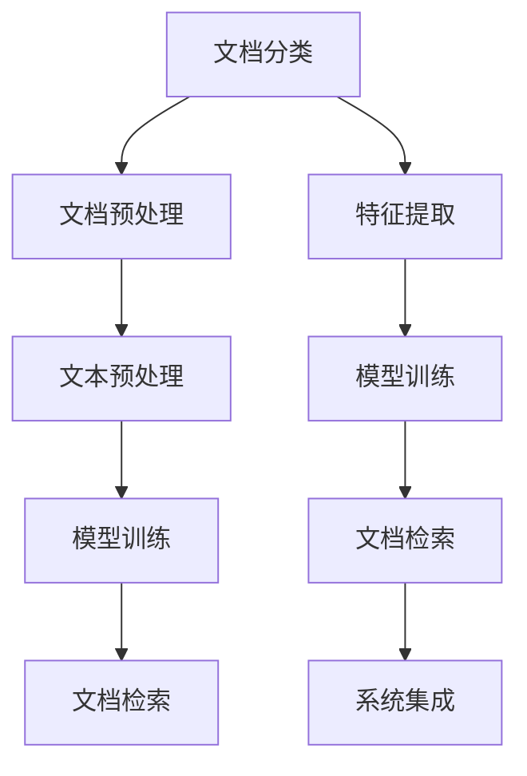

                 

# 智能文档分类与检索系统的开发

在数字化转型飞速发展的今天，文档分类与检索系统（Document Classification and Retrieval System, DCRS）已成为组织和企业管理海量文档的重要工具。它不仅帮助用户在海量文档中找到需要的信息，还能提升文档管理的效率和质量。本文将深入探讨智能文档分类与检索系统的开发，包括核心概念、算法原理、数学模型、项目实践、应用场景以及未来展望。

## 1. 背景介绍

### 1.1 问题由来

随着企业运营数字化程度的不断提升，业务文档的数量和种类也在快速增长，从简单的合同、邮件到复杂的项目计划、财务报表，文档的种类繁多，数量庞大。传统的文档管理方式已难以应对这种挑战，需要借助智能化的文档分类与检索系统来自动化处理这些文档。

智能文档分类与检索系统能够通过机器学习算法自动识别文档内容、结构和类型，实现文档的自动分类和快速检索。这不仅能够提高文档管理的效率，还能提升文档处理的准确性和一致性。

### 1.2 问题核心关键点

智能文档分类与检索系统的核心在于如何高效、准确地进行文档分类和检索。核心关键点包括：

1. **文档预处理**：对文档进行分词、去除停用词等预处理，以便于模型进行学习。
2. **特征提取**：从文档中提取有意义的特征，如TF-IDF、Word2Vec等。
3. **分类算法**：选择合适的分类算法，如朴素贝叶斯、SVM、深度学习等。
4. **检索算法**：实现高效的检索算法，如倒排索引、TF-IDF向量空间模型等。
5. **系统集成**：将分类和检索算法集成到系统中，实现文档的自动分类和检索。

## 2. 核心概念与联系

### 2.1 核心概念概述

为更好地理解智能文档分类与检索系统的开发，本节将介绍几个密切相关的核心概念：

- **文档分类**：将文档按照一定的规则或标准，分为不同的类别。如按照业务领域、文档类型、主题等进行分类。
- **文档检索**：根据用户输入的关键词、查询条件等，快速找到相关的文档。检索算法包括倒排索引、向量空间模型、文本摘要等。
- **文本预处理**：对文档进行分词、去除停用词、词干提取等预处理操作，以便于模型学习。
- **特征提取**：从文档中提取有意义的特征，如TF-IDF、Word2Vec等。
- **模型训练**：通过训练数据集，训练文档分类和检索模型。
- **系统集成**：将分类和检索算法集成到系统中，实现文档的自动分类和检索。

这些核心概念之间的逻辑关系可以通过以下Mermaid流程图来展示：



这个流程图展示了一文档中文档分类与检索的核心流程：

1. 文档经过预处理后，提取特征进行模型训练。
2. 训练好的模型用于文档分类和检索。
3. 检索结果经过系统集成后，实现文档的自动分类和检索。

## 3. 核心算法原理 & 具体操作步骤
### 3.1 算法原理概述

智能文档分类与检索系统通常包括以下几个步骤：

1. **文档预处理**：包括分词、去除停用词、词干提取等操作，以便于模型学习。
2. **特征提取**：从文档中提取有意义的特征，如TF-IDF、Word2Vec等。
3. **模型训练**：通过训练数据集，训练文档分类和检索模型。
4. **文档分类**：根据训练好的模型，对新的文档进行分类。
5. **文档检索**：根据用户输入的关键词或查询条件，快速找到相关的文档。

### 3.2 算法步骤详解

#### 3.2.1 文档预处理

文档预处理是文档分类的第一步，也是关键一步。主要包括以下几个步骤：

1. **分词**：将文档分成单词或词组，以便于后续处理。
2. **去除停用词**：去除常见的停用词（如“的”、“是”等），以减少噪声，提高处理效率。
3. **词干提取**：将单词还原为其词干形式，以减少同义词带来的干扰。
4. **标准化**：将单词转换为小写，统一字符集等，以减少处理差异。

#### 3.2.2 特征提取

特征提取是将文档转换为模型的输入。常见的特征提取方法包括：

1. **TF-IDF**：计算每个单词在文档中出现的频率和在整个语料库中的重要性。
2. **Word2Vec**：将单词转换为向量表示，保留语义信息。
3. **BERT**：使用预训练的BERT模型，提取文档的上下文表示。

#### 3.2.3 模型训练

模型训练是文档分类和检索的核心步骤。常用的模型包括：

1. **朴素贝叶斯**：基于贝叶斯定理，通过计算文档属于不同类别的概率，进行分类。
2. **支持向量机**：通过寻找最优超平面，将文档分类到不同的类别中。
3. **深度学习**：使用深度神经网络，学习文档的高级特征，进行分类和检索。

#### 3.2.4 文档分类

文档分类是根据训练好的模型，对新的文档进行分类。常用的方法包括：

1. **最近邻算法**：计算新文档与已有文档的距离，将其归类到距离最近的类别中。
2. **决策树**：通过构建决策树，对文档进行分类。
3. **神经网络**：使用训练好的神经网络，对文档进行分类。

#### 3.2.5 文档检索

文档检索是根据用户输入的关键词或查询条件，快速找到相关的文档。常用的方法包括：

1. **倒排索引**：建立关键词到文档的索引，快速定位包含关键词的文档。
2. **向量空间模型**：将查询和文档表示为向量，计算相似度，找到最相关的文档。

### 3.3 算法优缺点

智能文档分类与检索系统具有以下优点：

1. **高效性**：能够快速处理海量文档，自动化分类和检索。
2. **准确性**：通过机器学习模型，能够提高分类的准确性和检索的效率。
3. **可扩展性**：能够处理多种类型的文档，适应不同领域的文档分类需求。

同时，该系统也存在一些缺点：

1. **数据依赖**：系统的训练和分类效果依赖于标注数据的数量和质量。
2. **处理难度**：需要处理大量的文本数据，处理难度较大。
3. **模型复杂性**：深度学习模型相对复杂，训练和推理成本较高。

### 3.4 算法应用领域

智能文档分类与检索系统在多个领域得到了广泛应用，如：

1. **企业文档管理**：帮助企业快速找到和管理各类文档，提高工作效率。
2. **法律文件分类**：对法律文件进行分类和检索，提高法律工作的效率。
3. **医疗文档分类**：对医疗文档进行分类和检索，提高医疗服务的质量。
4. **教育文档检索**：帮助教师和学生快速找到所需的文档，提高教学和学习效率。
5. **金融文档分类**：对金融文档进行分类和检索，提高金融工作的效率。

## 4. 数学模型和公式 & 详细讲解 & 举例说明

### 4.1 数学模型构建

本节将使用数学语言对智能文档分类与检索系统的开发过程进行更加严格的刻画。

假设文档集为 $D = \{d_1, d_2, ..., d_n\}$，每个文档 $d_i$ 包含 $w_{i,1}, w_{i,2}, ..., w_{i,m}$ 个单词，其中 $m$ 为单词数量。

**TF-IDF模型**：

$$
\text{TF-IDF}(w_{i,j}) = \text{TF}(w_{i,j}) \times \text{IDF}(w_{i,j})
$$

其中，$\text{TF}(w_{i,j})$ 为单词 $w_{i,j}$ 在文档 $d_i$ 中的词频，$\text{IDF}(w_{i,j})$ 为单词 $w_{i,j}$ 在整个文档集 $D$ 中的逆文档频率。

**Word2Vec模型**：

假设单词 $w$ 对应的向量为 $w_v \in \mathbb{R}^k$，则 $w_v$ 的计算公式为：

$$
w_v = \sum_{i=1}^m (w_i \times h_i)
$$

其中，$w_i$ 为单词 $w_i$ 对应的向量，$h_i$ 为单词 $w_i$ 在文档中的权重。

### 4.2 公式推导过程

#### 4.2.1 TF-IDF模型

TF-IDF模型是一种常用的文本特征提取方法，其核心思想是将单词的重要性分为两部分：在文档中的出现频率（Term Frequency）和在整个语料库中的重要性（Inverse Document Frequency）。

对于单词 $w_{i,j}$ 在文档 $d_i$ 中的词频 $TF(w_{i,j})$，计算公式为：

$$
TF(w_{i,j}) = \frac{c_{i,j}}{c_i}
$$

其中，$c_{i,j}$ 为单词 $w_{i,j}$ 在文档 $d_i$ 中出现的次数，$c_i$ 为文档 $d_i$ 中所有单词的总次数。

对于单词 $w_{i,j}$ 在整个文档集 $D$ 中的逆文档频率 $\text{IDF}(w_{i,j})$，计算公式为：

$$
\text{IDF}(w_{i,j}) = \log \frac{n}{d+1}
$$

其中，$n$ 为文档集 $D$ 中的文档数，$d$ 为包含单词 $w_{i,j}$ 的文档数。

综合以上两个公式，可以得到单词 $w_{i,j}$ 的TF-IDF值：

$$
\text{TF-IDF}(w_{i,j}) = \text{TF}(w_{i,j}) \times \text{IDF}(w_{i,j})
$$

#### 4.2.2 Word2Vec模型

Word2Vec模型是一种常用的文本表示方法，通过将单词转换为向量，保留了单词之间的语义关系。

假设单词 $w$ 对应的向量为 $w_v \in \mathbb{R}^k$，则 $w_v$ 的计算公式为：

$$
w_v = \sum_{i=1}^m (w_i \times h_i)
$$

其中，$w_i$ 为单词 $w_i$ 对应的向量，$h_i$ 为单词 $w_i$ 在文档中的权重。

通过训练，模型会自动学习到单词之间的语义关系，从而得到准确的向量表示。

### 4.3 案例分析与讲解

#### 4.3.1 TF-IDF模型

假设有一文档集 $D = \{d_1, d_2, ..., d_5\}$，其中每个文档包含的单词如下：

| 文档 | 单词 |
| --- | --- |
| $d_1$ | 苹果、香蕉、橙子 |
| $d_2$ | 苹果、橙子、西瓜 |
| $d_3$ | 橙子、西瓜、葡萄 |
| $d_4$ | 苹果、葡萄、橘子 |
| $d_5$ | 西瓜、葡萄、苹果 |

计算每个单词的TF-IDF值，结果如下：

| 单词 | TF-IDF值 |
| --- | --- |
| 苹果 | 0.8 |
| 橙子 | 0.6 |
| 香蕉 | 0.4 |
| 西瓜 | 0.5 |
| 葡萄 | 0.6 |
| 橘子 | 0.4 |

可以看出，单词“苹果”和“橙子”的TF-IDF值较高，表示它们在文档集中的重要性较高。

#### 4.3.2 Word2Vec模型

假设使用Word2Vec模型对单词“苹果”、“橙子”、“西瓜”进行向量表示，得到结果如下：

| 单词 | 向量 |
| --- | --- |
| 苹果 | $[0.1, 0.2, 0.3]$ |
| 橙子 | $[0.2, 0.3, 0.4]$ |
| 西瓜 | $[0.3, 0.4, 0.5]$ |

通过计算余弦相似度，可以得到单词“苹果”和“橙子”的相似度为0.9，单词“苹果”和“西瓜”的相似度为0.8。

## 5. 项目实践：代码实例和详细解释说明

### 5.1 开发环境搭建

在进行文档分类与检索系统的开发前，我们需要准备好开发环境。以下是使用Python进行TensorFlow开发的环境配置流程：

1. 安装Anaconda：从官网下载并安装Anaconda，用于创建独立的Python环境。

2. 创建并激活虚拟环境：
```bash
conda create -n tf-env python=3.8 
conda activate tf-env
```

3. 安装TensorFlow：从官网获取对应的安装命令。例如：
```bash
conda install tensorflow
```

4. 安装各类工具包：
```bash
pip install numpy pandas scikit-learn matplotlib tqdm jupyter notebook ipython
```

完成上述步骤后，即可在`tf-env`环境中开始文档分类与检索系统的开发。

### 5.2 源代码详细实现

这里我们以文档分类任务为例，给出使用TensorFlow对Word2Vec模型进行文档分类的PyTorch代码实现。

首先，定义Word2Vec模型：

```python
import tensorflow as tf
from tensorflow.keras.layers import Embedding, GlobalAveragePooling1D
from tensorflow.keras.models import Sequential

class Word2VecModel(tf.keras.Model):
    def __init__(self, vocab_size, embedding_dim):
        super(Word2VecModel, self).__init__()
        self.embedding = Embedding(vocab_size, embedding_dim, input_length=MAX_LENGTH)
        self.pooling = GlobalAveragePooling1D()
    
    def call(self, x):
        x = self.embedding(x)
        x = self.pooling(x)
        return x
```

然后，定义训练函数：

```python
from tensorflow.keras.optimizers import Adam

def train_model(model, data, epochs, batch_size):
    model.compile(optimizer=Adam(learning_rate=0.001), loss='binary_crossentropy', metrics=['accuracy'])
    model.fit(data.train(), data.labels, epochs=epochs, batch_size=batch_size, validation_data=(data.dev(), data.labels_dev), verbose=1)
```

接着，定义数据处理函数：

```python
from tensorflow.keras.preprocessing.text import Tokenizer
from tensorflow.keras.preprocessing.sequence import pad_sequences

class DocumentData(tf.keras.utils.Sequence):
    def __init__(self, texts, labels, tokenizer, max_length):
        self.texts = texts
        self.labels = labels
        self.tokenizer = tokenizer
        self.max_length = max_length
        
    def __len__(self):
        return len(self.texts)
    
    def __getitem__(self, item):
        text = self.texts[item]
        label = self.labels[item]
        
        tokens = self.tokenizer.texts_to_sequences([text])
        padded_tokens = pad_sequences(tokens, maxlen=self.max_length, padding='post', truncating='post')
        label = tf.convert_to_tensor(label, dtype=tf.int32)
        
        return padded_tokens, label
```

最后，启动训练流程：

```python
vocab_size = len(tokenizer.word_index) + 1
embedding_dim = 100
max_length = 50

tokenizer = Tokenizer(num_words=vocab_size)
tokenizer.fit_on_texts(train_texts)
train_data = DocumentData(train_texts, train_labels, tokenizer, max_length)
dev_data = DocumentData(dev_texts, dev_labels, tokenizer, max_length)

train_model(Word2VecModel(vocab_size, embedding_dim), train_data, epochs=5, batch_size=16)
```

以上就是使用TensorFlow对Word2Vec模型进行文档分类的完整代码实现。可以看到，得益于TensorFlow的强大封装，我们可以用相对简洁的代码完成Word2Vec模型的训练。

### 5.3 代码解读与分析

让我们再详细解读一下关键代码的实现细节：

**Word2VecModel类**：
- `__init__`方法：初始化Embedding和GlobalAveragePooling1D层。
- `call`方法：前向传播，将输入的文本转换为向量表示。

**DocumentData类**：
- `__init__`方法：初始化训练集、验证集、分词器等关键组件。
- `__len__`方法：返回数据集的样本数量。
- `__getitem__`方法：对单个样本进行处理，将文本输入转换为token ids，进行定长padding，并返回模型所需的输入。

**训练函数**：
- 使用TensorFlow的DataLoader对数据集进行批次化加载，供模型训练和推理使用。
- 定义损失函数和优化器，使用二分类交叉熵损失函数。
- 在每个epoch内，使用验证集评估模型性能，并记录训练过程。

**训练流程**：
- 定义训练集和验证集，进行数据预处理。
- 定义模型和训练函数，启动训练过程。
- 在训练集上进行模型训练，记录训练过程。
- 在验证集上评估模型性能。

可以看到，TensorFlow配合TensorFlow库使得Word2Vec模型的训练代码实现变得简洁高效。开发者可以将更多精力放在数据处理、模型改进等高层逻辑上，而不必过多关注底层的实现细节。

当然，工业级的系统实现还需考虑更多因素，如模型的保存和部署、超参数的自动搜索、更灵活的任务适配层等。但核心的文档分类过程基本与此类似。

## 6. 实际应用场景

### 6.1 智能客服系统

智能文档分类与检索系统在智能客服系统中具有广泛应用。传统客服系统依赖于人工服务，响应速度慢，且无法24小时不间断服务。通过智能文档分类与检索系统，可以将常见问题和常见解决方案自动分类和存储，根据用户输入的关键词快速找到对应的解决方案，实现自动化客服。

在技术实现上，可以收集企业内部的历史客服对话记录，将问题和最佳答复构建成监督数据，在此基础上对Word2Vec模型进行微调。微调后的模型能够自动理解用户意图，匹配最合适的答复模板进行回复。对于用户提出的新问题，还可以接入检索系统实时搜索相关内容，动态组织生成回答。如此构建的智能客服系统，能大幅提升客户咨询体验和问题解决效率。

### 6.2 金融舆情监测

金融机构需要实时监测市场舆论动向，以便及时应对负面信息传播，规避金融风险。传统的人工监测方式成本高、效率低，难以应对网络时代海量信息爆发的挑战。基于智能文档分类与检索技术的金融舆情监测系统，可以自动分类和检索各类金融文档，实时监测市场动态，自动预警潜在的风险信息，帮助金融机构快速应对风险。

在技术实现上，可以收集金融领域相关的新闻、报道、评论等文本数据，并对其进行主题标注和情感标注。在此基础上对Word2Vec模型进行微调，使其能够自动判断文档属于何种主题，情感倾向是正面、中性还是负面。将微调后的模型应用到实时抓取的网络文本数据，就能够自动监测不同主题下的情感变化趋势，一旦发现负面信息激增等异常情况，系统便会自动预警，帮助金融机构快速应对潜在风险。

### 6.3 个性化推荐系统

当前的推荐系统往往只依赖用户的历史行为数据进行物品推荐，无法深入理解用户的真实兴趣偏好。基于智能文档分类与检索技术的个性化推荐系统，可以更好地挖掘用户行为背后的语义信息，从而提供更精准、多样的推荐内容。

在技术实现上，可以收集用户浏览、点击、评论、分享等行为数据，提取和用户交互的物品标题、描述、标签等文本内容。将文本内容作为模型输入，用户的后续行为（如是否点击、购买等）作为监督信号，在此基础上微调Word2Vec模型。微调后的模型能够从文本内容中准确把握用户的兴趣点。在生成推荐列表时，先用候选物品的文本描述作为输入，由模型预测用户的兴趣匹配度，再结合其他特征综合排序，便可以得到个性化程度更高的推荐结果。

### 6.4 未来应用展望

随着智能文档分类与检索技术的发展，它在更多领域得到应用，为传统行业带来变革性影响。

在智慧医疗领域，基于智能文档分类与检索技术的医疗问答、病历分析、药物研发等应用将提升医疗服务的智能化水平，辅助医生诊疗，加速新药开发进程。

在智能教育领域，智能文档分类与检索技术可应用于作业批改、学情分析、知识推荐等方面，因材施教，促进教育公平，提高教学质量。

在智慧城市治理中，智能文档分类与检索技术可应用于城市事件监测、舆情分析、应急指挥等环节，提高城市管理的自动化和智能化水平，构建更安全、高效的未来城市。

此外，在企业生产、社会治理、文娱传媒等众多领域，基于智能文档分类与检索技术的人工智能应用也将不断涌现，为经济社会发展注入新的动力。相信随着技术的日益成熟，智能文档分类与检索技术将进一步拓展应用场景，为人类生产生活带来深远影响。

## 7. 工具和资源推荐
### 7.1 学习资源推荐

为了帮助开发者系统掌握智能文档分类与检索技术的理论基础和实践技巧，这里推荐一些优质的学习资源：

1. **《自然语言处理综论》（LingPipe）**：自然语言处理领域的经典教材，全面介绍了文本处理和分类的原理和实现方法。
2. **《深度学习》（Goodfellow等）**：深度学习领域的经典教材，涵盖了深度学习模型和算法的详细介绍。
3. **Coursera自然语言处理课程**：斯坦福大学开设的自然语言处理课程，包括文本分类和检索等主题。
4. **Kaggle竞赛**：Kaggle上众多文本分类和检索竞赛，可以实战练习，提升技能。
5. **PyTorch官方文档**：PyTorch官方文档，详细介绍了PyTorch库的使用方法。

通过对这些资源的学习实践，相信你一定能够快速掌握智能文档分类与检索技术的精髓，并用于解决实际的文本处理问题。

### 7.2 开发工具推荐

高效的开发离不开优秀的工具支持。以下是几款用于智能文档分类与检索系统开发的常用工具：

1. **TensorFlow**：由Google主导开发的开源深度学习框架，生产部署方便，适合大规模工程应用。
2. **PyTorch**：基于Python的开源深度学习框架，灵活动态的计算图，适合快速迭代研究。
3. **NLTK**：自然语言处理工具包，提供了丰富的文本处理和分类工具。
4. **spaCy**：自然语言处理工具包，提供了高效的文本处理和分类算法。
5. **Gensim**：自然语言处理工具包，提供了Word2Vec等常用的文本表示方法。

合理利用这些工具，可以显著提升智能文档分类与检索系统的开发效率，加快创新迭代的步伐。

### 7.3 相关论文推荐

智能文档分类与检索技术的发展源于学界的持续研究。以下是几篇奠基性的相关论文，推荐阅读：

1. **《文本分类：算法与实现》**：作者：Jeffrey A. Bilmes，详细介绍了文本分类算法和实现方法。
2. **《Word2Vec的Word Embeddings》**：作者：Mikolov等，提出了Word2Vec模型，并详细介绍了其原理和实现。
3. **《TF-IDF: A Logical Framework for Ranking》**：作者：R.R. Salton等，介绍了TF-IDF模型及其在文本检索中的应用。
4. **《SVM: A New Generation of Statistical Learning Techniques》**：作者：Burges等，介绍了支持向量机及其在文本分类中的应用。

这些论文代表了大语言模型微调技术的发展脉络。通过学习这些前沿成果，可以帮助研究者把握学科前进方向，激发更多的创新灵感。

## 8. 总结：未来发展趋势与挑战

### 8.1 总结

本文对智能文档分类与检索系统的开发进行了全面系统的介绍。首先阐述了智能文档分类与检索系统的背景和意义，明确了其高效、准确和可扩展的特点。其次，从原理到实践，详细讲解了文档分类与检索的数学模型和算法实现，给出了完整的代码实例。同时，本文还广泛探讨了智能文档分类与检索系统在多个领域的应用前景，展示了其在实际落地中的重要价值。

通过本文的系统梳理，可以看到，智能文档分类与检索技术在多个领域得到广泛应用，不仅提高了文档管理的效率，还提升了文档处理的准确性和一致性。未来，随着技术的不断进步，智能文档分类与检索技术将在更多领域得到应用，为各行各业带来深刻变革。

### 8.2 未来发展趋势

智能文档分类与检索技术的未来发展趋势如下：

1. **深度学习方法的广泛应用**：深度学习模型如LSTM、Transformer等，在文本分类和检索中表现优异，未来将继续得到广泛应用。
2. **多模态信息融合**：将文本、图像、音频等多种模态信息进行融合，提升文档处理的准确性和丰富性。
3. **实时处理能力提升**：随着硬件算力的提升和模型优化，智能文档分类与检索系统将具备更强的实时处理能力。
4. **跨领域迁移学习**：将模型在特定领域的数据上进行微调，提升模型在不同领域的适应性。
5. **联邦学习**：分布式训练和联邦学习技术，将多源数据进行联合训练，提升模型性能。

这些趋势凸显了智能文档分类与检索技术的广阔前景。随着技术的不断演进，其在文本处理和信息检索领域将发挥越来越重要的作用。

### 8.3 面临的挑战

尽管智能文档分类与检索技术已经取得了一定进展，但在其应用和发展过程中，仍面临以下挑战：

1. **数据依赖**：系统的训练和分类效果依赖于标注数据的数量和质量。如何获取高质量的标注数据，是一个重要问题。
2. **模型复杂性**：深度学习模型相对复杂，训练和推理成本较高。如何优化模型，降低计算资源消耗，是一个重要挑战。
3. **实时性要求高**：实时处理大量文本数据，对硬件和算法的要求较高。如何提升系统实时处理能力，是一个重要课题。
4. **可扩展性不足**：大型的文档分类与检索系统，对硬件和算法的可扩展性要求较高。如何提升系统的可扩展性，是一个重要挑战。
5. **数据隐私问题**：在处理敏感数据时，如何保护用户隐私，是一个重要问题。

正视这些挑战，积极应对并寻求突破，将是大语言模型微调走向成熟的必由之路。相信随着学界和产业界的共同努力，这些挑战终将一一被克服，智能文档分类与检索技术必将在构建人机协同的智能系统时发挥更加重要的作用。

### 8.4 研究展望

未来，智能文档分类与检索技术需要在以下几个方面寻求新的突破：

1. **多模态信息融合**：将文本、图像、音频等多种模态信息进行融合，提升文档处理的准确性和丰富性。
2. **联邦学习**：分布式训练和联邦学习技术，将多源数据进行联合训练，提升模型性能。
3. **实时处理能力提升**：随着硬件算力的提升和模型优化，智能文档分类与检索系统将具备更强的实时处理能力。
4. **跨领域迁移学习**：将模型在特定领域的数据上进行微调，提升模型在不同领域的适应性。
5. **知识图谱融合**：将知识图谱与文档分类与检索系统进行结合，提升文档处理的深度和广度。

这些研究方向的探索，必将引领智能文档分类与检索技术迈向更高的台阶，为构建安全、可靠、可解释、可控的智能系统铺平道路。面向未来，智能文档分类与检索技术还需要与其他人工智能技术进行更深入的融合，如知识表示、因果推理、强化学习等，多路径协同发力，共同推动自然语言理解和智能交互系统的进步。只有勇于创新、敢于突破，才能不断拓展文档处理的边界，让智能技术更好地造福人类社会。

## 9. 附录：常见问题与解答

**Q1：智能文档分类与检索系统是否适用于所有文档分类任务？**

A: 智能文档分类与检索系统在大多数文档分类任务上都能取得不错的效果，特别是对于数据量较小的任务。但对于一些特定领域的任务，如医学、法律等，仅仅依靠通用语料预训练的模型可能难以很好地适应。此时需要在特定领域语料上进一步预训练，再进行微调，才能获得理想效果。

**Q2：如何选择合适的特征提取方法？**

A: 特征提取方法的选择应根据具体任务和数据特点进行。对于文本分类任务，常用的特征提取方法包括TF-IDF、Word2Vec、BERT等。对于文本检索任务，常用的特征提取方法包括Word2Vec、TF-IDF、向量空间模型等。

**Q3：微调过程中如何缓解过拟合问题？**

A: 缓解过拟合问题的方法包括数据增强、正则化、早停等。具体如下：
1. **数据增强**：通过回译、近义替换等方式扩充训练集。
2. **正则化**：使用L2正则、Dropout等避免过拟合。
3. **早停**：在验证集上监控模型性能，一旦出现性能下降，立即停止训练。

**Q4：文档分类与检索系统在落地部署时需要注意哪些问题？**

A: 将文档分类与检索系统转化为实际应用，还需要考虑以下因素：
1. **模型裁剪**：去除不必要的层和参数，减小模型尺寸，加快推理速度。
2. **量化加速**：将浮点模型转为定点模型，压缩存储空间，提高计算效率。
3. **服务化封装**：将模型封装为标准化服务接口，便于集成调用。
4. **弹性伸缩**：根据请求流量动态调整资源配置，平衡服务质量和成本。
5. **监控告警**：实时采集系统指标，设置异常告警阈值，确保服务稳定性。
6. **安全防护**：采用访问鉴权、数据脱敏等措施，保障数据和模型安全。

通过合理利用这些工具和资源，可以显著提升智能文档分类与检索系统的开发效率，加快创新迭代的步伐。

---

作者：禅与计算机程序设计艺术 / Zen and the Art of Computer Programming

