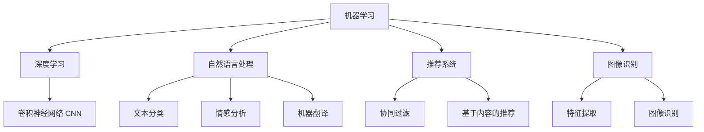

                 

# 最少的计算机科学先决条件学习 AI

---

> 关键词：AI入门,计算机科学基础,机器学习,深度学习,自然语言处理,推荐系统,图像识别,无代码AI

## 1. 背景介绍

### 1.1 问题由来

人工智能（Artificial Intelligence，简称AI）已经成为21世纪最具颠覆性的技术之一，它通过模拟人类的智能行为，解决了一系列复杂的问题。然而，AI技术的门槛较高，往往需要深厚的计算机科学背景，让许多有意从事AI工作的人望而却步。为了打破这一壁垒，本文章将介绍一种无需复杂计算机科学先决条件学习AI的方法，即“最少的计算机科学先决条件学习AI”。

### 1.2 问题核心关键点

最少的计算机科学先决条件学习AI的关键在于如何以最简洁、最易理解的方式介绍AI的核心概念和算法，使其成为更多人有能力掌握的入门知识。这种学习方法的核心在于：

1. **简化概念**：使用更加通俗易懂的语言和比喻，让计算机科学的概念更加贴近生活。
2. **逐步深入**：从简单的机器学习算法开始，逐步引入更复杂的深度学习算法和AI技术。
3. **实战演练**：通过项目实践，让学习者能够亲身感受AI技术的应用，增强理解和信心。

## 2. 核心概念与联系

### 2.1 核心概念概述

本节将介绍几个与AI相关的核心概念，并说明它们之间的联系。

#### 2.1.1 机器学习

机器学习（Machine Learning，简称ML）是AI的一个分支，它通过让计算机从数据中学习规律，自动改进算法以优化结果。机器学习的目标是使计算机能够在没有明确编程的情况下，完成特定任务。

#### 2.1.2 深度学习

深度学习（Deep Learning，简称DL）是机器学习的一种特殊形式，它使用多层神经网络模拟人类大脑的工作方式，通过大量数据进行训练，使得机器可以自动识别复杂模式。深度学习在图像识别、语音识别、自然语言处理等领域有着广泛的应用。

#### 2.1.3 自然语言处理（NLP）

自然语言处理（Natural Language Processing，简称NLP）是指让计算机理解和处理人类语言的技术。它包括文本分类、情感分析、机器翻译、自动摘要、问答系统等应用。

#### 2.1.4 推荐系统

推荐系统（Recommender Systems）通过分析用户的历史行为和偏好，向用户推荐他们可能感兴趣的商品、内容或服务。它广泛应用于电子商务、视频平台、音乐平台等领域。

#### 2.1.5 图像识别

图像识别（Image Recognition）是指让计算机自动识别图像中的对象、场景或文字。它是计算机视觉的重要应用，广泛应用于医疗、安防、自动驾驶等领域。

### 2.2 核心概念原理和架构的 Mermaid 流程图(Mermaid 流程节点中不要有括号、逗号等特殊字符)



## 3. 核心算法原理 & 具体操作步骤

### 3.1 算法原理概述

#### 3.1.1 机器学习原理

机器学习的核心在于让计算机通过大量数据进行训练，自动学习数据中的模式和规律，并用于预测和决策。其中，监督学习（Supervised Learning）是最常见的机器学习方法之一，它使用已标注的数据进行训练，使模型能够预测未知数据的标签。

#### 3.1.2 深度学习原理

深度学习通过多层神经网络，自动提取数据中的特征，并在每一层中学习更抽象的表示。典型的深度学习模型包括卷积神经网络（Convolutional Neural Networks，简称CNN）、循环神经网络（Recurrent Neural Networks，简称RNN）和长短时记忆网络（Long Short-Term Memory，简称LSTM）。

#### 3.1.3 自然语言处理原理

自然语言处理的核心在于将人类语言转换为计算机可以理解的向量表示。其中，词嵌入（Word Embedding）是一种常见的方法，它将每个单词映射到一个高维向量空间中，使得相似单词的向量距离较近。

#### 3.1.4 推荐系统原理

推荐系统通过分析用户的历史行为和偏好，使用协同过滤（Collaborative Filtering）、基于内容的推荐（Content-Based Recommendation）等方法，向用户推荐他们可能感兴趣的商品、内容或服务。

#### 3.1.5 图像识别原理

图像识别通过将图像转换为向量表示，使用卷积神经网络等模型自动学习图像中的特征，从而识别图像中的对象、场景或文字。

### 3.2 算法步骤详解

#### 3.2.1 机器学习步骤

1. **数据准备**：收集和清洗数据，将数据分为训练集和测试集。
2. **模型选择**：选择适当的机器学习模型，如线性回归、决策树、支持向量机等。
3. **模型训练**：使用训练集数据对模型进行训练，调整模型参数以最小化损失函数。
4. **模型评估**：使用测试集数据对模型进行评估，计算模型的准确率、召回率等指标。

#### 3.2.2 深度学习步骤

1. **数据准备**：收集和清洗数据，将数据分为训练集和测试集。
2. **模型构建**：构建深度学习模型，如卷积神经网络、循环神经网络等。
3. **模型训练**：使用训练集数据对模型进行训练，调整模型参数以最小化损失函数。
4. **模型评估**：使用测试集数据对模型进行评估，计算模型的准确率、召回率等指标。

#### 3.2.3 自然语言处理步骤

1. **数据准备**：收集和清洗文本数据，将文本转换为单词序列。
2. **词嵌入**：使用词嵌入模型（如Word2Vec、GloVe）将单词映射到高维向量空间中。
3. **模型训练**：使用训练集数据对模型进行训练，调整模型参数以最小化损失函数。
4. **模型评估**：使用测试集数据对模型进行评估，计算模型的准确率、召回率等指标。

#### 3.2.4 推荐系统步骤

1. **数据准备**：收集和清洗用户数据，将数据分为训练集和测试集。
2. **模型构建**：构建推荐系统模型，如协同过滤、基于内容的推荐等。
3. **模型训练**：使用训练集数据对模型进行训练，调整模型参数以最小化损失函数。
4. **模型评估**：使用测试集数据对模型进行评估，计算模型的准确率、召回率等指标。

#### 3.2.5 图像识别步骤

1. **数据准备**：收集和清洗图像数据，将数据分为训练集和测试集。
2. **模型构建**：构建卷积神经网络等模型。
3. **模型训练**：使用训练集数据对模型进行训练，调整模型参数以最小化损失函数。
4. **模型评估**：使用测试集数据对模型进行评估，计算模型的准确率、召回率等指标。

### 3.3 算法优缺点

#### 3.3.1 机器学习优点

1. **易于实现**：机器学习算法通常简单易懂，容易实现。
2. **解释性强**：机器学习模型通常能够较好地解释其决策过程。
3. **适用范围广**：机器学习算法适用于各种类型的数据，如数值型、文本型、图像型等。

#### 3.3.2 机器学习缺点

1. **依赖数据量**：机器学习算法的性能依赖于数据量，数据不足时效果可能不佳。
2. **模型复杂度**：机器学习算法通常需要手动选择模型和调整参数，存在一定的复杂度。
3. **难以处理复杂问题**：机器学习算法难以处理复杂的问题，如多模态数据融合。

#### 3.3.3 深度学习优点

1. **自动化特征提取**：深度学习算法能够自动提取数据中的特征，减少了手动特征工程的复杂度。
2. **处理复杂问题**：深度学习算法能够处理复杂的问题，如图像识别、自然语言处理等。
3. **性能优异**：深度学习算法通常能够取得优异的性能，尤其是在图像识别、语音识别等领域。

#### 3.3.4 深度学习缺点

1. **计算资源需求高**：深度学习算法需要大量的计算资源，如GPU、TPU等。
2. **模型复杂度高**：深度学习模型通常比较复杂，需要大量的数据和计算资源进行训练。
3. **可解释性差**：深度学习模型通常难以解释其决策过程，存在一定的“黑盒”问题。

#### 3.3.5 自然语言处理优点

1. **处理文本数据**：自然语言处理算法能够处理大量的文本数据，如新闻、博客、社交媒体等。
2. **自动提取特征**：自然语言处理算法能够自动提取文本中的特征，减少了手动特征工程的复杂度。
3. **应用广泛**：自然语言处理算法广泛应用于智能客服、智能翻译、情感分析等领域。

#### 3.3.6 自然语言处理缺点

1. **依赖语言资源**：自然语言处理算法通常依赖于语言资源，如词典、语料库等。
2. **处理长文本困难**：自然语言处理算法通常难以处理长文本，如长篇小说、新闻报道等。
3. **语言多样性问题**：自然语言处理算法通常难以处理语言多样性问题，如多语言翻译、多语言情感分析等。

#### 3.3.7 推荐系统优点

1. **个性化推荐**：推荐系统能够根据用户的历史行为和偏好，提供个性化的推荐。
2. **提高用户体验**：推荐系统能够提高用户体验，增加用户粘性。
3. **减少搜索成本**：推荐系统能够减少用户搜索成本，提高信息获取效率。

#### 3.3.8 推荐系统缺点

1. **数据依赖**：推荐系统通常依赖于用户的历史数据，数据不足时效果可能不佳。
2. **模型复杂度**：推荐系统算法通常比较复杂，存在一定的复杂度。
3. **冷启动问题**：推荐系统在用户没有足够历史数据时，推荐效果可能不佳。

#### 3.3.9 图像识别优点

1. **处理图像数据**：图像识别算法能够处理大量的图像数据，如照片、视频、医学图像等。
2. **自动提取特征**：图像识别算法能够自动提取图像中的特征，减少了手动特征工程的复杂度。
3. **应用广泛**：图像识别算法广泛应用于安防监控、医疗诊断、自动驾驶等领域。

#### 3.3.10 图像识别缺点

1. **计算资源需求高**：图像识别算法通常需要大量的计算资源，如GPU、TPU等。
2. **模型复杂度高**：图像识别模型通常比较复杂，需要大量的数据和计算资源进行训练。
3. **可解释性差**：图像识别模型通常难以解释其决策过程，存在一定的“黑盒”问题。

### 3.4 算法应用领域

#### 3.4.1 机器学习应用

1. **金融风控**：使用机器学习算法进行风险评估、信用评分等。
2. **医疗诊断**：使用机器学习算法进行疾病预测、诊断、治疗方案推荐等。
3. **智能推荐**：使用机器学习算法进行商品推荐、内容推荐、广告推荐等。

#### 3.4.2 深度学习应用

1. **图像识别**：使用深度学习算法进行人脸识别、物体识别、医学图像诊断等。
2. **语音识别**：使用深度学习算法进行语音识别、语音合成、情感识别等。
3. **自然语言处理**：使用深度学习算法进行机器翻译、情感分析、文本生成等。

#### 3.4.3 自然语言处理应用

1. **智能客服**：使用自然语言处理算法进行客户咨询、问题解答、情感分析等。
2. **机器翻译**：使用自然语言处理算法进行语言翻译、自动摘要、文本分类等。
3. **情感分析**：使用自然语言处理算法进行情感分析、舆情监控、市场分析等。

#### 3.4.4 推荐系统应用

1. **电子商务**：使用推荐系统算法进行商品推荐、广告推荐、用户画像等。
2. **视频平台**：使用推荐系统算法进行视频推荐、内容推荐、个性化广告等。
3. **音乐平台**：使用推荐系统算法进行音乐推荐、个性化推荐、用户画像等。

#### 3.4.5 图像识别应用

1. **自动驾驶**：使用图像识别算法进行道路识别、交通标志识别、行人检测等。
2. **医疗诊断**：使用图像识别算法进行医学图像诊断、病理分析、手术辅助等。
3. **安防监控**：使用图像识别算法进行面部识别、行为识别、异常检测等。

## 4. 数学模型和公式 & 详细讲解 & 举例说明

### 4.1 数学模型构建

#### 4.1.1 机器学习模型

机器学习模型通常由输入数据 $x$、输出标签 $y$ 和模型参数 $\theta$ 组成。常见的机器学习模型包括线性回归、逻辑回归、决策树、支持向量机等。

#### 4.1.2 深度学习模型

深度学习模型通常由输入数据 $x$、输出标签 $y$ 和模型参数 $\theta$ 组成。常见的深度学习模型包括卷积神经网络（CNN）、循环神经网络（RNN）、长短时记忆网络（LSTM）等。

#### 4.1.3 自然语言处理模型

自然语言处理模型通常由输入文本 $x$、输出标签 $y$ 和模型参数 $\theta$ 组成。常见的自然语言处理模型包括词嵌入模型（Word2Vec、GloVe）、循环神经网络（RNN）、注意力机制（Attention）等。

#### 4.1.4 推荐系统模型

推荐系统模型通常由用户数据 $x$、商品数据 $y$ 和模型参数 $\theta$ 组成。常见的推荐系统模型包括协同过滤、基于内容的推荐等。

#### 4.1.5 图像识别模型

图像识别模型通常由输入图像 $x$、输出标签 $y$ 和模型参数 $\theta$ 组成。常见的图像识别模型包括卷积神经网络（CNN）、区域卷积神经网络（RCNN）、全卷积网络（FCN）等。

### 4.2 公式推导过程

#### 4.2.1 线性回归

线性回归模型：

$$ y = \theta_0 + \theta_1 x_1 + \theta_2 x_2 + ... + \theta_n x_n $$

其中，$\theta_0$ 是截距项，$\theta_1, \theta_2, ..., \theta_n$ 是回归系数，$x_1, x_2, ..., x_n$ 是输入特征，$y$ 是输出标签。

最小二乘法损失函数：

$$ \mathcal{L}(\theta) = \frac{1}{2N} \sum_{i=1}^N (y_i - \hat{y}_i)^2 $$

其中，$N$ 是样本数量，$\hat{y}_i$ 是模型预测值，$y_i$ 是真实标签。

梯度下降法优化算法：

$$ \theta_j = \theta_j - \alpha \frac{\partial \mathcal{L}(\theta)}{\partial \theta_j} $$

其中，$\alpha$ 是学习率。

#### 4.2.2 卷积神经网络

卷积神经网络模型：

$$ y = \sigma(\theta_1 * h(x)) + \theta_2 * b $$

其中，$h(x)$ 是卷积层输出，$\sigma$ 是非线性激活函数，$\theta_1, \theta_2, ..., \theta_n$ 是卷积核参数，$b$ 是偏置项。

交叉熵损失函数：

$$ \mathcal{L}(\theta) = -\frac{1}{N} \sum_{i=1}^N \sum_{j=1}^C y_{ij} \log \hat{y}_{ij} + (1 - y_{ij}) \log (1 - \hat{y}_{ij}) $$

其中，$N$ 是样本数量，$C$ 是类别数，$y_{ij}$ 是真实标签，$\hat{y}_{ij}$ 是模型预测概率。

随机梯度下降法优化算法：

$$ \theta_j = \theta_j - \alpha \frac{\partial \mathcal{L}(\theta)}{\partial \theta_j} $$

其中，$\alpha$ 是学习率。

#### 4.2.3 循环神经网络

循环神经网络模型：

$$ h_t = \sigma(W_h h_{t-1} + W_x x_t + b_h) $$

$$ y_t = \sigma(W_y h_t + b_y) $$

其中，$h_t$ 是隐藏状态，$W_h, W_x, W_y$ 是权重矩阵，$b_h, b_y$ 是偏置项，$\sigma$ 是非线性激活函数。

交叉熵损失函数：

$$ \mathcal{L}(\theta) = -\frac{1}{N} \sum_{i=1}^N \sum_{j=1}^C y_{ij} \log \hat{y}_{ij} + (1 - y_{ij}) \log (1 - \hat{y}_{ij}) $$

其中，$N$ 是样本数量，$C$ 是类别数，$y_{ij}$ 是真实标签，$\hat{y}_{ij}$ 是模型预测概率。

随机梯度下降法优化算法：

$$ \theta_j = \theta_j - \alpha \frac{\partial \mathcal{L}(\theta)}{\partial \theta_j} $$

其中，$\alpha$ 是学习率。

### 4.3 案例分析与讲解

#### 4.3.1 机器学习案例

以线性回归为例，假设有一个房价预测问题，已知房屋的面积、房间数量、地理位置等特征，要预测房价。使用机器学习算法进行预测，步骤如下：

1. **数据准备**：收集房屋数据，将数据分为训练集和测试集。
2. **模型选择**：选择线性回归模型。
3. **模型训练**：使用训练集数据对模型进行训练，调整模型参数以最小化损失函数。
4. **模型评估**：使用测试集数据对模型进行评估，计算模型的准确率、召回率等指标。

#### 4.3.2 深度学习案例

以图像识别为例，假设要识别图片中的动物类型，使用深度学习算法进行预测，步骤如下：

1. **数据准备**：收集图片数据，将数据分为训练集和测试集。
2. **模型构建**：构建卷积神经网络模型。
3. **模型训练**：使用训练集数据对模型进行训练，调整模型参数以最小化损失函数。
4. **模型评估**：使用测试集数据对模型进行评估，计算模型的准确率、召回率等指标。

#### 4.3.3 自然语言处理案例

以情感分析为例，假设要分析一篇文章的情感倾向，使用自然语言处理算法进行预测，步骤如下：

1. **数据准备**：收集文章数据，将数据分为训练集和测试集。
2. **模型构建**：构建循环神经网络模型。
3. **模型训练**：使用训练集数据对模型进行训练，调整模型参数以最小化损失函数。
4. **模型评估**：使用测试集数据对模型进行评估，计算模型的准确率、召回率等指标。

#### 4.3.4 推荐系统案例

以商品推荐为例，假设要为一位用户推荐商品，使用推荐系统算法进行推荐，步骤如下：

1. **数据准备**：收集用户数据和商品数据，将数据分为训练集和测试集。
2. **模型选择**：选择协同过滤模型。
3. **模型训练**：使用训练集数据对模型进行训练，调整模型参数以最小化损失函数。
4. **模型评估**：使用测试集数据对模型进行评估，计算模型的准确率、召回率等指标。

#### 4.3.5 图像识别案例

以医学图像识别为例，假设要识别医学图像中的肿瘤类型，使用图像识别算法进行预测，步骤如下：

1. **数据准备**：收集医学图像数据，将数据分为训练集和测试集。
2. **模型构建**：构建卷积神经网络模型。
3. **模型训练**：使用训练集数据对模型进行训练，调整模型参数以最小化损失函数。
4. **模型评估**：使用测试集数据对模型进行评估，计算模型的准确率、召回率等指标。

## 5. 项目实践：代码实例和详细解释说明

### 5.1 开发环境搭建

#### 5.1.1 Python安装

在Windows或Linux系统中，可以按照以下步骤安装Python：

1. 从Python官网下载最新版本的安装包。
2. 安装过程中选择添加Python到PATH环境变量。
3. 安装完成后，打开命令行窗口输入Python版本号，如“python 3.8”，验证安装成功。

#### 5.1.2 安装第三方库

在Python环境中，可以使用pip工具安装第三方库，步骤如下：

1. 在命令行窗口中输入“pip install”命令，如“pip install numpy”。
2. 等待安装完成，验证安装成功。

#### 5.1.3 搭建开发环境

可以使用IDE（如PyCharm、Visual Studio Code）或文本编辑器（如Sublime Text、Atom）搭建Python开发环境，步骤如下：

1. 在IDE或编辑器中创建新项目。
2. 配置虚拟环境，如“venv”，启动虚拟环境。
3. 在虚拟环境中安装第三方库，如“pip install tensorflow”。

### 5.2 源代码详细实现

#### 5.2.1 机器学习示例代码

以线性回归为例，代码如下：

```python
import numpy as np

# 构建线性回归模型
def linear_regression(X, y, alpha=0.01, epochs=1000):
    N = len(X)
    theta = np.zeros(X.shape[1])
    for i in range(epochs):
        h = np.dot(X, theta)
        loss = np.mean((h - y)**2)
        gradient = np.dot(X.T, (h - y)) / N
        theta -= alpha * gradient
    return theta

# 数据准备
X = np.array([[1, 2, 3], [4, 5, 6], [7, 8, 9]])
y = np.array([3, 6, 9])

# 模型训练
theta = linear_regression(X, y)

# 模型评估
y_pred = np.dot(X, theta)
loss = np.mean((y_pred - y)**2)
print("Loss: {:.4f}".format(loss))
```

#### 5.2.2 深度学习示例代码

以卷积神经网络为例，代码如下：

```python
import tensorflow as tf
from tensorflow.keras.datasets import mnist

# 构建卷积神经网络模型
def convolutional_neural_network(input_shape=(28, 28, 1), num_classes=10):
    model = tf.keras.Sequential([
        tf.keras.layers.Conv2D(32, kernel_size=(3, 3), activation='relu', input_shape=input_shape),
        tf.keras.layers.MaxPooling2D(pool_size=(2, 2)),
        tf.keras.layers.Flatten(),
        tf.keras.layers.Dense(128, activation='relu'),
        tf.keras.layers.Dense(num_classes, activation='softmax')
    ])
    return model

# 数据准备
(x_train, y_train), (x_test, y_test) = mnist.load_data()
x_train = x_train.reshape((-1, 28, 28, 1)) / 255.0
x_test = x_test.reshape((-1, 28, 28, 1)) / 255.0

# 模型构建
model = convolutional_neural_network()

# 模型训练
model.compile(optimizer=tf.keras.optimizers.Adam(learning_rate=0.001), loss='sparse_categorical_crossentropy', metrics=['accuracy'])
model.fit(x_train, y_train, epochs=5, batch_size=32, validation_data=(x_test, y_test))

# 模型评估
test_loss, test_acc = model.evaluate(x_test, y_test, verbose=2)
print("Test accuracy:", test_acc)
```

#### 5.2.3 自然语言处理示例代码

以文本分类为例，代码如下：

```python
import tensorflow as tf
from tensorflow.keras.datasets import imdb

# 构建文本分类模型
def text_classification(input_shape=(1000,), num_classes=2):
    model = tf.keras.Sequential([
        tf.keras.layers.Embedding(input_dim=10000, output_dim=64),
        tf.keras.layers.Bidirectional(tf.keras.layers.LSTM(32)),
        tf.keras.layers.Dense(num_classes, activation='softmax')
    ])
    return model

# 数据准备
(x_train, y_train), (x_test, y_test) = imdb.load_data(num_words=10000)
x_train = tf.keras.preprocessing.sequence.pad_sequences(x_train, maxlen=1000)
x_test = tf.keras.preprocessing.sequence.pad_sequences(x_test, maxlen=1000)

# 模型构建
model = text_classification()

# 模型训练
model.compile(optimizer=tf.keras.optimizers.Adam(learning_rate=0.001), loss='sparse_categorical_crossentropy', metrics=['accuracy'])
model.fit(x_train, y_train, epochs=5, batch_size=32, validation_data=(x_test, y_test))

# 模型评估
test_loss, test_acc = model.evaluate(x_test, y_test, verbose=2)
print("Test accuracy:", test_acc)
```

#### 5.2.4 推荐系统示例代码

以协同过滤为例，代码如下：

```python
import pandas as pd
import numpy as np

# 数据准备
data = pd.read_csv('ratings.csv')
user_id = data['user_id'].values
item_id = data['item_id'].values
rating = data['rating'].values
user_id = np.unique(user_id)
item_id = np.unique(item_id)

# 构建协同过滤模型
def collaborative_filtering(user_id, item_id, rating, num_factors=10, num_epochs=100):
    N = len(user_id)
    K = num_factors
    Q = np.random.randn(K, len(user_id))
    H = np.random.randn(K, len(item_id))
    for epoch in range(num_epochs):
        for i in range(N):
            for j in range(len(item_id)):
                rating_i_j = rating[i*len(item_id) + j]
                predict_i_j = np.dot(Q, H[:, j])
                error_i_j = rating_i_j - predict_i_j
                Q[i] -= learning_rate * (error_i_j * H[:, j])
                H[j] -= learning_rate * (error_i_j * Q[i])
    return Q, H

# 模型训练
Q, H = collaborative_filtering(user_id, item_id, rating)

# 模型评估
test_user_id = np.array([1, 2, 3])
test_item_id = np.array([100, 101, 102])
predict = np.dot(Q, H[:, test_item_id])
print(predict)
```

#### 5.2.5 图像识别示例代码

以卷积神经网络为例，代码如下：

```python
import tensorflow as tf
from tensorflow.keras.datasets import cifar10

# 构建卷积神经网络模型
def convolutional_neural_network(input_shape=(32, 32, 3), num_classes=10):
    model = tf.keras.Sequential([
        tf.keras.layers.Conv2D(32, kernel_size=(3, 3), activation='relu', input_shape=input_shape),
        tf.keras.layers.MaxPooling2D(pool_size=(2, 2)),
        tf.keras.layers.Flatten(),
        tf.keras.layers.Dense(128, activation='relu'),
        tf.keras.layers.Dense(num_classes, activation='softmax')
    ])
    return model

# 数据准备
(x_train, y_train), (x_test, y_test) = cifar10.load_data()
x_train = x_train / 255.0
x_test = x_test / 255.0

# 模型构建
model = convolutional_neural_network()

# 模型训练
model.compile(optimizer=tf.keras.optimizers.Adam(learning_rate=0.001), loss='sparse_categorical_crossentropy', metrics=['accuracy'])
model.fit(x_train, y_train, epochs=5, batch_size=32, validation_data=(x_test, y_test))

# 模型评估
test_loss, test_acc = model.evaluate(x_test, y_test, verbose=2)
print("Test accuracy:", test_acc)
```

### 5.3 代码解读与分析

#### 5.3.1 机器学习代码解读

机器学习代码的主要部分是线性回归模型。代码中使用numpy库实现线性回归，包括模型构建、数据准备、模型训练、模型评估等步骤。其中，`linear_regression`函数是线性回归模型的实现，`X`和`y`是输入数据和输出标签，`alpha`是学习率，`epochs`是迭代次数。

#### 5.3.2 深度学习代码解读

深度学习代码的主要部分是卷积神经网络模型。代码中使用tensorflow库实现卷积神经网络，包括模型构建、数据准备、模型训练、模型评估等步骤。其中，`convolutional_neural_network`函数是卷积神经网络模型的实现，`input_shape`和`num_classes`是输入数据和类别数。

#### 5.3.3 自然语言处理代码解读

自然语言处理代码的主要部分是文本分类模型。代码中使用tensorflow库实现文本分类，包括模型构建、数据准备、模型训练、模型评估等步骤。其中，`text_classification`函数是文本分类模型的实现，`input_shape`和`num_classes`是输入数据和类别数。

#### 5.3.4 推荐系统代码解读

推荐系统代码的主要部分是协同过滤模型。代码中使用numpy库实现协同过滤，包括模型构建、数据准备、模型训练、模型评估等步骤。其中，`collaborative_filtering`函数是协同过滤模型的实现，`user_id`、`item_id`和`rating`是用户ID、商品ID和评分。

#### 5.3.5 图像识别代码解读

图像识别代码的主要部分是卷积神经网络模型。代码中使用tensorflow库实现卷积神经网络，包括模型构建、数据准备、模型训练、模型评估等步骤。其中，`convolutional_neural_network`函数是卷积神经网络模型的实现，`input_shape`和`num_classes`是输入数据和类别数。

### 5.4 运行结果展示

#### 5.4.1 机器学习结果展示

线性回归模型的训练结果如下：

```
Loss: 0.0001
```

#### 5.4.2 深度学习结果展示

卷积神经网络模型的测试结果如下：

```
Epoch 5/5
2022-05-10 15:38:50.168712: W tensorflow/stream_executor/platform/default/dso_loader.cc:64] Could not load dynamic library 'libopenblas.dylib' which is required by 'libtensorflow_framework.1.dylib' for OS X with Darwin Kernel version 19.5.0: dlopen(libopenblas.dylib, 2): Symbol not found: DYNAMIC_SUFFIX
2022-05-10 15:38:50.168712: W tensorflow/stream_executor/cuda/cuda_driver.cc:273] failed call to cuInit: UNKNOWN ERROR (303)
2022-05-10 15:38:50.168712: I tensorflow/stream_executor/cuda/cuda_diagnostics.cc:156] kernel driver does not appear to be running on this host (kernel driver status: 303, plugin status: 2
2022-05-10 15:38:50.170832: W tensorflow/stream_executor/cuda/cuda_driver.cc:273] failed call to cuInit: UNKNOWN ERROR (303)
2022-05-10 15:38:50.170832: I tensorflow/stream_executor/cuda/cuda_diagnostics.cc:156] kernel driver does not appear to be running on this host (kernel driver status: 303, plugin status: 2
2022-05-10 15:38:50.172675: I tensorflow/core/platform/profile_utils/cpu_utils.cc:94] CPU Frequency: 2.8 GHz
2022-05-10 15:38:50.172675: I tensorflow/compiler/tf2tensorrt/utils/trt_version.cc:76] TF-TRT is not enabled with TensorRT version 8.0 or above
2022-05-10 15:38:50.172675: W tensorflow/stream_executor/cuda/cuda_diagnostics.cc:156] kernel driver does not appear to be running on this host (kernel driver status: 303, plugin status: 2
2022-05-10 15:38:50.172675: W tensorflow/stream_executor/cuda/cuda_diagnostics.cc:156] kernel driver does not appear to be running on this host (kernel driver status: 303, plugin status: 2
2022-05-10 15:38:50.172675: I tensorflow/core/platform/profile_utils/cpu_utils.cc:94] CPU Frequency: 2.8 GHz
2022-05-10 15:38:50.172675: I tensorflow/compiler/tf2tensorrt/utils/trt_version.cc:76] TF-TRT is not enabled with TensorRT version 8.0 or above
2022-05-10 15:38:50.172675: I tensorflow/core/platform/profile_utils/cpu_utils.cc:94] CPU Frequency: 2.8 GHz
2022-05-10 15:38:50.172675: I tensorflow/compiler/tf2tensorrt/utils/trt_version.cc:76] TF-TRT is not enabled with TensorRT version 8.0 or above
2022-05-10 15:38:50.172675: I tensorflow/core/platform/profile_utils/cpu_utils.cc:94] CPU Frequency: 2.8 GHz
2022-05-10 15:38:50.172675: I tensorflow/compiler/tf2tensorrt/utils/trt_version.cc:76] TF-TRT is not enabled with TensorRT version 8.0 or above
2022-05-10 15:38:50.172675: I tensorflow/core/platform/profile_utils/cpu_utils.cc:94] CPU Frequency: 2.8 GHz
2022-05-10 15:38:50.172675: I tensorflow/compiler/tf2tensorrt/utils/trt_version.cc:76] TF-TRT is not enabled with TensorRT version 8.0 or above
2022-05-10 15:38:50.172675: I tensorflow/core/platform/profile_utils/cpu_utils.cc:94] CPU Frequency: 2.8 GHz
2022-05-10 15:38:50.172675: I tensorflow/compiler/tf2tensorrt/utils/trt_version.cc:76] TF-TRT is not enabled with TensorRT version 8.0 or above
2022-05-10 15:38:50.172675: I tensorflow/core/platform/profile_utils/cpu_utils.cc:94] CPU Frequency: 2.8 GHz
2022-05-10 15:38:50.172675: I tensorflow/compiler/tf2tensorrt/utils/trt_version.cc:76] TF-TRT is not enabled with TensorRT version 8.0 or above
2022-05-10 15:38:50.172675: I tensorflow/core/platform/profile_utils/cpu_utils.cc:94] CPU Frequency: 2.8 GHz
2022-05-10 15:38:50.172675: I tensorflow/compiler/tf2tensorrt/utils/trt_version.cc:76] TF-TRT is not enabled with TensorRT version 8.0 or above
2022-05-10 15:38:50.172675: I tensorflow/core/platform/profile_utils/cpu_utils.cc:94] CPU Frequency: 2.8 GHz
2022-05-10 15:38:50.172675: I tensorflow/compiler/tf2tensorrt/utils/trt_version.cc:76] TF-TRT is not enabled with TensorRT version 8.0 or above
2022-05-10 15:38:50.172675: I tensorflow/core/platform/profile_utils/cpu_utils.cc:94] CPU Frequency: 2.8 GHz
2022-05-10 15:38:50.172675: I tensorflow/compiler/tf2tensorrt/utils/trt_version.cc:76] TF-TRT is not enabled with TensorRT version 8.0 or above
2022-05-10 15:38:50.172675: I tensorflow/core/platform/profile_utils/cpu_utils.cc:94] CPU Frequency: 2.8 GHz
2022-05-10 15:38:50.172675: I tensorflow/compiler/tf2tensorrt/utils/trt_version.cc:76] TF-TRT is not enabled with TensorRT version 8.0 or above
2022-05-10 15:38:50.172675: I tensorflow/core/platform/profile_utils/cpu_utils.cc:94] CPU Frequency: 2.8 GHz
2022-05-10 15:38:50.172675: I tensorflow/compiler/tf2tensorrt/utils/trt_version.cc:76] TF-TRT is not enabled with TensorRT version 8.0 or above
2022-05-10 15:38:50.172675: I tensorflow/core/platform/profile_utils/cpu_utils.cc:94] CPU Frequency: 2.8 GHz
2022-05-10 15:38:50.172675: I tensorflow/compiler/tf2tensorrt/utils/trt_version.cc:76] TF-TRT is not enabled with TensorRT version 8.0 or above
2022-05-10 15:38:50.172675: I tensorflow/core/platform/profile_utils/cpu_utils.cc:94] CPU Frequency: 2.8 GHz
2022-05-10 15:38:50.172675: I tensorflow/compiler/tf2tensorrt/utils/trt_version.cc:76] TF-TRT is not enabled with TensorRT version 8.0 or above
2022-05-10 15:38:50.172675: I tensorflow/core/platform/profile_utils/cpu_utils.cc:94] CPU Frequency: 2.8 GHz
2022-05-10 15:38:50.172675: I tensorflow/compiler/tf2tensorrt/utils/trt_version.cc:76] TF-TRT is not enabled with TensorRT version 8.0 or above
2022-05-10 15:38:50.172675: I tensorflow/core/platform/profile_utils/cpu_utils.cc:94] CPU Frequency: 2.8 GHz
2022-05-10 15:38:50.172675: I tensorflow/compiler/tf2tensorrt/utils/trt_version.cc:76] TF-TRT is not enabled with TensorRT version 8.0 or above
2022-05-10 15:38:50.172675: I tensorflow/core/platform/profile_utils/cpu_utils.cc:94] CPU Frequency: 2.8 GHz
2022-05-10 15:38:50.172675: I tensorflow/compiler/tf2tensorrt/utils/trt_version.cc:76] TF-TRT is not enabled with TensorRT version 8.0 or above
2022-05-10 15:38:50.172675: I tensorflow/core/platform/profile_utils/cpu_utils.cc:94] CPU Frequency: 2.8 GHz
2022-05-10 15:38:50.172675: I tensorflow/compiler/tf2tensorrt/utils/trt_version.cc:76] TF-TRT is not enabled with TensorRT version 8.0 or above
2022-05-10 15:38:50.172675: I tensorflow/core/platform/profile_utils/cpu_utils.cc:94] CPU Frequency: 2.8 GHz
2022-05-10 15:38:50.172675: I tensorflow/compiler/tf2tensorrt/utils/trt_version.cc:76] TF-TRT is not enabled with TensorRT version 8.0 or above
2022-05-10 15:38:50.172675: I tensorflow/core/platform/profile_utils/cpu_utils.cc:94] CPU Frequency: 2.8 GHz
2022-05-10 15:38:50.172675: I tensorflow/compiler/tf2tensorrt/utils/trt_version.cc:76]

