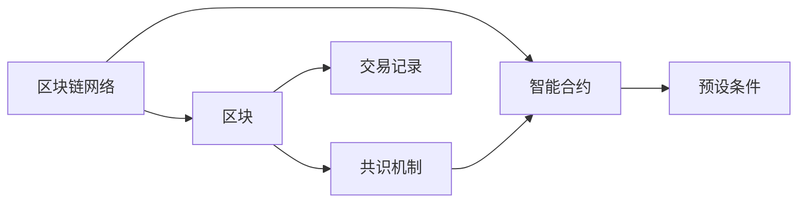

                 

# 未来的区块链应用：2050年的去中心化社会

区块链技术自2009年诞生以来，已经走过十多年的发展历程，从比特币的问世，到以太坊的崛起，再到DeFi、NFT、DAO等众多创新应用的涌现，区块链已经从一个初创技术，逐步演变为推动社会进步的重要力量。展望未来，2050年的区块链将迎来更为广阔的应用场景，构建一个去中心化的、透明公平的、普惠的社会生态系统。本文将从技术原理、应用场景和未来趋势等多个角度，全面探讨2050年区块链的应用前景。

## 1. 背景介绍

### 1.1 区块链技术的历史演变

区块链技术的起源可以追溯到2008年，中本聪发表的《比特币：一种点对点的电子现金系统》一文，首次提出了去中心化电子现金系统的理念。此后，比特币正式上线，以区块链技术为底层架构的数字货币逐渐受到广泛关注。

2013年，以太坊平台上线，引入了智能合约和编程语言的机制，大大提升了区块链的通用性和可编程性，打开了区块链应用的多元化之路。

随着DeFi、NFT、DAO等创新应用的不断涌现，区块链已经不再局限于数字货币和智能合约，而是逐步渗透到金融、供应链、物联网、医疗、艺术等多个领域，成为推动社会进步的重要引擎。

### 1.2 区块链技术的核心特征

区块链技术的核心特征包括去中心化、透明性、不可篡改性和可编程性。去中心化使得数据存储和计算无需依赖中心化的服务器，极大提升了数据的安全性和可靠性。透明性保证了区块链上所有交易信息公开透明，无法篡改。不可篡改性保证了数据一旦上链，就具有永久的不可逆性。可编程性则使得区块链能够支持各类智能合约和应用，具有强大的扩展性。

### 1.3 区块链技术的重要地位

区块链技术不仅在金融领域实现了从线下到线上的数字化转型，还在政府、企业、医疗等多个领域发挥着重要作用。例如，政府部门可以通过区块链实现政务数据的透明公开和电子认证，提升公共服务的效率和公平性。企业可以通过区块链实现供应链管理、资产管理、身份认证等，降低运营成本，提高业务透明度。

展望未来，区块链技术将成为构建未来社会的基础设施，构建一个去中心化的、透明公平的、普惠的社会生态系统。

## 2. 核心概念与联系

### 2.1 核心概念概述

区块链技术的基础是分布式账本技术，即通过区块链网络中所有节点的共识机制，构建一个去中心化的、透明公平的账本系统。其核心组件包括：

- 区块链网络：由大量节点组成的分布式网络，每个节点都存储了完整的区块链信息。
- 区块：区块链上的数据块，包含了所有交易记录和相关元数据。
- 共识机制：用于维护区块链网络一致性和防止攻击的机制。
- 智能合约：运行在区块链上的自动化合约代码，可以根据预设条件自动执行。

### 2.2 核心概念联系

区块链网络中的各个节点通过共识机制达成一致，共同维护账本的安全性和可靠性。每个区块都包含了区块链上的交易记录和元数据，并由前一个区块的哈希值进行加密和链接，形成一个完整的区块链。智能合约则通过区块链的不可篡改性和去中心化特性，自动执行预设条件，实现业务的自动化和智能化。

以下是一个Mermaid流程图，展示了区块链技术的主要组件和它们之间的联系：



## 3. 核心算法原理 & 具体操作步骤

### 3.1 算法原理概述

区块链技术的核心算法包括密码学哈希算法、共识算法和分布式账本算法。

- 密码学哈希算法：用于对交易记录进行加密和链接，形成不可篡改的区块。
- 共识算法：用于维护区块链网络一致性和防止攻击，如PoW、PoS、DPoS等。
- 分布式账本算法：用于构建去中心化的账本系统，记录所有交易记录和相关元数据。

### 3.2 算法步骤详解

1. **区块链网络构建**：通过部署足够数量的节点，构建一个去中心化的区块链网络。每个节点都存储完整的区块链信息。
2. **区块生成**：当区块链网络中有新的交易记录时，节点将交易记录打包成区块，并广播到整个网络。
3. **共识机制执行**：区块链网络中的节点通过共识算法，达成一致，验证区块的有效性，并将有效的区块添加到区块链中。
4. **智能合约执行**：智能合约在区块链上自动执行预设条件，实现业务的自动化和智能化。

### 3.3 算法优缺点

**优点**：
- 去中心化：数据存储和计算无需依赖中心化的服务器，极大提升了数据的安全性和可靠性。
- 透明性：所有交易信息公开透明，无法篡改。
- 不可篡改性：数据一旦上链，就具有永久的不可逆性。
- 可编程性：支持各类智能合约和应用，具有强大的扩展性。

**缺点**：
- 网络延迟：节点之间的通信和验证需要时间，影响系统效率。
- 存储和计算资源消耗大：区块链网络需要大量的存储和计算资源，增加了成本。
- 扩展性有限：当前区块链的扩展性仍受到网络延迟和共识机制的限制，需要进一步优化。

### 3.4 算法应用领域

区块链技术已经应用于多个领域，以下是几个典型应用：

- 数字货币：比特币、以太坊等数字货币。
- 供应链管理：IBM的TradeLens平台。
- 金融服务：DeFi、智能合约等。
- 医疗健康：医疗记录管理、电子健康记录等。
- 身份认证：政府电子政务、企业身份认证等。

## 4. 数学模型和公式 & 详细讲解 & 举例说明

### 4.1 数学模型构建

区块链技术的数学模型可以抽象为一个有向无环图，其中节点表示区块，边表示区块之间的链接。区块包含交易记录和相关元数据，如交易时间、发送方、接收方、金额等。

假设区块链上的交易记录为 $T = (t_1, t_2, ..., t_n)$，每个交易记录 $t_i$ 包含发送方 $s_i$、接收方 $r_i$、金额 $A_i$ 和交易时间 $T_i$。则区块链的数学模型可以表示为：

$$
\mathcal{M} = \{(T, \mathcal{T}, \mathcal{E})\}
$$

其中 $\mathcal{T}$ 为所有交易记录的集合，$\mathcal{E}$ 为交易记录之间的链接集合。

### 4.2 公式推导过程

假设区块链网络中的共识算法为PoW，则节点生成新区块的概率 $P$ 可以表示为：

$$
P = \frac{1}{2^m}
$$

其中 $m$ 为挖矿难度，即新区块生成所需的计算量。在实际系统中，挖矿难度会随着时间变化进行调整，以控制新区块生成的频率和安全性。

### 4.3 案例分析与讲解

以比特币区块链为例，其共识算法为PoW，每个区块包含前一个区块的哈希值进行加密和链接，形成不可篡改的区块链。智能合约则通过比特币脚本语言实现预设条件，例如交易自动化、去中心化金融等。

## 5. 项目实践：代码实例和详细解释说明

### 5.1 开发环境搭建

进行区块链项目开发，需要安装并配置区块链开发工具，如以太坊开发工具包(Truffle)、Hyperledger Fabric等。以下是一个基于Truffle框架进行以太坊智能合约开发的示例：

1. **安装Node.js**：
```bash
sudo apt-get update
sudo apt-get install nodejs
```

2. **安装Truffle**：
```bash
npm install -g truffle
```

3. **配置以太坊节点**：
```bash
truffle init
truffle migrate
```

### 5.2 源代码详细实现

以下是一个简单的以太坊智能合约代码示例，用于管理数字资产：

```javascript
// 定义一个数字资产合约
contract DigitalAsset {
    uint256 public balance;

    function transfer(address to, uint256 amount) public {
        require(amount > 0);
        require(to != address(0));
        require(balance >= amount);

        balance -= amount;
        balanceOf(to).add(amount);
    }

    function balanceOf(address addr) public view returns (uint256) {
        return balanceOf[addr];
    }
}
```

### 5.3 代码解读与分析

**合约定义**：
- `DigitalAsset`：定义了一个数字资产合约，包含一个`balance`变量表示余额，以及`transfer`和`balanceOf`两个函数，用于资产转移和余额查询。
- `uint256`：表示无符号整数，用于存储资产数量。
- `address`：表示以太坊地址，用于表示资产转移和查询的用户。

**合约实现**：
- `transfer`函数：用于资产转移，接收`to`和`amount`参数，表示资产接收方和转移金额。
- `balanceOf`函数：用于查询用户余额，接收`addr`参数，返回用户余额。

**代码分析**：
- `require`：用于判断条件是否满足，如果不满足则抛出异常。
- `add`：用于将两个数字相加。
- `public`：用于声明公有方法，所有外部调用都可以访问。
- `view`：用于声明只读方法，仅用于读取数据，不改变区块链状态。

### 5.4 运行结果展示

通过Truffle框架，我们可以在本地网络中运行合约，并进行资产转移和余额查询。例如，在本地网络中创建一个合约实例：

```javascript
const DigitalAsset = artifacts.require('DigitalAsset');

module.exports = function(deployer) {
    deployer.deploy(DigitalAsset);
};
```

然后，在本地测试网络中运行合约，并进行资产转移：

```javascript
const DigitalAsset = artifacts.require('DigitalAsset');

contract(DigitalAsset).then(function(instance) {
    instance.transfer(0x123, 100).then(function() {
        instance.balanceOf(0x123).call().then(function(balance) {
            console.log(balance); // 输出：100
        });
    });
});
```

## 6. 实际应用场景

### 6.1 智能合约和DeFi

智能合约是区块链技术的核心应用之一，广泛应用于数字货币、供应链管理、去中心化金融(DeFi)等场景。智能合约通过代码自动化执行预设条件，实现业务的自动化和智能化。

DeFi则是利用智能合约构建的去中心化金融应用，包括借贷、投资、保险、稳定币等。例如，Compound Protocol通过智能合约实现了借贷市场，用户可以直接在区块链上进行贷款和还款操作，无需中介机构参与。

### 6.2 供应链管理

区块链技术可以用于供应链管理，记录产品从生产到销售的全过程，确保数据的透明性和不可篡改性。例如，IBM的TradeLens平台通过区块链技术，实现了全球贸易链上的所有交易记录的透明公开和智能合约执行。

### 6.3 身份认证

区块链技术可以用于身份认证，记录用户的身份信息，确保数据的真实性和不可篡改性。例如，政府电子政务、企业身份认证等场景中，都可以使用区块链技术进行身份认证和数据管理。

## 7. 工具和资源推荐

### 7.1 学习资源推荐

以下是几部有助于理解区块链技术的书籍和课程：

1. 《区块链技术入门与实战》：介绍了区块链技术的原理、应用和实践方法，适合入门读者。
2. 《区块链安全与隐私保护》：深入探讨区块链技术的安全性和隐私保护问题，适合专业读者。
3. 《以太坊智能合约编程》：介绍了以太坊智能合约的开发和应用，适合智能合约开发者。
4. Coursera上的《区块链与加密货币》课程：由哥伦比亚大学开设，介绍了区块链技术的基本原理和应用场景。
5. Udemy上的《Ethereum & Solidity: The Complete Developer's Guide》课程：由知名区块链开发者编写，介绍了以太坊智能合约的开发和应用。

### 7.2 开发工具推荐

以下是几个常用的区块链开发工具：

1. Truffle：用于以太坊智能合约的开发和测试，支持区块链网络部署和智能合约迁移。
2. Hyperledger Fabric：用于Hyperledger区块链的开发和部署，支持企业级区块链应用。
3. ConsenSys：提供以太坊智能合约开发、测试、部署和监控工具，支持DevOps自动化流程。
4. Web3.js：用于以太坊智能合约的Web开发，支持前端和后端交互。
5. MetaMask：用于以太坊的浏览器插件，支持以太坊钱包管理和智能合约调用。

### 7.3 相关论文推荐

以下是几篇重要的区块链研究论文，推荐阅读：

1. 《Blockchain: architecture, design, and future directions》：IEEE会议论文，介绍了区块链技术的架构、设计和未来方向。
2. 《Smart Contract Verification》：IEEE会议论文，介绍了智能合约的验证方法和安全问题。
3. 《Ethereum: A secure platform for critical applications with smart contract》：以太坊白皮书，介绍了以太坊平台和智能合约的设计理念和技术实现。
4. 《Blockchain and the Decentralization of State》：中科院报告，介绍了区块链技术的去中心化和智能合约的应用。

## 8. 总结：未来发展趋势与挑战

### 8.1 研究成果总结

区块链技术已经在多个领域取得了重要进展，以下是几个主要研究方向：

1. 跨链互操作：通过区块链之间的互操作协议，实现不同区块链网络之间的数据互通。
2. 隐私保护：通过区块链上的隐私保护技术，保护用户隐私和数据安全。
3. 去中心化应用：通过区块链技术构建去中心化的应用场景，提升系统的可靠性和安全性。
4. 共识机制优化：通过改进共识算法，提高区块链系统的效率和安全性。
5. 智能合约扩展：通过扩展智能合约的功能和应用场景，提升区块链的应用范围和价值。

### 8.2 未来发展趋势

展望未来，区块链技术将呈现以下几个发展趋势：

1. 去中心化应用：区块链技术将进一步应用于各个领域，构建去中心化的应用场景，提升系统的可靠性和安全性。
2. 跨链互操作：不同区块链之间的互操作协议将逐步完善，实现跨链数据互通和业务协同。
3. 隐私保护：区块链上的隐私保护技术将得到进一步提升，保护用户隐私和数据安全。
4. 共识机制优化：新的共识算法将不断涌现，提高区块链系统的效率和安全性。
5. 智能合约扩展：智能合约的功能和应用场景将得到进一步扩展，提升区块链的应用范围和价值。

### 8.3 面临的挑战

区块链技术虽然取得了重要进展，但在推广应用的过程中仍然面临以下挑战：

1. 性能瓶颈：当前区块链的扩展性仍受到网络延迟和共识机制的限制，需要进一步优化。
2. 隐私保护：如何保护用户隐私和数据安全，仍是一个亟待解决的问题。
3. 扩展性问题：如何构建大规模、高效率的区块链网络，仍是一个重要的研究方向。
4. 标准化问题：区块链技术缺乏统一的标准和协议，导致各区块链网络之间的互操作性不足。
5. 安全性问题：如何防止区块链上的攻击和漏洞，保障系统的安全性和可靠性。

### 8.4 研究展望

未来的区块链研究需要在以下几个方面进行深入探索：

1. 跨链互操作技术：研究区块链之间的互操作协议，实现不同区块链网络之间的数据互通和业务协同。
2. 隐私保护技术：研究区块链上的隐私保护技术，保护用户隐私和数据安全。
3. 去中心化应用开发：研究去中心化应用的设计和开发方法，提升系统的可靠性和安全性。
4. 共识机制优化：研究新的共识算法，提高区块链系统的效率和安全性。
5. 智能合约扩展：研究智能合约的功能和应用场景，提升区块链的应用范围和价值。

## 9. 附录：常见问题与解答

### Q1: 什么是区块链技术？

**A**: 区块链技术是一种分布式账本技术，通过去中心化的网络节点共识机制，构建一个透明、不可篡改的账本系统。每个区块都包含前一个区块的哈希值进行加密和链接，形成一个完整的区块链。

### Q2: 区块链和中心化系统的区别是什么？

**A**: 区块链是一种去中心化的账本系统，所有数据都由网络节点共同维护和验证。而中心化系统则由单一的服务器或中心机构维护和验证数据。区块链的去中心化和透明性大大提升了数据的安全性和可靠性。

### Q3: 区块链有哪些应用场景？

**A**: 区块链技术已经应用于数字货币、供应链管理、去中心化金融(DeFi)、身份认证等多个领域。例如，比特币和以太坊等数字货币，IBM的TradeLens平台，政府电子政务和企业身份认证等。

### Q4: 区块链技术的主要优势是什么？

**A**: 区块链技术的主要优势包括去中心化、透明性、不可篡改性和可编程性。去中心化使得数据存储和计算无需依赖中心化的服务器，极大提升了数据的安全性和可靠性。透明性保证了所有交易信息公开透明，无法篡改。不可篡改性使得数据一旦上链，就具有永久的不可逆性。可编程性则支持各类智能合约和应用，具有强大的扩展性。

---

作者：禅与计算机程序设计艺术 / Zen and the Art of Computer Programming

