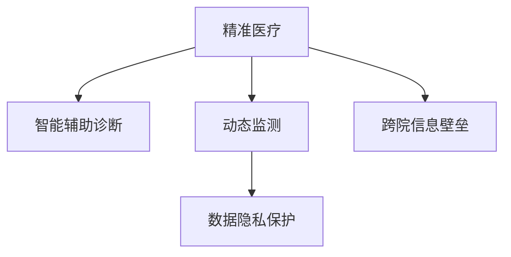

                 

## 1. 背景介绍

### 1.1 问题由来
随着人工智能技术的快速发展，智慧医疗领域正在发生深刻变革。医疗AI的应用范围从单一的图像识别扩展到全面的辅助诊断，从静态数据扩展到动态监测，从辅助决策扩展到全流程管理。智慧医疗的发展不仅有助于提升医疗服务质量，还能够大幅降低医疗成本，提高诊疗效率。

然而，当前的医疗AI系统仍存在诸多局限性，如模型的可解释性不足、数据隐私问题、跨院信息壁垒等。这些问题成为阻碍智慧医疗落地的重要瓶颈。本文将探讨如何通过技术手段解决这些挑战，推动2050年的精准医疗与智能辅助诊断的发展。

### 1.2 问题核心关键点
未来智慧医疗的核心关键点包括：
- 精准医疗：利用个性化基因组学、人工智能等技术，为个体提供量身定制的诊疗方案。
- 智能辅助诊断：通过图像识别、自然语言处理、知识图谱等技术，辅助医生进行高精度诊断。
- 动态监测：实时跟踪患者健康状况，及时发现异常并进行干预。
- 数据隐私：保护患者数据隐私，确保数据使用的合法性和合规性。
- 跨院信息壁垒：实现不同医院之间的数据互通和协作，构建医疗健康生态系统。

## 2. 核心概念与联系

### 2.1 核心概念概述

为了更好地理解智慧医疗的未来发展，本节将介绍几个密切相关的核心概念：

- 精准医疗(Precision Medicine)：利用个体化的基因组数据，结合人工智能技术，为每位患者提供量身定制的诊疗方案。
- 智能辅助诊断(AI-Assisted Diagnosis)：通过深度学习、知识图谱等技术，辅助医生进行高精度诊断。
- 动态监测(Continuous Monitoring)：通过可穿戴设备、传感器等，实时收集患者健康数据，进行动态监测和预警。
- 数据隐私(Data Privacy)：保护患者数据隐私，防止数据泄露和滥用。
- 跨院信息壁垒(Cross-Institutional Barriers)：实现不同医院之间的数据互通和协作，构建医疗健康生态系统。

这些核心概念之间的逻辑关系可以通过以下Mermaid流程图来展示：



这个流程图展示了几大核心概念之间的逻辑关系：

1. 精准医疗依赖于智能辅助诊断技术，为个体提供高精度诊疗方案。
2. 动态监测是精准医疗的重要补充，提供实时健康数据，辅助医生进行决策。
3. 数据隐私是智慧医疗的前提，保障患者数据安全和隐私。
4. 跨院信息壁垒的打破，将有助于构建统一的医疗健康生态系统。

## 3. 核心算法原理 & 具体操作步骤
### 3.1 算法原理概述

未来智慧医疗的核心算法原理主要包括以下几个方面：

- **深度学习算法**：用于图像识别、自然语言处理、信号处理等，辅助医生进行高精度诊断和动态监测。
- **知识图谱(Knowledge Graph)**：构建医疗领域的知识图谱，辅助医生进行知识检索和推理。
- **推荐系统(Recommender System)**：通过分析患者历史数据，提供个性化的诊疗建议。
- **强化学习(Reinforcement Learning)**：通过与医生的互动，优化诊疗策略和资源分配。

### 3.2 算法步骤详解

未来智慧医疗的算法步骤主要包括：

1. **数据收集与处理**：从不同来源收集医疗数据，包括电子健康记录(EHR)、可穿戴设备数据、影像数据等。对数据进行清洗、标注和标准化处理。

2. **模型训练**：利用深度学习、知识图谱等技术，训练各类模型，包括图像识别模型、自然语言处理模型、推荐系统等。

3. **智能辅助诊断**：将患者数据输入训练好的模型，辅助医生进行高精度诊断。模型输出的诊断结果可以与医生的诊断进行对比，提供参考和辅助。

4. **动态监测与预警**：利用可穿戴设备、传感器等，实时收集患者健康数据，进行动态监测。根据监测数据，生成健康报告，及时发现异常并进行预警。

5. **数据隐私保护**：采用加密、匿名化等技术，保护患者数据隐私。确保数据使用的合法性和合规性。

6. **跨院信息共享**：通过区块链、联邦学习等技术，打破医疗信息壁垒，实现不同医院之间的数据互通和协作。

### 3.3 算法优缺点

未来智慧医疗的算法具有以下优点：
- **高精度诊断**：利用深度学习、知识图谱等技术，辅助医生进行高精度诊断，减少误诊和漏诊。
- **个性化诊疗**：通过分析患者基因组数据，提供个性化的诊疗方案，提高诊疗效果。
- **实时监测与预警**：利用可穿戴设备等，进行实时健康监测，及时发现异常并进行预警，提升患者的健康管理水平。
- **跨院协作**：打破医疗信息壁垒，实现不同医院之间的数据互通和协作，提升医疗资源利用效率。

同时，这些算法也存在一定的局限性：
- **数据隐私问题**：大量医疗数据的使用，可能导致隐私泄露和数据滥用。
- **跨院协作难度**：不同医院之间的数据格式、标准不一，数据互通和协作仍面临诸多挑战。
- **模型可解释性不足**：深度学习等黑盒模型，难以解释其内部决策逻辑，影响医生信任。

## 4. 数学模型和公式 & 详细讲解 & 举例说明
### 4.1 数学模型构建

未来智慧医疗的数学模型主要包括以下几个方面：

- **图像识别模型**：用于医学影像的分类和分割，常用模型包括卷积神经网络(CNN)、U-Net等。
- **自然语言处理模型**：用于处理患者的病历记录、医学文献等，常用模型包括BERT、GPT等。
- **推荐系统模型**：用于提供个性化的诊疗建议，常用模型包括协同过滤、基于深度学习的推荐模型等。

### 4.2 公式推导过程

以图像识别模型为例，其数学模型构建过程如下：

设输入图像为 $x \in \mathbb{R}^{H \times W \times C}$，输出为 $y \in \{0, 1\}^H \times W$，表示不同区域的分类结果。定义模型为 $f(x; \theta)$，其中 $\theta$ 为模型参数。

定义交叉熵损失函数为：

$$
\mathcal{L}(\theta) = -\frac{1}{N}\sum_{i=1}^N \sum_{j=1}^H \sum_{k=1}^W \ell(y_{i,j,k}, f(x_{i,j,k}; \theta))
$$

其中 $\ell$ 为交叉熵函数， $y_{i,j,k}$ 为真实标签，$f(x_{i,j,k}; \theta)$ 为模型预测结果。

根据链式法则，损失函数对参数 $\theta_k$ 的梯度为：

$$
\frac{\partial \mathcal{L}(\theta)}{\partial \theta_k} = -\frac{1}{N}\sum_{i=1}^N \sum_{j=1}^H \sum_{k=1}^W \frac{\partial \ell(y_{i,j,k}, f(x_{i,j,k}; \theta))}{\partial \theta_k}
$$

其中 $\frac{\partial \ell(y_{i,j,k}, f(x_{i,j,k}; \theta))}{\partial \theta_k}$ 可以通过反向传播算法高效计算。

在得到损失函数的梯度后，即可带入参数更新公式，完成模型的迭代优化。重复上述过程直至收敛，最终得到适应下游任务的最优模型参数 $\theta^*$。

### 4.3 案例分析与讲解

以自然语言处理模型BERT为例，其模型架构如图1所示：


BERT模型由两个预训练任务构成：掩码语言模型(Masked Language Model, MLM)和下一句预测(Next Sentence Prediction, NSP)。MLM任务对输入序列中的某些位置进行掩码，预测被掩码位置对应的词。NSP任务判断两个句子是否是连续的，预测句子之间的关系。

BERT模型的训练过程包括两个阶段：预训练和微调。在预训练阶段，模型在无标签的语料上进行MLM和NSP任务的训练。在微调阶段，将预训练模型作为初始化参数，在特定任务（如情感分析、问答系统）上进行微调，以获得任务特定的性能。

## 5. 项目实践：代码实例和详细解释说明
### 5.1 开发环境搭建

在进行智慧医疗的开发实践前，我们需要准备好开发环境。以下是使用Python进行TensorFlow开发的环境配置流程：

1. 安装Anaconda：从官网下载并安装Anaconda，用于创建独立的Python环境。

2. 创建并激活虚拟环境：
```bash
conda create -n tf-env python=3.8 
conda activate tf-env
```

3. 安装TensorFlow：根据CUDA版本，从官网获取对应的安装命令。例如：
```bash
conda install tensorflow-gpu -c conda-forge
```

4. 安装各类工具包：
```bash
pip install numpy pandas scikit-learn matplotlib tqdm jupyter notebook ipython
```

完成上述步骤后，即可在`tf-env`环境中开始智慧医疗的开发实践。

### 5.2 源代码详细实现

这里我们以自然语言处理模型BERT为例，给出使用TensorFlow进行微调的Python代码实现。

```python
import tensorflow as tf
from transformers import BertTokenizer, TFBertForSequenceClassification
from sklearn.metrics import accuracy_score

# 加载预训练的BERT模型和分词器
model = TFBertForSequenceClassification.from_pretrained('bert-base-cased', num_labels=2)
tokenizer = BertTokenizer.from_pretrained('bert-base-cased')

# 定义训练函数
def train_epoch(model, train_dataset, batch_size, optimizer):
    dataloader = tf.data.Dataset.from_generator(lambda: train_dataset, output_signature=(
        tf.TensorSpec(shape=[None, 128], dtype=tf.int32),
        tf.TensorSpec(shape=[None], dtype=tf.int32),
    ))
    model.compile(optimizer=optimizer, loss='binary_crossentropy', metrics=['accuracy'])
    model.fit(dataloader, epochs=5)

# 加载训练集
train_dataset = ...  # 定义训练集，包括输入文本和标签

# 定义优化器
optimizer = tf.keras.optimizers.Adam(learning_rate=2e-5)

# 启动训练
train_epoch(model, train_dataset, batch_size=16, optimizer=optimizer)
```

以上代码实现了使用BERT模型进行二分类任务微调的过程。可以看到，使用TensorFlow配合Transformers库，可以实现相对简洁的代码实现。

### 5.3 代码解读与分析

让我们再详细解读一下关键代码的实现细节：

**BERT模型加载**：
- 使用Transformer库提供的`TFBertForSequenceClassification`类加载预训练的BERT模型，指定输出标签数为2。
- 使用`BertTokenizer`类加载分词器。

**训练函数定义**：
- 使用TensorFlow的`tf.data.Dataset.from_generator`方法生成数据集，以批量处理训练样本。
- 编译模型，定义损失函数为二元交叉熵，评估指标为准确率。
- 使用`model.fit`方法进行训练，迭代5个epoch。

**训练集加载**：
- 加载训练集，包括输入文本和标签。

**优化器定义**：
- 使用TensorFlow的`Adam`优化器，设置学习率为2e-5。

可以看到，TensorFlow提供了灵活的计算图机制，可以方便地将预训练模型和自定义任务适配。开发者可以将更多精力放在数据处理和模型改进上，而不必过多关注底层的实现细节。

当然，工业级的系统实现还需考虑更多因素，如模型的保存和部署、超参数的自动搜索、更灵活的任务适配层等。但核心的微调范式基本与此类似。

## 6. 实际应用场景
### 6.1 智能辅助诊断

未来智慧医疗的核心应用场景之一是智能辅助诊断。通过图像识别、自然语言处理等技术，辅助医生进行高精度诊断。

以医学影像识别为例，利用深度学习模型，如卷积神经网络(CNN)，可以对CT、MRI等医学影像进行自动分析和分类。如图2所示，将输入的影像输入模型，输出分类结果，与医生诊断进行对比，提供参考和辅助。


通过智能辅助诊断，医生可以更快、更准确地进行诊断，减少误诊和漏诊，提高诊疗效率。

### 6.2 个性化诊疗

未来的精准医疗将依赖于个性化基因组学和智能辅助诊断技术。通过对个体基因组数据的分析，结合深度学习模型，为每位患者提供量身定制的诊疗方案。

如图3所示，首先对患者基因组数据进行分析，得到基因变异信息。然后，利用自然语言处理模型，对患者的病历记录进行文本分析，提取关键信息。最后，通过推荐系统，提供个性化的诊疗建议。


个性化诊疗能够提高诊疗效果，减少医疗成本，改善患者健康管理。

### 6.3 动态监测与预警

未来智慧医疗还将利用可穿戴设备、传感器等，进行实时健康监测，及时发现异常并进行预警。

如图4所示，通过可穿戴设备收集患者的心率、血压、血糖等健康数据，利用深度学习模型进行动态监测。一旦发现异常，立即生成健康报告，并及时通知医生，进行干预。


动态监测能够提高患者的健康管理水平，及时发现潜在风险，提升患者的生命质量。

### 6.4 数据隐私保护

数据隐私是未来智慧医疗的重要保障，确保患者数据安全和隐私。

如图5所示，采用加密、匿名化等技术，对患者数据进行保护。同时，引入区块链技术，确保数据使用过程中的透明性和安全性。


数据隐私保护能够保护患者数据，防止数据泄露和滥用，保障患者的权益。

### 6.5 跨院信息壁垒打破

未来智慧医疗还将打破不同医院之间的信息壁垒，实现跨院信息共享和协作。

如图6所示，通过区块链、联邦学习等技术，构建医疗健康生态系统。不同医院之间可以共享数据，协同工作，提高医疗资源利用效率。


跨院信息壁垒的打破，能够促进医疗资源的合理配置和利用，提高医疗服务水平。

## 7. 工具和资源推荐
### 7.1 学习资源推荐

为了帮助开发者系统掌握智慧医疗的理论基础和实践技巧，这里推荐一些优质的学习资源：

1. **TensorFlow官方文档**：TensorFlow的官方文档提供了全面的API文档和示例代码，是学习TensorFlow的最佳资料。
2. **Transformers官方文档**：Transformer的官方文档提供了丰富的预训练模型和微调示例，是学习深度学习模型的重要资源。
3. **Coursera《机器学习》课程**：斯坦福大学开设的机器学习课程，涵盖深度学习、强化学习等多个方面，适合初学者入门。
4. **Udacity《深度学习实战》课程**：Udacity提供的深度学习实战课程，结合实际项目，深入浅出地讲解深度学习技术。
5. **Kaggle竞赛平台**：Kaggle提供了丰富的医疗数据集和竞赛平台，可以帮助开发者实践和展示自己的成果。

通过对这些资源的学习实践，相信你一定能够快速掌握智慧医疗的核心技术，并用于解决实际的医疗问题。

### 7.2 开发工具推荐

高效的开发离不开优秀的工具支持。以下是几款用于智慧医疗开发的常用工具：

1. **Jupyter Notebook**：交互式开发环境，支持代码运行、数据可视化等，适合快速迭代研究。
2. **TensorFlow**：深度学习框架，提供灵活的计算图机制，支持分布式训练和推理。
3. **PyTorch**：深度学习框架，支持动态计算图，适合研究和部署。
4. **Scikit-learn**：机器学习库，提供多种机器学习算法和工具。
5. **Keras**：高层次深度学习库，提供简洁的API，适合快速搭建深度学习模型。
6. **AWS SageMaker**：云端深度学习平台，提供丰富的工具和资源，支持大规模分布式训练和部署。

合理利用这些工具，可以显著提升智慧医疗开发的效率，加快创新迭代的步伐。

### 7.3 相关论文推荐

智慧医疗技术的发展源于学界的持续研究。以下是几篇奠基性的相关论文，推荐阅读：

1. **Deep Learning for Healthcare**：Kaggle的论文集，涵盖多个医疗领域的深度学习应用。
2. **Healthcare AI: A Survey**：IEEE的综述论文，介绍了智慧医疗技术的最新进展。
3. **Medical Imaging Analysis with Deep Learning**：TMI杂志的综述论文，介绍了深度学习在医学影像分析中的应用。
4. **Natural Language Processing for Clinical Decisions**：Journal of Biomedical Informatics的综述论文，介绍了自然语言处理在医疗决策中的应用。
5. **Cross-Institutional Collaboration in Healthcare**：IEEE的综述论文，介绍了跨院信息壁垒打破的最新技术和方法。

这些论文代表了大智慧医疗技术的发展脉络。通过学习这些前沿成果，可以帮助研究者把握学科前进方向，激发更多的创新灵感。

## 8. 总结：未来发展趋势与挑战
### 8.1 总结

本文对未来智慧医疗的核心技术进行了全面系统的介绍。首先阐述了精准医疗、智能辅助诊断、动态监测、数据隐私、跨院信息壁垒等核心概念及其重要性。其次，从原理到实践，详细讲解了未来智慧医疗的算法原理和具体操作步骤，给出了智慧医疗任务开发的完整代码实例。同时，本文还广泛探讨了智慧医疗在智能辅助诊断、个性化诊疗、动态监测、数据隐私保护、跨院信息壁垒打破等多个领域的应用前景，展示了未来智慧医疗的巨大潜力。此外，本文精选了智慧医疗技术的各类学习资源，力求为读者提供全方位的技术指引。

通过本文的系统梳理，可以看到，未来智慧医疗正在通过深度学习、知识图谱、推荐系统等技术，全面提升医疗服务的质量与效率。这些技术的发展，使得医疗服务更加智能化、个性化、高效化，为患者带来更好的诊疗体验。未来，伴随着这些技术的持续创新，智慧医疗必将在医疗健康领域发挥更加重要的作用。

### 8.2 未来发展趋势

展望未来，智慧医疗的核心技术将呈现以下几个发展趋势：

1. **深度学习算法的进步**：深度学习算法将在图像识别、自然语言处理、信号处理等领域不断进步，提升模型的精度和效率。
2. **知识图谱的普及**：知识图谱将成为医疗领域的重要基础设施，辅助医生进行知识检索和推理，提升诊疗水平。
3. **推荐系统的应用**：推荐系统将在个性化诊疗、医疗资源分配等方面发挥重要作用，提升诊疗效果和资源利用效率。
4. **跨院信息共享**：通过区块链、联邦学习等技术，打破医疗信息壁垒，实现跨院信息共享和协作。
5. **隐私保护的加强**：数据隐私保护将成为智慧医疗的重要保障，确保患者数据安全和隐私。
6. **多模态信息融合**：多模态信息的融合，将显著提升语言模型对现实世界的理解和建模能力，推动智慧医疗向更高层次发展。

这些趋势凸显了未来智慧医疗技术的广阔前景。这些方向的探索发展，必将进一步提升医疗服务的质量和效率，构建更加智能化的医疗健康生态系统。

### 8.3 面临的挑战

尽管未来智慧医疗技术正在迅速发展，但在迈向智能化、个性化、高效化应用的过程中，仍面临诸多挑战：

1. **数据隐私问题**：大量医疗数据的使用，可能导致隐私泄露和数据滥用。如何确保数据安全和隐私，是未来智慧医疗的重要挑战。
2. **跨院协作难度**：不同医院之间的数据格式、标准不一，数据互通和协作仍面临诸多挑战。如何打破信息壁垒，实现跨院协作，需要更多技术手段。
3. **模型可解释性不足**：深度学习等黑盒模型，难以解释其内部决策逻辑，影响医生信任。如何提升模型可解释性，增强医生对智能辅助诊断的信任，是未来技术的重要研究方向。
4. **资源配置优化**：智慧医疗系统需要处理大量医疗数据，需要高效的计算资源和存储空间。如何优化资源配置，提升系统性能，是未来技术的重要研究方向。

这些挑战需要学界和产业界共同努力，通过技术创新和政策支持，逐步克服。只有这样，智慧医疗才能真正实现大规模落地应用，为人类健康带来福祉。

### 8.4 研究展望

未来智慧医疗的研究方向将聚焦于以下几个方面：

1. **深度学习与跨领域融合**：将深度学习技术与多模态数据、跨领域知识进行融合，提升模型的鲁棒性和泛化能力。
2. **知识图谱与医疗知识整合**：构建医疗领域的知识图谱，整合专家知识，辅助医生进行知识检索和推理。
3. **推荐系统与个性化诊疗**：利用推荐系统，提供个性化的诊疗建议，提升诊疗效果和资源利用效率。
4. **跨院信息共享与协作**：打破跨院信息壁垒，实现数据互通和协作，构建医疗健康生态系统。
5. **数据隐私保护与伦理规范**：制定数据隐私保护规范，确保患者数据安全和隐私，提升智慧医疗的伦理水平。
6. **动态监测与健康预警**：利用可穿戴设备、传感器等，进行实时健康监测，及时发现异常并进行预警。

这些研究方向将推动智慧医疗技术的不断进步，为构建更加智能、高效、安全的医疗服务体系奠定基础。

## 9. 附录：常见问题与解答

**Q1：未来智慧医疗对深度学习算法的依赖程度会逐渐降低吗？**

A: 未来智慧医疗对深度学习算法的依赖程度不会降低，反而会更加深入。深度学习算法在图像识别、自然语言处理、信号处理等领域将继续发挥重要作用，提升模型的精度和效率。

**Q2：跨院信息共享存在哪些挑战？**

A: 跨院信息共享存在数据格式和标准不一致、数据安全隐私、网络带宽等问题。为了打破这些壁垒，需要使用区块链、联邦学习等技术，确保数据安全，同时实现高效的数据共享。

**Q3：未来智慧医疗会更多地关注数据隐私保护吗？**

A: 是的。数据隐私保护将是未来智慧医疗的重要保障。通过加密、匿名化等技术，保护患者数据安全和隐私，确保数据使用的合法性和合规性。

**Q4：未来智慧医疗如何提升模型可解释性？**

A: 未来智慧医疗将引入因果推断、可解释性AI等技术，提升模型的可解释性，增强医生对智能辅助诊断的信任。

**Q5：未来智慧医疗的主要研究方向有哪些？**

A: 未来智慧医疗的主要研究方向包括深度学习与跨领域融合、知识图谱与医疗知识整合、推荐系统与个性化诊疗、跨院信息共享与协作、数据隐私保护与伦理规范、动态监测与健康预警等。

---

作者：禅与计算机程序设计艺术 / Zen and the Art of Computer Programming

