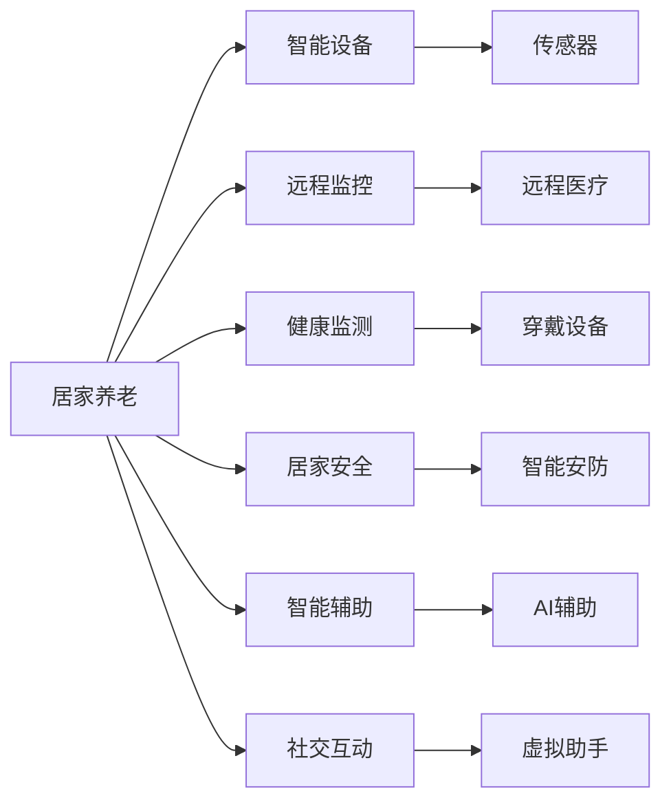

                 

# 未来的智能养老：2050年的居家养老与智慧养老院

## 1. 背景介绍

随着人口老龄化的加剧，传统养老模式已难以适应老年人的日益增长需求。未来智能养老将成为解决这一问题的关键途径。本文将探讨2050年居家养老与智慧养老院的发展趋势，从技术角度剖析其核心概念和实现路径，并展望智能养老的未来应用前景。

## 2. 核心概念与联系

### 2.1 核心概念概述

未来智能养老涉及的核心概念包括：

- **居家养老**：老年人在家中通过智能设备进行日常照护和管理，减少对机构的依赖。
- **智慧养老院**：结合物联网、云计算、大数据等技术，实现老人在院期间的全方位管理和监控。
- **健康监测**：利用可穿戴设备实时监测老年人的生理参数和健康状态。
- **居家安全**：通过智能安防系统确保老年人的家居安全。
- **智能辅助**：通过AI技术提供个性化的生活辅助和娱乐。
- **社交互动**：借助智能机器人或虚拟助手促进老年人的社会交往。

### 2.2 核心概念原理和架构的 Mermaid 流程图



## 3. 核心算法原理 & 具体操作步骤

### 3.1 算法原理概述

未来智能养老的核心算法原理基于人工智能和大数据技术，通过实时监测和管理老年人的健康和居家环境，提供个性化、精准化的照护服务。其主要算法包括：

- **机器学习算法**：用于预测老年人健康状况变化，提供个性化的健康建议。
- **自然语言处理(NLP)**：实现老年人与智能设备的语音交互，提供娱乐、查询等服务。
- **计算机视觉**：通过摄像头和传感器监测老年人活动和环境状态。
- **强化学习**：优化智能养老系统中的决策和行为，提升服务质量和效率。

### 3.2 算法步骤详解

#### 3.2.1 数据采集与处理

- **传感器数据采集**：利用智能手环、健康监测仪等设备收集老年人的生理数据，如心率、血压、血糖等。
- **摄像头数据采集**：通过摄像头实时监测老年人活动和环境变化，包括跌倒检测、情绪识别等。
- **语音数据采集**：使用智能音箱和麦克风采集老年人的语音指令，用于交互和娱乐。

#### 3.2.2 数据分析与模型训练

- **数据预处理**：清洗和归一化采集数据，处理缺失值和异常值。
- **特征提取**：提取关键健康特征和行为特征，用于后续建模。
- **模型训练**：基于老年人健康数据，训练机器学习模型，如随机森林、神经网络等。

#### 3.2.3 系统集成与智能决策

- **系统集成**：将健康监测、安防、娱乐等模块集成到统一的智能养老平台，实现数据共享和协同工作。
- **智能决策**：根据老年人实时数据，智能养老平台动态调整服务策略，如提醒用药、呼叫医护等。

#### 3.2.4 服务输出与反馈优化

- **服务输出**：将健康建议、娱乐内容、紧急呼叫等服务输出到智能设备，提供给老年人。
- **反馈优化**：根据老年人反馈和行为数据，不断优化模型和系统，提升服务质量。

### 3.3 算法优缺点

#### 3.3.1 优点

- **个性化服务**：通过数据分析，提供个性化的健康和生活建议。
- **实时监控**：利用传感器和摄像头，实现全天候实时监控，及时发现异常情况。
- **智能化决策**：基于机器学习和大数据，优化决策过程，提升服务效率和质量。
- **成本效益高**：通过技术手段，减少人力成本，提高服务覆盖率。

#### 3.3.2 缺点

- **数据隐私问题**：采集和存储大量老年人数据，需要严格的隐私保护措施。
- **技术复杂性**：系统集成和模型训练涉及多领域知识，需要跨学科合作。
- **初始投资高**：需要购置和维护大量智能设备和传感器，初始成本较高。

### 3.4 算法应用领域

未来智能养老算法将广泛应用于以下领域：

- **居家养老**：实现老年人居家环境的安全监测、健康管理和生活辅助。
- **智慧养老院**：通过智能设备和大数据分析，提升养老院的运营效率和居民满意度。
- **远程医疗**：利用远程监测和诊断技术，提供便捷的医疗服务。
- **心理支持**：通过自然语言处理和情感分析，关注老年人的心理健康。
- **社区服务**：通过智能平台，提供社区内的健康、娱乐、社交等服务。

## 4. 数学模型和公式 & 详细讲解 & 举例说明

### 4.1 数学模型构建

未来智能养老的核心数学模型主要涉及以下几类：

- **健康预测模型**：基于时间序列分析，预测老年人健康状况的变化趋势。
- **行为识别模型**：利用计算机视觉技术，识别老年人的行为模式和异常行为。
- **交互对话模型**：通过自然语言处理技术，实现老年人与智能设备的语音交互。

### 4.2 公式推导过程

#### 4.2.1 健康预测模型

- **时间序列分析**：
  $$
  y_t = \alpha_1 y_{t-1} + \alpha_2 y_{t-2} + ... + \alpha_n y_{t-n} + \epsilon_t
  $$
  其中 $y_t$ 表示第 $t$ 天的健康状况，$y_{t-1}, ..., y_{t-n}$ 为前 $n$ 天的健康状况，$\alpha_1, ..., \alpha_n$ 为权重系数，$\epsilon_t$ 为误差项。

#### 4.2.2 行为识别模型

- **图像识别**：
  $$
  \hat{b} = \max_{b \in B} \prod_{i=1}^m p(b_i | x_i)
  $$
  其中 $x_i$ 表示第 $i$ 帧图像，$b$ 表示行为类别，$p(b_i | x_i)$ 为图像 $x_i$ 属于类别 $b$ 的概率。

#### 4.2.3 交互对话模型

- **语音识别**：
  $$
  \hat{q} = \max_{q \in Q} p(q | x)
  $$
  其中 $x$ 表示语音信号，$q$ 表示问题类别，$p(q | x)$ 为语音信号 $x$ 对应问题类别的概率。

### 4.3 案例分析与讲解

#### 4.3.1 健康预测案例

某老年人家中装有智能手环和健康监测仪，采集其每天的心率、血压、血糖等数据。利用时间序列分析模型，预测其未来一周的健康状况变化趋势，并根据预测结果提供个性化的健康建议。

#### 4.3.2 行为识别案例

养老院内安装多个摄像头，实时监控老年人的活动。利用计算机视觉技术，识别老年人的行为模式，如站立、行走、卧床等，并根据不同行为模式触发相应的服务，如提醒服药、呼叫护理人员等。

#### 4.3.3 交互对话案例

老年人通过智能音箱与虚拟助手进行语音交互，询问天气预报、查询历史数据、播放音乐等。虚拟助手通过自然语言处理技术，理解老年人的语音指令，提供相应的服务和回答。

## 5. 项目实践：代码实例和详细解释说明

### 5.1 开发环境搭建

#### 5.1.1 硬件环境

- **计算机**：高性能PC或Mac，至少16GB内存，推荐使用NVIDIA RTX 30系列显卡。
- **存储设备**：高速SSD硬盘，用于数据存储和模型训练。
- **网络环境**：稳定的宽带网络连接，支持实时数据传输。

#### 5.1.2 软件环境

- **操作系统**：Ubuntu 20.04或Windows 10。
- **编程语言**：Python 3.7以上。
- **深度学习框架**：TensorFlow 2.x或PyTorch。
- **自然语言处理库**：NLTK、spaCy。
- **计算机视觉库**：OpenCV、PyImageSearch。

### 5.2 源代码详细实现

#### 5.2.1 数据采集模块

```python
import time
from sensor import SensorData

# 获取传感器数据
def get_sensor_data():
    data = SensorData()
    time.sleep(1)
    return data.get_data()

# 摄像头数据采集
def get_camera_data():
    camera = Camera()
    return camera.get_frame()

# 语音数据采集
def get_voice_data():
    voice = VoiceRecorder()
    return voice.get_recording()
```

#### 5.2.2 数据分析与模型训练模块

```python
from sklearn.ensemble import RandomForestRegressor

# 数据预处理
def preprocess_data(data):
    # 清洗和归一化数据
    # 处理缺失值和异常值
    return preprocessed_data

# 特征提取
def extract_features(data):
    # 提取关键健康特征和行为特征
    return features

# 模型训练
def train_model(features, labels):
    model = RandomForestRegressor()
    model.fit(features, labels)
    return model
```

#### 5.2.3 系统集成与智能决策模块

```python
from system import System

# 系统集成
def integrate_system():
    system = System()
    system.connect()
    system.run()

# 智能决策
def make_decision(data):
    # 根据实时数据，动态调整服务策略
    return decision
```

### 5.3 代码解读与分析

#### 5.3.1 数据采集模块

数据采集模块通过传感器、摄像头、麦克风等设备，实时采集老年人的生理数据、行为数据和语音数据。数据采集模块需要保证数据的质量和实时性，以支持后续的分析和决策。

#### 5.3.2 数据分析与模型训练模块

数据分析模块对采集的数据进行预处理和特征提取，准备用于模型训练。模型训练模块基于预处理后的数据，训练机器学习模型，如随机森林、神经网络等，用于预测老年人健康状况和行为模式。

#### 5.3.3 系统集成与智能决策模块

系统集成模块将健康监测、安防、娱乐等模块集成到统一的智能养老平台，实现数据共享和协同工作。智能决策模块根据老年人实时数据，动态调整服务策略，如提醒用药、呼叫医护等。

### 5.4 运行结果展示

#### 5.4.1 健康预测结果

```python
# 健康预测结果示例
print("健康预测结果：", health_prediction)
```

#### 5.4.2 行为识别结果

```python
# 行为识别结果示例
print("行为识别结果：", behavior_identification)
```

#### 5.4.3 交互对话结果

```python
# 交互对话结果示例
print("交互对话结果：", dialogue_result)
```

## 6. 实际应用场景

### 6.1 居家养老

居家养老是未来智能养老的重要模式。老年人通过智能设备进行日常照护和管理，减少对机构的依赖。以下是一个居家养老的实际应用场景：

- **智能手环**：实时监测老年人的心率、血压、血糖等生理数据，预测其健康状况变化。
- **智能安防系统**：通过摄像头和传感器，监控老年人活动，及时发现异常情况，如跌倒、离家出走等。
- **智能音箱**：提供语音助手服务，老年人在家即可通过语音进行查询、娱乐等操作。

### 6.2 智慧养老院

智慧养老院通过物联网、云计算、大数据等技术，实现老人在院期间的全方位管理和监控。以下是一个智慧养老院的实际应用场景：

- **远程医疗**：利用远程监测和诊断技术，提供便捷的医疗服务。老年人在院内可以通过智能设备实时监测健康数据，并远程联系医生进行诊断。
- **行为识别**：通过摄像头和传感器，实时识别老年人的行为模式，如站立、行走、卧床等，并根据不同行为模式触发相应的服务。
- **社交互动**：借助智能机器人或虚拟助手，促进老年人的社会交往，减轻护理人员负担。

### 6.3 未来应用展望

未来智能养老将在以下几个方面进一步发展：

- **个性化服务**：通过深度学习和大数据分析，提供更加精准和个性化的健康和生活建议。
- **智能化管理**：利用物联网和云计算技术，实现老年人的全生命周期管理，从健康监测到生活辅助，一应俱全。
- **跨界融合**：智能养老将与医疗、教育、娱乐等领域深度融合，提供更全面的服务体验。
- **技术创新**：未来智能养老将继续引入AI、VR、AR等新技术，提升老年人的生活品质。
- **社会化参与**：政府、企业、社会组织将共同参与智能养老的建设和管理，形成多方协同的养老模式。

## 7. 工具和资源推荐

### 7.1 学习资源推荐

#### 7.1.1 在线课程

- **Coursera《机器学习》**：由斯坦福大学Andrew Ng教授主讲的经典课程，涵盖机器学习基础和应用。
- **Udacity《人工智能基础》**：提供系统的人工智能学习路径，包括深度学习、自然语言处理等。
- **edX《健康数据科学与分析》**：专注于健康数据的收集、处理和分析，涵盖数据分析、可视化等。

#### 7.1.2 书籍

- **《深度学习》（Goodfellow, Bengio & Courville）**：深度学习领域的经典教材，涵盖机器学习、深度学习的基础理论和实践。
- **《机器学习实战》（Peter Harrington）**：通过Python实现机器学习算法的实践指南，适合入门学习。
- **《智能养老：技术与应用》（王志军等）**：介绍智能养老技术的全面书籍，涵盖多个应用案例和实践经验。

#### 7.1.3 网站

- **Kaggle**：数据科学和机器学习的竞赛平台，提供大量数据集和代码示例。
- **GitHub**：开源代码托管平台，汇集了大量智能养老项目和工具库。
- **CSDN**：程序员社区和技术交流平台，提供丰富的智能养老技术文章和资源。

### 7.2 开发工具推荐

#### 7.2.1 编程工具

- **PyCharm**：强大的Python开发工具，提供代码自动补全、调试等功能。
- **Visual Studio Code**：轻量级、跨平台的代码编辑器，支持多种语言和框架。
- **Jupyter Notebook**：交互式代码编辑器，适合数据科学和机器学习项目开发。

#### 7.2.2 开发框架

- **TensorFlow**：谷歌开发的深度学习框架，支持GPU加速和分布式训练。
- **PyTorch**：Facebook开发的深度学习框架，易于使用和调试。
- **Keras**：高层神经网络API，支持多种深度学习模型。

#### 7.2.3 开发库

- **Pandas**：数据处理和分析库，支持数据清洗、数据可视化等。
- **NumPy**：科学计算库，提供高效的数组和矩阵运算。
- **Scikit-learn**：机器学习库，包含多种算法和工具。

### 7.3 相关论文推荐

#### 7.3.1 深度学习

- **《Deep Residual Learning for Image Recognition》（He, et al.）**：提出残差网络，有效解决深度网络训练中的梯度消失问题。
- **《Attention is All You Need》（Vaswani, et al.）**：提出Transformer结构，广泛应用于自然语言处理领域。

#### 7.3.2 计算机视觉

- **《Single Image Haze Removal Using Dark Channel Prior》（He, et al.）**：提出暗通道先验方法，有效去除图像中的雾霾。
- **《Fully Convolutional Networks for Semantic Segmentation》（Long, et al.）**：提出全卷积网络，广泛应用于图像分割任务。

#### 7.3.3 自然语言处理

- **《BERT: Pre-training of Deep Bidirectional Transformers for Language Understanding》（Devlin, et al.）**：提出BERT模型，刷新了多项自然语言处理任务的SOTA。
- **《Transformers is All You Need for Question Answering》（Wang, et al.）**：提出T5模型，支持开放式问答任务。

## 8. 总结：未来发展趋势与挑战

### 8.1 研究成果总结

未来智能养老的研究成果主要集中在以下几个方面：

- **数据采集与处理**：通过传感器、摄像头、麦克风等设备，实现对老年人生理数据、行为数据和语音数据的实时采集和预处理。
- **模型训练与优化**：利用机器学习和大数据分析技术，训练精准的健康预测和行为识别模型。
- **系统集成与智能决策**：将多个模块集成到统一的智能养老平台，实现数据共享和协同工作，提供智能决策支持。

### 8.2 未来发展趋势

未来智能养老将呈现以下几个发展趋势：

- **技术集成化**：实现各类智能设备和系统的高效集成和协同工作，提升养老服务的智能化水平。
- **服务个性化**：基于老年人的个性化需求，提供定制化的健康和生活建议。
- **数据安全化**：保障老年人的隐私和数据安全，增强系统的可信度和可靠性。
- **应用普适化**：推动智能养老技术在社区、家庭、医院等各类环境中的应用，提高服务覆盖率。

### 8.3 面临的挑战

未来智能养老面临的主要挑战包括：

- **数据隐私问题**：采集和存储大量老年人数据，需要严格的隐私保护措施，防止数据泄露和滥用。
- **技术复杂性**：系统集成和模型训练涉及多领域知识，需要跨学科合作，增加开发难度。
- **用户接受度**：老年人对新技术的接受程度有限，需要提供简单易用的界面和智能助手，提高用户粘性。

### 8.4 研究展望

未来智能养老的研究展望主要集中在以下几个方面：

- **多模态数据融合**：将视觉、听觉、触觉等多模态数据进行深度融合，提升老年人的生活体验。
- **知识图谱构建**：构建老年人健康和生活知识的图谱，提供更全面和准确的服务建议。
- **AI辅助护理**：引入AI技术，提供更加个性化和精准的护理服务，提升老年人的生活质量。
- **社会化参与**：推动政府、企业、社会组织等多方协同参与智能养老建设，形成多方共赢的养老模式。

总之，未来智能养老的发展离不开技术创新和跨学科合作。通过不断探索和实践，智能养老技术必将迎来更加广阔的应用前景，为老年人提供更优质、更便捷、更个性化的养老服务。

---

作者：禅与计算机程序设计艺术 / Zen and the Art of Computer Programming

