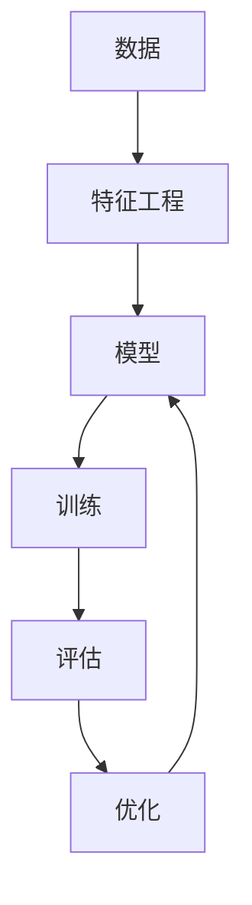

                 

## 1. 背景介绍

机器学习（Machine Learning, ML）作为人工智能（AI）的重要分支，旨在使计算机通过数据自动学习，不断提升其预测和决策能力。其背后依赖强大的数学、统计和计算工具，并通过数据驱动方式，从数据中挖掘出有价值的信息。机器学习正广泛应用于各个领域，如金融、医疗、电商、智能制造等，成为推动人类社会进步的重要力量。

## 2. 核心概念与联系

### 2.1 核心概念概述

机器学习的核心概念包括数据、模型、训练、评估和优化。以下是各个概念的简要概述：

- **数据（Data）**：机器学习的输入，包含原始数据、特征、标签等。数据的质量和数量直接影响学习模型的性能。
- **模型（Model）**：机器学习的主要工具，用于处理和分析数据，通常基于统计学和概率论等数学框架。
- **训练（Training）**：利用数据训练模型的过程，通常使用监督学习、无监督学习和强化学习等方法。
- **评估（Evaluation）**：衡量模型预测能力的方法，常用的指标有准确率、召回率、F1分数等。
- **优化（Optimization）**：通过优化算法提升模型性能，通常包括梯度下降、随机梯度下降、Adam等。

通过这些核心概念，机器学习形成了一个闭环系统，从数据输入到模型训练，再到性能评估和参数优化，每一步都紧密相连，共同驱动模型的提升。

### 2.2 核心概念联系（Mermaid流程图）



这个流程图展示了机器学习的主要流程：从原始数据开始，通过特征工程得到适合模型输入的数据，然后用训练数据训练模型，再通过评估和优化提升模型性能，最后模型可以用于预测新数据。

## 3. 核心算法原理 & 具体操作步骤

### 3.1 算法原理概述

机器学习主要包含三类方法：监督学习、无监督学习和强化学习。

- **监督学习**：利用有标签的数据集，训练模型以进行分类或回归预测。
- **无监督学习**：使用无标签数据集，发现数据的内在结构和规律。
- **强化学习**：通过试错机制，学习如何在特定环境中做出最优决策。

监督学习是本文的主要讨论焦点，通过展示一个简单的线性回归模型，介绍机器学习的基本原理。

### 3.2 算法步骤详解

线性回归是最基础和最简单的监督学习模型之一。假设我们有一个数据集 $(x_1, y_1), (x_2, y_2), ..., (x_n, y_n)$，其中 $x$ 是特征，$y$ 是标签。目标是用线性函数 $y = wx + b$ 来拟合数据，即最小化预测值与真实值之间的误差。

线性回归的核心步骤包括：

1. **模型定义**：定义线性回归模型 $y = wx + b$，其中 $w$ 和 $b$ 是模型参数。
2. **损失函数定义**：常用的损失函数是均方误差（MSE），定义为 $\frac{1}{n}\sum_{i=1}^{n}(y_i - wx_i - b)^2$。
3. **优化目标**：最小化损失函数 $\mathcal{L}(w, b) = \frac{1}{2n}\sum_{i=1}^{n}(y_i - wx_i - b)^2$。
4. **梯度下降算法**：利用梯度下降算法更新模型参数 $w$ 和 $b$，迭代公式为 $w \leftarrow w - \eta \frac{\partial \mathcal{L}}{\partial w}$，$b \leftarrow b - \eta \frac{\partial \mathcal{L}}{\partial b}$，其中 $\eta$ 是学习率。

### 3.3 算法优缺点

**优点**：

- **简单直观**：线性回归模型和算法原理易于理解。
- **适用广泛**：可以应用于各种类型的监督学习任务，如回归、分类等。
- **高效快速**：模型训练和预测速度快，适合实时应用。

**缺点**：

- **假设简单**：线性回归假设数据满足线性关系，实际数据往往更加复杂。
- **鲁棒性差**：对于异常值和噪声数据敏感，容易影响模型效果。
- **解释性差**：模型参数和决策过程难以解释，对于决策的透明性要求高的场景不适用。

### 3.4 算法应用领域

线性回归广泛应用于金融、市场营销、电子商务等领域，例如：

- **金融风险评估**：利用历史贷款数据预测违约风险。
- **销售预测**：通过市场数据预测未来销售额。
- **用户行为分析**：分析用户点击、购买行为，预测用户偏好。
- **股票价格预测**：通过历史价格数据预测未来股价趋势。

## 4. 数学模型和公式 & 详细讲解 & 举例说明

### 4.1 数学模型构建

线性回归模型可以表示为 $y = wx + b$，其中 $x = (x_1, x_2, ..., x_n)^T$，$y$ 是标签向量，$w$ 是模型参数向量，$b$ 是偏置项。模型目标是最小化均方误差损失函数 $\mathcal{L}(w, b) = \frac{1}{2n}\sum_{i=1}^{n}(y_i - wx_i - b)^2$。

### 4.2 公式推导过程

为了最小化损失函数 $\mathcal{L}(w, b)$，我们需要求导并找到极小值。损失函数关于 $w$ 和 $b$ 的偏导数分别为：

$$
\frac{\partial \mathcal{L}}{\partial w} = \frac{1}{n}\sum_{i=1}^{n}(y_i - wx_i - b)x_i
$$

$$
\frac{\partial \mathcal{L}}{\partial b} = \frac{1}{n}\sum_{i=1}^{n}(y_i - wx_i - b)
$$

利用梯度下降算法，更新参数公式为：

$$
w \leftarrow w - \eta \frac{1}{n}\sum_{i=1}^{n}(y_i - wx_i - b)x_i
$$

$$
b \leftarrow b - \eta \frac{1}{n}\sum_{i=1}^{n}(y_i - wx_i - b)
$$

其中 $\eta$ 是学习率。

### 4.3 案例分析与讲解

假设有一个简单的数据集，包含学生的成绩和上学时间，我们希望预测学生的平均成绩。利用Python和Scikit-learn库进行线性回归的实现：

```python
from sklearn.linear_model import LinearRegression
import numpy as np

# 创建模拟数据
X = np.array([[1, 2], [2, 4], [3, 6], [4, 8]])
y = np.array([5, 7, 9, 11])

# 初始化线性回归模型
model = LinearRegression()

# 训练模型
model.fit(X, y)

# 预测新数据
X_new = np.array([[5, 10]])
y_pred = model.predict(X_new)
print(y_pred)
```

通过上述代码，我们能够训练一个线性回归模型，并用其预测新数据。模型训练后，$w$ 和 $b$ 的值就是模型参数。

## 5. 项目实践：代码实例和详细解释说明

### 5.1 开发环境搭建

在进行机器学习项目开发前，需要搭建好开发环境。推荐使用Anaconda或Miniconda，它们提供了丰富的科学计算库和虚拟环境管理工具，方便多项目并发开发。

1. 安装Anaconda或Miniconda：从官网下载并安装最新版本。
2. 创建虚拟环境：
   ```bash
   conda create --name myenv python=3.8
   conda activate myenv
   ```
3. 安装必要的科学计算库：
   ```bash
   conda install numpy scipy pandas scikit-learn matplotlib seaborn
   ```

### 5.2 源代码详细实现

以下是一个简单的线性回归模型实现示例，包括数据准备、模型训练、评估和可视化。

```python
from sklearn.linear_model import LinearRegression
import numpy as np
import pandas as pd
import matplotlib.pyplot as plt

# 准备数据
X = pd.read_csv('data.csv')['X']
y = pd.read_csv('data.csv')['y']

# 分割训练集和测试集
from sklearn.model_selection import train_test_split
X_train, X_test, y_train, y_test = train_test_split(X, y, test_size=0.2, random_state=42)

# 初始化模型
model = LinearRegression()

# 训练模型
model.fit(X_train.values.reshape(-1, 1), y_train)

# 评估模型
from sklearn.metrics import mean_squared_error
y_pred = model.predict(X_test.values.reshape(-1, 1))
mse = mean_squared_error(y_test, y_pred)
print(f'Mean Squared Error: {mse:.2f}')

# 可视化模型
plt.scatter(X_test, y_test, color='black')
plt.plot(X_test, model.predict(X_test.values.reshape(-1, 1)), color='red')
plt.xlabel('X')
plt.ylabel('y')
plt.title('Linear Regression Model')
plt.show()
```

### 5.3 代码解读与分析

- **数据准备**：读取数据集，并将其分为训练集和测试集。
- **模型初始化**：创建线性回归模型，并使用训练集数据进行拟合。
- **模型评估**：计算模型在测试集上的均方误差，评估模型性能。
- **模型可视化**：将模型预测值与真实值进行可视化，直观展示模型的预测效果。

### 5.4 运行结果展示

运行上述代码后，能够得到模型在测试集上的均方误差，并生成可视化图表，直观展示模型的预测效果。

## 6. 实际应用场景

机器学习在实际应用中，具有广泛的场景和应用，以下是几个典型的应用案例：

### 6.1 金融风险评估

金融机构利用历史贷款数据训练线性回归模型，预测贷款违约概率。模型可以帮助银行评估贷款申请人的信用风险，提高贷款审批效率。

### 6.2 销售预测

电商企业通过历史销售数据训练线性回归模型，预测未来的销售额。模型可以帮助企业优化库存管理，提升营销效果。

### 6.3 用户行为分析

社交媒体平台利用用户点击、点赞、分享等行为数据，训练线性回归模型，预测用户对某一内容的兴趣。模型可以帮助平台优化内容推荐，提升用户粘性。

### 6.4 股票价格预测

金融分析师通过历史股票价格数据训练线性回归模型，预测未来股价走势。模型可以帮助投资者做出更明智的投资决策。

## 7. 工具和资源推荐

### 7.1 学习资源推荐

1. **《机器学习》（周志华）**：一本经典的机器学习教材，详细介绍了监督学习、无监督学习、强化学习等核心概念和算法。
2. **Coursera《机器学习》课程**：由斯坦福大学Andrew Ng教授主讲，系统介绍了机器学习的基本原理和算法。
3. **Kaggle**：一个数据科学竞赛平台，提供大量的公开数据集和模型，可以用于学习和实践。
4. **GitHub**：存储和分享机器学习项目的代码，可以参考其他开发者的工作。
5. **PyTorch官方文档**：最新的深度学习框架，提供了丰富的机器学习库和教程。

### 7.2 开发工具推荐

1. **Python**：最流行的机器学习编程语言，具有丰富的第三方库和工具。
2. **Anaconda**：虚拟环境管理工具，方便多项目并发开发。
3. **Jupyter Notebook**：交互式编程环境，适合编写和运行代码。
4. **Scikit-learn**：常用的机器学习库，提供了丰富的算法和工具。
5. **TensorFlow**：深度学习框架，支持大规模的机器学习模型训练和推理。

### 7.3 相关论文推荐

1. **《梯度下降算法》（Wolfe）**：梯度下降算法的奠基性论文，介绍了梯度下降的数学原理和优化过程。
2. **《线性回归与多重线性回归》（Hotelling）**：介绍线性回归的基本原理和假设条件。
3. **《随机梯度下降方法》（Ruder）**：介绍了随机梯度下降方法及其在机器学习中的应用。

## 8. 总结：未来发展趋势与挑战

### 8.1 研究成果总结

机器学习已经成为推动各行业发展的重要力量。其核心技术不断进步，应用范围不断扩大。监督学习作为机器学习的重要分支，具有广泛的适用性和实用性。

### 8.2 未来发展趋势

未来的机器学习将呈现以下几个趋势：

- **深度学习加速发展**：深度学习作为机器学习的核心，其性能和应用范围不断扩大，推动了机器学习技术的进步。
- **自动化机器学习**：自动化机器学习（AutoML）技术不断成熟，简化了模型的训练和调参过程，提高了机器学习的应用门槛。
- **联邦学习**：联邦学习利用分布式数据，在不共享数据的前提下进行模型训练，保护了数据隐私。
- **模型解释性**：机器学习模型的可解释性越来越受到重视，研究者致力于开发更透明、更可解释的模型。

### 8.3 面临的挑战

尽管机器学习技术取得了巨大进步，但在实际应用中仍然面临诸多挑战：

- **数据质量问题**：数据质量直接影响模型效果，如何处理缺失数据、异常值等数据质量问题，是机器学习应用中的重要课题。
- **模型泛化能力**：模型在不同数据集上的泛化能力不足，容易在测试集上表现不佳。
- **计算资源需求高**：机器学习模型往往需要大量的计算资源进行训练和推理，如何降低计算成本，是实际应用中的难题。
- **模型可解释性差**：机器学习模型往往是"黑盒"系统，难以解释其决策过程和结果，这在金融、医疗等高风险领域尤为突出。

### 8.4 研究展望

未来的机器学习研究需要在以下几个方面寻求新的突破：

- **自动化模型选择**：如何自动选择最优的模型架构和超参数，成为研究热点。
- **弱监督学习**：如何在数据标注成本高昂的情况下，利用弱监督学习提高模型效果。
- **模型解释性增强**：研究更加透明、可解释的机器学习模型，提升模型的可信度。
- **跨模态学习**：将多种数据源（如文本、图像、音频等）进行融合，提高模型的综合能力。

## 9. 附录：常见问题与解答

**Q1：什么是监督学习？**

A: 监督学习是机器学习的一种重要方法，利用带有标签的数据集，训练模型以进行分类或回归预测。常用的算法包括线性回归、逻辑回归、决策树、支持向量机等。

**Q2：什么是梯度下降算法？**

A: 梯度下降算法是一种常用的优化算法，通过计算损失函数对模型参数的梯度，迭代更新模型参数，以最小化损失函数。梯度下降算法包括批量梯度下降、随机梯度下降、小批量梯度下降等。

**Q3：什么是模型泛化能力？**

A: 模型泛化能力是指模型在未见过的数据上的表现能力。一个泛化能力强的模型，可以在新数据上表现良好，而不仅仅在训练集上表现优异。

**Q4：什么是弱监督学习？**

A: 弱监督学习是在数据标注成本高昂的情况下，利用少样本、弱标签等不完全标注数据进行模型训练的方法。其目标是在保留数据量的情况下，提高模型的泛化能力。

**Q5：什么是联邦学习？**

A: 联邦学习是一种分布式机器学习方法，利用分布式数据源进行模型训练，不共享数据，保护数据隐私。联邦学习常用于移动设备、云计算等领域。

---

作者：禅与计算机程序设计艺术 / Zen and the Art of Computer Programming

