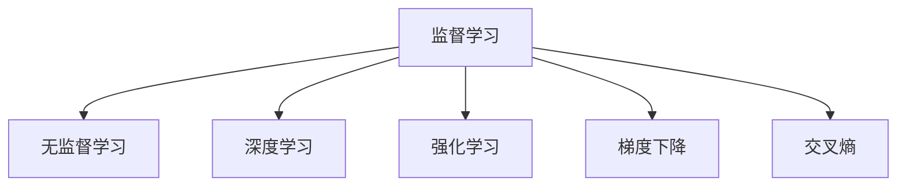

                 

# 机器学习 原理与代码实例讲解

> 关键词：机器学习,监督学习,深度学习,神经网络,优化算法,代码实例,梯度下降,交叉熵

## 1. 背景介绍

### 1.1 问题由来

机器学习是人工智能领域的核心技术之一，近年来在图像识别、自然语言处理、推荐系统等诸多领域取得了显著突破。机器学习通过数据分析和模型训练，可以从数据中自动学习和发现规律，从而实现预测、分类、聚类等任务。

然而，面对复杂多变的实际问题，如何设计合适的模型、选择合适的算法、优化模型的性能，是机器学习从业者面临的主要挑战。本节将对机器学习的基本概念、算法原理及其应用进行详细讲解，旨在帮助读者系统掌握机器学习的核心原理和方法。

## 2. 核心概念与联系

### 2.1 核心概念概述

为更好地理解机器学习的核心原理，本节将介绍几个关键概念：

- 监督学习(Supervised Learning)：使用带有标签的训练数据，通过模型训练获得预测能力的机器学习方法。
- 无监督学习(Unsupervised Learning)：使用未标注的训练数据，通过数据自身特性进行聚类、降维等分析，揭示数据内在结构的方法。
- 强化学习(Reinforcement Learning)：通过与环境的交互，使智能体根据奖励信号学习最优策略的方法。
- 深度学习(Deep Learning)：通过多层次的神经网络进行特征提取和模式识别，提升模型性能的一种机器学习方法。
- 梯度下降(Gradient Descent)：用于优化神经网络参数的迭代算法，通过逐步调整参数值，最小化损失函数。
- 交叉熵(Cross-Entropy)：在分类任务中用于衡量模型输出与真实标签之间的差异，指导模型优化。

这些核心概念之间的逻辑关系可以通过以下Mermaid流程图来展示：



这个流程图展示了一些核心机器学习概念的联系：

1. 监督学习和无监督学习都是机器学习的主要分支。
2. 深度学习是监督学习的一种高级形式，通过多层次神经网络实现更复杂的特征提取和模式识别。
3. 强化学习则通过与环境的交互，学习最优策略。
4. 梯度下降和交叉熵是监督学习中最常用的优化算法和损失函数，用于指导模型训练。

## 3. 核心算法原理 & 具体操作步骤

### 3.1 算法原理概述

机器学习算法主要包括监督学习、无监督学习和强化学习三类。以监督学习为例，其主要原理是通过带有标签的训练数据，训练模型，使得模型能够根据新的输入数据，预测相应的输出标签。

具体来说，假设训练数据集为 $D=\{(x_i,y_i)\}_{i=1}^N$，其中 $x_i$ 为输入特征，$y_i$ 为对应的标签。模型的目标是最小化损失函数 $\mathcal{L}(\theta)$，使模型输出尽可能接近真实标签。常见的损失函数包括均方误差、交叉熵等。

模型的训练过程通常包括以下步骤：

1. 初始化模型参数 $\theta$。
2. 通过梯度下降等优化算法，不断调整参数 $\theta$，使损失函数 $\mathcal{L}(\theta)$ 最小化。
3. 在训练集 $D$ 上评估模型性能，选择最优模型参数。

### 3.2 算法步骤详解

以监督学习中的线性回归为例，介绍机器学习算法的详细步骤。

**Step 1: 准备数据**
- 收集带有标签的训练数据集 $D=\{(x_i,y_i)\}_{i=1}^N$，其中 $x_i \in \mathbb{R}^d$ 为输入特征向量，$y_i \in \mathbb{R}$ 为输出标签。

**Step 2: 构建模型**
- 定义线性回归模型 $h_{\theta}(x)=\theta^T x$，其中 $\theta \in \mathbb{R}^d$ 为模型参数。

**Step 3: 选择损失函数**
- 定义均方误差损失函数 $\mathcal{L}(\theta)=\frac{1}{2N}\sum_{i=1}^N(h_{\theta}(x_i)-y_i)^2$。

**Step 4: 优化模型**
- 使用梯度下降算法更新模型参数 $\theta$：
  $$
  \theta_j \leftarrow \theta_j - \eta\frac{1}{N}\sum_{i=1}^N(x_{i,j} - \hat{y}_i)
  $$
  其中 $\eta$ 为学习率，$x_{i,j}$ 为输入特征的第 $j$ 维，$\hat{y}_i=h_{\theta}(x_i)$ 为模型预测的输出。

**Step 5: 评估模型**
- 在测试集上评估模型性能，如均方误差等指标。

### 3.3 算法优缺点

监督学习算法具有以下优点：
1. 高效性：对于有标签的数据，监督学习算法可以快速训练出高精度模型。
2. 适用性广：可以应用于各种分类、回归、聚类等任务。
3. 可解释性强：模型参数和预测过程透明，便于解释和调试。

然而，监督学习也存在一些局限：
1. 依赖标注数据：需要大量标注数据，标注成本较高。
2. 数据分布假设：假设训练数据和测试数据的分布相同，对实际应用中数据分布变化敏感。
3. 模型泛化能力：模型可能过拟合训练数据，泛化能力有限。

### 3.4 算法应用领域

监督学习算法在自然语言处理、计算机视觉、推荐系统等领域得到了广泛应用，例如：

- 文本分类：如情感分析、主题分类等。通过监督学习训练分类器，实现文本的自动分类。
- 图像识别：如物体识别、人脸识别等。通过监督学习训练卷积神经网络，实现图像的分类和识别。
- 推荐系统：如协同过滤、基于内容的推荐等。通过监督学习训练模型，推荐用户可能感兴趣的商品或内容。
- 医疗诊断：如病历分类、疾病预测等。通过监督学习训练模型，辅助医生进行诊断和治疗。
- 金融预测：如股票价格预测、信用评分等。通过监督学习训练模型，预测金融市场变化。

## 4. 数学模型和公式 & 详细讲解 & 举例说明

### 4.1 数学模型构建

本节将使用数学语言对监督学习算法的训练过程进行严格刻画。

假设训练数据集为 $D=\{(x_i,y_i)\}_{i=1}^N$，其中 $x_i \in \mathbb{R}^d$ 为输入特征向量，$y_i \in \mathbb{R}$ 为输出标签。定义线性回归模型 $h_{\theta}(x)=\theta^T x$，其中 $\theta \in \mathbb{R}^d$ 为模型参数。定义均方误差损失函数 $\mathcal{L}(\theta)=\frac{1}{2N}\sum_{i=1}^N(h_{\theta}(x_i)-y_i)^2$。

目标是最小化损失函数 $\mathcal{L}(\theta)$：

$$
\theta^* = \mathop{\arg\min}_{\theta} \mathcal{L}(\theta)
$$

使用梯度下降算法更新模型参数：

$$
\theta_j \leftarrow \theta_j - \eta\frac{1}{N}\sum_{i=1}^N(x_{i,j} - \hat{y}_i)
$$

其中 $\eta$ 为学习率，$x_{i,j}$ 为输入特征的第 $j$ 维，$\hat{y}_i=h_{\theta}(x_i)$ 为模型预测的输出。

### 4.2 公式推导过程

以下我们以线性回归为例，推导梯度下降算法的详细过程。

假设模型 $h_{\theta}(x)=\theta^T x$，其中 $\theta = [\theta_1, \theta_2, ..., \theta_d]^T$。

目标是最小化损失函数 $\mathcal{L}(\theta)$：

$$
\mathcal{L}(\theta)=\frac{1}{2N}\sum_{i=1}^N(h_{\theta}(x_i)-y_i)^2
$$

对 $\theta$ 求偏导数，得：

$$
\frac{\partial \mathcal{L}(\theta)}{\partial \theta_j}=\frac{1}{N}\sum_{i=1}^N (h_{\theta}(x_i)-y_i)x_{i,j}
$$

代入梯度下降更新公式：

$$
\theta_j \leftarrow \theta_j - \eta\frac{1}{N}\sum_{i=1}^N(x_{i,j} - \hat{y}_i)
$$

即对每个特征，根据梯度方向调整参数 $\theta_j$，最小化损失函数 $\mathcal{L}(\theta)$。

### 4.3 案例分析与讲解

以线性回归为例，展示模型训练的详细过程。

假设训练数据集为：

$$
D=\{(x_i,y_i)\}_{i=1}^N=\{(2,3), (5,7), (6,8), (1,2), (4,5)\}
$$

定义模型 $h_{\theta}(x)=\theta^T x$，其中 $\theta = [\theta_1, \theta_2]^T$。

假设初始参数 $\theta=[1,1]^T$，梯度下降的学习率为 $\eta=0.1$。

第一步，计算模型预测：

$$
\hat{y}_1 = h_{\theta}(2) = 1 \times 2 + 1 \times 3 = 5
$$
$$
\hat{y}_2 = h_{\theta}(5) = 1 \times 5 + 1 \times 7 = 12
$$
$$
\hat{y}_3 = h_{\theta}(6) = 1 \times 6 + 1 \times 8 = 14
$$
$$
\hat{y}_4 = h_{\theta}(1) = 1 \times 1 + 1 \times 2 = 3
$$
$$
\hat{y}_5 = h_{\theta}(4) = 1 \times 4 + 1 \times 5 = 9
$$

第二步，计算损失函数值：

$$
\mathcal{L}(\theta)=\frac{1}{5}\sum_{i=1}^N(h_{\theta}(x_i)-y_i)^2=\frac{1}{5}(2-3)^2+(5-7)^2+(6-8)^2+(1-2)^2+(4-5)^2=3.2
$$

第三步，计算梯度值：

$$
\frac{\partial \mathcal{L}(\theta)}{\partial \theta_1}=\frac{1}{5}\sum_{i=1}^N(h_{\theta}(x_i)-y_i)x_{i,1}=-0.8
$$
$$
\frac{\partial \mathcal{L}(\theta)}{\partial \theta_2}=\frac{1}{5}\sum_{i=1}^N(h_{\theta}(x_i)-y_i)x_{i,2}=0.4
$$

第四步，更新参数值：

$$
\theta_1 = \theta_1 - \eta\frac{1}{N}\sum_{i=1}^N(x_{i,1} - \hat{y}_i) = 1 - 0.1 \times (-0.8) = 1.08
$$
$$
\theta_2 = \theta_2 - \eta\frac{1}{N}\sum_{i=1}^N(x_{i,2} - \hat{y}_i) = 1 + 0.1 \times 0.4 = 1.04
$$

重复上述过程直至收敛，最终得到模型参数 $\theta^*=[1.08,1.04]^T$。

## 5. 项目实践：代码实例和详细解释说明

### 5.1 开发环境搭建

在进行机器学习项目实践前，我们需要准备好开发环境。以下是使用Python进行Scikit-learn开发的环境配置流程：

1. 安装Anaconda：从官网下载并安装Anaconda，用于创建独立的Python环境。

2. 创建并激活虚拟环境：
```bash
conda create -n sklearn-env python=3.8 
conda activate sklearn-env
```

3. 安装Scikit-learn：从官网获取对应的安装命令，如：
```bash
conda install scikit-learn
```

4. 安装各类工具包：
```bash
pip install numpy pandas scikit-learn matplotlib tqdm jupyter notebook ipython
```

完成上述步骤后，即可在`sklearn-env`环境中开始机器学习实践。

### 5.2 源代码详细实现

下面我们以线性回归为例，给出使用Scikit-learn库进行机器学习的PyTorch代码实现。

首先，导入必要的库和数据集：

```python
from sklearn.datasets import make_regression
from sklearn.model_selection import train_test_split
from sklearn.linear_model import LinearRegression
from sklearn.metrics import mean_squared_error
import numpy as np
import matplotlib.pyplot as plt

# 生成数据集
np.random.seed(42)
X, y = make_regression(n_samples=100, n_features=1, noise=10, random_state=42)

# 划分数据集
X_train, X_test, y_train, y_test = train_test_split(X, y, test_size=0.2, random_state=42)
```

然后，定义线性回归模型并进行训练：

```python
# 初始化模型参数
theta = np.random.randn(1)

# 定义损失函数
def loss(X, y, theta):
    return np.mean((X.dot(theta) - y) ** 2)

# 定义梯度函数
def gradient(X, y, theta):
    return np.mean(X.T.dot(X.dot(theta) - y), axis=0)

# 定义梯度下降函数
def gradient_descent(X, y, theta, alpha, epochs=1000):
    losses = []
    for i in range(epochs):
        gradient_value = gradient(X, y, theta)
        theta -= alpha * gradient_value
        losses.append(loss(X, y, theta))
    return theta, losses

# 训练模型
theta, losses = gradient_descent(X_train, y_train, theta, alpha=0.01)

# 可视化训练过程
plt.plot(losses, label='loss')
plt.xlabel('epoch')
plt.ylabel('loss')
plt.legend()
plt.show()
```

最后，在测试集上评估模型性能：

```python
# 测试集预测
y_pred = X_test.dot(theta)

# 计算均方误差
mse = mean_squared_error(y_test, y_pred)

# 输出结果
print(f'Mean Squared Error: {mse:.3f}')
```

以上就是使用Scikit-learn进行线性回归训练的完整代码实现。可以看到，Scikit-learn提供了简单易用的API接口，使得机器学习模型的训练和评估变得非常简单。

### 5.3 代码解读与分析

让我们再详细解读一下关键代码的实现细节：

**make_regression函数**：
- 生成带有随机噪声的线性回归数据集，用于训练和测试。

**train_test_split函数**：
- 将数据集划分为训练集和测试集，比例为8:2。

**LinearRegression模型**：
- 使用Scikit-learn内置的线性回归模型进行训练。

**损失函数和梯度函数**：
- 定义损失函数和梯度函数，用于计算模型预测与真实标签之间的差距，并指导模型更新参数。

**梯度下降函数**：
- 实现梯度下降算法，更新模型参数，最小化损失函数。

**可视化训练过程**：
- 记录每轮迭代后的损失值，并使用matplotlib可视化训练过程，帮助理解模型收敛情况。

**测试集评估**：
- 在测试集上计算均方误差，评估模型性能。

## 6. 实际应用场景

### 6.1 智能推荐系统

机器学习在智能推荐系统中的应用非常广泛。通过分析用户的历史行为数据，推荐系统可以学习用户的兴趣偏好，并实时推荐用户可能感兴趣的商品或内容。常见的推荐算法包括协同过滤、基于内容的推荐等。

在实践中，可以收集用户的浏览、点击、购买等行为数据，定义模型输入特征，如商品ID、用户ID、时间戳等。通过监督学习训练模型，预测用户对每个商品的兴趣评分，并根据评分排序，推荐用户最可能感兴趣的商品。同时，可以根据实时反馈数据，不断调整模型参数，优化推荐效果。

### 6.2 自然语言处理

机器学习在自然语言处理领域也发挥了重要作用。通过分析文本数据，机器学习模型可以实现文本分类、情感分析、命名实体识别等任务。常见的NLP模型包括朴素贝叶斯、支持向量机、RNN、LSTM等。

在实践中，可以收集各类文本数据，如新闻、评论、博客等，并标注对应的分类或情感标签。通过监督学习训练模型，模型可以自动学习文本-标签映射关系，对新的文本进行分类或情感分析。同时，可以结合预训练语言模型，进一步提升模型性能。

### 6.3 金融分析

机器学习在金融领域也得到了广泛应用。通过分析历史交易数据，机器学习模型可以实现股票价格预测、信用评分、风险评估等任务。常见的金融分析算法包括随机森林、集成学习、时间序列预测等。

在实践中，可以收集历史股票价格、交易量、新闻报道等数据，定义模型输入特征，如日期、股价、成交量、新闻情感等。通过监督学习训练模型，预测未来股票价格或交易量，并实时监测市场动态，规避金融风险。同时，可以根据市场变化，不断调整模型参数，提升预测精度。

### 6.4 未来应用展望

随着机器学习技术的不断发展，其在更多领域的应用前景广阔。以下是几个未来应用方向：

1. 智能制造：通过机器学习对生产数据进行分析和预测，实现智能生产调度、设备维护等。
2. 智慧城市：通过机器学习对城市数据进行分析和预测，实现交通流量预测、环境监测等。
3. 医疗健康：通过机器学习对医疗数据进行分析和预测，实现疾病预测、药物研发等。
4. 自动驾驶：通过机器学习对传感器数据进行分析和预测，实现自动驾驶决策和控制。
5. 金融科技：通过机器学习对金融数据进行分析和预测，实现金融风险评估、欺诈检测等。

## 7. 工具和资源推荐

### 7.1 学习资源推荐

为了帮助开发者系统掌握机器学习的核心原理和方法，这里推荐一些优质的学习资源：

1. 《机器学习》（周志华）：国内机器学习领域的经典教材，涵盖机器学习的基本概念、算法原理和实际应用。

2. Coursera的《机器学习》课程：斯坦福大学开设的机器学习课程，由吴恩达主讲，是机器学习入门的绝佳选择。

3. 《深度学习》（Ian Goodfellow）：深度学习领域的经典教材，涵盖深度学习的理论基础和实际应用。

4. CS229《机器学习》课程：斯坦福大学开设的机器学习课程，由Andrew Ng主讲，是机器学习研究的权威资源。

5. Kaggle数据科学竞赛平台：提供大量真实数据集和机器学习竞赛，帮助开发者实践和提升。

通过对这些资源的学习实践，相信你一定能够全面掌握机器学习的核心技术，并应用于解决实际问题。

### 7.2 开发工具推荐

高效的开发离不开优秀的工具支持。以下是几款用于机器学习开发的常用工具：

1. Scikit-learn：基于Python的机器学习库，提供了丰富易用的API接口，适用于快速原型开发和模型评估。

2. TensorFlow：由Google主导开发的深度学习框架，支持分布式计算和模型优化，适用于大规模工程应用。

3. PyTorch：基于Python的深度学习框架，灵活可扩展，适用于研究原型和实验验证。

4. Keras：基于Python的深度学习框架，简洁易用，适用于快速原型开发和模型实验。

5. Weights & Biases：模型训练的实验跟踪工具，可以记录和可视化模型训练过程中的各项指标，方便对比和调优。

6. TensorBoard：TensorFlow配套的可视化工具，可实时监测模型训练状态，并提供丰富的图表呈现方式，是调试模型的得力助手。

合理利用这些工具，可以显著提升机器学习项目的开发效率，加快创新迭代的步伐。

### 7.3 相关论文推荐

机器学习的发展离不开学界的持续研究。以下是几篇奠基性的相关论文，推荐阅读：

1. Neural Networks and Deep Learning（Ian Goodfellow）：深度学习领域的经典教材，介绍了深度学习的理论基础和实际应用。

2. Deep Learning（Ian Goodfellow、Yoshua Bengio、Aaron Courville）：深度学习领域的权威教材，涵盖深度学习的理论基础和实际应用。

3. A Tutorial on Support Vector Machines for Pattern Recognition（Cortes、Vapnik）：支持向量机的经典论文，介绍了SVM的算法原理和应用。

4. Learning from Data（Wolpert）：机器学习理论的奠基论文，介绍了机器学习的理论基础和实际应用。

5. Boosting Techniques for Large-Scale Classification（Freund、Schapire）：Boosting算法的经典论文，介绍了AdaBoost的算法原理和应用。

这些论文代表了大机器学习技术的发展脉络。通过学习这些前沿成果，可以帮助研究者把握学科前进方向，激发更多的创新灵感。

## 8. 总结：未来发展趋势与挑战

### 8.1 总结

本文对机器学习的基本概念、算法原理及其应用进行详细讲解，旨在帮助读者系统掌握机器学习的核心原理和方法。

通过本文的系统梳理，可以看到，机器学习通过数据分析和模型训练，可以从数据中自动学习和发现规律，从而实现预测、分类、聚类等任务。机器学习在多个领域得到了广泛应用，包括自然语言处理、计算机视觉、推荐系统等。

### 8.2 未来发展趋势

展望未来，机器学习技术将呈现以下几个发展趋势：

1. 深度学习应用广泛：深度学习在自然语言处理、计算机视觉、语音识别等领域的广泛应用，将进一步提升模型的性能和效果。

2. 无监督学习重要性提升：随着数据量的增加和标注成本的降低，无监督学习技术将得到更广泛的应用，提高数据利用率。

3. 强化学习应用深入：强化学习在智能控制、自动驾驶、游戏AI等领域的深入应用，将推动机器学习技术在实际场景中的落地。

4. 联邦学习兴起：联邦学习通过在分布式环境中训练模型，保护数据隐私和安全，成为机器学习研究的新热点。

5. 自适应学习发展：自适应学习通过动态调整模型参数，提高模型的灵活性和泛化能力，成为机器学习研究的重要方向。

6. 机器学习平台化：机器学习平台通过提供一体化的API接口和工具支持，降低机器学习的开发门槛，加速应用开发和模型部署。

以上趋势凸显了机器学习技术的广阔前景。这些方向的探索发展，必将进一步提升机器学习系统的性能和应用范围，为各行业带来变革性影响。

### 8.3 面临的挑战

尽管机器学习技术已经取得了瞩目成就，但在迈向更加智能化、普适化应用的过程中，它仍面临着诸多挑战：

1. 数据质量瓶颈：机器学习依赖高质量的数据，数据质量不佳会导致模型泛化能力有限，甚至产生错误预测。如何提高数据质量，采集更多有效数据，仍需进一步研究和改进。

2. 模型复杂度高：深度学习模型往往需要大量计算资源，训练时间长，模型参数量大，部署复杂。如何降低模型复杂度，提高训练和推理效率，仍需进一步研究和优化。

3. 可解释性问题：机器学习模型往往被视为"黑盒"，难以解释其内部工作机制和决策逻辑。如何提高模型的可解释性，增强其透明度和可信度，仍需进一步研究和改进。

4. 公平性和偏见问题：机器学习模型可能学习到数据中的偏见，产生不公平的预测结果。如何减少模型偏见，提升模型公平性，仍需进一步研究和改进。

5. 安全性问题：机器学习模型可能被恶意攻击和滥用，产生安全隐患。如何提高模型的安全性，确保其稳定性和可靠性，仍需进一步研究和改进。

6. 多模态融合问题：机器学习模型往往只擅长单一模态的数据，如何将其应用于多模态数据的融合，提升跨模态理解能力，仍需进一步研究和改进。

正视机器学习面临的这些挑战，积极应对并寻求突破，将使机器学习技术更加成熟和可靠。相信随着学界和产业界的共同努力，这些挑战终将一一被克服，机器学习必将在构建智能社会中扮演越来越重要的角色。

### 8.4 研究展望

面对机器学习技术面临的挑战，未来的研究需要在以下几个方面寻求新的突破：

1. 探索新的优化算法：开发更加高效、稳定的优化算法，提高模型的训练和推理效率。

2. 融合多模态数据：将符号化的先验知识，如知识图谱、逻辑规则等，与神经网络模型进行巧妙融合，引导机器学习过程学习更准确、合理的知识表示。

3. 引入因果推断：通过因果推断方法，识别出模型决策的关键特征，增强输出解释的因果性和逻辑性。

4. 结合博弈论工具：将博弈论工具刻画人机交互过程，主动探索并规避模型的脆弱点，提高系统稳定性。

5. 纳入伦理道德约束：在机器学习训练目标中引入伦理导向的评估指标，过滤和惩罚有偏见、有害的输出倾向，确保输出符合人类价值观和伦理道德。

这些研究方向的探索，必将引领机器学习技术迈向更高的台阶，为构建安全、可靠、可解释、可控的智能系统铺平道路。面向未来，机器学习技术还需要与其他人工智能技术进行更深入的融合，如知识表示、因果推理、强化学习等，多路径协同发力，共同推动人工智能技术的发展。

## 9. 附录：常见问题与解答

**Q1：机器学习模型如何选择合适的超参数？**

A: 超参数的选择对机器学习模型的性能影响很大，常用的方法包括网格搜索、随机搜索、贝叶斯优化等。其中，贝叶斯优化可以更高效地搜索超参数空间，推荐使用。具体步骤包括：
1. 定义超参数空间。
2. 使用贝叶斯优化算法搜索超参数空间。
3. 根据验证集性能选择最优超参数。

**Q2：机器学习模型如何避免过拟合？**

A: 过拟合是机器学习中常见的问题，可以通过以下方法缓解：
1. 数据增强：通过数据增强技术，扩充训练数据，避免模型对训练数据过度拟合。
2. 正则化：通过L1、L2正则化等技术，限制模型参数的大小，避免模型过拟合。
3. 早停法：通过早停法，根据验证集性能，及时停止训练，避免模型过拟合。
4. 模型集成：通过模型集成，如Bagging、Boosting等，结合多个模型进行预测，降低模型过拟合风险。

**Q3：机器学习模型如何处理缺失数据？**

A: 处理缺失数据的方法包括：
1. 删除缺失数据：删除含有缺失数据的样本或特征，影响模型性能。
2. 填补缺失数据：使用均值、中位数、众数等方法填补缺失数据，影响模型效果。
3. 使用模型预测：使用其他模型预测缺失数据，提高模型鲁棒性。
4. 使用插值方法：使用插值方法填补缺失数据，如线性插值、多项式插值等。

这些方法需要根据具体数据和模型特点进行选择。处理缺失数据是机器学习中必须面对的挑战，需要慎重处理。

**Q4：机器学习模型如何处理不平衡数据？**

A: 不平衡数据是指不同类别样本数量差异较大的数据集，可以通过以下方法处理：
1. 过采样：通过过采样方法，如SMOTE等，生成少数类样本，提升模型对少数类的预测能力。
2. 欠采样：通过欠采样方法，如随机欠采样等，减少多数类样本数量，平衡数据集。
3. 引入权重：在损失函数中引入权重，提升少数类样本的影响力，改善模型效果。
4. 多模型集成：通过多模型集成，如Bagging、Boosting等，结合多个模型进行预测，提高模型对不平衡数据的处理能力。

这些方法需要根据具体数据和模型特点进行选择。处理不平衡数据是机器学习中常见的问题，需要慎重处理。

**Q5：机器学习模型如何避免过拟合？**

A: 过拟合是机器学习中常见的问题，可以通过以下方法缓解：
1. 数据增强：通过数据增强技术，扩充训练数据，避免模型对训练数据过度拟合。
2. 正则化：通过L1、L2正则化等技术，限制模型参数的大小，避免模型过拟合。
3. 早停法：通过早停法，根据验证集性能，及时停止训练，避免模型过拟合。
4. 模型集成：通过模型集成，如Bagging、Boosting等，结合多个模型进行预测，降低模型过拟合风险。

这些方法需要根据具体数据和模型特点进行选择。处理不平衡数据是机器学习中常见的问题，需要慎重处理。

通过本文的系统梳理，可以看到，机器学习通过数据分析和模型训练，可以从数据中自动学习和发现规律，从而实现预测、分类、聚类等任务。机器学习在多个领域得到了广泛应用，包括自然语言处理、计算机视觉、推荐系统等。随着技术的不断进步，机器学习将在更多领域得到应用，为社会带来深刻变革。

作者：禅与计算机程序设计艺术 / Zen and the Art of Computer Programming

