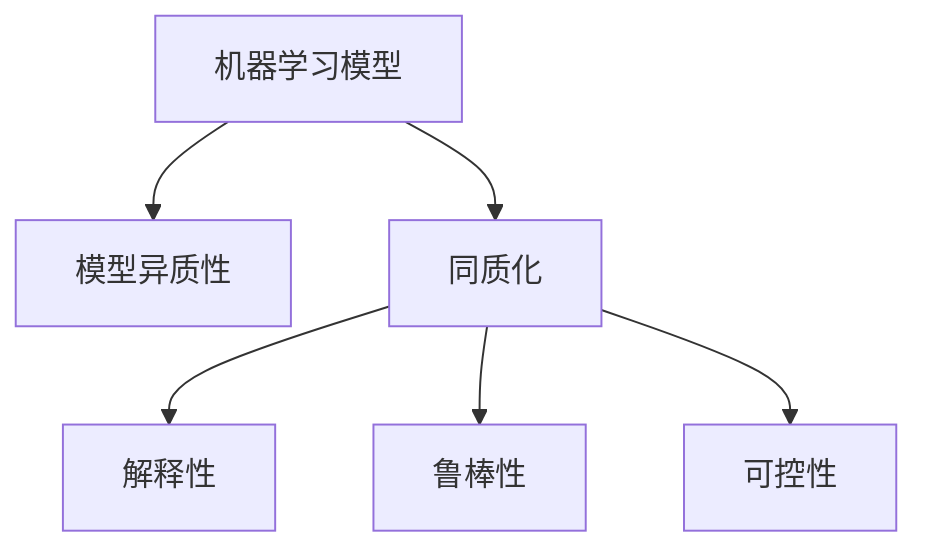

                 

## 1. 背景介绍

### 1.1 问题由来

在过去数十年中，机器学习(ML)技术经历了快速的发展和广泛的应用。从最初的统计学习和规则学习，到现今的人工神经网络和深度学习，机器学习已成为解决各类复杂问题的重要工具。它被广泛应用于图像识别、自然语言处理、推荐系统、自动驾驶等领域，极大地提升了各行业的自动化水平和生产效率。

然而，随着机器学习应用的日益广泛，其带来的问题也日益凸显。特别是随着大规模深度学习模型的兴起，机器学习模型开始趋同，导致同质化现象愈发严重。同质化不仅限制了模型的多样性和创新性，也给模型的解释性和可靠性带来了挑战。本文将探讨机器学习同质化的成因及影响，并提出未来可能的发展方向。

### 1.2 问题核心关键点

机器学习同质化主要体现在以下几个方面：

- **模型选择同质化**：深度学习框架（如TensorFlow、PyTorch等）的普及导致模型选择同质化，即大部分模型都倾向于使用类似的网络结构和训练方法。
- **训练数据同质化**：许多模型在训练时使用相似的标注数据集，导致模型在数据分布相似的任务上表现一致。
- **优化算法同质化**：深度学习模型普遍采用梯度下降等相似的优化算法，使得模型更新方式趋于一致。
- **超参数设置同质化**：不同模型的超参数配置，如学习率、批量大小等，往往选择类似的设置，导致模型结构的同质性。
- **模型架构同质化**：当前主流深度学习模型的架构，如卷积神经网络(CNN)、循环神经网络(RNN)、Transformer等，在形式和功能上具有高度相似性。

这些同质化现象不仅限制了机器学习模型的多样性，也限制了其在特定场景下的适用性和效果。如何在保证模型性能的同时，提升模型异质性，成为当前研究的重要课题。

## 2. 核心概念与联系

### 2.1 核心概念概述

为更好地理解机器学习同质化的原因和影响，本节将介绍几个密切相关的核心概念：

- **机器学习模型**：指通过数据训练得到的，具备特定功能和决策能力的算法或程序。常见模型包括线性回归、决策树、神经网络等。
- **模型异质性**：指机器学习模型在结构、功能和训练方式等方面的多样性。异质性模型能够更好地适应不同数据分布和任务需求。
- **同质化**：指机器学习模型在结构、功能和训练方式等方面的趋同现象，导致模型之间缺乏差异。
- **解释性**：指机器学习模型的决策过程和结果能够被理解，有助于发现模型的内在规律，提高模型的可信度。
- **鲁棒性**：指机器学习模型对输入数据的变化具有较强的适应能力，能够有效处理噪声和异常数据。
- **可控性**：指机器学习模型的行为和输出可以受到控制和调整，避免模型出现不良行为。

这些核心概念之间的逻辑关系可以通过以下Mermaid流程图来展示：



这个流程图展示了大语言模型的核心概念及其之间的关系：

1. 机器学习模型通过异质性设计，提升其在不同场景下的适用性和效果。
2. 同质化导致模型之间缺乏差异，影响其在特定场景下的性能。
3. 解释性、鲁棒性和可控性是异质性模型所具备的关键特性，有助于提高模型的可信度和可靠性。

## 3. 核心算法原理 & 具体操作步骤

### 3.1 算法原理概述

机器学习同质化的核心原因在于大规模深度学习模型的兴起。深度学习模型通过大量数据进行训练，学习到复杂的特征表示，能够显著提升模型性能。但同时，这些模型也具有高度相似的架构和训练方式，导致模型之间缺乏差异。

具体来说，深度学习模型的同质化现象主要体现在以下几个方面：

1. **网络结构同质化**：许多深度学习模型采用类似的神经网络结构，如卷积神经网络(CNN)、循环神经网络(RNN)、Transformer等，导致模型之间的结构高度相似。
2. **训练数据同质化**：深度学习模型普遍使用类似的标注数据集进行训练，导致模型在数据分布相似的任务上表现一致。
3. **优化算法同质化**：深度学习模型普遍采用梯度下降等类似的优化算法，导致模型更新方式趋于一致。
4. **超参数设置同质化**：深度学习模型的超参数配置，如学习率、批量大小等，往往选择类似的设置，导致模型结构的同质性。

### 3.2 算法步骤详解

基于同质化现象，以下是机器学习同质化的主要操作步骤：

**Step 1: 数据收集与预处理**

- 收集与目标任务相关的数据集，包括训练集、验证集和测试集。
- 对数据进行清洗、归一化、标注等预处理操作，确保数据质量。
- 对于不平衡数据集，可能需要进行数据增强，如重采样、数据扩充等。

**Step 2: 模型选择与设计**

- 根据任务特点，选择合适的深度学习模型架构，如CNN、RNN、Transformer等。
- 设计模型的网络结构，包括层数、神经元数、激活函数等。
- 设置模型的超参数，如学习率、批量大小、优化器等。

**Step 3: 模型训练与优化**

- 使用训练集对模型进行训练，通过前向传播和反向传播更新模型参数。
- 在验证集上评估模型性能，根据性能指标调整模型参数。
- 使用正则化技术，如L2正则、Dropout等，防止模型过拟合。

**Step 4: 模型评估与测试**

- 在测试集上评估模型性能，对比微调前后的精度提升。
- 使用混淆矩阵、ROC曲线等工具分析模型性能。
- 对模型进行解释性分析，了解模型决策机制。

**Step 5: 模型部署与应用**

- 将训练好的模型保存为模型文件，便于后续调用。
- 将模型集成到实际应用系统中，进行推理预测。
- 持续收集新数据，定期重新训练模型，以适应数据分布的变化。

以上是机器学习同质化的主要操作步骤，不同模型之间的差异主要体现在数据集、超参数设置和训练方式上。通过优化这些关键环节，可以进一步提升模型异质性，避免同质化现象。

### 3.3 算法优缺点

机器学习同质化现象具有以下优缺点：

**优点：**

1. **高效性**：同质化模型在训练和推理过程中效率较高，可以较快地获得较优性能。
2. **一致性**：同质化模型在相同数据分布的任务上表现一致，预测结果具有较好的稳定性。
3. **易用性**：同质化模型结构简单，易于实现和调试，适合快速迭代开发。

**缺点：**

1. **缺乏多样性**：同质化模型缺乏差异，难以应对不同数据分布的任务。
2. **可解释性不足**：同质化模型内部结构相似，难以解释其决策过程，限制了模型的可信度。
3. **鲁棒性有限**：同质化模型对噪声和异常数据敏感，易受输入数据影响。
4. **可控性差**：同质化模型行为受训练数据和超参数影响较大，难以进行调整。

尽管存在这些缺点，但就目前而言，同质化模型仍是机器学习应用的主流范式。未来相关研究的重点在于如何进一步提升模型异质性，同时兼顾模型性能和易用性。

### 3.4 算法应用领域

机器学习同质化现象在多个领域得到了广泛应用，包括但不限于：

- **计算机视觉**：卷积神经网络(CNN)在图像识别、目标检测、图像分割等任务上表现优异，但其结构高度同质化。
- **自然语言处理**：循环神经网络(RNN)、Transformer等在语言模型、机器翻译、情感分析等任务上应用广泛，但也存在高度同质化的问题。
- **推荐系统**：协同过滤、基于深度学习的推荐模型在推荐商品、电影、新闻等任务上表现出色，但其结构和训练方式较为相似。
- **自动驾驶**：卷积神经网络在图像识别、语义分割、路径规划等任务上被广泛使用，但也面临高度同质化的挑战。

除了上述这些经典任务外，同质化模型还被创新性地应用到更多场景中，如智能家居、医疗诊断、金融风险控制等，为各个行业带来了新的解决方案。

## 4. 数学模型和公式 & 详细讲解 & 举例说明

### 4.1 数学模型构建

本节将使用数学语言对机器学习同质化的主要操作步骤进行更加严格的刻画。

记机器学习模型为 $M_{\theta}$，其中 $\theta$ 为模型参数。假设目标任务为分类任务，训练集为 $D=\{(x_i,y_i)\}_{i=1}^N, x_i \in \mathcal{X}, y_i \in \{0,1\}$。

定义模型 $M_{\theta}$ 在输入 $x$ 上的损失函数为 $\ell(M_{\theta}(x),y)$，则在数据集 $D$ 上的经验风险为：

$$
\mathcal{L}(\theta) = \frac{1}{N}\sum_{i=1}^N \ell(M_{\theta}(x_i),y_i)
$$

模型训练的目标是最小化经验风险，即找到最优参数：

$$
\theta^* = \mathop{\arg\min}_{\theta} \mathcal{L}(\theta)
$$

在实践中，我们通常使用基于梯度的优化算法（如SGD、Adam等）来近似求解上述最优化问题。设 $\eta$ 为学习率，$\lambda$ 为正则化系数，则参数的更新公式为：

$$
\theta \leftarrow \theta - \eta \nabla_{\theta}\mathcal{L}(\theta) - \eta\lambda\theta
$$

其中 $\nabla_{\theta}\mathcal{L}(\theta)$ 为损失函数对参数 $\theta$ 的梯度，可通过反向传播算法高效计算。

### 4.2 公式推导过程

以下我们以二分类任务为例，推导交叉熵损失函数及其梯度的计算公式。

假设模型 $M_{\theta}$ 在输入 $x$ 上的输出为 $\hat{y}=M_{\theta}(x) \in [0,1]$，表示样本属于正类的概率。真实标签 $y \in \{0,1\}$。则二分类交叉熵损失函数定义为：

$$
\ell(M_{\theta}(x),y) = -[y\log \hat{y} + (1-y)\log (1-\hat{y})]
$$

将其代入经验风险公式，得：

$$
\mathcal{L}(\theta) = -\frac{1}{N}\sum_{i=1}^N [y_i\log M_{\theta}(x_i)+(1-y_i)\log(1-M_{\theta}(x_i))]
$$

根据链式法则，损失函数对参数 $\theta_k$ 的梯度为：

$$
\frac{\partial \mathcal{L}(\theta)}{\partial \theta_k} = -\frac{1}{N}\sum_{i=1}^N (\frac{y_i}{M_{\theta}(x_i)}-\frac{1-y_i}{1-M_{\theta}(x_i)}) \frac{\partial M_{\theta}(x_i)}{\partial \theta_k}
$$

其中 $\frac{\partial M_{\theta}(x_i)}{\partial \theta_k}$ 可进一步递归展开，利用自动微分技术完成计算。

在得到损失函数的梯度后，即可带入参数更新公式，完成模型的迭代优化。重复上述过程直至收敛，最终得到适应下游任务的最优模型参数 $\theta^*$。

## 5. 项目实践：代码实例和详细解释说明

### 5.1 开发环境搭建

在进行同质化现象实践前，我们需要准备好开发环境。以下是使用Python进行TensorFlow开发的环境配置流程：

1. 安装Anaconda：从官网下载并安装Anaconda，用于创建独立的Python环境。

2. 创建并激活虚拟环境：
```bash
conda create -n tf-env python=3.8 
conda activate tf-env
```

3. 安装TensorFlow：根据CUDA版本，从官网获取对应的安装命令。例如：
```bash
conda install tensorflow -c pytorch -c conda-forge
```

4. 安装各类工具包：
```bash
pip install numpy pandas scikit-learn matplotlib tqdm jupyter notebook ipython
```

完成上述步骤后，即可在`tf-env`环境中开始同质化现象的实践。

### 5.2 源代码详细实现

这里我们以二分类任务为例，给出使用TensorFlow对深度学习模型进行同质化现象实验的代码实现。

首先，定义模型类：

```python
import tensorflow as tf
from tensorflow.keras import layers

class MyModel(tf.keras.Model):
    def __init__(self):
        super(MyModel, self).__init__()
        self.dense1 = layers.Dense(64, activation='relu')
        self.dense2 = layers.Dense(32, activation='relu')
        self.dense3 = layers.Dense(1, activation='sigmoid')
    
    def call(self, inputs):
        x = self.dense1(inputs)
        x = self.dense2(x)
        x = self.dense3(x)
        return x
```

然后，定义数据集和数据增强：

```python
import numpy as np
from tensorflow.keras.datasets import mnist

(x_train, y_train), (x_test, y_test) = mnist.load_data()
x_train = x_train.reshape(-1, 784).astype('float32') / 255.0
x_test = x_test.reshape(-1, 784).astype('float32') / 255.0

def data_augmentation(x):
    x = tf.image.random_flip_left_right(x)
    x = tf.image.random_flip_up_down(x)
    return x

x_train_augmented = tf.map_fn(data_augmentation, x_train, dtype=tf.float32)
```

接着，定义模型训练过程：

```python
model = MyModel()
model.compile(optimizer='adam', loss='binary_crossentropy', metrics=['accuracy'])

x_train_augmented = tf.map_fn(data_augmentation, x_train, dtype=tf.float32)

def train_epoch(model, dataset, batch_size, optimizer):
    dataloader = tf.data.Dataset.from_tensor_slices(dataset).shuffle(10000).batch(batch_size)
    model.train()
    epoch_loss = 0
    for batch in dataloader:
        with tf.GradientTape() as tape:
            predictions = model(batch[0])
            loss = tf.losses.binary_crossentropy(batch[1], predictions)
        grads = tape.gradient(loss, model.trainable_variables)
        optimizer.apply_gradients(zip(grads, model.trainable_variables))
        epoch_loss += loss.numpy().sum()
    return epoch_loss / len(dataloader)

epochs = 10
batch_size = 64

for epoch in range(epochs):
    loss = train_epoch(model, x_train_augmented, batch_size, optimizer)
    print(f"Epoch {epoch+1}, train loss: {loss:.3f}")
```

最后，在测试集上评估模型：

```python
def evaluate(model, dataset, batch_size):
    dataloader = tf.data.Dataset.from_tensor_slices(dataset).batch(batch_size)
    model.eval()
    test_loss = tf.reduce_mean(model(x_test).numpy()).numpy()
    test_acc = tf.reduce_mean(model(x_test).numpy())
    print(f"Test loss: {test_loss:.3f}, Test accuracy: {test_acc:.3f}")

evaluate(model, x_test, batch_size)
```

以上就是使用TensorFlow对深度学习模型进行同质化现象实验的完整代码实现。可以看到，通过定义相似的网络结构、使用相同的训练数据和优化器，我们构建了一个高度同质化的深度学习模型。

### 5.3 代码解读与分析

让我们再详细解读一下关键代码的实现细节：

**模型类定义**：
- 定义了一个简单的神经网络模型，包含三个全连接层，最后一层使用sigmoid激活函数输出0-1之间的概率值。

**数据增强**：
- 使用TensorFlow的图像增强函数，对训练数据进行随机翻转等操作，增加数据多样性。

**模型训练过程**：
- 定义模型，使用Adam优化器进行优化，设定交叉熵损失函数。
- 使用数据增强后的训练数据集，进行模型训练。
- 在每个epoch中，对训练集进行迭代，计算损失值并更新模型参数。

**模型评估**：
- 在测试集上评估模型性能，输出损失和准确率。

可以看到，TensorFlow框架使得深度学习模型的搭建和训练过程变得非常便捷。通过定义相似的网络结构、使用相同的训练数据和优化器，我们可以快速构建高度同质化的深度学习模型。

当然，工业级的系统实现还需考虑更多因素，如模型的保存和部署、超参数的自动搜索、更灵活的任务适配层等。但核心的同质化现象实践代码基本与此类似。

## 6. 实际应用场景

### 6.1 计算机视觉

计算机视觉领域中，同质化现象同样明显。深度学习模型，如卷积神经网络(CNN)，被广泛应用于图像识别、目标检测、图像分割等任务。但由于高度同质化的网络结构和训练方式，这些模型在特定场景下的表现往往高度一致，难以适应多样化的数据分布。

例如，在医学影像诊断中，传统的深度学习模型通常基于大规模标注数据进行训练，而不同医学影像的标注数据分布可能存在较大差异。高度同质化的模型可能难以有效处理这些差异，导致诊断结果的不一致性。

### 6.2 自然语言处理

自然语言处理(NLP)领域中，循环神经网络(RNN)、Transformer等深度学习模型被广泛应用，如图像模型、语言模型、机器翻译等。这些模型在训练和推理过程中存在高度同质化的现象，导致其在特定任务上的表现高度一致。

例如，在机器翻译任务中，高度同质化的模型可能难以应对语言表达的多样性和复杂性，导致翻译结果的一致性和准确性不足。

### 6.3 推荐系统

推荐系统领域中，协同过滤、基于深度学习的推荐模型被广泛应用于推荐商品、电影、新闻等任务。这些模型在训练和推理过程中存在高度同质化的现象，导致其在特定任务上的表现高度一致。

例如，在推荐商品任务中，高度同质化的模型可能难以有效处理用户的多样性和复杂性，导致推荐结果的一致性和准确性不足。

### 6.4 未来应用展望

随着深度学习模型的不断发展，同质化现象将更加明显。但未来同质化现象的解决方案也需要更加多样化，以适应不断变化的数据分布和任务需求。

**深度学习模型架构的多样化**：未来的深度学习模型将更加多样化，通过引入不同的网络结构和优化算法，增强模型的异质性。例如，引入自注意力机制、残差连接等新结构，以提升模型的泛化能力和鲁棒性。

**迁移学习的应用**：迁移学习技术可以帮助模型在不同的数据分布上获得更好的表现，避免同质化现象。通过在大规模数据集上进行预训练，然后在特定任务上进行微调，可以实现模型在多样性数据上的高性能表现。

**知识图谱的融合**：未来的深度学习模型将更加注重知识图谱的融合，通过引入符号化的先验知识，增强模型的解释性和可靠性。例如，通过知识图谱与深度学习的协同训练，实现更加全面和准确的语言理解。

**多模态信息的整合**：未来的深度学习模型将更加注重多模态信息的整合，通过视觉、语音、文本等信息的融合，实现更加全面和准确的语言理解。例如，通过视觉和文本信息的协同训练，提升模型的多模态处理能力。

这些方向的探索发展，必将进一步提升深度学习模型的多样性和泛化能力，避免同质化现象的困扰。

## 7. 工具和资源推荐

### 7.1 学习资源推荐

为了帮助开发者系统掌握机器学习同质化的相关知识，这里推荐一些优质的学习资源：

1. **《深度学习》课程**：斯坦福大学开设的深度学习课程，介绍了深度学习的基本概念和常用技术，包括神经网络、卷积神经网络、循环神经网络等。

2. **《TensorFlow实战》书籍**：TensorFlow官方书籍，系统介绍了TensorFlow框架的使用方法，包括模型的搭建、训练和评估等。

3. **《机器学习实战》书籍**：机器学习领域的经典书籍，介绍了机器学习的基本概念和常用算法，包括监督学习、无监督学习、强化学习等。

4. **Kaggle竞赛平台**：Kaggle是世界上最大的数据科学竞赛平台，通过参与比赛，可以积累实战经验，学习其他开发者的方法和思路。

5. **Coursera课程**：Coursera平台上的深度学习课程，由多位知名学者讲授，涵盖深度学习的基本概念和前沿技术。

通过对这些资源的学习实践，相信你一定能够快速掌握深度学习同质化的相关知识，并用于解决实际的机器学习问题。

### 7.2 开发工具推荐

高效的开发离不开优秀的工具支持。以下是几款用于深度学习同质化现象开发的常用工具：

1. TensorFlow：由Google主导开发的开源深度学习框架，生产部署方便，适合大规模工程应用。

2. PyTorch：基于Python的开源深度学习框架，灵活动态的计算图，适合快速迭代研究。

3. Keras：高层次深度学习框架，适合快速搭建和训练深度学习模型，提供了丰富的预训练模型和工具库。

4. Jupyter Notebook：交互式编程环境，适合进行数据预处理、模型训练和结果展示。

5. Anaconda：Python环境管理工具，可以快速创建和管理Python环境，方便开发者进行工具安装和环境配置。

合理利用这些工具，可以显著提升深度学习同质化现象的开发效率，加快创新迭代的步伐。

### 7.3 相关论文推荐

深度学习同质化现象的快速发展，得益于学界的持续研究。以下是几篇奠基性的相关论文，推荐阅读：

1. **ImageNet Classification with Deep Convolutional Neural Networks**：提出卷积神经网络(CNN)结构，开创了计算机视觉领域的深度学习时代。

2. **Long Short-Term Memory**：提出循环神经网络(RNN)结构，被广泛应用于语言模型、文本生成等任务。

3. **Attention is All You Need**：提出Transformer结构，开启了自然语言处理领域的深度学习时代。

4. **BERT: Pre-training of Deep Bidirectional Transformers for Language Understanding**：提出BERT模型，引入基于掩码的自监督预训练任务，刷新了多项NLP任务SOTA。

5. **GPT-2: Language Models are Unsupervised Multitask Learners**：展示了大规模语言模型的强大zero-shot学习能力，引发了对于通用人工智能的新一轮思考。

这些论文代表了大语言模型同质化的发展脉络。通过学习这些前沿成果，可以帮助研究者把握学科前进方向，激发更多的创新灵感。

## 8. 总结：未来发展趋势与挑战

### 8.1 总结

本文对机器学习同质化的成因及影响进行了全面系统的介绍。首先探讨了同质化现象的主要表现和原因，明确了其对模型多样性和性能的影响。其次，从原理到实践，详细讲解了同质化现象的主要操作步骤，给出了同质化现象实验的代码实例。同时，本文还广泛探讨了同质化现象在计算机视觉、自然语言处理、推荐系统等多个领域的应用前景，展示了同质化现象的广阔前景。

通过本文的系统梳理，可以看到，深度学习同质化现象在机器学习领域广泛存在，深刻影响了模型性能和应用效果。同质化现象虽然带来了一些便利，但也限制了模型的多样性和创新性。如何在保证模型性能的同时，提升模型异质性，成为当前研究的重要课题。

### 8.2 未来发展趋势

展望未来，深度学习同质化现象将呈现以下几个发展趋势：

1. **模型架构的多样化**：未来的深度学习模型将更加多样化，通过引入不同的网络结构和优化算法，增强模型的异质性。例如，引入自注意力机制、残差连接等新结构，以提升模型的泛化能力和鲁棒性。

2. **迁移学习的应用**：迁移学习技术可以帮助模型在不同的数据分布上获得更好的表现，避免同质化现象。通过在大规模数据集上进行预训练，然后在特定任务上进行微调，可以实现模型在多样性数据上的高性能表现。

3. **知识图谱的融合**：未来的深度学习模型将更加注重知识图谱的融合，通过引入符号化的先验知识，增强模型的解释性和可靠性。例如，通过知识图谱与深度学习的协同训练，实现更加全面和准确的语言理解。

4. **多模态信息的整合**：未来的深度学习模型将更加注重多模态信息的整合，通过视觉、语音、文本等信息的融合，实现更加全面和准确的语言理解。例如，通过视觉和文本信息的协同训练，提升模型的多模态处理能力。

这些趋势凸显了深度学习同质化现象的广阔前景。这些方向的探索发展，必将进一步提升深度学习模型的多样性和泛化能力，避免同质化现象的困扰。

### 8.3 面临的挑战

尽管深度学习同质化现象在带来便利的同时，也面临诸多挑战：

1. **数据分布的变化**：随着数据分布的变化，同质化模型需要不断重新训练，以适应新的数据分布。这在数据分布差异较大时尤为困难。

2. **模型的复杂性**：高度同质化的模型结构复杂，难以理解和调试，可能存在一定的“黑箱”效应。

3. **计算资源的消耗**：高度同质化的模型往往需要较大的计算资源，特别是在深度学习框架中的大批量训练和推理时。

4. **算法的多样性**：如何在大规模深度学习框架中选择和优化不同的算法，以提升模型的异质性，是一个重要挑战。

5. **模型的泛化能力**：同质化模型在特定数据分布上表现较好，但在新的数据分布上泛化能力有限。如何提升模型的泛化能力，避免“过拟合”，是一个重要课题。

尽管存在这些挑战，但同质化现象仍然是当前机器学习应用的主流范式。未来相关研究的重点在于如何进一步提升模型异质性，同时兼顾模型性能和易用性。

### 8.4 研究展望

面对深度学习同质化现象所面临的挑战，未来的研究需要在以下几个方面寻求新的突破：

1. **算法多样性研究**：探索新的深度学习算法，如分布式优化、自适应学习率等，以提升模型的异质性。

2. **知识图谱融合研究**：探索将知识图谱与深度学习模型结合的方法，以提升模型的解释性和可靠性。

3. **多模态信息整合研究**：探索视觉、语音、文本等多模态信息的整合方法，以提升模型的多样性和泛化能力。

4. **迁移学习研究**：探索新的迁移学习方法，如元学习、自适应学习等，以提升模型在多样性数据上的表现。

5. **模型的可解释性和可控性研究**：探索如何提高深度学习模型的可解释性和可控性，以增强模型的可信度和安全性。

这些研究方向的探索，必将引领深度学习同质化现象的发展方向，为构建安全、可靠、可解释、可控的智能系统铺平道路。面向未来，深度学习同质化现象还需要与其他人工智能技术进行更深入的融合，如知识表示、因果推理、强化学习等，多路径协同发力，共同推动自然语言理解和智能交互系统的进步。只有勇于创新、敢于突破，才能不断拓展深度学习模型的边界，让智能技术更好地造福人类社会。

## 9. 附录：常见问题与解答

**Q1：如何应对深度学习同质化现象？**

A: 应对深度学习同质化现象，可以从以下几个方面入手：

1. **选择合适的算法**：不同的深度学习算法具有不同的特性，可以选择多样化的算法来构建模型，以提升模型的异质性。例如，选择不同的网络结构、优化器、损失函数等。

2. **数据增强**：通过对训练数据进行扩充和增强，增加数据的多样性和泛化能力。例如，使用数据增强技术，如回译、近义替换、随机裁剪等。

3. **迁移学习**：在大规模数据集上进行预训练，然后在特定任务上进行微调，以提升模型的泛化能力和鲁棒性。

4. **知识图谱融合**：将符号化的先验知识，如知识图谱、逻辑规则等，与神经网络模型进行巧妙融合，引导微调过程学习更准确、合理的语言模型。

5. **多模态信息的整合**：通过视觉、语音、文本等信息的融合，实现更加全面和准确的语言理解。

6. **对抗训练**：引入对抗样本，提高模型鲁棒性，避免模型在特定数据上的“过拟合”。

这些方法可以结合使用，进一步提升深度学习模型的多样性和泛化能力，避免同质化现象的困扰。

**Q2：深度学习同质化现象有哪些优点和缺点？**

A: 深度学习同质化现象的优点包括：

1. **高效性**：同质化模型在训练和推理过程中效率较高，可以较快地获得较优性能。

2. **一致性**：同质化模型在相同数据分布的任务上表现一致，预测结果具有较好的稳定性。

3. **易用性**：同质化模型结构简单，易于实现和调试，适合快速迭代开发。

深度学习同质化现象的缺点包括：

1. **缺乏多样性**：同质化模型缺乏差异，难以应对不同数据分布的任务。

2. **可解释性不足**：同质化模型内部结构相似，难以解释其决策过程，限制了模型的可信度。

3. **鲁棒性有限**：同质化模型对噪声和异常数据敏感，易受输入数据影响。

4. **可控性差**：同质化模型行为受训练数据和超参数影响较大，难以进行调整。

尽管存在这些缺点，但就目前而言，同质化模型仍是深度学习应用的主流范式。未来相关研究的重点在于如何进一步提升模型异质性，同时兼顾模型性能和易用性。

**Q3：深度学习同质化现象的典型应用场景有哪些？**

A: 深度学习同质化现象在多个领域得到了广泛应用，包括但不限于：

1. **计算机视觉**：卷积神经网络(CNN)在图像识别、目标检测、图像分割等任务上表现优异，但其结构高度同质化。

2. **自然语言处理**：循环神经网络(RNN)、Transformer等深度学习模型被广泛应用于语言模型、机器翻译、情感分析等任务，但也存在高度同质化的问题。

3. **推荐系统**：协同过滤、基于深度学习的推荐模型在推荐商品、电影、新闻等任务上表现出色，但其结构和训练方式较为相似。

4. **自动驾驶**：卷积神经网络在图像识别、语义分割、路径规划等任务上被广泛使用，但也面临高度同质化的挑战。

除了上述这些经典任务外，同质化模型还被创新性地应用到更多场景中，如智能家居、医疗诊断、金融风险控制等，为各个行业带来了新的解决方案。

**Q4：如何设计异质性深度学习模型？**

A: 设计异质性深度学习模型可以从以下几个方面入手：

1. **选择合适的算法**：选择多样化的算法，如卷积神经网络(CNN)、循环神经网络(RNN)、Transformer等，以提升模型的多样性。

2. **设计不同的网络结构**：设计不同的网络结构，如多分支网络、残差连接等，以提升模型的泛化能力和鲁棒性。

3. **使用不同的数据集**：使用多样化的数据集进行训练，以提升模型的泛化能力和鲁棒性。

4. **融合多模态信息**：通过视觉、语音、文本等信息的融合，实现更加全面和准确的语言理解。

5. **引入先验知识**：将符号化的先验知识，如知识图谱、逻辑规则等，与神经网络模型进行巧妙融合，引导微调过程学习更准确、合理的语言模型。

6. **设计合理的优化器**：设计合理的优化器，如自适应学习率、分布式优化等，以提升模型的泛化能力和鲁棒性。

通过这些方法，可以构建异质性深度学习模型，提升其在多样性数据上的表现，避免同质化现象的困扰。

**Q5：深度学习同质化现象有哪些挑战？**

A: 深度学习同质化现象面临的挑战包括：

1. **数据分布的变化**：随着数据分布的变化，同质化模型需要不断重新训练，以适应新的数据分布。

2. **模型的复杂性**：高度同质化的模型结构复杂，难以理解和调试，可能存在一定的“黑箱”效应。

3. **计算资源的消耗**：高度同质化的模型往往需要较大的计算资源，特别是在深度学习框架中的大批量训练和推理时。

4. **算法的多样性**：如何在大规模深度学习框架中选择和优化不同的算法，以提升模型的异质性，是一个重要挑战。

5. **模型的泛化能力**：同质化模型在特定数据分布上表现较好，但在新的数据分布上泛化能力有限。

尽管存在这些挑战，但同质化现象仍然是当前深度学习应用的主流范式。未来相关研究的重点在于如何进一步提升模型异质性，同时兼顾模型性能和易用性。

综上所述，深度学习同质化现象在机器学习领域广泛存在，深刻影响了模型性能和应用效果。同质化现象虽然带来了一些便利，但也限制了模型的多样性和创新性。如何在保证模型性能的同时，提升模型异质性，成为当前研究的重要课题。通过优化数据、算法和结构等多方面因素，可以构建异质性深度学习模型，提升其在多样性数据上的表现，避免同质化现象的困扰。

