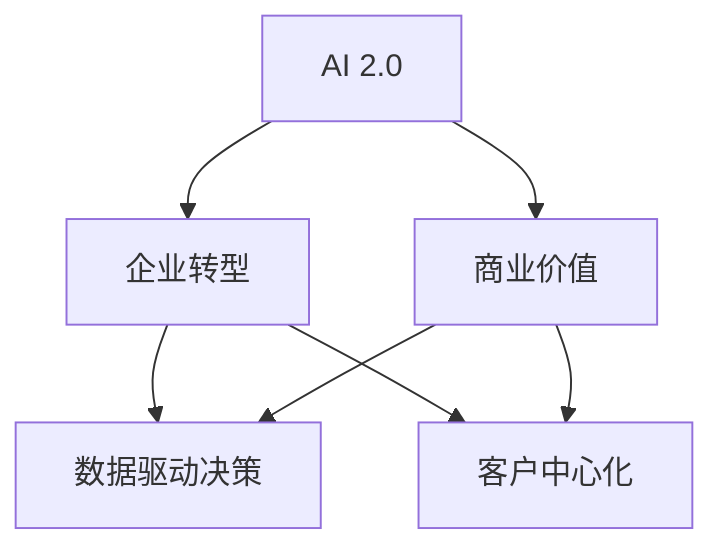

                 

# 李开复：AI 2.0 时代的商业价值

## 1. 背景介绍

### 1.1 问题由来
随着人工智能技术的迅猛发展，AI 2.0 时代已经到来。人工智能不再仅限于学术研究，而是逐渐渗透到各行各业，改变着我们的生活方式和商业模式。作为人工智能领域的先驱，李开复博士在 AI 2.0 时代的商业价值方面有着深刻的见解。

李开复认为，AI 2.0 时代的商业价值在于其能够为企业提供前所未有的竞争优势，包括提升效率、降低成本、创新产品和服务、增强客户体验等。同时，AI 2.0 也能够帮助企业在市场竞争中占据有利地位，提升企业的创新能力和市场响应速度。

### 1.2 问题核心关键点
李开复认为，AI 2.0 时代的商业价值主要体现在以下几个方面：

1. **效率提升**：AI 可以自动化处理大量重复性工作，减少人工错误，提高工作效率。
2. **成本降低**：通过优化流程和资源分配，AI 可以降低企业的运营成本。
3. **创新驱动**：AI 能够分析大量数据，揭示隐藏的模式和趋势，推动企业创新。
4. **客户体验改善**：通过自然语言处理、机器视觉等技术，AI 可以提供更加个性化和高效的服务，提升客户满意度。
5. **市场竞争优势**：AI 的快速学习和适应能力，使企业能够更快地响应市场需求，保持竞争优势。

### 1.3 问题研究意义
研究 AI 2.0 时代的商业价值，对于企业理解和应用人工智能技术，具有重要意义：

1. **战略布局**：帮助企业明确在 AI 2.0 时代的发展方向和战略规划。
2. **技术应用**：指导企业如何在具体业务场景中应用 AI 技术，实现业务优化和创新。
3. **市场竞争力**：提升企业对市场的敏感度和响应速度，增强市场竞争力。
4. **人才发展**：帮助企业培养和吸引 AI 相关人才，加速 AI 技术的落地应用。

## 2. 核心概念与联系

### 2.1 核心概念概述

为更好地理解 AI 2.0 时代的商业价值，本节将介绍几个密切相关的核心概念：

- **AI 2.0**：指新一代人工智能技术，包括深度学习、强化学习、自然语言处理、计算机视觉等领域的最新进展。AI 2.0 时代的核心特征是更加智能、自主和高效。

- **商业价值**：指 AI 技术在商业应用中的实际效益，包括但不限于提升效率、降低成本、创新产品和服务、增强客户体验等。

- **企业转型**：指企业通过引入 AI 技术，优化业务流程、提高运营效率、实现智能化转型的过程。

- **数据驱动决策**：指企业利用 AI 技术分析大量数据，辅助制定更科学、更有效的决策。

- **客户中心化**：指 AI 技术帮助企业更好地理解和满足客户需求，提升客户体验和满意度。

这些核心概念之间的逻辑关系可以通过以下 Mermaid 流程图来展示：



这个流程图展示了一个从 AI 2.0 技术到商业价值的转化过程，以及 AI 技术在不同应用场景中的具体表现。

## 3. 核心算法原理 & 具体操作步骤
### 3.1 算法原理概述

AI 2.0 时代的商业价值实现主要依赖于以下几个关键算法和技术：

- **深度学习**：通过多层神经网络模型，AI 可以学习并处理复杂的数据，实现高效的模式识别和预测。

- **自然语言处理**：通过 NLP 技术，AI 可以理解和生成人类语言，支持智能客服、智能推荐等应用。

- **计算机视觉**：通过图像识别和处理技术，AI 可以实现自动驾驶、医学影像分析等应用。

- **强化学习**：通过模拟奖励机制，AI 可以自主学习和优化策略，提升决策效率和效果。

### 3.2 算法步骤详解

AI 2.0 时代的商业价值实现一般包括以下几个关键步骤：

**Step 1: 数据准备**
- 收集和整理所需的数据，包括客户反馈、销售记录、市场趋势等。

**Step 2: 模型训练**
- 选择合适的 AI 模型，如深度学习模型、NLP 模型等，对数据进行训练。
- 使用监督学习、无监督学习或半监督学习等方法，训练模型以识别数据中的模式和规律。

**Step 3: 模型部署**
- 将训练好的模型部署到生产环境中，实现自动化应用。
- 根据业务需求，设计并实现模型的接口和调用方式，使其能够与其他系统集成。

**Step 4: 模型优化**
- 根据实际应用效果，不断优化模型参数和算法，提升模型的准确性和稳定性。
- 结合 A/B 测试等方法，评估模型效果，确保其在实际场景中的适用性。

### 3.3 算法优缺点

AI 2.0 技术的商业价值实现具有以下优点：

1. **效率提升**：AI 可以自动化处理大量数据，大幅提升数据处理和分析效率。
2. **成本降低**：通过优化流程和资源分配，AI 可以降低企业的运营成本。
3. **创新驱动**：AI 能够分析大量数据，揭示隐藏的模式和趋势，推动企业创新。
4. **客户体验改善**：通过自然语言处理、机器视觉等技术，AI 可以提供更加个性化和高效的服务，提升客户满意度。
5. **市场竞争优势**：AI 的快速学习和适应能力，使企业能够更快地响应市场需求，保持竞争优势。

同时，AI 2.0 技术也存在一定的局限性：

1. **数据质量依赖**：AI 模型的性能高度依赖于数据质量，低质量的数据可能导致模型效果不佳。
2. **技术门槛高**：AI 技术复杂，需要专业知识和高成本投入。
3. **安全与隐私问题**：AI 技术可能涉及敏感数据，存在数据泄露和隐私保护的风险。
4. **伦理与偏见**：AI 模型可能存在算法偏见和歧视，需要谨慎处理。

### 3.4 算法应用领域

AI 2.0 技术在商业领域已经得到了广泛的应用，覆盖了众多行业，包括但不限于：

- **金融行业**：AI 用于风险评估、欺诈检测、客户服务自动化等。
- **医疗行业**：AI 用于疾病诊断、影像分析、个性化治疗等。
- **零售行业**：AI 用于商品推荐、库存管理、客户关系管理等。
- **制造业**：AI 用于生产调度、质量检测、设备维护等。
- **物流行业**：AI 用于路线规划、仓储管理、配送优化等。
- **娱乐行业**：AI 用于内容推荐、个性化推荐、虚拟助手等。

这些应用领域展示了 AI 2.0 技术的广泛性和多样性，同时也反映了其在不同行业中的商业价值。

## 4. 数学模型和公式 & 详细讲解 & 举例说明

### 4.1 数学模型构建

在 AI 2.0 技术的应用中，数学模型起着至关重要的作用。以下是一个简单的线性回归模型的例子：

$$
y = \theta_0 + \theta_1x_1 + \theta_2x_2 + \cdots + \theta_nx_n + \epsilon
$$

其中，$y$ 表示预测值，$x_i$ 表示输入特征，$\theta_i$ 表示特征权重，$\epsilon$ 表示误差项。

### 4.2 公式推导过程

线性回归模型的推导过程如下：

1. 假设数据集为 $\{(x_i,y_i)\}_{i=1}^N$，其中 $x_i=(x_{i1},x_{i2},\cdots,x_{in})$，$y_i$ 表示标签。
2. 假设模型为 $y = \theta_0 + \theta_1x_1 + \theta_2x_2 + \cdots + \theta_nx_n$。
3. 根据最小二乘法，求解最优的参数 $\theta_i$，使得损失函数最小化。

$$
\min_{\theta_i} \frac{1}{N} \sum_{i=1}^N (y_i - (\theta_0 + \theta_1x_{i1} + \theta_2x_{i2} + \cdots + \theta_nx_{in}))^2
$$

推导过程比较复杂，可以借助统计学和微积分的知识进行理解。

### 4.3 案例分析与讲解

以金融行业中的信用评分为例，AI 可以用于分析客户的历史交易数据，预测其信用风险。一个简单的线性回归模型可以表示为：

$$
Score = \theta_0 + \theta_1Income + \theta_2Loan + \theta_3Debt + \theta_4Time + \epsilon
$$

其中，$Score$ 表示信用评分，$Income$ 表示收入，$Loan$ 表示贷款金额，$Debt$ 表示债务，$Time$ 表示贷款时间。通过优化模型参数，AI 可以预测客户未来的信用风险，帮助金融机构进行风险控制和贷款审批。

## 5. 项目实践：代码实例和详细解释说明

### 5.1 开发环境搭建

在进行 AI 2.0 技术的项目实践前，我们需要准备好开发环境。以下是使用 Python 进行 TensorFlow 开发的环境配置流程：

1. 安装 Anaconda：从官网下载并安装 Anaconda，用于创建独立的 Python 环境。

2. 创建并激活虚拟环境：
```bash
conda create -n tensorflow-env python=3.8 
conda activate tensorflow-env
```

3. 安装 TensorFlow：根据 GPU 版本，从官网获取对应的安装命令。例如：
```bash
conda install tensorflow tensorflow-gpu -c conda-forge
```

4. 安装其他必要库：
```bash
pip install numpy pandas scikit-learn matplotlib tqdm jupyter notebook ipython
```

完成上述步骤后，即可在 `tensorflow-env` 环境中开始 AI 2.0 技术的项目实践。

### 5.2 源代码详细实现

下面我们以金融行业的信用评分预测为例，给出使用 TensorFlow 进行 AI 2.0 技术开发的 PyTorch 代码实现。

首先，定义数据预处理函数：

```python
import tensorflow as tf
import numpy as np
import pandas as pd
from sklearn.preprocessing import StandardScaler
from sklearn.model_selection import train_test_split

def prepare_data(df, target_col):
    X = df.drop(target_col, axis=1)
    y = df[target_col]
    X = StandardScaler().fit_transform(X)
    X_train, X_test, y_train, y_test = train_test_split(X, y, test_size=0.2, random_state=42)
    return X_train, X_test, y_train, y_test
```

然后，定义模型和训练函数：

```python
from tensorflow.keras.models import Sequential
from tensorflow.keras.layers import Dense

def build_model():
    model = Sequential([
        Dense(32, activation='relu', input_shape=(num_features,)),
        Dense(1, activation='sigmoid')
    ])
    model.compile(optimizer='adam', loss='binary_crossentropy', metrics=['accuracy'])
    return model

def train_model(X_train, y_train, X_test, y_test, num_epochs=10):
    model = build_model()
    history = model.fit(X_train, y_train, validation_data=(X_test, y_test), epochs=num_epochs)
    return model, history
```

接着，加载数据并训练模型：

```python
data = pd.read_csv('credit_data.csv')
X_train, X_test, y_train, y_test = prepare_data(data, 'default')
model, history = train_model(X_train, y_train, X_test, y_test)
```

最后，评估模型并在测试集上预测：

```python
y_pred = model.predict(X_test)
threshold = 0.5
y_pred = [1 if x > threshold else 0 for x in y_pred]
accuracy = np.mean(y_pred == y_test)
print(f'Test accuracy: {accuracy:.2f}')
```

以上就是使用 TensorFlow 进行信用评分预测的完整代码实现。可以看到，TensorFlow 提供了高效的张量计算和模型构建工具，使得 AI 2.0 技术的开发更加便捷和高效。

### 5.3 代码解读与分析

让我们再详细解读一下关键代码的实现细节：

**prepare_data 函数**：
- 定义了数据预处理流程，包括特征选择、数据标准化、训练集划分等步骤。

**build_model 函数**：
- 定义了简单的线性回归模型，包含两个全连接层，最后一层使用 sigmoid 激活函数。
- 使用 `compile` 方法设置优化器、损失函数和评价指标。

**train_model 函数**：
- 训练模型，使用 `fit` 方法进行训练，指定训练轮数和验证集。
- 返回训练后的模型和训练过程中的历史指标。

**加载数据并训练模型**：
- 使用 Pandas 加载数据集。
- 调用 `prepare_data` 函数进行数据预处理。
- 调用 `train_model` 函数训练模型，并返回训练结果。

**评估模型并在测试集上预测**：
- 使用训练好的模型进行预测，并设定阈值进行二分类。
- 计算模型在测试集上的准确率。

可以看到，TensorFlow 提供了简单易用的 API，使得 AI 2.0 技术的开发更加便捷。开发者可以更专注于业务逻辑和模型优化，而不必过多关注底层实现细节。

## 6. 实际应用场景
### 6.1 智能客服系统

AI 2.0 技术在智能客服系统中的应用，可以显著提升客户服务效率和体验。通过自然语言处理和机器学习技术，AI 客服可以自动理解客户需求，提供快速、准确的回答。

具体而言，AI 客服可以包括以下功能：

- **自动接听**：根据客户输入的语音或文字，自动接听并分配至合适的客服人员。
- **语义理解**：使用 NLP 技术理解客户意图，识别关键信息。
- **智能回复**：根据客户需求，自动生成并回复相关信息，减少人工干预。
- **情感分析**：分析客户情感，提供更贴心的服务。
- **多语言支持**：支持多种语言，提升国际化服务水平。

通过 AI 2.0 技术，智能客服系统可以 7x24 小时不间断服务，处理大量客户咨询，提升客户满意度和企业形象。

### 6.2 金融行业应用

AI 2.0 技术在金融行业中的应用，可以大幅提升风险控制和客户服务能力。通过数据分析和机器学习，AI 可以预测客户信用风险，优化贷款审批流程，提升投资决策效率。

具体而言，AI 在金融行业可以包括以下应用：

- **信用评分**：根据客户历史交易数据，预测其信用风险。
- **风险管理**：识别潜在的风险因素，制定风险控制策略。
- **投资建议**：根据市场数据和客户偏好，提供个性化投资建议。
- **客户服务**：使用智能客服和聊天机器人，处理客户咨询和投诉。
- **反欺诈检测**：识别异常交易和行为，预防欺诈风险。

通过 AI 2.0 技术，金融行业可以实现高效的风险管理和客户服务，提升运营效率和市场竞争力。

### 6.3 医疗行业应用

AI 2.0 技术在医疗行业中的应用，可以改善诊疗过程，提升患者体验。通过数据分析和机器学习，AI 可以辅助医生进行诊断，优化治疗方案，提升医疗服务水平。

具体而言，AI 在医疗行业可以包括以下应用：

- **疾病诊断**：分析医学影像和病历数据，辅助医生进行疾病诊断。
- **个性化治疗**：根据患者病情和基因信息，制定个性化治疗方案。
- **医疗咨询**：使用智能客服和聊天机器人，提供医疗咨询和健康建议。
- **药物研发**：分析化合物结构和活性数据，加速药物研发进程。
- **医疗管理**：优化医院资源分配和流程管理，提升医疗效率。

通过 AI 2.0 技术，医疗行业可以实现更精准的诊断和治疗，提升患者满意度和医疗服务水平。

### 6.4 未来应用展望

随着 AI 2.0 技术的发展，其应用场景将进一步扩展，带来更多商业价值。未来，AI 2.0 技术可能在以下几个方面取得突破：

- **自动驾驶**：通过计算机视觉和强化学习，实现自动驾驶汽车，提升交通安全和效率。
- **智能家居**：通过自然语言处理和物联网技术，实现智能家居设备控制，提升家庭生活水平。
- **个性化推荐**：通过机器学习和数据分析，实现个性化商品推荐，提升用户购物体验。
- **医疗机器人**：通过机器人技术和 AI 算法，实现远程手术和护理，提升医疗服务质量。
- **智慧城市**：通过 AI 技术和大数据，实现智慧城市管理，提升城市治理水平。

AI 2.0 技术的应用前景广阔，未来将渗透到更多领域，带来更多商业价值和创新机会。

## 7. 工具和资源推荐
### 7.1 学习资源推荐

为了帮助开发者系统掌握 AI 2.0 技术的理论基础和实践技巧，这里推荐一些优质的学习资源：

1. **TensorFlow官方文档**：提供了详尽的 API 文档和教程，涵盖 AI 2.0 技术的多方面应用。
2. **Kaggle**：全球最大的数据科学竞赛平台，提供丰富的数据集和竞赛题目，帮助开发者实战练习。
3. **Coursera**：提供了多门 AI 2.0 技术的在线课程，涵盖深度学习、机器学习、自然语言处理等领域。
4. **Udacity**：提供了多门 AI 2.0 技术的在线课程，涵盖自动驾驶、智能推荐、医疗 AI 等领域。
5. **Google AI**：提供了多门 AI 2.0 技术的在线课程和实验室，涵盖计算机视觉、自然语言处理等领域。

通过对这些资源的学习实践，相信你一定能够快速掌握 AI 2.0 技术的精髓，并用于解决实际的业务问题。

### 7.2 开发工具推荐

高效的开发离不开优秀的工具支持。以下是几款用于 AI 2.0 技术开发的常用工具：

1. **TensorFlow**：基于 Python 的开源深度学习框架，灵活动态的计算图，适合快速迭代研究。
2. **PyTorch**：基于 Python 的开源深度学习框架，动态计算图，支持动态模型定义，适合研究和实验。
3. **Jupyter Notebook**：支持代码、数据和结果的可视化展示，适合数据探索和模型开发。
4. **Git**：版本控制工具，支持代码协作和版本管理，适合团队开发和代码共享。
5. **Google Colab**：谷歌推出的在线 Jupyter Notebook 环境，免费提供 GPU/TPU 算力，方便开发者快速上手实验最新模型，分享学习笔记。

合理利用这些工具，可以显著提升 AI 2.0 技术的开发效率，加快创新迭代的步伐。

### 7.3 相关论文推荐

AI 2.0 技术的发展源于学界的持续研究。以下是几篇奠基性的相关论文，推荐阅读：

1. **TensorFlow 核心技术论文**：深入探讨 TensorFlow 的架构、优化和应用，为 AI 2.0 技术提供了理论支持。
2. **Deep Learning**：由 Ian Goodfellow 等人合著的深度学习经典教材，涵盖深度学习的基本理论和算法。
3. **Reinforcement Learning: An Introduction**：由 Richard Sutton 和 Andrew Barto 合著的强化学习经典教材，介绍了强化学习的基本理论和算法。
4. **Natural Language Processing with Transformers**：介绍 Transformer 模型的原理和应用，为自然语言处理技术提供了重要参考。
5. **AlphaGo Zero**：介绍 AlphaGo Zero 的原理和训练过程，展示了深度强化学习在棋类游戏中的应用。

这些论文代表了大规模人工智能技术的最新进展，通过学习这些前沿成果，可以帮助研究者把握学科前进方向，激发更多的创新灵感。

## 8. 总结：未来发展趋势与挑战
### 8.1 总结

本文对 AI 2.0 时代的商业价值进行了全面系统的介绍。首先阐述了 AI 2.0 技术的发展背景和商业价值，明确了 AI 2.0 技术在提升效率、降低成本、创新产品和服务等方面的独特优势。其次，从原理到实践，详细讲解了 AI 2.0 技术在实际应用中的关键算法和操作步骤，给出了具体的数据集和代码实例。同时，本文还广泛探讨了 AI 2.0 技术在智能客服、金融、医疗等多个行业领域的应用前景，展示了 AI 2.0 技术的广泛性和多样性。最后，本文精选了 AI 2.0 技术的各类学习资源，力求为读者提供全方位的技术指引。

通过本文的系统梳理，可以看到，AI 2.0 技术在各个行业中的应用前景广阔，极大地拓展了人工智能技术的边界，催生了更多的落地场景。未来，伴随 AI 2.0 技术的持续演进，相信 AI 技术将在更广阔的领域大放异彩，深刻影响人类的生产生活方式。

### 8.2 未来发展趋势

展望未来，AI 2.0 技术的商业价值将呈现以下几个发展趋势：

1. **技术成熟**：AI 2.0 技术的不断成熟，将带来更高效、更稳定的应用效果。
2. **行业渗透**：AI 2.0 技术将渗透到更多行业，带来更多的商业价值和创新机会。
3. **智能化水平提升**：AI 2.0 技术将带来更高的智能化水平，提升企业的决策效率和市场竞争力。
4. **客户体验改善**：AI 2.0 技术将带来更个性化、更高效的服务体验，提升客户满意度和忠诚度。
5. **数据驱动决策**：AI 2.0 技术将带来更科学、更精准的数据驱动决策，提升企业的运营效率。
6. **智能化转型的加速**：AI 2.0 技术将推动更多企业实现智能化转型，提升企业的竞争力。

以上趋势凸显了 AI 2.0 技术的广阔前景。这些方向的探索发展，必将进一步提升 AI 2.0 技术的商业价值，为人类生产和生活带来更多便利和创新。

### 8.3 面临的挑战

尽管 AI 2.0 技术已经取得了瞩目成就，但在迈向更加智能化、普适化应用的过程中，它仍面临诸多挑战：

1. **数据质量问题**：数据质量的高度依赖可能导致模型效果不佳，需要高质量的数据源和预处理流程。
2. **技术门槛高**：AI 技术复杂，需要专业知识和高成本投入，需要企业投入大量人力和资源。
3. **伦理和隐私问题**：AI 技术可能涉及敏感数据，存在数据泄露和隐私保护的风险，需要严格的数据保护措施。
4. **模型解释性不足**：AI 模型通常缺乏可解释性，难以理解其内部工作机制和决策逻辑，需要加强可解释性研究。
5. **算法偏见问题**：AI 模型可能存在算法偏见和歧视，需要谨慎处理和纠正，确保公平性和公正性。

面对这些挑战，未来的研究和实践需要不断创新和改进，提升 AI 技术的可靠性和可解释性，确保其公平性和公正性，保障数据安全和隐私保护。

### 8.4 研究展望

面对 AI 2.0 技术面临的挑战，未来的研究需要在以下几个方面寻求新的突破：

1. **数据治理与质量提升**：提升数据质量，制定数据治理策略，确保数据源的可靠性和数据处理的规范性。
2. **模型可解释性**：加强 AI 模型的可解释性研究，提升模型的透明性和可理解性，增强模型应用的可控性和可信性。
3. **算法公平性**：加强 AI 算法的公平性研究，确保算法的公正性和透明性，消除算法偏见和歧视。
4. **技术集成与协同**：将 AI 技术与区块链、物联网等新兴技术进行融合，提升技术的综合应用能力。
5. **伦理与合规**：制定 AI 技术的伦理规范和合规标准，确保技术的健康发展和社会责任。

这些研究方向的探索，必将引领 AI 2.0 技术迈向更高的台阶，为构建安全、可靠、可解释、可控的智能系统铺平道路。面向未来，AI 2.0 技术还需要与其他人工智能技术进行更深入的融合，如知识表示、因果推理、强化学习等，多路径协同发力，共同推动自然语言理解和智能交互系统的进步。只有勇于创新、敢于突破，才能不断拓展 AI 技术的边界，让智能技术更好地造福人类社会。

## 9. 附录：常见问题与解答

**Q1: AI 2.0 技术在企业应用中需要哪些关键步骤？**

A: AI 2.0 技术在企业应用中需要以下关键步骤：

1. **需求分析**：明确企业的应用需求和目标，确定 AI 技术的解决方案。
2. **数据收集与准备**：收集和准备所需的数据，包括清洗、标准化、特征工程等步骤。
3. **模型选择与设计**：选择合适的 AI 模型，设计并优化模型的结构和参数。
4. **模型训练与评估**：使用标注数据训练模型，评估模型效果并进行优化。
5. **模型部署与集成**：将训练好的模型部署到生产环境中，实现自动化应用。
6. **模型监控与维护**：定期监控模型的性能和效果，根据业务需求进行维护和更新。

**Q2: AI 2.0 技术在落地应用中需要注意哪些问题？**

A: AI 2.0 技术在落地应用中需要注意以下问题：

1. **数据质量**：确保数据质量，提升数据治理和标准化水平。
2. **模型选择**：根据业务需求选择合适的 AI 模型，避免模型选择错误导致效果不佳。
3. **算法公平性**：确保算法的公正性和透明性，避免算法偏见和歧视。
4. **模型可解释性**：提升模型的透明性和可理解性，增强模型应用的可控性和可信性。
5. **隐私保护**：确保数据隐私保护，避免数据泄露和隐私侵犯。
6. **安全防护**：加强安全防护措施，避免系统漏洞和攻击。
7. **持续优化**：定期评估模型效果，根据业务需求进行优化和更新。

**Q3: AI 2.0 技术在商业应用中能带来哪些好处？**

A: AI 2.0 技术在商业应用中能带来以下好处：

1. **效率提升**：自动化处理大量数据，提升数据处理和分析效率。
2. **成本降低**：优化流程和资源分配，降低企业的运营成本。
3. **创新驱动**：分析大量数据，揭示隐藏的模式和趋势，推动企业创新。
4. **客户体验改善**：通过自然语言处理和机器视觉等技术，提供更加个性化和高效的服务，提升客户满意度。
5. **市场竞争优势**：快速学习和适应市场需求，保持竞争优势。
6. **数据驱动决策**：利用 AI 技术分析大量数据，辅助制定更科学、更有效的决策。

**Q4: AI 2.0 技术在各个行业中的应用前景如何？**

A: AI 2.0 技术在各个行业中的应用前景如下：

1. **金融行业**：用于风险评估、欺诈检测、客户服务自动化等。
2. **医疗行业**：用于疾病诊断、影像分析、个性化治疗等。
3. **零售行业**：用于商品推荐、库存管理、客户关系管理等。
4. **制造业**：用于生产调度、质量检测、设备维护等。
5. **物流行业**：用于路线规划、仓储管理、配送优化等。
6. **娱乐行业**：用于内容推荐、个性化推荐、虚拟助手等。

这些应用领域展示了 AI 2.0 技术的广泛性和多样性，同时也反映了其在不同行业中的商业价值。

---

作者：禅与计算机程序设计艺术 / Zen and the Art of Computer Programming

