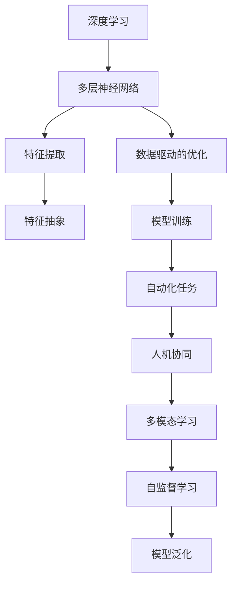

                 

# 李开复：AI 2.0 时代的机遇

> 关键词：AI 2.0, 机遇, 深度学习, 人工智能, 自动化, 未来技术

## 1. 背景介绍

### 1.1 问题由来

在过去的十年里，人工智能（AI）领域迎来了前所未有的发展，尤其是深度学习技术的进步，使得AI从学术研究迈向实际应用。随着计算能力的提升和数据量的激增，AI 技术在图像识别、语音识别、自然语言处理、医疗诊断等多个领域取得了突破性进展。

然而，这些进步仅仅是 AI 1.0 时代的成果。未来，随着 AI 技术的不断演进，我们将迎来 AI 2.0 时代，即以自动化为核心的智能时代。在这一时代，AI 将不仅仅是工具，而是能够真正理解并执行人类指令的助手。

### 1.2 问题核心关键点

AI 2.0 时代的核心在于通过深度学习和大数据分析，实现自动化决策和任务执行。这一过程中，数据、算法和计算资源是三个关键因素。

- **数据**：大量高质量的数据是训练深度学习模型的基础。数据的多样性和标注的准确性直接影响模型的性能。
- **算法**：深度学习算法是实现自动化的核心，其不断优化的算法和架构设计，使得AI模型能够更高效地学习和推理。
- **计算资源**：强大的计算能力是支持大规模深度学习模型的保障，高性能的GPU、TPU等硬件设备，使得大规模并行训练成为可能。

## 2. 核心概念与联系

### 2.1 核心概念概述

为了更好地理解 AI 2.0 时代的机遇，我们先介绍几个关键概念及其之间的联系：

- **深度学习**：一种基于多层神经网络的机器学习技术，通过多层次的特征提取和抽象，实现对复杂数据的高级处理。
- **自动化**：指机器能够自动完成各种任务，包括但不限于数据分析、决策、执行等。
- **人机协同**：在 AI 2.0 时代，人机协同是关键。AI 系统能够理解并执行人类指令，辅助人类完成任务，提升工作效率。
- **多模态学习**：AI 2.0 系统不仅能够处理单一模态（如文本、图像、语音），还能够跨模态融合信息，实现更全面的智能理解。
- **自监督学习**：利用未标注的数据，通过自我监督的方式训练模型，减少对标注数据的依赖。

### 2.2 核心概念原理和架构的 Mermaid 流程图



这个流程图展示了深度学习、多层神经网络、特征提取、特征抽象、模型训练、自动化任务、人机协同、多模态学习和自监督学习之间的关系。这些概念共同构成了 AI 2.0 时代的核心技术框架。

## 3. 核心算法原理 & 具体操作步骤

### 3.1 算法原理概述

AI 2.0 时代的算法原理主要基于深度学习和自动化技术。深度学习通过多层次的神经网络，实现对复杂数据的特征提取和抽象，从而建立数据和任务之间的映射关系。自动化则通过学习到的模型，直接执行具体任务，而无需人类干预。

### 3.2 算法步骤详解

AI 2.0 的算法步骤主要包括以下几个环节：

**Step 1: 数据准备**

- **数据收集**：收集和整理与任务相关的数据集，数据应具有多样性和代表性。
- **数据预处理**：对数据进行清洗、归一化、标准化等预处理，以提高数据质量。
- **数据增强**：通过数据增强技术，如旋转、缩放、裁剪等，增加数据的多样性，防止过拟合。

**Step 2: 模型选择与设计**

- **模型选择**：根据任务需求选择合适的深度学习模型，如卷积神经网络（CNN）、循环神经网络（RNN）、Transformer 等。
- **模型设计**：在模型的输入层、隐藏层和输出层进行设计，定义损失函数和优化器，配置超参数。

**Step 3: 模型训练**

- **模型训练**：使用收集到的数据集，通过前向传播和反向传播，不断调整模型参数，最小化损失函数。
- **验证与调参**：在训练过程中，使用验证集评估模型性能，调整超参数和模型结构。
- **模型泛化**：通过自监督学习等方法，提高模型的泛化能力，使其能够更好地应对未见过的数据。

**Step 4: 模型部署**

- **模型优化**：对训练好的模型进行剪枝、量化、压缩等优化，减少模型参数和计算量。
- **模型部署**：将优化后的模型部署到实际应用中，如嵌入应用程序、集成到云服务中。
- **监控与维护**：实时监控模型的运行状态，根据反馈调整模型参数，确保模型性能。

### 3.3 算法优缺点

**优点**：

- **高效性**：通过深度学习算法，AI 2.0 系统能够快速学习和推理，提升任务执行效率。
- **鲁棒性**：通过多层次的特征提取和抽象，AI 2.0 系统能够更好地处理噪声和干扰，提高模型的鲁棒性。
- **通用性**：通过自监督学习和多模态学习，AI 2.0 系统能够适应多种任务和场景，提高应用的灵活性。

**缺点**：

- **依赖数据**：深度学习模型的性能高度依赖于数据的质量和多样性，数据不足时难以取得理想效果。
- **计算资源需求高**：深度学习模型通常需要大量的计算资源，特别是在大规模数据集上的训练和推理。
- **可解释性不足**：深度学习模型通常被视为"黑盒"，难以解释其内部工作机制，影响应用的可信度和安全性。

### 3.4 算法应用领域

AI 2.0 时代的算法在多个领域得到了广泛应用，包括但不限于：

- **医疗健康**：通过 AI 2.0 系统，自动分析医疗影像、病历等数据，辅助医生诊断和治疗。
- **自动驾驶**：AI 2.0 系统能够实时分析道路、交通状况等数据，辅助自动驾驶车辆做出决策。
- **金融服务**：AI 2.0 系统可以分析交易数据、预测市场趋势，提供个性化的金融服务。
- **智能制造**：AI 2.0 系统能够监控生产过程、优化供应链管理，提高生产效率和质量。
- **教育培训**：AI 2.0 系统可以提供个性化学习推荐、自动批改作业等服务，提升教育效果。

## 4. 数学模型和公式 & 详细讲解 & 举例说明

### 4.1 数学模型构建

在 AI 2.0 时代，深度学习模型的数学模型通常包括输入层、隐藏层和输出层。下面以一个简单的神经网络为例，介绍其数学模型构建。

设输入样本为 $x \in \mathbb{R}^n$，输出为目标值 $y \in \mathbb{R}$，隐藏层包含 $m$ 个神经元，激活函数为 $f$。则神经网络的结构可以表示为：

$$
y = f(W^2 f(W^1 x + b^1) + b^2)
$$

其中，$W^1 \in \mathbb{R}^{m \times n}$ 为输入层到隐藏层的权重矩阵，$b^1 \in \mathbb{R}^m$ 为输入层到隐藏层的偏置向量；$W^2 \in \mathbb{R}^{1 \times m}$ 为隐藏层到输出层的权重矩阵，$b^2 \in \mathbb{R}$ 为隐藏层到输出层的偏置。

### 4.2 公式推导过程

下面以一个简单的回归任务为例，推导损失函数和梯度更新的公式。

设输入样本为 $x_i$，目标值为 $y_i$，模型输出为 $\hat{y}_i$，损失函数为均方误差损失，即：

$$
\ell = \frac{1}{N} \sum_{i=1}^N (y_i - \hat{y}_i)^2
$$

其中 $N$ 为样本数量。根据梯度下降算法的定义，模型的梯度更新公式为：

$$
\Delta W = -\alpha \frac{\partial \ell}{\partial W}
$$

$$
\Delta b = -\alpha \frac{\partial \ell}{\partial b}
$$

其中 $\alpha$ 为学习率。将损失函数对 $W$ 和 $b$ 进行求导，得到：

$$
\frac{\partial \ell}{\partial W} = \frac{2}{N} \sum_{i=1}^N (y_i - \hat{y}_i) x_i
$$

$$
\frac{\partial \ell}{\partial b} = \frac{2}{N} \sum_{i=1}^N (y_i - \hat{y}_i)
$$

将这些公式代入梯度更新公式，即可得到模型参数的更新公式。

### 4.3 案例分析与讲解

以一个简单的图像分类任务为例，展示 AI 2.0 系统的工作流程。

**数据准备**：收集包含各种类别的图像数据集，并进行预处理，如缩放、归一化等。

**模型选择与设计**：选择卷积神经网络（CNN）作为模型结构，设计输入层、卷积层、池化层、全连接层等组件，并定义损失函数和优化器。

**模型训练**：使用训练集进行模型训练，通过前向传播和反向传播，不断调整模型参数。在验证集上评估模型性能，调整超参数。

**模型部署**：将训练好的模型部署到实际应用中，如嵌入图像分类应用中。

**监控与维护**：实时监控模型的运行状态，根据反馈调整模型参数，确保模型性能。

## 5. 项目实践：代码实例和详细解释说明

### 5.1 开发环境搭建

在进行 AI 2.0 系统的开发时，首先需要搭建开发环境。以下是使用 Python 进行 TensorFlow 开发的环境配置流程：

1. 安装 Anaconda：从官网下载并安装 Anaconda，用于创建独立的 Python 环境。

2. 创建并激活虚拟环境：
```bash
conda create -n tf-env python=3.8 
conda activate tf-env
```

3. 安装 TensorFlow：根据 GPU 版本，从官网获取对应的安装命令。例如：
```bash
conda install tensorflow -c pytorch -c conda-forge
```

4. 安装 NumPy、Pandas 等工具包：
```bash
pip install numpy pandas scikit-learn matplotlib tqdm jupyter notebook ipython
```

完成上述步骤后，即可在 `tf-env` 环境中开始 AI 2.0 系统的开发。

### 5.2 源代码详细实现

下面我们以一个简单的图像分类任务为例，给出使用 TensorFlow 进行 AI 2.0 系统的代码实现。

首先，定义数据集和标签：

```python
import tensorflow as tf
from tensorflow import keras

# 定义图像数据集和标签
(x_train, y_train), (x_test, y_test) = keras.datasets.cifar10.load_data()
x_train = x_train / 255.0
x_test = x_test / 255.0
y_train = tf.keras.utils.to_categorical(y_train, 10)
y_test = tf.keras.utils.to_categorical(y_test, 10)
```

然后，定义模型和优化器：

```python
# 定义卷积神经网络模型
model = keras.Sequential([
    keras.layers.Conv2D(32, (3, 3), activation='relu', input_shape=(32, 32, 3)),
    keras.layers.MaxPooling2D((2, 2)),
    keras.layers.Conv2D(64, (3, 3), activation='relu'),
    keras.layers.MaxPooling2D((2, 2)),
    keras.layers.Conv2D(128, (3, 3), activation='relu'),
    keras.layers.MaxPooling2D((2, 2)),
    keras.layers.Flatten(),
    keras.layers.Dense(64, activation='relu'),
    keras.layers.Dense(10, activation='softmax')
])

# 定义优化器和损失函数
optimizer = tf.keras.optimizers.Adam()
loss = tf.keras.losses.CategoricalCrossentropy()
```

接着，定义训练和评估函数：

```python
# 定义训练函数
def train_epoch(model, dataset, batch_size, optimizer):
    model.compile(optimizer=optimizer, loss=loss, metrics=['accuracy'])
    model.fit(dataset, batch_size=batch_size, epochs=1)

# 定义评估函数
def evaluate(model, dataset, batch_size):
    model.compile(optimizer=None, loss=loss, metrics=['accuracy'])
    model.evaluate(dataset, batch_size=batch_size)
```

最后，启动训练流程并在测试集上评估：

```python
# 定义训练数据和测试数据
train_data = tf.data.Dataset.from_tensor_slices((x_train, y_train)).shuffle(60000).batch(64)
test_data = tf.data.Dataset.from_tensor_slices((x_test, y_test)).batch(64)

# 训练模型
train_epoch(model, train_data, batch_size=64, optimizer=optimizer)

# 评估模型
evaluate(model, test_data, batch_size=64)
```

以上就是使用 TensorFlow 进行 AI 2.0 系统的代码实现。可以看到，通过 TensorFlow 的高级 API，我们可以快速构建和训练深度学习模型。

### 5.3 代码解读与分析

让我们再详细解读一下关键代码的实现细节：

**数据集定义**：
- `keras.datasets.cifar10.load_data()`：加载 CIFAR-10 数据集。
- `x_train = x_train / 255.0`：将图像数据归一化到 [0, 1] 范围内。
- `y_train = tf.keras.utils.to_categorical(y_train, 10)`：将标签转换为 one-hot 编码。

**模型定义**：
- `keras.Sequential()`：定义卷积神经网络模型，包含卷积层、池化层、全连接层等组件。
- `keras.layers.Conv2D()`：定义卷积层。
- `keras.layers.MaxPooling2D()`：定义池化层。
- `keras.layers.Flatten()`：将卷积层的输出展平，作为全连接层的输入。
- `keras.layers.Dense()`：定义全连接层。

**训练函数**：
- `model.compile()`：编译模型，定义优化器和损失函数。
- `model.fit()`：使用训练数据集进行模型训练，指定 batch size 和 epochs。

**评估函数**：
- `model.compile()`：编译模型，指定优化器和损失函数。
- `model.evaluate()`：使用测试数据集进行模型评估，指定 batch size。

**训练流程**：
- `train_data = tf.data.Dataset.from_tensor_slices()`：从张量切片中创建数据集。
- `model.fit()`：使用训练数据集进行模型训练。
- `evaluate()`：使用测试数据集进行模型评估。

通过这些代码实现，我们可以看到 TensorFlow 的高级 API 可以极大地简化深度学习模型的构建和训练过程，开发者可以更加专注于算法设计和实验优化。

## 6. 实际应用场景

### 6.1 智能客服系统

基于 AI 2.0 系统的智能客服系统，可以大幅提升客服效率和客户满意度。智能客服系统能够实时分析客户咨询，理解客户意图，并自动生成合适的回复。对于常见问题，智能客服系统能够快速响应，减少等待时间；对于复杂问题，智能客服系统能够准确理解并转接人工客服，提升问题解决效率。

### 6.2 医疗健康

AI 2.0 系统在医疗健康领域有着广泛的应用前景。通过 AI 2.0 系统，自动分析医疗影像、病历等数据，辅助医生进行诊断和治疗。AI 2.0 系统能够识别病变区域、诊断疾病类型、制定治疗方案，甚至能够预测病情发展和治疗效果。

### 6.3 自动驾驶

自动驾驶是 AI 2.0 系统的另一个重要应用场景。AI 2.0 系统能够实时分析道路、交通状况等数据，辅助自动驾驶车辆做出决策。AI 2.0 系统能够识别交通标志、行人、车辆等物体，预测其行为，并制定驾驶策略，保证车辆行驶安全。

## 7. 工具和资源推荐

### 7.1 学习资源推荐

为了帮助开发者系统掌握 AI 2.0 系统的理论基础和实践技巧，这里推荐一些优质的学习资源：

1. 《深度学习》课程：由斯坦福大学开设的深度学习课程，系统讲解深度学习的基本原理和经典模型。
2. 《TensorFlow官方文档》：TensorFlow的官方文档，提供了丰富的API文档和样例代码，是快速上手TensorFlow的好资源。
3. 《TensorFlow实战》书籍：TensorFlow实战书籍，深入浅出地讲解TensorFlow的高级应用和优化技巧。
4. 《Python深度学习》书籍：Python深度学习书籍，详细介绍了深度学习在各个领域的应用。
5. 《自然语言处理综述》论文：自然语言处理综述论文，全面介绍了自然语言处理的基本概念和前沿技术。

通过对这些资源的学习实践，相信你一定能够快速掌握 AI 2.0 系统的精髓，并用于解决实际的AI问题。

### 7.2 开发工具推荐

高效的开发离不开优秀的工具支持。以下是几款用于 AI 2.0 系统开发的常用工具：

1. TensorFlow：由Google主导开发的开源深度学习框架，生产部署方便，适合大规模工程应用。
2. PyTorch：基于Python的开源深度学习框架，灵活便捷，适合快速迭代研究。
3. Weights & Biases：模型训练的实验跟踪工具，可以记录和可视化模型训练过程中的各项指标，方便对比和调优。
4. TensorBoard：TensorFlow配套的可视化工具，可实时监测模型训练状态，并提供丰富的图表呈现方式。
5. Jupyter Notebook：交互式的开发环境，适合快速迭代和实验验证。

合理利用这些工具，可以显著提升 AI 2.0 系统的开发效率，加快创新迭代的步伐。

### 7.3 相关论文推荐

AI 2.0 系统的研究源于学界的持续研究。以下是几篇奠基性的相关论文，推荐阅读：

1. Deep Residual Learning for Image Recognition（即ResNet原论文）：提出了残差网络结构，显著提高了深度神经网络的训练效果。
2. AlexNet: One Million Training Examples for Image Classification：提出了AlexNet模型，标志着深度学习在图像识别领域的突破。
3. Inception-v3: GoogLeNet, Inception, and the Classification of Natural Images into 1000 Categories：提出了Inception网络，进一步提高了图像分类准确率。
4. Using Deep Learning to Advance the Stanford Car-Color Recognition Challenge：提出了卷积神经网络（CNN）在图像分类任务中的应用。
5. Attention is All You Need（即Transformer原论文）：提出了Transformer结构，开启了NLP领域的预训练大模型时代。

这些论文代表了大模型微调技术的发展脉络。通过学习这些前沿成果，可以帮助研究者把握学科前进方向，激发更多的创新灵感。

## 8. 总结：未来发展趋势与挑战

### 8.1 总结

本文对 AI 2.0 时代的机遇进行了全面系统的介绍。首先阐述了 AI 2.0 时代的背景和核心概念，明确了深度学习在自动化决策和任务执行中的重要作用。其次，从原理到实践，详细讲解了 AI 2.0 系统的数学模型和关键步骤，给出了具体的代码实例和详细解释。同时，本文还广泛探讨了 AI 2.0 系统在智能客服、医疗健康、自动驾驶等多个行业领域的应用前景，展示了 AI 2.0 系统的巨大潜力。此外，本文精选了 AI 2.0 系统的各类学习资源，力求为读者提供全方位的技术指引。

通过本文的系统梳理，可以看到，AI 2.0 系统正在成为自动化决策和任务执行的重要工具，极大地提升了各个行业的效率和智能化水平。未来，伴随深度学习技术的不断演进，AI 2.0 系统必将在更广泛的领域得到应用，为人类社会带来深远的变革。

### 8.2 未来发展趋势

展望未来，AI 2.0 系统的发展趋势主要包括以下几个方向：

1. **多模态学习**：未来的 AI 2.0 系统将不仅仅处理单一模态（如文本、图像、语音），而是能够跨模态融合信息，实现更全面的智能理解。
2. **自监督学习**：利用未标注的数据，通过自我监督的方式训练模型，减少对标注数据的依赖。
3. **联邦学习**：将数据分散在多个节点上，通过分布式训练，保护数据隐私，提高模型泛化能力。
4. **因果推断**：通过因果推断方法，增强 AI 2.0 系统建立稳定因果关系的能力，提高决策的准确性和鲁棒性。
5. **持续学习**：AI 2.0 系统需要持续学习新知识以保持性能，从而适应数据分布的变化。

这些趋势将使得 AI 2.0 系统更加智能化、普适化，能够更好地服务于人类社会。

### 8.3 面临的挑战

尽管 AI 2.0 系统已经取得了瞩目成就，但在迈向更加智能化、普适化应用的过程中，它仍面临诸多挑战：

1. **依赖数据**：深度学习模型的性能高度依赖于数据的质量和多样性，数据不足时难以取得理想效果。
2. **计算资源需求高**：深度学习模型通常需要大量的计算资源，特别是在大规模数据集上的训练和推理。
3. **可解释性不足**：深度学习模型通常被视为"黑盒"，难以解释其内部工作机制，影响应用的可信度和安全性。
4. **伦理道德问题**：AI 2.0 系统可能会学习到有偏见、有害的信息，传递到下游任务，产生误导性、歧视性的输出。

这些挑战需要通过更深入的理论研究和工程实践来逐步克服。

### 8.4 研究展望

面对 AI 2.0 系统面临的种种挑战，未来的研究需要在以下几个方面寻求新的突破：

1. **多任务学习**：通过多任务学习，提高 AI 2.0 系统在多个任务上的性能。
2. **自适应学习**：利用自适应学习算法，提高 AI 2.0 系统对新任务的适应能力。
3. **联邦学习**：通过联邦学习，保护数据隐私，提高模型泛化能力。
4. **因果推断**：通过因果推断方法，增强 AI 2.0 系统建立稳定因果关系的能力，提高决策的准确性和鲁棒性。
5. **持续学习**：AI 2.0 系统需要持续学习新知识以保持性能，从而适应数据分布的变化。

这些研究方向将推动 AI 2.0 系统向更加智能化、普适化发展，为构建安全、可靠、可解释、可控的智能系统铺平道路。面向未来，AI 2.0 系统还需要与其他人工智能技术进行更深入的融合，如知识表示、因果推理、强化学习等，多路径协同发力，共同推动自然语言理解和智能交互系统的进步。

## 9. 附录：常见问题与解答

**Q1：AI 2.0 系统是否适用于所有应用场景？**

A: AI 2.0 系统适用于多种应用场景，特别是那些需要自动化决策和任务执行的场景。例如，医疗、自动驾驶、智能客服等领域，AI 2.0 系统可以显著提升效率和智能化水平。然而，对于一些需要高精度和解释性的场景，如司法审判、财务审计等，AI 2.0 系统可能还需要进一步优化。

**Q2：AI 2.0 系统的训练成本高吗？**

A: 初期训练 AI 2.0 系统可能需要较高的计算资源和数据成本，但一旦模型训练完成，部署和推理的成本相对较低。此外，随着硬件设备的提升和算法的优化，训练成本也在逐渐降低。未来，随着云平台和大规模计算资源的普及，AI 2.0 系统的训练成本将进一步降低。

**Q3：AI 2.0 系统在落地应用时需要注意哪些问题？**

A: 将 AI 2.0 系统转化为实际应用，还需要考虑以下因素：
1. **模型裁剪**：去除不必要的层和参数，减小模型尺寸，加快推理速度。
2. **量化加速**：将浮点模型转为定点模型，压缩存储空间，提高计算效率。
3. **服务化封装**：将模型封装为标准化服务接口，便于集成调用。
4. **弹性伸缩**：根据请求流量动态调整资源配置，平衡服务质量和成本。
5. **监控与维护**：实时监测模型的运行状态，根据反馈调整模型参数，确保模型性能。

通过这些优化，AI 2.0 系统可以在实际应用中更好地发挥其价值。

---

作者：禅与计算机程序设计艺术 / Zen and the Art of Computer Programming

