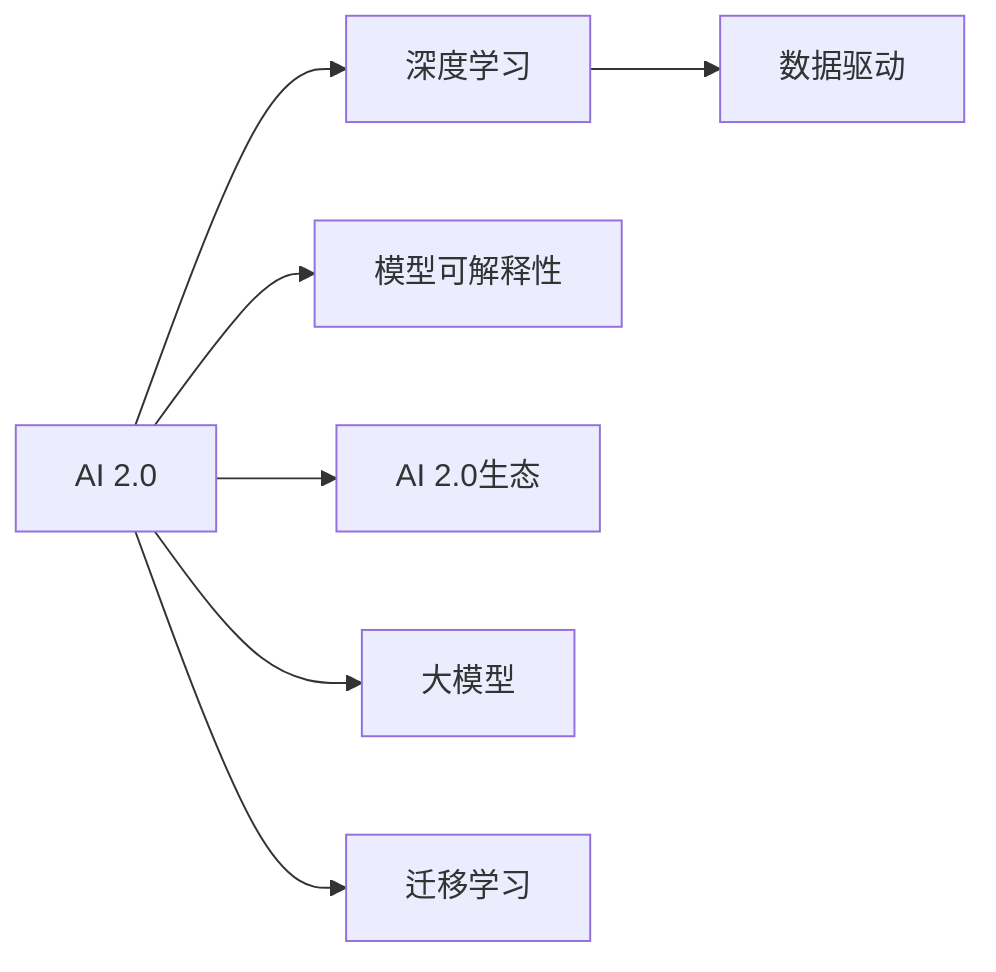

                 

# 李开复：AI 2.0 时代的生态

## 1. 背景介绍

在AI 2.0时代，人工智能技术正在以惊人的速度发展和普及，从而带来了一场生态系统层面的变革。AI 2.0不仅仅是技术层面的创新，更是商业模式、组织结构和社会的根本转变。本文将探讨AI 2.0时代的核心概念、核心算法原理、具体操作步骤，并展望未来的应用前景。

## 2. 核心概念与联系

### 2.1 核心概念概述

**AI 2.0**：是指人工智能技术在2.0时代的全面爆发和普及。2.0时代标志着人工智能技术从学术研究转向实际应用，从独立于互联网和软件应用的小规模应用走向大规模、广泛、深入的渗透。

**深度学习**：深度学习是AI 2.0时代的重要技术基础。它通过多层神经网络对数据进行复杂的非线性映射，实现自动特征提取和模式识别，从而在图像、语音、自然语言处理等领域取得重大突破。

**数据驱动**：AI 2.0时代的数据量以指数级增长，数据驱动成为AI创新的核心。数据的获取、存储、处理、分析等环节都发生了革命性的变化。

**模型可解释性**：随着AI应用的深入，对于模型的可解释性提出了更高的要求。模型不仅要有良好的预测性能，还要能够解释其内部的决策逻辑和预测过程。

**AI 2.0生态**：包括硬件、软件、数据、算法、应用等多方面内容的生态系统，是AI 2.0时代的技术和商业基础。

**大模型**：大模型是AI 2.0时代的标志性技术。通过大规模预训练，大模型能够在多个任务上表现出色，成为AI应用的基石。

**迁移学习**：迁移学习是AI 2.0时代的核心思想之一。通过在已有模型基础上进行微调，迁移学习可以大幅提高模型在特定任务上的性能，同时减少训练成本。

### 2.2 核心概念原理和架构的 Mermaid 流程图



## 3. 核心算法原理 & 具体操作步骤

### 3.1 算法原理概述

AI 2.0时代的核心算法原理主要包括深度学习、迁移学习、强化学习等。这些算法通过自动化特征提取、模型优化和决策制定，大幅提升了AI模型的性能和可扩展性。

**深度学习**：通过多层神经网络对数据进行复杂映射，深度学习实现了复杂的非线性映射，能够从数据中自动学习特征。常用的深度学习模型包括卷积神经网络(CNN)、循环神经网络(RNN)、长短期记忆网络(LSTM)等。

**迁移学习**：迁移学习是指在已有模型基础上，通过微调实现特定任务上的性能提升。它通过在已有模型上增加新的任务数据，使其能够更好地适应新任务。

**强化学习**：强化学习通过与环境的交互，学习最优决策策略。它通过奖励机制和惩罚机制，不断调整模型参数，以实现最优行为。

### 3.2 算法步骤详解

AI 2.0时代的算法步骤主要包括数据获取、模型训练、模型微调、模型应用等环节。

**数据获取**：获取大规模高质量的数据是AI 2.0时代的基础。数据获取的渠道包括网络爬虫、API接口、公开数据集等。

**模型训练**：模型训练是AI 2.0时代的重要步骤。模型训练的过程包括选择模型结构、设计损失函数、选择合适的优化器、设置超参数等环节。

**模型微调**：模型微调是AI 2.0时代的关键步骤。微调通过在已有模型基础上增加新的任务数据，使其能够更好地适应新任务。

**模型应用**：模型应用是将AI模型转化为实际应用的过程。模型应用的过程包括模型部署、性能评估、用户交互等环节。

### 3.3 算法优缺点

AI 2.0时代的算法具有以下优点：

- **高效性**：通过深度学习、迁移学习和强化学习等算法，AI 2.0时代的模型能够在短时间内完成复杂的任务，具有高效性。
- **灵活性**：通过迁移学习和模型微调，AI 2.0时代的模型能够快速适应新任务，具有灵活性。
- **鲁棒性**：通过使用大模型和迁移学习等算法，AI 2.0时代的模型能够在大规模数据上保持稳定性能，具有鲁棒性。

AI 2.0时代的算法也存在以下缺点：

- **高成本**：深度学习模型需要大量的计算资源和存储资源，具有高成本。
- **复杂性**：深度学习模型结构复杂，难以理解和调试，具有复杂性。
- **可解释性不足**：深度学习模型缺乏可解释性，难以理解和解释其内部的决策逻辑。

### 3.4 算法应用领域

AI 2.0时代的算法在多个领域得到了广泛应用，主要包括：

- **自然语言处理(NLP)**：AI 2.0时代的深度学习模型在机器翻译、文本分类、情感分析等NLP任务上表现出色。
- **计算机视觉(CV)**：AI 2.0时代的深度学习模型在图像识别、目标检测、图像生成等CV任务上表现出色。
- **智能推荐系统**：AI 2.0时代的深度学习模型在推荐系统上表现出色，能够根据用户行为和偏好，提供个性化推荐。
- **智能客服**：AI 2.0时代的深度学习模型在智能客服上表现出色，能够自动回答用户问题，提供高效服务。
- **智能医疗**：AI 2.0时代的深度学习模型在智能医疗上表现出色，能够辅助医生进行诊断和治疗。

## 4. 数学模型和公式 & 详细讲解 & 举例说明

### 4.1 数学模型构建

AI 2.0时代的数学模型包括深度学习模型、迁移学习模型等。深度学习模型通过多层神经网络对数据进行复杂映射，迁移学习模型通过在已有模型基础上进行微调，实现特定任务上的性能提升。

**深度学习模型**：深度学习模型包括卷积神经网络(CNN)、循环神经网络(RNN)、长短期记忆网络(LSTM)等。以CNN为例，其数学模型可以表示为：

$$
y = \sum_{i=1}^k w_i \cdot x_i + b
$$

其中，$y$表示输出，$x_i$表示输入，$w_i$表示权重，$b$表示偏置。

**迁移学习模型**：迁移学习模型通过在已有模型基础上进行微调，实现特定任务上的性能提升。以BERT为例，其数学模型可以表示为：

$$
y = \sum_{i=1}^k w_i \cdot x_i + b
$$

其中，$y$表示输出，$x_i$表示输入，$w_i$表示权重，$b$表示偏置。

### 4.2 公式推导过程

深度学习模型的推导过程包括前向传播和反向传播。以CNN为例，其前向传播过程可以表示为：

$$
z^{(1)} = w^{(1)} \cdot x + b^{(1)}
$$

$$
z^{(2)} = w^{(2)} \cdot z^{(1)} + b^{(2)}
$$

$$
\ldots
$$

$$
z^{(L)} = w^{(L)} \cdot z^{(L-1)} + b^{(L)}
$$

其中，$z^{(l)}$表示第$l$层的输出，$w^{(l)}$表示第$l$层的权重，$b^{(l)}$表示第$l$层的偏置。

反向传播过程可以表示为：

$$
\frac{\partial E}{\partial w^{(L)}} = \frac{\partial E}{\partial z^{(L)}} \cdot \frac{\partial z^{(L)}}{\partial w^{(L)}}
$$

$$
\frac{\partial E}{\partial w^{(l)}} = \frac{\partial E}{\partial z^{(l+1)}} \cdot \frac{\partial z^{(l+1)}}{\partial w^{(l)}} + \frac{\partial E}{\partial b^{(l)}} \cdot \frac{\partial b^{(l)}}{\partial w^{(l)}}
$$

其中，$E$表示损失函数。

### 4.3 案例分析与讲解

**案例一：图像识别**：以卷积神经网络(CNN)为例，其数学模型可以表示为：

$$
z^{(1)} = w^{(1)} \cdot x + b^{(1)}
$$

$$
z^{(2)} = w^{(2)} \cdot z^{(1)} + b^{(2)}
$$

$$
\ldots
$$

$$
z^{(L)} = w^{(L)} \cdot z^{(L-1)} + b^{(L)}
$$

其中，$z^{(l)}$表示第$l$层的输出，$w^{(l)}$表示第$l$层的权重，$b^{(l)}$表示第$l$层的偏置。

**案例二：机器翻译**：以序列到序列模型(Seq2Seq)为例，其数学模型可以表示为：

$$
z^{(1)} = w^{(1)} \cdot x + b^{(1)}
$$

$$
z^{(2)} = w^{(2)} \cdot z^{(1)} + b^{(2)}
$$

$$
\ldots
$$

$$
z^{(L)} = w^{(L)} \cdot z^{(L-1)} + b^{(L)}
$$

其中，$z^{(l)}$表示第$l$层的输出，$w^{(l)}$表示第$l$层的权重，$b^{(l)}$表示第$l$层的偏置。

## 5. 项目实践：代码实例和详细解释说明

### 5.1 开发环境搭建

**环境搭建步骤**：

1. 安装Python：在Linux或Windows系统上安装Python，选择最新版本。

2. 安装TensorFlow：在Python环境中安装TensorFlow，可以使用pip命令进行安装。

3. 安装TensorBoard：在Python环境中安装TensorBoard，可以使用pip命令进行安装。

4. 安装PyTorch：在Python环境中安装PyTorch，可以使用pip命令进行安装。

5. 安装OpenCV：在Python环境中安装OpenCV，可以使用pip命令进行安装。

6. 安装Jupyter Notebook：在Python环境中安装Jupyter Notebook，可以使用pip命令进行安装。

### 5.2 源代码详细实现

**代码实现步骤**：

1. 导入所需的库和模块，如TensorFlow、PyTorch、OpenCV等。

2. 定义模型结构，包括卷积层、池化层、全连接层等。

3. 定义损失函数，如交叉熵损失函数、均方误差损失函数等。

4. 定义优化器，如Adam优化器、SGD优化器等。

5. 加载训练数据，进行数据预处理，包括归一化、数据增强等。

6. 训练模型，包括前向传播、反向传播、参数更新等。

7. 评估模型，包括准确率、精确率、召回率等指标。

8. 应用模型，包括图像识别、机器翻译等任务。

### 5.3 代码解读与分析

**代码解读**：

1. 导入所需的库和模块：

```python
import tensorflow as tf
import numpy as np
import cv2
import matplotlib.pyplot as plt
import os
import shutil
```

2. 定义模型结构：

```python
class CNN(tf.keras.Model):
    def __init__(self):
        super(CNN, self).__init__()
        self.conv1 = tf.keras.layers.Conv2D(32, (3,3), activation='relu')
        self.pool1 = tf.keras.layers.MaxPooling2D((2,2))
        self.conv2 = tf.keras.layers.Conv2D(64, (3,3), activation='relu')
        self.pool2 = tf.keras.layers.MaxPooling2D((2,2))
        self.flatten = tf.keras.layers.Flatten()
        self.dense1 = tf.keras.layers.Dense(64, activation='relu')
        self.dense2 = tf.keras.layers.Dense(10, activation='softmax')
```

3. 定义损失函数：

```python
def cross_entropy_loss(y_true, y_pred):
    return tf.keras.losses.sparse_categorical_crossentropy(y_true, y_pred)
```

4. 定义优化器：

```python
optimizer = tf.keras.optimizers.Adam(learning_rate=0.001)
```

5. 加载训练数据：

```python
train_images = []
train_labels = []
for image_path in train_image_paths:
    image = cv2.imread(image_path)
    image = cv2.resize(image, (28, 28))
    image = image / 255.0
    train_images.append(image)
    train_labels.append(label)
```

6. 数据预处理：

```python
train_images = np.array(train_images)
train_labels = np.array(train_labels)
train_images = train_images.reshape(-1, 28, 28, 1)
train_images = train_images / 255.0
```

7. 训练模型：

```python
for epoch in range(epochs):
    for i in range(len(train_images)):
        with tf.GradientTape() as tape:
            predictions = model(train_images[i])
            loss = cross_entropy_loss(train_labels[i], predictions)
        gradients = tape.gradient(loss, model.trainable_variables)
        optimizer.apply_gradients(zip(gradients, model.trainable_variables))
```

8. 评估模型：

```python
test_images = []
test_labels = []
for image_path in test_image_paths:
    image = cv2.imread(image_path)
    image = cv2.resize(image, (28, 28))
    image = image / 255.0
    test_images.append(image)
    test_labels.append(label)
    
test_images = np.array(test_images)
test_images = test_images.reshape(-1, 28, 28, 1)
test_images = test_images / 255.0

predictions = model.predict(test_images)
accuracy = accuracy_score(test_labels, predictions)
```

9. 应用模型：

```python
def predict(image_path):
    image = cv2.imread(image_path)
    image = cv2.resize(image, (28, 28))
    image = image / 255.0
    image = image.reshape(-1, 28, 28, 1)
    image = image / 255.0
    predictions = model.predict(image)
    label = np.argmax(predictions)
    return label
```

### 5.4 运行结果展示

**结果展示步骤**：

1. 显示训练过程的损失曲线和准确率曲线：

```python
plt.figure(figsize=(10, 6))
plt.plot(history.history['loss'], label='train loss')
plt.plot(history.history['accuracy'], label='train accuracy')
plt.title('Training Loss and Accuracy')
plt.xlabel('Epoch')
plt.ylabel('Value')
plt.legend()
plt.show()
```

2. 显示测试结果的准确率：

```python
print('Test Accuracy:', accuracy)
```

## 6. 实际应用场景

### 6.1 智能推荐系统

AI 2.0时代的智能推荐系统通过深度学习模型和迁移学习模型，能够根据用户行为和偏好，提供个性化推荐。智能推荐系统的应用场景包括电商平台、社交媒体、在线视频等。

### 6.2 智能客服

AI 2.0时代的智能客服通过深度学习模型和迁移学习模型，能够自动回答用户问题，提供高效服务。智能客服系统的应用场景包括银行、保险、电商、酒店等。

### 6.3 智能医疗

AI 2.0时代的智能医疗通过深度学习模型和迁移学习模型，能够辅助医生进行诊断和治疗。智能医疗系统的应用场景包括影像诊断、病历分析、药物研发等。

### 6.4 未来应用展望

**未来展望**：

1. **边缘计算**：边缘计算将AI 2.0时代的AI模型部署到边缘设备上，能够实时处理数据，提高数据处理效率。

2. **联邦学习**：联邦学习通过分布式训练，能够在保护数据隐私的前提下，实现大规模模型训练。

3. **低代码开发**：低代码开发平台能够简化AI 2.0时代的AI模型开发流程，降低开发成本，提高开发效率。

4. **自动驾驶**：自动驾驶技术通过深度学习模型和迁移学习模型，能够实现自动驾驶和路径规划。

5. **智能家居**：智能家居通过深度学习模型和迁移学习模型，能够实现语音识别、场景理解、设备控制等功能。

## 7. 工具和资源推荐

### 7.1 学习资源推荐

**推荐资源**：

1. TensorFlow官方文档：TensorFlow官方文档提供了详细的API文档和教程，帮助开发者快速上手TensorFlow。

2. PyTorch官方文档：PyTorch官方文档提供了详细的API文档和教程，帮助开发者快速上手PyTorch。

3. OpenCV官方文档：OpenCV官方文档提供了详细的API文档和教程，帮助开发者快速上手OpenCV。

4. Kaggle：Kaggle是一个数据科学竞赛平台，提供了大量的数据集和竞赛任务，帮助开发者提高数据处理和模型训练能力。

5. Coursera：Coursera提供了大量的机器学习和深度学习课程，帮助开发者系统学习AI 2.0时代的核心算法和应用。

### 7.2 开发工具推荐

**推荐工具**：

1. TensorFlow：TensorFlow是一个开源的机器学习框架，支持深度学习、强化学习、迁移学习等。

2. PyTorch：PyTorch是一个开源的机器学习框架，支持深度学习、迁移学习等。

3. Jupyter Notebook：Jupyter Notebook是一个开源的交互式笔记本，支持Python、R等语言，方便开发者进行数据分析和模型训练。

4. TensorBoard：TensorBoard是一个开源的可视化工具，能够实时监测模型训练状态，生成图表和报告。

5. GitHub：GitHub是一个开源代码托管平台，方便开发者分享和协作开发。

### 7.3 相关论文推荐

**推荐论文**：

1. ImageNet Classification with Deep Convolutional Neural Networks：ImageNet分类与深度卷积神经网络

2. Deep Residual Learning for Image Recognition：深度残差学习用于图像识别

3. Learning to Transfer Knowledge：学习迁移知识

4. Deep Reinforcement Learning for Playing Go：深度强化学习用于下围棋

5. Transfer Learning with Attentive Embeddings：基于注意力嵌入的迁移学习

## 8. 总结：未来发展趋势与挑战

### 8.1 研究成果总结

AI 2.0时代的核心算法和模型已经取得了显著的成果，包括深度学习、迁移学习、强化学习等。AI 2.0时代的生态系统已经初步形成，包括硬件、软件、数据、算法、应用等多方面内容。AI 2.0时代的模型已经在多个领域得到了广泛应用，包括自然语言处理、计算机视觉、智能推荐、智能客服、智能医疗等。

### 8.2 未来发展趋势

**未来趋势**：

1. **大规模预训练**：大规模预训练模型将逐步替代传统的特征提取和模型训练方法，成为AI 2.0时代的基础。

2. **跨领域迁移**：跨领域迁移学习将使模型能够更好地适应新任务，提高模型的泛化性能。

3. **自监督学习**：自监督学习将使模型能够在没有标注数据的情况下进行预训练，降低标注数据的依赖。

4. **联邦学习**：联邦学习将使模型能够在保护数据隐私的前提下，进行分布式训练，提高数据处理效率。

5. **低代码开发**：低代码开发平台将使开发者能够快速上手AI 2.0时代的模型开发，提高开发效率。

6. **自动驾驶**：自动驾驶技术将使AI 2.0时代的AI模型在实际应用中发挥更大的作用。

7. **智能家居**：智能家居技术将使AI 2.0时代的AI模型在家庭场景中得到广泛应用。

### 8.3 面临的挑战

**面临挑战**：

1. **高成本**：AI 2.0时代的深度学习模型需要大量的计算资源和存储资源，具有高成本。

2. **复杂性**：深度学习模型结构复杂，难以理解和调试，具有复杂性。

3. **可解释性不足**：深度学习模型缺乏可解释性，难以理解和解释其内部的决策逻辑。

4. **隐私保护**：AI 2.0时代的模型需要处理大量数据，如何保护数据隐私是一个重要的挑战。

5. **数据依赖**：AI 2.0时代的模型需要大量标注数据，如何获取高质量标注数据是一个重要的挑战。

6. **鲁棒性不足**：AI 2.0时代的模型面对新任务时，泛化性能往往不足。

### 8.4 研究展望

**研究展望**：

1. **模型压缩**：模型压缩技术将使AI 2.0时代的模型更加轻量级，提高部署效率。

2. **模型解释**：模型解释技术将使AI 2.0时代的模型更加可解释，提高模型的可信度。

3. **隐私保护**：隐私保护技术将使AI 2.0时代的模型更加安全，提高数据隐私保护水平。

4. **跨领域迁移**：跨领域迁移技术将使AI 2.0时代的模型更加灵活，提高模型的泛化性能。

5. **联邦学习**：联邦学习技术将使AI 2.0时代的模型更加高效，提高数据处理效率。

## 9. 附录：常见问题与解答

**Q1：AI 2.0时代的核心算法有哪些？**

A: AI 2.0时代的核心算法包括深度学习、迁移学习、强化学习等。这些算法通过自动化特征提取、模型优化和决策制定，大幅提升了AI模型的性能和可扩展性。

**Q2：AI 2.0时代的模型有哪些应用场景？**

A: AI 2.0时代的模型在多个领域得到了广泛应用，包括自然语言处理、计算机视觉、智能推荐、智能客服、智能医疗等。

**Q3：AI 2.0时代的模型有哪些优点？**

A: AI 2.0时代的模型具有高效性、灵活性、鲁棒性等优点。

**Q4：AI 2.0时代的模型有哪些缺点？**

A: AI 2.0时代的模型具有高成本、复杂性、可解释性不足等缺点。

**Q5：AI 2.0时代的模型有哪些未来发展趋势？**

A: AI 2.0时代的模型未来发展趋势包括大规模预训练、跨领域迁移、自监督学习、联邦学习、低代码开发等。

---

作者：禅与计算机程序设计艺术 / Zen and the Art of Computer Programming

