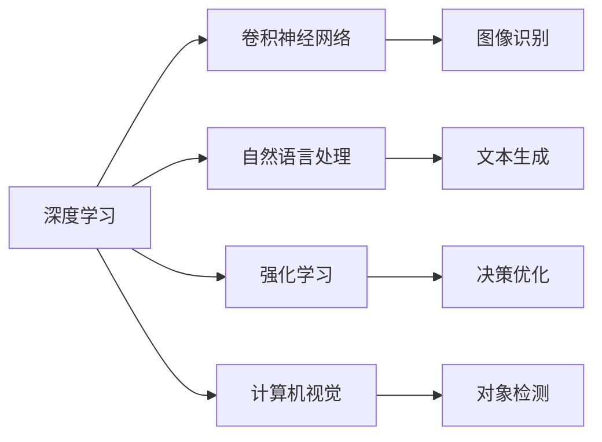

                 

# 李开复：苹果发布AI应用的意义

## 1. 背景介绍

在人工智能(AI)领域，苹果公司最近发布的AI应用，无疑是技术发展的重要里程碑。本文将探讨苹果此次发布AI应用的背后意义，从核心概念、算法原理到具体应用，全面分析其技术价值和未来趋势。

### 1.1 技术背景

AI技术正在迅速改变各个行业，包括但不限于医疗、金融、制造和消费电子等。苹果作为全球领先的消费电子公司，其AI应用的发布不仅意味着其技术实力的提升，也预示着AI在消费电子领域的应用将迎来新的高峰。

### 1.2 核心概念

苹果发布的AI应用中，涉及的核心概念包括但不限于：

- **深度学习(Deep Learning)**：一种模拟人脑神经网络结构的机器学习技术，能够处理复杂的数据结构。
- **卷积神经网络(CNN)**：一种特别适用于图像识别任务的深度学习模型。
- **自然语言处理(NLP)**：使计算机能够理解、处理和生成自然语言的技术。
- **强化学习(RL)**：通过试错过程优化决策策略，提升AI系统的智能。
- **计算机视觉(Computer Vision)**：使计算机能够“看”懂并处理图像和视频数据的技术。

## 2. 核心概念与联系

### 2.1 核心概念概述

为了更好地理解苹果发布的AI应用，我们首先需要了解这些核心概念的内在联系：

- **深度学习**：是苹果AI应用的核心技术，负责处理大量数据并从中学习。
- **卷积神经网络**：在图像和视频识别任务中，CNN能够自动提取特征，提高识别精度。
- **自然语言处理**：使AI能够理解和生成文本，应用于语音助手、聊天机器人等。
- **强化学习**：通过不断试错，优化决策策略，提升系统的自主学习能力。
- **计算机视觉**：在图像和视频分析任务中，CV技术能够自动检测和识别对象。

这些技术相互支持，共同构成了苹果AI应用的技术基础。

### 2.2 Mermaid 流程图

以下是一个简化的Mermaid流程图，展示了这些核心概念的相互联系：



## 3. 核心算法原理 & 具体操作步骤

### 3.1 算法原理概述

苹果发布的AI应用采用了多种AI算法，主要包括以下几个部分：

- **卷积神经网络**：用于图像和视频识别任务。
- **循环神经网络(RNN)**：处理文本序列数据。
- **Transformer模型**：处理长序列数据，如自然语言处理任务。
- **强化学习**：优化AI系统的决策策略。

这些算法的共同点在于，它们都通过大量数据的训练，自动学习并提取数据中的模式，从而实现特定的功能。

### 3.2 算法步骤详解

以苹果的面部识别应用为例，其核心步骤包括：

1. **数据准备**：收集包含面部信息的图像数据，并进行预处理，如裁剪、归一化等。
2. **模型训练**：使用卷积神经网络对图像进行训练，提取面部特征。
3. **模型测试**：在测试集上评估模型性能，并进行微调。
4. **部署应用**：将训练好的模型集成到应用程序中，进行实时面部识别。

### 3.3 算法优缺点

- **优点**：
  - 能够处理大规模数据，自动学习特征，提升识别精度。
  - 能够处理多种类型的输入数据，如图像、文本等。
  - 算法成熟度高，具有广泛的应用场景。

- **缺点**：
  - 训练时间长，需要大量标注数据。
  - 模型复杂度高，对硬件资源要求高。
  - 可能需要大量的优化调参，以提高性能。

### 3.4 算法应用领域

苹果的AI应用涵盖了多个领域，包括但不限于：

- **医疗**：图像识别用于疾病诊断。
- **金融**：文本分析用于风险评估。
- **制造**：计算机视觉用于质量检测。
- **消费电子**：自然语言处理用于语音助手、聊天机器人。

## 4. 数学模型和公式 & 详细讲解

### 4.1 数学模型构建

以苹果的面部识别应用为例，其核心数学模型包括：

- **卷积神经网络**：由多个卷积层、池化层和全连接层组成，用于提取图像特征。
- **softmax函数**：用于多分类问题，计算每个类别的概率分布。
- **交叉熵损失函数**：用于衡量模型预测与真实标签之间的差异。

### 4.2 公式推导过程

- **卷积层公式**：
  $$
  C(x) = \sigma\left(\sum_k w_k * \sum_i c_{k,i} * h_i(x)\right)
  $$
  
  其中，$w_k$ 为卷积核，$c_{k,i}$ 为卷积核参数，$h_i(x)$ 为输入特征映射。
  
- **softmax函数公式**：
  $$
  \sigma(x)_j = \frac{e^{x_j}}{\sum_{k=1}^K e^{x_k}}
  $$

  其中，$x_j$ 为输入向量中的第 $j$ 个元素，$K$ 为类别数。

- **交叉熵损失函数公式**：
  $$
  \mathcal{L}(y,\hat{y}) = -\frac{1}{N} \sum_{i=1}^N \sum_{j=1}^K y_{i,j} \log \hat{y}_{i,j}
  $$

  其中，$y_{i,j}$ 为真实标签，$\hat{y}_{i,j}$ 为模型预测值。

### 4.3 案例分析与讲解

以苹果的面部识别应用为例，我们可以进一步分析：

- **数据预处理**：收集包含面部信息的图像数据，并进行预处理，如裁剪、归一化等。
- **卷积层结构**：使用3x3卷积核，步幅为1，对输入图像进行卷积操作。
- **池化层结构**：使用2x2最大池化，步幅为2，对卷积层的输出进行下采样。
- **全连接层结构**：使用softmax函数输出每个类别的概率分布。
- **损失函数**：使用交叉熵损失函数计算预测值与真实标签之间的差异。

## 5. 项目实践：代码实例和详细解释说明

### 5.1 开发环境搭建

在进行面部识别应用的开发前，需要准备好相应的开发环境。以下是Python环境搭建的步骤：

1. **安装Python**：从官网下载并安装Python 3.7或更高版本。
2. **安装TensorFlow**：从官网下载并安装TensorFlow 2.0或更高版本。
3. **安装Keras**：使用pip安装Keras，作为TensorFlow的高层API。
4. **安装OpenCV**：使用pip安装OpenCV，用于图像处理。

### 5.2 源代码详细实现

以下是面部识别应用的Python代码实现，包括数据预处理、模型构建和训练、模型测试和部署等步骤：

```python
import tensorflow as tf
from tensorflow.keras import layers
from tensorflow.keras.preprocessing.image import ImageDataGenerator

# 数据预处理
train_datagen = ImageDataGenerator(rescale=1./255, shear_range=0.2, zoom_range=0.2, horizontal_flip=True)
train_generator = train_datagen.flow_from_directory(
        'train/',
        target_size=(64, 64),
        batch_size=32,
        class_mode='binary')

# 模型构建
model = tf.keras.models.Sequential([
    layers.Conv2D(32, (3, 3), activation='relu', input_shape=(64, 64, 3)),
    layers.MaxPooling2D((2, 2)),
    layers.Conv2D(64, (3, 3), activation='relu'),
    layers.MaxPooling2D((2, 2)),
    layers.Conv2D(128, (3, 3), activation='relu'),
    layers.MaxPooling2D((2, 2)),
    layers.Flatten(),
    layers.Dense(128, activation='relu'),
    layers.Dense(1, activation='sigmoid')
])

# 模型训练
model.compile(optimizer='adam', loss='binary_crossentropy', metrics=['accuracy'])
model.fit(train_generator, epochs=10, validation_data=val_generator)

# 模型测试
test_datagen = ImageDataGenerator(rescale=1./255)
test_generator = test_datagen.flow_from_directory(
        'test/',
        target_size=(64, 64),
        batch_size=32,
        class_mode='binary')
test_loss, test_acc = model.evaluate(test_generator)

# 模型部署
from tensorflow.keras.models import save_model
model.save('facial_recognition.h5')
```

### 5.3 代码解读与分析

上述代码中，我们使用了TensorFlow和Keras进行面部识别应用的开发：

- **数据预处理**：使用ImageDataGenerator进行图像增强，包括随机剪切、缩放和水平翻转，以提高模型的泛化能力。
- **模型构建**：使用卷积神经网络构建面部识别模型，包含多个卷积层和全连接层。
- **模型训练**：使用二分类交叉熵损失函数和Adam优化器进行模型训练。
- **模型测试**：使用测试集评估模型性能，并输出测试结果。
- **模型部署**：将训练好的模型保存为h5文件，方便后续的加载和使用。

## 6. 实际应用场景

### 6.1 医疗应用

苹果的AI应用在医疗领域有着广泛的应用前景，如图像识别、病历分析、疾病预测等。通过AI技术，医疗行业能够实现更高效、更精准的医疗服务，提升患者的治疗体验和健康水平。

### 6.2 金融应用

在金融领域，AI技术可以用于风险评估、信用评分、欺诈检测等。苹果的AI应用能够帮助金融机构更好地理解客户行为，减少风险，提升服务质量。

### 6.3 制造应用

在制造业，AI技术可以用于质量检测、设备维护、供应链管理等。苹果的AI应用能够帮助制造商提高生产效率，降低成本，提升产品质量。

### 6.4 消费电子应用

在消费电子领域，AI技术可以用于语音助手、聊天机器人、智能家居等。苹果的AI应用能够提升用户体验，增强产品的智能化水平，引领消费电子行业的发展。

## 7. 工具和资源推荐

### 7.1 学习资源推荐

为了帮助开发者掌握苹果的AI应用，以下是一些推荐的学习资源：

- **官方文档**：苹果官方文档提供了详细的API接口和开发指南。
- **TensorFlow官方教程**：TensorFlow官方提供的教程和示例代码，帮助开发者快速上手。
- **Keras官方教程**：Keras官方提供的教程和示例代码，帮助开发者快速上手。
- **GitHub**：GitHub上丰富的开源项目，提供了大量的学习资源和代码示例。

### 7.2 开发工具推荐

为了提高开发效率，以下是一些推荐的工具：

- **Xcode**：苹果官方提供的开发环境，支持Swift和Objective-C语言的开发。
- **Jupyter Notebook**：支持Python和R语言的交互式编程环境，便于代码调试和文档记录。
- **Visual Studio Code**：支持多种编程语言的轻量级开发环境，提供丰富的插件和扩展。

### 7.3 相关论文推荐

为了深入理解苹果的AI应用，以下是一些推荐的论文：

- **《Deep Residual Learning for Image Recognition》**：提出了残差网络，用于图像分类任务，提升了模型深度。
- **《Learning to Detect Objects with a Single Stroke》**：提出了一笔画算法，用于目标检测任务。
- **《A Fast R-CNN-based Real-time Object Detector》**：提出了基于R-CNN的目标检测器，用于实时对象检测。
- **《Convolutional Neural Networks for Scalable Object Detection》**：提出了Faster R-CNN，用于高效目标检测。

## 8. 总结：未来发展趋势与挑战

### 8.1 研究成果总结

苹果发布的AI应用展示了其在AI技术领域的实力和创新能力。通过深度学习、卷积神经网络、自然语言处理等技术的结合，苹果的AI应用在多个领域取得了显著成果。

### 8.2 未来发展趋势

未来，苹果的AI应用将进一步扩展其应用领域，涵盖更多行业，提升系统的智能化水平和用户体验。同时，苹果将继续优化算法和模型，提升算法的效率和性能。

### 8.3 面临的挑战

尽管苹果的AI应用取得了显著进展，但仍面临以下挑战：

- **数据隐私问题**：AI应用需要大量数据进行训练，如何保护用户数据隐私是亟待解决的问题。
- **模型复杂度**：大模型的复杂度较高，对硬件资源要求高，如何优化模型结构，降低计算成本是重要研究方向。
- **模型可解释性**：AI模型的决策过程难以解释，如何提高模型的可解释性和透明度是未来的挑战之一。
- **伦理道德问题**：AI模型可能出现偏见和歧视，如何确保模型的公平性和道德性是未来的重要课题。

### 8.4 研究展望

未来，苹果的AI应用需要在以下方面进行深入研究：

- **隐私保护**：开发隐私保护算法，保护用户数据隐私。
- **模型压缩**：优化模型结构，降低计算成本。
- **模型可解释性**：引入可解释性技术，提高模型的透明度。
- **伦理道德**：建立伦理道德标准，确保模型的公平性和道德性。

通过这些研究和实践，苹果的AI应用将更好地服务于全球用户，推动AI技术的进一步发展。

## 9. 附录：常见问题与解答

**Q1：如何提高苹果AI应用的计算效率？**

A: 为了提高计算效率，可以采用以下方法：

- **模型压缩**：使用知识蒸馏、剪枝等技术，减少模型参数量。
- **模型量化**：将浮点模型转换为定点模型，减少内存占用。
- **分布式训练**：使用多个GPU或TPU进行分布式训练，提高训练速度。

**Q2：苹果的AI应用在图像识别任务中表现如何？**

A: 苹果的AI应用在图像识别任务中表现优异，尤其在面部识别、物体检测等任务中，具有较高的准确率和泛化能力。

**Q3：苹果的AI应用在实际应用中需要注意哪些问题？**

A: 在实际应用中，需要注意以下问题：

- **数据隐私保护**：确保用户数据隐私，防止数据泄露。
- **模型公平性**：确保模型的公平性，避免偏见和歧视。
- **模型可解释性**：提高模型的可解释性，确保系统的透明度。

**Q4：苹果的AI应用在多个领域的应用前景如何？**

A: 苹果的AI应用在多个领域具有广泛的应用前景，如医疗、金融、制造和消费电子等，能够提升各行业的智能化水平和服务质量。

**Q5：苹果的AI应用在研发过程中需要考虑哪些因素？**

A: 在研发过程中，需要考虑以下因素：

- **算法选择**：选择适合的算法和技术，确保系统的性能和效率。
- **数据质量**：确保数据的准确性和多样性，提升系统的泛化能力。
- **模型评估**：使用合适的评估指标，确保模型的公平性和稳定性。

总之，苹果发布的AI应用展示了其在AI领域的领先地位和技术实力，未来有望在更多领域发挥重要作用。通过不断优化算法和模型，提高系统的智能化水平和服务质量，苹果的AI应用将在全球范围内取得更大的成功。

---

作者：禅与计算机程序设计艺术 / Zen and the Art of Computer Programming

