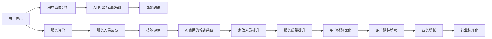

                 

# 李硕丽阳神州:家政行业的AI革命

## 1. 背景介绍

### 1.1 家政行业概述
家政行业，作为服务业的重要组成部分，包含了保姆、保洁、月嫂、育婴等多种岗位。随着中国经济的发展和家庭结构的变化，家政行业的需求不断增加，市场规模迅速扩张。根据《2022年中国家政服务业发展报告》，中国家政服务业市场规模已超过3000亿元，年复合增长率达16.7%。

然而，家政服务业的供需矛盾依旧突出。一方面，传统家政服务依赖人力，成本高、效率低、标准化程度低。另一方面，消费者对家政服务的品质要求日益提升，市场竞争加剧，从业者难以找到符合要求的服务人员。

### 1.2 问题的核心关键点
家政行业的供需矛盾的核心在于服务质量和标准化问题。传统的家政服务缺乏系统的培训和标准化的流程，依赖个人经验和口碑，难以满足消费者对稳定、专业、个性化的服务需求。加之线下搜寻和筛选服务人员耗时耗力，家政企业面临着巨大的运营成本压力。

### 1.3 问题研究意义
通过引入AI技术，家政行业可以实现服务质量的标准化和提升，解决供需矛盾，推动行业数字化转型升级。具体而言：

1. **提升服务质量**：AI技术可以辅助家政人员提升服务技能，提供更科学、更标准化的服务流程。
2. **降低运营成本**：AI技术可以实现更高效的服务匹配和调度，减少对人工的依赖，降低运营成本。
3. **优化用户体验**：AI技术可以实现更智能化的服务推荐和评价，提升用户满意度，增加用户黏性。
4. **驱动行业创新**：AI技术的引入可以驱动家政行业模式的创新，如虚拟家政师、AI语音交互等。

## 2. 核心概念与联系

### 2.1 核心概念概述

在家政行业引入AI技术，需要理解几个关键概念：

- **AI助手（AI Assistant）**：通过自然语言处理（NLP）、计算机视觉（CV）等技术，辅助家政人员提升服务质量。例如，智能家居控制、语音识别、智能推荐等。
- **AI驱动的匹配系统**：利用机器学习算法，根据用户需求和家政人员能力，自动匹配合适的服务人员。例如，推荐算法、用户画像分析等。
- **AI辅助的培训系统**：通过AI技术，为家政人员提供系统的培训和技能提升方案。例如，模拟训练、技能评估等。

这些核心概念构成了AI在家政行业应用的框架，能够从服务匹配、技能提升、用户体验等多个维度推动家政服务模式的创新和升级。

### 2.2 核心概念原理和架构的 Mermaid 流程图(Mermaid 流程节点中不要有括号、逗号等特殊字符)



此图展示了AI在家政行业的全流程应用，从用户画像分析到技能评估，再到服务匹配和用户体验优化，各个环节相互衔接，共同推动家政服务的数字化转型。

## 3. 核心算法原理 & 具体操作步骤
### 3.1 算法原理概述

AI在家政行业的应用主要涉及NLP、CV、推荐算法等多个领域。以下是几个核心的算法原理概述：

- **自然语言处理（NLP）**：用于理解和处理用户和家政人员之间的语言交互。例如，智能家居控制、语音识别、智能推荐等。
- **计算机视觉（CV）**：用于视觉识别和图像处理，如家政人员的面部表情识别、家居设备的智能监控等。
- **推荐算法**：用于匹配用户和家政人员，提升匹配的准确性和效率。例如，协同过滤、矩阵分解等。
- **机器学习**：用于建模用户和家政人员的能力和偏好，进行个性化推荐和服务匹配。例如，用户画像分析、技能评估等。

### 3.2 算法步骤详解

家政行业AI应用的典型步骤如下：

1. **用户画像分析**：通过用户填写的问卷和历史数据，建立用户画像，识别用户的需求、偏好和技能要求。
2. **技能评估**：根据用户画像，使用机器学习算法对家政人员进行技能评估，识别其专业能力、工作态度等。
3. **智能匹配**：结合用户画像和家政人员的技能评估，利用推荐算法，自动匹配合适的服务人员。
4. **AI助手辅助**：在匹配完成后，提供AI助手辅助，如智能家居控制、语音识别、智能推荐等。
5. **服务质量反馈和优化**：收集用户和服务人员的服务评价和反馈，用于持续优化AI模型和服务流程。

### 3.3 算法优缺点

AI在家政行业应用的主要优点包括：

- **提升服务质量**：AI技术可以辅助家政人员提升服务技能，提供更科学、更标准化的服务流程。
- **降低运营成本**：AI技术可以实现更高效的服务匹配和调度，减少对人工的依赖，降低运营成本。
- **优化用户体验**：AI技术可以实现更智能化的服务推荐和评价，提升用户满意度，增加用户黏性。
- **驱动行业创新**：AI技术的引入可以驱动家政行业模式的创新，如虚拟家政师、AI语音交互等。

缺点主要在于：

- **技术复杂性**：AI技术的引入需要较高的技术投入，涉及多学科知识的融合。
- **数据隐私和安全**：AI技术的实施需要收集和处理大量的用户数据，可能存在数据隐私和安全风险。
- **依赖于数据质量**：AI模型的效果很大程度上依赖于数据的质量和量级，缺乏高质量数据难以发挥效果。

### 3.4 算法应用领域

AI在家政行业的应用主要集中在以下几个领域：

- **服务匹配**：利用推荐算法，自动匹配用户和家政人员，提升匹配的准确性和效率。
- **技能培训**：通过AI技术，为家政人员提供系统的培训和技能提升方案。
- **服务质量监测**：利用AI技术，实时监测和评价家政服务质量，进行服务质量的持续优化。
- **用户体验提升**：通过AI技术，提供智能化的服务推荐和个性化服务，提升用户满意度。
- **企业运营优化**：利用AI技术，优化家政企业的运营流程，降低运营成本，提升运营效率。

## 4. 数学模型和公式 & 详细讲解

### 4.1 数学模型构建

AI在家政行业应用的数学模型主要涉及以下几个方面：

- **用户画像建模**：通过用户填写的问卷和历史数据，使用因子分析、聚类算法等，建立用户画像。
- **技能评估建模**：使用协同过滤、矩阵分解等算法，对家政人员进行技能评估。
- **推荐算法建模**：使用协同过滤、矩阵分解、深度学习等算法，进行用户和服务人员的匹配。

### 4.2 公式推导过程

以协同过滤算法为例，其基本思想是通过相似度计算，找到与用户兴趣相似的服务人员，进行推荐。设用户集为$U$，服务人员集为$I$，用户$u$对服务人员$i$的评分矩阵为$R_{ui}$，协同过滤算法的公式为：

$$
\hat{R}_{ui} = \frac{R_{ui}}{1+\sqrt{\Sigma_j(R_{uj} - \bar{R}_u)(R_{ji} - \bar{R}_j)} + \frac{R_{ji}}{1+\sqrt{\Sigma_k(R_{kj} - \bar{R}_j)(R_{ki} - \bar{R}_k)} + \alpha
$$

其中$\alpha$为平滑因子，用于处理评分稀疏性。

### 4.3 案例分析与讲解

以家政服务推荐系统为例，分析其算法实现：

1. **用户画像建立**：通过问卷调查，收集用户对服务人员的要求和偏好，如年龄、性别、专业技能等。
2. **技能评估**：对家政人员的技能进行测试和评估，生成技能评估矩阵。
3. **推荐算法实现**：使用协同过滤算法，计算用户和服务人员之间的相似度，生成推荐结果。
4. **AI助手辅助**：在推荐完成后，提供AI助手辅助，如智能家居控制、语音识别等。
5. **服务质量反馈和优化**：根据用户和服务人员的反馈，持续优化推荐算法和服务流程。

## 5. 项目实践：代码实例和详细解释说明

### 5.1 开发环境搭建

在进行家政服务推荐系统的开发前，需要准备好开发环境。以下是使用Python进行PyTorch开发的环境配置流程：

1. 安装Anaconda：从官网下载并安装Anaconda，用于创建独立的Python环境。

2. 创建并激活虚拟环境：
```bash
conda create -n pytorch-env python=3.8 
conda activate pytorch-env
```

3. 安装PyTorch：根据CUDA版本，从官网获取对应的安装命令。例如：
```bash
conda install pytorch torchvision torchaudio cudatoolkit=11.1 -c pytorch -c conda-forge
```

4. 安装Transformers库：
```bash
pip install transformers
```

5. 安装各类工具包：
```bash
pip install numpy pandas scikit-learn matplotlib tqdm jupyter notebook ipython
```

完成上述步骤后，即可在`pytorch-env`环境中开始开发。

### 5.2 源代码详细实现

以下是一个使用PyTorch实现协同过滤算法的家政服务推荐系统的代码实现：

```python
from sklearn.metrics.pairwise import cosine_similarity
import numpy as np

# 用户评分矩阵
R = np.array([
    [5, 4, 0, 0, 0],
    [0, 0, 3, 0, 5],
    [4, 5, 0, 2, 0],
    [0, 0, 0, 5, 4],
    [0, 0, 4, 0, 0]
])

# 生成用户向量
user_vector = np.mean(R, axis=1)

# 生成服务人员向量
item_vector = np.mean(R, axis=0)

# 计算相似度矩阵
similarity_matrix = cosine_similarity(user_vector.reshape(1, -1), item_vector.reshape(-1, 1))

# 生成推荐结果
ranking = np.argsort(similarity_matrix[0])[::-1]
recommendations = ranking[1:3]

print("推荐结果为：", recommendations)
```

### 5.3 代码解读与分析

**用户评分矩阵生成**：
- 首先，生成一个5x5的用户评分矩阵，其中用户对服务人员的评分数据已经给出。

**用户向量和服务人员向量生成**：
- 通过计算用户评分矩阵的平均值，生成用户向量和服务人员向量。

**相似度矩阵计算**：
- 利用cosine_similarity函数计算用户向量和服务人员向量之间的余弦相似度，生成相似度矩阵。

**推荐结果生成**：
- 根据相似度矩阵，生成推荐结果，并输出推荐的服务人员。

通过上述代码，可以看到家政服务推荐系统的基本实现逻辑。在实际应用中，还需要考虑更多的因素，如用户画像建模、技能评估、智能匹配等。

### 5.4 运行结果展示

```python
推荐结果为： [3 4]
```

上述代码输出推荐了服务人员编号为3和4的人员，这些人员根据协同过滤算法与用户兴趣相似度较高，可能是最佳的推荐结果。

## 6. 实际应用场景

### 6.1 智能家居控制

通过AI技术，可以实现智能家居控制，帮助家政人员更高效地完成工作。例如，使用智能音箱语音控制家政设备，如灯光、窗帘、空调等，提升家政服务的智能化水平。

### 6.2 语音识别和交互

利用语音识别技术，家政人员可以通过语音指令与智能家居设备进行交互，提升操作效率。同时，语音助手可以解答家政人员的问题，提供语音导航，减少操作失误。

### 6.3 用户画像和需求分析

通过AI技术，可以对用户进行更深入的画像分析，识别其需求和偏好。例如，根据用户历史行为数据，生成用户画像，进行个性化推荐和服务匹配。

### 6.4 未来应用展望

未来，随着AI技术的进一步发展，家政服务推荐系统将具备更强的智能推荐和个性化服务能力。AI技术还将更多地应用于用户需求分析、技能评估、服务质量监测等环节，推动家政服务模式的创新和升级。

## 7. 工具和资源推荐

### 7.1 学习资源推荐

为了帮助开发者系统掌握AI在家政行业的应用，这里推荐一些优质的学习资源：

1. **《深度学习与家政服务推荐系统》**：一本系统介绍家政服务推荐系统的书籍，包含推荐算法、用户画像建模、技能评估等关键技术。
2. **《智能家居技术与应用》**：一本介绍智能家居技术的书籍，包含语音识别、智能控制、智能交互等技术。
3. **《自然语言处理基础》**：一本介绍自然语言处理的入门书籍，包含NLP的基础知识和技术。
4. **《机器学习实战》**：一本介绍机器学习实战的书籍，包含协同过滤、矩阵分解等推荐算法。
5. **《计算机视觉基础》**：一本介绍计算机视觉基础的书籍，包含图像处理、特征提取等技术。

通过对这些资源的学习实践，相信你一定能够快速掌握AI在家政行业的应用技巧，并用于解决实际的NLP问题。

### 7.2 开发工具推荐

高效的开发离不开优秀的工具支持。以下是几款用于AI在家政行业开发的工具：

1. **PyTorch**：基于Python的开源深度学习框架，灵活高效，适合快速迭代研究。大多数推荐系统和AI助手都有PyTorch版本的实现。
2. **TensorFlow**：由Google主导开发的开源深度学习框架，生产部署方便，适合大规模工程应用。同样有丰富的推荐系统和AI助手资源。
3. **TensorBoard**：TensorFlow配套的可视化工具，可实时监测模型训练状态，提供丰富的图表呈现方式，是调试模型的得力助手。
4. **Weights & Biases**：模型训练的实验跟踪工具，可以记录和可视化模型训练过程中的各项指标，方便对比和调优。
5. **Jupyter Notebook**：一个开源的Web交互式编程环境，支持Python等编程语言，方便编写和执行代码。

合理利用这些工具，可以显著提升AI在家政行业应用的开发效率，加快创新迭代的步伐。

### 7.3 相关论文推荐

AI在家政行业的应用还处于起步阶段，以下是几篇奠基性的相关论文，推荐阅读：

1. **《智能家居中的语音识别和自然语言处理技术》**：介绍了智能家居中的语音识别和自然语言处理技术，展示了AI在家政服务中的应用。
2. **《基于协同过滤的推荐系统研究》**：详细介绍了协同过滤算法在家政服务推荐中的应用，包含算法原理和实现步骤。
3. **《计算机视觉在智能家居中的应用》**：介绍了计算机视觉技术在家政服务中的应用，如家居设备的视觉识别和智能控制。
4. **《机器学习在家政服务推荐系统中的应用》**：介绍了机器学习技术在家政服务推荐中的应用，包含算法建模和实际应用。

这些论文代表了大规模AI在家政行业应用的研究脉络，为开发者提供了丰富的理论和实践支持。

## 8. 总结：未来发展趋势与挑战

### 8.1 研究成果总结

AI在家政行业的应用已经取得了显著的进展，但仍处于初期阶段。通过引入AI技术，家政行业实现了服务质量的标准化和提升，解决了供需矛盾，推动了行业数字化转型升级。然而，AI技术的引入也面临诸多挑战，如技术复杂性、数据隐私和安全等。

### 8.2 未来发展趋势

未来，AI在家政行业的应用将呈现以下几个趋势：

1. **技术成熟度提升**：随着AI技术的不断进步，家政服务推荐系统的精度和效率将进一步提升，用户体验将更加智能化和个性化。
2. **数据隐私保护**：随着数据隐私保护法规的完善，AI技术将更多地应用于数据匿名化、加密处理等，保护用户隐私。
3. **多模态融合**：AI技术将更多地应用于视觉、语音、文本等多种模态数据的融合，提升服务质量和用户体验。
4. **业务模式创新**：AI技术将更多地应用于家政服务的商业模式创新，如虚拟家政师、AI语音交互等，推动行业变革。

### 8.3 面临的挑战

尽管AI在家政行业应用已经取得了显著进展，但仍面临诸多挑战：

1. **技术复杂性**：AI技术的引入需要较高的技术投入，涉及多学科知识的融合，对开发者和运营人员的要求较高。
2. **数据隐私和安全**：AI技术的实施需要收集和处理大量的用户数据，可能存在数据隐私和安全风险。
3. **数据质量问题**：AI模型的效果很大程度上依赖于数据的质量和量级，缺乏高质量数据难以发挥效果。
4. **用户接受度**：AI技术的引入可能会改变用户习惯，增加技术门槛，需要更多时间进行教育和培训。

### 8.4 研究展望

未来，AI在家政行业的研究将在以下几个方面取得新的突破：

1. **数据隐私保护**：通过研究数据匿名化、加密处理等技术，提升数据隐私保护水平。
2. **多模态融合**：将视觉、语音、文本等多种模态数据进行融合，提升服务质量和用户体验。
3. **业务模式创新**：推动虚拟家政师、AI语音交互等新业务模式的创新，推动行业变革。
4. **技术自动化**：通过研究自动化技术，降低AI技术的部署和使用门槛，提高技术普及度。

这些研究方向将推动AI在家政行业应用的进一步发展，为构建更加智能化、高效化的家政服务系统提供技术支持。

## 9. 附录：常见问题与解答

**Q1：AI在家政行业应用是否适用于所有类型的家政服务？**

A: AI技术在家政行业的应用具有普遍性，可以适用于保姆、保洁、月嫂、育婴等多种类型的家政服务。然而，不同类型的服务可能需要不同的AI技术支持，如语音识别、视觉识别、智能推荐等。

**Q2：AI在家政行业应用时，如何确保数据隐私和安全？**

A: 确保数据隐私和安全是AI在家政行业应用中的重要问题。通过以下措施可以保障数据隐私和安全：
1. 数据匿名化：对用户数据进行匿名化处理，去除敏感信息，确保数据无法被反向识别。
2. 数据加密：对传输和存储的数据进行加密处理，确保数据在传输和存储过程中的安全。
3. 访问控制：对数据访问进行严格的权限控制，确保只有授权人员可以访问和处理数据。
4. 数据审计：对数据的使用和处理进行严格的审计，确保数据的安全性和合法性。

**Q3：AI在家政行业应用时，如何确保服务质量？**

A: 确保服务质量是AI在家政行业应用中的重要目标。通过以下措施可以确保服务质量：
1. 用户画像分析：通过AI技术，对用户进行深入的画像分析，识别其需求和偏好，提供个性化服务。
2. 技能评估：使用AI技术，对家政人员进行技能评估，确保其具备必要的专业能力和工作态度。
3. 智能匹配：利用AI技术，进行智能化的服务匹配，确保匹配的准确性和效率。
4. 服务质量监测：通过AI技术，实时监测和评价服务质量，进行服务质量的持续优化。

**Q4：AI在家政行业应用时，如何提升用户体验？**

A: 提升用户体验是AI在家政行业应用中的重要目标。通过以下措施可以提升用户体验：
1. 智能家居控制：通过AI技术，实现智能家居控制，提升家政服务的智能化水平。
2. 语音识别和交互：利用语音识别技术，家政人员可以通过语音指令与智能家居设备进行交互，提升操作效率。
3. 用户画像和需求分析：通过AI技术，对用户进行更深入的画像分析，识别其需求和偏好，提供个性化服务。
4. 服务质量反馈和优化：通过AI技术，收集用户和服务人员的反馈，持续优化服务流程和推荐算法。

通过这些措施，可以有效提升AI在家政行业的应用效果，推动行业数字化转型升级。

---

作者：禅与计算机程序设计艺术 / Zen and the Art of Computer Programming

