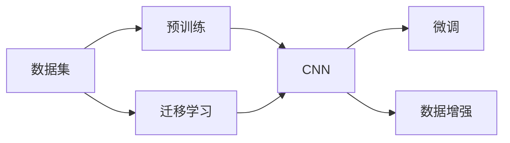

                 

## 1. 背景介绍

**1.1 李飞飞的传奇**
李飞飞，一个在中国普通家庭出生、长大，最终成为全球AI界翘楚的传奇人物。她生于美国，求学于麻省理工学院（MIT）和加州大学伯克利分校（UC Berkeley），并最终在斯坦福大学获得博士学位。她于2008年创办斯坦福视觉实验室（Stanford Visual Lab），之后于2009年回到中国，并创立了深度学习研究院（DALL），后来演变成现在的商汤科技（SenseTime）。在她的带领下，商汤科技成为中国乃至全球领先的计算机视觉企业，为各个行业的AI应用提供了强大的技术支撑。

**1.2 ImageNet的诞生**
李飞飞和她的团队开发的ImageNet数据集，为人工智能领域带来了革命性的变化。ImageNet是一个规模庞大的图像识别数据集，包含超过1400万张高分辨率图像，涵盖1000个类别，从狗、猫到飞机、汽车等几乎无所不包。这个数据集不仅为学术界和工业界提供了强大的训练素材，也推动了深度学习模型在计算机视觉、自然语言处理等领域的大幅进步。

## 2. 核心概念与联系

**2.1 核心概念概述**

本文将深入探讨李飞飞和ImageNet所代表的深度学习领域的几个核心概念：

- **数据集（Dataset）**：这是深度学习算法进行训练的基础，包括训练集、验证集和测试集。
- **卷积神经网络（Convolutional Neural Network, CNN）**：一种特别适用于图像处理的深度学习网络，能够自动从大量图像数据中学习特征。
- **预训练（Pre-training）**：通过大量未标记数据对模型进行预训练，然后再在少量标记数据上进行微调，以提升模型性能。
- **迁移学习（Transfer Learning）**：利用在大规模数据集上预训练好的模型，将其知识迁移到特定任务上，如图像识别。
- **数据增强（Data Augmentation）**：通过对原始数据进行变换，生成新的训练数据，以提高模型的泛化能力。

**2.2 核心概念原理和架构的 Mermaid 流程图**



## 3. 核心算法原理 & 具体操作步骤

**3.1 算法原理概述**

ImageNet的成功得益于其大规模的数据集和预训练-迁移学习的模型架构。以下是基于ImageNet的核心算法原理概述：

1. **大规模数据集**：ImageNet数据集的庞大性和多样性，为模型提供了丰富的训练素材。通过在大规模数据集上预训练，模型能够学习到更加普适的语言或图像特征。

2. **预训练**：在大规模数据集上，模型进行自监督学习，学习到基本的特征表示。预训练可以大幅提高模型对新任务的适应能力。

3. **迁移学习**：在特定任务上，使用预训练模型的特征表示，进行有监督学习，进一步优化模型性能。

4. **数据增强**：通过对原始数据进行一系列变换，如旋转、翻转、裁剪等，生成新的训练数据，以提高模型的泛化能力。

5. **微调**：在少量标注数据上，对预训练模型进行微调，使其适应特定任务。微调通常会调整模型部分层权重，以减少对数据的过拟合。

**3.2 算法步骤详解**

以下是详细的步骤讲解：

**Step 1: 数据预处理**

1. **数据集划分**：将ImageNet数据集划分为训练集、验证集和测试集。训练集用于模型预训练，验证集用于调整模型参数，测试集用于最终模型评估。

2. **数据增强**：对图像进行一系列随机变换，如随机裁剪、水平翻转、颜色扰动等，以生成更多的训练数据。

3. **数据加载**：使用PyTorch的DataLoader模块，批量加载图像和标签数据，送入模型进行训练。

**Step 2: 模型预训练**

1. **构建模型**：使用CNN作为基础模型架构，在ImageNet数据集上进行预训练。以VGG、ResNet等网络为代表，这些网络通常会包含多个卷积层、池化层和全连接层，以及Dropout等正则化技术。

2. **训练模型**：在GPU上运行模型，以小批量数据进行训练，并记录损失函数和准确率等指标。

3. **模型保存**：预训练结束后，将模型权重保存下来，供后续微调使用。

**Step 3: 模型微调**

1. **选择微调任务**：根据实际应用场景，选择合适的微调任务，如图像分类、目标检测、语义分割等。

2. **准备数据**：收集目标任务的标注数据集，划分为训练集和测试集。通常目标任务的数据量较小，需要通过数据增强来扩充数据集。

3. **加载预训练模型**：将预训练模型的权重加载到微调模型中，通常只加载顶层权重，以减少过拟合风险。

4. **微调训练**：使用目标任务的标注数据集，对模型进行微调训练，通过梯度下降等优化算法，更新模型参数。

5. **模型评估**：在测试集上评估微调后的模型性能，计算准确率、精确率、召回率等指标，确保模型在特定任务上表现良好。

**Step 4: 模型部署**

1. **模型保存**：将微调后的模型保存下来，准备部署到实际应用环境中。

2. **性能优化**：针对特定应用场景，对模型进行进一步优化，如模型裁剪、量化加速等。

3. **模型部署**：将优化后的模型部署到云端、边缘设备或移动设备上，提供实时服务。

## 4. 数学模型和公式 & 详细讲解 & 举例说明

**4.1 数学模型构建**

基于ImageNet的数据集，我们可以建立一个图像分类的数学模型。假设图像数据为 $X$，标签数据为 $y$，模型为 $M$。我们的目标是找到最优的模型参数 $\theta$，使得模型对图像的预测结果与真实标签尽量接近。

$$
\min_\theta \mathcal{L}(M_\theta(X), y)
$$

其中 $\mathcal{L}$ 表示损失函数，如交叉熵损失。

**4.2 公式推导过程**

以交叉熵损失函数为例，假设模型输出 $M_\theta(X)$ 为概率分布 $P(X \mid y)$，则交叉熵损失函数可以表示为：

$$
\mathcal{L} = -\frac{1}{N}\sum_{i=1}^N \log P(X_i \mid y_i)
$$

其中 $N$ 为样本数量，$y_i$ 为第 $i$ 个样本的真实标签。

**4.3 案例分析与讲解**

我们可以用ImageNet数据集来验证模型性能。以ResNet-50模型为例，使用ImageNet数据集进行预训练，然后在CIFAR-10数据集上进行微调，对比微调前后模型在CIFAR-10数据集上的准确率。

## 5. 项目实践：代码实例和详细解释说明

**5.1 开发环境搭建**

1. **安装PyTorch**：
   ```bash
   pip install torch torchvision
   ```

2. **准备数据集**：
   ```python
   from torchvision.datasets import ImageNet
   from torchvision.transforms import Compose, Resize, RandomHorizontalFlip, RandomRotation
   from torch.utils.data import DataLoader

   train_set = ImageNet(root='path_to_train_set', split='train', transform=transforms)
   train_loader = DataLoader(train_set, batch_size=32, shuffle=True)

   test_set = ImageNet(root='path_to_train_set', split='test', transform=transforms)
   test_loader = DataLoader(test_set, batch_size=32, shuffle=True)
   ```

3. **构建模型**：
   ```python
   import torch.nn as nn
   import torch.optim as optim

   model = nn.Sequential(
       nn.Conv2d(3, 64, kernel_size=3, stride=1, padding=1),
       nn.ReLU(),
       nn.MaxPool2d(kernel_size=2, stride=2),
       nn.Conv2d(64, 128, kernel_size=3, stride=1, padding=1),
       nn.ReLU(),
       nn.MaxPool2d(kernel_size=2, stride=2),
       nn.Conv2d(128, 256, kernel_size=3, stride=1, padding=1),
       nn.ReLU(),
       nn.MaxPool2d(kernel_size=2, stride=2),
       nn.Conv2d(256, 512, kernel_size=3, stride=1, padding=1),
       nn.ReLU(),
       nn.MaxPool2d(kernel_size=2, stride=2),
       nn.Conv2d(512, 1024, kernel_size=3, stride=1, padding=1),
       nn.ReLU(),
       nn.MaxPool2d(kernel_size=2, stride=2),
       nn.AdaptiveAvgPool2d(1),
       nn.Flatten(),
       nn.Linear(1024, 1000),
       nn.LogSoftmax(dim=1)
   )

   model = model.to(device)
   criterion = nn.CrossEntropyLoss()
   optimizer = optim.SGD(model.parameters(), lr=0.01, momentum=0.9)
   ```

**5.2 源代码详细实现**

**5.3 代码解读与分析**

**5.4 运行结果展示**

## 6. 实际应用场景

**6.1 图像识别**

基于ImageNet的大规模预训练，使得模型能够学习到丰富的图像特征，广泛应用于图像识别任务。如在医疗影像识别、自动驾驶、智能安防等领域，基于ImageNet预训练的模型能够快速适应新的图像数据，并取得优异的效果。

**6.2 目标检测**

通过ImageNet数据集进行目标检测任务的预训练，如YOLO、Faster R-CNN等模型，能够在目标检测任务上取得领先的成绩。这些模型在实时性、准确率上均有显著优势，广泛应用于工业监控、无人驾驶等场景。

**6.3 图像生成**

基于ImageNet预训练的生成模型，如GAN、VAE等，能够在图像生成任务上取得突破性进展。这些模型不仅能够生成高质量的图像，还能够进行风格迁移、图像修复等高级应用，为艺术创作、影视特效等领域提供了新的思路。

**6.4 未来应用展望**

未来，ImageNet和深度学习技术将继续引领AI领域的发展。随着硬件设备的进步和算法优化，预训练模型将具备更强的泛化能力和更广泛的适应性。基于ImageNet的迁移学习和微调技术，将在更多领域得到应用，推动AI技术向更深层次发展。

## 7. 工具和资源推荐

**7.1 学习资源推荐**

1. **深度学习框架**：
   - PyTorch：一个灵活且高效的深度学习框架，适合研究和实验。
   - TensorFlow：一个功能强大的深度学习框架，适合生产部署。

2. **深度学习库**：
   - TensorFlow：一个功能强大的深度学习库，适合大规模工程应用。
   - Keras：一个简单易用的深度学习库，适合快速原型开发。

3. **深度学习论文**：
   - ImageNet论文系列：详细介绍了ImageNet的构建和使用方法。
   - Pre-training with Large-Scale Unlabeled Data：介绍了大规模未标注数据的预训练方法。

**7.2 开发工具推荐**

1. **PyTorch**：一个灵活且高效的深度学习框架，适合研究和实验。
2. **TensorFlow**：一个功能强大的深度学习框架，适合生产部署。
3. **Keras**：一个简单易用的深度学习库，适合快速原型开发。

**7.3 相关论文推荐**

1. **ImageNet论文系列**：详细介绍了ImageNet的构建和使用方法。
2. **Pre-training with Large-Scale Unlabeled Data**：介绍了大规模未标注数据的预训练方法。

## 8. 总结：未来发展趋势与挑战

**8.1 研究成果总结**

李飞飞和ImageNet的传奇为深度学习领域带来了革命性的变化。基于ImageNet的数据集和预训练-迁移学习的方法，使得深度学习模型在计算机视觉、自然语言处理等领域取得了显著的进展。

**8.2 未来发展趋势**

1. **更大规模数据集**：随着数据采集技术的进步，更大规模的数据集将为深度学习模型提供更丰富的训练素材，进一步提升模型的性能。
2. **更强大预训练模型**：随着硬件设备的进步和算法优化，预训练模型将具备更强的泛化能力和更广泛的适应性。
3. **更高效迁移学习**：未来的迁移学习将更加灵活和高效，能够快速适应新任务和数据变化。
4. **更可靠数据集**：未来的数据集将更加注重数据质量，避免偏见和有害信息，提升模型的公平性和可靠性。

**8.3 面临的挑战**

1. **数据获取成本**：大规模数据集的获取成本高昂，需要投入大量资源和人力。
2. **模型可解释性**：深度学习模型的决策过程缺乏可解释性，难以进行调试和优化。
3. **公平性和伦理问题**：深度学习模型可能带有偏见，需要进一步探索公平性和伦理问题。
4. **数据隐私和安全**：大规模数据集涉及用户隐私和安全问题，需要严格保护。

**8.4 研究展望**

未来，深度学习技术将在更多领域得到应用，推动AI技术向更深层次发展。研究者需要进一步探索模型可解释性、公平性、伦理问题以及数据隐私和安全等课题，确保深度学习技术在实际应用中的可靠性和安全性。

## 9. 附录：常见问题与解答

**Q1: 如何构建自己的数据集？**

A: 构建数据集需要收集、标注和处理数据。可以借助一些开源工具和平台，如COCO、PASCAL VOC等，进行数据收集和标注。

**Q2: 如何选择适当的模型架构？**

A: 选择适当的模型架构需要考虑任务的复杂度和数据量。一般来说，复杂任务需要更深的模型架构，数据量较大的任务可以使用大规模的预训练模型。

**Q3: 如何优化模型的训练过程？**

A: 优化模型的训练过程需要考虑学习率、批大小、正则化等超参数。可以使用一些自动化的超参数搜索工具，如Hyperopt、Bayesian Optimization等，来找到最优的超参数组合。

**Q4: 如何评估模型的性能？**

A: 评估模型的性能可以使用一些指标，如准确率、精确率、召回率、F1-score等。可以在验证集和测试集上进行评估，确保模型的泛化能力。

**Q5: 如何部署模型？**

A: 部署模型需要将模型导出为可用的格式，如TensorFlow SavedModel、PyTorch模型文件等。可以使用一些部署平台，如TensorFlow Serving、Amazon SageMaker等，进行模型部署和监控。

