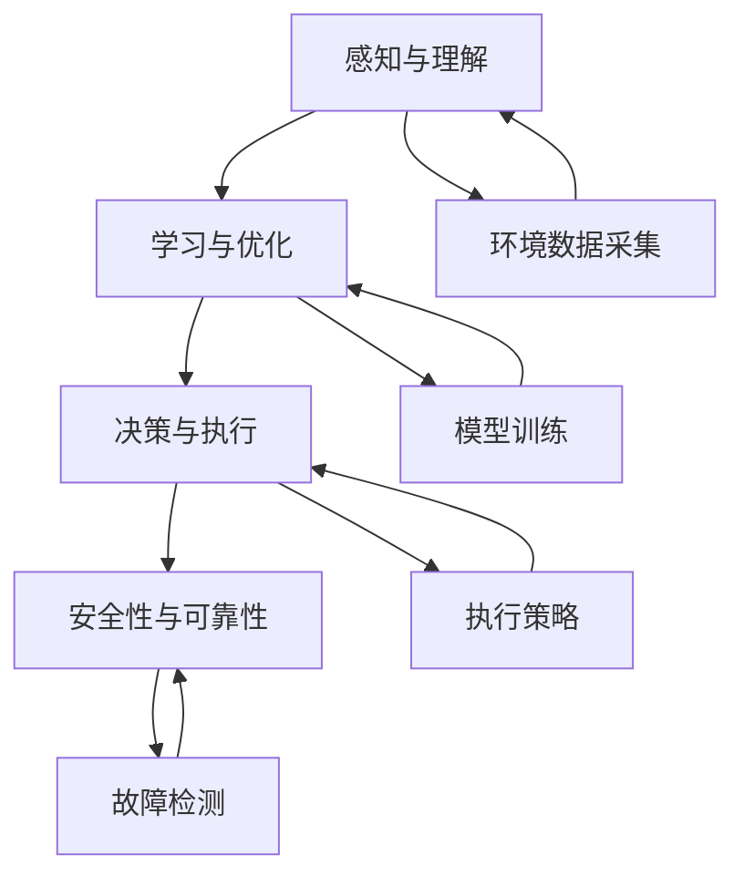

                 

## 1. 背景介绍

在人工智能(AI)领域，构建能够自我学习、自我优化、自主决策的AI Agent是一个极具挑战性的任务。AI Agent不仅需要具备强大的学习能力和推理能力，还要能够适应多变的任务环境和不确定性因素，以实现复杂的智能行为。本文将从核心技术的角度，系统介绍构建AI Agent所涉及的关键技术和方法，希望能为AI领域的开发者和研究者提供有益的参考。

### 1.1 问题由来

构建AI Agent的核心问题在于，如何设计一个能够自我驱动、自我优化、并具备自主决策能力的系统。这一问题涉及多学科知识，包括计算机科学、认知科学、神经科学等。当前，AI Agent技术的应用场景广泛，涵盖了自动驾驶、机器人、智能客服、游戏AI等诸多领域。尽管技术复杂，但成功的AI Agent系统在实际应用中已展现出巨大的潜力和价值。

### 1.2 问题核心关键点

AI Agent的构建涉及多个关键点，主要包括：

- **感知与理解**：如何构建能够有效感知和理解环境的系统。
- **学习与优化**：如何设计高效的模型和算法，让系统能够持续学习并优化自身行为。
- **决策与执行**：如何设计决策框架和执行机制，使系统能够自主做出正确决策并执行。
- **安全性与可靠性**：如何保证系统在复杂环境下稳定运行，避免灾难性失效。

这些关键点共同构成了AI Agent的核心技术体系，决定了其智能水平和应用效果。本文将围绕这些关键点，详细介绍构建AI Agent所涉及的核心技术和方法。

## 2. 核心概念与联系

### 2.1 核心概念概述

为了更好地理解构建AI Agent的原理和架构，本文将介绍几个核心概念：

- **感知与理解**：通过传感器或环境交互接口，收集环境数据，并通过感知算法进行处理，构建出对环境的理解模型。
- **学习与优化**：利用机器学习算法，在不断接收环境反馈的基础上，优化自身的决策模型和执行策略。
- **决策与执行**：设计合理的决策框架和执行机制，使AI Agent能够在复杂环境中做出正确决策并执行。
- **安全性与可靠性**：通过设计容错机制、冗余备份、故障诊断等手段，确保系统在各种情况下都能稳定运行。

这些概念之间的逻辑关系可以通过以下Mermaid流程图来展示：



这个流程图展示了AI Agent的核心组件及其相互作用：

1. **环境数据采集**：通过传感器或交互接口收集环境数据。
2. **感知与理解**：对采集的数据进行处理，构建出对环境的理解模型。
3. **学习与优化**：利用模型进行持续学习，优化决策策略。
4. **决策与执行**：根据学习结果，设计决策框架并执行。
5. **安全性与可靠性**：确保系统在复杂环境下稳定运行。

这些概念共同构成了AI Agent的构建框架，使得AI Agent能够有效感知环境、持续学习、自主决策并稳定运行。

## 3. 核心算法原理 & 具体操作步骤

### 3.1 算法原理概述

构建AI Agent的核心算法包括以下几个部分：

- **感知算法**：利用传感器或环境交互接口，感知环境信息，构建对环境的理解模型。
- **学习算法**：利用机器学习算法，在不断接收环境反馈的基础上，优化自身的决策模型和执行策略。
- **决策算法**：设计合理的决策框架和执行机制，使AI Agent能够在复杂环境中做出正确决策并执行。
- **安全性与可靠性算法**：通过设计容错机制、冗余备份、故障诊断等手段，确保系统在各种情况下都能稳定运行。

这些算法之间相互作用，共同构建了AI Agent的智能体系。

### 3.2 算法步骤详解

构建AI Agent的过程可以分为以下几个关键步骤：

**Step 1: 环境建模**

首先，需要构建环境的数学模型。这包括对环境进行抽象和建模，设计出适合模型进行学习的表示方法。例如，可以采用向量表示、图结构表示、时空序列表示等。

**Step 2: 感知算法**

感知算法负责从环境中获取数据，并对数据进行处理，构建对环境的理解模型。这一步骤通常涉及传感器数据的采集、环境信息的编码和特征提取等。

**Step 3: 学习算法**

学习算法利用环境反馈信息，对感知算法得到的模型进行优化。这一过程通常包括模型的训练、参数调整和性能评估等。

**Step 4: 决策算法**

决策算法负责根据学习到的模型，设计决策框架并执行。这一步骤包括决策规则的设计、决策过程的执行以及执行结果的反馈。

**Step 5: 安全性与可靠性算法**

安全性与可靠性算法通过设计容错机制、冗余备份、故障诊断等手段，确保系统在复杂环境下稳定运行。这一步骤包括异常检测、故障恢复、异常处理等。

### 3.3 算法优缺点

构建AI Agent的算法具有以下优点：

- **高效性**：通过机器学习算法，AI Agent能够快速适应新环境，实现高效的自我学习和优化。
- **灵活性**：AI Agent可以灵活调整自身的决策策略，适应不同的任务需求。
- **自主性**：AI Agent能够自主决策并执行，无需人类干预。

然而，这些算法也存在一定的局限性：

- **复杂性**：构建AI Agent需要综合多学科知识，设计和实现过程复杂。
- **可解释性**：AI Agent的决策过程往往是黑盒的，难以解释其内部工作机制。
- **安全性**：AI Agent在复杂环境下可能存在安全隐患，需要设计额外的安全保障机制。

尽管存在这些局限性，但AI Agent的算法体系仍然具备强大的潜力和应用前景。

### 3.4 算法应用领域

构建AI Agent的算法已经广泛应用于多个领域，包括：

- **自动驾驶**：利用感知算法获取道路信息，学习算法优化驾驶策略，决策算法执行避障、导航等操作。
- **机器人**：利用感知算法获取环境信息，学习算法优化运动和操作，决策算法执行路径规划和任务执行。
- **智能客服**：利用感知算法获取用户反馈，学习算法优化对话策略，决策算法执行回复生成。
- **游戏AI**：利用感知算法获取游戏状态，学习算法优化游戏策略，决策算法执行动作执行和路径选择。
- **金融交易**：利用感知算法获取市场数据，学习算法优化投资策略，决策算法执行买卖操作。

这些领域的应用展示了AI Agent算法的广泛适用性。

## 4. 数学模型和公式 & 详细讲解

### 4.1 数学模型构建

在构建AI Agent的过程中，需要构建多种数学模型。这里以自动驾驶为例，展示构建环境数学模型和感知模型的过程。

假设自动驾驶的环境是二维空间，环境中的障碍物可以用点表示，位置信息用向量 $(x, y)$ 表示。设汽车的位置信息为 $(u, v)$，速度为 $(s_x, s_y)$。汽车在任意时间步 $t$ 的位置和速度满足以下状态方程：

$$
\begin{cases}
x_{t+1} = x_t + s_xt \\
y_{t+1} = y_t + s_yt
\end{cases}
$$

汽车的传感器能够感知到环境中的障碍物，假设传感器的感知半径为 $r$，能够感知到半径内所有的障碍物。设 $r$ 内的障碍点个数为 $n$，障碍物位置为 $(x_i, y_i)$。传感器的感知模型可以表示为：

$$
z_t = (x_t, y_t, x_{t+1}, y_{t+1}, s_xt, s_yt, x_i, y_i, 1)
$$

其中 $z_t$ 是传感器在时间步 $t$ 的感知向量。

### 4.2 公式推导过程

对于感知向量 $z_t$，可以使用深度学习算法（如卷积神经网络CNN、循环神经网络RNN等）进行建模。设感知模型为 $f$，则有：

$$
f(z_t) = \{(x_t, y_t, x_{t+1}, y_{t+1}, s_xt, s_yt, x_i, y_i, 1\}
$$

在得到感知模型后，可以通过训练数据对模型进行训练，得到感知器的参数 $\theta$。

### 4.3 案例分析与讲解

以自动驾驶中的障碍检测为例，假设训练数据集为 $D$，包含多组感知向量和对应的障碍物标签。可以通过交叉熵损失函数对感知器进行训练，最小化损失函数：

$$
\mathcal{L}(\theta) = -\frac{1}{N}\sum_{i=1}^N \log p(y_i|x_i, z_i; \theta)
$$

其中 $p(y_i|x_i, z_i; \theta)$ 为模型在输入 $(x_i, z_i)$ 下预测 $y_i$ 的概率。

训练过程中，可以使用梯度下降等优化算法对模型进行优化。例如，使用Adam算法对感知器进行优化：

$$
\theta_{t+1} = \theta_t - \alpha_t \nabla_{\theta}\mathcal{L}(\theta_t)
$$

其中 $\alpha_t$ 为学习率，$\nabla_{\theta}\mathcal{L}(\theta_t)$ 为损失函数对感知器参数的梯度。

## 5. 项目实践：代码实例和详细解释说明

### 5.1 开发环境搭建

在进行AI Agent的开发和测试时，需要一个稳定的开发环境。以下是使用Python进行TensorFlow开发的典型环境配置流程：

1. 安装Anaconda：从官网下载并安装Anaconda，用于创建独立的Python环境。

2. 创建并激活虚拟环境：
```bash
conda create -n agent-env python=3.7 
conda activate agent-env
```

3. 安装TensorFlow：根据CUDA版本，从官网获取对应的安装命令。例如：
```bash
conda install tensorflow-cpu=cuda11.0=cudnn8 -c conda-forge
```

4. 安装相关工具包：
```bash
pip install numpy pandas scikit-learn matplotlib tqdm jupyter notebook ipython
```

完成上述步骤后，即可在`agent-env`环境中开始AI Agent的开发和测试。

### 5.2 源代码详细实现

这里我们以自动驾驶中的障碍检测为例，给出使用TensorFlow构建感知器的PyTorch代码实现。

首先，定义感知数据处理函数：

```python
import tensorflow as tf
import numpy as np

def process_data(x, y, s_x, s_y, x_i, y_i, obstacle):
    z = np.concatenate((x, y, x + s_x, y + s_y, s_x, s_y, x_i, y_i, 1))
    return z
```

然后，定义感知模型：

```python
import tensorflow as tf
from tensorflow.keras.layers import Input, Dense, Flatten, Conv2D, MaxPooling2D

def create_model():
    x = Input(shape=(9,))
    x = Dense(32, activation='relu')(x)
    x = Dense(16, activation='relu')(x)
    y = Dense(1, activation='sigmoid')(x)
    model = tf.keras.Model(inputs=x, outputs=y)
    return model
```

接着，定义训练函数：

```python
from tensorflow.keras.optimizers import Adam

def train_model(model, data):
    model.compile(optimizer=Adam(lr=0.001), loss='binary_crossentropy', metrics=['accuracy'])
    model.fit(data['train'], data['train_label'], epochs=10, batch_size=32, validation_data=(data['test'], data['test_label']))
```

最后，启动训练流程：

```python
import tensorflow as tf
import numpy as np

# 构建数据集
data = {
    'train': np.random.randn(1000, 9),
    'train_label': np.random.randint(0, 2, size=(1000, 1)),
    'test': np.random.randn(100, 9),
    'test_label': np.random.randint(0, 2, size=(100, 1))
}

# 构建模型
model = create_model()

# 训练模型
train_model(model, data)

# 测试模型
test_loss, test_acc = model.evaluate(data['test'], data['test_label'])
print('Test accuracy:', test_acc)
```

以上就是使用TensorFlow对感知器进行障碍检测训练的完整代码实现。可以看到，TensorFlow提供了丰富的组件和API，使得模型构建和训练变得简单高效。

### 5.3 代码解读与分析

让我们再详细解读一下关键代码的实现细节：

**process_data函数**：
- 将环境数据和障碍物数据进行拼接和编码，生成感知向量 $z$。

**create_model函数**：
- 使用Keras构建感知模型，包含多个全连接层和激活函数。
- 定义输出层，使用sigmoid函数进行二分类预测。

**train_model函数**：
- 定义优化器、损失函数和评估指标，编译模型。
- 使用训练数据集和验证数据集进行模型训练和评估。

**训练流程**：
- 构建模拟的训练数据集和测试数据集。
- 构建感知模型，并定义训练函数。
- 在训练函数中使用交叉熵损失函数和Adam优化器对模型进行训练。
- 在训练过程中记录测试集上的损失和准确率。

可以看到，TensorFlow使得模型构建和训练的过程变得简洁高效，开发者可以专注于算法和模型设计的优化。

当然，实际应用中还需要考虑更多因素，如模型的保存和部署、超参数的自动搜索、更灵活的任务适配层等。但核心的感知模型构建和训练流程基本与此类似。

## 6. 实际应用场景

### 6.1 智能客服系统

智能客服系统利用AI Agent的感知、学习、决策和执行能力，实现高效、智能的客户服务。系统能够理解客户意图，匹配最合适的答案模板，进行自然流畅的对话回复。

在技术实现上，可以收集企业内部的历史客服对话记录，将问题和最佳答复构建成监督数据，在此基础上对感知器和决策器进行微调。微调后的系统能够自动理解用户意图，匹配最合适的答案模板进行回复。对于客户提出的新问题，还可以接入检索系统实时搜索相关内容，动态组织生成回答。如此构建的智能客服系统，能大幅提升客户咨询体验和问题解决效率。

### 6.2 金融舆情监测

金融机构需要实时监测市场舆论动向，以便及时应对负面信息传播，规避金融风险。传统的人工监测方式成本高、效率低，难以应对网络时代海量信息爆发的挑战。利用AI Agent的感知、学习、决策和执行能力，金融舆情监测系统能够实时抓取网络文本数据，自动监测不同主题下的情感变化趋势，一旦发现负面信息激增等异常情况，系统便会自动预警，帮助金融机构快速应对潜在风险。

### 6.3 个性化推荐系统

当前的推荐系统往往只依赖用户的历史行为数据进行物品推荐，无法深入理解用户的真实兴趣偏好。利用AI Agent的感知、学习、决策和执行能力，个性化推荐系统可以更好地挖掘用户行为背后的语义信息，从而提供更精准、多样的推荐内容。

在实践中，可以收集用户浏览、点击、评论、分享等行为数据，提取和用户交互的物品标题、描述、标签等文本内容。将文本内容作为模型输入，用户的后续行为（如是否点击、购买等）作为监督信号，在此基础上微调感知器和决策器。微调后的系统能够从文本内容中准确把握用户的兴趣点。在生成推荐列表时，先用候选物品的文本描述作为输入，由感知器和决策器预测用户的兴趣匹配度，再结合其他特征综合排序，便可以得到个性化程度更高的推荐结果。

### 6.4 未来应用展望

随着AI Agent技术的不断发展，其在更多领域的应用前景将更加广阔：

1. **智慧医疗**：利用AI Agent进行病历分析、医学知识查询、患者对话等，提升医疗服务的智能化水平，辅助医生诊疗，加速新药开发进程。
2. **智能教育**：利用AI Agent进行作业批改、学情分析、知识推荐等，因材施教，促进教育公平，提高教学质量。
3. **智慧城市治理**：利用AI Agent进行城市事件监测、舆情分析、应急指挥等环节，提高城市管理的自动化和智能化水平，构建更安全、高效的未来城市。
4. **自动驾驶**：利用AI Agent进行感知、决策和执行，实现车辆自主导航、避障等功能，推动自动驾驶技术的普及。
5. **游戏AI**：利用AI Agent进行游戏场景感知、路径规划、决策执行等，提升游戏AI的智能水平，增强游戏体验。

未来，AI Agent将深度融入各行各业，为经济社会发展注入新的动力。

## 7. 工具和资源推荐

### 7.1 学习资源推荐

为了帮助开发者系统掌握AI Agent的技术基础和实践技巧，这里推荐一些优质的学习资源：

1. **《Deep Learning》书籍**：由深度学习领域的顶尖专家撰写，全面介绍了深度学习的基本概念和算法。
2. **《Reinforcement Learning: An Introduction》书籍**：介绍了强化学习的基本原理和算法，适合了解AI Agent的决策和执行机制。
3. **《TensorFlow官方文档》**：TensorFlow的官方文档，提供了完整的API接口和样例代码，是学习TensorFlow的好资料。
4. **《OpenAI Gym》**：提供了一系列的模拟环境和API，便于开发者测试和训练AI Agent。
5. **《强化学习与智能控制》课程**：斯坦福大学开设的强化学习课程，有Lecture视频和配套作业，适合系统学习强化学习算法。

通过对这些资源的学习实践，相信你一定能够快速掌握AI Agent的核心技术，并用于解决实际的AI问题。

### 7.2 开发工具推荐

高效的开发离不开优秀的工具支持。以下是几款用于AI Agent开发的常用工具：

1. **TensorFlow**：基于Python的开源深度学习框架，灵活动态的计算图，适合快速迭代研究。提供了丰富的组件和API，便于构建感知、学习、决策和执行模型。
2. **PyTorch**：基于Python的开源深度学习框架，动态计算图，适合科研和快速原型开发。提供了灵活的编程接口和丰富的组件，便于构建感知、学习、决策和执行模型。
3. **Keras**：提供了一致的高级API接口，便于快速构建和训练模型。支持TensorFlow和PyTorch等后端，适用于各种深度学习应用。
4. **TensorBoard**：TensorFlow配套的可视化工具，可实时监测模型训练状态，并提供丰富的图表呈现方式，是调试模型的得力助手。
5. **Weights & Biases**：模型训练的实验跟踪工具，可以记录和可视化模型训练过程中的各项指标，方便对比和调优。

合理利用这些工具，可以显著提升AI Agent的开发效率，加快创新迭代的步伐。

### 7.3 相关论文推荐

AI Agent技术的不断发展源于学界的持续研究。以下是几篇奠基性的相关论文，推荐阅读：

1. **《Playing Atari with Deep Reinforcement Learning》论文**：介绍了使用深度强化学习实现自动玩游戏的算法。
2. **《Human-level Control Through Deep Reinforcement Learning》论文**：展示了使用深度强化学习实现机器人控制的方法。
3. **《Deep Q-Networks for Humanoid Robotics》论文**：介绍了使用深度Q学习实现人形机器人控制的方法。
4. **《Learning to Play Go with Deep Reinforcement Learning》论文**：展示了使用深度强化学习实现围棋游戏的方法。
5. **《Attention is All You Need》论文**：提出了Transformer结构，开启了NLP领域的预训练大模型时代。

这些论文代表了大规模语言模型和强化学习的发展脉络。通过学习这些前沿成果，可以帮助研究者把握学科前进方向，激发更多的创新灵感。

## 8. 总结：未来发展趋势与挑战

### 8.1 总结

本文对构建AI Agent的核心技术进行了全面系统的介绍。首先阐述了AI Agent的构建背景和意义，明确了感知、学习、决策和执行等核心组件的作用。其次，从原理到实践，详细讲解了感知、学习、决策和执行的数学模型和算法步骤，给出了AI Agent任务开发的完整代码实例。同时，本文还广泛探讨了AI Agent技术在智能客服、金融舆情、个性化推荐等多个行业领域的应用前景，展示了AI Agent技术的广泛适用性。

通过本文的系统梳理，可以看到，构建AI Agent涉及多学科知识，设计和实现过程复杂。尽管存在诸多挑战，但AI Agent的算法体系仍然具备强大的潜力和应用前景。未来，伴随预训练语言模型和强化学习方法的持续演进，AI Agent技术必将在更多领域得到应用，为经济社会发展注入新的动力。

### 8.2 未来发展趋势

展望未来，AI Agent技术将呈现以下几个发展趋势：

1. **多模态融合**：AI Agent将融合视觉、语音、文本等多模态数据，实现多模态智能交互。
2. **自监督学习**：通过自监督学习范式，利用未标注数据进行预训练，减少对标注数据的依赖。
3. **联邦学习**：通过联邦学习范式，在不暴露数据隐私的前提下，实现模型参数的分布式优化。
4. **安全与隐私保护**：设计安全的模型训练和执行机制，保护用户隐私和数据安全。
5. **伦理与法律规范**：引入伦理和法律框架，确保AI Agent的行为符合社会价值观和法律法规。

以上趋势凸显了AI Agent技术的广阔前景。这些方向的探索发展，必将进一步提升AI Agent系统的性能和应用范围，为构建安全、可靠、可解释、可控的智能系统铺平道路。

### 8.3 面临的挑战

尽管AI Agent技术已经取得了瞩目成就，但在迈向更加智能化、普适化应用的过程中，它仍面临着诸多挑战：

1. **数据获取与标注**：获取高质量的标注数据是AI Agent训练的基础，但对于某些领域，数据获取和标注成本高昂。
2. **模型复杂度**：AI Agent的构建涉及多学科知识，设计和实现过程复杂，难以构建简单高效的系统。
3. **可解释性**：AI Agent的决策过程往往是黑盒的，难以解释其内部工作机制。
4. **安全与隐私**：AI Agent在复杂环境下可能存在安全隐患，需要设计额外的安全保障机制。
5. **伦理与法律**：AI Agent的行为需要符合社会价值观和法律法规，避免误导性和歧视性的输出。

这些挑战需要研究者不断探索和解决，才能推动AI Agent技术的进一步发展。

### 8.4 研究展望

面对AI Agent技术所面临的挑战，未来的研究需要在以下几个方面寻求新的突破：

1. **无监督学习与半监督学习**：通过自监督学习、主动学习等无监督和半监督范式，利用未标注数据进行预训练，减少对标注数据的依赖。
2. **模型压缩与优化**：设计高效的模型压缩和优化方法，减小模型参数量，提升推理速度和计算效率。
3. **多模态融合**：融合视觉、语音、文本等多模态数据，实现多模态智能交互。
4. **因果学习与解释**：引入因果学习方法和可解释性技术，增强AI Agent的决策解释性和因果性。
5. **联邦学习与分布式优化**：通过联邦学习等分布式优化方法，在不暴露数据隐私的前提下，实现模型参数的分布式优化。

这些研究方向的探索，必将引领AI Agent技术迈向更高的台阶，为构建安全、可靠、可解释、可控的智能系统铺平道路。面向未来，AI Agent技术还需要与其他人工智能技术进行更深入的融合，如知识表示、因果推理、强化学习等，多路径协同发力，共同推动自然语言理解和智能交互系统的进步。只有勇于创新、敢于突破，才能不断拓展AI Agent的边界，让智能技术更好地造福人类社会。

## 9. 附录：常见问题与解答

**Q1：构建AI Agent是否需要大量的标注数据？**

A: 是的，构建AI Agent通常需要大量的标注数据，用于模型训练和性能评估。标注数据的质量和数量对模型效果有很大影响。尽管存在数据获取和标注成本高昂的问题，但随着深度学习技术的发展，利用半监督学习和自监督学习等技术，可以在一定程度上缓解这一问题。

**Q2：AI Agent在实际应用中如何保证安全性和可靠性？**

A: AI Agent在实际应用中需要设计多种安全性和可靠性保障机制。例如，使用容错机制、冗余备份、故障诊断等手段，确保系统在各种情况下都能稳定运行。同时，需要对模型进行全面的测试和验证，确保其在各种环境和条件下都能正常工作。

**Q3：AI Agent在复杂环境中的表现如何？**

A: AI Agent在复杂环境中的表现取决于其感知、学习、决策和执行能力。如果模型能够有效处理环境噪声、不确定性等因素，并且具备较强的泛化能力，则在复杂环境中表现良好。然而，如果模型设计不当或训练数据不足，可能会导致系统失效或性能下降。

**Q4：AI Agent的决策过程如何解释？**

A: AI Agent的决策过程往往是黑盒的，难以解释其内部工作机制。为了提高可解释性，可以使用可解释性技术和工具，如LIME、SHAP等，对模型进行解释和可视化。同时，可以引入因果推断和符号推理等方法，增强决策过程的逻辑性和可解释性。

**Q5：AI Agent在应用中如何避免偏见和歧视？**

A: AI Agent在应用中需要避免偏见和歧视，可以采取多种措施，如数据预处理、算法公平性检测、人机协作等。例如，在构建感知模型时，可以引入多样化的数据样本，减少偏见。在决策过程时，可以设计公平性评估指标，避免歧视性输出。

综上所述，构建AI Agent是一个复杂而富有挑战性的任务，涉及多学科知识的综合应用。尽管存在诸多挑战，但AI Agent技术的不断进步，使得其在更多领域得到应用，为经济社会发展注入新的动力。面向未来，AI Agent技术还需要不断探索和优化，才能在实际应用中发挥更大的价值。

