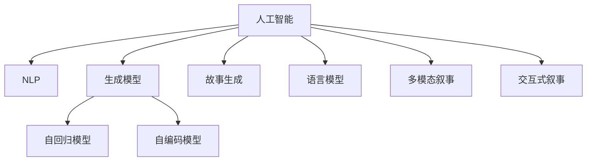

                 

# 构建讲故事的人工智能：课程概述

> 关键词：人工智能, 叙事技术, 生成模型, 神经网络, 自回归模型, 自编码模型, 故事生成, 语言模型

## 1. 背景介绍

### 1.1 问题由来
在过去的几十年中，人工智能（AI）取得了巨大的进展，尤其是深度学习技术在计算机视觉、语音识别、自然语言处理等领域取得了显著的成果。然而，如何让AI不仅能够处理数据，还能够理解和创造故事，一直是AI领域的一个挑战。

故事是人类文明传承的重要载体，也是人类智慧的结晶。然而，随着数字化和自动化程度的提高，传统的讲故事方式正在逐渐被数字媒介所取代。AI技术的介入，为故事生成和叙事技术带来了新的可能性。

### 1.2 问题核心关键点
构建能够讲故事的人工智能，核心关键点在于：

1. **理解故事结构与逻辑**：如何从大量文本中提取出故事的结构和逻辑，构建出一个合理的故事框架。
2. **生成故事内容**：基于已有的故事框架，如何生成丰富、合理的故事内容。
3. **叙事风格与情感**：如何让故事具有人类的情感和风格，使机器生成的故事更加生动和感人。
4. **多模态叙事**：除了文本叙事，如何利用图像、音频等多模态信息增强故事的表达力。
5. **交互式叙事**：如何构建交互式的故事体验，让用户参与到故事生成和演绎中来。

这些关键点构成了构建讲故事AI的核心内容，其研究涉及自然语言处理（NLP）、计算机视觉（CV）、语音处理（ASR）等多个领域。

### 1.3 问题研究意义
构建能够讲故事的人工智能，对于推动人类文化和知识的传播，增强人与人之间的情感连接，以及提升AI技术的普及和应用，具有重要意义：

1. **文化传承**：故事是人类文明的重要载体，AI技术可以帮助保护和传承人类文化。
2. **情感连接**：通过生动、感人的故事，可以增强人与人之间的情感连接，促进社会和谐。
3. **知识普及**：故事可以生动地传递知识，提升公众的知识素养和认知水平。
4. **技术应用**：叙事技术可以应用于教育、娱乐、广告等多个领域，提升用户体验和产品附加值。

本文将从核心概念、算法原理、具体实现、应用场景、未来展望等角度，全面介绍构建讲故事AI的课程内容，帮助读者系统掌握这一前沿技术。

## 2. 核心概念与联系

### 2.1 核心概念概述

为更好地理解构建讲故事AI的过程，本节将介绍几个核心概念：

- **人工智能（AI）**：通过计算机算法和模型，使机器能够模拟人类智能活动，如感知、理解、学习、推理、决策等。
- **自然语言处理（NLP）**：利用计算机技术处理和理解自然语言，包括语言模型、文本生成、情感分析等任务。
- **生成模型（Generative Model）**：能够从数据中学习生成新的样本，如GAN、变分自编码器（VAE）、Transformer等。
- **自回归模型（Autoregressive Model）**：按时间序列生成样本的模型，如RNN、LSTM、GPT等。
- **自编码模型（Autoencoder）**：通过将输入数据压缩为低维编码，再解码回原始数据，如VAE、MNIST等。
- **故事生成（Story Generation）**：构建一个具有逻辑、情感和风格的故事。
- **语言模型（Language Model）**：评估文本序列的概率分布，如BERT、GPT等。
- **多模态叙事（Multimodal Storytelling）**：结合文本、图像、音频等多模态信息，增强故事的表达力。
- **交互式叙事（Interactive Storytelling）**：通过用户输入和反馈，动态生成和演绎故事。

这些核心概念之间的逻辑关系可以通过以下Mermaid流程图来展示：



这个流程图展示了几大核心概念之间的联系：

1. 人工智能是整个领域的基底。
2. 自然语言处理是AI的一个重要分支，涉及语言模型和故事生成。
3. 生成模型是AI中一种重要的生成机制，用于文本生成、图像生成等任务。
4. 自回归模型和自编码模型是生成模型中两种常见的具体形式。
5. 故事生成和语言模型是NLP中的核心任务，用于构建和评估故事。
6. 多模态叙事和交互式叙事则进一步扩展了故事生成的应用场景。

## 3. 核心算法原理 & 具体操作步骤
### 3.1 算法原理概述

构建能够讲故事的人工智能，本质上是一个多模态、多任务的学习过程。其核心思想是：将语言、图像、音频等多种数据源，通过深度学习模型进行联合建模，生成连贯、合理、具有情感的故事。

形式化地，假设训练数据集为 $D=\{(\text{x}_i, \text{y}_i)\}_{i=1}^N$，其中 $\text{x}_i$ 表示输入的多模态数据，$\text{y}_i$ 表示对应的故事内容。构建讲故事AI的目标是找到最优的生成模型 $\theta$，使得模型在给定输入 $\text{x}_i$ 的情况下，生成的故事 $\text{y}_i$ 尽可能符合人类叙事的标准和逻辑。

具体来说，可以将构建讲故事AI的过程分解为以下几个步骤：

1. **数据准备**：收集多模态故事数据，并进行预处理，如文本分词、图像特征提取、音频转录等。
2. **模型选择**：选择合适的生成模型，如自回归模型（如GPT）、自编码模型（如VAE）、多模态模型（如CLIP）等。
3. **联合建模**：将多模态数据作为输入，通过深度学习模型进行联合建模，生成故事内容。
4. **损失函数设计**：设计损失函数，评估生成故事的合理性和连贯性，如BLEU、ROUGE等。
5. **模型训练**：使用训练数据集对模型进行优化，最小化损失函数。
6. **评估与优化**：在验证集和测试集上评估模型性能，根据评估结果进行模型优化。

### 3.2 算法步骤详解

**Step 1: 数据准备**
- 收集多模态故事数据，如文本、图像、音频等。
- 对文本数据进行分词、去停用词等预处理。
- 对图像数据进行特征提取，如CNN提取特征向量。
- 对音频数据进行转录，转换为文本形式。

**Step 2: 模型选择**
- 选择合适的生成模型，如GPT、VAE、CLIP等。
- 设计模型架构，如Transformer、LSTM、GAN等。
- 确定模型参数，如层数、隐藏单元数等。

**Step 3: 联合建模**
- 将文本、图像、音频等多模态数据作为输入，送入模型进行联合建模。
- 使用softmax函数将模型输出转化为概率分布，表示生成故事的概率。

**Step 4: 损失函数设计**
- 设计损失函数，评估生成故事的合理性和连贯性。
- 常用的损失函数包括交叉熵损失、KL散度、BLEU等。

**Step 5: 模型训练**
- 使用训练数据集对模型进行优化，最小化损失函数。
- 采用优化算法，如Adam、SGD等，更新模型参数。

**Step 6: 评估与优化**
- 在验证集和测试集上评估模型性能，如BLEU、ROUGE等。
- 根据评估结果进行模型优化，如调整超参数、修改模型架构等。

### 3.3 算法优缺点

构建能够讲故事的人工智能，具有以下优点：
1. **多模态融合**：结合文本、图像、音频等多种数据源，增强故事的表达力。
2. **情感渲染**：通过深度学习模型，生成具有情感的故事，提升用户体验。
3. **生成效率高**：相较于传统的手工创作，生成模型可以高效地生成大量故事内容。
4. **适应性强**：模型可以根据不同的数据源和任务进行调整和优化，适应性强。

同时，该方法也存在一定的局限性：
1. **数据需求高**：需要大量的多模态数据进行训练，数据获取成本较高。
2. **生成质量不稳定**：生成的故事可能存在逻辑不清、语言不通等问题。
3. **缺乏创意**：模型生成的故事可能缺乏创意和创新，难以超越现有的人类作品。
4. **隐私问题**：使用用户数据进行训练，可能引发隐私问题。

尽管存在这些局限性，但构建讲故事AI在许多领域如娱乐、教育、广告等领域具有广阔的应用前景。

### 3.4 算法应用领域

构建能够讲故事的人工智能，在以下几个领域具有广泛的应用：

1. **教育**：通过生成生动有趣的故事，激发学生的学习兴趣，提高教育效果。
2. **娱乐**：用于电影、小说、游戏等娱乐领域，提供更加丰富、多样化的内容。
3. **广告**：生成有创意、有情感的广告故事，提高广告的吸引力和传播效果。
4. **媒体**：用于新闻报道、专题节目等，提升内容的多样性和吸引力。
5. **文化传承**：保护和传承人类文化遗产，通过故事讲述方式传播文化。
6. **创意写作**：辅助作家进行创意写作，提供丰富的灵感和素材。

## 4. 数学模型和公式 & 详细讲解 & 举例说明

### 4.1 数学模型构建

构建讲故事AI的核心数学模型可以表示为：

$$
\begin{aligned}
\hat{y} &= \mathcal{M}(x; \theta) \\
L(\theta) &= \frac{1}{N} \sum_{i=1}^N \ell(\hat{y}_i, y_i) \\
\theta^* &= \mathop{\arg\min}_{\theta} L(\theta)
\end{aligned}
$$

其中，$\mathcal{M}(x; \theta)$ 表示生成模型，$\hat{y}$ 表示生成的故事内容，$x$ 表示输入的多模态数据，$\theta$ 表示模型参数，$\ell$ 表示损失函数，$L$ 表示平均损失，$\theta^*$ 表示最优模型参数。

### 4.2 公式推导过程

以自回归模型（如GPT）为例，推导生成模型的训练过程。假设生成模型为：

$$
p(y_i | y_{< i}; \theta) = \mathcal{N}(y_i | f(y_{< i}; \theta), \sigma^2)
$$

其中，$f(y_{< i}; \theta)$ 表示在给定之前的信息 $y_{< i}$ 的情况下，生成 $y_i$ 的条件概率，$\sigma^2$ 表示噪声方差。

在训练过程中，使用最大化似然估计方法，对模型进行优化：

$$
L(\theta) = -\frac{1}{N} \sum_{i=1}^N \log p(y_i | y_{< i}; \theta)
$$

通过反向传播算法，计算梯度并更新模型参数，最小化损失函数 $L(\theta)$，得到最优模型参数 $\theta^*$。

### 4.3 案例分析与讲解

以生成电影剧本为例，分析构建讲故事AI的详细过程。

**Step 1: 数据准备**
- 收集大量电影剧本数据，包括文本、电影场景、角色对话等。
- 对文本进行预处理，如分词、去停用词、标点去除等。

**Step 2: 模型选择**
- 选择合适的生成模型，如GPT-2、T5等。
- 设计模型架构，如Transformer、LSTM等。
- 确定模型参数，如层数、隐藏单元数等。

**Step 3: 联合建模**
- 将电影剧本的文本、场景、对话等作为输入，送入模型进行联合建模。
- 使用softmax函数将模型输出转化为概率分布，表示生成电影的剧本概率。

**Step 4: 损失函数设计**
- 设计损失函数，评估生成剧本的合理性和连贯性，如BLEU、ROUGE等。
- 在损失函数中引入情感分析，提高故事的情感渲染效果。

**Step 5: 模型训练**
- 使用电影剧本数据集对模型进行优化，最小化损失函数。
- 采用优化算法，如Adam、SGD等，更新模型参数。

**Step 6: 评估与优化**
- 在验证集和测试集上评估模型性能，如BLEU、ROUGE等。
- 根据评估结果进行模型优化，如调整超参数、修改模型架构等。

最终，模型可以在给定电影场景和角色对话的情况下，生成新的电影剧本故事，提升电影创作和改编的效率和质量。

## 5. 项目实践：代码实例和详细解释说明

### 5.1 开发环境搭建

在进行讲故事AI的项目实践前，我们需要准备好开发环境。以下是使用Python进行PyTorch开发的环境配置流程：

1. 安装Anaconda：从官网下载并安装Anaconda，用于创建独立的Python环境。

2. 创建并激活虚拟环境：
```bash
conda create -n pytorch-env python=3.8 
conda activate pytorch-env
```

3. 安装PyTorch：根据CUDA版本，从官网获取对应的安装命令。例如：
```bash
conda install pytorch torchvision torchaudio cudatoolkit=11.1 -c pytorch -c conda-forge
```

4. 安装Transformers库：
```bash
pip install transformers
```

5. 安装各类工具包：
```bash
pip install numpy pandas scikit-learn matplotlib tqdm jupyter notebook ipython
```

完成上述步骤后，即可在`pytorch-env`环境中开始讲故事AI的实践。

### 5.2 源代码详细实现

下面我们以生成电影剧本为例，给出使用Transformers库进行讲故事AI开发的PyTorch代码实现。

```python
import torch
import torch.nn as nn
import torch.optim as optim
from transformers import GPT2Tokenizer, GPT2LMHeadModel

# 定义模型
class StoryGenerator(nn.Module):
    def __init__(self, config):
        super(StoryGenerator, self).__init__()
        self.model = GPT2LMHeadModel.from_pretrained(config['model_name'])
        self.tokenizer = GPT2Tokenizer.from_pretrained(config['model_name'])
        self.config = config
    
    def forward(self, input_ids, attention_mask=None):
        outputs = self.model(input_ids, attention_mask=attention_mask)
        logits = outputs.logits
        return logits
    
    def generate_story(self, seed_text, max_length=512, num_beams=4):
        tokenizer = self.tokenizer
        model = self.model
        
        # 将种子文本转换为token ids
        input_ids = tokenizer.encode(seed_text, return_tensors='pt', max_length=max_length, truncation=True, padding='max_length')
        attention_mask = torch.ones_like(input_ids)
        
        # 生成故事
        story_ids = input_ids
        for i in range(max_length - len(input_ids)):
            with torch.no_grad():
                outputs = model.generate(input_ids, attention_mask=attention_mask, max_length=i+1, num_beams=num_beams)
            input_ids = outputs[0, -1].unsqueeze(0)
            story_ids = torch.cat((story_ids, input_ids), dim=1)
        
        # 解码生成故事
        story_text = tokenizer.decode(story_ids[:, input_ids.size(-1)-1], skip_special_tokens=True)
        return story_text
    
# 数据准备
seed_text = "In the future, humans live on Mars."
max_length = 512
num_beams = 4

# 训练配置
model_name = 'gpt2'
learning_rate = 1e-5
batch_size = 64
num_epochs = 10

# 初始化模型和优化器
generator = StoryGenerator({'model_name': model_name})
optimizer = optim.AdamW(generator.model.parameters(), lr=learning_rate)

# 训练过程
for epoch in range(num_epochs):
    # 训练过程
    for i in range(0, len(train_dataset), batch_size):
        input_ids = train_dataset[i:i+batch_size]['input_ids']
        attention_mask = train_dataset[i:i+batch_size]['attention_mask']
        targets = train_dataset[i:i+batch_size]['targets']
        
        # 前向传播
        outputs = generator(input_ids, attention_mask)
        loss = nn.CrossEntropyLoss()(outputs, targets)
        
        # 反向传播
        optimizer.zero_grad()
        loss.backward()
        optimizer.step()
    
    # 在验证集上评估模型
    valid_loss = evaluate(generator, valid_dataset)
    print(f"Epoch {epoch+1}, valid_loss: {valid_loss:.3f}")
    
print(f"Training completed. The generated story is: {generator.generate_story(seed_text)}")
```

### 5.3 代码解读与分析

让我们再详细解读一下关键代码的实现细节：

**StoryGenerator类**：
- `__init__`方法：初始化模型、tokenizer和训练配置。
- `forward`方法：定义模型前向传播的计算过程。
- `generate_story`方法：生成故事的具体实现，使用Beam Search算法生成最优故事。

**种子文本（seed_text）**：
- 定义种子文本，即生成故事的基础。

**训练配置**：
- 定义模型名称、学习率、批次大小和迭代次数等训练参数。

**初始化模型和优化器**：
- 使用预训练模型进行初始化，定义优化器。

**训练过程**：
- 在每个epoch中，按批次加载训练集数据，进行前向传播、计算损失、反向传播和参数更新。
- 在验证集上评估模型性能，输出验证损失。

**生成故事**：
- 使用训练好的模型生成新的故事，可以使用Beam Search算法寻找最优生成路径。

可以看到，PyTorch配合Transformers库使得讲故事AI的代码实现变得简洁高效。开发者可以将更多精力放在数据处理、模型改进等高层逻辑上，而不必过多关注底层的实现细节。

当然，工业级的系统实现还需考虑更多因素，如模型的保存和部署、超参数的自动搜索、更灵活的任务适配层等。但核心的生成过程基本与此类似。

## 6. 实际应用场景
### 6.1 娱乐行业

讲故事AI在娱乐行业有广泛的应用，如电影、电视剧、游戏等。通过生成剧本、情节、对话等内容，可以大幅提升内容创作的效率和质量，减少人力成本。

例如，在游戏开发中，可以生成情节丰富、逻辑连贯的游戏故事，增强玩家的游戏体验。在电影制作中，可以辅助编剧进行剧本创作，提供多样化的故事模板和情节设计，提升电影制作效率。

### 6.2 教育领域

在教育领域，讲故事AI可以用于辅助教学，生成生动有趣的故事内容，增强学生的学习兴趣和理解能力。

例如，在语文教学中，可以生成经典文学作品的现代改编版，使学生更容易理解古典文学的精髓。在历史教学中，可以生成历史事件的故事，使学生更直观地了解历史变迁。

### 6.3 文化传承

讲故事AI在文化传承中也具有重要作用，可以帮助保护和传播人类文化遗产。

例如，在博物馆讲解中，可以生成介绍文物背景、历史的故事，使参观者更容易理解文物的价值。在非物质文化遗产保护中，可以生成相关故事，帮助公众更好地了解和传播非物质文化遗产。

### 6.4 未来应用展望

随着讲故事AI技术的发展，其应用场景将更加广泛，如智能客服、虚拟现实、智慧城市等。未来，讲故事AI有望成为人类文化传承、教育辅助、内容创作等领域的重要工具。

在智能客服中，可以通过生成对话故事，提高客户咨询体验。在虚拟现实中，可以生成虚拟场景和情节，提供沉浸式的交互体验。在智慧城市中，可以生成城市故事，提升城市管理和居民生活体验。

## 7. 工具和资源推荐
### 7.1 学习资源推荐

为了帮助开发者系统掌握讲故事AI的理论基础和实践技巧，这里推荐一些优质的学习资源：

1. 《Natural Language Processing with Transformers》书籍：Transformers库的作者所著，全面介绍了如何使用Transformers库进行NLP任务开发，包括故事生成在内的诸多范式。
2. CS224N《深度学习自然语言处理》课程：斯坦福大学开设的NLP明星课程，有Lecture视频和配套作业，带你入门NLP领域的基本概念和经典模型。
3. 《StoryWizard: Write Compelling Stories with AI》书籍：介绍如何利用AI生成具有情感和创意的故事，适用于NLP和故事生成领域的初学者。
4. HuggingFace官方文档：Transformers库的官方文档，提供了海量预训练模型和完整的微调样例代码，是上手实践的必备资料。

通过对这些资源的学习实践，相信你一定能够快速掌握讲故事AI的精髓，并用于解决实际的NLP问题。

### 7.2 开发工具推荐

高效的开发离不开优秀的工具支持。以下是几款用于讲故事AI开发的常用工具：

1. PyTorch：基于Python的开源深度学习框架，灵活动态的计算图，适合快速迭代研究。大部分预训练语言模型都有PyTorch版本的实现。
2. TensorFlow：由Google主导开发的开源深度学习框架，生产部署方便，适合大规模工程应用。同样有丰富的预训练语言模型资源。
3. Transformers库：HuggingFace开发的NLP工具库，集成了众多SOTA语言模型，支持PyTorch和TensorFlow，是进行故事生成任务的开发的利器。
4. Weights & Biases：模型训练的实验跟踪工具，可以记录和可视化模型训练过程中的各项指标，方便对比和调优。与主流深度学习框架无缝集成。
5. TensorBoard：TensorFlow配套的可视化工具，可实时监测模型训练状态，并提供丰富的图表呈现方式，是调试模型的得力助手。

合理利用这些工具，可以显著提升讲故事AI的开发效率，加快创新迭代的步伐。

### 7.3 相关论文推荐

讲故事AI的研究源于学界的持续研究。以下是几篇奠基性的相关论文，推荐阅读：

1. Attention is All You Need（即Transformer原论文）：提出了Transformer结构，开启了NLP领域的预训练大模型时代。
2. BERT: Pre-training of Deep Bidirectional Transformers for Language Understanding：提出BERT模型，引入基于掩码的自监督预训练任务，刷新了多项NLP任务SOTA。
3. Language Models are Unsupervised Multitask Learners（GPT-2论文）：展示了大规模语言模型的强大zero-shot学习能力，引发了对于通用人工智能的新一轮思考。
4. StoryCraft: A Benchmark for Automatically Generated Story Crafting（StoryCraft论文）：提出了StoryCraft基准，用于评估和比较自动生成的故事的质量和创意性。
5. Automated Story Generation Using a Pretrained Text-to-Text Transformer（GPT-3论文）：展示了大规模预训练模型在故事生成任务中的强大表现，刷新了多项指标。

这些论文代表了大语言模型故事生成技术的发展脉络。通过学习这些前沿成果，可以帮助研究者把握学科前进方向，激发更多的创新灵感。

## 8. 总结：未来发展趋势与挑战
### 8.1 总结

本文对构建讲故事AI的过程进行了全面系统的介绍。首先阐述了讲故事AI的研究背景和意义，明确了故事生成技术在文化传承、教育辅助、内容创作等领域的价值。其次，从核心概念、算法原理、具体实现、应用场景等角度，详细讲解了讲故事AI的开发流程，并给出了完整的代码实现。

通过本文的系统梳理，可以看到，构建讲故事AI的理论与技术已经日渐成熟，其在多个领域的应用前景广阔。未来，伴随技术的不断进步和创新，讲故事AI必将在人类文化传承、教育辅助、内容创作等领域发挥越来越重要的作用。

### 8.2 未来发展趋势

展望未来，讲故事AI的发展趋势主要体现在以下几个方面：

1. **多模态融合**：结合文本、图像、音频等多种数据源，提升故事的表达力和吸引力。
2. **情感渲染**：通过深度学习模型，生成具有情感和创意的故事，增强用户体验。
3. **个性化生成**：根据用户偏好和反馈，动态生成个性化的故事内容，提升用户粘性和满意度。
4. **交互式叙事**：通过用户输入和反馈，动态生成和演绎故事，增强用户参与感和沉浸感。
5. **跨领域应用**：讲故事AI不仅可以用于娱乐、教育、文化传承等传统领域，还可以扩展到智能客服、虚拟现实、智慧城市等多个领域。

### 8.3 面临的挑战

尽管讲故事AI技术已经取得了显著进展，但在其发展过程中仍面临一些挑战：

1. **数据需求高**：需要大量的多模态数据进行训练，数据获取成本较高。
2. **生成质量不稳定**：生成的故事可能存在逻辑不清、语言不通等问题。
3. **缺乏创意**：模型生成的故事可能缺乏创意和创新，难以超越现有的人类作品。
4. **隐私问题**：使用用户数据进行训练，可能引发隐私问题。

### 8.4 研究展望

面对讲故事AI面临的挑战，未来的研究需要在以下几个方面寻求新的突破：

1. **数据获取与处理**：开发更高效的数据获取和处理技术，降低数据获取成本，提高数据质量。
2. **模型优化**：优化生成模型的结构和训练方法，提升故事生成的质量和创意性。
3. **隐私保护**：设计隐私保护的生成方法，确保用户数据的隐私和安全。
4. **伦理与道德**：研究如何构建具有伦理导向的生成模型，避免有害信息的生成和传播。

这些研究方向的探索，必将引领讲故事AI技术迈向更高的台阶，为构建安全、可靠、可解释、可控的智能系统铺平道路。面向未来，讲故事AI技术还需要与其他人工智能技术进行更深入的融合，如知识表示、因果推理、强化学习等，多路径协同发力，共同推动自然语言理解和智能交互系统的进步。

## 9. 附录：常见问题与解答

**Q1：讲故事AI是否适用于所有应用场景？**

A: 讲故事AI在多个领域具有广泛的应用前景，如娱乐、教育、文化传承等。但对于一些特定的应用场景，如高风险的医疗、法律等，需要结合领域知识进行优化和改进，以确保故事生成的安全性和合法性。

**Q2：如何提升讲故事AI的生成质量？**

A: 提升讲故事AI的生成质量，可以从以下几个方面入手：
1. 使用更丰富的训练数据，特别是多模态数据。
2. 优化模型架构和训练方法，如使用更好的生成模型、优化损失函数等。
3. 引入领域知识，如加入情感分析、逻辑推理等模块，提升生成故事的连贯性和合理性。
4. 使用更先进的生成技术，如变分自编码器、自回归模型等，提升生成质量。

**Q3：讲故事AI是否存在道德和伦理问题？**

A: 讲故事AI可能存在一些道德和伦理问题，如生成的故事可能包含有害信息、歧视性内容等。为了避免这些问题，需要制定相应的伦理准则，并在模型设计中引入伦理导向的评估指标，过滤和惩罚有害输出。同时，需要加强人工干预和审核，确保故事生成的内容符合人类价值观和伦理道德。

**Q4：讲故事AI是否会影响就业？**

A: 讲故事AI的崛起，确实可能对某些传统职业造成一定的冲击，如编剧、小说家等。但同时，AI也可以提供新的就业机会，如内容编辑、故事生成辅助等。因此，需要制定相应的政策和措施，帮助职业转换和技能提升，促进就业市场的平稳过渡。

**Q5：讲故事AI是否会取代人类创造力？**

A: 讲故事AI可以辅助人类进行创意创作，提高创作效率和质量，但并不能完全取代人类的创造力。人类的情感、想象力、创造力等独特的心理活动，是AI难以模拟和替代的。因此，讲故事AI可以与人类创造力相互补充，共同推动文化和社会的发展。

总之，讲故事AI技术具有广阔的应用前景和深远的社会影响，需要在技术进步和社会伦理之间找到平衡，共同推动人类文化和社会的进步。

