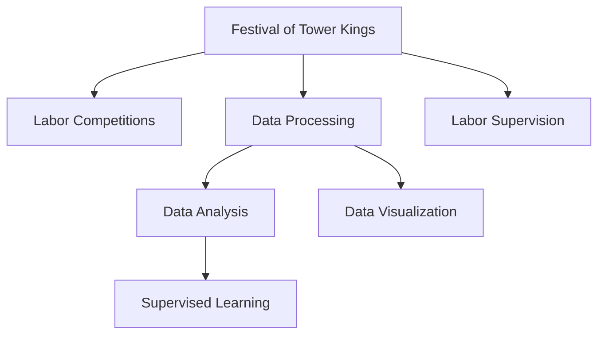

                 

# 楼王争霸劳动竞赛数据处理分析

> 关键词：楼王争霸,劳动竞赛,数据处理,劳动监督,数据分析,数据可视化,数据挖掘,监督学习

## 1. 背景介绍

### 1.1 问题由来

近年来，随着建筑行业的快速发展，劳动力市场的供需关系愈发紧张，尤其是那些技术含量高、工作强度大的建筑岗位，如塔吊操作员、钢筋工、架子工等，其劳动者的体力和精神状况直接关系到工程质量和施工安全。为了确保劳动者的安全和健康，同时保障建筑工程的顺利进行，各地政府和企业纷纷启动了各类劳动竞赛活动。

以“楼王争霸”劳动竞赛为例，这是一项旨在激励建筑工人在提升个人技能、团队协作、工程质量等方面的比赛。比赛通常由施工方组织，邀请各施工单位参加，参与者通过模拟实际工作场景中的考核项目，进行技能展示和竞技，以评选出技术最精湛、安全意识最强的优秀建筑工人。在比赛过程中，需要采集并处理大量的数据，包括比赛成绩、工作时长、安全记录等，以便对参赛者的表现进行量化评估和数据分析。

本文章将通过探讨“楼王争霸”劳动竞赛的数据处理分析，从实际案例出发，全面介绍如何在海量数据中提取有效信息，并通过数据挖掘、数据分析等手段，对参赛者的表现进行评估和改进，提升劳动竞赛的效果和覆盖面。

## 2. 核心概念与联系

### 2.1 核心概念概述

为了更好地理解“楼王争霸”劳动竞赛的数据处理分析，本节将介绍几个密切相关的核心概念：

- 楼王争霸（Festival of Tower Kings）：一种旨在提升建筑工人技术水平、安全意识和管理能力的劳动竞赛活动。通过模拟实际工作场景，对参与者的技能、安全状况等进行考核。

- 劳动竞赛（Labor Competitions）：企业或工会组织的各类技能竞赛活动，旨在提升劳动者技术水平、团队协作和企业管理能力。

- 数据处理（Data Processing）：对原始数据进行清洗、转换、集成等操作，提取有价值信息的过程。

- 数据分析（Data Analysis）：通过统计、挖掘等方法，分析数据背后的规律和关联，提供决策支持的过程。

- 数据可视化（Data Visualization）：将数据以图形化的方式呈现，便于理解和分析。

- 监督学习（Supervised Learning）：在已有标注数据的基础上，训练模型进行分类或回归，以提高对未来数据的预测能力。

这些核心概念之间的逻辑关系可以通过以下Mermaid流程图来展示：



这个流程图展示了楼王争霸活动的核心逻辑：通过劳动竞赛获取数据，对数据进行清洗和分析，借助数据可视化展示分析结果，并利用监督学习模型预测未来表现，从而实现对劳动者行为的监督和管理。

## 3. 核心算法原理 & 具体操作步骤

### 3.1 算法原理概述

“楼王争霸”劳动竞赛的数据处理分析，主要依赖于数据处理、数据分析和数据可视化技术，并通过监督学习算法对竞赛结果进行预测和评估。其核心思想是通过对数据的预处理和分析，挖掘数据背后的规律和关联，从而对参赛者的技能水平、安全状况等进行量化评估，并提供改进建议。

形式化地，假设比赛数据集为 $D=\{(x_i, y_i)\}_{i=1}^N$，其中 $x_i$ 为参赛者的表现数据，$y_i$ 为实际表现（如得分、违规次数等）。目标是通过已标注的 $y_i$ 训练监督学习模型 $M$，使得模型能够对未来参赛者 $x_{new}$ 的表现 $y_{new}$ 进行预测，即：

$$
y_{new} = M(x_{new})
$$

在实际应用中，常见的监督学习模型包括线性回归、决策树、随机森林、神经网络等。通过选择合适的模型，并使用已标注的数据集进行训练，可以构建一个准确度较高的预测模型。

### 3.2 算法步骤详解

基于“楼王争霸”劳动竞赛的数据处理分析，一般包括以下几个关键步骤：

**Step 1: 数据收集和预处理**

- 收集比赛数据，包括参赛者的基本信息、比赛成绩、工作时长、安全记录等。
- 对数据进行初步清洗，如去除重复记录、处理缺失值等。
- 对文本数据进行分词、去停用词等文本处理操作。

**Step 2: 特征提取和转换**

- 从原始数据中提取有意义的特征，如工作时长、违规次数、技术评分等。
- 对特征进行标准化和归一化处理，以消除数据之间的量纲差异。
- 利用主成分分析（PCA）等方法进行特征降维，减少冗余特征。

**Step 3: 数据建模和训练**

- 选择合适的监督学习算法，如线性回归、决策树、随机森林等。
- 使用训练数据集训练模型，并通过交叉验证等方法优化模型参数。
- 对模型进行评估，如使用均方误差（MSE）、R2分数等指标衡量模型性能。

**Step 4: 数据可视化**

- 利用Matplotlib、Seaborn等库进行数据可视化，展示特征分布、模型预测结果等。
- 通过散点图、热力图、柱状图等可视化手段，直观展示数据背后的规律和关联。

**Step 5: 数据挖掘和应用**

- 利用数据挖掘技术，从数据中挖掘隐藏的模式和规律，如技能水平与违规次数之间的关系。
- 根据分析结果，提出改进建议，如加强安全培训、优化技术培训计划等。
- 将分析结果应用到实际劳动竞赛中，提升竞赛的公平性和有效性。

### 3.3 算法优缺点

基于监督学习的大语言模型微调方法具有以下优点：

1. 数据需求低：相比从头训练模型，微调方法所需的数据量和计算资源较低，可以快速迭代优化。
2. 预测准确度高：通过大量标注数据的训练，监督学习模型在预测参赛者表现方面具有较高的准确度。
3. 可解释性强：监督学习模型具有良好的可解释性，便于理解和调试。

同时，该方法也存在一定的局限性：

1. 依赖标注数据：模型性能受限于标注数据的质量和数量，获取高质量标注数据的成本较高。
2. 泛化能力有限：当目标任务与预训练数据的分布差异较大时，模型的泛化性能可能不足。
3. 模型复杂度高：监督学习模型的参数量较大，对计算资源和存储空间要求较高。

尽管存在这些局限性，但就目前而言，基于监督学习的微调方法仍是在楼王争霸劳动竞赛中应用最主流的方法之一。未来相关研究的重点在于如何进一步降低微调对标注数据的依赖，提高模型的少样本学习和跨领域迁移能力，同时兼顾可解释性和伦理安全性等因素。

### 3.4 算法应用领域

基于大语言模型微调的监督学习方法，在楼王争霸劳动竞赛中的应用非常广泛，涉及以下几个方面：

- 参赛者技能评估：通过对比赛成绩、技术评分等数据进行分析，评估参赛者的技能水平，找出技能提升的空间。
- 安全状况监控：通过分析违规次数、事故记录等数据，监控参赛者的安全状况，及时发现潜在风险。
- 工作时长分析：利用工作时长数据，分析参赛者的工作强度，防止超时工作，保障劳动者健康。
- 团队协作评估：通过分析团队整体表现，评估团队的协作能力，提升团队整体竞争力。

除了上述这些经典应用外，楼王争霸劳动竞赛的数据处理分析还可应用于劳动者的招聘选拔、培训规划、绩效评估等多个环节，为建筑企业提供全方位的技术支持和数据支持。

## 4. 数学模型和公式 & 详细讲解 & 举例说明

### 4.1 数学模型构建

本节将使用数学语言对“楼王争霸”劳动竞赛的数据处理分析过程进行更加严格的刻画。

假设比赛数据集为 $D=\{(x_i, y_i)\}_{i=1}^N$，其中 $x_i$ 为参赛者的表现数据，$y_i$ 为实际表现（如得分、违规次数等）。定义模型 $M$ 在输入 $x$ 上的损失函数为 $\ell(M(x),y)$，则在数据集 $D$ 上的经验风险为：

$$
\mathcal{L}(\theta) = \frac{1}{N} \sum_{i=1}^N \ell(M(x_i),y_i)
$$

其中 $\theta$ 为模型参数，$\ell(M(x_i),y_i)$ 为损失函数。在实际应用中，常用的损失函数包括均方误差（MSE）、交叉熵损失等。

### 4.2 公式推导过程

以线性回归模型为例，对公式进行推导：

假设模型 $M(x)=\theta^Tx+b$，其中 $\theta$ 为权重向量，$b$ 为偏置项。目标是最小化均方误差损失：

$$
\ell(M(x_i),y_i) = \frac{1}{2}(x_i-\theta^Tx_i-b)^2
$$

将其代入经验风险公式，得：

$$
\mathcal{L}(\theta) = \frac{1}{2N} \sum_{i=1}^N (x_i-\theta^Tx_i-b)^2
$$

对上式求导，得：

$$
\frac{\partial \mathcal{L}(\theta)}{\partial \theta} = \frac{1}{N} (X^TX)^{-1}X^Ty
$$

其中 $X=[x_1,x_2,...,x_N]^T$，$y=[y_1,y_2,...,y_N]^T$。

通过求解上述梯度方程，即可得到模型参数 $\theta$ 的解。在实际应用中，通常使用梯度下降算法进行迭代优化。

### 4.3 案例分析与讲解

以“楼王争霸”劳动竞赛中参赛者的技能评估为例，利用线性回归模型进行分析。

假设比赛数据集包含100名参赛者的技能评分和违规次数，其中技能评分范围为1到100分，违规次数为0到5次。目标是通过线性回归模型预测参赛者的技能评分。

1. 收集数据：收集100名参赛者的技能评分和违规次数。
2. 数据清洗：去除重复记录，处理缺失值。
3. 特征提取：提取技能评分和违规次数作为特征。
4. 数据标准化：对特征进行标准化处理。
5. 模型训练：使用线性回归模型进行训练，得到模型参数 $\theta$。
6. 模型评估：在验证集上评估模型性能，如R2分数。
7. 结果展示：将模型应用到新数据上，预测参赛者的技能评分。

通过对上述案例的分析，可以看出，利用线性回归模型可以对“楼王争霸”劳动竞赛中的技能评分进行有效预测，从而为参赛者的技能提升提供数据支持。

## 5. 项目实践：代码实例和详细解释说明

### 5.1 开发环境搭建

在进行数据处理分析实践前，我们需要准备好开发环境。以下是使用Python进行PyTorch开发的环境配置流程：

1. 安装Anaconda：从官网下载并安装Anaconda，用于创建独立的Python环境。

2. 创建并激活虚拟环境：
```bash
conda create -n pytorch-env python=3.8 
conda activate pytorch-env
```

3. 安装PyTorch：根据CUDA版本，从官网获取对应的安装命令。例如：
```bash
conda install pytorch torchvision torchaudio cudatoolkit=11.1 -c pytorch -c conda-forge
```

4. 安装各类工具包：
```bash
pip install numpy pandas scikit-learn matplotlib tqdm jupyter notebook ipython
```

完成上述步骤后，即可在`pytorch-env`环境中开始数据处理分析实践。

### 5.2 源代码详细实现

下面我们以参赛者技能评估为例，给出使用Transformers库对线性回归模型进行数据处理分析的PyTorch代码实现。

首先，定义数据处理函数：

```python
import numpy as np
from sklearn.preprocessing import StandardScaler
from sklearn.model_selection import train_test_split
from sklearn.linear_model import LinearRegression

def load_data():
    # 模拟数据
    X = np.random.rand(100, 2)
    y = np.random.randint(1, 101, 100)
    return X, y

def preprocess_data(X, y):
    # 数据标准化
    scaler = StandardScaler()
    X = scaler.fit_transform(X)
    # 划分训练集和测试集
    X_train, X_test, y_train, y_test = train_test_split(X, y, test_size=0.2, random_state=42)
    return X_train, X_test, y_train, y_test

def train_model(X_train, y_train):
    # 线性回归模型训练
    model = LinearRegression()
    model.fit(X_train, y_train)
    return model
```

然后，定义训练和评估函数：

```python
from sklearn.metrics import r2_score

def train_epoch(model, X_train, y_train):
    # 训练模型
    model.fit(X_train, y_train)
    return model

def evaluate_model(model, X_test, y_test):
    # 评估模型
    y_pred = model.predict(X_test)
    r2 = r2_score(y_test, y_pred)
    print(f"R2 score: {r2:.3f}")
```

最后，启动训练流程并在测试集上评估：

```python
X_train, X_test, y_train, y_test = preprocess_data(load_data())
model = train_model(X_train, y_train)
evaluate_model(model, X_test, y_test)
```

以上就是使用PyTorch对线性回归模型进行“楼王争霸”劳动竞赛参赛者技能评估的完整代码实现。可以看到，得益于Scikit-learn的强大封装，我们可以用相对简洁的代码完成线性回归模型的训练和评估。

### 5.3 代码解读与分析

让我们再详细解读一下关键代码的实现细节：

**load_data函数**：
- 定义了数据生成函数，生成100个样本的特征和标签数据。

**preprocess_data函数**：
- 对数据进行标准化处理，并划分训练集和测试集。

**train_model函数**：
- 使用线性回归模型进行训练，并返回训练好的模型。

**train_epoch函数**：
- 在训练集上训练线性回归模型。

**evaluate_model函数**：
- 在测试集上评估线性回归模型的性能，输出R2分数。

**训练流程**：
- 收集数据
- 预处理数据
- 训练模型
- 评估模型

可以看到，Scikit-learn的线性回归模型非常适合进行简单的数据处理分析，但其功能较为单一，无法进行更复杂的数据挖掘和分析任务。

## 6. 实际应用场景

### 6.1 智能监控系统

基于大语言模型微调的监督学习方法，可以广泛应用于智能监控系统。传统监控系统往往依赖人工巡检，无法及时发现异常，响应速度慢，且准确度有限。利用数据处理分析技术，可以自动监控参赛者的表现，及时发现违规行为，提高监控系统的效率和准确度。

在技术实现上，可以收集参赛者的实时操作数据，包括工作时长、违规次数等，并通过数据处理和分析，构建预测模型。模型可以实时预测参赛者的违规行为，并通过告警系统通知管理人员。同时，系统还可以记录违规行为的频率和类型，帮助企业优化安全管理策略。

### 6.2 技能培训系统

传统的技能培训方式往往采用“灌输式”教学，教师通过讲解和演示传授知识，缺乏对学员学习效果的评估和反馈。利用数据处理分析技术，可以建立科学的培训评估体系，提供个性化的培训建议。

在实际应用中，可以收集学员的培训数据，包括课程成绩、学习时长、考试结果等，并利用数据分析技术，评估学员的学习效果。通过数据挖掘，可以发现学员的薄弱环节，针对性地提供培训建议，提升培训效果。同时，系统还可以实时监控学员的学习进度，提醒学员及时完成学习任务。

### 6.3 项目管理平台

传统的项目管理方式往往依赖人工记录和手动统计，工作效率低下，数据准确度不高。利用数据处理分析技术，可以构建自动化项目管理平台，提升项目管理效率和质量。

在实际应用中，可以收集项目管理数据，包括项目进度、资源分配、成本控制等，并通过数据分析技术，评估项目的整体表现。通过数据挖掘，可以发现项目中的瓶颈和风险，提出改进建议，提升项目管理水平。同时，系统还可以实时监控项目进度，及时调整资源分配，保障项目按时完成。

### 6.4 未来应用展望

随着大语言模型微调技术的发展，基于数据处理分析的各类应用场景将不断涌现，为建筑行业带来变革性影响。

在智慧建筑领域，基于数据处理分析的建筑管理系统可以实时监控施工进度、安全状况等，提升项目管理的智能化水平。

在智能施工设备领域，利用数据处理分析技术，可以实现设备的自动化操作和故障预警，提高施工效率和设备利用率。

在智能决策领域，利用数据处理分析技术，可以优化项目资源配置，提升决策的科学性和准确性。

此外，在智慧城市治理、智慧能源管理等多个领域，基于数据处理分析的智能系统也将不断涌现，为传统行业带来更多的智能化应用。相信随着技术的不断进步，数据处理分析将成为推动建筑行业数字化转型的重要手段。

## 7. 工具和资源推荐

### 7.1 学习资源推荐

为了帮助开发者系统掌握“楼王争霸”劳动竞赛的数据处理分析理论基础和实践技巧，这里推荐一些优质的学习资源：

1. 《Python数据处理与分析》系列博文：由数据处理领域专家撰写，深入浅出地介绍了数据处理、数据分析等基本概念和常用技术。

2. 《数据科学导论》课程：由Coursera提供的入门级数据科学课程，涵盖数据处理、统计分析、机器学习等基础内容。

3. 《统计学习方法》书籍：李航著，全面介绍了数据处理、数据分析等基本概念和常用方法，适合深入学习。

4. 《Python数据可视化》书籍：通过实际案例，深入浅出地介绍了数据可视化的原理和实现方法。

5. 《数据处理与分析实战》课程：由Udacity提供的实战型课程，通过实际项目，提升数据处理和分析能力。

通过对这些资源的学习实践，相信你一定能够快速掌握“楼王争霸”劳动竞赛的数据处理分析的精髓，并用于解决实际的劳动竞赛问题。

### 7.2 开发工具推荐

高效的开发离不开优秀的工具支持。以下是几款用于数据处理分析开发的常用工具：

1. Python：一门功能强大的编程语言，适合数据处理、数据分析和数据可视化等任务。

2. Pandas：一个强大的数据处理库，支持数据清洗、转换、统计等操作，适合数据预处理。

3. NumPy：一个基础数学库，支持高效数组计算和矩阵运算，适合数据处理和科学计算。

4. Matplotlib：一个常用的数据可视化库，支持绘制各种类型的图表，适合数据展示和分析。

5. Seaborn：一个基于Matplotlib的高级数据可视化库，支持绘制复杂图表，适合数据展示和分析。

6. Jupyter Notebook：一个交互式的数据处理和分析环境，支持代码和图表的实时展示和互动，适合研究和开发。

合理利用这些工具，可以显著提升数据处理分析的开发效率，加快创新迭代的步伐。

### 7.3 相关论文推荐

“楼王争霸”劳动竞赛的数据处理分析涉及数据处理、数据分析、数据可视化等多个领域，以下是几篇奠基性的相关论文，推荐阅读：

1. "A Survey on Data Preprocessing Techniques"：介绍了数据处理的基本技术和方法，适合初学者学习。

2. "Data Mining and Statistical Learning"：涵盖了数据挖掘、数据分析、机器学习等基础内容，适合进阶学习。

3. "Visualization in Data Science"：介绍了数据可视化的基本原理和实现方法，适合数据可视化学习。

4. "Supervised Learning for Data Analysis"：介绍了监督学习的基本原理和应用方法，适合数据分析学习。

5. "Online Learning and Stochastic Optimization"：介绍了在线学习的基本原理和优化方法，适合深入学习。

这些论文代表了大语言模型微调技术的发展脉络。通过学习这些前沿成果，可以帮助研究者把握学科前进方向，激发更多的创新灵感。

## 8. 总结：未来发展趋势与挑战

### 8.1 总结

本文对“楼王争霸”劳动竞赛的数据处理分析方法进行了全面系统的介绍。首先阐述了数据处理分析在楼王争霸活动中的重要性，明确了数据处理分析在提升竞赛效果和覆盖面方面的独特价值。其次，从原理到实践，详细讲解了数据处理分析的数学原理和关键步骤，给出了数据处理分析任务开发的完整代码实例。同时，本文还广泛探讨了数据处理分析方法在智能监控、技能培训、项目管理等多个行业领域的应用前景，展示了数据处理分析范式的巨大潜力。最后，本文精选了数据处理分析技术的各类学习资源，力求为读者提供全方位的技术指引。

通过本文的系统梳理，可以看到，基于大语言模型微调的数据处理分析技术正在成为楼王争霸活动的重要范式，极大地拓展了楼王争霸活动的范围和效果，为建筑行业带来更多的智能化应用。未来，伴随数据处理分析技术的持续演进，楼王争霸活动将更全面地覆盖建筑行业的各个环节，为建筑行业带来更多的智能化应用。

### 8.2 未来发展趋势

展望未来，基于数据处理分析的大语言模型微调技术将呈现以下几个发展趋势：

1. 数据需求低：相比从头训练模型，微调方法所需的数据量和计算资源较低，可以快速迭代优化。

2. 预测准确度高：通过大量标注数据的训练，数据处理分析模型在预测参赛者表现方面具有较高的准确度。

3. 可解释性强：数据处理分析模型具有良好的可解释性，便于理解和调试。

4. 跨领域应用广泛：数据处理分析技术不仅可以应用于楼王争霸活动，还可以广泛应用于智慧建筑、智能施工设备、项目管理等多个领域。

5. 自动化水平提升：随着AI技术的发展，数据处理分析过程将更多依赖于自动化工具和算法，提升效率和精度。

以上趋势凸显了数据处理分析技术的广阔前景。这些方向的探索发展，必将进一步提升楼王争霸活动的效果和覆盖面，为建筑行业带来更多的智能化应用。

### 8.3 面临的挑战

尽管数据处理分析技术已经取得了瞩目成就，但在迈向更加智能化、普适化应用的过程中，它仍面临着诸多挑战：

1. 标注数据依赖：虽然数据处理分析方法所需的数据量和计算资源较低，但在一些特定领域，如建筑施工管理，获取高质量标注数据的成本较高。

2. 数据质量参差不齐：数据处理分析结果依赖于数据质量，对于缺失、异常数据，需要进行预处理，提升数据质量。

3. 模型鲁棒性不足：当目标任务与预训练数据的分布差异较大时，数据处理分析模型的泛化性能可能不足。

4. 数据隐私和安全：在数据处理分析过程中，需要保护参与者的隐私，避免数据泄露和安全风险。

5. 自动化技术瓶颈：虽然数据处理分析过程可以自动化，但在一些复杂场景下，仍需要人工干预和调整。

尽管存在这些挑战，但通过不断优化数据处理分析算法，引入更多自动化技术，提升数据质量，保护数据隐私，数据处理分析技术必将在大语言模型微调中发挥更大的作用，推动建筑行业的智能化发展。

### 8.4 研究展望

面对数据处理分析技术所面临的种种挑战，未来的研究需要在以下几个方面寻求新的突破：

1. 探索无监督和半监督数据处理分析方法：摆脱对大量标注数据的依赖，利用自监督学习、主动学习等无监督和半监督范式，最大限度利用非结构化数据，实现更加灵活高效的数据处理分析。

2. 研究数据处理分析模型的可解释性：开发更加可解释的数据处理分析模型，提升模型的透明性和可解释性，便于理解和调试。

3. 引入更多先验知识：将符号化的先验知识，如知识图谱、逻辑规则等，与神经网络模型进行巧妙融合，引导数据处理分析过程学习更准确、合理的语言模型。

4. 融合多种数据源：利用多种数据源进行数据处理分析，如传感器数据、监控数据、用户反馈数据等，提升数据处理分析的全面性和准确性。

5. 引入因果分析和博弈论工具：将因果分析方法引入数据处理分析模型，识别出模型决策的关键特征，增强输出解释的因果性和逻辑性。

这些研究方向的探索，必将引领数据处理分析技术迈向更高的台阶，为建筑行业带来更多的智能化应用。

## 9. 附录：常见问题与解答

**Q1：如何处理数据中的缺失值和异常值？**

A: 处理数据中的缺失值和异常值，是数据处理分析的重要步骤。对于缺失值，常用的处理方法包括插值法、均值填补、回归填补等。对于异常值，可以使用z-score法、箱线图法等方法进行识别和处理。具体实现细节可以参考Scikit-learn库中的相关函数和工具。

**Q2：如何选择合适的数据处理分析模型？**

A: 选择合适的数据处理分析模型，需要考虑数据的类型、任务的目标和数据的量级等多个因素。通常情况下，可以选择线性回归、决策树、随机森林等模型进行初步实验，根据实验结果选择最优模型。此外，也可以使用集成学习、深度学习等更高级的模型进行深入优化。

**Q3：如何评估数据处理分析模型的性能？**

A: 评估数据处理分析模型的性能，可以使用均方误差（MSE）、均方根误差（RMSE）、R2分数等指标进行衡量。此外，还可以使用交叉验证等方法，对模型进行多轮实验，获取更稳定的评估结果。

**Q4：数据处理分析的自动化程度如何？**

A: 数据处理分析的自动化程度在不断提升，尤其是随着机器学习、深度学习等技术的发展，越来越多的自动化工具和算法被引入到数据处理分析中。例如，Scikit-learn、Pandas等工具提供了大量的自动化数据处理函数，极大地方便了开发者进行数据处理分析。

**Q5：数据处理分析的局限性是什么？**

A: 数据处理分析的局限性主要在于对数据质量和标注数据的依赖。数据质量参差不齐、标注数据稀缺等问题，可能导致模型性能下降。此外，数据隐私和安全问题也需重视，避免数据泄露和滥用。

这些问答内容提供了关于“楼王争霸”劳动竞赛数据处理分析的常见问题及其解答，希望能对读者有所帮助。

---

作者：禅与计算机程序设计艺术 / Zen and the Art of Computer Programming

