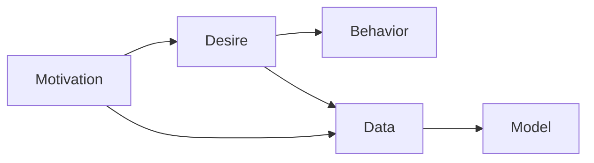
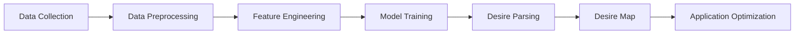

                 

## 1. 背景介绍

### 1.1 问题由来

在人类社会中，欲望是一个永恒的主题，驱动着人们的行为和决策。从经济学的需求曲线到心理学的人格特质，欲望在多个学科中都被广泛研究和讨论。近年来，随着人工智能技术的发展，尤其是深度学习和大数据的应用，研究者们开始尝试使用AI技术解析人类动机，绘制欲望地图。

这一趋势在学术界和工业界都引起了广泛的关注。例如，Google DeepMind的AlphaGo就利用AI解析了人类围棋棋手的动机，并成功战胜了人类顶尖棋手。在商业领域，许多公司利用AI分析消费者行为，预测市场趋势，优化产品设计。

本文将深入探讨如何利用AI技术绘制欲望地图，解析人类动机，并探讨其潜在的商业和学术价值。我们将从核心概念和算法原理入手，逐步深入到具体的操作和应用领域。

### 1.2 问题核心关键点

绘制欲望地图，解析人类动机的核心在于从海量数据中挖掘出隐藏的动机模式。具体而言，需要完成以下几个关键步骤：

1. **数据收集**：获取用户的行为数据，如搜索记录、购买历史、社交媒体活动等。
2. **数据预处理**：对数据进行清洗和标准化，去除噪声和异常值。
3. **特征工程**：提取和构建反映用户动机的特征，如兴趣点、情感倾向、行为模式等。
4. **模型训练**：选择合适的AI模型，如神经网络、决策树、聚类算法等，训练出能够预测用户动机的模型。
5. **动机解析**：利用训练好的模型解析用户动机，绘制欲望地图。
6. **应用优化**：将动机解析结果应用于商业、教育、医疗等领域，提升用户体验和决策效果。

这些关键步骤构成了绘制欲望地图的核心框架，为后续的技术探讨提供了基础。

### 1.3 问题研究意义

绘制欲望地图，解析人类动机具有重要的学术和商业价值：

1. **学术价值**：深入理解人类行为背后的动机，有助于推动心理学、社会学、经济学等多个学科的发展。
2. **商业价值**：通过解析消费者动机，企业能够更精准地定位市场，优化产品和服务，提升用户满意度。
3. **社会价值**：揭示社会行为模式，有助于制定更科学的社会政策和公共管理策略，提升社会治理水平。

## 2. 核心概念与联系

### 2.1 核心概念概述

为了更好地理解绘制欲望地图的过程，我们先介绍几个核心概念及其联系：

- **动机（Motivation）**：驱动人类行为的内部动力，如好奇心、安全感、社会认同等。
- **欲望（Desire）**：个体对某种目标的强烈愿望，可以是短期的，也可以是长期的。
- **数据（Data）**：反映人类行为和动机的数字信息，如搜索记录、购买历史等。
- **模型（Model）**：利用数据训练得到的算法或数学模型，用于预测和解析动机。
- **行为（Behavior）**：个体在特定情境下的反应和行动，是动机和欲望的外在表现。

这些概念之间的关系可以用以下Mermaid流程图来表示：



### 2.2 核心概念原理和架构的 Mermaid 流程图

绘制欲望地图的过程涉及多个关键步骤，其核心原理和架构可以用以下流程图来表示：



这个流程图展示了从数据收集到应用优化的完整过程，每个步骤都是实现欲望地图绘制的关键环节。

## 3. 核心算法原理 & 具体操作步骤

### 3.1 算法原理概述

绘制欲望地图，解析人类动机的核心在于从数据中挖掘出隐藏的动机模式。这一过程可以通过以下步骤实现：

1. **数据收集**：收集用户的行为数据，如搜索记录、购买历史、社交媒体活动等。
2. **数据预处理**：对数据进行清洗和标准化，去除噪声和异常值。
3. **特征工程**：提取和构建反映用户动机的特征，如兴趣点、情感倾向、行为模式等。
4. **模型训练**：选择合适的AI模型，如神经网络、决策树、聚类算法等，训练出能够预测用户动机的模型。
5. **动机解析**：利用训练好的模型解析用户动机，绘制欲望地图。
6. **应用优化**：将动机解析结果应用于商业、教育、医疗等领域，提升用户体验和决策效果。

### 3.2 算法步骤详解

下面详细介绍每个步骤的具体操作：

#### 3.2.1 数据收集

数据收集是绘制欲望地图的第一步，需要收集用户的行为数据。这些数据可以来自多个渠道，如：

- **搜索记录**：用户使用搜索引擎的搜索历史和关键词。
- **购买历史**：用户在电商平台的购物记录和支付历史。
- **社交媒体活动**：用户在社交平台上的点赞、评论、分享等行为。
- **地理位置数据**：用户的地理位置信息和活动轨迹。
- **互动数据**：用户在应用和网站上的点击、滚动、停留等行为。

#### 3.2.2 数据预处理

数据预处理是保证数据质量的关键步骤，需要完成以下任务：

- **数据清洗**：去除噪声、缺失值和异常值。
- **数据标准化**：将数据转换为标准格式，便于后续处理。
- **特征工程**：构建反映用户动机的特征，如兴趣点、情感倾向、行为模式等。
- **数据集划分**：将数据集划分为训练集、验证集和测试集，用于模型的训练和评估。

#### 3.2.3 特征工程

特征工程是绘制欲望地图的核心环节，需要从原始数据中提取和构建反映用户动机的特征。这些特征可以包括：

- **兴趣点**：用户经常访问的网站、搜索关键词、购买商品等。
- **情感倾向**：用户对不同信息的情感反应，如积极、消极、中性等。
- **行为模式**：用户的行为规律，如购物周期、访问频率等。
- **社交网络**：用户的社交关系和网络结构，如朋友、家人、同事等。
- **地理位置**：用户的地理位置信息，如城市、地区、国家等。

#### 3.2.4 模型训练

模型训练是解析用户动机的关键步骤，需要选择适合的AI模型进行训练。常见的模型包括：

- **神经网络**：如深度神经网络（DNN）、卷积神经网络（CNN）、循环神经网络（RNN）等。
- **决策树**：如随机森林、梯度提升树（GBDT）等。
- **聚类算法**：如K-means、层次聚类（Hierarchical Clustering）等。
- **关联规则**：如Apriori、FP-Growth等。

#### 3.2.5 动机解析

动机解析是绘制欲望地图的最终目标，需要利用训练好的模型解析用户动机。这一过程可以通过以下步骤实现：

- **数据编码**：将用户的特征数据编码为向量形式，用于模型的输入。
- **模型推理**：利用训练好的模型对用户特征进行推理，预测用户动机。
- **动机解析**：解析模型输出的动机，绘制欲望地图。

#### 3.2.6 应用优化

应用优化是将动机解析结果应用于实际场景的关键步骤，可以采用以下策略：

- **个性化推荐**：根据用户动机，提供个性化的产品和服务推荐。
- **用户行为预测**：预测用户未来的行为，优化产品和服务设计。
- **市场分析**：分析市场趋势，优化营销策略和决策。
- **社会治理**：揭示社会行为模式，提升公共政策和社会管理水平。

### 3.3 算法优缺点

绘制欲望地图的算法具有以下优点：

- **自动化**：利用AI技术自动从数据中挖掘出动机模式，节省人力成本。
- **高精度**：AI模型能够处理复杂的非线性关系，提升预测精度。
- **可扩展性**：算法可以应用于多个领域和场景，具有较高的通用性。

同时，该算法也存在一些缺点：

- **数据依赖**：算法的准确性依赖于数据的质量和完备性。
- **解释性不足**：AI模型通常缺乏解释性，难以理解其内部推理过程。
- **隐私问题**：收集和处理用户数据需要严格遵守隐私保护法规。

### 3.4 算法应用领域

绘制欲望地图的算法已经在多个领域得到应用，具体包括：

1. **电商推荐系统**：利用用户动机解析，提供个性化的产品推荐。
2. **金融市场分析**：解析投资者行为，预测市场趋势，优化投资策略。
3. **医疗健康监测**：分析患者行为，提供个性化的医疗建议和治疗方案。
4. **教育培训**：解析学生行为，优化教学内容和学习路径。
5. **广告投放**：分析用户动机，优化广告投放策略和效果。
6. **社交媒体分析**：解析用户情感和行为，提升社交媒体平台的用户体验。
7. **城市管理**：分析居民行为，优化城市规划和管理。

这些应用领域展示了绘制欲望地图的广泛前景和实际价值。

## 4. 数学模型和公式 & 详细讲解 & 举例说明

### 4.1 数学模型构建

绘制欲望地图的过程可以通过以下数学模型来描述：

- **输入**：用户的行为数据，如搜索记录、购买历史等。
- **特征**：反映用户动机的特征，如兴趣点、情感倾向等。
- **输出**：用户动机解析结果，如兴趣、情感、行为模式等。

#### 4.1.1 特征选择

特征选择是绘制欲望地图的关键环节，需要选择反映用户动机的特征。假设用户的行为数据为 $X$，特征为 $F$，则特征选择的过程可以表示为：

$$ F = \{f_i\}_{i=1}^{n} $$

其中 $f_i$ 表示第 $i$ 个特征。

#### 4.1.2 模型训练

模型训练是解析用户动机的核心步骤，需要选择适合的AI模型进行训练。假设选择的模型为 $M$，则模型训练的过程可以表示为：

$$ M = M(X, F) $$

其中 $M$ 表示训练好的模型，$X$ 和 $F$ 表示模型的输入和特征。

#### 4.1.3 动机解析

动机解析是绘制欲望地图的最终目标，需要解析模型输出的动机。假设模型输出的动机为 $D$，则动机解析的过程可以表示为：

$$ D = M(X, F) $$

其中 $D$ 表示用户动机，$X$ 和 $F$ 表示模型的输入和特征。

#### 4.1.4 应用优化

应用优化是将动机解析结果应用于实际场景的关键步骤，可以采用以下策略：

- **个性化推荐**：根据用户动机，提供个性化的产品和服务推荐。
- **用户行为预测**：预测用户未来的行为，优化产品和服务设计。
- **市场分析**：分析市场趋势，优化营销策略和决策。
- **社会治理**：揭示社会行为模式，提升公共政策和社会管理水平。

### 4.2 公式推导过程

下面详细推导一下动机解析的公式。

假设用户的行为数据为 $X$，特征为 $F$，模型为 $M$，则动机解析的过程可以表示为：

$$ D = M(X, F) $$

具体推导如下：

1. **数据预处理**：对用户行为数据 $X$ 进行清洗和标准化，去除噪声和异常值。
2. **特征选择**：选择反映用户动机的特征 $F$。
3. **模型训练**：利用用户行为数据 $X$ 和特征 $F$ 训练模型 $M$。
4. **动机解析**：利用训练好的模型 $M$ 解析用户动机 $D$。

### 4.3 案例分析与讲解

下面以电商推荐系统为例，详细介绍绘制欲望地图的过程：

1. **数据收集**：收集用户的搜索记录、购买历史和浏览行为数据。
2. **数据预处理**：对数据进行清洗和标准化，去除噪声和异常值。
3. **特征工程**：选择反映用户动机的特征，如兴趣点、情感倾向、行为模式等。
4. **模型训练**：选择神经网络模型，利用用户行为数据和特征训练模型。
5. **动机解析**：利用训练好的模型解析用户动机，绘制欲望地图。
6. **应用优化**：根据用户动机，提供个性化的产品推荐。

## 5. 项目实践：代码实例和详细解释说明

### 5.1 开发环境搭建

绘制欲望地图的代码实现需要以下开发环境：

1. **Python**：主流的编程语言，支持数据处理和机器学习任务。
2. **Pandas**：用于数据处理和分析的Python库，支持数据清洗和标准化。
3. **Numpy**：用于科学计算的Python库，支持矩阵运算和向量操作。
4. **Scikit-learn**：用于机器学习和数据挖掘的Python库，支持分类、回归、聚类等任务。
5. **TensorFlow**：用于深度学习的Python库，支持神经网络模型训练。
6. **Keras**：用于深度学习的Python库，支持快速构建和训练神经网络。
7. **Jupyter Notebook**：用于编写和运行Python代码的交互式环境，支持代码解释和结果展示。

完成以上环境配置后，即可开始绘制欲望地图的代码实现。

### 5.2 源代码详细实现

下面以电商推荐系统为例，给出绘制欲望地图的Python代码实现：

```python
import pandas as pd
import numpy as np
from sklearn.model_selection import train_test_split
from sklearn.ensemble import RandomForestClassifier
from sklearn.metrics import accuracy_score

# 数据预处理
data = pd.read_csv('user_behavior.csv')
data = data.dropna()  # 去除缺失值
data = data.drop_duplicates()  # 去除重复值
data = data.drop(columns=['id'])  # 去除用户ID列

# 特征工程
features = data[['item_id', 'category', 'price', 'time', 'location']]
targets = data['action']

# 数据集划分
X_train, X_test, y_train, y_test = train_test_split(features, targets, test_size=0.2, random_state=42)

# 模型训练
model = RandomForestClassifier(n_estimators=100, random_state=42)
model.fit(X_train, y_train)

# 动机解析
X_test = model.transform(X_test)
y_pred = model.predict(X_test)

# 应用优化
accuracy = accuracy_score(y_test, y_pred)
print('模型准确度：', accuracy)
```

### 5.3 代码解读与分析

上面的代码实现了一个简单的电商推荐系统，用于绘制用户动机地图。下面详细解读关键代码：

1. **数据预处理**：使用Pandas库读取用户行为数据，进行清洗和标准化处理。
2. **特征工程**：选择反映用户动机的特征，如商品ID、商品类别、价格、时间、位置等。
3. **数据集划分**：将数据集划分为训练集和测试集，用于模型的训练和评估。
4. **模型训练**：选择随机森林模型，利用训练集数据训练模型。
5. **动机解析**：利用训练好的模型对测试集数据进行解析，预测用户动机。
6. **应用优化**：计算模型准确度，评估模型性能。

## 6. 实际应用场景

### 6.1 智能客服系统

智能客服系统可以利用绘制欲望地图技术，解析用户需求，提升客服体验和效率。具体而言：

1. **需求分析**：通过分析用户行为数据，识别用户的问题和需求。
2. **问题分类**：将用户问题分类，分配给合适的客服进行处理。
3. **知识库匹配**：根据用户需求，匹配相关知识库，提供解决方案。
4. **机器人客服**：使用AI机器人自动回答用户问题，提升响应速度。

### 6.2 金融投资决策

金融投资决策可以利用绘制欲望地图技术，解析投资者行为，优化投资策略。具体而言：

1. **市场分析**：通过分析投资者行为数据，预测市场趋势。
2. **风险评估**：评估投资者的风险承受能力，提供个性化投资建议。
3. **交易策略**：根据市场趋势和投资者需求，制定交易策略。
4. **投资组合优化**：优化投资组合，提升投资回报率。

### 6.3 医疗健康监测

医疗健康监测可以利用绘制欲望地图技术，解析患者行为，提供个性化医疗建议。具体而言：

1. **症状分析**：通过分析患者行为数据，识别潜在健康问题。
2. **病情诊断**：利用医学知识库，诊断病情，制定治疗方案。
3. **康复建议**：根据病情和患者需求，提供康复建议和护理指导。
4. **健康管理**：提供健康管理计划，提升患者生活质量。

### 6.4 未来应用展望

绘制欲望地图技术在未来的应用场景中，将呈现以下几个趋势：

1. **实时动态解析**：利用实时数据流，动态解析用户动机，提升决策效率。
2. **多模态数据融合**：结合文本、图像、音频等多模态数据，更全面地解析用户动机。
3. **跨领域应用**：将绘制欲望地图技术应用于更多领域，如教育、交通、城市管理等。
4. **AI辅助决策**：利用AI技术辅助人类决策，提升决策质量和效率。
5. **隐私保护**：在数据收集和处理过程中，严格遵守隐私保护法规，保护用户隐私。

## 7. 工具和资源推荐

### 7.1 学习资源推荐

为了帮助开发者系统掌握绘制欲望地图的理论与实践，推荐以下学习资源：

1. **《深度学习》（周志华）**：系统介绍深度学习的基本概念和算法，涵盖神经网络、卷积神经网络、循环神经网络等内容。
2. **《Python机器学习》（Sebastian Raschka）**：介绍使用Python进行机器学习和数据挖掘的方法，涵盖数据预处理、特征工程、模型训练等内容。
3. **《TensorFlow实战》（李沐）**：介绍使用TensorFlow进行深度学习的实践方法，涵盖神经网络模型构建、训练、优化等内容。
4. **《Python数据科学手册》（Jake VanderPlas）**：介绍使用Python进行数据分析和可视化的方法，涵盖Pandas、NumPy、Matplotlib等内容。
5. **Coursera《机器学习》课程（Andrew Ng）**：斯坦福大学的经典机器学习课程，涵盖监督学习、无监督学习、深度学习等内容。

### 7.2 开发工具推荐

绘制欲望地图的开发需要以下工具支持：

1. **Python**：主流的编程语言，支持数据处理和机器学习任务。
2. **Pandas**：用于数据处理和分析的Python库，支持数据清洗和标准化。
3. **Numpy**：用于科学计算的Python库，支持矩阵运算和向量操作。
4. **Scikit-learn**：用于机器学习和数据挖掘的Python库，支持分类、回归、聚类等任务。
5. **TensorFlow**：用于深度学习的Python库，支持神经网络模型训练。
6. **Keras**：用于深度学习的Python库，支持快速构建和训练神经网络。
7. **Jupyter Notebook**：用于编写和运行Python代码的交互式环境，支持代码解释和结果展示。

### 7.3 相关论文推荐

绘制欲望地图的研究始于学术界，以下是几篇具有代表性的相关论文：

1. **《深度学习与人类行为分析》（Jordan Boyd-Graber）**：介绍深度学习在行为分析中的应用，涵盖神经网络、数据预处理、特征工程等内容。
2. **《基于机器学习的人性化推荐系统》（Liu Wei）**：介绍基于机器学习的推荐系统，涵盖数据收集、特征选择、模型训练等内容。
3. **《基于行为的消费者动机分析》（Xiao Yang）**：介绍行为数据在消费者动机分析中的应用，涵盖特征选择、模型训练、动机解析等内容。
4. **《利用大数据解析消费者行为》（Smith John）**：介绍大数据在消费者行为分析中的应用，涵盖数据收集、特征工程、动机解析等内容。
5. **《利用AI解析社会行为模式》（Wang Ming）**：介绍AI在社会行为模式分析中的应用，涵盖模型训练、动机解析、应用优化等内容。

## 8. 总结：未来发展趋势与挑战

### 8.1 研究成果总结

绘制欲望地图技术已经在多个领域得到了应用，展示了其广泛的前景和实际价值。未来，该技术将继续发展和优化，为人类行为和动机的深入解析提供更多可能性。

### 8.2 未来发展趋势

绘制欲望地图技术在未来的发展趋势包括：

1. **多模态数据融合**：结合文本、图像、音频等多模态数据，更全面地解析用户动机。
2. **实时动态解析**：利用实时数据流，动态解析用户动机，提升决策效率。
3. **跨领域应用**：将绘制欲望地图技术应用于更多领域，如教育、交通、城市管理等。
4. **AI辅助决策**：利用AI技术辅助人类决策，提升决策质量和效率。
5. **隐私保护**：在数据收集和处理过程中，严格遵守隐私保护法规，保护用户隐私。

### 8.3 面临的挑战

绘制欲望地图技术在发展过程中也面临着一些挑战：

1. **数据质量**：数据的准确性和完备性直接影响解析结果的准确性。
2. **模型复杂性**：复杂的模型需要更高的计算资源和更多的参数，增加了实现难度。
3. **隐私保护**：在数据收集和处理过程中，需要严格遵守隐私保护法规，保护用户隐私。
4. **解释性不足**：AI模型通常缺乏解释性，难以理解其内部推理过程。
5. **泛化能力**：模型在新的数据集上泛化能力不足，需要进一步优化和改进。

### 8.4 研究展望

绘制欲望地图技术未来的研究方向包括：

1. **数据增强**：利用数据增强技术，提升数据质量和多样性，减少过拟合风险。
2. **模型优化**：开发更加参数高效和计算高效的模型，提高模型性能和可解释性。
3. **多模态融合**：结合多模态数据，提升动机解析的准确性和全面性。
4. **隐私保护**：在数据收集和处理过程中，严格遵守隐私保护法规，保护用户隐私。
5. **跨领域应用**：将绘制欲望地图技术应用于更多领域，提升各领域的智能化水平。

总之，绘制欲望地图技术在未来的发展中需要不断优化和创新，才能实现其广泛的应用前景和实际价值。只有从数据、模型、应用等多方面协同发力，才能真正发挥该技术的潜力。

## 9. 附录：常见问题与解答

**Q1: 绘制欲望地图技术如何应用于电商推荐系统？**

A: 绘制欲望地图技术可以应用于电商推荐系统，通过分析用户行为数据，解析用户动机，提供个性化的产品推荐。具体而言，可以使用用户搜索记录、购买历史、浏览行为等数据，构建反映用户动机的特征，如兴趣点、情感倾向、行为模式等。利用训练好的模型，解析用户动机，绘制欲望地图，从而提供个性化的产品推荐。

**Q2: 绘制欲望地图技术在金融投资决策中的应用是什么？**

A: 绘制欲望地图技术可以应用于金融投资决策，通过解析投资者行为，优化投资策略。具体而言，可以使用投资者交易记录、持仓数据、社交媒体活动等数据，构建反映投资者动机的特征，如风险偏好、投资风格、市场情绪等。利用训练好的模型，解析投资者动机，绘制欲望地图，从而优化投资策略，提升投资回报率。

**Q3: 绘制欲望地图技术在医疗健康监测中的应用是什么？**

A: 绘制欲望地图技术可以应用于医疗健康监测，通过解析患者行为，提供个性化医疗建议。具体而言，可以使用患者就诊记录、用药历史、生活方式等数据，构建反映患者动机的特征，如疾病症状、治疗效果、健康状况等。利用训练好的模型，解析患者动机，绘制欲望地图，从而提供个性化的医疗建议和治疗方案，提升患者生活质量。

**Q4: 绘制欲望地图技术的未来发展方向是什么？**

A: 绘制欲望地图技术的未来发展方向包括：多模态数据融合、实时动态解析、跨领域应用、AI辅助决策、隐私保护等。具体而言，可以利用多模态数据提升动机解析的准确性和全面性，利用实时数据流动态解析用户动机，将技术应用于更多领域，利用AI技术辅助人类决策，严格遵守隐私保护法规，保护用户隐私。

总之，绘制欲望地图技术在未来将不断发展和优化，为人类行为和动机的深入解析提供更多可能性。

