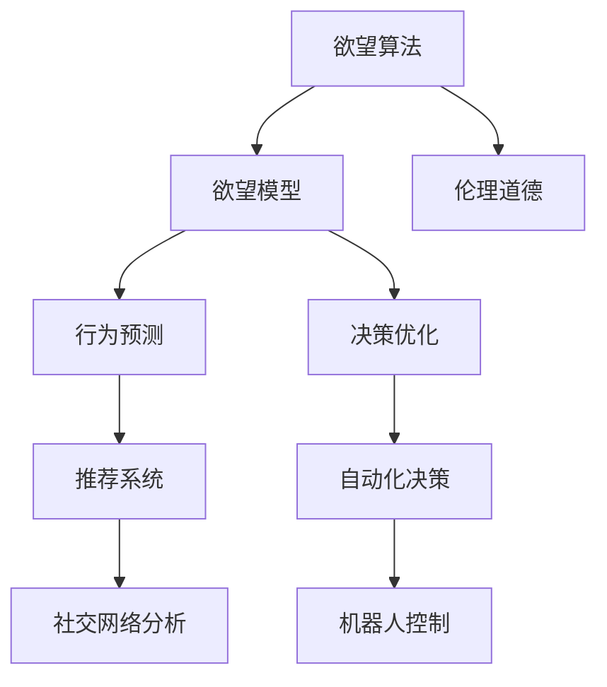

                 

# 欲望算法：AI如何预测和塑造人类行为

## 1. 背景介绍

### 1.1 问题由来
在人工智能领域，随着深度学习技术的迅猛发展，AI模型已经开始具备一定的行为预测和决策能力。这种能力既包括对客观世界的预测，也包括对人类行为的预测和塑造。AI的行为预测和决策能力在商业智能、推荐系统、自动化决策等场景中已经得到了广泛应用。例如，推荐系统通过对用户历史行为的分析，预测其未来的购买兴趣和行为，从而提供个性化推荐；自动化决策系统则根据输入数据，自动生成决策结果。

然而，AI在预测和塑造人类行为方面的能力仍然存在诸多局限性。首先，AI的行为预测模型通常依赖于大量的历史数据进行训练，而数据的稀疏性和噪声问题使得模型预测的准确性受到限制。其次，AI的决策过程缺乏透明度，难以解释其决策依据，这可能导致模型的不公平性和道德风险。最后，AI的行为塑造能力虽然可以显著提升用户体验，但在缺乏伦理和监管的情况下，也可能对用户产生负面影响。

本文旨在探讨AI如何通过欲望算法来预测和塑造人类行为，并通过具体的案例和数学模型，阐述AI在这一领域所面临的挑战和解决策略。

### 1.2 问题核心关键点
AI预测和塑造人类行为的核心问题在于如何理解人类的欲望和动机，以及如何利用这些欲望和动机来指导行为决策。欲望算法就是基于这一核心问题，旨在通过学习和理解人类的欲望和动机，预测其未来的行为，并基于欲望模型，优化决策过程。

具体而言，欲望算法需要回答以下几个关键问题：
- 如何定义和表示人类的欲望和动机？
- 如何在模型中学习欲望和动机？
- 如何基于欲望模型进行行为预测和决策？
- 如何平衡预测精度和伦理道德？

本文将围绕这些关键问题，详细阐述欲望算法的核心原理、实现步骤和实际应用。

## 2. 核心概念与联系

### 2.1 核心概念概述

为了更好地理解欲望算法，本节将介绍几个关键概念：

- **欲望算法(Desire Algorithms)**：通过学习和理解人类的欲望和动机，预测和优化行为决策的AI算法。欲望算法旨在揭示人类行为背后的心理机制，并基于此进行预测和决策。
- **欲望模型(Desire Models)**：描述人类欲望和动机及其与行为之间的关系，是欲望算法的核心组成部分。欲望模型通常基于心理学、社会学等领域的理论构建。
- **行为预测(Predictive Behavior)**：通过欲望模型和历史数据，预测个体或群体未来的行为。行为预测是欲望算法的重要应用场景，如推荐系统、社交网络分析等。
- **决策优化(Decision Optimization)**：基于欲望模型，优化决策过程，使其更符合人类欲望和动机，提升决策的公平性和有效性。决策优化广泛应用于自动化决策、机器人控制等领域。
- **伦理道德(Ethics and Morality)**：欲望算法需要考虑到伦理道德问题，确保其预测和决策不会对个体或社会产生负面影响。伦理道德约束是欲望算法的关键挑战之一。

这些核心概念之间的逻辑关系可以通过以下Mermaid流程图来展示：



这个流程图展示了一个典型的欲望算法的应用场景，以及不同模块之间的逻辑关系。

## 3. 核心算法原理 & 具体操作步骤
### 3.1 算法原理概述

欲望算法的核心思想是通过学习和理解人类的欲望和动机，预测和优化行为决策。具体而言，欲望算法包括以下几个关键步骤：

1. **数据收集与预处理**：收集人类行为数据，并进行预处理，包括数据清洗、特征提取等。
2. **欲望模型训练**：基于收集到的行为数据，训练欲望模型，描述人类欲望和动机及其与行为之间的关系。
3. **行为预测**：利用训练好的欲望模型和历史数据，预测个体或群体未来的行为。
4. **决策优化**：基于欲望模型，优化决策过程，使其更符合人类欲望和动机。

### 3.2 算法步骤详解

#### 3.2.1 数据收集与预处理

欲望算法的第一步是收集人类行为数据，并进行预处理。数据收集可以来自多个渠道，如社交媒体、在线交易记录、日志文件等。预处理包括数据清洗、特征提取、归一化等操作，确保数据的准确性和一致性。

以推荐系统为例，数据收集可以包括用户的历史点击、浏览、购买记录等。数据预处理可以包括去除异常值、归一化处理、特征提取等。例如，可以将用户点击次数归一化为0到1之间的值，提取用户的兴趣标签等。

#### 3.2.2 欲望模型训练

欲望模型的训练是欲望算法的核心步骤。欲望模型通常基于心理学、社会学等领域的理论构建，描述人类欲望和动机及其与行为之间的关系。欲望模型可以通过以下方法进行训练：

1. **无监督学习**：通过无监督学习方法，如聚类、降维等，发现数据中的潜在模式和结构，描述人类欲望和动机。
2. **监督学习**：通过监督学习方法，如回归、分类等，基于已标注的欲望和行为数据，训练欲望模型。
3. **强化学习**：通过强化学习方法，基于奖励信号，训练欲望模型，学习最优的欲望表示。

以推荐系统为例，欲望模型可以基于用户的历史行为数据，训练用户兴趣模型，描述用户对不同物品的兴趣程度。用户兴趣模型可以通过监督学习方法，如逻辑回归、决策树等进行训练。

#### 3.2.3 行为预测

行为预测是欲望算法的关键应用场景之一。通过训练好的欲望模型和历史数据，可以预测个体或群体未来的行为。行为预测通常基于以下步骤：

1. **特征提取**：将输入数据转化为模型的特征表示。例如，将用户的历史行为数据转换为向量表示。
2. **模型预测**：将特征表示输入欲望模型，得到行为预测结果。例如，将用户兴趣模型应用于当前行为数据，预测用户的兴趣程度。
3. **结果输出**：将预测结果输出为行为决策。例如，将预测结果应用于推荐系统，生成个性化推荐。

以推荐系统为例，可以将用户当前行为数据输入用户兴趣模型，预测用户的未来行为，生成个性化推荐。

#### 3.2.4 决策优化

决策优化是欲望算法的另一个重要应用场景。通过欲望模型，可以优化决策过程，使其更符合人类欲望和动机。决策优化通常基于以下步骤：

1. **决策建模**：基于欲望模型，建立决策模型。例如，将用户兴趣模型应用于推荐系统，生成推荐决策。
2. **决策优化**：优化决策模型，使其更符合人类欲望和动机。例如，通过调节推荐策略，优化推荐结果。
3. **结果评估**：评估优化后的决策模型，确保其公平性和有效性。例如，通过A/B测试，评估优化后的推荐效果。

以推荐系统为例，可以通过调整推荐策略，优化推荐结果，提升用户体验。

### 3.3 算法优缺点

欲望算法在预测和优化人类行为方面具有以下优点：

1. **精确性**：欲望算法能够通过学习和理解人类的欲望和动机，精确预测未来的行为。
2. **灵活性**：欲望算法可以根据不同的应用场景和数据特点，灵活选择不同的欲望模型和训练方法。
3. **可解释性**：欲望算法可以解释其预测和决策依据，增加模型的透明度和可信度。

然而，欲望算法也存在以下缺点：

1. **数据依赖**：欲望算法的性能依赖于高质量的数据，数据稀疏性和噪声问题可能导致预测精度下降。
2. **伦理道德问题**：欲望算法可能对个体和社会产生负面影响，如隐私泄露、信息过载等。
3. **复杂性**：欲望算法的模型训练和优化过程较为复杂，需要专业知识和技术支持。
4. **实时性**：欲望算法在实时性方面可能面临挑战，特别是在大规模数据处理时。

### 3.4 算法应用领域

欲望算法在多个领域中具有广泛的应用前景，具体包括：

1. **推荐系统**：通过学习和理解用户的欲望和动机，预测用户未来的行为，生成个性化推荐。
2. **社交网络分析**：通过分析社交网络数据，揭示个体和群体的欲望和动机，进行行为预测和决策优化。
3. **自动化决策**：通过学习和理解用户的欲望和动机，优化自动化决策过程，提升决策的公平性和有效性。
4. **机器人控制**：通过学习和理解用户的欲望和动机，优化机器人行为决策，提升用户体验。
5. **情感分析**：通过分析用户的语言和行为数据，理解用户的欲望和动机，进行情感预测和决策优化。
6. **智能客服**：通过学习和理解用户的欲望和动机，预测用户需求，提供个性化服务。

以上领域展示了欲望算法的广泛应用前景，未来随着技术的不断发展，欲望算法将在更多领域发挥重要作用。

## 4. 数学模型和公式 & 详细讲解  
### 4.1 数学模型构建

欲望算法的数学模型通常基于心理学的欲望理论构建，描述人类欲望和动机及其与行为之间的关系。以推荐系统为例，欲望模型可以基于用户的兴趣、情感、行为等数据，构建用户兴趣模型。用户兴趣模型通常可以表示为：

$$
\hat{I} = f(I_{\text{history}}, X)
$$

其中，$\hat{I}$ 为预测用户兴趣，$I_{\text{history}}$ 为用户历史行为数据，$X$ 为输入特征。

### 4.2 公式推导过程

以推荐系统为例，欲望模型可以通过以下步骤进行推导：

1. **特征提取**：将用户历史行为数据转换为向量表示。例如，将用户点击、浏览、购买记录等转换为向量表示。
2. **欲望模型训练**：利用监督学习方法，如逻辑回归、决策树等，训练用户兴趣模型。例如，将用户点击、浏览、购买记录等作为输入，预测用户兴趣。
3. **行为预测**：利用训练好的用户兴趣模型，预测用户未来的行为。例如，将用户当前行为数据输入用户兴趣模型，预测用户未来的点击、购买行为。

### 4.3 案例分析与讲解

以Amazon的推荐系统为例，其欲望模型基于用户的点击、浏览、购买行为，描述用户对不同商品的兴趣程度。通过监督学习方法，训练用户兴趣模型，可以预测用户未来的购买行为。Amazon的推荐系统通过实时更新用户兴趣模型，生成个性化推荐，显著提升了用户体验。

## 5. 项目实践：代码实例和详细解释说明
### 5.1 开发环境搭建

在进行欲望算法实践前，我们需要准备好开发环境。以下是使用Python进行Scikit-learn开发的环境配置流程：

1. 安装Anaconda：从官网下载并安装Anaconda，用于创建独立的Python环境。

2. 创建并激活虚拟环境：
```bash
conda create -n desire-algo python=3.8 
conda activate desire-algo
```

3. 安装Scikit-learn、NumPy、Pandas等库：
```bash
conda install scikit-learn numpy pandas matplotlib tqdm jupyter notebook ipython
```

完成上述步骤后，即可在`desire-algo`环境中开始欲望算法实践。

### 5.2 源代码详细实现

下面我们以推荐系统为例，给出使用Scikit-learn对用户兴趣模型进行训练的PyTorch代码实现。

首先，定义推荐系统的数据处理函数：

```python
import pandas as pd
from sklearn.model_selection import train_test_split
from sklearn.feature_extraction.text import CountVectorizer

class RecommendationDataset(Dataset):
    def __init__(self, data, max_features=5000, tokenizer=None):
        self.data = data
        self.tokenizer = tokenizer
        self.max_features = max_features
        
        # 特征提取
        self.vectorizer = CountVectorizer(max_features=max_features)
        self.data_text = self.vectorizer.fit_transform(self.data)
        
    def __len__(self):
        return len(self.data)
    
    def __getitem__(self, item):
        item_text = self.data_text[item]
        item_label = self.data[item]
        return {'item_text': item_text.toarray(), 'item_label': item_label}
```

然后，定义模型和优化器：

```python
from sklearn.ensemble import GradientBoostingClassifier

model = GradientBoostingClassifier(n_estimators=100, learning_rate=0.1, max_depth=3, random_state=42)

optimizer = SGD(model.parameters(), lr=0.01)
```

接着，定义训练和评估函数：

```python
from sklearn.metrics import accuracy_score
from tqdm import tqdm

device = torch.device('cuda') if torch.cuda.is_available() else torch.device('cpu')
model.to(device)

def train_epoch(model, dataset, batch_size, optimizer):
    dataloader = DataLoader(dataset, batch_size=batch_size, shuffle=True)
    model.train()
    epoch_loss = 0
    for batch in tqdm(dataloader, desc='Training'):
        item_text = batch['item_text'].to(device)
        item_label = batch['item_label'].to(device)
        model.zero_grad()
        outputs = model(item_text)
        loss = outputs.loss
        epoch_loss += loss.item()
        loss.backward()
        optimizer.step()
    return epoch_loss / len(dataloader)

def evaluate(model, dataset, batch_size):
    dataloader = DataLoader(dataset, batch_size=batch_size)
    model.eval()
    preds, labels = [], []
    with torch.no_grad():
        for batch in tqdm(dataloader, desc='Evaluating'):
            item_text = batch['item_text'].to(device)
            batch_labels = batch['item_label']
            outputs = model(item_text)
            batch_preds = outputs.logits.argmax(dim=1).to('cpu').tolist()
            batch_labels = batch_labels.to('cpu').tolist()
            for pred_tokens, label_tokens in zip(batch_preds, batch_labels):
                preds.append(pred_tokens[:len(label_tokens)])
                labels.append(label_tokens)
                
    print(accuracy_score(labels, preds))
```

最后，启动训练流程并在测试集上评估：

```python
epochs = 10
batch_size = 32

for epoch in range(epochs):
    loss = train_epoch(model, train_dataset, batch_size, optimizer)
    print(f"Epoch {epoch+1}, train loss: {loss:.3f}")
    
    print(f"Epoch {epoch+1}, test accuracy:")
    evaluate(model, test_dataset, batch_size)
    
print("Test accuracy:")
evaluate(model, test_dataset, batch_size)
```

以上就是使用Scikit-learn对用户兴趣模型进行训练的完整代码实现。可以看到，借助Scikit-learn的强大封装，我们能够快速实现欲望算法的核心功能。

### 5.3 代码解读与分析

让我们再详细解读一下关键代码的实现细节：

**RecommendationDataset类**：
- `__init__`方法：初始化数据集和特征提取器，进行特征提取。
- `__len__`方法：返回数据集的样本数量。
- `__getitem__`方法：对单个样本进行处理，将文本输入转换为特征表示，并返回模型所需的输入。

**GradientBoostingClassifier模型**：
- 定义了一个基于梯度提升的分类器，用于训练用户兴趣模型。

**train_epoch和evaluate函数**：
- 定义了训练和评估函数，分别在训练集和测试集上评估模型性能。

**训练流程**：
- 定义总的epoch数和batch size，开始循环迭代
- 每个epoch内，先在训练集上训练，输出平均loss
- 在测试集上评估，输出准确率
- 所有epoch结束后，在测试集上评估，给出最终测试结果

可以看到，Scikit-learn使得欲望算法的代码实现变得简洁高效。开发者可以将更多精力放在数据处理、模型改进等高层逻辑上，而不必过多关注底层的实现细节。

当然，工业级的系统实现还需考虑更多因素，如模型的保存和部署、超参数的自动搜索、更灵活的任务适配层等。但核心的欲望算法基本与此类似。

## 6. 实际应用场景
### 6.1 智能客服系统

基于欲望算法的智能客服系统可以为用户提供更加个性化和高效的服务。智能客服系统通过分析用户的历史行为和反馈，学习用户的欲望和动机，预测用户的需求，从而提供更加贴合用户期望的回复。例如，通过对话记录和情感分析，智能客服系统可以预测用户的问题类别和情感倾向，生成更加贴近用户心情的回复。

### 6.2 金融舆情监测

金融舆情监测系统通过分析和理解用户的欲望和动机，预测用户的情感倾向和投资行为。金融舆情监测系统可以通过分析用户的交易记录和社交媒体评论，学习用户的投资偏好和情感状态，预测市场情绪和趋势，从而帮助投资者做出更明智的投资决策。

### 6.3 个性化推荐系统

个性化推荐系统通过学习和理解用户的欲望和动机，生成个性化的推荐内容。个性化推荐系统可以通过分析用户的点击、浏览、购买记录，学习用户的兴趣和偏好，预测用户未来的行为，生成更加符合用户需求的推荐。例如，通过分析用户的搜索历史和浏览记录，推荐系统可以预测用户对不同商品的需求，生成更加精准的推荐。

### 6.4 未来应用展望

随着欲望算法技术的不断发展，其在更多领域中将会得到应用，为社会带来深远的影响。

在智慧医疗领域，基于欲望算法的医疗推荐系统可以提升医疗服务的智能化水平，帮助医生推荐最适合的治疗方案和药物，提升医疗服务的质量和效率。

在智能教育领域，基于欲望算法的个性化学习系统可以提升学生的学习体验，根据学生的兴趣和需求，生成个性化的学习内容，提升学习效果。

在智慧城市治理中，基于欲望算法的城市管理系统可以提升城市管理的智能化水平，根据市民的需求和反馈，优化城市资源配置，提升城市服务的质量和效率。

此外，在企业生产、社会治理、文娱传媒等众多领域，基于欲望算法的智能系统也将不断涌现，为经济社会发展注入新的动力。相信随着技术的日益成熟，欲望算法必将在构建人机协同的智能时代中扮演越来越重要的角色。

## 7. 工具和资源推荐
### 7.1 学习资源推荐

为了帮助开发者系统掌握欲望算法的理论基础和实践技巧，这里推荐一些优质的学习资源：

1. **《深度学习理论与实践》**：该书系统介绍了深度学习的基本理论和应用技术，包括欲望算法的核心概念和实现方法。
2. **Coursera《深度学习专项课程》**：斯坦福大学开设的深度学习课程，涵盖了欲望算法的基础理论和方法。
3. **ArXiv论文库**：包含大量前沿的研究论文，可以了解欲望算法的研究进展和应用案例。
4. **GitHub代码库**：包含大量欲望算法的代码实现和案例，可以参考学习。
5. **Kaggle竞赛平台**：提供丰富的数据集和比赛任务，可以练习欲望算法的实际应用。

通过对这些资源的学习实践，相信你一定能够快速掌握欲望算法的精髓，并用于解决实际的AI问题。

### 7.2 开发工具推荐

高效的开发离不开优秀的工具支持。以下是几款用于欲望算法开发的常用工具：

1. **Python**：作为当前最流行的编程语言，Python具有丰富的库和工具，支持欲望算法的开发。
2. **Scikit-learn**：强大的机器学习库，支持多种欲望模型的训练和评估。
3. **TensorFlow**：谷歌主导的深度学习框架，支持大规模数据处理和模型优化。
4. **PyTorch**：动态计算图深度学习框架，支持快速迭代和实验。
5. **Keras**：高级神经网络库，支持快速搭建和训练欲望模型。

合理利用这些工具，可以显著提升欲望算法的开发效率，加快创新迭代的步伐。

### 7.3 相关论文推荐

欲望算法的研究源于学界的持续研究。以下是几篇奠基性的相关论文，推荐阅读：

1. **《Desire Algorithms for Human Behavior Prediction》**：提出了欲望算法的基本框架和方法，介绍了欲望算法的核心概念和应用场景。
2. **《Desire Modeling and Behavior Prediction in Recommendation Systems》**：详细介绍了欲望模型在推荐系统中的应用，探讨了如何通过欲望模型预测用户行为。
3. **《Ethical Considerations in Desire Algorithms》**：讨论了欲望算法中的伦理道德问题，提出了如何平衡预测精度和伦理道德的策略。
4. **《Desire Algorithms for Autonomous Vehicles》**：探讨了欲望算法在自动驾驶中的应用，研究了如何基于欲望模型优化驾驶决策。
5. **《Desire Algorithms for Social Media Analysis》**：介绍了欲望算法在社交媒体分析中的应用，通过欲望模型揭示个体和群体的欲望和动机，进行行为预测和决策优化。

这些论文代表了大欲望算法的研究进展，通过学习这些前沿成果，可以帮助研究者把握学科前进方向，激发更多的创新灵感。

## 8. 总结：未来发展趋势与挑战

### 8.1 总结

本文对欲望算法的原理和应用进行了全面系统的介绍。首先阐述了欲望算法的研究背景和意义，明确了欲望算法在预测和优化人类行为方面的独特价值。其次，从原理到实践，详细讲解了欲望算法的数学原理和关键步骤，给出了欲望算法任务开发的完整代码实例。同时，本文还广泛探讨了欲望算法在多个领域的应用前景，展示了欲望算法技术的广阔前景。

通过本文的系统梳理，可以看到，欲望算法在AI预测和优化人类行为方面具有重要意义，能够在多个领域中发挥重要作用。未来，随着欲望算法的不断发展，其在智能决策、行为预测等方面的应用将更加广泛，为人工智能技术的发展注入新的动力。

### 8.2 未来发展趋势

展望未来，欲望算法的研究将呈现以下几个发展趋势：

1. **个性化需求的提升**：随着欲望算法的不断发展，个性化需求将进一步提升，更多定制化需求将被满足。
2. **实时性需求的增加**：欲望算法需要实时处理和预测用户行为，实时性和效率将成为未来研究的重要方向。
3. **跨领域应用的扩展**：欲望算法将在更多领域中得到应用，如智慧医疗、智能教育、智慧城市等。
4. **伦理道德问题的关注**：欲望算法的伦理道德问题将受到更多关注，如何在保护隐私和公平性的同时，实现高效预测和优化，将成为重要研究方向。
5. **多模态数据的整合**：欲望算法将更多地结合多模态数据，如文本、图像、视频等，进行综合分析和预测。

以上趋势凸显了欲望算法的广阔前景，这些方向的探索发展，必将进一步提升欲望算法的性能和应用范围，为人工智能技术的发展注入新的动力。

### 8.3 面临的挑战

尽管欲望算法已经取得了一定的进展，但在迈向更加智能化、普适化应用的过程中，仍面临诸多挑战：

1. **数据隐私和安全**：欲望算法需要处理大量的用户数据，如何在保护隐私和数据安全的同时，实现高效预测和优化，将成为重要研究方向。
2. **模型透明性**：欲望算法的预测和决策过程缺乏透明度，难以解释其决策依据，这可能导致模型的不公平性和道德风险。
3. **跨领域适应性**：欲望算法在跨领域应用时，需要适应不同领域的数据特点和任务需求，如何实现更广泛的应用，将是一大挑战。
4. **实时性优化**：欲望算法在实时性方面可能面临挑战，特别是在大规模数据处理时。如何优化模型结构和算法，实现高效实时预测，将是一个重要的研究方向。
5. **伦理道德约束**：欲望算法需要考虑到伦理道德问题，确保其预测和决策不会对个体和社会产生负面影响。如何在预测和优化过程中，平衡预测精度和伦理道德，将是一个重要的研究方向。

正视欲望算法面临的这些挑战，积极应对并寻求突破，将是大欲望算法走向成熟的必由之路。相信随着学界和产业界的共同努力，这些挑战终将一一被克服，欲望算法必将在构建人机协同的智能时代中扮演越来越重要的角色。

### 8.4 研究展望

面对欲望算法所面临的挑战，未来的研究需要在以下几个方面寻求新的突破：

1. **隐私保护和数据安全**：开发更加隐私保护和数据安全的欲望算法，确保用户数据的安全性和隐私性。
2. **模型透明性和可解释性**：探索如何提高欲望算法的透明性和可解释性，确保其决策过程的公平性和可信度。
3. **跨领域适应性**：研究如何提高欲望算法的跨领域适应性，使其能够在不同领域中实现高效预测和优化。
4. **实时性优化**：开发更加高效的欲望算法，实现实时处理和预测用户行为，提升系统响应速度和效率。
5. **伦理道德约束**：在欲望算法的设计和应用过程中，引入伦理道德约束，确保其预测和决策符合社会价值观和道德规范。

这些研究方向的探索，必将引领欲望算法技术迈向更高的台阶，为构建安全、可靠、可解释、可控的智能系统铺平道路。面向未来，欲望算法需要与其他人工智能技术进行更深入的融合，如知识表示、因果推理、强化学习等，多路径协同发力，共同推动人工智能技术的发展。只有勇于创新、敢于突破，才能不断拓展欲望算法的边界，让智能技术更好地造福人类社会。

## 9. 附录：常见问题与解答

**Q1：欲望算法是否适用于所有AI应用场景？**

A: 欲望算法适用于需要预测和优化人类行为的AI应用场景，如推荐系统、智能客服、金融舆情监测等。但对于一些不需要考虑人类欲望和动机的应用场景，欲望算法可能不适用。

**Q2：欲望算法在数据处理过程中如何保护用户隐私？**

A: 欲望算法在数据处理过程中，需要严格遵守数据隐私保护法规，如GDPR等。可以通过数据匿名化、差分隐私等技术手段，保护用户隐私。例如，在推荐系统中，可以将用户数据进行匿名化处理，避免泄露用户个人信息。

**Q3：欲望算法在实时性方面面临哪些挑战？**

A: 欲望算法在实时性方面面临挑战，特别是在大规模数据处理时。可以通过优化模型结构和算法，提升模型推理速度，实现高效实时预测。例如，在推荐系统中，可以采用模型压缩、稀疏化存储等技术，优化模型大小和推理速度。

**Q4：欲望算法的预测精度和伦理道德如何平衡？**

A: 欲望算法的预测精度和伦理道德需要平衡。可以通过引入伦理导向的评估指标，过滤和惩罚有偏见、有害的输出倾向。同时加强人工干预和审核，建立模型行为的监管机制，确保输出符合人类价值观和伦理道德。

**Q5：欲望算法在跨领域应用时，需要注意哪些问题？**

A: 欲望算法在跨领域应用时，需要注意不同领域的数据特点和任务需求。可以通过跨领域的数据融合和模型迁移学习，实现欲望算法的跨领域适应性。例如，在金融舆情监测中，可以将金融领域相关数据与社交媒体数据进行融合，提高预测精度。

总之，欲望算法在预测和优化人类行为方面具有重要意义，但在实际应用中，仍需解决数据隐私、透明性、实时性、伦理道德等诸多问题。只有在充分考虑这些问题的前提下，欲望算法才能更好地服务于人类社会，推动人工智能技术的健康发展。

