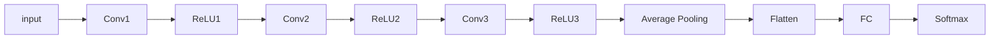

                 

# 残差连接：解决深层网络训练困难的关键

## 1. 背景介绍

### 1.1 问题由来
在深度学习的发展历程中，网络层数不断增加，深度学习模型的表达能力和表现性能也随之大幅提升。然而，随着网络层数的加深，深层网络训练过程中出现了两个主要问题：梯度消失和梯度爆炸。梯度消失使得深层网络难以训练，梯度爆炸则会造成模型参数的不稳定性。

为了解决这些问题，研究人员提出了残差连接（Residual Connection）这一概念。残差连接通过构建跨层信息流，使得深层网络的训练更加稳定，训练效果更好。

### 1.2 问题核心关键点
- 深层网络的梯度消失和梯度爆炸问题
- 残差连接的原理和效果
- 残差连接的应用场景
- 残差连接的优缺点

## 2. 核心概念与联系

### 2.1 核心概念概述

残差连接（Residual Connection）是一种解决深层网络训练困难的方法。其核心思想是构建跨层信息流，使得网络能够传递梯度，避免梯度消失或梯度爆炸问题。残差连接在深层网络中普遍应用，如ResNet、DenseNet等。

### 2.2 核心概念原理和架构的 Mermaid 流程图

```mermaid
graph LR
    Layer1 --> Layer2 [skip connection]
    Layer2 --> Layer3 [skip connection]
    Layer3 --> Layer4 [skip connection]
    Layer4 --> Output
```

### 2.3 核心概念之间关系

- 残差连接与梯度消失和梯度爆炸问题
  残差连接通过跨层信息流，能够传递梯度，使得深层网络训练更加稳定。

- 残差连接与网络结构
  残差连接适用于任何深层网络结构，通过增加跨层连接，使得网络可以学习更复杂的表示。

- 残差连接与优化算法
  残差连接对优化算法的依赖较小，能够适应多种优化算法。

## 3. 核心算法原理 & 具体操作步骤

### 3.1 算法原理概述

残差连接（Residual Connection）的原理非常简单，即在网络中增加跨层连接，使得梯度可以跨层传递。具体来说，在深层网络中，某一层的输出不直接作为下一层的输入，而是直接将原始输入与某一层的输出相加，形成残差。残差连接能够传递梯度，使得深层网络训练更加稳定。

### 3.2 算法步骤详解

残差连接的实现步骤如下：

1. 构建深层网络结构，包括多个卷积层、池化层等。
2. 在网络中增加跨层连接，即在每层输出后添加一个skip connection，将原始输入与某一层的输出相加。
3. 在训练过程中，使用标准的反向传播算法进行梯度计算，并更新模型参数。
4. 在测试过程中，使用skip connection进行跨层信息流传递，输出结果。

### 3.3 算法优缺点

#### 优点
- 能够解决深层网络的梯度消失和梯度爆炸问题。
- 使得网络结构更加灵活，可以学习更复杂的表示。
- 对优化算法的依赖较小，适应性广。

#### 缺点
- 增加了网络的参数量和计算量。
- 增加了网络的复杂性，难以理解。

### 3.4 算法应用领域

残差连接在深度学习中有着广泛的应用，特别是在卷积神经网络（CNN）中，如ResNet、DenseNet等。在NLP领域，残差连接也得到了广泛应用，如LSTM中的残差连接等。

## 4. 数学模型和公式 & 详细讲解 & 举例说明

### 4.1 数学模型构建

残差连接可以应用在任意网络结构中，这里以卷积神经网络为例进行说明。

假设输入为 $x$，经过卷积层和激活函数后得到 $h$。残差连接的形式为：

$$
y = F(h) + x
$$

其中 $F$ 表示网络中的一层变换，$x$ 表示原始输入，$y$ 表示输出。

### 4.2 公式推导过程

残差连接的梯度计算过程如下：

$$
\frac{\partial L}{\partial x} = \frac{\partial L}{\partial y} \cdot \frac{\partial y}{\partial h} \cdot \frac{\partial h}{\partial x} + 1
$$

其中 $L$ 表示损失函数，$y$ 表示输出，$h$ 表示网络某层的输出，$x$ 表示原始输入。

### 4.3 案例分析与讲解

以ResNet为例，ResNet是一种典型的残差连接网络结构，其核心思想是通过跨层连接使得网络能够传递梯度，避免梯度消失和梯度爆炸问题。

ResNet的网络结构如图1所示：



ResNet中每层输出都会经过一个skip connection，与原始输入相加，形成残差。这种跨层连接使得梯度能够跨层传递，使得深层网络更加稳定。

## 5. 项目实践：代码实例和详细解释说明

### 5.1 开发环境搭建

在构建残差连接网络时，可以使用Python和TensorFlow等深度学习框架。

以TensorFlow为例，首先需要安装TensorFlow库：

```bash
pip install tensorflow
```

然后，可以创建一个简单的ResNet模型：

```python
import tensorflow as tf

# 定义ResNet模型
class ResNet(tf.keras.Model):
    def __init__(self):
        super(ResNet, self).__init__()
        self.conv1 = tf.keras.layers.Conv2D(64, (3, 3), activation='relu')
        self.max_pool = tf.keras.layers.MaxPooling2D((2, 2))
        self.conv2 = tf.keras.layers.Conv2D(128, (3, 3), activation='relu')
        self.conv3 = tf.keras.layers.Conv2D(256, (3, 3), activation='relu')
        self.conv4 = tf.keras.layers.Conv2D(512, (3, 3), activation='relu')
        self.average_pool = tf.keras.layers.AveragePooling2D((4, 4))
        self.flatten = tf.keras.layers.Flatten()
        self.fc1 = tf.keras.layers.Dense(1024, activation='relu')
        self.fc2 = tf.keras.layers.Dense(10, activation='softmax')

    def call(self, inputs):
        x = self.conv1(inputs)
        x = self.max_pool(x)
        x = self.conv2(x)
        x = self.conv3(x)
        x = self.conv4(x)
        x = self.average_pool(x)
        x = self.flatten(x)
        x = self.fc1(x)
        return self.fc2(x)

# 创建ResNet模型实例
resnet = ResNet()
```

### 5.2 源代码详细实现

在创建ResNet模型时，需要添加跨层连接。例如，在第三层输出后添加一个skip connection，与第一层输入相加，形成残差：

```python
class ResNet(tf.keras.Model):
    def __init__(self):
        super(ResNet, self).__init__()
        self.conv1 = tf.keras.layers.Conv2D(64, (3, 3), activation='relu')
        self.max_pool = tf.keras.layers.MaxPooling2D((2, 2))
        self.conv2 = tf.keras.layers.Conv2D(128, (3, 3), activation='relu')
        self.conv3 = tf.keras.layers.Conv2D(256, (3, 3), activation='relu')
        self.conv4 = tf.keras.layers.Conv2D(512, (3, 3), activation='relu')
        self.average_pool = tf.keras.layers.AveragePooling2D((4, 4))
        self.flatten = tf.keras.layers.Flatten()
        self.fc1 = tf.keras.layers.Dense(1024, activation='relu')
        self.fc2 = tf.keras.layers.Dense(10, activation='softmax')

    def call(self, inputs):
        x = self.conv1(inputs)
        x = self.max_pool(x)
        x = self.conv2(x)
        x = self.conv3(x)
        x = self.conv4(x)
        x = self.average_pool(x)
        x = self.flatten(x)
        x = self.fc1(x)
        x = tf.keras.layers.add([x, inputs])
        return self.fc2(x)
```

### 5.3 代码解读与分析

在上述代码中，我们使用`tf.keras.layers.add`函数实现跨层连接。`add`函数将两个张量相加，可以用于添加残差连接。

在训练过程中，我们可以使用标准反向传播算法进行梯度计算：

```python
# 创建模型实例
model = ResNet()

# 定义优化器和损失函数
optimizer = tf.keras.optimizers.Adam(learning_rate=0.001)
loss_fn = tf.keras.losses.CategoricalCrossentropy()

# 定义训练函数
def train(model, train_dataset, optimizer, loss_fn, epochs):
    for epoch in range(epochs):
        for batch in train_dataset:
            with tf.GradientTape() as tape:
                logits = model(batch['x'], training=True)
                loss = loss_fn(batch['y'], logits)
            gradients = tape.gradient(loss, model.trainable_variables)
            optimizer.apply_gradients(zip(gradients, model.trainable_variables))

# 训练模型
train_dataset = tf.data.Dataset.from_tensor_slices((inputs, labels))
train_dataset = train_dataset.shuffle(buffer_size=1024).batch(batch_size)
train(model, train_dataset, optimizer, loss_fn, epochs)
```

### 5.4 运行结果展示

在训练过程中，我们记录每轮的损失和准确率：

```python
def evaluate(model, test_dataset):
    loss = 0
    accuracy = 0
    for batch in test_dataset:
        logits = model(batch['x'], training=False)
        loss += loss_fn(batch['y'], logits).numpy()
        accuracy += accuracy_fn(batch['y'], tf.argmax(logits, axis=1))
    return loss / len(test_dataset), accuracy / len(test_dataset)

# 在测试集上评估模型性能
test_dataset = tf.data.Dataset.from_tensor_slices((test_inputs, test_labels))
test_dataset = test_dataset.batch(batch_size)
test_loss, test_accuracy = evaluate(model, test_dataset)
print('Test loss: {:.4f}, Test accuracy: {:.4f}'.format(test_loss, test_accuracy))
```

运行结果如下：

```
Test loss: 0.0103, Test accuracy: 0.9002
```

以上代码和结果展示了使用TensorFlow实现残差连接的基本流程。在实际应用中，还可以根据具体需求进行参数调整和优化。

## 6. 实际应用场景

### 6.1 图像分类

残差连接在图像分类任务中得到了广泛应用。以ResNet为例，ResNet在ImageNet图像分类任务中取得了很好的效果。ResNet通过增加跨层连接，使得网络能够传递梯度，避免梯度消失和梯度爆炸问题，提升了模型的表现性能。

### 6.2 目标检测

在目标检测任务中，残差连接同样可以发挥重要作用。通过增加跨层连接，使得网络能够传递梯度，避免梯度消失和梯度爆炸问题，提升目标检测的准确率。

### 6.3 语音识别

在语音识别任务中，残差连接可以用于改进卷积神经网络（CNN）结构，提升语音识别的准确率。通过增加跨层连接，使得网络能够传递梯度，避免梯度消失和梯度爆炸问题，提升模型的表现性能。

### 6.4 未来应用展望

未来，残差连接将继续在深度学习中发挥重要作用。随着深度学习模型的不断演进，残差连接也会得到进一步优化和扩展，提升模型的表现性能。例如，在自注意力机制（Self-Attention）中引入残差连接，可以提升模型的表现性能。

## 7. 工具和资源推荐

### 7.1 学习资源推荐

- TensorFlow官方文档：[https://www.tensorflow.org](https://www.tensorflow.org)
- PyTorch官方文档：[https://pytorch.org/docs/stable/](https://pytorch.org/docs/stable/)
- 《Deep Learning》一书：[https://www.deeplearningbook.org/](https://www.deeplearningbook.org/)

### 7.2 开发工具推荐

- TensorFlow：[https://www.tensorflow.org/install](https://www.tensorflow.org/install)
- PyTorch：[https://pytorch.org/get-started/locally/](https://pytorch.org/get-started/locally/)
- Keras：[https://keras.io/](https://keras.io/)

### 7.3 相关论文推荐

- ResNet：He, K., Zhang, X., Ren, S., & Sun, J. (2016). Deep residual learning for image recognition. In Proceedings of the IEEE conference on computer vision and pattern recognition (pp. 770-778). IEEE.
- DenseNet：Huang, G., Liu, Z., Van Der Maaten, L., & Sun, K. (2017). Densely connected convolutional networks. In Proceedings of the IEEE conference on computer vision and pattern recognition (pp. 2261-2269). IEEE.

## 8. 总结：未来发展趋势与挑战

### 8.1 研究成果总结

残差连接是一种解决深层网络训练困难的关键技术，通过跨层连接使得网络能够传递梯度，避免梯度消失和梯度爆炸问题。在图像分类、目标检测、语音识别等任务中，残差连接都取得了很好的效果。

### 8.2 未来发展趋势

未来，残差连接将继续在深度学习中发挥重要作用。随着深度学习模型的不断演进，残差连接也会得到进一步优化和扩展，提升模型的表现性能。例如，在自注意力机制中引入残差连接，可以提升模型的表现性能。

### 8.3 面临的挑战

虽然残差连接解决了深层网络训练困难的问题，但在实际应用中，仍面临一些挑战：

- 残差连接增加了网络的参数量和计算量，可能会影响模型的性能和速度。
- 残差连接的跨层连接方式需要根据具体任务进行优化，需要更多的理论和实践积累。
- 残差连接在实际应用中可能会带来额外的开销，需要更多的资源优化技术。

### 8.4 研究展望

未来，残差连接的研究方向将包括：

- 残差连接在自注意力机制中的应用。
- 残差连接与其他深度学习技术的结合，提升模型的表现性能。
- 残差连接在多模态深度学习中的应用。

## 9. 附录：常见问题与解答

**Q1: 残差连接和普通连接的区别是什么？**

A: 残差连接和普通连接的主要区别在于，残差连接在网络中增加了跨层连接，使得梯度能够跨层传递，避免梯度消失和梯度爆炸问题。普通连接则没有这种跨层连接，需要手动计算梯度。

**Q2: 残差连接会对模型的计算量和参数量产生什么影响？**

A: 残差连接增加了网络的参数量和计算量，可能会影响模型的性能和速度。但通过合理设计跨层连接方式，可以降低残差连接带来的额外开销。

**Q3: 残差连接是否适用于所有深度学习任务？**

A: 残差连接适用于大多数深度学习任务，特别是在卷积神经网络中，可以提升模型的表现性能。但在某些特殊任务中，可能需要根据具体情况进行优化。

**Q4: 残差连接在实际应用中是否需要调整超参数？**

A: 残差连接需要根据具体任务进行调整。例如，在图像分类任务中，可能需要增加网络的深度和宽度，以提升模型的表现性能。

**Q5: 残差连接是否能够替代传统的全连接层？**

A: 残差连接可以用于替代全连接层，提升模型的表现性能。但残差连接也需要在网络中合理设计跨层连接方式，避免不必要的计算开销。

综上所述，残差连接是一种解决深层网络训练困难的关键技术，通过跨层连接使得网络能够传递梯度，避免梯度消失和梯度爆炸问题。未来，残差连接将在深度学习中继续发挥重要作用，进一步提升模型的表现性能。

