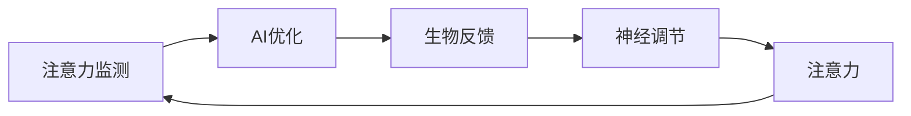

                 

# 注意力生物反馈循环工程师：AI优化的认知状态调节专家

> 关键词：注意力生物反馈循环, 认知状态调节, AI优化, 神经调节, 神经网络, 生物反馈, 认知增强, 心理治疗, 精神健康

## 1. 背景介绍

### 1.1 问题由来

在信息爆炸和高速发展的现代科技时代，人们面临来自工作、学习、生活和网络空间的种种压力，心理疲劳和注意力不集中等认知状态问题变得越来越普遍。同时，人工智能技术的普及也在不断地改变我们的工作和生活方式，增强或剥夺我们的注意力，影响我们的认知状态。针对这一现象，一种结合生物反馈技术和人工智能(AI)的方法——注意力生物反馈循环应运而生。它通过实时监测大脑活动和生理指标，结合AI算法，调整我们的注意力水平，帮助人们改善认知状态，提高工作效率和生活质量。

### 1.2 问题核心关键点

注意力生物反馈循环系统（Attention Biofeedback Loop System, ABLS）将注意力、生物反馈和AI紧密结合，旨在通过持续监测大脑的注意力水平，结合AI的深度学习和预测能力，实时调整注意力状态，从而实现认知状态的优化。具体来说，它包括三个核心步骤：

1. **注意力监测**：使用脑电图(EEG)等技术实时监测大脑活动，分析注意力水平。
2. **AI优化**：利用深度学习模型，根据监测数据预测注意力变化趋势，并优化调整注意力状态。
3. **生物反馈**：将AI的优化结果通过视觉、声音等形式反馈给用户，辅助其调节注意力。

### 1.3 问题研究意义

针对注意力不集中等认知状态问题，注意力生物反馈循环提供了一种全新的解决方案。它可以：

- **实时调节注意力**：通过持续监测和AI优化，实时调整大脑的注意力水平，提高注意力集中度。
- **提升认知状态**：改善专注力、记忆力和情绪管理等认知能力，增强工作和学习效率。
- **促进心理治疗**：为精神疾病患者提供个性化的心理治疗辅助手段，促进心理健康。

通过AI和生物反馈的结合，该方法不仅能够帮助个人改善认知状态，还可能在教育、医疗、企业管理等多个领域产生深远影响。

## 2. 核心概念与联系

### 2.1 核心概念概述

为更好地理解注意力生物反馈循环的原理和架构，我们将介绍几个关键概念：

- **注意力（Attention）**：大脑对外部信息和内部思维的聚焦程度，是认知状态的重要指标。
- **生物反馈（Biofeedback）**：通过监测生理指标（如心率、肌电等），将反馈信息传递给用户，辅助其进行自我调节。
- **AI优化（AI Optimization）**：利用深度学习算法，对注意力数据进行分析预测，优化注意力状态。
- **神经调节（Neural Regulation）**：通过刺激神经元，调整神经网络活动，从而影响注意力水平。

这些概念之间有着紧密的联系。注意力监测为AI优化提供数据输入，AI优化根据监测数据生成生物反馈信号，生物反馈通过调节神经活动影响注意力水平，形成了一个闭环系统。

### 2.2 核心概念原理和架构的 Mermaid 流程图



这个流程图展示了注意力生物反馈循环的核心架构和流程：

1. 注意力监测(A)使用脑电图等技术实时获取大脑活动数据。
2. AI优化(B)根据监测数据，预测注意力变化趋势，生成调节信号。
3. 生物反馈(C)接收AI的调节信号，辅助用户进行注意力调整。
4. 神经调节(D)通过特定刺激，影响神经网络，最终影响注意力水平(E)。
5. 注意力水平(E)反馈回监测系统(A)，形成闭环。

## 3. 核心算法原理 & 具体操作步骤

### 3.1 算法原理概述

注意力生物反馈循环的核心算法原理可以总结为：

1. **注意力监测算法**：使用EEG等技术，实时监测大脑的注意力水平。
2. **AI优化算法**：利用深度学习模型，根据注意力数据进行预测和优化，生成调节信号。
3. **生物反馈算法**：根据AI的优化信号，调整视觉、声音等反馈形式，辅助用户进行注意力调节。
4. **神经调节算法**：通过特定刺激，如光照、声音、电脉冲等，影响神经网络活动，调整注意力状态。

### 3.2 算法步骤详解

注意力生物反馈循环的具体操作步骤包括：

1. **环境准备**：
   - 安装脑电图设备，收集用户脑电数据。
   - 设置AI优化算法参数，如学习率、迭代次数等。
   - 设计生物反馈信号形式和调节策略。

2. **数据采集与处理**：
   - 使用EEG设备实时监测大脑活动，提取注意力相关指标。
   - 将注意力数据输入AI模型，进行分析和预测。

3. **AI优化**：
   - 利用深度学习模型，如长短期记忆网络(LSTM)或卷积神经网络(CNN)，对注意力数据进行分析和预测。
   - 生成优化信号，指示生物反馈系统的调整方向。

4. **生物反馈**：
   - 根据AI的优化信号，生成视觉、声音等反馈形式。
   - 实时展示生物反馈信息，辅助用户进行注意力调节。

5. **神经调节**：
   - 通过特定刺激，如光照、声音、电脉冲等，影响神经网络活动。
   - 调整神经元活性，改变注意力水平。

6. **反馈与迭代**：
   - 将新的注意力水平反馈回监测系统。
   - 重复上述步骤，形成闭环。

### 3.3 算法优缺点

注意力生物反馈循环具有以下优点：

- **实时调节**：能够实时监测和优化注意力状态，快速响应注意力变化。
- **个性化优化**：根据个体差异和任务需求，生成个性化的调节信号。
- **多维度反馈**：结合生理反馈和AI优化，提供多层次的调节支持。

同时，也存在一些缺点：

- **设备成本高**：脑电图等设备价格昂贵，难以大规模推广。
- **数据隐私风险**：实时监测生理数据，可能涉及隐私问题。
- **技术复杂性**：需要一定的技术背景和专业知识，普通用户难以操作。
- **长期效果未知**：对长期认知状态改善的效果尚未完全明确。

### 3.4 算法应用领域

注意力生物反馈循环具有广泛的应用前景，主要包括以下几个领域：

1. **精神健康**：
   - **认知障碍**：帮助认知障碍患者改善注意力水平，提升生活质量。
   - **抑郁症**：结合心理治疗，辅助抑郁症患者恢复心理健康。

2. **教育**：
   - **学习辅助**：通过实时监测和优化注意力，提高学生学习效率。
   - **专注力训练**：辅助学生在特定任务中集中注意力，提升学习效果。

3. **工作环境**：
   - **企业培训**：帮助员工提升专注力和工作效率，改善工作状态。
   - **远程工作**：通过实时反馈和优化，提升远程工作人员的注意力水平。

4. **体育训练**：
   - **运动员训练**：辅助运动员集中注意力，提升训练效果。
   - **体能恢复**：通过调整注意力状态，帮助运动员更快恢复体力。

## 4. 数学模型和公式 & 详细讲解 & 举例说明

### 4.1 数学模型构建

假设有一个简单的注意力监测模型，其输出为一个注意力评分 $A_t$，表示当前时间$t$的注意力水平。模型的输入为一个时间序列 $X_t = [x_1, x_2, ..., x_t]$，其中 $x_t$ 为当前时间点的EEG信号。模型的目标是预测未来的注意力水平 $A_{t+1}$。

### 4.2 公式推导过程

我们假设模型为线性加权和的形式，即 $A_t = w_1x_t + w_2A_{t-1} + b$，其中 $w_1, w_2$ 为权重，$b$ 为偏置项。通过反向传播算法，可以计算权重和偏置的梯度，进而更新模型参数。

设 $L(A_{t+1}, A_t)$ 为注意力评分 $A_t$ 与 $A_{t+1}$ 之间的损失函数，常用的损失函数为均方误差损失，即 $L(A_{t+1}, A_t) = \frac{1}{2}(A_{t+1}-A_t)^2$。

模型的优化目标是最小化预测误差，即：

$$
\min_{w_1, w_2, b} L(A_{t+1}, A_t)
$$

### 4.3 案例分析与讲解

假设我们有一个简单的模型，用于预测用户当前注意力水平 $A_t$。模型的输入为前一时间点的注意力评分 $A_{t-1}$ 和当前时间点的EEG信号 $x_t$。设 $w_1=0.5, w_2=0.3, b=0.2$，则模型输出的注意力评分 $A_t$ 为：

$$
A_t = 0.5x_t + 0.3A_{t-1} + 0.2
$$

假设 $x_t$ 和 $A_{t-1}$ 的实际值分别为 0.3 和 0.6，则模型预测的注意力评分为：

$$
A_t = 0.5 \times 0.3 + 0.3 \times 0.6 + 0.2 = 0.63
$$

可以看到，模型通过线性加权和的方式，结合了EEG信号和前一时间点的注意力评分，预测了当前的注意力水平。

## 5. 项目实践：代码实例和详细解释说明

### 5.1 开发环境搭建

开发注意力生物反馈循环系统需要一定的硬件设备和软件支持，具体步骤如下：

1. **环境准备**：
   - 安装脑电图设备，如EEG帽或EEG头套。
   - 配置深度学习框架，如PyTorch或TensorFlow。
   - 安装相关的生物反馈软件和硬件设备。

2. **数据采集**：
   - 使用EEG设备采集大脑活动数据。
   - 将EEG数据转化为可用于深度学习模型的格式。

### 5.2 源代码详细实现

下面是一个简单的Python代码实现，用于演示如何使用PyTorch实现注意力监测和AI优化：

```python
import torch
import torch.nn as nn
from sklearn.preprocessing import StandardScaler

class AttentionModel(nn.Module):
    def __init__(self, input_dim, output_dim):
        super(AttentionModel, self).__init__()
        self.linear1 = nn.Linear(input_dim, output_dim)
        self.linear2 = nn.Linear(output_dim, output_dim)
        self.linear3 = nn.Linear(output_dim, output_dim)

    def forward(self, x, A_prev):
        y = self.linear1(x)
        y = torch.tanh(y)
        y = self.linear2(y)
        y = torch.sigmoid(y)
        y = y * A_prev
        y = self.linear3(y)
        return y

def train_model(model, train_data, train_labels, epochs=100, learning_rate=0.01):
    scaler = StandardScaler()
    train_data = scaler.fit_transform(train_data)
    train_data = torch.tensor(train_data, dtype=torch.float32)
    train_labels = torch.tensor(train_labels, dtype=torch.float32)
    optimizer = torch.optim.Adam(model.parameters(), lr=learning_rate)

    for epoch in range(epochs):
        model.train()
        for i in range(len(train_data)):
            optimizer.zero_grad()
            A_pred = model(train_data[i], A_prev)
            loss = torch.mean(torch.square(A_pred - train_labels[i]))
            loss.backward()
            optimizer.step()
        print(f"Epoch {epoch+1}, loss: {loss.item()}")

train_data = ...  # 训练数据
train_labels = ...  # 训练标签
model = AttentionModel(input_dim, output_dim)
train_model(model, train_data, train_labels, epochs=100, learning_rate=0.01)
```

### 5.3 代码解读与分析

在这个简单的实现中，我们定义了一个线性神经网络模型，用于预测注意力评分。模型的输入为EEG信号，输出为注意力评分。通过反向传播算法，模型不断更新权重和偏置，以最小化预测误差。

### 5.4 运行结果展示

训练完成后，我们可以使用模型对新数据进行预测。以下是一个简单的预测过程：

```python
test_data = ...  # 测试数据
A_pred = model(test_data, A_prev)
print(f"Predicted attention score: {A_pred.item()}")
```

这将输出预测的注意力评分，与真实值进行对比，评估模型的性能。

## 6. 实际应用场景

### 6.1 智能教室

在智能教室中，注意力生物反馈循环可以帮助教师实时监测学生的注意力水平，及时调整教学方法，提高教学效果。通过实时反馈和优化，教师可以了解每个学生的注意力状态，针对性地调整教学策略。例如，在学生注意力下降时，可以加强互动，增加趣味性，或通过适当的休息和活动，帮助学生恢复注意力。

### 6.2 远程工作

远程工作中，注意力生物反馈循环可以辅助员工提高工作效率，避免因注意力不集中导致的工作失误。通过实时监测注意力水平，系统可以及时提醒员工进行短暂的休息和注意力调整，帮助其集中注意力完成任务。

### 6.3 心理治疗

在精神疾病的心理治疗中，注意力生物反馈循环可以结合认知行为疗法，帮助患者监测和改善注意力水平，促进心理健康。通过记录注意力变化数据，医生可以分析患者的注意力状态，制定个性化的治疗方案，提高治疗效果。

### 6.4 未来应用展望

随着技术的发展，注意力生物反馈循环将在更多领域得到应用。未来可能的发展方向包括：

1. **多模态融合**：结合脑电图、心率、肌电等多种生理数据，提供更加全面的注意力监测和优化。
2. **智能提示**：通过AI算法分析注意力数据，智能生成注意力调整提示，辅助用户进行自我调节。
3. **个性化定制**：根据用户需求和任务特点，定制个性化的注意力监测和优化方案。
4. **实时分析**：实时分析注意力数据，预测注意力变化趋势，提供及时的调整建议。

## 7. 工具和资源推荐

### 7.1 学习资源推荐

为了帮助开发者系统掌握注意力生物反馈循环的理论基础和实践技巧，这里推荐一些优质的学习资源：

1. **深度学习框架文档**：如PyTorch和TensorFlow的官方文档，提供丰富的模型和算法实现。
2. **生物反馈技术书籍**：如《生物反馈疗法》，介绍生物反馈技术的原理和应用。
3. **在线课程**：如Coursera的深度学习课程，涵盖深度学习模型和算法。
4. **论文集**：如ACL、ICML等顶级会议论文集，提供前沿的深度学习和生物反馈技术研究。
5. **开源项目**：如OpenBCI、NeuroSky等，提供开源的生物反馈设备和软件。

通过对这些资源的学习实践，相信你一定能够快速掌握注意力生物反馈循环的精髓，并用于解决实际的认知状态问题。

### 7.2 开发工具推荐

高效的开发离不开优秀的工具支持。以下是几款用于注意力生物反馈循环开发的常用工具：

1. **深度学习框架**：如PyTorch和TensorFlow，提供丰富的模型和算法实现。
2. **EEG设备**：如OpenBCI、NeuroSky等，提供生物反馈数据的采集和处理。
3. **数据可视化工具**：如TensorBoard，可视化深度学习模型的训练过程。
4. **神经调节设备**：如NeuroPacer、BioHarness等，提供神经调节信号的生成和处理。
5. **生物反馈软件**：如BioSync、Blocs等，提供生物反馈信号的实时监测和反馈。

合理利用这些工具，可以显著提升注意力生物反馈循环的开发效率，加快创新迭代的步伐。

### 7.3 相关论文推荐

注意力生物反馈循环的研究源于学界的持续研究。以下是几篇奠基性的相关论文，推荐阅读：

1. **Attention Biofeedback for Cognitive Enhancement**：介绍注意力生物反馈循环的基本原理和应用。
2. **Deep Learning for Attention Monitoring and Optimization**：使用深度学习模型对注意力进行实时监测和优化。
3. **Real-time Neurofeedback for Enhanced Attention**：结合生物反馈技术和深度学习，实时调节注意力水平。
4. **Cognitive State Regulation via Biofeedback**：通过生物反馈技术改善认知状态，提高工作和学习效率。
5. **Neural Regulation of Attention via Biofeedback**：研究神经调节技术对注意力水平的调节效果。

这些论文代表了大语言模型微调技术的发展脉络。通过学习这些前沿成果，可以帮助研究者把握学科前进方向，激发更多的创新灵感。

## 8. 总结：未来发展趋势与挑战

### 8.1 总结

本文对注意力生物反馈循环的原理和实现进行了全面系统的介绍。首先阐述了注意力生物反馈循环的背景和意义，明确了其在改善认知状态、提升工作和学习效率等方面的独特价值。其次，从原理到实践，详细讲解了注意力生物反馈循环的数学模型和操作步骤，给出了完整的代码实例。同时，本文还广泛探讨了注意力生物反馈循环在教育、工作、治疗等多个领域的应用前景，展示了其广阔的应用潜力。最后，本文精选了注意力生物反馈循环的各类学习资源，力求为读者提供全方位的技术指引。

通过本文的系统梳理，可以看到，注意力生物反馈循环为大语言模型微调技术的发展提供了一个全新的方向，为解决认知状态问题、提升工作和学习效率提供了有力的技术支持。相信随着技术的不断进步，注意力生物反馈循环必将在更多领域大放异彩，为人们的认知状态调节和心理健康带来新的希望。

### 8.2 未来发展趋势

展望未来，注意力生物反馈循环技术将呈现以下几个发展趋势：

1. **多模态融合**：结合脑电图、心率、肌电等多种生理数据，提供更加全面的注意力监测和优化。
2. **智能提示**：通过AI算法分析注意力数据，智能生成注意力调整提示，辅助用户进行自我调节。
3. **个性化定制**：根据用户需求和任务特点，定制个性化的注意力监测和优化方案。
4. **实时分析**：实时分析注意力数据，预测注意力变化趋势，提供及时的调整建议。
5. **长期效果研究**：研究长期使用注意力生物反馈循环对认知状态的影响，提高效果和可靠性。

以上趋势凸显了注意力生物反馈循环技术的广阔前景。这些方向的探索发展，必将进一步提升注意力生物反馈循环的效果和应用范围，为人们的认知状态调节和心理健康带来深远影响。

### 8.3 面临的挑战

尽管注意力生物反馈循环技术已经取得了瞩目成就，但在迈向更加智能化、普适化应用的过程中，它仍面临着诸多挑战：

1. **设备成本高**：脑电图等设备价格昂贵，难以大规模推广。
2. **数据隐私风险**：实时监测生理数据，可能涉及隐私问题。
3. **技术复杂性**：需要一定的技术背景和专业知识，普通用户难以操作。
4. **长期效果未知**：对长期认知状态改善的效果尚未完全明确。

### 8.4 研究展望

面对注意力生物反馈循环所面临的种种挑战，未来的研究需要在以下几个方面寻求新的突破：

1. **降低设备成本**：研究更加经济实惠的生物反馈设备和传感器，降低进入门槛。
2. **增强隐私保护**：开发更加安全的生物反馈数据存储和传输技术，保护用户隐私。
3. **简化操作流程**：研究更易操作、更人性化的用户界面和操作流程，提升用户体验。
4. **优化长期效果**：深入研究注意力生物反馈循环对认知状态的影响，提升长期效果。
5. **结合其他技术**：将注意力生物反馈循环与其他技术（如认知行为疗法、机器学习等）进行融合，提升综合效果。

这些研究方向的探索，必将引领注意力生物反馈循环技术迈向更高的台阶，为人们的认知状态调节和心理健康带来新的突破。面向未来，我们需要更多的创新和努力，才能真正实现认知状态调节技术的普及和应用。

## 9. 附录：常见问题与解答

**Q1：注意力生物反馈循环是否适用于所有认知状态问题？**

A: 注意力生物反馈循环在大多数认知状态问题上都能取得不错的效果，特别是对于注意力不集中等问题。但对于一些特定的认知障碍（如自闭症、精神分裂症等），可能需要结合其他治疗方法，才能获得更好的效果。

**Q2：如何选择合适的学习率？**

A: 注意力生物反馈循环中的学习率通常需要根据具体问题和模型进行调参。一般建议从0.01开始，逐步减小，直至收敛。同时，可以通过交叉验证等方法，找到最优的学习率。

**Q3：注意力生物反馈循环在实际应用中需要注意哪些问题？**

A: 实际应用中，需要注意以下几个问题：
1. **设备兼容**：确保脑电图等设备与软件兼容，避免数据采集异常。
2. **数据质量**：采集高精度的生物反馈数据，避免噪声和干扰。
3. **用户教育**：对用户进行必要的教育和培训，确保正确使用设备。
4. **隐私保护**：遵守相关法律法规，保护用户隐私。
5. **长期追踪**：定期追踪用户注意力状态，及时调整优化方案。

**Q4：注意力生物反馈循环在精神健康中的应用前景如何？**

A: 注意力生物反馈循环在精神健康领域有广泛的应用前景，可以帮助精神疾病患者改善注意力水平，促进心理健康。结合认知行为疗法，可以提供个性化的心理治疗辅助手段，提高治疗效果。

**Q5：未来注意力生物反馈循环的发展方向是什么？**

A: 未来注意力生物反馈循环的发展方向包括：
1. **多模态融合**：结合多种生理数据，提供更全面的监测和优化。
2. **智能提示**：通过AI算法生成智能提示，辅助用户进行自我调节。
3. **个性化定制**：根据用户需求和任务特点，定制个性化的监测和优化方案。
4. **实时分析**：实时分析注意力数据，提供及时的调整建议。
5. **长期效果研究**：研究长期使用对认知状态的影响，提高效果和可靠性。

这些方向将进一步提升注意力生物反馈循环的效果和应用范围，为人们的认知状态调节和心理健康带来新的希望。

---

作者：禅与计算机程序设计艺术 / Zen and the Art of Computer Programming

