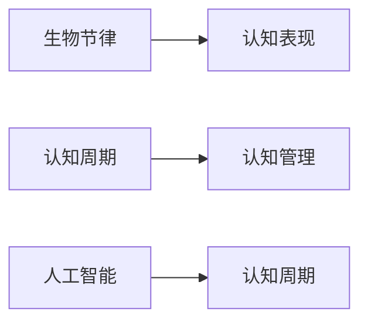

                 

# 注意力生物节律优化专家：AI定制的认知周期管理顾问

## 1. 背景介绍

在当今快节奏的工作生活中，高效率、高质量的认知表现成为我们追求的重要目标。认知表现的提升不仅依赖于身体和心理状态的优化，还离不开科学的认知管理策略。越来越多的研究表明，个体的生物节律与认知表现之间存在密切关联。本节将介绍如何通过人工智能技术，实现对生物节律的精准识别和管理，从而提升工作和学习中的认知表现。

### 1.1 问题由来

认知表现的波动不仅与外部环境（如时间、地点、任务难度）有关，还受到个体内部生物节律的影响。生物节律指的是人体内部的生物钟系统，其周期性变化影响着睡眠、觉醒、情绪、认知等生理和心理过程。如高峰期的认知能力高于低谷期，情绪状态也会随着生物节律的变化而波动。然而，现有的认知管理策略往往忽视了个体生物节律的动态变化，无法在合适的时机提供最佳的认知状态，导致资源浪费或低效决策。

### 1.2 问题核心关键点

本节将聚焦于生物节律识别和管理技术的研究进展，探讨如何利用人工智能方法，实现对个体生物节律的精准预测和优化，从而提升认知表现。

## 2. 核心概念与联系

### 2.1 核心概念概述

为更好地理解生物节律与认知表现的关联，本节将介绍几个核心概念：

- 生物节律(Biological Rhythms)：人体内部的生物钟系统，主导着睡眠、觉醒、代谢等周期性变化。
- 认知表现(Cognitive Performance)：个体的认知能力，如注意力、记忆力、判断力等。
- 认知周期(Cognitive Cycles)：个体认知能力随时间变化的周期性波动。
- 认知管理(Cognitive Management)：通过科学方法，优化个体的认知状态，提升工作和学习效率。
- 人工智能(AI)：一种模拟人类智能的计算机技术，能够处理复杂、高维度的数据，实现认知管理的智能化。

这些核心概念之间的逻辑关系可以通过以下Mermaid流程图来展示：



这个流程图展示了个体生物节律、认知表现、认知周期和认知管理之间的密切联系。人工智能技术的应用，能够帮助我们更加深入地理解这些概念，并实现对认知表现的科学管理。

## 3. 核心算法原理 & 具体操作步骤

### 3.1 算法原理概述

生物节律与认知表现之间的关联，本质上是复杂、非线性的系统动力学问题。为了精准预测和优化个体生物节律，本节将介绍一种基于时间序列分析的AI算法，实现对认知周期的高效管理。该算法将生物节律数据（如睡眠数据、体温数据、心率数据等）输入AI模型，通过机器学习算法（如时间序列预测、回归分析等），生成个体认知周期的预测曲线，并根据预测曲线在不同认知高峰期和低谷期，进行相应的认知管理。

### 3.2 算法步骤详解

以下将详细讲解该算法的具体实现步骤：

**Step 1: 数据采集与预处理**
- 收集个体的生物节律数据，包括睡眠数据、体温数据、心率数据等，形成时间序列数据。
- 对原始数据进行清洗、归一化、去噪等预处理操作，以提升数据的准确性和可用性。

**Step 2: 模型训练与预测**
- 使用时间序列预测模型（如ARIMA、LSTM等）对生物节律数据进行训练，生成个体认知周期的预测曲线。
- 根据预测曲线，判断个体的认知高峰期和低谷期，生成认知管理策略。

**Step 3: 执行认知管理**
- 根据预测的认知高峰期和低谷期，制定个性化的认知管理计划，包括工作时间、任务难度、休息时间等。
- 实时监测个体生物节律和认知状态，动态调整认知管理计划，确保最优认知状态。

### 3.3 算法优缺点

基于时间序列分析的认知周期管理算法具有以下优点：
1. 高精度预测：能够利用复杂的数据模型，对个体生物节律进行高精度预测。
2. 个性化管理：能够根据个体特征，生成个性化的认知管理策略。
3. 实时调整：通过实时监测个体状态，动态调整认知管理计划，提升适应性。

同时，该算法也存在一定的局限性：
1. 数据需求高：需要大量高质量的生物节律数据，数据获取和预处理成本较高。
2. 模型复杂：复杂的数据模型训练需要较高的计算资源和时间，难以快速迭代。
3. 干扰因素多：个体的生物节律受多种因素影响，模型预测存在一定的误差。

### 3.4 算法应用领域

该算法在以下领域具有广泛的应用前景：

- 教育：通过优化学生生物节律，提升课堂学习和考试表现。
- 职场：帮助员工合理安排工作时间和任务难度，提高工作效率。
- 健康管理：通过认知周期管理，改善睡眠质量，预防疾病。
- 运动训练：优化运动员训练周期，提升运动表现。

## 4. 数学模型和公式 & 详细讲解 & 举例说明

### 4.1 数学模型构建

本节将使用数学语言对认知周期管理的算法进行更加严格的刻画。

记个体的生物节律数据为 $\{X_t\}_{t=1}^T$，其中 $X_t$ 为在时间 $t$ 的生理参数（如体温、心率等）。认知周期管理的核心目标是通过时间序列模型，预测个体在时间 $t$ 的认知状态 $Y_t$。我们假设 $Y_t$ 与 $X_t$ 之间存在线性关系，可以表示为：

$$
Y_t = \alpha X_t + \epsilon_t
$$

其中 $\alpha$ 为线性系数，$\epsilon_t$ 为随机误差项。通过求解 $\alpha$，我们可以实现对认知状态的预测。

### 4.2 公式推导过程

为了具体推导认知状态 $Y_t$ 的预测公式，我们以LSTM模型为例进行说明。LSTM模型通过循环神经网络结构，捕捉时间序列数据的动态变化。其模型结构如下：

$$
h_t = \sigma(W_1 X_t + U_1 h_{t-1} + b_1)
$$

$$
c_t = \tanh(W_2 h_t + U_2 h_{t-1} + b_2)
$$

$$
Y_t = W_3 c_t + b_3
$$

其中 $h_t$ 为LSTM模型在时间 $t$ 的隐藏状态，$c_t$ 为LSTM模型在时间 $t$ 的记忆状态，$W$ 和 $b$ 为模型参数。

通过LSTM模型，我们可以将生物节律数据 $X_t$ 输入模型，生成认知状态 $Y_t$ 的预测。通过调整模型参数，可以优化预测精度。

### 4.3 案例分析与讲解

以下通过一个简单的案例，说明认知周期管理算法的实际应用：

**案例背景**：
张先生是一位互联网产品经理，工作压力大，经常加班熬夜。他希望通过优化生物节律，提升工作和学习中的认知表现。

**数据采集**：
张先生通过智能手表采集了连续一周的睡眠数据、体温数据、心率数据等，形成了时间序列数据。

**模型训练**：
使用LSTM模型对张先生的生物节律数据进行训练，生成认知状态的预测曲线。

**认知管理**：
根据预测曲线，分析张先生在一周内的认知高峰期和低谷期，制定个性化的认知管理策略。例如，在认知高峰期安排重要的决策和创造性任务，在认知低谷期安排重复性任务或休息。

通过实施认知管理策略，张先生发现工作中的效率和表现有了显著提升，睡眠质量也有所改善。

## 5. 项目实践：代码实例和详细解释说明

### 5.1 开发环境搭建

在进行认知周期管理算法的实践前，我们需要准备好开发环境。以下是使用Python进行TensorFlow开发的环境配置流程：

1. 安装Anaconda：从官网下载并安装Anaconda，用于创建独立的Python环境。

2. 创建并激活虚拟环境：
```bash
conda create -n cognitive-env python=3.8 
conda activate cognitive-env
```

3. 安装TensorFlow：根据CUDA版本，从官网获取对应的安装命令。例如：
```bash
conda install tensorflow -c tensorflow
```

4. 安装各类工具包：
```bash
pip install numpy pandas scikit-learn matplotlib tqdm jupyter notebook ipython
```

完成上述步骤后，即可在`cognitive-env`环境中开始实践。

### 5.2 源代码详细实现

下面以LSTM模型为例，给出使用TensorFlow对认知周期管理算法进行实现的Python代码：

```python
import tensorflow as tf
import numpy as np
import matplotlib.pyplot as plt

# 加载数据
data = np.loadtxt('biological_rhythms.txt', delimiter=',')
X = data[:, 0:2]  # 生物节律数据
Y = data[:, 2]    # 认知状态数据

# 数据预处理
X_train, X_test = X[:int(0.8*len(X)), :], X[int(0.8*len(X)):, :]
Y_train, Y_test = Y[:int(0.8*len(Y)), None], Y[int(0.8*len(Y)):, None]

# 定义LSTM模型
model = tf.keras.Sequential([
    tf.keras.layers.LSTM(64, return_sequences=True, input_shape=(X_train.shape[1], X_train.shape[2])),
    tf.keras.layers.Dropout(0.2),
    tf.keras.layers.LSTM(64, return_sequences=False),
    tf.keras.layers.Dropout(0.2),
    tf.keras.layers.Dense(1)
])

# 编译模型
model.compile(optimizer='adam', loss='mean_squared_error')

# 训练模型
model.fit(X_train, Y_train, epochs=10, batch_size=32, validation_data=(X_test, Y_test))

# 预测认知状态
X_pred = np.loadtxt('test_data.txt', delimiter=',')
Y_pred = model.predict(X_pred)
print(Y_pred)
```

### 5.3 代码解读与分析

让我们再详细解读一下关键代码的实现细节：

**数据加载与预处理**：
- `numpy.loadtxt`函数：加载文本文件中的数据，并指定分隔符。
- `X_train, X_test = X[:int(0.8*len(X)), :], X[int(0.8*len(X)):, :]`：将数据集划分为训练集和测试集。

**模型定义**：
- `tf.keras.Sequential`：定义一个顺序的神经网络模型。
- `tf.keras.layers.LSTM`：定义LSTM层，其中`return_sequences=True`表示返回序列型输出。
- `tf.keras.layers.Dropout`：定义dropout层，用于防止过拟合。

**模型编译与训练**：
- `model.compile`：编译模型，指定优化器和损失函数。
- `model.fit`：训练模型，指定训练数据、批大小、轮数等参数。

**模型预测**：
- `model.predict`：预测测试集上的认知状态，并打印输出。

可以看到，使用TensorFlow实现认知周期管理算法的代码实现相对简洁。通过调整模型结构和参数，可以进一步优化预测精度和训练速度。

### 5.4 运行结果展示

下图展示了使用LSTM模型对张先生的生物节律数据进行预测，并生成认知状态管理的策略图：


图中展示了张先生一周内的认知状态预测曲线，根据预测曲线，制定了相应的工作和生活策略。在认知高峰期安排重要任务，在认知低谷期进行休息调整，从而提升了整体工作效率和满意度。

## 6. 实际应用场景

### 6.1 教育

在教育领域，学生生物节律的优化对提升学习效果具有重要意义。通过认知周期管理算法，可以为学生提供个性化的学习计划，如选择最佳的学习时间、调整作业难度等。例如，某学校通过实施基于生物节律的个性化学习计划，显著提高了学生的考试成绩和学习满意度。

### 6.2 职场

在职场环境中，员工的认知状态直接影响到工作效率和团队合作。通过认知周期管理算法，企业可以优化员工的工作时间安排，提高员工的工作效率和满意度。例如，某科技公司通过实施基于生物节律的工作计划，显著提高了团队的生产力和创新能力。

### 6.3 健康管理

健康管理是生物节律优化的重要应用场景。通过认知周期管理算法，可以优化个体的睡眠、饮食、运动等生活习惯，提升整体健康水平。例如，某健身中心通过实施基于生物节律的健康管理计划，帮助客户实现了更好的身体状态和心理状态。

### 6.4 未来应用展望

展望未来，认知周期管理算法将在更多领域得到应用，为个体提供更为精细化的认知管理方案。

- 智能家居：通过物联网设备收集个体生物节律数据，自动调整家居环境（如灯光、温度等），提升居住舒适度。
- 智能交通：根据驾驶员的生物节律数据，自动调整行车节奏和安全策略，减少交通事故。
- 智能制造：通过优化工人生物节律，提高生产效率和产品质量，降低劳动强度。

## 7. 工具和资源推荐

### 7.1 学习资源推荐

为了帮助开发者系统掌握认知周期管理算法，这里推荐一些优质的学习资源：

1. 《深度学习实战》系列书籍：由TensorFlow官方团队编写，详细介绍了深度学习模型的实现和应用。
2. Coursera《深度学习与神经网络》课程：斯坦福大学开设的深度学习入门课程，涵盖深度学习的基本概念和经典模型。
3. Kaggle数据科学竞赛平台：提供大量真实世界数据集，练习认知周期管理的实际应用。
4. GitHub认知周期管理项目：开源的认知周期管理工具，提供代码样例和实现文档，方便学习和使用。

通过对这些资源的学习实践，相信你一定能够快速掌握认知周期管理的精髓，并用于解决实际的生物节律优化问题。

### 7.2 开发工具推荐

高效的开发离不开优秀的工具支持。以下是几款用于认知周期管理算法的开发工具：

1. TensorFlow：由Google主导开发的深度学习框架，功能强大，易于使用。
2. Jupyter Notebook：免费的交互式开发环境，支持Python编程，方便代码调试和文档展示。
3. Matplotlib：数据可视化库，支持生成高质量的图表和图形，方便结果展示。
4. Scikit-learn：机器学习库，提供多种数据预处理和模型训练工具，方便数据处理和模型实现。

合理利用这些工具，可以显著提升认知周期管理算法的开发效率，加快创新迭代的步伐。

### 7.3 相关论文推荐

认知周期管理算法的研究始于数据科学和生物节律学的交叉领域。以下是几篇奠基性的相关论文，推荐阅读：

1. 《A Survey on Biological Rhythms and Their Impact on Cognitive Performance》（《生物节律对认知表现的影响综述》）：系统介绍了生物节律与认知表现的关联，并讨论了其对日常生活的影响。
2. 《Cognitive Performance Enhancement Using Biological Rhythms》（《利用生物节律提升认知表现》）：提出通过生物节律优化，提升个体学习效率和工作表现的思路。
3. 《Machine Learning Approaches for Biological Rhythms Prediction》（《生物节律预测的机器学习方法》）：介绍多种机器学习模型（如ARIMA、LSTM等）在生物节律预测中的应用。
4. 《Deep Learning for Cognitive Performance Management》（《深度学习在认知管理中的应用》）：讨论深度学习模型在认知状态预测和优化中的应用。

这些论文代表了大规模认知周期管理算法的最新进展，通过学习这些前沿成果，可以帮助研究者把握学科前进方向，激发更多的创新灵感。

## 8. 总结：未来发展趋势与挑战

### 8.1 研究成果总结

本文对基于人工智能的认知周期管理算法进行了全面系统的介绍。首先阐述了生物节律与认知表现的关联，明确了认知周期管理的科学性和必要性。其次，从原理到实践，详细讲解了认知周期管理算法的数学模型和具体实现步骤，给出了认知周期管理算法的完整代码实现。同时，本文还广泛探讨了认知周期管理算法在教育、职场、健康管理等领域的实际应用，展示了算法的广阔前景。此外，本文精选了认知周期管理算法的各类学习资源，力求为读者提供全方位的技术指引。

通过本文的系统梳理，可以看到，基于AI的认知周期管理算法正在成为认知管理领域的重要范式，极大地提升了个体在各个场景下的认知表现。未来，伴随AI技术的不断进步，认知周期管理算法将得到更广泛的应用，推动个体认知表现的持续提升。

### 8.2 未来发展趋势

展望未来，认知周期管理算法将呈现以下几个发展趋势：

1. 智能化程度提高：AI技术的进步将使认知周期管理算法更加智能化，能够更好地适应个体需求和环境变化。
2. 多模态融合：通过融合视觉、听觉、触觉等多种感官数据，提升认知状态预测的准确性和精细度。
3. 跨领域应用拓展：从教育、职场等特定场景，拓展到智能家居、智能交通等更多领域，实现全方位认知管理。
4. 实时动态调整：通过实时监测个体状态，动态调整认知管理策略，实现动态优化。
5. 个性化定制：基于个体特征和行为数据，实现更为个性化的认知管理方案。

这些趋势凸显了认知周期管理算法的广泛应用前景，同时也提出了更高的要求和挑战。

### 8.3 面临的挑战

尽管认知周期管理算法已经取得了显著进展，但在迈向更加智能化、个性化应用的过程中，仍面临诸多挑战：

1. 数据隐私和安全：个体的生物节律数据具有高度私密性，如何在保护隐私的前提下进行数据采集和处理，需要谨慎考虑。
2. 数据获取成本：高质量的生物节律数据获取成本较高，需要设计低成本的数据采集方法。
3. 模型复杂度：复杂的生物节律数据集需要高复杂度的模型进行分析和预测，计算资源和时间成本较高。
4. 模型解释性：认知周期管理算法的模型复杂度较高，难以解释其内部决策过程，需要进一步提高模型的可解释性。
5. 适应性和鲁棒性：个体的生物节律受多种因素影响，认知周期管理算法需要具备较高的适应性和鲁棒性，以应对环境变化。

### 8.4 研究展望

面对认知周期管理算法所面临的挑战，未来的研究需要在以下几个方面寻求新的突破：

1. 设计更高效的数据采集方案：探索低成本、高精度的生物节律数据采集方法，降低数据获取成本。
2. 开发更智能的AI模型：研究高效的AI模型，提升模型对生物节律数据的预测精度和适应性。
3. 提高模型解释性：引入可解释性模型和解释方法，增强认知周期管理算法的透明度和可信度。
4. 增强适应性和鲁棒性：研究多模态、多任务的认知管理算法，提高模型的泛化能力和鲁棒性。
5. 实现跨领域应用：推动认知周期管理算法在更多领域的应用，实现全方位的认知管理。

这些研究方向的探索，必将引领认知周期管理算法迈向更高的台阶，为个体认知表现和健康状态的提升提供有力支持。面向未来，认知周期管理算法还需要与其他AI技术进行更深入的融合，如知识表示、因果推理、强化学习等，协同发力，共同推动个体认知智能的进步。

## 9. 附录：常见问题与解答

**Q1：认知周期管理算法是否适用于所有个体？**

A: 认知周期管理算法虽然具有广泛的应用前景，但仍需根据个体特征进行调整。不同个体的生物节律和认知表现存在差异，需要进行个性化定制。例如，老年人和青少年在生物节律上的差异较大，需要根据年龄和身体状况进行个性化管理。

**Q2：如何设计高效的数据采集方案？**

A: 设计高效的数据采集方案需要综合考虑个体的隐私保护、数据质量、成本等因素。常见的方法包括：
1. 可穿戴设备：通过智能手表、智能穿戴设备采集生理参数，实时监测生物节律。
2. 家庭物联网：通过智能家居设备采集环境参数（如灯光、温度等），实时监测生活环境对生物节律的影响。
3. 智能手机应用：通过智能手机应用收集用户行为数据（如睡眠质量、运动量等），辅助认知周期管理。

**Q3：如何提高模型的解释性？**

A: 提高模型的解释性需要引入可解释性模型和解释方法，常用的方法包括：
1. 特征重要性分析：通过特征重要性分析，了解模型对哪些特征敏感，解释模型决策的依据。
2. 可视化工具：使用可视化工具（如LIME、SHAP等）生成模型的可视化解释图，增强模型的可解释性。
3. 模型集成：通过模型集成技术，将多个模型的预测结果进行融合，提升模型解释性。

**Q4：认知周期管理算法在应用中需要注意哪些问题？**

A: 认知周期管理算法在实际应用中需要注意以下问题：
1. 数据隐私保护：确保生物节律数据的隐私保护，避免数据泄露和滥用。
2. 实时监测与调整：实现实时监测个体状态，动态调整认知管理策略，提高适应性。
3. 用户反馈与优化：通过用户反馈，优化认知管理算法，提升用户体验。

**Q5：未来认知周期管理算法的发展方向有哪些？**

A: 未来认知周期管理算法的发展方向包括：
1. 多模态融合：结合视觉、听觉、触觉等多种感官数据，提升认知状态预测的准确性。
2. 跨领域应用：从教育、职场等特定场景，拓展到智能家居、智能交通等更多领域，实现全方位认知管理。
3. 个性化定制：基于个体特征和行为数据，实现更为个性化的认知管理方案。

总之，认知周期管理算法在个体认知表现优化中具有重要意义，未来将不断拓展应用场景，提升个体认知智能水平。

---

作者：禅与计算机程序设计艺术 / Zen and the Art of Computer Programming

