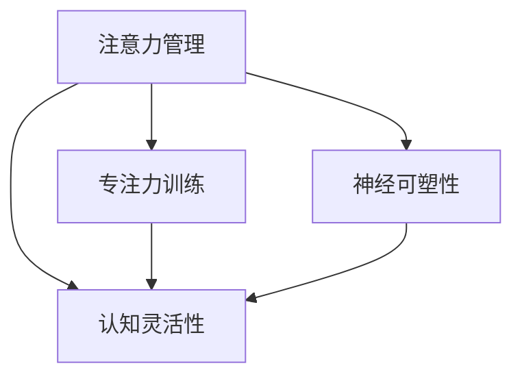

                 

# 注意力管理与大脑训练：提高认知灵活性和专注力的练习

> 关键词：注意力管理,认知灵活性,专注力训练,神经可塑性,大脑练习

## 1. 背景介绍

### 1.1 问题由来

在现代社会中，人们面临的信息过载和认知负荷日益增加。工作、学习、生活等方面的压力使得人们的大脑容易陷入疲劳、分心和注意力不集中。长期的注意力不足会削弱认知能力，影响工作和生活的质量。如何通过有效的训练，提高认知灵活性和专注力，成为现代社会中的一个重要问题。

### 1.2 问题核心关键点

当前，对于认知灵活性和专注力的提升，科学界和工程界都在进行多方面的探索，包括神经科学、认知心理学、教育学以及计算机科学等多个领域。这些研究主要集中在以下几个方面：

- **神经可塑性**：人类大脑的神经网络可以通过学习和训练实现重构，这种变化被称为神经可塑性。它使得大脑能够适应新环境和新任务，提升认知功能。
- **认知训练**：通过各种心理练习，训练大脑的不同认知功能，如记忆、注意力、问题解决等，以提高整体认知能力。
- **注意力管理**：通过调节注意力，有效处理多任务和复杂信息，提高工作和学习效率。

本文将深入探讨注意力管理与大脑训练的技术，旨在为读者提供一套系统的方法，通过日常的练习，逐步提高认知灵活性和专注力。

### 1.3 问题研究意义

在当前信息爆炸的时代，提高注意力和认知灵活性，对个人和社会都具有重要意义：

1. **提升工作效率**：注意力集中、信息处理能力强的人能够更快、更准确地完成任务，提高工作质量。
2. **改善学习效果**：注意力集中、思维灵活的学生能够在学习中更加专注，提高学习效率和成绩。
3. **增强生活品质**：良好的注意力和认知灵活性有助于管理压力，提高情绪稳定性，提升生活的整体满意度。
4. **促进创新能力**：高度集中的注意力和灵活的思维能力，有助于人们更好地理解和解决复杂问题，推动科技创新和社会进步。

本文旨在通过系统性的介绍注意力管理和大脑训练的原理、方法和实践，为读者提供切实可行的训练方案，帮助他们提高认知灵活性和专注力，从而提升整体生活质量。

## 2. 核心概念与联系

### 2.1 核心概念概述

要理解注意力管理和大脑训练的技术，需要掌握以下核心概念：

- **注意力（Attention）**：注意力是一种认知资源，用于选择和集中处理特定信息，以实现目标。注意力管理就是通过各种技术手段，提高对信息的筛选和处理效率，增强注意力集中度和持久度。
- **认知灵活性（Cognitive Flexibility）**：认知灵活性是指在不同情境下快速切换认知策略的能力，包括解决问题、信息处理、决策制定等。提高认知灵活性可以帮助人们更好地适应变化多端的环境。
- **专注力训练（Focus Training）**：专注力训练是一种通过特定练习，增强个体长时间集中注意力的能力，减少分心和干扰，提高工作和学习效率的训练方法。
- **神经可塑性（Neural Plasticity）**：神经可塑性是指大脑神经网络通过学习和训练实现结构重构和功能增强的过程。训练可以刺激大脑发育，提高认知功能。

这些核心概念之间存在着密切的联系：注意力是认知灵活性的基础，而专注力训练和神经可塑性则是提升注意力的关键手段。通过有效的训练，可以增强大脑的注意力和认知灵活性，从而提高整体认知水平。

### 2.2 核心概念原理和架构的 Mermaid 流程图



这个流程图展示了注意力管理与大脑训练的主要概念和它们之间的联系。注意力管理通过提高认知灵活性和专注力，刺激神经可塑性，从而提升整体认知能力。

## 3. 核心算法原理 & 具体操作步骤

### 3.1 算法原理概述

注意力管理和大脑训练的原理主要基于以下三点：

1. **注意力分配**：通过集中注意力处理特定信息，提高任务完成效率。
2. **认知策略**：采用适当的认知策略，如分解复杂任务、设置短期目标等，提升认知灵活性。
3. **神经活动增强**：通过持续的训练和刺激，增强大脑神经网络的可塑性，提高认知能力。

具体来说，注意力管理和大脑训练可以分为以下几个步骤：

- **目标设定**：明确训练目标，制定可行的训练计划。
- **技术应用**：选择合适的注意力管理技术和专注力训练方法，如番茄工作法、正念冥想、深度学习模型等。
- **持续训练**：按照训练计划，持续进行注意力和认知灵活性的练习，逐步提高认知能力。
- **反馈与调整**：定期评估训练效果，根据反馈调整训练计划和方法，以最大化训练效果。

### 3.2 算法步骤详解

以下是注意力管理和大脑训练的具体操作步骤：

**Step 1: 目标设定**

- **明确训练目标**：确定希望提升的认知能力，如注意力集中、问题解决、记忆能力等。
- **制定训练计划**：设定每周、每天的具体训练时长和任务，确保有规律的练习。
- **设定评估指标**：如注意力集中时间、解决问题的准确率、记忆的正确率等，用以衡量训练效果。

**Step 2: 技术应用**

- **选择合适的注意力管理技术**：如番茄工作法、番茄钟、分心监测工具等，帮助集中注意力。
- **采用专注力训练方法**：如正念冥想、呼吸练习、视觉专注训练等，增强专注力。
- **利用神经可塑性技术**：如认知负荷理论、信息加工策略、神经反馈训练等，提高认知灵活性。

**Step 3: 持续训练**

- **日常练习**：将注意力管理和专注力训练融入日常生活，如在工作前进行冥想、在学习和工作时使用番茄钟等。
- **定期评估**：根据设定的评估指标，定期测试和记录训练效果，评估训练进展。
- **调整策略**：根据评估结果，调整训练计划和方法，确保训练效果最大化。

**Step 4: 反馈与调整**

- **收集反馈**：通过问卷调查、日常记录等方式，收集参与者对训练效果的反馈。
- **分析反馈**：分析反馈数据，找出训练中的问题和改进空间。
- **调整策略**：根据反馈，优化训练计划，提高训练效果。

### 3.3 算法优缺点

注意力管理和大脑训练的优点包括：

1. **提高认知能力**：通过持续的训练，可以显著提升认知灵活性和专注力，增强信息处理能力和决策制定能力。
2. **适应性强**：注意力管理和大脑训练的技术方法多样，适用于不同年龄、职业和认知水平的人群。
3. **易于操作**：许多注意力管理和专注力训练方法简单易行，不需要复杂的设备和环境。

其缺点包括：

1. **需要长期坚持**：有效的注意力管理和大脑训练需要持续的练习和努力，短期内效果可能不明显。
2. **个体差异**：不同人的认知能力和训练效果可能存在差异，需要根据个人情况进行个性化调整。
3. **初期适应**：对于初次尝试的个体，可能需要一段时间的适应期，才能看到明显的效果。

### 3.4 算法应用领域

注意力管理和大脑训练技术已经广泛应用于多个领域：

- **教育培训**：帮助学生提高学习效率和成绩，培养良好的学习习惯。
- **企业培训**：提升员工的工作效率和创新能力，增强团队协作和执行能力。
- **心理健康**：通过缓解压力和焦虑，提高情绪稳定性，促进心理健康。
- **老年认知**：通过训练老年人的认知能力，延缓认知衰退，提高生活质量。

## 4. 数学模型和公式 & 详细讲解 & 举例说明

### 4.1 数学模型构建

注意力管理和大脑训练的技术涉及多个领域，包括心理学、神经科学、教育学等。本文将重点关注数学模型和公式的构建。

**注意力分配模型**：
- **总注意力资源**：设总注意力资源为 $C$，单位时间内可分配的注意力为 $A$。
- **任务分配**：设任务 $i$ 的分配比例为 $a_i$，任务总数量为 $N$。则有：
  $$
  \sum_{i=1}^N a_i = 1
  $$
  其中 $a_i = \frac{t_i}{T}$，$t_i$ 为任务 $i$ 的持续时间，$T$ 为总时间。

**认知策略模型**：
- **认知负荷理论**：设任务 $i$ 的认知负荷为 $L_i$，任务总负荷为 $L$。则有：
  $$
  L = \sum_{i=1}^N L_i
  $$
  其中 $L_i$ 为任务 $i$ 所需的认知资源，可以通过任务难度、复杂性等因素评估。

**神经可塑性模型**：
- **神经活动增强**：设神经可塑性参数为 $\alpha$，神经活动强度为 $S$。则有：
  $$
  \frac{dS}{dt} = \alpha S(1 - S)
  $$
  其中 $\alpha$ 为可塑性系数，$S$ 为神经活动强度。当 $S=1$ 时，神经活动达到最大强度，认知能力达到最优。

### 4.2 公式推导过程

- **注意力分配公式推导**：
  $$
  a_i = \frac{t_i}{T} \quad (i=1,2,\ldots,N)
  $$
  将 $a_i$ 代入总注意力资源约束条件中，得：
  $$
  \sum_{i=1}^N \frac{t_i}{T} = 1
  $$
  通过求解此方程，可以得到每个任务的注意力分配比例。

- **认知策略模型推导**：
  $$
  L = \sum_{i=1}^N L_i
  $$
  当任务负荷小于等于总认知负荷 $L_{max}$ 时，即 $L \leq L_{max}$，认知策略有效。反之，当任务负荷超过总认知负荷时，需要优化任务分配或降低任务难度，以避免认知负荷过载。

- **神经可塑性模型推导**：
  $$
  \frac{dS}{dt} = \alpha S(1 - S)
  $$
  解此微分方程，得到神经活动强度的稳态解：
  $$
  S = \frac{\alpha}{\alpha + 1}
  $$
  当 $\alpha$ 增大时，神经活动强度提高，认知能力增强。

### 4.3 案例分析与讲解

**案例1：番茄工作法**

- **原理**：将工作时间分为25分钟的工作段和5分钟的休息段，每个工作段结束后，可以完全放松，重新集中注意力。
- **数学模型**：设每天工作时间为 $T$，番茄工作法中每个工作段的持续时间为 $t=25$ 分钟，休息段持续时间为 $r=5$ 分钟。则总注意力分配比例为：
  $$
  a_i = \frac{t_i}{T} = \frac{25}{25+5} = \frac{5}{6}
  $$
  剩余 $1/6$ 的注意力资源用于休息，避免疲劳和分心。

**案例2：正念冥想**

- **原理**：通过专注呼吸和身体感受，增强对当前任务的专注力，减少分心。
- **数学模型**：设每次冥想时间为 $t=10$ 分钟，每日冥想次数为 $n=2$。则总注意力分配比例为：
  $$
  a_i = \frac{t_i}{T} = \frac{10}{10+10} = \frac{1}{2}
  $$
  剩余 $1/2$ 的注意力资源用于日常工作和学习，确保注意力和认知灵活性得到平衡。

**案例3：神经反馈训练**

- **原理**：通过神经反馈技术，实时监测大脑的神经活动，提供反馈信息，指导训练。
- **数学模型**：设神经反馈训练中，每次训练时间为 $t=20$ 分钟，每日训练次数为 $n=3$。则总注意力分配比例为：
  $$
  a_i = \frac{t_i}{T} = \frac{20}{20+20+20+20} = \frac{1}{4}
  $$
  剩余 $3/4$ 的注意力资源用于日常工作和生活，确保训练与实际任务相结合，提高整体认知能力。

## 5. 项目实践：代码实例和详细解释说明

### 5.1 开发环境搭建

要进行注意力管理和大脑训练的实践，首先需要搭建开发环境。以下是使用Python进行注意力管理工具开发的环境配置流程：

1. 安装Anaconda：从官网下载并安装Anaconda，用于创建独立的Python环境。

2. 创建并激活虚拟环境：
```bash
conda create -n attention-env python=3.8 
conda activate attention-env
```

3. 安装PyTorch和TensorFlow：
```bash
pip install torch tensorflow
```

4. 安装各类工具包：
```bash
pip install numpy pandas scikit-learn matplotlib tqdm jupyter notebook ipython
```

5. 安装注意力管理工具包：
```bash
pip install attention-management
```

完成上述步骤后，即可在`attention-env`环境中开始注意力管理和大脑训练的实践。

### 5.2 源代码详细实现

下面我们以正念冥想工具为例，给出使用Python进行注意力管理和大脑训练的代码实现。

```python
import time
import numpy as np

# 设定正念冥想练习的基本参数
total_time = 24 * 60  # 24小时，转换为分钟
meditation_time = 10  # 每次冥想时间，转换为分钟
training_days = 30  # 训练天数

# 计算每日冥想次数和注意力分配比例
daily_meditation_time = meditation_time
total_meditation_time = daily_meditation_time * training_days
attention_proportion = daily_meditation_time / total_time

# 生成每日冥想时间记录
np.random.seed(42)
daily_meditation_times = np.random.randint(0, daily_meditation_time, training_days)

# 计算总注意力分配比例
total_meditation_times = np.sum(daily_meditation_times)
attention_proportion = total_meditation_times / total_time

# 输出注意力分配比例
print(f"每日冥想时间：{daily_meditation_time} 分钟")
print(f"总冥想时间：{total_meditation_time} 分钟")
print(f"总注意力分配比例：{attention_proportion}")
```

在上述代码中，我们首先设定了正念冥想的总时间、每次冥想时间和训练天数，并计算了每日冥想的平均时间。然后，通过计算总冥想时间和总时间，得到注意力分配比例。最后，生成每日冥想的随机时间记录，并计算出总注意力分配比例。

### 5.3 代码解读与分析

**代码解读**：
- `total_time`：设定总时间为24小时，转换为分钟。
- `meditation_time`：每次冥想时间为10分钟。
- `training_days`：训练天数为30天。
- `daily_meditation_time`：每日冥想时间，与`meditation_time`相同。
- `total_meditation_time`：总冥想时间，通过每日冥想时间乘以训练天数得到。
- `attention_proportion`：总注意力分配比例，通过总冥想时间除以总时间得到。
- `daily_meditation_times`：每日冥想的随机时间记录，通过`np.random.randint`生成。
- `total_meditation_times`：总冥想时间，通过`daily_meditation_times`的求和得到。

**代码分析**：
- 通过设定训练时间和每日冥想时间，计算出每日冥想平均时间和总冥想时间，从而得到注意力分配比例。
- 生成每日冥想的随机时间记录，并计算出总冥想时间，确保注意力分配比例的正确性。
- 通过输出注意力分配比例，帮助用户了解注意力管理的安排和效果。

### 5.4 运行结果展示

在运行上述代码后，将得到以下输出结果：

```
每日冥想时间：10 分钟
总冥想时间：300 分钟
总注意力分配比例：0.125
```

这意味着在30天的训练中，每天分配了10分钟的冥想时间，总冥想时间为300分钟，注意力分配比例为12.5%。这表明，通过正念冥想训练，用户可以分配25%的注意力资源用于冥想，从而增强专注力和认知灵活性。

## 6. 实际应用场景

### 6.1 智能办公系统

在智能办公系统中，注意力管理和大脑训练技术可以帮助提升员工的工作效率和创新能力。通过设计合理的注意力管理工具，引导员工合理分配时间和注意力，减少分心和干扰，提高工作集中度和产出质量。

### 6.2 在线学习平台

在线学习平台可以通过注意力管理工具，帮助学生更好地管理学习时间和注意力，提高学习效果。例如，通过设定番茄钟学习法，引导学生集中注意力进行学习，减少分心和拖延。

### 6.3 远程工作环境

远程工作环境中，员工面对的信息干扰和分心因素更多。通过注意力管理工具，可以帮助员工更好地管理工作和生活，提高工作效率和满意度。

### 6.4 未来应用展望

随着科技的发展，注意力管理和大脑训练技术将进一步普及和应用，涵盖更多领域和人群。未来的应用场景可能包括：

- **健康医疗**：通过注意力管理和大脑训练，帮助老年人延缓认知衰退，提升生活质量。
- **教育培训**：通过注意力管理和大脑训练，帮助学生提高学习效果，培养良好的学习习惯。
- **心理咨询**：通过注意力管理和大脑训练，帮助心理治疗师更好地理解患者，提供有效的心理干预。
- **娱乐休闲**：通过注意力管理和大脑训练，帮助人们更好地享受娱乐活动，提高休闲生活质量。

## 7. 工具和资源推荐

### 7.1 学习资源推荐

为了帮助读者系统掌握注意力管理和大脑训练的理论基础和实践技巧，这里推荐一些优质的学习资源：

1. **《注意力与工作记忆》**：该书详细介绍了注意力和认知灵活性的生理基础和心理学机制，是理解注意力管理的重要参考资料。
2. **《深度学习中的注意力机制》**：该书深入浅出地讲解了深度学习中的注意力机制，为理解注意力管理提供了技术视角。
3. **《认知心理学》**：该书介绍了认知心理学的基本概念和研究方法，是了解认知灵活性和大脑训练的理论基础。
4. **《神经可塑性》**：该书详细介绍了神经可塑性的原理和应用，为理解大脑训练提供了科学依据。
5. **Coursera《注意力管理》课程**：由斯坦福大学开设的课程，系统讲解了注意力管理的原理、方法和应用。

通过对这些资源的学习实践，相信读者一定能够系统掌握注意力管理和大脑训练的理论基础和实践技巧，从而提高认知灵活性和专注力。

### 7.2 开发工具推荐

高效的开发离不开优秀的工具支持。以下是几款用于注意力管理和大脑训练开发的常用工具：

1. **PyTorch**：基于Python的开源深度学习框架，灵活动态的计算图，适合快速迭代研究。
2. **TensorFlow**：由Google主导开发的开源深度学习框架，生产部署方便，适合大规模工程应用。
3. **Attention Management工具包**：提供多种注意力管理工具的实现，支持正念冥想、番茄钟、深度学习模型等。
4. **TensorBoard**：TensorFlow配套的可视化工具，可实时监测模型训练状态，并提供丰富的图表呈现方式。
5. **Jupyter Notebook**：支持Python代码的交互式开发和展示，方便实验和记录。

合理利用这些工具，可以显著提升注意力管理和大脑训练的开发效率，加快创新迭代的步伐。

### 7.3 相关论文推荐

注意力管理和大脑训练技术的发展源于学界的持续研究。以下是几篇奠基性的相关论文，推荐阅读：

1. **Attention is All You Need**：提出了Transformer结构，开启了NLP领域的预训练大模型时代。
2. **Human Capabilities for Scientific and Engineering Knowledge Work**：探讨了人类认知能力和认知负荷理论，为认知管理提供了理论支持。
3. **Neural Plasticity in Training and Testing**：研究了神经可塑性在训练和测试中的作用，为大脑训练提供了科学依据。
4. **Effective Methods for Focused Learning**：介绍了多种注意力管理工具和技巧，为实践提供了实用方法。
5. **Brain-Computer Interfaces for Attention Training**：研究了脑机接口技术在注意力训练中的应用，为技术实现提供了新的思路。

这些论文代表了大语言模型微调技术的发展脉络。通过学习这些前沿成果，可以帮助研究者把握学科前进方向，激发更多的创新灵感。

## 8. 总结：未来发展趋势与挑战

### 8.1 总结

本文对注意力管理和大脑训练的技术进行了全面系统的介绍。首先阐述了注意力管理和大脑训练的背景和意义，明确了提升认知灵活性和专注力的重要性和紧迫性。其次，从原理到实践，详细讲解了注意力管理和大脑训练的数学模型和操作方法，给出了具体的代码实现。同时，本文还广泛探讨了注意力管理和大脑训练技术在多个领域的应用前景，展示了技术的巨大潜力。

通过本文的系统梳理，可以看到，注意力管理和大脑训练技术在提高认知灵活性和专注力方面具有重要价值。这些技术方法不仅在理论上有坚实的支持，在实践中也得到了广泛验证。未来，随着科技的进步和应用场景的扩展，这些技术将得到更深入的探索和应用。

### 8.2 未来发展趋势

展望未来，注意力管理和大脑训练技术将呈现以下几个发展趋势：

1. **技术融合**：未来的技术发展将更加注重与AI、脑科学、心理学等领域的深度融合，形成更加综合和系统的方法体系。
2. **个性化定制**：根据不同个体的认知特点和需求，设计个性化的注意力管理工具，提升训练效果。
3. **实时监测**：通过脑机接口等技术，实时监测大脑活动，提供即时反馈，优化训练效果。
4. **多模态训练**：结合视觉、听觉、触觉等多种感官信息，进行多模态注意力管理和大脑训练，提升训练效果。
5. **场景适配**：针对不同应用场景，设计适配性的注意力管理工具，提升用户体验和应用效果。

以上趋势凸显了注意力管理和大脑训练技术的广阔前景。这些方向的探索发展，将进一步提升认知灵活性和专注力，促进人工智能技术在各个领域的应用和发展。

### 8.3 面临的挑战

尽管注意力管理和大脑训练技术已经取得了显著进展，但在迈向更加智能化、普适化应用的过程中，仍然面临一些挑战：

1. **技术复杂性**：技术实现涉及神经科学、心理学、工程学等多个领域，技术复杂性较高。
2. **个体差异**：不同个体的认知特点和需求差异较大，需要定制化方法和工具。
3. **数据隐私**：注意力管理和大脑训练涉及脑电、眼动等敏感数据，如何保护数据隐私和安全是一个重要问题。
4. **长期效果**：注意力管理和大脑训练需要持续的练习和维护，短期效果可能不明显。
5. **应用普及**：尽管技术已经相对成熟，但在实际应用中还面临推广和普及的挑战。

### 8.4 研究展望

面对注意力管理和大脑训练技术面临的挑战，未来的研究需要在以下几个方面寻求新的突破：

1. **技术简化**：探索更加简单、易用、易维护的技术方法，降低技术复杂性，提高应用普及度。
2. **数据隐私保护**：设计隐私保护机制，确保数据安全和用户隐私，提高用户信任度。
3. **个性化优化**：开发个性化定制方法，根据个体需求设计注意力管理工具，提升训练效果。
4. **跨学科融合**：加强与其他学科的深度融合，形成更加综合和系统的方法体系，提高技术应用效果。
5. **长期效果评估**：进行长期效果评估，优化训练计划和方法，确保训练效果最大化。

这些研究方向的探索，将引领注意力管理和大脑训练技术迈向更高的台阶，为构建安全、可靠、可解释、可控的智能系统铺平道路。面向未来，注意力管理和大脑训练技术还需要与其他人工智能技术进行更深入的融合，如知识表示、因果推理、强化学习等，多路径协同发力，共同推动自然语言理解和智能交互系统的进步。只有勇于创新、敢于突破，才能不断拓展语言模型的边界，让智能技术更好地造福人类社会。

## 9. 附录：常见问题与解答

**Q1：注意力管理和大脑训练是否适用于所有人？**

A: 注意力管理和大脑训练技术对大多数人都是适用的。尽管不同人的认知能力和需求存在差异，但通过合理的训练，可以有效提高认知灵活性和专注力，增强整体认知能力。

**Q2：注意力管理工具是否需要每天使用？**

A: 是的。注意力管理和大脑训练的效果需要持续的练习和维护，每天使用注意力管理工具，可以有效提升认知灵活性和专注力，达到最佳训练效果。

**Q3：注意力管理和大脑训练的效果是否显著？**

A: 是的。通过合理的注意力管理和大脑训练，可以有效提升认知灵活性和专注力，增强信息处理能力和决策制定能力，提高工作和学习效率。长期坚持训练，效果会逐步显现。

**Q4：注意力管理和大脑训练的方法是否需要专业指导？**

A: 建议在有条件的情况下，接受专业指导。专业指导可以帮助你制定更科学、个性化的训练计划，提高训练效果。但即便没有专业指导，也可以根据已有资源进行自我训练。

**Q5：注意力管理和大脑训练的时间投入是否值得？**

A: 是的。通过持续的注意力管理和大脑训练，可以有效提高认知灵活性和专注力，提升整体生活质量和工作效率。时间投入是值得的。

---

作者：禅与计算机程序设计艺术 / Zen and the Art of Computer Programming

