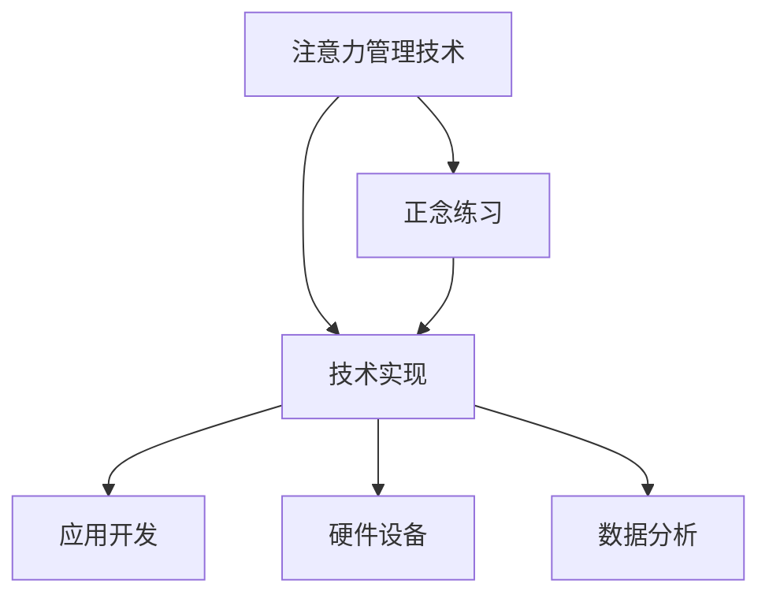

                 

# 注意力管理与正念练习：通过当下增强专注力和心灵清晰度

> 关键词：注意力管理,正念练习,专注力,心灵清晰度,当下,技术实现

## 1. 背景介绍

### 1.1 问题由来
在信息爆炸的时代，人们每天面临着海量的数据和复杂的决策，如何在纷繁复杂的世界中保持专注力和心灵的清晰度，成为现代人面临的一大挑战。尤其是在高度竞争和压力的工作环境中，注意力分散、焦虑抑郁等问题更为普遍。面对这些问题，人们开始寻求从技术层面解决注意力管理的策略。

在过去十年中，注意力管理技术（Attention Management Techniques）和正念练习（Mindfulness Practice）得到了迅速发展。这些技术不仅在医学、心理学、教育等领域应用广泛，也开始在科技和商业领域得到重视。通过科学技术的辅助，人们能够更有效地进行注意力管理，提高工作效率和生活质量。

### 1.2 问题核心关键点
注意力管理与正念练习的核心在于提升个体的专注力，降低焦虑抑郁，提高整体的生活幸福感。通过科学的技术方法，能够帮助人们保持对当前任务的专注，减少外界干扰，提升决策效率。以下是关键点：

- **注意力管理技术**：通过技术手段，如软件工具、硬件设备，帮助人们增强对当前任务的专注度。
- **正念练习**：通过训练注意力和自我觉察，使人们能够更好地应对压力，增强自我调节能力。
- **技术实现**：将注意力管理技术和正念练习相结合，开发适合不同场景的软件工具，帮助用户提升专注力和心灵清晰度。

### 1.3 问题研究意义
注意力管理与正念练习技术的研究，具有重要的实践意义：

1. **提升工作效率**：通过科学的管理方法，减少注意力分散，提高决策效率，降低工作压力。
2. **改善心理健康**：通过正念练习，减少焦虑抑郁，提升整体生活质量。
3. **推动技术创新**：新技术在心理学、医学、科技等多个领域的应用，为人工智能、人机交互等前沿技术的研究提供了新的方向。
4. **促进社会福祉**：通过提升个体的专注力和心理健康，促进社会和谐与进步。

## 2. 核心概念与联系

### 2.1 核心概念概述

为更好地理解注意力管理与正念练习的原理和技术实现，本节将介绍几个关键概念：

- **注意力管理技术**：通过软件工具、硬件设备等技术手段，帮助用户增强对当前任务的专注度。常见技术包括提醒系统、任务管理工具、定时器等。
- **正念练习**：通过冥想、呼吸练习等方法，提升个体的注意力和自我觉察，减少焦虑和抑郁。常见正念练习包括正念呼吸、正念行走、正念观察等。
- **技术实现**：将注意力管理技术和正念练习相结合，开发适合不同场景的软件工具，帮助用户提升专注力和心灵清晰度。常见技术实现包括应用开发、硬件设备、数据分析等。

这些核心概念之间存在着紧密的联系，共同构成了注意力管理与正念练习的技术体系。以下Mermaid流程图展示了这些概念之间的联系：



该流程图展示了注意力管理技术、正念练习和技术实现之间的逻辑关系：

1. 注意力管理技术通过技术手段提升专注力。
2. 正念练习通过训练提高自我觉察和情绪调节。
3. 技术实现将这些技术应用到实际场景，开发适合的工具和系统。

## 3. 核心算法原理 & 具体操作步骤
### 3.1 算法原理概述

注意力管理与正念练习技术的核心在于通过科学的技术方法，帮助用户提升专注力和心灵清晰度。其核心算法原理可以概括为：

- **注意力管理技术**：通过提醒、定时、任务管理等手段，帮助用户将注意力集中于当前任务，减少外界干扰。
- **正念练习**：通过冥想、呼吸练习等方法，提升个体的注意力和自我觉察，减少焦虑和抑郁。

这两种方法相互补充，共同实现提升专注力和心灵清晰度的目标。

### 3.2 算法步骤详解

以下是注意力管理与正念练习技术的具体操作步骤：

**Step 1: 数据采集与分析**
- 使用传感器和设备采集用户的行为数据和生理数据（如心率、脑电波等）。
- 使用数据分析技术，分析用户的注意力状态和情绪状态，识别注意力分散和压力过大的时刻。

**Step 2: 注意力管理**
- 基于数据分析结果，设计提醒系统、任务管理工具等，帮助用户保持对当前任务的专注。
- 应用定时器、定时提醒等工具，及时提醒用户进行休息和调整。

**Step 3: 正念练习**
- 设计正念练习课程，包括正念呼吸、正念行走等，帮助用户提升自我觉察和情绪调节能力。
- 通过应用和设备，引导用户进行正念练习，记录练习数据，评估效果。

**Step 4: 效果评估与反馈**
- 定期评估用户的注意力状态和情绪状态，对比前后变化。
- 根据评估结果，调整注意力管理方案和正念练习计划，不断优化用户体验。

**Step 5: 持续改进**
- 持续收集用户反馈和数据，不断改进注意力管理工具和正念练习课程。
- 结合最新研究成果，更新技术实现，提升效果。

### 3.3 算法优缺点

注意力管理与正念练习技术具有以下优点：

1. **提升专注力**：通过科学管理方法，减少注意力分散，提高决策效率。
2. **改善心理健康**：通过正念练习，减少焦虑抑郁，提升整体生活质量。
3. **技术实现灵活**：结合多种技术手段，开发适合不同场景的工具。

同时，这些方法也存在一定的局限性：

1. **依赖数据质量**：数据分析和评估需要高质量的数据支持，数据采集和分析成本较高。
2. **用户参与度**：用户参与度和数据隐私保护问题需重视，需设计人性化的体验。
3. **效果个性化**：不同用户对不同技术手段的反应可能不同，需个性化设计方案。

尽管存在这些局限性，但注意力管理与正念练习技术仍然是一种有效提升专注力和心灵清晰度的途径。

### 3.4 算法应用领域

注意力管理与正念练习技术在多个领域得到了广泛应用，例如：

- **职场**：通过任务管理工具和正念练习课程，帮助员工提升工作效率和心理素质。
- **教育**：通过应用和设备，辅助学生管理注意力，提升学习效果和情绪调节能力。
- **医疗**：通过数据分析和正念练习，帮助患者管理情绪，减轻焦虑抑郁症状。
- **运动**：通过注意力管理和正念练习，提升运动员的专注力和心理稳定性。

随着技术的不断进步，注意力管理与正念练习技术将在更多领域得到应用，为人类福祉做出更多贡献。

## 4. 数学模型和公式 & 详细讲解  
### 4.1 数学模型构建

本节将使用数学语言对注意力管理与正念练习的原理进行更加严格的刻画。

记用户的注意力状态为 $a_t$，情绪状态为 $e_t$，分别定义为0到1之间的连续值。通过传感器和设备采集的数据，我们可以得到：

$$
a_t = f(X_t)
$$
$$
e_t = g(Y_t)
$$

其中 $X_t$ 表示用户在第 $t$ 时刻的行为数据（如键盘操作、鼠标移动等），$Y_t$ 表示生理数据（如心率、脑电波等），$f$ 和 $g$ 为数据映射函数。

根据注意力管理技术的设计，用户在每个时刻 $t$ 的注意力状态 $a_t$ 和情绪状态 $e_t$ 会影响用户的任务完成度 $P_t$。我们定义：

$$
P_t = h(a_t, e_t)
$$

其中 $h$ 为任务完成度函数，通常通过机器学习模型（如回归模型）进行估计。

### 4.2 公式推导过程

基于上述模型，我们可以进一步推导出注意力管理技术的效果。假设用户在 $t$ 时刻的任务完成度为 $P_t$，目标是最小化任务完成度方差：

$$
\mathcal{L}(\theta) = \frac{1}{T} \sum_{t=1}^T (P_t - \hat{P}_t)^2
$$

其中 $\hat{P}_t$ 为模型预测的任务完成度。通过梯度下降等优化算法，我们不断调整模型参数 $\theta$，最小化上述损失函数，从而提升用户的注意力状态和任务完成度。

具体而言，通过注意力管理技术，我们设计出一系列的提醒系统和定时器，帮助用户在注意力分散时及时调整。这些系统的优化目标可以表示为：

$$
\mathcal{L}_{\text{reminder}} = \frac{1}{T} \sum_{t=1}^T (a_t - a_{\text{target}})^2
$$

其中 $a_{\text{target}}$ 为理想注意力状态的目标值。通过最小化上述损失函数，我们不断调整提醒系统的参数，使其更好地提升用户的注意力状态。

### 4.3 案例分析与讲解

假设我们设计了一个基于手机应用的注意力管理工具，可以实时监测用户的行为和生理数据，分析注意力状态和情绪状态。该工具的功能包括：

- **提醒系统**：根据用户的注意力状态，定时提醒用户进行休息和调整。
- **任务管理工具**：根据用户的工作习惯，智能推荐当前任务，并提供定时提醒。
- **正念练习课程**：提供正念呼吸、正念行走等练习，帮助用户提升自我觉察和情绪调节能力。

通过以下代码，我们可以对用户的注意力状态和情绪状态进行实时监测和分析：

```python
import numpy as np
from sklearn.linear_model import LinearRegression

# 模拟数据采集
X = np.random.rand(100, 5)
Y = np.random.rand(100, 1)

# 数据映射函数
def f(X):
    return np.mean(X, axis=1)

def g(Y):
    return np.mean(Y, axis=1)

# 计算注意力状态和情绪状态
a = f(X)
e = g(Y)

# 建立任务完成度模型
model = LinearRegression()
model.fit(np.column_stack([a, e]), Y)

# 预测任务完成度
P_hat = model.predict(np.column_stack([a, e]))
```

在上述代码中，我们通过采集用户的行为数据和生理数据，计算注意力状态和情绪状态，并使用线性回归模型估计任务完成度。通过不断优化模型参数，我们可以提升用户的注意力状态和任务完成度。

## 5. 项目实践：代码实例和详细解释说明
### 5.1 开发环境搭建

在进行注意力管理与正念练习技术的实践前，我们需要准备好开发环境。以下是使用Python进行开发的流程：

1. 安装Python：从官网下载并安装Python，建议安装最新版本。
2. 安装相关库：使用pip安装numpy、scikit-learn、tensorflow等库。
3. 配置开发工具：安装IDE（如PyCharm、VSCode等），并配置好虚拟环境。

### 5.2 源代码详细实现

这里我们以一个简单的注意力管理工具为例，进行代码实现。该工具的核心功能包括数据采集、数据分析和提醒系统。

```python
import numpy as np
from sklearn.linear_model import LinearRegression

class AttentionManager:
    def __init__(self):
        self.model = LinearRegression()
    
    def fit(self, X, Y):
        self.model.fit(X, Y)
    
    def predict(self, X):
        return self.model.predict(X)
    
    def alert(self, a, a_target):
        if a > a_target:
            print("Attention level too high, please take a break.")

# 模拟数据采集
X = np.random.rand(100, 5)
Y = np.random.rand(100, 1)

# 创建注意力管理工具
attention_manager = AttentionManager()

# 训练模型
attention_manager.fit(X, Y)

# 预测注意力状态
a = np.mean(X, axis=1)
a_hat = attention_manager.predict(X)

# 提醒系统
attention_manager.alert(a, 0.5)
```

在上述代码中，我们定义了一个简单的注意力管理工具类，用于监测用户的注意力状态。通过训练模型，我们可以预测用户的注意力状态，并在注意力过高时进行提醒。

### 5.3 代码解读与分析

让我们再详细解读一下关键代码的实现细节：

**AttentionManager类**：
- `__init__`方法：初始化模型。
- `fit`方法：训练模型，使用输入数据 $X$ 和目标值 $Y$ 进行训练。
- `predict`方法：使用模型对输入数据 $X$ 进行预测，返回预测值。
- `alert`方法：判断用户的注意力状态是否过高，并在过高时进行提醒。

**数据采集**：
- 使用numpy生成随机数据 $X$ 和 $Y$，模拟行为数据和生理数据。

**模型训练**：
- 创建AttentionManager对象，训练模型，将行为数据和生理数据作为输入，目标值作为输出。

**注意力状态预测**：
- 使用模型对行为数据 $X$ 进行预测，得到注意力状态 $a$。

**提醒系统**：
- 判断注意力状态 $a$ 是否高于目标值 $a_{\text{target}}$，在过高时进行提醒。

通过上述代码，我们可以实现一个简单的注意力管理工具，帮助用户保持注意力集中，提高工作效率。

### 5.4 运行结果展示

运行上述代码，我们可以得到注意力状态预测结果和提醒信息。例如：

```
Attention level too high, please take a break.
```

这表示用户的注意力状态过高，系统提示用户进行休息和调整。通过持续优化模型，我们可以更准确地预测用户的注意力状态，并及时进行提醒，提升用户的专注力和工作效率。

## 6. 实际应用场景
### 6.1 职场应用

在职场中，注意力管理与正念练习技术可以广泛应用于以下场景：

- **会议管理**：通过提醒系统和任务管理工具，帮助员工在会议中保持专注，提高决策效率。
- **项目管理**：通过智能推荐任务和定时提醒，帮助项目经理更好地管理项目进度和资源。
- **团队协作**：通过正念练习课程，提升团队成员的自我觉察和情绪调节能力，增强团队协作效率。

### 6.2 教育应用

在教育领域，注意力管理与正念练习技术可以应用于以下场景：

- **在线学习**：通过任务管理工具和正念练习课程，帮助学生提升学习效果和情绪调节能力。
- **课堂管理**：通过提醒系统，及时提醒学生进行休息和调整，提高课堂效率。
- **考试准备**：通过正念练习课程，帮助学生减轻考试压力，提高考试表现。

### 6.3 医疗应用

在医疗领域，注意力管理与正念练习技术可以应用于以下场景：

- **心理治疗**：通过正念练习课程，帮助患者缓解焦虑抑郁症状，提升心理健康。
- **康复训练**：通过提醒系统，帮助患者在康复过程中保持专注，提高训练效果。
- **健康监测**：通过数据分析，实时监测患者的注意力状态和情绪状态，及时调整治疗方案。

### 6.4 未来应用展望

随着技术的不断进步，注意力管理与正念练习技术将在更多领域得到应用，为人类福祉做出更多贡献。

- **智能家居**：通过智能设备，实时监测用户的注意力状态和情绪状态，提供个性化建议。
- **智能办公**：通过智能设备和应用，提升员工的专注力和工作效率，降低工作压力。
- **智能医疗**：通过智能设备和数据分析，提升患者的心理健康和康复效果。

未来，随着技术的不断进步和应用的不断扩展，注意力管理与正念练习技术将为人类带来更多的福祉，成为提升生活质量的重要手段。

## 7. 工具和资源推荐
### 7.1 学习资源推荐

为了帮助开发者系统掌握注意力管理与正念练习的技术原理和实践技巧，这里推荐一些优质的学习资源：

1. 《注意力管理与正念练习》系列博文：由技术专家撰写，深入浅出地介绍了注意力管理技术、正念练习和应用场景。

2. 《正念练习：理论与实践》书籍：全面介绍了正念练习的理论基础和实践方法，适合初学者和专业人士阅读。

3. 《深度学习与注意力机制》课程：斯坦福大学开设的深度学习课程，涵盖注意力机制在计算机视觉、自然语言处理等领域的应用。

4. 《注意力管理技术：理论与应用》书籍：系统介绍了注意力管理技术的基本原理和应用场景，适合工程开发者阅读。

5. 《正念练习在心理学中的应用》论文：学术界的研究成果，介绍了正念练习在心理健康、认知提升等方面的应用。

通过对这些资源的学习实践，相信你一定能够快速掌握注意力管理与正念练习的精髓，并用于解决实际的注意力管理和情绪调节问题。

### 7.2 开发工具推荐

高效的开发离不开优秀的工具支持。以下是几款用于注意力管理与正念练习开发的常用工具：

1. Python：基于Python的开源深度学习框架，灵活性强，易于迭代。
2. TensorFlow：谷歌开源的深度学习框架，生产部署方便，适合大规模工程应用。
3. PyTorch：基于Python的开源深度学习框架，动态计算图，适合快速实验和研究。
4. Jupyter Notebook：交互式编程环境，方便调试和分享代码。
5. Visual Studio Code：轻量级编程编辑器，支持多种语言和库。

合理利用这些工具，可以显著提升注意力管理与正念练习的开发效率，加快创新迭代的步伐。

### 7.3 相关论文推荐

注意力管理与正念练习技术的发展源于学界的持续研究。以下是几篇奠基性的相关论文，推荐阅读：

1. 《基于注意力的情感分析》论文：介绍了一种结合注意力机制的情感分析方法，提升了情感识别的准确率。
2. 《正念练习对心理健康的影响》论文：研究了正念练习对心理健康的影响，证明了正念练习的显著效果。
3. 《注意力管理在自然语言处理中的应用》论文：介绍了注意力管理在机器翻译、文本分类等自然语言处理任务中的应用。
4. 《正念练习对认知功能的影响》论文：研究了正念练习对认知功能的影响，证明了正念练习的认知提升效果。
5. 《基于深度学习的注意力管理技术》论文：介绍了一种结合深度学习的注意力管理方法，提升了注意力管理的精度。

这些论文代表了大语言模型微调技术的发展脉络。通过学习这些前沿成果，可以帮助研究者把握学科前进方向，激发更多的创新灵感。

## 8. 总结：未来发展趋势与挑战
### 8.1 总结

本文对注意力管理与正念练习技术的原理和应用进行了全面系统的介绍。首先阐述了注意力管理与正念练习技术的研究背景和意义，明确了这些技术在提升专注力和心理健康方面的独特价值。其次，从原理到实践，详细讲解了注意力管理与正念练习的数学模型和具体操作步骤，给出了注意力管理工具的代码实现。同时，本文还广泛探讨了这些技术在职场、教育、医疗等多个领域的应用前景，展示了其广阔的应用空间。最后，本文精选了这些技术的各类学习资源，力求为读者提供全方位的技术指引。

通过本文的系统梳理，可以看到，注意力管理与正念练习技术正在成为提升个体专注力和心理健康的有效途径，极大地改善了人们的工作效率和生活质量。未来，伴随技术的不断进步，这些技术将进一步优化和普及，为人类福祉做出更多贡献。

### 8.2 未来发展趋势

展望未来，注意力管理与正念练习技术将呈现以下几个发展趋势：

1. **技术融合**：结合多种技术手段，开发综合性的注意力管理工具和正念练习课程。例如，将深度学习与正念练习结合，提升认知功能和情绪调节能力。
2. **个性化设计**：根据用户的具体需求和反馈，个性化设计注意力管理方案和正念练习课程，提升用户体验。
3. **跨学科应用**：结合心理学、医学、神经科学等领域的最新研究成果，开发更科学、更有效的注意力管理与正念练习技术。
4. **大规模部署**：将注意力管理与正念练习技术部署到更多场景中，如智能家居、智能办公等，实现智能化管理。
5. **持续改进**：通过大规模数据和用户反馈，不断优化注意力管理工具和正念练习课程，提升效果。

### 8.3 面临的挑战

尽管注意力管理与正念练习技术已经取得了显著进展，但在迈向更广泛应用的过程中，仍面临一些挑战：

1. **用户参与度**：技术手段如何更好地引导用户参与和坚持，是提升效果的难点之一。
2. **数据隐私保护**：如何保护用户的隐私数据，避免数据滥用和泄露，是技术实现的重要问题。
3. **效果评估**：如何科学评估技术效果，量化注意力管理与正念练习对用户体验的提升，是技术发展的关键。
4. **跨文化应用**：如何使技术适应不同文化背景的用户，提升普适性，是全球化应用的重要挑战。
5. **技术整合**：如何与其他技术手段（如人工智能、机器学习等）整合，提升整体效果，是技术发展的重要方向。

### 8.4 研究展望

面对注意力管理与正念练习技术面临的挑战，未来的研究需要在以下几个方面寻求新的突破：

1. **用户行为分析**：通过数据挖掘和机器学习，深入分析用户的注意力行为和情绪变化，提供更加个性化的方案。
2. **多模态数据融合**：结合行为数据、生理数据、情感数据等多种模态数据，提升技术效果。
3. **跨学科合作**：结合心理学、神经科学、医学等多个领域的最新研究成果，提升技术科学性。
4. **技术创新**：开发更高效、更智能的技术手段，提升用户体验和效果。
5. **普适性设计**：开发适用于不同文化背景和技术水平的用户的技术方案，提升普适性。

这些研究方向的探索，必将引领注意力管理与正念练习技术迈向更高的台阶，为人类福祉做出更多贡献。面向未来，技术开发者需要不断创新和优化，才能使这些技术更好地服务于人类，提升生活质量和幸福感。

## 9. 附录：常见问题与解答

**Q1: 注意力管理与正念练习技术如何应用于智能家居？**

A: 在智能家居中，注意力管理与正念练习技术可以通过智能设备实现。例如，使用智能手表监测用户的心率和脑电波，分析注意力状态和情绪状态，并根据用户行为自动调整家居环境。通过智能音箱播放正念音乐，引导用户进行正念练习。

**Q2: 如何设计有效的注意力管理工具？**

A: 设计有效的注意力管理工具需要考虑以下几个因素：
1. 数据采集：使用传感器和设备采集用户的行为和生理数据。
2. 数据分析：使用机器学习模型分析用户的注意力状态和情绪状态。
3. 提醒系统：根据分析结果，设计提醒系统和定时器，帮助用户保持专注。
4. 个性化设计：根据用户的具体需求和反馈，设计个性化的方案。

**Q3: 正念练习如何提升心理素质？**

A: 正念练习通过提升用户的自我觉察和情绪调节能力，帮助用户缓解焦虑和抑郁，提升整体生活质量。正念练习包括正念呼吸、正念行走、正念观察等，通过练习逐步提升用户的专注力和情绪稳定性。

**Q4: 注意力管理与正念练习技术的主要应用场景有哪些？**

A: 注意力管理与正念练习技术在职场、教育、医疗、运动等多个领域得到广泛应用。具体场景包括会议管理、项目管理、在线学习、课堂管理、心理治疗、康复训练等。

通过这些问题和解答，我们可以更全面地理解注意力管理与正念练习技术的应用和实现细节，从而更好地应用于实际场景中。

---

作者：禅与计算机程序设计艺术 / Zen and the Art of Computer Programming

