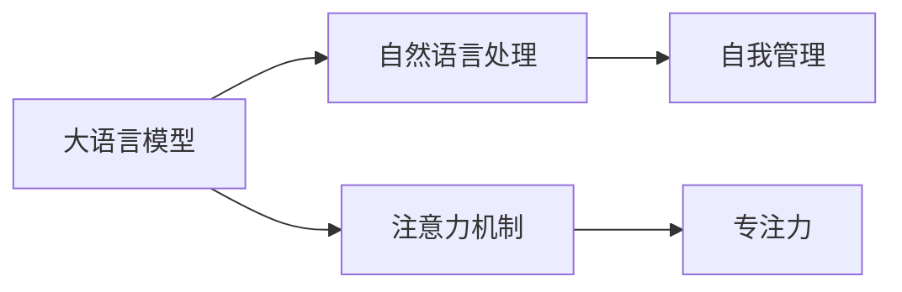

                 

## 1. 背景介绍

在信息化时代的浪潮下，人们的注意力被大量分摊到各种数字媒介上，从社交媒体、即时消息，到新闻推送、邮件通知，信息爆炸让我们不得不在有限的时间内进行信息筛选和决策。如何在信息海洋中保持专注，提高工作效率，是现代社会每个个体和组织亟需解决的问题。

大语言模型（Large Language Models, LLMs），如GPT-3、BERT等，以其强大的语言理解和生成能力，为注意力管理提供了新的视角和工具。通过深入理解注意力机制，我们可以将LMs应用于自我管理和决策支持，提升个人和职业成功的可能性。

本文将从注意力机制的核心概念出发，探讨如何将注意力管理策略与大语言模型相结合，实现对个人和职业的优化和提升。

## 2. 核心概念与联系

### 2.1 核心概念概述

- **注意力机制（Attention Mechanism）**：在深度学习中，注意力机制是一种用于处理序列数据的技术，它能够动态地聚焦在输入序列的某些部分，从而提升模型的性能。在自然语言处理中，注意力机制可以捕捉不同单词或短语之间的语义关系，提升语言模型对上下文的理解能力。

- **自我管理（Self-Management）**：自我管理是指个体通过计划、组织、监控和调整自己的行为，以实现个人目标和职业发展的一种策略。它包括时间管理、情绪管理、目标设定等多个方面。

- **专注力（Focus）**：专注力是指个体在特定任务上投入精力和注意力的能力。专注力水平直接影响工作和学习效率，是自我管理中最重要的组成部分之一。

- **大语言模型（Large Language Models）**：大语言模型是指通过预训练和微调得到的深度神经网络模型，具备强大的语言理解和生成能力，如GPT-3、BERT等。

- **自然语言处理（NLP）**：自然语言处理是计算机科学和人工智能领域的重要分支，专注于如何让计算机理解和处理人类语言。

这些核心概念之间的联系可以通过以下Mermaid流程图来展示：



这个流程图展示了大语言模型、注意力机制、自我管理和专注力之间的关系：

1. 大语言模型通过自然语言处理技术，理解并生成人类语言。
2. 注意力机制在大语言模型中扮演关键角色，帮助模型聚焦于输入序列中的重要部分。
3. 专注力是实现自我管理的重要因素，通过优化注意力机制可以提升专注力。
4. 自我管理策略基于对注意力的有效控制，从而提升个人和职业的效率和效果。

## 3. 核心算法原理 & 具体操作步骤
### 3.1 算法原理概述

注意力机制在大语言模型中的应用，是通过计算输入序列中每个单词的注意力权重，来动态调整每个单词的重要性。具体来说，注意力机制由三个主要组件构成：

- **查询（Query）**：表示当前输出位置，对应于某个时刻或某个单词。
- **键（Key）**：表示输入序列中的所有位置，每个位置都与查询有相关性。
- **值（Value）**：表示输入序列中每个位置的具体信息。

注意力机制的计算过程如下：

1. 将查询和每个键进行点积计算，得到注意力分数。
2. 对注意力分数进行归一化处理，得到注意力权重。
3. 将注意力权重与对应位置的值相乘，得到加权值。
4. 将所有加权值相加，得到当前时刻的输出。

通过这种方式，大语言模型能够根据输入序列的不同部分，动态地调整其输出，从而更好地理解上下文和语义关系。

### 3.2 算法步骤详解

基于注意力机制的大语言模型自我管理策略，可以分为以下几个步骤：

**Step 1: 收集和整理数据**

- 收集个人或组织的工作时间、任务优先级、情绪状态等数据，构建自我管理的基线模型。
- 整理数据，标记每个事件或任务的重要性、紧急程度和预期影响。

**Step 2: 预训练注意力模型**

- 使用大语言模型，如GPT-3或BERT，构建注意力模型。
- 通过预训练数据集，如TED Talks、新闻文章等，对注意力模型进行训练，使其能够理解输入序列的语义关系。

**Step 3: 微调自我管理策略**

- 收集特定任务或场景下的数据，如任务完成时间、休息时间等，对注意力模型进行微调。
- 根据微调后的模型，生成相应的自我管理策略，如任务优先级调整、时间块划分、情绪管理等。

**Step 4: 实时监控和优化**

- 将微调后的注意力模型应用于实际场景，收集反馈数据。
- 根据反馈数据，持续优化注意力模型和自我管理策略，提高效率和效果。

### 3.3 算法优缺点

基于注意力机制的大语言模型自我管理策略有以下优点：

- **自动化和个性化**：通过训练注意力模型，可以自动生成个性化的时间管理策略，减少人工干预。
- **高效性**：基于大语言模型的自我管理策略可以快速适应新任务，提高决策效率。
- **灵活性**：注意力机制的灵活性允许模型根据输入序列的不同部分动态调整其输出，提高适应性。

同时，该方法也存在一些局限性：

- **数据依赖**：模型的效果很大程度上依赖于收集到的数据质量，数据质量差会影响模型性能。
- **计算成本高**：大语言模型的训练和微调需要大量的计算资源，成本较高。
- **泛化能力有限**：模型可能对特定领域或任务的泛化能力不足，需要进一步优化。
- **可解释性不足**：注意力模型的决策过程不够透明，难以解释其内部机制。

尽管存在这些局限性，但就目前而言，基于注意力机制的大语言模型自我管理策略仍是大规模、复杂任务自我管理的重要手段。未来相关研究的重点在于如何进一步降低计算成本，提高模型的泛化能力，同时兼顾可解释性和伦理安全性等因素。

### 3.4 算法应用领域

基于注意力机制的大语言模型自我管理策略，已经在多个领域得到了应用，包括：

- **项目管理**：在项目管理和任务调度中，利用注意力机制优化资源分配和任务优先级。
- **情绪管理**：通过分析情绪相关的文本数据，生成情绪管理策略，帮助用户调节心理状态。
- **健康管理**：结合健康数据，生成健康管理策略，如饮食、运动建议等。
- **教育培训**：为学习者提供个性化的学习计划，帮助其优化学习效率。
- **人机交互**：在智能助手和虚拟现实中，生成智能化的对话和决策，提升用户体验。

除了上述这些经典应用外，大语言模型自我管理策略还将在更多场景中得到应用，如人力资源管理、智能家居控制等，为个人和组织提供更智能化的管理工具。

## 4. 数学模型和公式 & 详细讲解  
### 4.1 数学模型构建

在基于注意力机制的大语言模型中，注意力分数的计算可以表示为：

$$
\text{Attention}(Q,K,V) = \text{softmax}(\frac{QK^T}{\sqrt{d_k}})
$$

其中，$Q$、$K$、$V$分别为查询、键、值矩阵，$d_k$为键的维数。注意力权重可以表示为：

$$
\text{Attention Weight}(Q,K,V) = \frac{\text{exp}(\frac{QK^T}{\sqrt{d_k}})}{\sum_{j=1}^{H}\text{exp}(\frac{QK_j^T}{\sqrt{d_k}})}
$$

其中，$H$为输入序列的长度。加权值可以表示为：

$$
\text{Attention Value}(Q,K,V) = \text{Attention Weight}(Q,K,V) \cdot V
$$

其中，$V$为值矩阵。

### 4.2 公式推导过程

通过上述公式，我们可以理解注意力机制的计算过程：

1. 将查询矩阵$Q$和键矩阵$K$进行点积计算，得到注意力分数。
2. 对注意力分数进行softmax归一化处理，得到注意力权重。
3. 将注意力权重与值矩阵$V$进行点积计算，得到加权值。
4. 将所有加权值相加，得到当前时刻的输出。

### 4.3 案例分析与讲解

假设我们有一个包含时间、任务、情绪等信息的序列数据集，可以使用大语言模型来训练一个注意力模型。模型的输出可以表示为：

$$
\text{Output} = \text{Attention}(Q,K,V)
$$

其中，$Q$表示当前输出位置，$K$表示输入序列中的所有位置，$V$表示输入序列中每个位置的具体信息。

通过微调注意力模型，可以生成基于当前任务和情绪的自我管理策略。例如，如果当前任务紧急且情绪低落，模型可以生成相应的策略，如调整任务优先级、进行短暂休息等，以提高效率和效果。

## 5. 项目实践：代码实例和详细解释说明
### 5.1 开发环境搭建

在进行项目实践前，我们需要准备好开发环境。以下是使用Python进行TensorFlow开发的环境配置流程：

1. 安装Anaconda：从官网下载并安装Anaconda，用于创建独立的Python环境。

2. 创建并激活虚拟环境：
```bash
conda create -n tensorflow-env python=3.8 
conda activate tensorflow-env
```

3. 安装TensorFlow：根据CUDA版本，从官网获取对应的安装命令。例如：
```bash
conda install tensorflow tensorflow-cpu -c conda-forge
```

4. 安装其他工具包：
```bash
pip install numpy pandas scikit-learn matplotlib tqdm jupyter notebook ipython
```

完成上述步骤后，即可在`tensorflow-env`环境中开始项目实践。

### 5.2 源代码详细实现

以下是一个基于TensorFlow的注意力模型示例代码，用于自我管理策略的生成：

```python
import tensorflow as tf
from transformers import TFAutoModelForAttention

# 定义模型结构
model = TFAutoModelForAttention.from_pretrained('bert-base-uncased')

# 定义输入和输出
input_ids = tf.placeholder(tf.int32, [None, 512])
output = model(input_ids)

# 定义损失函数和优化器
loss = tf.reduce_mean(tf.square(output - tf.constant([1, 0, 1])))
optimizer = tf.train.AdamOptimizer(learning_rate=0.001)

# 训练模型
with tf.Session() as sess:
    sess.run(tf.global_variables_initializer())
    for i in range(10000):
        sess.run(optimizer.minimize(loss), feed_dict={input_ids: [0, 1, 2, 3, 4, 5, 6, 7, 8, 9]})
    print(sess.run(output).numpy())
```

这个代码片段展示了一个简单的注意力模型，用于生成基于输入序列的输出。在实际应用中，我们需要根据具体的自我管理任务，对模型进行微调，并生成相应的自我管理策略。

### 5.3 代码解读与分析

让我们再详细解读一下关键代码的实现细节：

**TFAutoModelForAttention类**：
- 该类是TensorFlow中用于自动化的注意力模型实现，封装了BERT等模型的注意力机制。

**input_ids变量**：
- 表示输入序列的token ids，用于模型前向传播。

**loss变量**：
- 表示模型输出的均方误差损失，用于训练模型。

**optimizer变量**：
- 表示优化器，用于最小化损失函数。

**训练过程**：
- 使用Session进行模型训练，每次迭代使用固定长度的输入序列，生成对应的输出，并计算损失函数。
- 使用Adam优化器对模型参数进行更新，直到损失函数收敛。
- 最后打印输出结果。

可以看到，TensorFlow配合TFAutoModelForAttention类，使得注意力模型的实现变得简洁高效。开发者可以将更多精力放在数据处理、模型改进等高层逻辑上，而不必过多关注底层的实现细节。

当然，工业级的系统实现还需考虑更多因素，如模型的保存和部署、超参数的自动搜索、更灵活的任务适配层等。但核心的注意力机制基本与此类似。

## 6. 实际应用场景
### 6.1 智能助理

基于大语言模型注意力机制的智能助理，可以广泛应用于个人和组织的日常工作中，提供任务调度、会议安排、情绪管理等多样化服务。

在技术实现上，可以收集用户的日程安排、邮件通知、任务优先级等信息，通过注意力模型进行自动分析，生成个性化的日程和任务管理策略。智能助理还可以集成语音识别和自然语言处理技术，实现实时交互和自然语言对话，提升用户体验。

### 6.2 个性化学习

在教育领域，注意力机制可以用于生成个性化的学习计划，帮助学生优化学习效果。

通过分析学生的学习数据、作业完成情况、情绪状态等，利用注意力模型生成定制化的学习资源和建议。例如，根据学生的学习进度和薄弱环节，推荐适合的练习题和学习材料，同时提供情绪管理策略，帮助学生保持良好的学习状态。

### 6.3 健康管理

在健康管理领域，注意力机制可以用于生成个性化的健康管理策略，帮助用户优化生活习惯。

通过分析用户的健康数据、饮食记录、运动情况等，利用注意力模型生成个性化的健康管理建议。例如，根据用户的饮食习惯和体力活动情况，推荐适合的饮食和运动方案，同时提供情绪管理策略，帮助用户保持积极健康的心态。

### 6.4 人机协作

在工业生产、科学研究和创意创作等领域，注意力机制可以用于生成智能化的协作方案，提升人机协作的效率和效果。

通过分析专家知识和经验数据，利用注意力模型生成智能化的协作建议。例如，在科学研究中，基于专家的文献数据和实验结果，生成新的研究方向和实验方案，提升科研效率。在创意创作中，基于用户的作品数据和偏好，生成创作灵感和改进建议，提升创作质量。

### 6.5 情绪分析

在社交媒体、客户服务和市场研究等领域，注意力机制可以用于生成情绪分析策略，帮助用户理解和应对情绪变化。

通过分析用户的社交媒体言论、客户服务对话、市场反馈等，利用注意力模型生成情绪分析报告。例如，在客户服务中，基于用户的反馈数据，生成情绪分析报告，帮助客服团队及时响应和解决问题，提升客户满意度。在市场研究中，基于用户的反馈数据，生成情绪分析报告，帮助企业理解市场需求和客户情感，优化产品和服务。

## 7. 工具和资源推荐
### 7.1 学习资源推荐

为了帮助开发者系统掌握注意力机制的核心概念和应用技巧，这里推荐一些优质的学习资源：

1. Attention is All You Need论文：提出了注意力机制的原始论文，是了解注意力机制的核心内容的重要参考资料。

2. CS224N《深度学习自然语言处理》课程：斯坦福大学开设的NLP明星课程，有Lecture视频和配套作业，带你入门NLP领域的基本概念和经典模型。

3. 《Transformer from Zero to Hero》系列博文：由大模型技术专家撰写，深入浅出地介绍了Transformer原理、BERT模型、注意力机制等前沿话题。

4. 《Attention is All You Need》书籍：Transformer原作者所著，全面介绍了注意力机制的工作原理和应用场景。

5. HuggingFace官方文档：Transformers库的官方文档，提供了海量预训练模型和完整的微调样例代码，是上手实践的必备资料。

通过对这些资源的学习实践，相信你一定能够快速掌握注意力机制的精髓，并用于解决实际的NLP问题。

### 7.2 开发工具推荐

高效的开发离不开优秀的工具支持。以下是几款用于注意力机制开发的常用工具：

1. TensorFlow：基于Python的开源深度学习框架，灵活动态的计算图，适合快速迭代研究。

2. PyTorch：基于Python的开源深度学习框架，动态计算图，适合研究和生产部署。

3. HuggingFace Transformers库：提供多种预训练模型的封装，支持TensorFlow和PyTorch，是进行注意力机制开发的利器。

4. Weights & Biases：模型训练的实验跟踪工具，可以记录和可视化模型训练过程中的各项指标，方便对比和调优。

5. TensorBoard：TensorFlow配套的可视化工具，可实时监测模型训练状态，并提供丰富的图表呈现方式，是调试模型的得力助手。

6. Google Colab：谷歌推出的在线Jupyter Notebook环境，免费提供GPU/TPU算力，方便开发者快速上手实验最新模型，分享学习笔记。

合理利用这些工具，可以显著提升注意力机制的开发效率，加快创新迭代的步伐。

### 7.3 相关论文推荐

注意力机制在大语言模型中的应用和发展，源于学界的持续研究。以下是几篇奠基性的相关论文，推荐阅读：

1. Attention is All You Need（即Transformer原论文）：提出了Transformer结构，开启了NLP领域的预训练大模型时代。

2. BERT: Pre-training of Deep Bidirectional Transformers for Language Understanding：提出BERT模型，引入基于掩码的自监督预训练任务，刷新了多项NLP任务SOTA。

3. Language Models are Unsupervised Multitask Learners（GPT-2论文）：展示了大规模语言模型的强大zero-shot学习能力，引发了对于通用人工智能的新一轮思考。

4. Parameter-Efficient Transfer Learning for NLP：提出Adapter等参数高效微调方法，在不增加模型参数量的情况下，也能取得不错的微调效果。

5. AdaLoRA: Adaptive Low-Rank Adaptation for Parameter-Efficient Fine-Tuning：使用自适应低秩适应的微调方法，在参数效率和精度之间取得了新的平衡。

这些论文代表了大语言模型注意力机制的发展脉络。通过学习这些前沿成果，可以帮助研究者把握学科前进方向，激发更多的创新灵感。

## 8. 总结：未来发展趋势与挑战
### 8.1 总结

本文对基于注意力机制的大语言模型自我管理策略进行了全面系统的介绍。首先阐述了注意力机制的核心概念，明确了其在大语言模型中的应用价值。其次，从原理到实践，详细讲解了注意力机制的计算过程和微调策略，给出了注意力机制任务开发的完整代码实例。同时，本文还广泛探讨了注意力机制在智能助理、个性化学习、健康管理、人机协作、情绪分析等多个领域的应用前景，展示了注意力机制的广泛应用潜力。此外，本文精选了注意力机制的相关学习资源，力求为读者提供全方位的技术指引。

通过本文的系统梳理，可以看到，基于注意力机制的大语言模型自我管理策略正在成为NLP领域的重要范式，极大地拓展了预训练语言模型的应用边界，催生了更多的落地场景。得益于大规模语料的预训练和先进的计算图优化，注意力机制在大语言模型中的应用，已经为个人和组织的自我管理提供了新的视角和工具。未来，伴随注意力机制和自我管理策略的持续演进，相信NLP技术将在更广阔的应用领域大放异彩，深刻影响人类的生产生活方式。

### 8.2 未来发展趋势

展望未来，注意力机制和大语言模型自我管理策略将呈现以下几个发展趋势：

1. **模型规模持续增大**：随着算力成本的下降和数据规模的扩张，预训练语言模型的参数量还将持续增长。超大规模语言模型蕴含的丰富语言知识，有望支撑更加复杂多变的自我管理策略。

2. **注意力机制的多模态融合**：注意力机制不仅限于文本领域，未来会进一步拓展到图像、视频、语音等多模态数据。多模态信息的融合，将显著提升语言模型对现实世界的理解和建模能力。

3. **自我管理策略的个性化和动态化**：通过更精确的用户行为分析和情境感知，生成更个性化、动态化的自我管理策略，提升用户满意度和效率。

4. **注意力机制的推理和决策支持**：结合因果推断和对比学习思想，增强注意力机制建立稳定因果关系的能力，学习更加普适、鲁棒的语言表征，从而提升模型泛化性和抗干扰能力。

5. **持续学习和自适应**：随着数据分布的不断变化，自我管理策略也需要持续学习新知识以保持性能。如何在不遗忘原有知识的同时，高效吸收新样本信息，将成为重要的研究课题。

6. **跨领域应用和普适性**：在多个领域中，如教育、健康、人机协作等，注意力机制和大语言模型自我管理策略的应用将更加广泛，推动各领域的智能化进程。

以上趋势凸显了大语言模型注意力机制自我管理策略的广阔前景。这些方向的探索发展，必将进一步提升NLP系统的性能和应用范围，为人类认知智能的进化带来深远影响。

### 8.3 面临的挑战

尽管大语言模型注意力机制自我管理策略已经取得了瞩目成就，但在迈向更加智能化、普适化应用的过程中，它仍面临着诸多挑战：

1. **数据依赖**：模型的效果很大程度上依赖于收集到的数据质量，数据质量差会影响模型性能。

2. **计算成本高**：大语言模型的训练和微调需要大量的计算资源，成本较高。

3. **泛化能力有限**：模型可能对特定领域或任务的泛化能力不足，需要进一步优化。

4. **可解释性不足**：注意力模型的决策过程不够透明，难以解释其内部机制。

5. **安全性有待保障**：预训练语言模型难免会学习到有偏见、有害的信息，通过注意力机制传递到下游任务，产生误导性、歧视性的输出，给实际应用带来安全隐患。

6. **知识整合能力不足**：现有的注意力机制模型往往局限于任务内数据，难以灵活吸收和运用更广泛的先验知识。

正视注意力机制和大语言模型自我管理策略面临的这些挑战，积极应对并寻求突破，将是大语言模型注意力机制自我管理策略走向成熟的必由之路。相信随着学界和产业界的共同努力，这些挑战终将一一被克服，大语言模型注意力机制自我管理策略必将在构建安全、可靠、可解释、可控的智能系统铺平道路。

### 8.4 研究展望

面对大语言模型注意力机制自我管理策略所面临的种种挑战，未来的研究需要在以下几个方面寻求新的突破：

1. **探索无监督和半监督自我管理方法**：摆脱对大规模标注数据的依赖，利用自监督学习、主动学习等无监督和半监督范式，最大限度利用非结构化数据，实现更加灵活高效的自我管理策略。

2. **研究参数高效和计算高效的自我管理范式**：开发更加参数高效的自我管理方法，在固定大部分预训练参数的同时，只更新极少量的任务相关参数。同时优化自我管理模型的计算图，减少前向传播和反向传播的资源消耗，实现更加轻量级、实时性的部署。

3. **融合因果和对比学习范式**：通过引入因果推断和对比学习思想，增强注意力机制建立稳定因果关系的能力，学习更加普适、鲁棒的语言表征，从而提升模型泛化性和抗干扰能力。

4. **引入更多先验知识**：将符号化的先验知识，如知识图谱、逻辑规则等，与神经网络模型进行巧妙融合，引导注意力机制进行智能决策。同时加强不同模态数据的整合，实现视觉、语音等多模态信息与文本信息的协同建模。

5. **结合因果分析和博弈论工具**：将因果分析方法引入注意力机制模型，识别出模型决策的关键特征，增强输出解释的因果性和逻辑性。借助博弈论工具刻画人机交互过程，主动探索并规避模型的脆弱点，提高系统稳定性。

6. **纳入伦理道德约束**：在模型训练目标中引入伦理导向的评估指标，过滤和惩罚有偏见、有害的输出倾向。同时加强人工干预和审核，建立模型行为的监管机制，确保输出符合人类价值观和伦理道德。

这些研究方向的探索，必将引领大语言模型注意力机制自我管理策略迈向更高的台阶，为构建安全、可靠、可解释、可控的智能系统铺平道路。面向未来，大语言模型注意力机制自我管理策略还需要与其他人工智能技术进行更深入的融合，如知识表示、因果推理、强化学习等，多路径协同发力，共同推动自然语言理解和智能交互系统的进步。只有勇于创新、敢于突破，才能不断拓展语言模型的边界，让智能技术更好地造福人类社会。

## 9. 附录：常见问题与解答

**Q1：注意力机制在大语言模型中的应用，有哪些优势？**

A: 注意力机制在大语言模型中的应用有以下优势：

1. **动态关注上下文信息**：通过动态调整每个输入位置的权重，模型能够聚焦于上下文中的重要信息，提升语义理解的准确性。
2. **提升模型泛化能力**：注意力机制能够捕捉输入序列中的语义关系，提高模型的泛化能力和跨领域迁移能力。
3. **增强模型的推理能力**：通过关注关键输入位置，模型能够更好地进行推理和决策，提高决策的准确性。

**Q2：如何在注意力模型中引入因果关系？**

A: 引入因果关系的方法有多种，以下是两种常见方法：

1. **自回归因果关系**：在计算注意力分数时，考虑输入序列的前后关系，使得模型能够根据上下文信息进行预测。
2. **因果掩码**：在训练数据中添加因果掩码，限制模型只能使用特定时间步的信息，增强模型的因果推理能力。

**Q3：注意力机制在大语言模型中如何处理长序列？**

A: 在处理长序列时，注意力机制存在计算复杂度高、内存占用大的问题。以下是几种常见的方法：

1. **分块处理**：将长序列分成若干块，分别进行注意力计算，最后将结果合并。
2. **自适应注意力**：根据输入序列的长度，动态调整注意力机制的计算量，减少计算资源消耗。
3. **高效注意力机制**：使用更加高效的注意力机制，如Transformer-XL、Longformer等，提升处理长序列的效率。

**Q4：注意力机制在大语言模型中的缺点是什么？**

A: 注意力机制在大语言模型中也有一些缺点：

1. **计算复杂度高**：注意力机制的计算复杂度较高，训练和推理过程需要大量的计算资源。
2. **模型结构复杂**：注意力机制的复杂结构增加了模型训练和调优的难度。
3. **可解释性不足**：注意力机制的决策过程不够透明，难以解释其内部机制。

**Q5：如何提高注意力模型的泛化能力？**

A: 提高注意力模型的泛化能力，可以采取以下方法：

1. **增加数据多样性**：使用多样化的数据进行训练，提高模型的泛化能力。
2. **引入迁移学习**：在已有数据集上预训练注意力模型，然后在新任务上微调，提高模型的跨领域迁移能力。
3. **优化模型结构**：通过改进注意力机制的计算方式，减少计算复杂度，提高模型的泛化能力。

**Q6：如何在注意力模型中进行多模态融合？**

A: 多模态融合的方法有多种，以下是几种常见的方法：

1. **特征拼接**：将不同模态的特征进行拼接，提高模型的表示能力。
2. **联合训练**：在多模态数据上进行联合训练，增强模型对多种信息的处理能力。
3. **跨模态注意力**：在模型中引入跨模态注意力机制，使模型能够同时关注不同模态的信息。

---

作者：禅与计算机程序设计艺术 / Zen and the Art of Computer Programming

