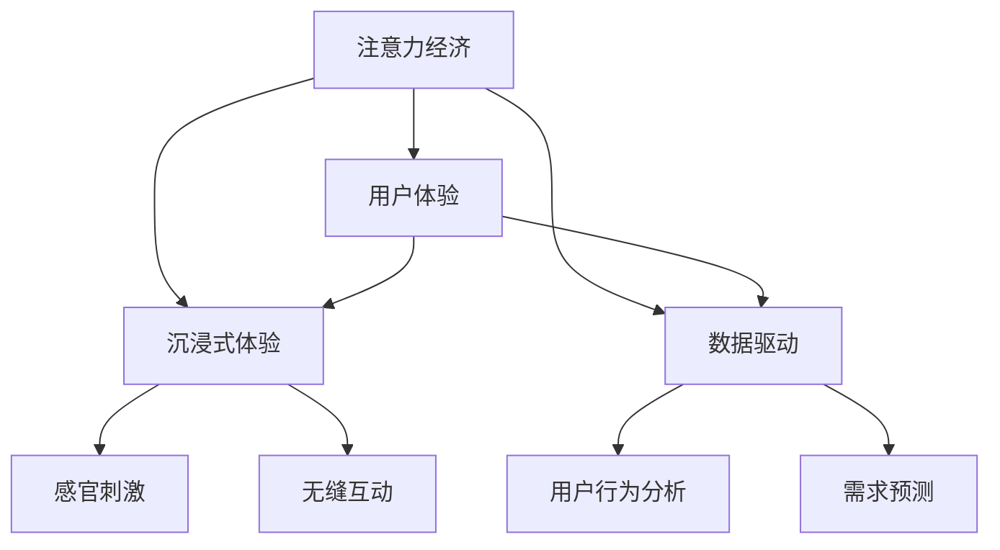

                 

# 注意力经济 与用户体验优化策略与技术：创建令人沉浸的产品

## 1. 背景介绍

在数字化转型快速发展的今天，产品的用户体验已经成为了竞争的核心。无论是软件、硬件还是服务，任何一款产品都必须在用户体验上追求极致，以吸引并留住用户，实现商业价值的最大化。在这样的背景下，“注意力经济”的概念应运而生，它强调在“注意力稀缺”的今天，如何通过优化用户体验，吸引并保持用户注意力，最终实现商业目标。

本文将深入探讨“注意力经济”的概念及其与用户体验优化策略与技术的关联，通过详细的算法原理和操作步骤，帮助开发者设计出能够吸引并留住用户的沉浸式产品。

## 2. 核心概念与联系

### 2.1 核心概念概述

- **注意力经济（Attention Economy）**：在信息爆炸的时代，用户的注意力成为一种稀缺资源。注意力经济关注如何利用用户注意力，通过优化用户体验，最大化商业价值。
- **用户体验（User Experience, UX）**：指用户在使用产品过程中，对产品功能、易用性、美观度等多方面因素的主观感受。优化用户体验是提升产品竞争力的关键。
- **沉浸式体验（Immersive Experience）**：通过提供丰富的感官刺激、无缝的互动体验，使用户全神贯注于产品之中，形成难以割舍的依恋感，从而增强用户粘性。
- **数据驱动（Data-Driven）**：通过收集、分析和应用用户数据，精准洞察用户行为和需求，指导产品优化和用户体验提升。

这些概念之间的逻辑关系可以通过以下Mermaid流程图来展示：



这个流程图展示了几大核心概念及其相互关系：

1. 注意力经济是基础，强调用户注意力的稀缺性。
2. 用户体验是核心，通过优化用户体验吸引并留住用户。
3. 沉浸式体验是手段，通过感官刺激和无缝互动提升用户粘性。
4. 数据驱动是支撑，通过分析用户行为和需求指导产品优化。

## 3. 核心算法原理 & 具体操作步骤

### 3.1 算法原理概述

在注意力经济和用户体验优化的过程中，核心算法包括：

- **A/B测试（A/B Testing）**：通过对比不同版本的产品功能或页面设计，找到最佳方案。
- **机器学习（Machine Learning, ML）**：通过分析用户行为数据，训练模型预测用户行为，指导产品优化。
- **推荐系统（Recommendation System）**：根据用户的历史行为和偏好，推荐个性化内容，提升用户体验。
- **情感分析（Sentiment Analysis）**：通过分析用户对产品的情感倾向，优化产品功能和设计。

这些算法通过不断迭代和优化，能够精准地捕获用户需求，提升用户体验，吸引并保持用户注意力。

### 3.2 算法步骤详解

1. **数据收集**：通过埋点、日志、问卷等方式，收集用户行为数据，为后续分析提供基础。
2. **数据清洗与预处理**：对收集到的数据进行清洗和预处理，包括去重、缺失值填充、异常值处理等。
3. **特征工程**：从原始数据中提取有用特征，如用户年龄、地理位置、浏览时长等，用于模型训练。
4. **模型训练**：选择合适的算法和模型，如随机森林、神经网络、深度学习等，训练出预测模型。
5. **模型评估与优化**：使用交叉验证、ROC曲线等方法评估模型性能，根据评估结果进行模型优化。
6. **产品优化**：根据模型预测结果，对产品功能、界面设计、内容推荐等方面进行优化。
7. **用户体验反馈**：通过用户反馈和行为数据，进一步调整优化策略，实现持续改进。

### 3.3 算法优缺点

**优点**：

- **精准性**：通过数据分析和模型训练，能够精准地预测用户行为和需求，指导产品优化。
- **灵活性**：算法和模型可以根据产品特点和用户反馈进行灵活调整和优化。
- **自动化**：大部分步骤可以通过自动化流程实现，减少人工干预。

**缺点**：

- **数据质量依赖**：算法的有效性高度依赖于数据的质量和完整性。
- **复杂度**：模型训练和优化过程复杂，需要专业知识和技术支持。
- **成本高**：初期数据收集、模型训练和优化需要大量资源投入。

### 3.4 算法应用领域

基于上述算法原理和操作步骤，注意力经济与用户体验优化策略与技术可以应用于多个领域，例如：

- **电商**：通过推荐系统提升个性化购物体验，提高转化率和复购率。
- **内容平台**：通过情感分析优化内容推荐，提升用户满意度和粘性。
- **社交媒体**：通过A/B测试优化广告投放策略，提高广告效果和用户参与度。
- **金融服务**：通过数据驱动的风险控制和推荐系统，提升用户体验和安全性。
- **健康医疗**：通过分析用户行为，提供个性化的健康建议和医疗服务。

这些应用场景展示了注意力经济和用户体验优化策略与技术的广泛应用价值。

## 4. 数学模型和公式 & 详细讲解 & 举例说明

### 4.1 数学模型构建

以推荐系统为例，我们构建一个协同过滤模型，用于推荐用户可能感兴趣的商品。设用户集合为 $U$，商品集合为 $I$，用户对商品的评分矩阵为 $R \in \mathbb{R}^{n \times m}$，其中 $n$ 为用户数量，$m$ 为商品数量。

### 4.2 公式推导过程

设用户 $u$ 对商品 $i$ 的评分 $r_{ui}$ 为 $R_{ui}$，用户 $u$ 对商品 $i$ 的兴趣度 $p_u^i$ 为 $P_u^i$，用户 $u$ 可能感兴趣的商品集合为 $N_u$。

推荐模型的目标是最小化预测误差，即：

$$
\min_{\theta} \sum_{(u,i) \in R} (R_{ui} - \hat{R}_{ui})^2
$$

其中 $\hat{R}_{ui}$ 为模型的预测评分。

### 4.3 案例分析与讲解

以电商平台的推荐系统为例，通过协同过滤模型预测用户对商品的评分，从而推荐可能感兴趣的商品。假设某用户 $u$ 对商品 $i$ 的评分 $R_{ui}=3$，模型预测评分 $\hat{R}_{ui}=4$，则用户 $u$ 对商品 $i$ 的推荐度 $p_u^i$ 为 $4-3=1$。根据 $p_u^i$，从所有可能感兴趣的商品中筛选出前 $k$ 个商品，推荐给用户 $u$。

## 5. 项目实践：代码实例和详细解释说明

### 5.1 开发环境搭建

在Python环境下，推荐系统可以使用Pandas、NumPy、Scikit-learn、TensorFlow等库进行开发。

首先，安装所需的库：

```bash
pip install pandas numpy scikit-learn tensorflow
```

然后，创建虚拟环境并激活：

```bash
python -m venv env
source env/bin/activate
```

### 5.2 源代码详细实现

以协同过滤模型为例，以下是推荐系统的Python代码实现：

```python
import pandas as pd
import numpy as np
from sklearn.model_selection import train_test_split
from sklearn.metrics import mean_squared_error
from tensorflow.keras.layers import Input, Embedding, DotProduct, Dense
from tensorflow.keras.models import Model

# 读取数据
data = pd.read_csv('ratings.csv')

# 数据预处理
data.fillna(0, inplace=True)
train, test = train_test_split(data, test_size=0.2)

# 模型构建
user_input = Input(shape=(1,))
user_embed = Embedding(input_dim=len(train.user.unique()), output_dim=10)(user_input)
item_input = Input(shape=(1,))
item_embed = Embedding(input_dim=len(train.item.unique()), output_dim=10)(item_input)
dot_product = DotProduct()([user_embed, item_embed])
rating = Dense(1, activation='sigmoid')(dot_product)
model = Model(inputs=[user_input, item_input], outputs=rating)

# 编译模型
model.compile(optimizer='adam', loss='binary_crossentropy', metrics=['mae'])

# 训练模型
history = model.fit([train.user, train.item], train.rating, epochs=10, batch_size=32, validation_data=(test.user, test.item, test.rating))
```

### 5.3 代码解读与分析

**数据读取与预处理**：

- `pd.read_csv`：从CSV文件中读取数据。
- `fillna`：处理缺失值，将NaN值替换为0。
- `train_test_split`：将数据集分为训练集和测试集。

**模型构建**：

- `Input`：定义输入层。
- `Embedding`：将用户和商品的ID转换为向量。
- `DotProduct`：计算向量点积，得到评分预测。
- `Dense`：添加输出层，使用Sigmoid激活函数。
- `Model`：将输入和输出层组合成模型。

**模型编译与训练**：

- `compile`：配置模型的优化器、损失函数和评价指标。
- `fit`：训练模型，输出训练过程中的损失和评价指标。

### 5.4 运行结果展示

在训练完成后，可以使用测试集评估模型的性能：

```python
# 评估模型
test_score = model.evaluate([test.user, test.item], test.rating)
print('Test MSE:', test_score[0])
```

以上代码实现了基本的协同过滤模型，用于推荐电商商品。通过不断优化模型和特征工程，可以进一步提升推荐系统的精度和个性化程度。

## 6. 实际应用场景

### 6.1 电商

在电商平台上，推荐系统可以通过分析用户浏览、购买行为，推荐用户可能感兴趣的商品。通过A/B测试，不断优化推荐算法和策略，提高用户满意度和转化率。

### 6.2 内容平台

内容平台如Netflix、YouTube等，通过分析用户的观看历史和评分，推荐用户可能喜欢的影视作品。通过情感分析，优化内容推荐，提升用户粘性和平台留存率。

### 6.3 社交媒体

社交媒体平台如Facebook、微信等，通过分析用户互动数据，优化广告投放策略，提高广告效果和用户参与度。通过情感分析，优化社区内容管理，维护平台和谐氛围。

### 6.4 金融服务

金融服务行业如银行、证券等，通过分析用户交易记录和行为，优化风险控制和个性化推荐，提高用户满意度和平台信任度。通过情感分析，优化客服服务，提升用户体验。

## 7. 工具和资源推荐

### 7.1 学习资源推荐

- **《Python数据科学手册》**：全面介绍Python在数据科学中的应用，适合入门学习。
- **《深度学习入门：基于Python的理论与实现》**：详细讲解深度学习的基本理论和实现方法，适合进阶学习。
- **《机器学习实战》**：提供丰富的案例和代码实现，适合实践练习。
- **Coursera机器学习课程**：由斯坦福大学Andrew Ng教授讲授，涵盖机器学习基础和高级内容，适合系统学习。
- **Kaggle竞赛平台**：提供大量的数据集和竞赛任务，适合实战训练和经验积累。

### 7.2 开发工具推荐

- **Jupyter Notebook**：交互式开发环境，支持代码调试和实时展示。
- **Git**：版本控制工具，方便代码管理和协作开发。
- **Docker**：容器化部署工具，确保代码在不同环境中一致性。
- **Kubernetes**：容器编排工具，支持大规模分布式部署。
- **Prometheus**：监控工具，实时监测系统性能和资源使用情况。

### 7.3 相关论文推荐

- **《推荐系统的协同过滤模型》**：详细介绍协同过滤模型的基本原理和算法实现。
- **《深度学习在推荐系统中的应用》**：深入讲解深度学习在推荐系统中的应用，包括神经网络、卷积神经网络等。
- **《情感分析在用户体验优化中的应用》**：探讨情感分析在用户行为分析、内容推荐等方面的应用。
- **《A/B测试在产品优化中的应用》**：介绍A/B测试的基本原理和操作步骤，适合优化产品功能和用户体验。

## 8. 总结：未来发展趋势与挑战

### 8.1 总结

本文从“注意力经济”的概念出发，深入探讨了用户体验优化策略与技术，通过详细的算法原理和操作步骤，帮助开发者设计出能够吸引并留住用户的沉浸式产品。通过具体的项目实践，展示了协同过滤模型在推荐系统中的应用。

通过本文的系统梳理，可以看到，注意力经济和用户体验优化策略与技术正在成为数字产品设计的核心。在优化过程中，算法和数据驱动起到了至关重要的作用。未来，随着算力的提升和数据量的增加，这些技术将进一步完善，为数字产品的创新和发展提供更多可能性。

### 8.2 未来发展趋势

- **多模态融合**：未来的产品将不仅仅局限于单一模态，而是融合视觉、听觉、触觉等多种模态，提供更加丰富、沉浸的用户体验。
- **实时互动**：通过AI技术，实现用户与产品的实时互动，增强用户的参与感和沉浸感。
- **个性化推荐**：利用深度学习和推荐算法，提供更加精准、个性化的推荐内容，提升用户满意度。
- **情感计算**：通过情感分析技术，精准捕捉用户情感，优化产品功能和界面设计。
- **数据安全与隐私保护**：在数据驱动的过程中，数据安全和隐私保护将成为重要课题。

这些趋势展示了未来用户体验优化和注意力经济的发展方向。技术的发展将为数字产品设计带来更多创新和突破。

### 8.3 面临的挑战

尽管用户体验优化技术正在快速发展，但仍然面临诸多挑战：

- **数据质量与隐私保护**：数据质量的提升和用户隐私保护是永恒的挑战。
- **算法复杂度与可解释性**：算法的复杂性和可解释性问题需要进一步解决。
- **用户心理与行为**：理解用户心理和行为规律，优化用户体验，仍然是长期课题。
- **资源限制与成本控制**：算力的提升和数据的获取需要大量资源投入，成本控制成为重要问题。

这些挑战需要不断探索和突破，才能实现用户体验优化和注意力经济的可持续发展。

### 8.4 研究展望

未来的研究将在以下几个方向进行探索：

- **跨模态交互技术**：研究如何将不同模态的信息融合，提供更加沉浸和自然的人机交互体验。
- **实时行为分析**：通过实时数据分析和反馈，优化用户体验和产品功能。
- **情感计算与社交网络**：研究情感计算在社交网络中的应用，提升用户粘性和互动体验。
- **自适应推荐系统**：开发能够自适应用户行为和偏好的推荐系统，提升个性化程度。
- **隐私保护与数据安全**：研究如何保护用户隐私，同时利用数据驱动优化产品。

通过这些研究方向的探索，可以进一步提升用户体验优化技术，实现注意力经济的最大化。

## 9. 附录：常见问题与解答

**Q1: 如何评估推荐系统的性能？**

A: 推荐系统的性能评估通常使用MAE（平均绝对误差）、MSE（均方误差）、DCG（折扣累积收益）等指标。

**Q2: 数据驱动的用户体验优化需要注意哪些问题？**

A: 数据驱动的优化需要注意数据质量和隐私保护，避免过拟合，合理评估模型性能，及时调整优化策略。

**Q3: A/B测试在产品优化中应注意哪些问题？**

A: A/B测试需要注意样本大小、随机分组、统计显著性等问题，确保结果的可靠性和可信度。

**Q4: 如何实现跨模态融合？**

A: 跨模态融合可以通过融合视觉、听觉、触觉等多种模态信息，使用深度学习模型进行处理和融合。

**Q5: 情感分析在用户体验优化中的应用有哪些？**

A: 情感分析可以用于用户行为分析、内容推荐、情感接口设计等方面，优化用户体验和产品功能。

---

作者：禅与计算机程序设计艺术 / Zen and the Art of Computer Programming

