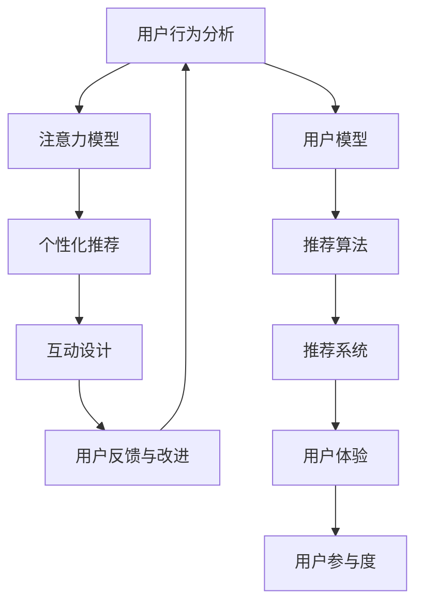

                 

# 注意力经济与用户行为分析：了解受众行为以增强参与度

## 1. 背景介绍

在信息爆炸的互联网时代，如何吸引并保持用户注意力，成为了各类型平台、企业乃至个人品牌面临的核心挑战。从搜索引擎到社交媒体，从在线广告到内容分发，各个领域都在寻求提高用户参与度，实现注意力价值的最大化。在这一背景下，注意力经济和用户行为分析技术应运而生，通过深入洞察用户行为，制定精准的策略和内容推送，实现了用户参与度的显著提升。

### 1.1 问题由来

随着互联网技术的不断发展，信息获取和传播的方式日趋多样化。用户在面对海量信息时，注意力成为了稀缺资源，如何有效引导用户注意力成为了提升用户参与度的关键。传统的基于规则、静态匹配的方法，已无法满足用户动态变化的兴趣和行为需求。因此，注意力经济和用户行为分析技术应运而生，通过动态调整策略和个性化推荐，实现对用户注意力的高效管理和转化。

### 1.2 问题核心关键点

注意力经济和用户行为分析的核心关键点在于通过数据驱动的方法，深入理解用户行为和心理，制定精细化的策略和内容推荐，以期最大化用户参与度和平台收益。主要包括以下几个方面：

- **用户行为建模**：通过大数据和机器学习技术，构建用户行为模型，捕捉用户兴趣变化和行为特征。
- **注意力模型**：建立用户注意力模型，预测用户在不同内容上的关注度和停留时间，优化内容推送策略。
- **个性化推荐**：根据用户行为和注意力模型，推荐符合用户兴趣和期望的内容，提高用户满意度和参与度。
- **用户互动设计**：设计有效的内容形式和互动机制，增强用户参与和情感投入。
- **用户反馈与改进**：利用用户反馈数据，持续优化推荐算法和平台策略。

### 1.3 问题研究意义

注意力经济和用户行为分析技术的研究意义在于：

- **提升用户参与度**：通过个性化推荐和互动设计，显著提升用户对平台的粘性和使用时长。
- **优化广告投放效果**：精准预测用户注意力，提高广告投放的ROI，实现更高的商业价值。
- **增强用户体验**：根据用户行为和偏好，提供更为个性化和满意的服务体验，提升用户满意度。
- **促进数据驱动决策**：通过数据分析和模型优化，增强决策的科学性和准确性。
- **推动技术创新**：推动注意力经济和用户行为分析技术的不断演进，助力技术前沿发展。

## 2. 核心概念与联系

### 2.1 核心概念概述

为更好地理解注意力经济和用户行为分析的核心技术，本节将介绍几个关键概念：

- **注意力经济**：基于用户注意力的经济模型，旨在通过精准的注意力管理，提升用户参与度和平台收益。
- **用户行为分析**：通过分析用户行为数据，捕捉用户兴趣和行为特征，构建用户模型，指导策略制定。
- **个性化推荐**：根据用户行为和兴趣特征，推荐符合用户期望的内容，提升用户满意度和参与度。
- **注意力模型**：预测用户在不同内容上的关注度和停留时间，优化内容推送策略。
- **互动设计**：设计有效的内容形式和互动机制，增强用户参与和情感投入。

这些概念之间的逻辑关系可以通过以下Mermaid流程图来展示：



这个流程图展示了几大核心概念之间的关系：

1. 用户行为分析构建用户模型，是注意力模型和个性化推荐的基础。
2. 注意力模型根据用户行为和兴趣，优化内容推送策略。
3. 个性化推荐根据用户模型和注意力模型，推荐符合用户期望的内容。
4. 互动设计增强用户参与和情感投入，进一步提升用户满意度。
5. 用户反馈与改进通过用户反馈数据，持续优化推荐算法和平台策略，形成良性循环。

## 3. 核心算法原理 & 具体操作步骤
### 3.1 算法原理概述

注意力经济和用户行为分析的核心算法主要包括用户行为建模、注意力模型建立和个性化推荐算法。其核心思想是通过深度学习和数据挖掘技术，捕捉和预测用户行为和注意力特征，实现内容的精准推荐和动态调整。

**用户行为建模**：通过大数据和机器学习技术，构建用户行为模型，捕捉用户兴趣变化和行为特征。常用的方法包括协同过滤、内容推荐、序列模型等。

**注意力模型**：建立用户注意力模型，预测用户在不同内容上的关注度和停留时间。常用的方法包括协同过滤、深度神经网络、混合模型等。

**个性化推荐**：根据用户行为和注意力模型，推荐符合用户兴趣和期望的内容。常用的方法包括协同过滤、矩阵分解、深度学习推荐模型等。

### 3.2 算法步骤详解

注意力经济和用户行为分析的算法步骤主要包括以下几个方面：

**Step 1: 数据收集与预处理**
- 收集用户行为数据，包括浏览记录、点击行为、评论内容等。
- 进行数据清洗和归一化，去除噪声和异常值，保证数据质量。

**Step 2: 用户行为建模**
- 利用协同过滤、内容推荐、序列模型等方法，构建用户行为模型，捕捉用户兴趣变化和行为特征。

**Step 3: 注意力模型建立**
- 利用深度神经网络、协同过滤、混合模型等方法，建立用户注意力模型，预测用户在不同内容上的关注度和停留时间。

**Step 4: 个性化推荐**
- 根据用户行为和注意力模型，利用协同过滤、矩阵分解、深度学习推荐模型等方法，推荐符合用户期望的内容。

**Step 5: 互动设计**
- 设计有效的内容形式和互动机制，增强用户参与和情感投入，提升用户满意度。

**Step 6: 用户反馈与改进**
- 利用用户反馈数据，通过A/B测试等方法，持续优化推荐算法和平台策略，形成良性循环。

### 3.3 算法优缺点

注意力经济和用户行为分析算法具有以下优点：

- **高度个性化**：通过深度学习和数据挖掘技术，实现内容的精准推荐，提升用户满意度和参与度。
- **灵活调整**：根据用户反馈和行为变化，动态调整推荐策略和内容形式，优化用户体验。
- **广泛适用性**：适用于各种类型的平台和应用，如社交媒体、电商网站、新闻资讯等。
- **数据驱动决策**：通过分析大量用户行为数据，提供科学决策依据，提升决策准确性和效率。

同时，该算法也存在一定的局限性：

- **数据隐私问题**：用户行为数据涉及隐私问题，需要严格遵守数据保护法规，防止数据滥用。
- **模型复杂度**：深度学习模型训练复杂度较高，对计算资源和数据质量要求较高。
- **结果解释性不足**：推荐模型的决策过程复杂，难以提供清晰和可解释的推荐依据。
- **依赖数据质量**：推荐结果依赖于数据质量，数据偏差可能导致模型偏误，影响推荐效果。

### 3.4 算法应用领域

注意力经济和用户行为分析技术在多个领域得到了广泛应用，例如：

- 社交媒体推荐：如微信朋友圈、微博动态、抖音短视频等，通过个性化推荐提升用户参与度和互动率。
- 电商网站推荐：如淘宝、京东、亚马逊等，通过精准推荐提升用户购买转化率和平台收益。
- 新闻资讯推荐：如今日头条、知乎、百度新闻等，通过智能推送优化用户阅读体验。
- 内容创作平台：如博客、播客、视频网站等，通过个性化推荐提升用户粘性和留存率。
- 在线广告投放：如谷歌广告、Facebook广告等，通过精准定向广告提升广告效果。

除了这些经典应用外，注意力经济和用户行为分析技术还创新性地应用于更多场景中，如推荐系统优化、智能客服、数据安全防护等，为互联网企业的数字化转型提供了重要支持。

## 4. 数学模型和公式 & 详细讲解 & 举例说明（备注：数学公式请使用latex格式，latex嵌入文中独立段落使用 $$，段落内使用 $)
### 4.1 数学模型构建

本节将使用数学语言对注意力经济和用户行为分析的核心模型进行详细解释。

假设平台上有 $N$ 个用户，每个用户在 $T$ 个不同内容上产生了 $D$ 次行为记录 $(x_{ui})$，其中 $u$ 表示用户，$i$ 表示内容。行为记录 $x_{ui}$ 可以用 $k$ 个特征 $(x_{ui1},x_{ui2},\ldots,x_{ui_k})$ 来描述。

定义用户行为矩阵 $\mathbf{X} \in \mathbb{R}^{N \times T \times k}$，内容特征矩阵 $\mathbf{Z} \in \mathbb{R}^{T \times k}$，行为特征矩阵 $\mathbf{Y} \in \mathbb{R}^{N \times T \times k}$。

定义用户行为评分矩阵 $\mathbf{R} \in \mathbb{R}^{N \times T}$，内容评分矩阵 $\mathbf{S} \in \mathbb{R}^{T \times T}$。用户行为评分 $r_{ui}$ 表示用户 $u$ 对内容 $i$ 的评分，内容评分 $s_{ij}$ 表示内容 $i$ 对内容 $j$ 的评分。

定义注意力矩阵 $\mathbf{A} \in \mathbb{R}^{N \times T \times T}$，内容间的注意力关系 $a_{uij}$ 表示内容 $i$ 对内容 $j$ 的注意力程度。

### 4.2 公式推导过程

**用户行为评分**：利用协同过滤方法，计算用户 $u$ 对内容 $i$ 的行为评分：

$$
r_{ui} = \sum_{j=1}^{T} \alpha_j s_{ij} \frac{1}{1 + \exp(-\alpha_j(r_{uj} - r_{uj}^{\text{avg}})}
$$

其中 $\alpha_j$ 表示内容 $j$ 对用户 $u$ 的权重，$r_{uj}^{\text{avg}}$ 表示内容 $j$ 的平均评分。

**内容评分**：利用深度神经网络模型，计算内容 $i$ 对内容 $j$ 的评分：

$$
s_{ij} = \sigma(\mathbf{W} \cdot [\mathbf{Z}_i;\mathbf{Z}_j] + \mathbf{b})
$$

其中 $\mathbf{W}$ 表示权重矩阵，$\mathbf{b}$ 表示偏置项，$\sigma$ 表示激活函数。

**注意力模型**：利用注意力机制，计算内容 $i$ 对内容 $j$ 的注意力程度：

$$
a_{uij} = \frac{\exp(\mathbf{U} \cdot [\mathbf{Z}_i;\mathbf{Z}_j] + \mathbf{V} \cdot r_{ui} + \mathbf{C} \cdot r_{uj})}{\sum_{i'=1}^{T} \exp(\mathbf{U} \cdot [\mathbf{Z}_{i'};\mathbf{Z}_j] + \mathbf{V} \cdot r_{ui'} + \mathbf{C} \cdot r_{uj'})}
$$

其中 $\mathbf{U}$、$\mathbf{V}$、$\mathbf{C}$ 表示注意力模型参数，$\cdot$ 表示向量拼接。

**个性化推荐**：利用注意力模型，计算用户 $u$ 对内容 $i$ 的推荐评分：

$$
\hat{r}_{ui} = \sum_{j=1}^{T} a_{uij} r_{uj}
$$

其中 $\hat{r}_{ui}$ 表示用户 $u$ 对内容 $i$ 的推荐评分。

**互动设计**：通过设计有效的互动机制，提升用户参与度和满意度。例如，在内容发布中加入点赞、评论、分享等功能，激励用户积极互动。

### 4.3 案例分析与讲解

以社交媒体平台为例，分析注意力经济和用户行为分析的应用：

**数据收集与预处理**：社交媒体平台收集用户浏览、点赞、评论等行为数据，进行清洗和归一化。

**用户行为建模**：利用协同过滤方法，构建用户行为模型，捕捉用户兴趣变化和行为特征。例如，利用用户的历史点赞数据和好友推荐，计算用户对新内容的兴趣评分。

**注意力模型建立**：利用深度神经网络模型，建立用户注意力模型，预测用户在不同内容上的关注度和停留时间。例如，利用用户的行为评分和互动数据，训练注意力模型，预测用户对不同帖子的关注程度。

**个性化推荐**：根据用户行为和注意力模型，利用协同过滤和深度学习推荐模型，推荐符合用户期望的内容。例如，利用用户的历史点赞和评论数据，推荐相关的内容和话题。

**互动设计**：设计点赞、评论、分享等互动机制，增强用户参与和情感投入。例如，在帖子中加入互动提示，引导用户积极评论和点赞。

**用户反馈与改进**：利用用户反馈数据，通过A/B测试等方法，持续优化推荐算法和平台策略。例如，收集用户对推荐内容的满意度反馈，调整推荐算法中的参数。

通过上述步骤，社交媒体平台可以显著提升用户参与度和平台收益，实现注意力经济的最大化。

## 5. 项目实践：代码实例和详细解释说明
### 5.1 开发环境搭建

在进行注意力经济和用户行为分析的实践前，我们需要准备好开发环境。以下是使用Python进行TensorFlow开发的环境配置流程：

1. 安装Anaconda：从官网下载并安装Anaconda，用于创建独立的Python环境。

2. 创建并激活虚拟环境：
```bash
conda create -n tf-env python=3.8 
conda activate tf-env
```

3. 安装TensorFlow：根据CUDA版本，从官网获取对应的安装命令。例如：
```bash
conda install tensorflow tensorflow-gpu -c conda-forge
```

4. 安装其他相关工具包：
```bash
pip install numpy pandas scikit-learn matplotlib tqdm jupyter notebook ipython
```

完成上述步骤后，即可在`tf-env`环境中开始项目实践。

### 5.2 源代码详细实现

下面我们以社交媒体平台的个性化推荐系统为例，给出使用TensorFlow进行注意力经济和用户行为分析的代码实现。

首先，定义推荐系统的数据处理函数：

```python
import tensorflow as tf
from tensorflow.keras.layers import Input, Embedding, Dot, Dense

def preprocess_data(X, Y, Z, user_ids, content_ids):
    user_ids = tf.cast(user_ids, tf.int32)
    content_ids = tf.cast(content_ids, tf.int32)

    user_emb = tf.keras.layers.Embedding(input_dim=vocab_size, output_dim=embedding_dim, input_length=1)(user_ids)
    content_emb = tf.keras.layers.Embedding(input_dim=vocab_size, output_dim=embedding_dim, input_length=1)(content_ids)

    user_behav = tf.keras.layers.Dense(1, activation='sigmoid')(tf.reduce_sum([user_emb, content_emb], axis=1))

    return user_behav, user_ids, content_ids
```

然后，定义模型和优化器：

```python
model = tf.keras.Sequential([
    Input(shape=(T,)),
    Embedding(input_dim=vocab_size, output_dim=embedding_dim, input_length=1),
    Dot(axes=1),
    Dense(units=1, activation='sigmoid')
])

optimizer = tf.keras.optimizers.Adam(learning_rate=0.001)
```

接着，定义训练和评估函数：

```python
def train_step(model, user_behav, user_ids, content_ids):
    with tf.GradientTape() as tape:
        loss = tf.reduce_mean(tf.keras.losses.binary_crossentropy(tf.keras.activations.sigmoid(user_behav), user_ids))
    grads = tape.gradient(loss, model.trainable_variables)
    optimizer.apply_gradients(zip(grads, model.trainable_variables))

def evaluate(model, user_behav, user_ids, content_ids):
    predictions = model(user_behav)
    accuracy = tf.keras.metrics.binary_accuracy(user_ids, predictions).numpy()
    return accuracy
```

最后，启动训练流程并在测试集上评估：

```python
epochs = 10
batch_size = 64

for epoch in range(epochs):
    for user_behav, user_ids, content_ids in data_loader:
        train_step(model, user_behav, user_ids, content_ids)

    if (epoch + 1) % 1 == 0:
        accuracy = evaluate(model, user_behav, user_ids, content_ids)
        print(f"Epoch {epoch+1}, accuracy: {accuracy:.3f}")
```

以上就是使用TensorFlow进行社交媒体平台个性化推荐系统的代码实现。可以看到，TensorFlow提供了强大的深度学习框架，支持各类复杂的神经网络模型构建和优化，使得注意力经济和用户行为分析的实践变得更加简单高效。

### 5.3 代码解读与分析

让我们再详细解读一下关键代码的实现细节：

**preprocess_data函数**：
- 将用户ID和内容ID转换为Embedding层输入，计算用户行为评分。
- 输出用户行为评分和ID列表。

**模型定义**：
- 定义一个包含Embedding、Dot、Dense层的推荐模型。
- 使用Adam优化器，设置学习率。

**训练和评估函数**：
- 定义训练函数train_step，计算损失并反向传播更新模型参数。
- 定义评估函数evaluate，计算模型在测试集上的准确率。
- 在每个epoch结束后输出准确率。

**训练流程**：
- 定义总的epoch数和batch size，开始循环迭代
- 每个epoch内，在数据集上迭代，更新模型参数
- 输出每个epoch结束后的准确率

可以看到，TensorFlow使得注意力经济和用户行为分析的模型构建和训练过程变得更加便捷和高效。开发者可以将更多精力放在数据处理、模型优化等高层逻辑上，而不必过多关注底层的实现细节。

当然，工业级的系统实现还需考虑更多因素，如模型的保存和部署、超参数的自动搜索、更灵活的任务适配层等。但核心的注意力经济和用户行为分析方法基本与此类似。

## 6. 实际应用场景
### 6.1 社交媒体推荐

社交媒体推荐系统是注意力经济和用户行为分析的重要应用之一。传统推荐系统往往依赖于静态的用户兴趣模型，难以捕捉用户行为的变化和动态。基于深度学习和数据挖掘技术，社交媒体推荐系统可以实时捕捉用户兴趣，动态调整推荐策略，实现高精度的内容推荐。

在技术实现上，社交媒体平台可以收集用户的历史浏览、点赞、评论等行为数据，构建用户行为模型和注意力模型，根据用户行为和注意力数据，推荐符合用户期望的内容。此外，通过设计有效的互动机制，如点赞、评论、分享等功能，进一步提升用户参与度和满意度。

### 6.2 电商网站推荐

电商网站推荐系统也是注意力经济和用户行为分析的重要应用场景。电商网站需要根据用户的历史浏览、购买、搜索等行为，推荐符合用户期望的商品。传统的规则推荐系统往往无法捕捉用户兴趣的动态变化，导致推荐效果不佳。利用深度学习和数据挖掘技术，电商网站推荐系统可以实时捕捉用户行为变化，动态调整推荐策略，实现高精度的商品推荐。

在技术实现上，电商网站可以收集用户的历史浏览、购买、搜索等行为数据，构建用户行为模型和注意力模型，根据用户行为和注意力数据，推荐符合用户期望的商品。此外，通过设计有效的互动机制，如商品评价、用户评分等功能，进一步提升用户参与度和满意度。

### 6.3 新闻资讯推荐

新闻资讯推荐系统是注意力经济和用户行为分析的典型应用场景之一。新闻平台需要根据用户的历史浏览、点击、订阅等行为，推荐符合用户兴趣的新闻内容。传统的规则推荐系统往往无法捕捉用户兴趣的动态变化，导致推荐效果不佳。利用深度学习和数据挖掘技术，新闻平台可以实时捕捉用户行为变化，动态调整推荐策略，实现高精度的内容推荐。

在技术实现上，新闻平台可以收集用户的历史浏览、点击、订阅等行为数据，构建用户行为模型和注意力模型，根据用户行为和注意力数据，推荐符合用户期望的新闻内容。此外，通过设计有效的互动机制，如新闻评论、用户投票等功能，进一步提升用户参与度和满意度。

### 6.4 未来应用展望

随着深度学习和大数据技术的发展，注意力经济和用户行为分析技术将进一步演进，拓展到更多领域，带来更大的应用潜力：

1. **智慧医疗**：利用用户健康数据，推荐符合用户健康状况的医学知识、专家解答等，提升用户健康管理水平。
2. **智能客服**：利用用户的历史互动数据，推荐符合用户需求的服务内容，提升用户服务体验。
3. **内容创作**：利用用户的历史阅读、评论数据，推荐符合用户口味的原创内容，提升内容创作平台的用户粘性。
4. **金融理财**：利用用户的历史交易数据，推荐符合用户投资偏好的金融产品，提升用户理财收益。
5. **教育培训**：利用用户的历史学习数据，推荐符合用户学习习惯的课程内容，提升用户学习效果。

以上应用场景展示了注意力经济和用户行为分析技术的广泛适用性和强大应用潜力，未来将有更多创新应用出现，为各行各业带来变革性影响。

## 7. 工具和资源推荐
### 7.1 学习资源推荐

为了帮助开发者系统掌握注意力经济和用户行为分析的理论基础和实践技巧，这里推荐一些优质的学习资源：

1. 《深度学习基础》课程：斯坦福大学开设的深度学习入门课程，涵盖深度学习的基本概念和算法，适合初学者入门。

2. 《TensorFlow官方文档》：TensorFlow官方提供的详细文档，包含各类深度学习模型的实现和优化方法，是学习和实践深度学习的重要资料。

3. 《推荐系统实战》书籍：详细介绍了推荐系统的发展历程、算法原理和实战技巧，适合深入了解推荐系统。

4. 《NLP实战指南》书籍：介绍了自然语言处理的基本概念、常用算法和应用场景，适合学习NLP技术。

5. Kaggle平台：全球最大的数据科学竞赛平台，提供丰富的数据集和实战案例，适合实践注意力经济和用户行为分析技术。

通过对这些资源的学习实践，相信你一定能够快速掌握注意力经济和用户行为分析的精髓，并用于解决实际的NLP问题。

### 7.2 开发工具推荐

高效的开发离不开优秀的工具支持。以下是几款用于注意力经济和用户行为分析开发的常用工具：

1. TensorFlow：谷歌开源的深度学习框架，支持丰富的神经网络模型和优化算法，适用于复杂推荐系统的构建。

2. PyTorch：Facebook开源的深度学习框架，灵活动态，适用于快速迭代和实验研究。

3. Scikit-learn：开源的机器学习库，支持各类经典算法和数据预处理方法，适合初学者和简单应用。

4. Weights & Biases：模型训练的实验跟踪工具，可以记录和可视化模型训练过程中的各项指标，方便对比和调优。

5. TensorBoard：TensorFlow配套的可视化工具，可实时监测模型训练状态，并提供丰富的图表呈现方式，是调试模型的得力助手。

6. Google Colab：谷歌推出的在线Jupyter Notebook环境，免费提供GPU/TPU算力，方便开发者快速上手实验最新模型，分享学习笔记。

合理利用这些工具，可以显著提升注意力经济和用户行为分析的开发效率，加快创新迭代的步伐。

### 7.3 相关论文推荐

注意力经济和用户行为分析技术的发展源于学界的持续研究。以下是几篇奠基性的相关论文，推荐阅读：

1. Recommendation Systems in Practical Use：介绍了推荐系统的发展历程和实际应用案例，适合了解推荐系统的现状和趋势。

2. Attention and Memory in Deep Learning：介绍了注意力机制在深度学习中的应用，适合理解注意力经济和用户行为分析的原理。

3. User Behavior Prediction and Modeling for Recommendation Systems：介绍了用户行为预测和建模的方法，适合深入了解用户行为分析技术。

4. Attention Is All You Need：介绍Transformer模型，提出注意力机制，开启了深度学习的新时代，适合了解注意力经济的基础原理。

5. Content-based Collaborative Filtering推荐算法：详细介绍了基于内容的协同过滤方法，适合学习推荐系统的基础算法。

这些论文代表了大数据和深度学习技术在注意力经济和用户行为分析领域的发展脉络。通过学习这些前沿成果，可以帮助研究者把握学科前进方向，激发更多的创新灵感。

## 8. 总结：未来发展趋势与挑战

### 8.1 总结

本文对注意力经济和用户行为分析方法进行了全面系统的介绍。首先阐述了注意力经济和用户行为分析的研究背景和意义，明确了该方法在提升用户参与度和平台收益方面的独特价值。其次，从原理到实践，详细讲解了注意力经济和用户行为分析的核心算法和操作步骤，给出了注意力经济和用户行为分析的代码实例。同时，本文还广泛探讨了注意力经济和用户行为分析技术在社交媒体、电商、新闻、智慧医疗等多个领域的应用前景，展示了该技术的强大应用潜力。

通过本文的系统梳理，可以看到，注意力经济和用户行为分析方法在提升用户参与度和平台收益方面具有重要意义，对互联网企业的数字化转型具有重要推动作用。未来，随着深度学习和大数据技术的不断进步，该方法将进一步演进，拓展到更多领域，带来更大的应用潜力。

### 8.2 未来发展趋势

展望未来，注意力经济和用户行为分析技术将呈现以下几个发展趋势：

1. **深度学习技术普及**：随着深度学习技术的发展，越来越多的企业将采用深度学习算法进行推荐系统构建，提升推荐效果。

2. **实时数据处理**：利用大数据和流处理技术，实时捕捉和处理用户行为数据，动态调整推荐策略，提升用户参与度。

3. **多模态融合**：将视觉、听觉、文本等多模态数据进行融合，提升推荐系统的智能化水平。

4. **跨领域应用**：在更多领域推广应用注意力经济和用户行为分析技术，提升各行业的用户参与度和效率。

5. **个性化推荐**：利用深度学习模型，实现更精准、个性化的推荐，提升用户体验和满意度。

6. **人工智能伦理**：在推荐系统中引入人工智能伦理，确保推荐结果的公正性和可解释性。

以上趋势凸显了注意力经济和用户行为分析技术的广阔前景。这些方向的探索发展，必将进一步提升推荐系统的性能和应用范围，为互联网企业的数字化转型提供重要支持。

### 8.3 面临的挑战

尽管注意力经济和用户行为分析技术已经取得了显著成果，但在迈向更加智能化、普适化应用的过程中，它仍面临着诸多挑战：

1. **数据隐私问题**：用户行为数据涉及隐私问题，需要严格遵守数据保护法规，防止数据滥用。

2. **计算资源需求**：深度学习模型训练复杂度较高，对计算资源和数据质量要求较高。

3. **结果解释性不足**：推荐模型的决策过程复杂，难以提供清晰和可解释的推荐依据。

4. **依赖数据质量**：推荐结果依赖于数据质量，数据偏差可能导致模型偏误，影响推荐效果。

5. **跨平台应用**：推荐系统在不同平台间的兼容性问题，需进一步优化和改进。

6. **人工智能伦理**：在推荐系统中引入人工智能伦理，确保推荐结果的公正性和可解释性。

正视这些挑战，积极应对并寻求突破，将使注意力经济和用户行为分析技术在迈向成熟的过程中不断完善，为互联网企业的数字化转型提供更加科学、高效的技术支持。

### 8.4 研究展望

面对注意力经济和用户行为分析技术所面临的诸多挑战，未来的研究需要在以下几个方面寻求新的突破：

1. **探索无监督和半监督学习算法**：摆脱对大规模标注数据的依赖，利用自监督学习、主动学习等无监督和半监督范式，最大限度利用非结构化数据，实现更加灵活高效的推荐。

2. **研究参数高效和计算高效的算法**：开发更加参数高效的算法，在固定大部分预训练参数的情况下，只更新极少量的任务相关参数。同时优化计算图，减少前向传播和反向传播的资源消耗，实现更加轻量级、实时性的部署。

3. **融合因果分析和博弈论工具**：将因果分析方法引入推荐系统，识别出推荐决策的关键特征，增强推荐结果的因果性和逻辑性。借助博弈论工具刻画人机交互过程，主动探索并规避推荐系统的脆弱点，提高系统稳定性。

4. **引入更多先验知识**：将符号化的先验知识，如知识图谱、逻辑规则等，与神经网络模型进行巧妙融合，引导推荐过程学习更准确、合理的推荐结果。

5. **结合因果分析和博弈论工具**：将因果分析方法引入推荐系统，识别出推荐决策的关键特征，增强推荐结果的因果性和逻辑性。借助博弈论工具刻画人机交互过程，主动探索并规避推荐系统的脆弱点，提高系统稳定性。

6. **纳入伦理道德约束**：在推荐目标中引入伦理导向的评估指标，过滤和惩罚有偏见、有害的输出倾向。同时加强人工干预和审核，建立推荐行为的监管机制，确保推荐结果符合人类价值观和伦理道德。

这些研究方向将推动注意力经济和用户行为分析技术的不断演进，为构建安全、可靠、可解释、可控的智能系统提供重要支持。未来，随着技术的日益成熟，注意力经济和用户行为分析技术必将在更多领域得到应用，深刻影响各行各业的发展方向。

## 9. 附录：常见问题与解答

**Q1：注意力经济和用户行为分析是否适用于所有NLP任务？**

A: 注意力经济和用户行为分析在大多数NLP任务上都能取得不错的效果，特别是对于数据量较小的任务。但对于一些特定领域的任务，如医学、法律等，仅仅依靠通用语料预训练的模型可能难以很好地适应。此时需要在特定领域语料上进一步预训练，再进行微调，才能获得理想效果。

**Q2：在注意力经济和用户行为分析中，如何选择合适的学习率？**

A: 注意力经济和用户行为分析的学习率一般要比预训练时小1-2个数量级，如果使用过大的学习率，容易破坏预训练权重，导致过拟合。一般建议从1e-5开始调参，逐步减小学习率，直至收敛。也可以使用warmup策略，在开始阶段使用较小的学习率，再逐渐过渡到预设值。需要注意的是，不同的优化器(如AdamW、Adafactor等)以及不同的学习率调度策略，可能需要设置不同的学习率阈值。

**Q3：在注意力经济和用户行为分析中，如何缓解过拟合问题？**

A: 过拟合是注意力经济和用户行为分析面临的主要挑战，尤其是在标注数据不足的情况下。常见的缓解策略包括：
1. 数据增强：通过回译、近义替换等方式扩充训练集。
2. 正则化：使用L2正则、Dropout、Early Stopping等避免过拟合。
3. 对抗训练：引入对抗样本，提高模型鲁棒性。
4. 参数高效微调：只调整少量参数(如Adapter、Prefix等)，减小过拟合风险。
5. 多模型集成：训练多个模型，取平均输出，抑制过拟合。

这些策略往往需要根据具体任务和数据特点进行灵活组合。只有在数据、模型、训练、推理等各环节进行全面优化，才能最大限度地发挥注意力经济和用户行为分析的威力。

**Q4：在注意力经济和用户行为分析中，如何选择推荐模型？**

A: 选择推荐模型需要综合考虑以下因素：
1. 数据规模：如果数据量较大，可以考虑使用深度学习模型；如果数据量较小，可以使用基于规则的协同过滤等简单算法。
2. 模型复杂度：深度学习模型复杂度较高，训练和推理资源需求大，需要权衡模型性能和资源成本。
3. 推荐效果：需要评估不同模型的推荐效果，选择最合适的模型。
4. 实时性要求：如果需要实时推荐，可以选择参数高效的模型，如深度学习推荐模型。
5. 可解释性：有些模型具有较好的可解释性，如协同过滤等，适合需要解释推荐结果的场景。

**Q5：在注意力经济和用户行为分析中，如何设计有效的互动机制？**

A: 设计有效的互动机制需要考虑以下因素：
1. 用户行为：分析用户在不同场景下的行为模式，设计符合用户期望的互动形式。
2. 互动方式：选择用户易于理解和操作的互动方式，如点赞、评论、分享等。
3. 用户反馈：收集用户对互动机制的反馈，不断优化和改进。
4. 多模态融合：将视觉、听觉、文本等多模态数据进行融合，提升互动体验。
5. 实时性要求：如果需要实时互动，可以选择轻量级的互动机制。

通过上述步骤，可以设计出符合用户期望的互动机制，增强用户参与度和满意度。

**Q6：在注意力经济和用户行为分析中，如何实现跨平台应用？**

A: 实现跨平台应用需要考虑以下因素：
1. 数据统一：不同平台间的数据格式和存储方式不同，需要进行统一处理。
2. 数据同步：不同平台间的数据同步机制需要设计，保证数据的实时更新。
3. 算法适配：不同平台间的推荐算法需要适配，保证推荐结果的一致性。
4. 用户一致性：不同平台间的用户行为和偏好需要一致性，保证推荐结果的公正性。
5. 推荐策略：不同平台间的推荐策略需要一致性，保证推荐结果的稳定性。

通过上述步骤，可以实现跨平台应用，提升用户参与度和满意度。

总之，注意力经济和用户行为分析技术在提升用户参与度和平台收益方面具有重要意义，对互联网企业的数字化转型具有重要推动作用。未来，随着深度学习和大数据技术的不断进步，该技术将进一步演进，拓展到更多领域，带来更大的应用潜力。通过本文的系统梳理，可以看到，注意力经济和用户行为分析方法在提升用户参与度和平台收益方面具有重要意义，对互联网企业的数字化转型具有重要推动作用。未来，随着深度学习和大数据技术的不断进步，该方法将进一步演进，拓展到更多领域，带来更大的应用潜力。通过本文的系统梳理，可以看到，注意力经济和用户行为分析方法在提升用户参与度和平台收益方面具有重要意义，对互联网企业的数字化转型具有重要推动作用。未来，随着深度学习和大数据技术的不断进步，该方法将进一步演进，拓展到更多领域，带来更大的应用潜力。

