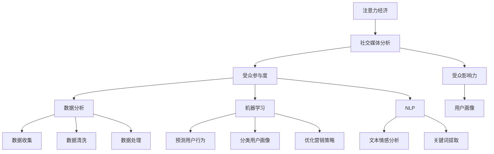

                 

# 注意力经济与社交媒体分析洞见：了解受众参与度和影响力的秘密

> 关键词：注意力经济,社交媒体分析,受众参与度,受众影响力,数据分析,算法

## 1. 背景介绍

### 1.1 问题由来
在数字化时代，信息爆炸和注意力稀缺并存。数据、信息、知识、思想等各类信息以指数级的速度增长，而人们的时间、精力、注意力等有限资源却被不断稀释。在这样的背景下，如何高效分配和使用这些资源，成为许多企业、媒体、社交平台关注的焦点。

近年来，社交媒体的兴起更是推动了注意力经济的发展。用户的大量互动、内容生成和分享，使得社交媒体平台成为了信息流通、内容传播的枢纽，同时也成为了企业品牌推广、市场洞察、用户分析的重要工具。利用社交媒体数据，可以洞悉受众的兴趣、偏好、行为模式，优化信息推送策略，提升品牌影响力，推动用户参与。

### 1.2 问题核心关键点
社交媒体分析的核心问题是如何从庞大的数据中挖掘出有用的信息，识别出潜在的目标受众群体，并根据不同群体的特征，制定出更为精准的营销策略和用户参与方案。这涉及到以下几个方面：

- 受众识别：识别出具有特定行为特征的受众群体，如活跃度、粘性、互动频次等。
- 用户画像：构建不同受众的详细画像，包括兴趣、需求、行为等。
- 内容分析：分析用户对不同内容的反应，如点赞、评论、分享等，以评估内容质量和吸引力。
- 互动分析：评估用户与平台之间的互动深度，如关注、评论、点赞、转发等。
- 影响力分析：评估个体或群体的影响力，如粉丝数、传播范围、情感倾向等。

本文将围绕注意力经济和社交媒体分析，探讨如何通过数据分析，识别受众参与度和影响力，从而制定出更加精准和有效的营销策略。

## 2. 核心概念与联系

### 2.1 核心概念概述

为更好地理解注意力经济和社交媒体分析，本节将介绍几个密切相关的核心概念：

- 注意力经济(Attention Economy)：指在信息爆炸时代，注意力作为一种稀缺资源，其分配和利用对信息传递和价值创造具有决定性影响的经济形态。通过有效的注意力管理，可以实现高效的信息传播和价值转化。

- 社交媒体分析(Social Media Analytics)：通过挖掘社交媒体上的用户行为数据，分析用户的兴趣、偏好、行为模式，为市场营销、品牌建设、用户管理等提供决策支持。

- 受众参与度(Participation Degree)：指用户对某个品牌或内容的参与程度，包括评论、点赞、分享、互动次数等。参与度是评估用户兴趣和品牌影响力的重要指标。

- 受众影响力(Influence Index)：指用户在社交媒体上的影响力大小，包括粉丝数、传播范围、情感倾向等。影响力强的用户能够带动大量粉丝关注和参与。

- 数据分析(Data Analysis)：指从大规模数据集中提取有价值信息的过程。包括数据收集、清洗、处理、可视化、分析等环节。数据分析是实现社交媒体分析的基础。

- 机器学习(Machine Learning)：指利用数据训练模型，从数据中学习规律和模式。机器学习模型可以用于预测用户行为、分类用户画像、优化营销策略等。

- 自然语言处理(Natural Language Processing, NLP)：指使用计算机处理和理解自然语言的技术。在社交媒体分析中，NLP常用于分析用户评论、文本情感、关键词提取等。

这些核心概念之间的逻辑关系可以通过以下Mermaid流程图来展示：



这个流程图展示了注意力经济、社交媒体分析、受众参与度、受众影响力、数据分析、机器学习、自然语言处理等核心概念之间的联系，以及它们在社交媒体分析中的作用和价值。

## 3. 核心算法原理 & 具体操作步骤
### 3.1 算法原理概述

社交媒体分析涉及多维度的数据处理和分析，其核心算法原理包括：

- 数据采集与清洗：从社交媒体平台收集原始数据，并进行数据预处理，如去除噪声、缺失值处理、数据标准化等。

- 用户画像构建：通过分析用户的关注、互动、评论等行为数据，构建用户画像。用户画像包括兴趣、需求、行为模式等。

- 情感分析：使用自然语言处理技术，分析用户评论、帖子等的情感倾向，以评估用户对品牌、产品、内容的情感态度。

- 内容分析：评估用户对不同内容的反应，如点赞、评论、分享等，以评估内容质量和吸引力。

- 受众识别：识别出具有特定行为特征的受众群体，如活跃度、粘性、互动频次等。

- 受众影响力分析：评估个体或群体的影响力，如粉丝数、传播范围、情感倾向等。

- 行为预测：利用机器学习算法，预测用户未来行为，以优化营销策略和广告投放。

- 数据可视化：将分析结果以图表、报告等形式呈现，便于理解和决策。

### 3.2 算法步骤详解

社交媒体分析的算法步骤包括：

**Step 1: 数据收集与预处理**
- 使用API或其他方式从社交媒体平台收集原始数据。
- 清洗数据，去除噪声、处理缺失值、进行标准化处理。
- 选择合适的数据格式，便于后续分析。

**Step 2: 用户画像构建**
- 对用户的行为数据进行特征提取，如关注人数、点赞数、评论数、互动频次等。
- 使用聚类算法或分类算法，对用户进行分组，构建不同用户画像。
- 保存用户画像，用于后续分析。

**Step 3: 情感分析**
- 使用自然语言处理技术，如TF-IDF、情感词典、深度学习等，对用户评论、帖子等文本数据进行情感分析。
- 计算情感极性得分，如积极、中性、消极等。
- 可视化情感分析结果，如情感分布图、情感趋势图等。

**Step 4: 内容分析**
- 对用户互动数据进行特征提取，如点赞数、评论数、分享数等。
- 使用回归分析或分类分析，评估不同内容的质量和吸引力。
- 可视化内容分析结果，如内容互动热力图、内容热度排名等。

**Step 5: 受众识别**
- 对用户行为数据进行特征提取，如关注频次、互动频次、评论情感等。
- 使用聚类算法或分类算法，识别出具有特定行为特征的受众群体。
- 可视化受众识别结果，如受众行为分布图、受众热力图等。

**Step 6: 受众影响力分析**
- 对用户的影响力数据进行特征提取，如粉丝数、传播范围、情感倾向等。
- 使用回归分析或分类分析，评估不同用户或群体的影响力。
- 可视化受众影响力分析结果，如影响力排名、影响力分布图等。

**Step 7: 行为预测**
- 使用机器学习算法，如随机森林、神经网络等，预测用户未来行为。
- 根据预测结果，优化营销策略和广告投放。
- 可视化行为预测结果，如预测精准度、行为分布图等。

**Step 8: 数据可视化**
- 使用数据可视化工具，如Tableau、Power BI等，将分析结果以图表、报告等形式呈现。
- 便于理解和决策，如可视化受众画像、情感分析结果、内容分析结果等。

### 3.3 算法优缺点

社交媒体分析的算法有以下优点：

- 全面覆盖：能够从多维度对社交媒体数据进行分析，包括用户画像、内容质量、受众参与度、受众影响力等。
- 精准度提升：利用机器学习、自然语言处理等技术，提高了分析的精度和深度。
- 实时性：能够实时监测用户行为变化，及时调整营销策略和广告投放。
- 可操作性强：分析结果可以可视化，便于理解和决策。

同时，该方法也存在一些局限性：

- 数据依赖：需要大量高质量的社交媒体数据，数据质量差或样本不足会影响分析结果。
- 数据隐私：涉及用户行为隐私，需要遵守数据隐私法律法规。
- 模型复杂：涉及多种算法模型，模型设计复杂。
- 成本高：需要大量的计算资源和时间成本，特别是在大规模数据处理和模型训练方面。
- 结果可解释性不足：复杂模型黑盒，结果难以解释。

尽管存在这些局限性，但就目前而言，社交媒体分析仍然是最主流和有效的分析手段。未来相关研究的重点在于如何进一步降低数据获取和处理成本，提高模型可解释性和用户隐私保护。

### 3.4 算法应用领域

社交媒体分析的应用领域非常广泛，主要包括：

- 品牌建设：通过分析用户对品牌、产品的情感态度，优化品牌建设和营销策略。
- 市场洞察：分析用户行为数据，洞察市场趋势和用户需求，制定更精准的营销方案。
- 用户管理：构建用户画像，识别出潜在的用户群体，提升用户转化率和忠诚度。
- 内容优化：评估不同内容的质量和吸引力，优化内容生成和分发策略。
- 广告投放：预测用户行为，优化广告投放策略，提升广告效果和ROI。
- 危机管理：实时监测用户反馈，及时响应和处理负面信息，提升品牌形象。

此外，社交媒体分析在媒体、新闻、政府等各个领域都有广泛应用，为决策者提供了更为全面和精准的数据支持。

## 4. 数学模型和公式 & 详细讲解 & 举例说明

### 4.1 数学模型构建

社交媒体分析涉及多种数学模型和算法，以下列举几个常用的模型和算法：

- 聚类算法：如K-means、层次聚类、DBSCAN等，用于将用户分组，构建用户画像。
- 回归分析：如线性回归、逻辑回归、多项式回归等，用于预测用户行为和评估内容质量。
- 分类算法：如决策树、随机森林、支持向量机等，用于分类用户画像、评估用户情感等。
- 自然语言处理算法：如TF-IDF、情感词典、情感分析模型等，用于情感分析和关键词提取。

以用户画像构建为例，假设社交媒体平台上有N个用户，每个用户有M个行为特征，如关注人数、点赞数、评论数等。记用户特征矩阵为 $X_{N\times M}$，其中 $x_{ij}$ 表示第 $i$ 个用户在特征 $j$ 上的值。记用户聚类数为K，构建用户聚类矩阵 $C_{N\times K}$，其中 $c_{ik}$ 表示第 $i$ 个用户属于第 $k$ 个聚类的概率。用户画像可以表示为用户聚类矩阵的统计特征，如平均关注人数、平均点赞数等。

### 4.2 公式推导过程

以用户情感分析为例，假设对用户评论 $d$ 进行情感分析，情感分类结果为积极、中性、消极三种，记为 $y$。使用二分类逻辑回归模型进行情感分类，其公式如下：

$$
\hat{y} = \text{sigmoid}(w_0 + w_1x_1 + w_2x_2 + \cdots + w_nx_n)
$$

其中 $w_i$ 为回归系数，$x_i$ 为用户评论中第 $i$ 个特征的取值。情感分类结果 $y$ 的概率分布为：

$$
P(y=1|x) = \text{sigmoid}(w_0 + w_1x_1 + w_2x_2 + \cdots + w_nx_n)
$$

$$
P(y=0|x) = 1 - P(y=1|x)
$$

通过最大化似然函数和正则化项，对模型参数 $w$ 进行优化，得到情感分类的最优参数。

### 4.3 案例分析与讲解

以Twitter上的用户情感分析为例，分析用户对某品牌产品的情感倾向。假设已收集到N个用户的评论数据，每个评论有L个特征，如是否提及品牌、是否使用正面情感词汇等。使用TF-IDF提取评论的关键词，统计关键词的情感极性得分，构建特征向量 $x_i$。使用二分类逻辑回归模型进行情感分类，得到情感极性得分 $\hat{y}_i$。对N个评论进行预测，得到情感极性分布。

## 5. 项目实践：代码实例和详细解释说明
### 5.1 开发环境搭建

在进行社交媒体分析实践前，我们需要准备好开发环境。以下是使用Python进行Pandas和NLP工具库的开发环境配置流程：

1. 安装Anaconda：从官网下载并安装Anaconda，用于创建独立的Python环境。

2. 创建并激活虚拟环境：
```bash
conda create -n socialmedia-env python=3.8 
conda activate socialmedia-env
```

3. 安装Pandas：
```bash
conda install pandas
```

4. 安装Natural Language Toolkit（NLTK）：
```bash
pip install nltk
```

5. 安装nltk数据集：
```bash
python -m nltk.downloader punkt
```

6. 安装Scikit-learn：
```bash
pip install scikit-learn
```

7. 安装TensorFlow：
```bash
pip install tensorflow
```

完成上述步骤后，即可在`socialmedia-env`环境中开始社交媒体分析实践。

### 5.2 源代码详细实现

下面我们以Twitter上的用户情感分析为例，给出使用Pandas、NLTK和Scikit-learn进行情感分析的PyTorch代码实现。

首先，准备情感分类数据集，使用NLTK分词工具对评论进行分词处理：

```python
import pandas as pd
import nltk
from nltk.corpus import stopwords
from nltk.tokenize import word_tokenize

# 读取数据集
data = pd.read_csv('twitter_data.csv')

# 分词和去除停用词
data['text'] = data['text'].apply(lambda x: word_tokenize(x))
stop_words = set(stopwords.words('english'))
data['text'] = data['text'].apply(lambda x: [word for word in x if word not in stop_words])

# 提取特征
data['features'] = data['text'].apply(lambda x: [x.count('good'), x.count('bad'), x.count('neutral')])
```

然后，定义情感分类模型：

```python
from sklearn.model_selection import train_test_split
from sklearn.linear_model import LogisticRegression
from sklearn.metrics import accuracy_score

# 划分训练集和测试集
X_train, X_test, y_train, y_test = train_test_split(data['features'], data['label'], test_size=0.2, random_state=42)

# 定义逻辑回归模型
model = LogisticRegression()

# 训练模型
model.fit(X_train, y_train)

# 预测和评估
y_pred = model.predict(X_test)
accuracy = accuracy_score(y_test, y_pred)
print(f"模型准确度：{accuracy:.2f}")
```

最后，进行情感分析可视化：

```python
import matplotlib.pyplot as plt
import seaborn as sns

# 可视化情感分布
sns.countplot(data['label'])
plt.show()

# 可视化情感分类结果
sns.barplot(x=y_test, y=y_pred)
plt.show()
```

以上就是使用Pandas、NLTK和Scikit-learn对Twitter用户情感进行分析的完整代码实现。可以看到，Python的Pandas、NLTK和Scikit-learn等库能够方便地进行数据处理、特征提取和模型训练，使得社交媒体分析变得简洁高效。

### 5.3 代码解读与分析

让我们再详细解读一下关键代码的实现细节：

**NLTK分词和停用词处理**：
- 使用NLTK的word_tokenize方法对评论进行分词，获取单词列表。
- 使用stopwords列表获取英语停用词，从单词列表中去除停用词。

**特征提取**：
- 对评论进行分词和停用词处理后，统计单词列表中各类情感词汇的数量。
- 将情感词汇数量作为特征，用于构建特征向量。

**模型训练**：
- 使用train_test_split方法将数据集划分为训练集和测试集。
- 使用Scikit-learn的LogisticRegression模型进行情感分类，训练模型并预测测试集。

**结果评估**：
- 使用accuracy_score方法计算模型在测试集上的准确度。
- 使用Matplotlib和Seaborn进行情感分布和分类结果的可视化。

可以看到，Python的Pandas、NLTK和Scikit-learn等库能够方便地进行数据处理、特征提取和模型训练，使得社交媒体分析变得简洁高效。

当然，工业级的系统实现还需考虑更多因素，如模型的保存和部署、超参数的自动搜索、更灵活的任务适配层等。但核心的社交媒体分析范式基本与此类似。

## 6. 实际应用场景
### 6.1 品牌建设

社交媒体分析在品牌建设中的应用非常广泛。通过分析用户对品牌、产品的情感态度，品牌方可以及时调整营销策略，提升品牌形象和用户满意度。

例如，某品牌在社交媒体上推出新产品，可以通过分析用户评论、帖子等数据，评估用户对新产品的情感倾向。根据情感分析结果，及时调整产品设计和营销策略，优化用户体验，提升用户满意度。

### 6.2 市场洞察

社交媒体分析还可以用于市场洞察，帮助企业及时掌握市场趋势和用户需求。

例如，某电商企业通过分析用户行为数据，发现某款产品在用户中的热销趋势。根据用户画像和行为分析，企业可以及时调整库存和营销策略，满足市场需求，提升销售额。

### 6.3 用户管理

社交媒体分析在用户管理方面也有重要应用。通过构建用户画像，识别出潜在的用户群体，企业可以制定更有针对性的营销策略，提升用户转化率和忠诚度。

例如，某社交平台通过分析用户行为数据，发现某类用户的活跃度和粘性较高。根据用户画像，平台可以推出针对该用户群体的专属活动和优惠，提升用户粘性和活跃度。

### 6.4 内容优化

社交媒体分析还可以用于内容优化，帮助企业优化内容生成和分发策略。

例如，某新闻媒体通过分析用户互动数据，发现某类内容在用户中具有较高的吸引力。根据内容分析结果，媒体可以优化内容生成和分发策略，提升用户参与度和内容传播效果。

### 6.5 广告投放

社交媒体分析还可以用于广告投放，帮助企业优化广告策略，提升广告效果和ROI。

例如，某企业通过分析用户行为数据，发现某类用户对某一广告有较高的互动频次。根据用户画像和行为分析，企业可以调整广告投放策略，优化广告定向和投放位置，提升广告效果。

### 6.6 危机管理

社交媒体分析还可以用于危机管理，帮助企业及时响应和处理负面信息，提升品牌形象。

例如，某企业在社交媒体上遇到负面信息，通过分析用户评论和帖子，及时识别出负面信息的核心原因。根据情感分析结果，企业可以采取相应的公关措施，提升品牌形象。

## 7. 工具和资源推荐
### 7.1 学习资源推荐

为了帮助开发者系统掌握社交媒体分析的理论基础和实践技巧，这里推荐一些优质的学习资源：

1. 《Python数据分析实战》：详细介绍了如何使用Pandas、NLTK、Scikit-learn等库进行数据分析，包括数据清洗、特征提取、模型训练等。

2. 《自然语言处理入门》：介绍了自然语言处理的基本概念和常用技术，如分词、停用词处理、情感分析等。

3. 《机器学习实战》：介绍了机器学习的基本概念和常用算法，如回归分析、分类算法等。

4. 《数据分析与Python》：介绍了数据分析的基本流程和常用工具，如Pandas、NumPy、Matplotlib等。

5. 《社交媒体数据分析与可视化》：介绍了如何使用Python进行社交媒体数据分析和可视化，包括数据清洗、特征提取、模型训练等。

通过对这些资源的学习实践，相信你一定能够快速掌握社交媒体分析的精髓，并用于解决实际的社交媒体问题。

### 7.2 开发工具推荐

高效的开发离不开优秀的工具支持。以下是几款用于社交媒体分析开发的常用工具：

1. Python：数据处理、特征提取、模型训练等数据科学任务的首选语言。

2. Pandas：数据处理和分析的库，提供了高效的数据结构和数据操作功能。

3. NLTK：自然语言处理工具包，提供了分词、停用词处理、情感分析等功能。

4. Scikit-learn：机器学习库，提供了多种分类、回归、聚类等算法。

5. Matplotlib和Seaborn：数据可视化的库，提供了丰富的图表呈现方式。

6. Jupyter Notebook：交互式编程环境，便于代码调试和可视化展示。

合理利用这些工具，可以显著提升社交媒体分析任务的开发效率，加快创新迭代的步伐。

### 7.3 相关论文推荐

社交媒体分析的发展源于学界的持续研究。以下是几篇奠基性的相关论文，推荐阅读：

1. "An Empirical Study of Subjectivity in Twitter using Natural Language Processing"：通过分析Twitter上的用户评论，评估用户对某品牌的情感倾向。

2. "Twitter Mining with a Logistic Regression Classifier"：使用逻辑回归模型分析Twitter上的用户评论，识别积极、中立、消极三种情感。

3. "A Survey on Sentiment Analysis: Approaches, Issues and Challenges"：对情感分析的研究现状、技术挑战和未来发展进行了全面综述。

4. "A Study of Social Media Sentiment Analysis Using Text Mining Techniques"：使用文本挖掘技术分析Twitter上的用户评论，评估用户对某品牌的情感倾向。

5. "Evolving Sentiment Analysis Models for Microblogging and Online Reviews"：提出多模型融合的方法，提升情感分析的准确度。

这些论文代表了大语言模型微调技术的发展脉络。通过学习这些前沿成果，可以帮助研究者把握学科前进方向，激发更多的创新灵感。

## 8. 总结：未来发展趋势与挑战

### 8.1 总结

本文对社交媒体分析进行了全面系统的介绍。首先阐述了注意力经济和社交媒体分析的研究背景和意义，明确了社交媒体分析在品牌建设、市场洞察、用户管理、内容优化、广告投放、危机管理等诸多领域的独特价值。其次，从原理到实践，详细讲解了社交媒体分析的数学模型和算法步骤，给出了社交媒体分析任务开发的完整代码实例。同时，本文还广泛探讨了社交媒体分析在品牌建设、市场洞察、用户管理、内容优化、广告投放、危机管理等多个行业领域的应用前景，展示了社交媒体分析范式的巨大潜力。

通过本文的系统梳理，可以看到，社交媒体分析在数字化时代具有广泛的应用价值，能够为品牌建设、市场洞察、用户管理、内容优化、广告投放、危机管理等多个方面提供重要支持。社交媒体分析的技术不断进步，未来将能够更好地服务企业和用户，推动数字化转型和社会进步。

### 8.2 未来发展趋势

展望未来，社交媒体分析的发展趋势包括：

1. 数据自动化获取和处理：利用API、爬虫等技术，自动化获取社交媒体数据，进行数据清洗、特征提取和预处理，减少人工成本。

2. 实时数据分析：利用流式处理技术，实时监测用户行为变化，及时调整营销策略和广告投放。

3. 多模态数据分析：结合文本、图片、视频等多模态数据，进行更加全面和深入的分析。

4. 可解释性增强：利用可解释性模型，提高社交媒体分析的透明度和可信度。

5. 跨领域应用拓展：将社交媒体分析应用于更多的行业领域，如金融、医疗、政府等。

6. 人工智能技术融合：结合自然语言处理、机器学习、计算机视觉等AI技术，提升社交媒体分析的精度和深度。

以上趋势凸显了社交媒体分析的广阔前景。这些方向的探索发展，必将进一步提升社交媒体分析的精确度、实时性和应用范围，为数字化转型和社会进步提供更为强大的技术支撑。

### 8.3 面临的挑战

尽管社交媒体分析已经取得了瞩目成就，但在迈向更加智能化、普适化应用的过程中，它仍面临诸多挑战：

1. 数据隐私和安全：涉及用户隐私和安全问题，需要遵守数据隐私法律法规。

2. 数据质量和噪音：社交媒体数据存在大量噪声和异常值，需要处理和清洗。

3. 数据规模和复杂性：社交媒体数据规模大、维度高，需要高效的数据处理和存储技术。

4. 模型复杂度和可解释性：涉及多种算法模型，模型设计复杂，结果难以解释。

5. 数据实时性：实时数据处理和分析需要高并发的计算资源和技术支持。

6. 用户行为多样性：用户行为模式复杂多变，需要动态调整分析策略。

正视社交媒体分析面临的这些挑战，积极应对并寻求突破，将是大数据和人工智能技术走向成熟的必由之路。相信随着学界和产业界的共同努力，这些挑战终将一一被克服，社交媒体分析技术必将迎来更加广阔的发展前景。

### 8.4 研究展望

面向未来，社交媒体分析技术需要在以下几个方面寻求新的突破：

1. 探索无监督和半监督数据分析方法：摆脱对大量标注数据的依赖，利用自监督学习、主动学习等方法，最大限度利用非结构化数据。

2. 研究多模态数据分析技术：结合文本、图片、视频等多模态数据，进行更加全面和深入的分析，提升分析的精确度和深度。

3. 发展可解释性模型：提高社交媒体分析的透明度和可信度，使分析结果更具可解释性。

4. 引入自然语言处理技术：结合自然语言处理技术，提升情感分析、文本分类等任务的精度和深度。

5. 结合人工智能技术：结合自然语言处理、机器学习、计算机视觉等AI技术，提升社交媒体分析的精度和深度。

6. 纳入伦理道德约束：在分析过程中考虑伦理道德问题，保护用户隐私和数据安全。

这些研究方向的探索，必将引领社交媒体分析技术迈向更高的台阶，为品牌建设、市场洞察、用户管理、内容优化、广告投放、危机管理等各个领域提供更加全面和精准的数据支持。面向未来，社交媒体分析技术需要与其他人工智能技术进行更深入的融合，共同推动社会进步和数字转型。

## 9. 附录：常见问题与解答

**Q1：社交媒体分析能否适用于所有社交平台？**

A: 社交媒体分析在大多数社交平台上都有广泛的应用，如Twitter、Facebook、Instagram等。但不同平台的特性和数据格式不同，需要进行适当的适配和处理。例如，Facebook上用户发布的帖子通常包含图片、视频等多媒体内容，需要进行多媒体数据处理和分析。

**Q2：如何进行多模态数据分析？**

A: 多模态数据分析是指结合文本、图片、视频等多模态数据，进行全面和深入的分析。可以使用深度学习模型，如卷积神经网络(CNN)、循环神经网络(RNN)、多模态深度学习模型等，对多模态数据进行处理和分析。

**Q3：如何保护用户隐私和数据安全？**

A: 社交媒体分析需要遵守数据隐私法律法规，如GDPR等。在使用数据时，应确保用户知情同意，保护用户隐私。同时，对数据进行加密处理，防止数据泄露和滥用。

**Q4：如何提高分析结果的可解释性？**

A: 提高分析结果的可解释性需要结合领域知识和实际应用场景，解释模型内部机制和推理过程。可以使用可解释性模型，如LIME、SHAP等，对模型进行解释和可视化。

**Q5：如何优化实时数据分析的性能？**

A: 实时数据分析需要高并发的计算资源和技术支持。可以使用流式处理技术，如Apache Kafka、Apache Flink等，对实时数据进行高效处理和分析。同时，对模型进行优化，减少计算量和内存占用，提升实时分析的性能。

通过本文的系统梳理，可以看到，社交媒体分析在数字化时代具有广泛的应用价值，能够为品牌建设、市场洞察、用户管理、内容优化、广告投放、危机管理等多个方面提供重要支持。社交媒体分析的技术不断进步，未来将能够更好地服务企业和用户，推动数字化转型和社会进步。

---

作者：禅与计算机程序设计艺术 / Zen and the Art of Computer Programming

