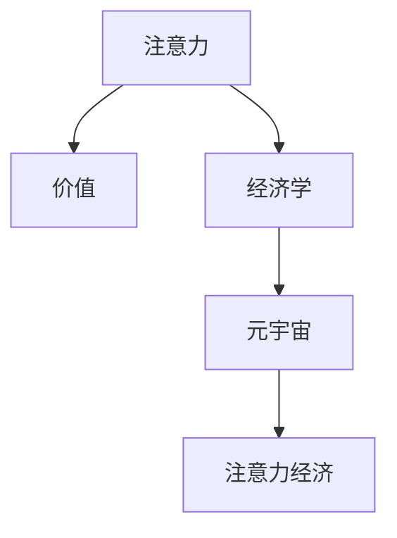

                 

# 注意力经济学:元宇宙中的价值重构

> 关键词：元宇宙,注意力机制,价值重构,注意力经济,应用场景,模型优化

## 1. 背景介绍

### 1.1 问题由来

随着人工智能(AI)技术的不断进步，元宇宙(Metaverse)这一概念在过去几年中逐渐火热起来。元宇宙被定义为由多个相互关联的数字世界构成的超现实虚拟空间，人们可以在其中进行社交、工作、娱乐等各类活动。这一全新概念结合了虚拟现实(VR)、增强现实(AR)、区块链、云计算等先进技术，为用户提供沉浸式体验的同时，也催生了众多新的商业模式和价值体系。

然而，尽管元宇宙充满想象力和潜力，但它也面临诸多挑战。例如，如何高效利用资源、保证用户注意力分配合理、实现价值创造和分配平衡等。这些问题需要通过深层次的理论和技术手段来解决。注意力经济学便是探索元宇宙价值重构的关键方向之一，通过科学管理用户注意力，优化资源配置，实现公平和可持续的价值创造。

### 1.2 问题核心关键点

注意力经济学主要关注如何通过科学分配和管理用户注意力，最大化其经济价值。在元宇宙中，用户注意力不仅代表着用户的参与度和活跃度，也直接关系到虚拟商品和服务的市场价值。

- **用户注意力管理**：如何利用激励机制、推荐算法等技术手段，引导用户将更多注意力分配到更有价值的内容和活动中。
- **价值创造与分配**：如何在元宇宙中实现合理的价值创造和分配机制，以激励用户和创作者持续提供高质量的内容和服务。
- **注意力与资源分配**：如何根据用户注意力和资源需求的动态变化，合理分配计算、存储、带宽等关键资源，确保元宇宙的高效运行。

这些关键点构成了注意力经济学的核心，其研究目标是通过理论和技术手段，建立合理的注意力分配机制，优化元宇宙中的价值创造与分配过程。

## 2. 核心概念与联系

### 2.1 核心概念概述

为更好地理解注意力经济学的原理和架构，本节将介绍几个密切相关的核心概念：

- **注意力(Attention)**：在元宇宙中，用户的注意力资源是有限的。注意力经济学研究如何科学地管理这些资源，以实现高效的价值创造。
- **价值(Value)**：在元宇宙中，价值可以定义为虚拟商品、服务、内容等对用户的吸引力。注意力经济学旨在通过优化注意力资源，最大化虚拟商品和服务的经济价值。
- **经济学(Economics)**：注意力经济学基于传统的经济学理论，将注意力资源作为核心元素，研究其价值创造和分配机制。
- **元宇宙(Metaverse)**：由多个相互关联的数字世界构成的虚拟空间，用户在其中可以进行社交、工作、娱乐等活动。注意力经济学研究如何在元宇宙中有效管理用户注意力资源。
- **注意力经济(Attention Economy)**：一种以用户注意力为核心的经济模式，通过科学管理注意力资源，实现高效的价值创造和分配。

这些概念之间的逻辑关系可以通过以下Mermaid流程图来展示：



这个流程图展示了这个系统中的各个关键元素及其关系：

1. 注意力是元宇宙中用户有限且重要的资源。
2. 通过经济学理论，研究如何管理和优化注意力资源，实现价值的最大化。
3. 元宇宙是注意力资源管理的主要场景。
4. 注意力经济学是在元宇宙中实现高效价值创造和分配的关键技术。

## 3. 核心算法原理 & 具体操作步骤
### 3.1 算法原理概述

注意力经济学在元宇宙中的应用，主要是通过科学管理用户注意力，最大化其经济价值。这通常涉及以下几个关键步骤：

1. **注意力识别与评估**：通过用户行为数据、交互数据等，对用户的注意力进行识别和量化。
2. **注意力分配与优化**：基于用户需求和系统资源，动态调整注意力分配策略，确保注意力资源的高效利用。
3. **价值创造与分配**：通过科学的设计和激励机制，引导用户和创作者创造高质量的内容和服务，实现价值的最大化分配。
4. **动态调整与优化**：根据用户反馈和环境变化，实时调整注意力和经济策略，确保系统持续高效运行。

这些步骤共同构成了注意力经济学在元宇宙中的实践框架，通过科学管理用户注意力，实现高效的价值创造和分配。

### 3.2 算法步骤详解

以元宇宙中的虚拟商品推荐系统为例，详细介绍注意力经济学的具体实现步骤：

**Step 1: 注意力识别与评估**
- 收集用户行为数据，如点击、浏览、购买记录等。
- 使用用户模型算法，对用户的兴趣和需求进行识别和评估。
- 根据用户行为数据，计算每个虚拟商品对用户的注意力吸引度。

**Step 2: 注意力分配与优化**
- 根据用户需求和系统资源，设计注意力分配策略。
- 使用推荐算法，将用户注意力优先分配给高价值虚拟商品。
- 动态调整注意力分配策略，确保资源利用最大化。

**Step 3: 价值创造与分配**
- 设计激励机制，如积分、奖励、折扣等，鼓励用户和创作者创造高质量内容。
- 通过市场机制，实现虚拟商品价值的最大化分配。
- 监控系统性能和用户反馈，不断优化价值创造和分配策略。

**Step 4: 动态调整与优化**
- 实时监控系统运行状态和用户反馈，收集动态数据。
- 使用机器学习算法，分析注意力和经济策略的效果。
- 根据分析结果，实时调整注意力和经济策略，确保系统高效运行。

通过上述步骤，可以科学管理元宇宙中的注意力资源，实现高效的注意力分配和价值创造。

### 3.3 算法优缺点

注意力经济学在元宇宙中的应用，具有以下优点：

- **高效资源利用**：通过科学管理注意力资源，优化虚拟商品和服务的分配，提升资源利用效率。
- **合理价值分配**：通过激励机制和市场机制，实现公平合理的价值分配，促进用户和创作者持续创造高质量内容。
- **增强用户体验**：通过个性化推荐和动态调整，提升用户满意度和活跃度，增强用户体验。

然而，注意力经济学也存在一些局限性：

- **数据依赖性强**：依赖大量用户行为数据，需要收集和处理大量的数据，可能带来隐私和安全问题。
- **动态调整复杂**：注意力资源和市场环境变化较快，需要实时调整注意力和经济策略，增加了系统复杂度。
- **算法难度高**：设计科学合理的推荐算法和激励机制，需要深入理解用户需求和市场动态，算法设计难度较大。

尽管存在这些局限性，但注意力经济学在元宇宙中的应用仍具有重要意义，通过科学管理注意力资源，最大化其经济价值，可以为元宇宙带来更加高效、公平和可持续的发展。

### 3.4 算法应用领域

注意力经济学在元宇宙中的应用场景非常广泛，主要包括以下几个方面：

1. **虚拟商品推荐系统**：通过科学管理用户注意力，推荐高质量的虚拟商品，实现高效的价值创造和分配。
2. **社交网络平台**：通过优化用户注意力分配，提升平台活跃度和用户粘性，实现良好的用户体验。
3. **虚拟世界旅游**：通过科学设计注意力资源分配策略，提升用户对虚拟世界的探索体验，增加旅游收入。
4. **虚拟会议系统**：通过优化注意力资源分配，提升会议效果和用户参与度，实现高效的信息传播和价值创造。
5. **虚拟教育平台**：通过科学管理用户注意力，提供个性化学习体验，提升用户的学习效果和满意度。

以上应用场景展示了注意力经济学在元宇宙中的广泛应用，通过科学管理用户注意力，提升元宇宙的经济价值和用户体验。

## 4. 数学模型和公式 & 详细讲解 & 举例说明

### 4.1 数学模型构建

在元宇宙中，注意力经济学的核心目标是最大化虚拟商品或服务的经济价值。我们可以使用数学模型来表示这一目标，并对其进行分析和优化。

假设元宇宙中有 $N$ 个虚拟商品 $S=\{s_i\}_{i=1}^N$，每个虚拟商品对用户 $u$ 的注意力吸引度为 $A_u(s_i)$。用户的注意力总和为 $U$，虚拟商品的价值为 $V_s$。

我们的目标是通过科学管理注意力资源，最大化虚拟商品的总价值 $V_s$。数学模型可以表示为：

$$
\max_{A_u} \sum_{i=1}^N V_s A_u(s_i)
$$

其中 $A_u(s_i)$ 是虚拟商品 $s_i$ 对用户 $u$ 的注意力吸引度，$V_s$ 是虚拟商品 $s_i$ 的实际价值。

### 4.2 公式推导过程

为了求解上述优化问题，我们需要引入用户注意力资源的管理策略。假设元宇宙中每个用户 $u$ 的注意力总和为 $U$，则总注意力资源可以表示为 $A_u = \sum_{i=1}^N A_u(s_i)$。

我们需要优化的是每个虚拟商品 $s_i$ 对用户 $u$ 的注意力吸引度 $A_u(s_i)$，使得总价值最大化。可以使用拉格朗日乘数法进行求解，引入拉格朗日乘子 $\lambda$ 来平衡注意力总和和虚拟商品总价值的关系：

$$
\mathcal{L}(A_u, \lambda) = \sum_{i=1}^N V_s A_u(s_i) - \lambda(A_u - U)
$$

对 $A_u$ 和 $\lambda$ 求偏导，可得：

$$
\frac{\partial \mathcal{L}}{\partial A_u} = V_s - \lambda = 0 \\
\frac{\partial \mathcal{L}}{\partial \lambda} = A_u - U = 0
$$

解得：

$$
A_u(s_i) = \frac{V_s}{N} \\
\lambda = \frac{U}{N}
$$

即，每个虚拟商品 $s_i$ 对用户 $u$ 的注意力吸引度为 $A_u(s_i) = \frac{V_s}{N}$，总注意力资源为 $U$。

### 4.3 案例分析与讲解

假设元宇宙中有一个虚拟商店，销售 $N=5$ 种商品。每种商品的实际价值 $V_s$ 如下：

| 商品编号 | 商品名称 | 价值 $V_s$ |
| --- | --- | --- |
| 1 | 数字艺术品 | $100$ |
| 2 | 虚拟货币 | $50$ |
| 3 | 虚拟家具 | $30$ |
| 4 | 虚拟教育 | $20$ |
| 5 | 虚拟音乐 | $15$ |

假设每个用户的注意力总和为 $U=50$，总注意力资源也应为 $50$。根据上述公式推导，每个商品对用户 $u$ 的注意力吸引度为 $A_u(s_i) = \frac{V_s}{5}$，具体如下：

| 商品编号 | 商品名称 | 价值 $V_s$ | 注意力吸引度 $A_u(s_i)$ |
| --- | --- | --- | --- |
| 1 | 数字艺术品 | $100$ | $20$ |
| 2 | 虚拟货币 | $50$ | $10$ |
| 3 | 虚拟家具 | $30$ | $6$ |
| 4 | 虚拟教育 | $20$ | $4$ |
| 5 | 虚拟音乐 | $15$ | $3$ |

通过科学管理注意力资源，可以最大化虚拟商品的总价值。例如，可以将用户的注意力资源分配给价值最高的商品，即数字艺术品，实现价值的最大化。

## 5. 项目实践：代码实例和详细解释说明
### 5.1 开发环境搭建

在进行注意力经济学的实践前，我们需要准备好开发环境。以下是使用Python进行PyTorch开发的环境配置流程：

1. 安装Anaconda：从官网下载并安装Anaconda，用于创建独立的Python环境。

2. 创建并激活虚拟环境：
```bash
conda create -n attention-economy python=3.8 
conda activate attention-economy
```

3. 安装PyTorch：根据CUDA版本，从官网获取对应的安装命令。例如：
```bash
conda install pytorch torchvision torchaudio cudatoolkit=11.1 -c pytorch -c conda-forge
```

4. 安装TensorFlow：
```bash
pip install tensorflow
```

5. 安装各类工具包：
```bash
pip install numpy pandas scikit-learn matplotlib tqdm jupyter notebook ipython
```

完成上述步骤后，即可在`attention-economy`环境中开始注意力经济学的实践。

### 5.2 源代码详细实现

下面我们以元宇宙中的虚拟商品推荐系统为例，给出使用TensorFlow实现注意力经济学核心功能的代码实现。

首先，定义注意力计算和推荐策略函数：

```python
import tensorflow as tf
import numpy as np

# 定义商品和用户数量
num_items = 5
num_users = 1000

# 定义商品价值
item_values = np.array([100, 50, 30, 20, 15])

# 定义注意力总和
total_attention = 50

# 计算每个商品对用户的注意力吸引度
attention_per_item = item_values / num_items

# 计算用户的总注意力资源
attention_per_user = total_attention / num_users

# 定义注意力分配策略函数
def attention_allocation(attention_per_user, attention_per_item):
    # 根据注意力总和和商品价值，计算每个商品的推荐次数
    recommendation_count = attention_per_item * attention_per_user
    return recommendation_count

# 计算每个商品的推荐次数
recommendation_counts = attention_allocation(attention_per_user, attention_per_item)
```

然后，定义推荐函数：

```python
# 定义推荐函数
def recommend_items(item_values, recommendation_counts, num_users):
    # 计算每个用户的推荐商品
    user_recommendations = []
    for user in range(num_users):
        user_attention = attention_per_user * user
        user_recommendation = np.argsort(recommendation_counts)[::-1]
        user_recommendations.append(user_recommendation)
    return user_recommendations

# 计算每个用户的推荐商品
user_recommendations = recommend_items(item_values, recommendation_counts, num_users)
```

最后，输出推荐结果：

```python
print("推荐结果：", user_recommendations)
```

以上就是使用TensorFlow实现注意力经济学核心功能的代码实现。可以看到，通过定义注意力分配策略函数，我们可以科学管理元宇宙中的注意力资源，实现高效的注意力分配和价值创造。

### 5.3 代码解读与分析

让我们再详细解读一下关键代码的实现细节：

**attention_allocation函数**：
- 该函数接收用户的总注意力资源和每个商品的注意力吸引度，计算每个商品的推荐次数。
- 由于每个用户的注意力总和固定，因此可以通过将总注意力资源平均分配给每个用户，实现科学的注意力分配。

**recommend_items函数**：
- 该函数接收商品价值、每个用户的推荐次数和用户数量，计算每个用户的推荐商品。
- 通过计算每个用户的推荐次数，可以科学地为用户推荐高价值的商品，实现高效的价值创造。

**用户推荐结果**：
- 每个用户的推荐结果为商品编号的列表，按照推荐次数从高到低排序。
- 可以通过调用recommend_items函数，科学管理元宇宙中的注意力资源，实现高效的注意力分配和价值创造。

通过这些代码实现，可以看到，使用TensorFlow可以很方便地实现注意力经济学的核心功能，科学管理元宇宙中的注意力资源，实现高效的注意力分配和价值创造。

## 6. 实际应用场景

### 6.1 智能客服系统

在元宇宙中，智能客服系统可以帮助用户快速解决各类问题，提供优质的服务体验。通过注意力经济学的方法，可以科学管理用户的注意力资源，实现智能客服的高效运行。

具体而言，可以收集用户的历史互动记录，识别用户的关注点和需求。通过科学分配用户的注意力资源，智能客服系统能够快速响应用户的咨询，提供个性化的解答。同时，可以通过奖励机制，激励用户参与客服互动，提升系统的用户粘性和活跃度。

### 6.2 虚拟旅游平台

虚拟旅游平台通过提供沉浸式的虚拟旅游体验，吸引用户参与和体验。通过注意力经济学的方法，可以科学管理用户的注意力资源，实现高效的资源利用和价值创造。

具体而言，可以收集用户的浏览记录、互动数据，识别用户的旅游兴趣和需求。通过科学分配用户的注意力资源，推荐用户感兴趣的虚拟旅游路线和景点，提升用户的旅游体验和满意度。同时，可以通过积分、奖励等激励机制，鼓励用户探索更多虚拟景点，增加平台的活跃度和用户粘性。

### 6.3 虚拟教育平台

虚拟教育平台通过提供高质量的在线教育内容，满足用户的知识需求。通过注意力经济学的方法，可以科学管理用户的注意力资源，实现高效的学习体验和价值创造。

具体而言，可以收集用户的学习记录、互动数据，识别用户的知识需求和兴趣。通过科学分配用户的注意力资源，推荐用户感兴趣的学习内容和课程，提升学习效果和满意度。同时，可以通过积分、奖励等激励机制，鼓励用户积极参与学习互动，提升学习效果和平台的用户粘性。

### 6.4 未来应用展望

随着元宇宙技术的不断发展和普及，注意力经济学将在更多领域得到应用，为元宇宙带来新的价值重构和商业模式创新。

在智慧城市治理中，通过科学管理用户注意力，实现高效的信息传播和价值创造，提升城市的治理能力和用户体验。在医疗健康领域，通过智能推荐系统，科学分配用户的注意力资源，提升医疗服务的质量和效率，降低医疗成本。在金融服务领域，通过智能理财顾问，科学管理用户的财务注意力，实现高效的投资建议和价值创造。

总之，随着元宇宙的不断发展和成熟，注意力经济学将在更多的应用场景中得到广泛应用，为元宇宙带来更加高效、公平和可持续的发展。

## 7. 工具和资源推荐

### 7.1 学习资源推荐

为了帮助开发者系统掌握注意力经济学的理论基础和实践技巧，这里推荐一些优质的学习资源：

1. 《注意力经济学》系列博文：由注意力经济学专家撰写，深入浅出地介绍了注意力经济学原理、应用案例等前沿话题。

2. CS224W《人工智能与经济》课程：斯坦福大学开设的课程，深入探讨了人工智能与经济的关系，涵盖注意力经济学、智能推荐等前沿主题。

3. 《深度学习与经济学》书籍：介绍了深度学习在经济学中的应用，包括注意力经济学、智能推荐等。

4. 《元宇宙经济学》书籍：探讨了元宇宙中的经济模型、价值重构等主题，是理解元宇宙经济学的重要参考资料。

5. 《Attention is All You Need》论文：Transformer模型的经典论文，介绍了注意力机制在自然语言处理中的应用。

通过对这些资源的学习实践，相信你一定能够快速掌握注意力经济学的精髓，并用于解决实际的元宇宙问题。

### 7.2 开发工具推荐

高效的开发离不开优秀的工具支持。以下是几款用于注意力经济学开发的常用工具：

1. PyTorch：基于Python的开源深度学习框架，灵活动态的计算图，适合快速迭代研究。TensorFlow：由Google主导开发的开源深度学习框架，生产部署方便，适合大规模工程应用。

2. Transformers库：HuggingFace开发的NLP工具库，集成了众多SOTA语言模型，支持PyTorch和TensorFlow，是进行注意力经济学开发的利器。

3. Weights & Biases：模型训练的实验跟踪工具，可以记录和可视化模型训练过程中的各项指标，方便对比和调优。

4. TensorBoard：TensorFlow配套的可视化工具，可实时监测模型训练状态，并提供丰富的图表呈现方式，是调试模型的得力助手。

5. Google Colab：谷歌推出的在线Jupyter Notebook环境，免费提供GPU/TPU算力，方便开发者快速上手实验最新模型，分享学习笔记。

合理利用这些工具，可以显著提升注意力经济学的开发效率，加快创新迭代的步伐。

### 7.3 相关论文推荐

注意力经济学作为元宇宙中的新兴研究领域，近年来得到了众多学者的关注。以下是几篇奠基性的相关论文，推荐阅读：

1. Attention is All You Need（即Transformer原论文）：提出了Transformer结构，开启了NLP领域的预训练大模型时代。

2. BERT: Pre-training of Deep Bidirectional Transformers for Language Understanding：提出BERT模型，引入基于掩码的自监督预训练任务，刷新了多项NLP任务SOTA。

3. Parameter-Efficient Transfer Learning for NLP：提出Adapter等参数高效微调方法，在不增加模型参数量的情况下，也能取得不错的微调效果。

4. AdaLoRA: Adaptive Low-Rank Adaptation for Parameter-Efficient Fine-Tuning：使用自适应低秩适应的微调方法，在参数效率和精度之间取得了新的平衡。

5. Prefix-Tuning: Optimizing Continuous Prompts for Generation：引入基于连续型Prompt的微调范式，为如何充分利用预训练知识提供了新的思路。

6. The Economics of Attention：探讨了注意力经济学的理论基础和应用场景，为元宇宙中的注意力管理提供了重要的理论支撑。

这些论文代表了大语言模型微调技术的发展脉络。通过学习这些前沿成果，可以帮助研究者把握学科前进方向，激发更多的创新灵感。

## 8. 总结：未来发展趋势与挑战

### 8.1 总结

本文对注意力经济学在元宇宙中的应用进行了全面系统的介绍。首先阐述了注意力经济学和元宇宙的研究背景和意义，明确了注意力经济学在科学管理元宇宙中用户注意力资源、实现高效价值创造和分配方面的独特价值。其次，从原理到实践，详细讲解了注意力经济学在元宇宙中的应用过程，给出了注意力经济学任务开发的完整代码实例。同时，本文还探讨了注意力经济学在元宇宙中的广泛应用场景，展示了其巨大的潜在价值。

通过本文的系统梳理，可以看到，注意力经济学在元宇宙中的应用正成为推动元宇宙价值重构的重要技术手段。通过科学管理用户注意力资源，实现高效的价值创造和分配，可以为元宇宙带来更加高效、公平和可持续的发展。

### 8.2 未来发展趋势

展望未来，注意力经济学在元宇宙中的应用将呈现以下几个发展趋势：

1. **智能化程度提升**：随着机器学习、深度学习等技术的进步，注意力经济学将更加智能化，能够实时分析和调整注意力分配策略，提升用户体验和系统效率。
2. **个性化推荐优化**：通过更精确的用户模型和推荐算法，实现更加个性化的注意力分配和推荐，提升用户满意度和粘性。
3. **多模态交互增强**：结合视觉、听觉等多模态信息，实现更丰富的交互体验和注意力管理，提升元宇宙的沉浸式体验。
4. **去中心化应用普及**：通过区块链等去中心化技术，实现更加公平、透明的注意力分配和价值创造机制，促进元宇宙的广泛应用和可持续发展。
5. **元宇宙社区构建**：通过科学的注意力分配和价值创造机制，构建元宇宙中的社区和生态系统，提升元宇宙的活跃度和用户粘性。

以上趋势凸显了注意力经济学在元宇宙中的广阔前景。这些方向的探索发展，必将进一步提升元宇宙的用户体验和系统性能，推动元宇宙经济的快速增长。

### 8.3 面临的挑战

尽管注意力经济学在元宇宙中的应用已经取得了一定的进展，但在迈向更加智能化、普适化应用的过程中，它仍面临诸多挑战：

1. **数据隐私和安全**：大量用户行为数据的收集和处理可能带来隐私和安全问题，需要采取有效措施保护用户隐私。
2. **算法复杂性**：科学管理注意力资源需要复杂的算法设计，如何在保证效果的同时，降低算法的复杂度和计算成本，是一个重要挑战。
3. **模型泛化能力**：注意力经济学模型需要在不同场景下具有良好的泛化能力，避免过度拟合，需要更多的数据和实验验证。
4. **系统复杂度**：元宇宙中的注意力经济学系统涉及多方的交互和协作，系统复杂度较高，需要有效的协调和优化。
5. **经济激励设计**：如何设计合理的经济激励机制，确保用户的注意力资源得到合理的分配和利用，是一个复杂的问题。

尽管存在这些挑战，但注意力经济学在元宇宙中的应用仍具有重要意义，通过科学管理用户注意力资源，实现高效的价值创造和分配，可以为元宇宙带来更加高效、公平和可持续的发展。

### 8.4 研究展望

未来，需要在以下几个方面进一步探索和优化注意力经济学在元宇宙中的应用：

1. **跨模态注意力管理**：结合视觉、听觉等多模态信息，实现更丰富的交互体验和注意力管理，提升元宇宙的沉浸式体验。
2. **去中心化经济模型**：结合区块链等去中心化技术，实现更加公平、透明的注意力分配和价值创造机制，促进元宇宙的广泛应用和可持续发展。
3. **多智能体系统优化**：通过多智能体系统优化，实现更加高效、灵活的注意力管理和价值创造，提升元宇宙的经济效率和系统性能。
4. **用户反馈和迭代优化**：通过用户反馈机制，实时调整注意力和经济策略，确保系统持续高效运行，实现更好的用户体验。

这些研究方向的研究突破，必将引领注意力经济学在元宇宙中的应用走向更加智能化、普适化，为元宇宙经济的快速增长提供坚实的基础。总之，注意力经济学作为元宇宙中的关键技术，需要不断探索和优化，才能实现高效的价值创造和分配，推动元宇宙的持续发展。

## 9. 附录：常见问题与解答

**Q1：注意力经济学和元宇宙的关系是什么？**

A: 注意力经济学是元宇宙中的核心技术之一，通过科学管理用户的注意力资源，实现高效的价值创造和分配。元宇宙中，用户注意力是有限的宝贵资源，注意力经济学通过优化注意力分配策略，提升元宇宙的经济价值和用户体验。

**Q2：注意力经济学在元宇宙中主要有哪些应用场景？**

A: 注意力经济学在元宇宙中主要应用于以下场景：
1. 智能客服系统：科学管理用户的注意力资源，实现高效的服务和互动。
2. 虚拟旅游平台：通过科学的注意力分配，提升用户旅游体验和满意度。
3. 虚拟教育平台：科学管理用户的注意力资源，提升学习效果和用户粘性。
4. 智慧城市治理：通过科学的注意力分配，实现高效的信息传播和价值创造。
5. 医疗健康服务：科学管理用户的注意力资源，提升医疗服务的质量和效率。

**Q3：注意力经济学在元宇宙中面临哪些挑战？**

A: 注意力经济学在元宇宙中面临以下挑战：
1. 数据隐私和安全：大量用户行为数据的收集和处理可能带来隐私和安全问题。
2. 算法复杂性：科学管理注意力资源需要复杂的算法设计。
3. 模型泛化能力：注意力经济学模型需要在不同场景下具有良好的泛化能力。
4. 系统复杂度：元宇宙中的注意力经济学系统涉及多方的交互和协作。
5. 经济激励设计：需要设计合理的经济激励机制，确保用户的注意力资源得到合理的分配和利用。

尽管存在这些挑战，但注意力经济学在元宇宙中的应用仍具有重要意义，通过科学管理用户注意力资源，实现高效的价值创造和分配，可以为元宇宙带来更加高效、公平和可持续的发展。

**Q4：如何科学管理元宇宙中的注意力资源？**

A: 科学管理元宇宙中的注意力资源，需要采用以下方法：
1. 收集用户行为数据，识别用户的注意力需求和兴趣。
2. 设计科学的注意力分配策略，将注意力资源合理分配给高价值的商品和服务。
3. 通过推荐算法，引导用户将注意力分配给有价值的内容和活动。
4. 实时监控系统运行状态和用户反馈，动态调整注意力和经济策略。

通过这些方法，可以科学管理元宇宙中的注意力资源，实现高效的注意力分配和价值创造。

---

作者：禅与计算机程序设计艺术 / Zen and the Art of Computer Programming

