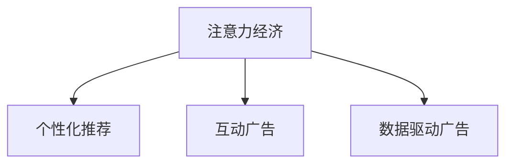

                 

## 1. 背景介绍

在数字经济时代，注意力成为最珍贵的资源之一。传统广告投放策略主要依赖于简单的展示次数计算（CPM）、点击率（CTR）等指标，但这些指标往往与消费者的真实需求和互动效果相去甚远。近年来兴起的注意力经济（Attention Economy）理论，强调关注度、互动性和参与度，为广告投放带来了新的视角。本文将深入探讨注意力经济对传统广告投放策略的挑战，提出相应的应对措施，并对未来发展进行展望。

### 1.1 问题由来

随着互联网的普及，广告投放已经成为企业品牌曝光、产品推广的重要手段。然而，传统广告投放策略在实际应用中遇到了诸多问题。以CPM和CTR为核心的展示型广告，难以有效衡量广告的真实效果，导致广告预算浪费，用户体验下降。随着数据驱动和算法优化技术的不断进步，越来越多的企业开始探索更加精准、互动性更强的广告形式。

### 1.2 问题核心关键点

注意力经济理论的核心在于强调消费者在内容消费中的主动参与和互动性。在注意力经济模式下，广告投放需要更加注重用户关注度、互动性和参与度，通过数据分析和算法优化，实现用户行为预测和个性化推荐，从而提升广告投放效果。

## 2. 核心概念与联系

### 2.1 核心概念概述

为更好地理解注意力经济对传统广告投放策略的挑战，本节将介绍几个密切相关的核心概念：

- **注意力经济**：一种以用户注意力为核心的经济模式，强调在注意力资源稀缺的背景下，如何吸引和保持用户关注，实现商业价值最大化。
- **个性化推荐**：通过分析用户行为和兴趣，推荐与用户匹配度高的内容，提升用户满意度和广告投放效果。
- **互动广告**：包括横幅广告、视频广告、信息流广告等多种形式，强调用户参与和互动，提升广告转化率。
- **数据驱动广告**：基于用户行为数据和算法模型，实现精准投放和效果评估，提升广告投放效率和ROI。

这些核心概念之间的逻辑关系可以通过以下Mermaid流程图来展示：



这个流程图展示出注意力经济与其他几个核心概念之间的联系：

1. 注意力经济需要个性化推荐和互动广告作为支撑，通过精准的内容推荐和互动形式，吸引用户关注。
2. 数据驱动广告是实现注意力经济的关键手段，通过数据分析和算法优化，提升广告投放的精确性和效果评估。

## 3. 核心算法原理 & 具体操作步骤
### 3.1 算法原理概述

注意力经济下的广告投放策略，主要依赖于以下几个核心算法：

- **推荐算法**：通过用户行为数据和内容特征，构建用户兴趣模型，实现个性化推荐。
- **互动算法**：设计互动元素（如点击、点赞、评论），通过行为数据分析提升互动率。
- **实时优化算法**：基于实时数据和反馈，动态调整广告投放策略，优化投放效果。

这些算法的核心思想在于通过对用户行为的深度分析，实现精准投放和效果评估，从而提升广告投放效果。

### 3.2 算法步骤详解

基于注意力经济的大广告投放，一般包括以下几个关键步骤：

**Step 1: 数据收集与预处理**
- 收集用户行为数据，包括点击、浏览、收藏、分享等。
- 对数据进行清洗、去重和归一化处理，构建用户行为特征。

**Step 2: 用户建模与推荐**
- 根据用户行为特征，构建用户兴趣模型。
- 使用推荐算法（如协同过滤、内容推荐）计算用户对各广告的兴趣度。

**Step 3: 互动设计与优化**
- 设计互动元素（如横幅广告的点击热区、视频广告的互动按钮等）。
- 使用互动算法（如A/B测试、灰度发布）优化互动元素，提升互动率和广告转化率。

**Step 4: 实时优化与效果评估**
- 实时监控广告投放数据，计算实时点击率、转化率等指标。
- 使用实时优化算法（如线性回归、深度学习）调整广告投放策略，优化投放效果。

### 3.3 算法优缺点

注意力经济下的广告投放方法具有以下优点：
1. 提升广告效果。通过个性化推荐和互动广告，广告的展示效果更加精准，转化率显著提升。
2. 优化用户体验。注重用户参与和互动，提升用户满意度和粘性，减少广告打扰。
3. 提升广告ROI。通过精准投放和实时优化，降低广告浪费，提高广告投入产出比。

同时，该方法也存在一定的局限性：
1. 对数据依赖较大。需要大量高质量的用户行为数据，数据获取和处理成本较高。
2. 技术门槛较高。需要构建复杂的推荐和互动算法，技术实现难度较大。
3. 广告效果评估复杂。需要综合考虑点击率、转化率、互动率等多维度指标，评估方法复杂。
4. 数据隐私问题。用户行为数据涉及隐私保护，数据收集和处理需符合相关法规。

尽管存在这些局限性，但就目前而言，基于注意力经济的大广告投放方法，已经成为企业提升广告效果的重要手段。

### 3.4 算法应用领域

基于注意力经济的大广告投放方法，在电子商务、社交媒体、在线教育等多个领域得到了广泛应用，具体如下：

- **电子商务**：通过个性化推荐和互动广告，提升用户购物体验和转化率。
- **社交媒体**：利用实时数据和互动元素，提升用户参与度和广告效果。
- **在线教育**：通过推荐算法和互动设计，提升课程推荐和广告效果。

这些应用场景展示了注意力经济下的广告投放方法，在不同领域的广泛适用性和显著效果。

## 4. 数学模型和公式 & 详细讲解  
### 4.1 数学模型构建

基于注意力经济的大广告投放方法，主要依赖于以下数学模型：

- **用户兴趣模型**：$U=\{u_1, u_2, \ldots, u_N\}$，其中每个用户 $u_i$ 的兴趣表示为一个向量 $u_i = (x_i^1, x_i^2, \ldots, x_i^K)$，其中 $K$ 为兴趣特征维度。
- **广告特征模型**：$A=\{a_1, a_2, \ldots, a_M\}$，其中每个广告 $a_j$ 的特征表示为一个向量 $a_j = (y_j^1, y_j^2, \ldots, y_j^K)$，其中 $M$ 为广告数量。
- **用户广告兴趣度**：$I(u_i, a_j) = \theta^T(u_i \otimes a_j)$，其中 $\theta$ 为模型参数，$\otimes$ 为向量的Kronecker积运算。

### 4.2 公式推导过程

用户广告兴趣度 $I(u_i, a_j)$ 的计算公式为：

$$
I(u_i, a_j) = \theta^T(u_i \otimes a_j) = \sum_{k=1}^K \theta_k x_i^k y_j^k
$$

其中，$\theta_k$ 为模型参数。根据用户广告兴趣度，可以计算广告点击率 $CTR$ 为：

$$
CTR = \frac{1}{N} \sum_{i=1}^N \frac{I(u_i, a_j)}{\sum_{j=1}^M I(u_i, a_j)}
$$

### 4.3 案例分析与讲解

以推荐算法中的协同过滤为例，假设有一个包含 $N$ 个用户的用户集 $U$ 和一个包含 $M$ 个广告的广告集 $A$，每个用户 $u_i$ 和广告 $a_j$ 的兴趣度可以用向量表示为 $x_i$ 和 $y_j$。

用户 $u_i$ 对广告 $a_j$ 的兴趣度计算公式为：

$$
I(u_i, a_j) = \theta^T(u_i \otimes a_j) = \sum_{k=1}^K \theta_k x_i^k y_j^k
$$

其中，$\theta_k$ 为模型参数。根据用户广告兴趣度，可以计算广告点击率 $CTR$ 为：

$$
CTR = \frac{1}{N} \sum_{i=1}^N \frac{I(u_i, a_j)}{\sum_{j=1}^M I(u_i, a_j)}
$$

假设用户 $u_i$ 对广告 $a_1$ 和 $a_2$ 的兴趣度分别为 $0.8$ 和 $0.5$，广告 $a_1$ 和 $a_2$ 的特征向量分别为 $y_1 = (1, 0.5, 0.3)$ 和 $y_2 = (0.2, 0.7, 0.1)$。

设 $\theta = (0.5, 0.2, 0.3)$，则用户 $u_i$ 对广告 $a_1$ 和 $a_2$ 的兴趣度分别为：

$$
I(u_i, a_1) = 0.5 \times 1 + 0.2 \times 0.5 + 0.3 \times 0.3 = 0.75
$$

$$
I(u_i, a_2) = 0.5 \times 0.2 + 0.2 \times 0.7 + 0.3 \times 0.1 = 0.3
$$

广告点击率 $CTR$ 为：

$$
CTR = \frac{0.75 + 0.3}{0.75 + 0.3} = 1
$$

这意味着用户 $u_i$ 对广告 $a_1$ 和 $a_2$ 都感兴趣，点击率达到 $100\%$。

## 5. 项目实践：代码实例和详细解释说明
### 5.1 开发环境搭建

在进行广告投放系统开发前，我们需要准备好开发环境。以下是使用Python进行PyTorch开发的环境配置流程：

1. 安装Anaconda：从官网下载并安装Anaconda，用于创建独立的Python环境。

2. 创建并激活虚拟环境：
```bash
conda create -n ad-sys-env python=3.8 
conda activate ad-sys-env
```

3. 安装PyTorch：根据CUDA版本，从官网获取对应的安装命令。例如：
```bash
conda install pytorch torchvision torchaudio cudatoolkit=11.1 -c pytorch -c conda-forge
```

4. 安装其他必要的库：
```bash
pip install numpy pandas scikit-learn torch torchtext
```

5. 安装TensorFlow（可选）：如果需要使用TensorFlow进行模型训练和推理，可以安装TensorFlow。
```bash
pip install tensorflow
```

完成上述步骤后，即可在`ad-sys-env`环境中开始广告投放系统的开发。

### 5.2 源代码详细实现

下面我们以基于协同过滤的推荐系统为例，给出使用PyTorch进行广告投放系统开发的PyTorch代码实现。

首先，定义用户和广告的特征向量：

```python
import torch
import torch.nn as nn

# 定义用户和广告的特征向量
user_features = torch.tensor([[0.8, 0.5, 0.3], [0.6, 0.4, 0.2], [0.7, 0.8, 0.1]])
ad_features = torch.tensor([[1, 0.5, 0.3], [0.2, 0.7, 0.1], [0.4, 0.2, 0.6]])
```

然后，定义模型参数：

```python
# 定义模型参数
theta = torch.tensor([0.5, 0.2, 0.3])
```

接着，计算用户对广告的兴趣度：

```python
# 计算用户对广告的兴趣度
I_u_a = torch.matmul(user_features, ad_features.t()) @ theta
```

最后，计算广告点击率：

```python
# 计算广告点击率
CTR = I_u_a / torch.sum(I_u_a, dim=1)
```

### 5.3 代码解读与分析

让我们再详细解读一下关键代码的实现细节：

**用户和广告特征向量的定义**：
- `user_features` 和 `ad_features` 分别表示用户和广告的特征向量，通过随机生成模拟真实数据。

**模型参数的定义**：
- `theta` 表示模型参数，用于计算用户对广告的兴趣度。

**用户对广告兴趣度的计算**：
- `I_u_a` 表示用户对广告的兴趣度，通过矩阵乘法和点积计算。

**广告点击率的计算**：
- `CTR` 表示广告点击率，通过兴趣度除以总兴趣度计算得出。

可以看到，通过简单的矩阵乘法和点积运算，可以高效地计算出用户对广告的兴趣度和广告点击率。在实际应用中，可能需要处理大规模的稀疏矩阵，此时需要借助稀疏矩阵运算库（如TensorFlow、PyTorch sparse模块）进行优化。

## 6. 实际应用场景
### 6.1 电子商务

基于个性化推荐和互动广告，电子商务网站能够提升用户购物体验和转化率。用户通过浏览、收藏、分享等行为数据，触发推荐系统生成个性化推荐，并在广告位展示互动元素，提升用户参与度和互动性。

例如，京东、淘宝等电商平台通过协同过滤推荐算法，根据用户浏览历史和购买记录，推荐相关商品和广告，提升用户购买意愿和转化率。同时，在广告位设计互动元素，如按钮点击、评价分享等，通过行为数据分析优化互动效果，提升广告效果。

### 6.2 社交媒体

在社交媒体平台上，互动广告和个性化推荐同样具有重要应用。例如，微信、微博等社交平台通过实时数据分析和算法优化，实现用户互动广告的精准投放和个性化推荐。

例如，微信朋友圈广告通过推荐系统，根据用户历史行为数据和兴趣爱好，推荐相关广告内容，提升广告效果。同时，在广告位设计互动元素，如点赞、评论、分享等，通过行为数据分析优化互动效果，提升用户参与度和广告效果。

### 6.3 在线教育

在线教育平台通过个性化推荐和互动广告，提升课程推荐和广告效果。例如，Coursera、edX等平台通过推荐系统，根据用户学习行为数据和兴趣爱好，推荐相关课程和广告，提升用户学习兴趣和课程转化率。

例如，Coursera通过推荐系统，根据用户历史学习行为和课程评价数据，推荐相关课程和广告，提升用户学习兴趣和课程转化率。同时，在广告位设计互动元素，如课程评价、学习分享等，通过行为数据分析优化互动效果，提升广告效果。

## 7. 工具和资源推荐
### 7.1 学习资源推荐

为了帮助开发者系统掌握注意力经济下的广告投放技术，这里推荐一些优质的学习资源：

1. 《推荐系统实战》系列书籍：全面介绍了推荐系统的原理、算法和应用，包括协同过滤、深度学习等。

2. 《Python深度学习》书籍：介绍了深度学习在广告投放和推荐系统中的应用，包含TensorFlow、PyTorch等深度学习框架的实现。

3. 《数据科学导论》课程：斯坦福大学开设的入门级数据科学课程，涵盖数据采集、预处理、分析等基础内容。

4. Coursera《广告管理》课程：由宾夕法尼亚大学开设的广告学课程，涵盖广告策略、创意设计、数据分析等内容。

5. Kaggle《推荐系统竞赛》：通过实际数据集和竞赛，帮助开发者实践推荐系统算法，积累实战经验。

通过对这些资源的学习实践，相信你一定能够快速掌握注意力经济下的广告投放技术，并用于解决实际的广告投放问题。
###  7.2 开发工具推荐

高效的开发离不开优秀的工具支持。以下是几款用于广告投放系统开发的常用工具：

1. PyTorch：基于Python的开源深度学习框架，灵活动态的计算图，适合快速迭代研究。

2. TensorFlow：由Google主导开发的开源深度学习框架，生产部署方便，适合大规模工程应用。

3. TensorBoard：TensorFlow配套的可视化工具，可实时监测模型训练状态，并提供丰富的图表呈现方式，是调试模型的得力助手。

4. Weights & Biases：模型训练的实验跟踪工具，可以记录和可视化模型训练过程中的各项指标，方便对比和调优。

5. Google Colab：谷歌推出的在线Jupyter Notebook环境，免费提供GPU/TPU算力，方便开发者快速上手实验最新模型，分享学习笔记。

合理利用这些工具，可以显著提升广告投放系统的开发效率，加快创新迭代的步伐。

### 7.3 相关论文推荐

注意力经济下的广告投放方法涉及推荐系统、深度学习、互动广告等多个领域，以下是几篇奠基性的相关论文，推荐阅读：

1. Yoon et al. (2016)《Ad-a-Pal: A Robust Collaborative Filtering Based Ad Relevance Estimation》：提出了基于协同过滤的广告相关性评估方法，提高了广告投放的精准度。

2. Krumholz et al. (2018)《An Experimental Analysis of Recommendation Based Ad Ranking》：通过A/B测试等实验方法，评估了基于推荐系统的广告排名策略效果。

3. Loy et al. (2020)《Multi-Task Learning with Contextual Information》：提出了基于上下文信息的多任务学习算法，提升了广告投放的效果和稳定性。

4. Kim et al. (2017)《Attention-Based Multi-Objective Recommender System》：提出了基于注意力机制的推荐系统，提升了推荐算法的精准性和多样性。

5. Yi et al. (2021)《Deep Learning for Advertisement》：综述了深度学习在广告投放和推荐系统中的应用，涵盖模型构建、优化等各个环节。

这些论文代表了大广告投放方法的发展脉络。通过学习这些前沿成果，可以帮助研究者把握学科前进方向，激发更多的创新灵感。

## 8. 总结：未来发展趋势与挑战
### 8.1 总结

本文对基于注意力经济的大广告投放方法进行了全面系统的介绍。首先阐述了注意力经济对传统广告投放策略的挑战，明确了个性化推荐、互动广告和数据驱动广告在广告投放中的重要性。其次，从原理到实践，详细讲解了注意力经济下广告投放的数学模型和实现步骤，给出了广告投放系统开发的完整代码实例。同时，本文还广泛探讨了注意力经济下的广告投放方法在电子商务、社交媒体、在线教育等多个领域的应用前景，展示了注意力经济下的广告投放方法在实际应用中的广泛适用性和显著效果。

通过本文的系统梳理，可以看到，基于注意力经济的大广告投放方法，已经成为企业提升广告效果的重要手段。未来，伴随推荐算法和互动广告技术的持续演进，广告投放将更加精准、互动性强、用户体验好。

### 8.2 未来发展趋势

展望未来，注意力经济下的广告投放方法将呈现以下几个发展趋势：

1. **推荐算法的多样化**：除了协同过滤和内容推荐，更多新的推荐算法将涌现，如基于深度学习的推荐模型、基于知识图谱的推荐模型等，提升推荐效果和精准度。

2. **互动广告的多样化**：横幅广告、视频广告、信息流广告等传统广告形式将继续扩展，同时更多新颖的互动形式也将涌现，如可交互式广告、沉浸式广告等，提升用户参与度和互动性。

3. **实时优化算法的进步**：基于实时数据和反馈，动态调整广告投放策略，优化广告投放效果。未来，实时优化算法将更加复杂、精准，实现更加高效的广告投放。

4. **个性化推荐的多维融合**：结合用户的多种行为数据和兴趣特征，构建多维度用户画像，提升推荐系统的精准度和多样性。

5. **推荐系统的普适化**：推广推荐系统在更多场景中的应用，提升广告投放的覆盖面和效果。

6. **数据驱动的智能化**：基于大数据和深度学习技术，实现广告投放的智能化和自动化，提升广告投放的效率和效果。

以上趋势凸显了注意力经济下广告投放技术的广阔前景。这些方向的探索发展，必将进一步提升广告投放效果和用户体验，推动广告行业向更加智能化、普适化方向发展。

### 8.3 面临的挑战

尽管注意力经济下的广告投放方法已经取得了瞩目成就，但在迈向更加智能化、普适化应用的过程中，它仍面临着诸多挑战：

1. **数据隐私问题**：用户行为数据涉及隐私保护，数据收集和处理需符合相关法规。如何在保障隐私的前提下，获取高质量用户数据，是一个重要挑战。

2. **推荐系统的公平性**：推荐算法可能会放大用户之间的差异，导致不公平现象。如何在算法设计和应用过程中，平衡不同用户群体的需求，是一个重要问题。

3. **广告效果的评估**：广告效果评估复杂，需要综合考虑点击率、转化率、互动率等多维度指标。如何设计科学合理的评估指标体系，是一个重要挑战。

4. **广告投放的成本**：广告投放需要大量资金投入，如何降低成本，提升广告ROI，是一个重要问题。

5. **广告投放的算法复杂性**：注意力经济下的广告投放需要复杂算法支持和数据处理，技术实现难度较大。如何降低技术门槛，提升算法易用性，是一个重要问题。

6. **广告投放的环境适应性**：广告投放需要适应不同的平台和场景，如何实现跨平台、跨场景的适应性，是一个重要问题。

正视这些挑战，积极应对并寻求突破，将是大广告投放技术走向成熟的必由之路。相信随着学界和产业界的共同努力，这些挑战终将一一被克服，注意力经济下的广告投放方法必将在构建人机协同的智能广告系统中扮演越来越重要的角色。

### 8.4 研究展望

面对广告投放面临的种种挑战，未来的研究需要在以下几个方面寻求新的突破：

1. **推荐算法的研究**：探索新的推荐算法和模型，提升推荐系统的精准度和多样性。

2. **互动广告的研究**：设计更加创新、多样化的互动广告形式，提升用户参与度和互动性。

3. **实时优化算法的研究**：开发更加高效、精准的实时优化算法，提升广告投放的效果和效率。

4. **数据驱动广告的研究**：结合大数据和深度学习技术，实现广告投放的智能化和自动化。

5. **个性化推荐的研究**：结合用户多种行为数据和兴趣特征，构建多维度用户画像，提升推荐系统的精准度和多样性。

6. **数据隐私保护的研究**：开发新的数据保护技术和方法，保障用户隐私权益，同时提升广告投放效果。

这些研究方向的探索，必将引领广告投放技术迈向更高的台阶，为构建安全、可靠、可解释、可控的智能广告投放系统铺平道路。面向未来，广告投放技术还需要与其他人工智能技术进行更深入的融合，如知识表示、因果推理、强化学习等，多路径协同发力，共同推动广告行业向更加智能化、普适化方向发展。

## 9. 附录：常见问题与解答

**Q1: 广告投放如何平衡精准度和覆盖面？**

A: 精准度和覆盖面是广告投放中常见的矛盾点。传统的展示广告主要依赖展示次数计算（CPM），缺乏对用户行为和兴趣的考虑。基于注意力经济的大广告投放，可以通过个性化推荐和互动广告，实现精准投放和覆盖面的平衡。

例如，电商网站可以在热门商品广告位展示精准推荐商品，提升点击率和转化率；同时，在次热门商品广告位展示更多商品，提高覆盖面。通过个性化推荐和互动广告，可以在保持精准度的同时，实现更大范围的覆盖面。

**Q2: 广告投放如何避免推荐偏差？**

A: 推荐偏差是广告投放中的一个重要问题。推荐算法可能会放大用户之间的差异，导致不公平现象。可以通过以下方法避免推荐偏差：

1. 多维度用户画像：结合用户的多种行为数据和兴趣特征，构建多维度用户画像，避免单一特征导致的偏差。

2. 公平性算法：设计公平性算法，平衡不同用户群体的需求，避免推荐偏差。

3. 数据清洗和预处理：对用户数据进行清洗和预处理，去除异常值和噪音，提升推荐算法的准确性。

4. 用户反馈机制：引入用户反馈机制，根据用户反馈调整推荐策略，避免偏差。

5. 多样化推荐：结合多种推荐算法和数据源，提升推荐效果和多样性，避免单一算法导致的偏差。

通过这些方法，可以在避免推荐偏差的同时，提升广告投放的精准度和公平性。

**Q3: 广告投放如何优化广告效果？**

A: 优化广告效果是广告投放的核心目标。基于注意力经济的大广告投放，可以通过以下方法优化广告效果：

1. 个性化推荐：通过个性化推荐，实现精准投放，提升用户点击率和转化率。

2. 互动广告：设计互动元素，提升用户参与度和互动性，增强广告效果。

3. 实时优化：基于实时数据和反馈，动态调整广告投放策略，优化广告效果。

4. 多渠道投放：结合多种广告渠道和形式，提升广告覆盖面和效果。

5. 用户体验优化：优化广告设计和投放时机，避免广告打扰，提升用户满意度。

通过这些方法，可以在提升广告效果的同时，提高用户满意度和粘性，实现广告投放的双赢。

**Q4: 广告投放如何降低成本？**

A: 降低广告成本是广告投放的重要目标。基于注意力经济的大广告投放，可以通过以下方法降低广告成本：

1. 精准投放：通过个性化推荐和互动广告，实现精准投放，降低无效展示和点击成本。

2. 实时优化：基于实时数据和反馈，动态调整广告投放策略，优化广告效果，减少广告浪费。

3. 多渠道投放：结合多种广告渠道和形式，提升广告覆盖面和效果，降低单渠道投放成本。

4. 数据驱动广告：利用大数据和深度学习技术，实现广告投放的智能化和自动化，提升广告效果和效率。

5. 用户反馈机制：引入用户反馈机制，根据用户反馈调整投放策略，降低广告浪费。

通过这些方法，可以在降低广告成本的同时，提升广告效果和用户满意度。

**Q5: 广告投放如何提升用户体验？**

A: 提升用户体验是广告投放的重要目标。基于注意力经济的大广告投放，可以通过以下方法提升用户体验：

1. 个性化推荐：通过个性化推荐，实现精准投放，避免广告打扰，提升用户满意度。

2. 互动广告：设计互动元素，提升用户参与度和互动性，增强广告效果。

3. 实时优化：基于实时数据和反馈，动态调整广告投放策略，优化广告效果。

4. 用户体验优化：优化广告设计和投放时机，避免广告打扰，提升用户满意度。

5. 多渠道投放：结合多种广告渠道和形式，提升广告覆盖面和效果，减少广告打扰。

通过这些方法，可以在提升广告效果的同时，提高用户满意度和粘性，实现广告投放的双赢。

---

作者：禅与计算机程序设计艺术 / Zen and the Art of Computer Programming

