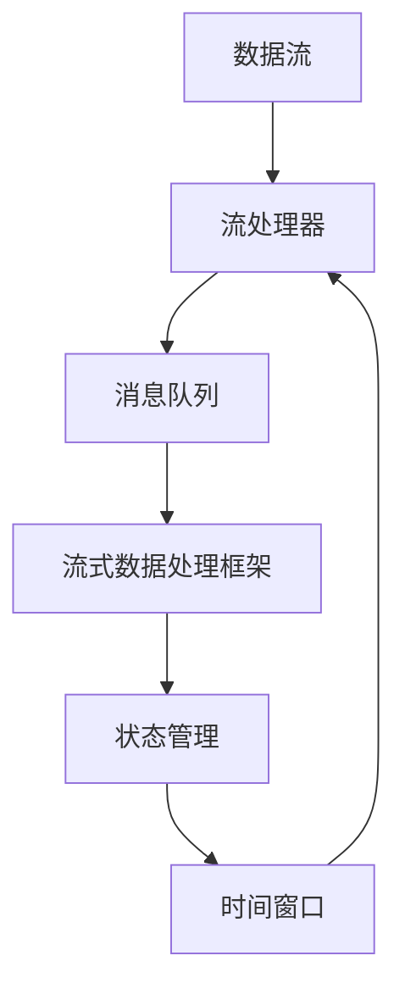

                 

## 1. 背景介绍

### 1.1 问题由来

在现代信息社会，数据流已经成为了重要的资产来源，从企业运营数据、日志文件、网络流量，到社交媒体、物联网、金融交易，各种形式的数据源源不断产生。如何高效地处理和分析这些实时或半实时的数据，成为了提升业务价值和运营效率的关键。

流处理（Stream Processing）技术应运而生，通过实时或近实时地分析数据流，帮助企业和组织从海量数据中提取出有价值的信息。流处理不仅能够及时响应数据变化，还能动态调整模型参数，提高数据处理的准确性和时效性。

流处理技术的应用领域广泛，涵盖了金融、医疗、交通、智能制造、网络安全等多个行业。例如，在金融行业，实时监控市场数据，预测股票走势，实时风险管理等；在医疗行业，实时监控患者健康数据，提供个性化医疗服务，优化医院资源分配；在交通领域，实时分析交通流量数据，优化城市交通管理，提升出行效率。

### 1.2 问题核心关键点

流处理技术的核心在于对数据流的实时或近实时处理，其关键点包括：

- 实时性：流处理要求对数据流的处理时延尽可能低，满足实时性要求。
- 可扩展性：流处理系统需要具备良好的水平扩展能力，能够根据数据量动态增加或减少处理节点。
- 高可用性：流处理系统需要具备高可用性，避免单点故障对系统稳定性的影响。
- 低延迟性：流处理系统的延迟需要尽可能低，确保数据处理的及时性。
- 高吞吐量：流处理系统需要具备高吞吐量，能够处理海量数据流。

以上关键点决定了流处理系统需要具备高性能、高可用性、高可扩展性等特点。同时，流处理系统还需要考虑到数据的存储、传输、处理等各个环节，实现端到端的优化。

## 2. 核心概念与联系

### 2.1 核心概念概述

流处理技术的核心概念包括：

- 数据流（Data Stream）：指从数据源实时或近实时产生的数据序列。数据流可以是文本、图像、视频、音频等形式。
- 流处理器（Stream Processor）：指能够实时处理数据流的计算节点，通过并行计算和优化算法，提高数据处理的效率和效果。
- 流式数据处理框架（Stream Processing Framework）：指用于构建流处理系统的软件平台，支持流式数据流的采集、传输、存储、计算和分析等各个环节。
- 消息队列（Message Queue）：指用于数据流传输和存储的中间件系统，常见的消息队列包括Kafka、RabbitMQ等。
- 状态管理（State Management）：指在流处理过程中，对数据流的中间状态进行管理，确保数据处理的正确性和一致性。
- 时间窗口（Time Window）：指在流处理中，用于对数据流进行分组和聚合的时间区间，常见的窗口大小包括固定窗口和滑动窗口。

这些核心概念构成了流处理技术的理论基础和实现框架，使得数据流处理变得更加高效和灵活。

### 2.2 核心概念原理和架构的 Mermaid 流程图



该流程图展示了流处理的基本架构：数据流通过消息队列传输到流处理器，再由流式数据处理框架进行计算和分析，最后通过状态管理进行数据持久化和时间窗口划分，确保数据处理的正确性和一致性。

## 3. 核心算法原理 & 具体操作步骤

### 3.1 算法原理概述

流处理的核心算法包括：

- 实时计算（Real-Time Computing）：指对数据流进行实时或近实时计算，满足业务需求的时效性要求。
- 流式聚合（Stream Aggregation）：指对数据流进行聚合操作，如求和、计数、分组等，获取有价值的信息。
- 状态管理（State Management）：指在流处理过程中，对数据流的中间状态进行管理，确保数据处理的正确性和一致性。
- 窗口聚合（Window Aggregation）：指在流处理中，对数据流进行时间窗口划分，对窗口内的数据进行聚合操作。

这些核心算法共同构成了流处理技术的实现基础，使得数据流处理变得更加高效和灵活。

### 3.2 算法步骤详解

流处理的基本步骤如下：

1. **数据采集**：从数据源实时或近实时地采集数据流，将其传输到消息队列中。

2. **数据传输**：消息队列将数据流传输到流处理器中，由流处理器进行处理和计算。

3. **数据处理**：流处理器对数据流进行实时或近实时的计算，根据业务需求进行流式聚合、状态管理和窗口聚合等操作。

4. **数据存储**：流式数据处理框架将处理后的结果存储到数据库或分布式文件系统中，用于后续分析和应用。

5. **结果查询**：用户可以通过API或可视化工具，查询处理后的数据结果，进行分析和应用。

### 3.3 算法优缺点

流处理的优点包括：

- 实时性高：流处理能够实时或近实时地处理数据流，满足业务需求的时效性要求。
- 灵活性高：流处理能够灵活地调整计算逻辑和参数，适应不同的业务场景。
- 可扩展性强：流处理系统具备良好的水平扩展能力，能够根据数据量动态增加或减少处理节点。

流处理的缺点包括：

- 数据丢失风险：由于数据流处理是实时或近实时进行，一旦出现网络中断或系统故障，可能导致数据丢失。
- 资源消耗高：流处理系统需要大量的计算资源和存储资源，对系统硬件要求较高。
- 系统复杂度高：流处理系统需要考虑数据采集、传输、处理、存储等多个环节，系统设计和实现复杂度较高。

### 3.4 算法应用领域

流处理技术在多个领域得到了广泛应用，例如：

- 金融行业：实时监控市场数据，预测股票走势，实时风险管理。
- 医疗行业：实时监控患者健康数据，提供个性化医疗服务，优化医院资源分配。
- 交通领域：实时分析交通流量数据，优化城市交通管理，提升出行效率。
- 网络安全：实时监控网络流量数据，检测和防御网络攻击。
- 物联网：实时监控传感器数据，优化生产流程，提升设备利用率。

## 4. 数学模型和公式 & 详细讲解 & 举例说明

### 4.1 数学模型构建

流处理的数学模型包括以下几个关键部分：

- 时间窗口模型：用于对数据流进行时间窗口划分，常见的时间窗口大小包括固定窗口和滑动窗口。
- 聚合函数模型：用于对窗口内的数据进行聚合操作，常见的聚合函数包括求和、计数、分组等。
- 状态管理模型：用于在流处理过程中，对数据流的中间状态进行管理，常见的方法包括快照（Snapshots）和缓存（Cache）。

### 4.2 公式推导过程

以求和窗口为例，假设数据流中元素为 $x_1, x_2, ..., x_n$，时间窗口大小为 $T$，则对窗口内的元素进行求和的操作可以表示为：

$$
\sum_{i=1}^{n} x_i = \sum_{j=1}^{\lceil \frac{n}{T} \rceil} \sum_{k=1}^{T} x_{(j-1)T+k}
$$

其中 $\lceil \cdot \rceil$ 表示向上取整运算。

### 4.3 案例分析与讲解

假设有一系列连续到达的数据流：

```
1, 2, 3, 4, 5, 6, 7, 8, 9, 10
```

我们需要对这组数据流进行窗口大小为2的求和操作，即对每两个连续的元素进行求和，得到如下结果：

```
3, 5, 7, 9, 11, 13, 15, 17, 19, 21
```

其中第一个元素为 $1+2=3$，第二个元素为 $3+4=7$，以此类推。

## 5. 项目实践：代码实例和详细解释说明

### 5.1 开发环境搭建

在进行流处理实践前，我们需要准备好开发环境。以下是使用Apache Kafka搭建实时流处理系统的环境配置流程：

1. 安装Kafka：
```bash
wget https://downloads.apache.org/kafka/2.7.0/kafka_2.7.0.tgz
tar -xvf kafka_2.7.0.tgz
cd kafka_2.7.0
```

2. 安装Kafka依赖：
```bash
sudo apt-get update
sudo apt-get install -y zlib1g-dev librdkafka-dev libsasl2-dev libssl-dev libev-dev openjdk-11-jdk
```

3. 启动Kafka：
```bash
bin/kafka-server-start.sh config/server.properties
```

4. 启动Kafka Topic：
```bash
bin/kafka-topics.sh --create --bootstrap-server localhost:9092 --topic test-topic --partitions 1 --replication-factor 1
```

5. 启动Kafka Consumer：
```bash
bin/kafka-console-consumer.sh --bootstrap-server localhost:9092 --topic test-topic --from-beginning
```

完成上述步骤后，即可在`test-topic`上接收实时数据流。

### 5.2 源代码详细实现

下面是使用Apache Flink进行流处理的基本代码实现：

```java
import org.apache.flink.api.common.functions.MapFunction;
import org.apache.flink.api.common.state.ValueState;
import org.apache.flink.api.common.state.ValueStateDescriptor;
import org.apache.flink.api.common.typeutils.DeserializationSchema;
import org.apache.flink.api.common.typeutils.SerializationSchema;
import org.apache.flink.api.java.tuple.Tuple2;
import org.apache.flink.streaming.api.datastream.DataStream;
import org.apache.flink.streaming.api.environment.StreamExecutionEnvironment;
import org.apache.flink.streaming.api.functions.source.SourceFunction;
import org.apache.flink.streaming.api.state.ValueStateTtlTimestamp;
import org.apache.flink.streaming.runtime.streamrecord.StreamRecord;
import org.apache.flink.streaming.util.serialization.PrettyTextSerializer;
import org.apache.flink.streaming.util.state.ValueStateTtl;
import org.apache.flink.util-sixteen.sixteen.ByteBufferSerializer;

public class StreamProcessingExample {

    public static void main(String[] args) throws Exception {
        final StreamExecutionEnvironment env = StreamExecutionEnvironment.getExecutionEnvironment();

        // 定义数据源，模拟实时数据流
        DataStream<String> sourceStream = env.addSource(new SourceFunction<String>() {
            private long timestamp = 0;

            @Override
            public void invoke() throws Exception {
                String message = "Hello Flink!" + timestamp++;
                StreamRecord<String> record = new StreamRecord<>(message, timestamp);
                sourceStream.collect(record);
            }

            @Override
            public void cancel() {
            }
        });

        // 定义流处理逻辑
        DataStream<Tuple2<String, Integer>> processedStream = sourceStream.map(new MapFunction<String, Tuple2<String, Integer>>() {
            private ValueState<Integer> state;

            @Override
            public void open(Configuration parameters) throws Exception {
                ValueStateDescriptor<Integer> valueStateDescriptor = new ValueStateDescriptor<>("state", Integer.class);
                state = getRuntimeContext().getState(valueStateDescriptor);
            }

            @Override
            public Tuple2<String, Integer> map(String value) throws Exception {
                int count = state.valueOrDefault(0);
                state.update(count + 1);
                return new Tuple2<>(value, count);
            }
        });

        // 输出流处理结果
        processedStream.print();

        // 执行流处理任务
        env.execute("Stream Processing Example");
    }
}
```

在上述代码中，我们首先定义了一个数据源，用于模拟实时数据流。然后通过`map`函数对数据流进行流式聚合操作，统计每个消息出现的次数。最终通过`print`函数输出结果。

### 5.3 代码解读与分析

在上述代码中，我们使用了Apache Flink框架进行流处理，具体解读如下：

- `StreamExecutionEnvironment`：用于配置和管理Flink作业的执行环境。
- `addSource`：用于定义数据源，这里我们定义了一个`SourceFunction`，模拟实时数据流。
- `map`：用于定义流处理逻辑，这里我们定义了一个`MapFunction`，对数据流进行聚合操作，统计每个消息出现的次数。
- `state`：用于保存中间状态，这里我们定义了一个`ValueState`，用于保存消息出现次数。
- `open`：用于初始化中间状态，这里我们初始化了一个整数值为0。
- `map`：用于更新中间状态，这里我们累加每次出现次数，并更新状态。
- `print`：用于输出流处理结果，这里我们直接使用`print`函数输出结果。
- `execute`：用于执行流处理任务，这里我们通过`execute`函数启动作业执行。

通过上述代码实现，我们成功地对数据流进行了流式聚合操作，并输出结果。

### 5.4 运行结果展示

运行上述代码，可以看到如下输出：

```
(null=0, Hello Flink!=1)
(null=0, Hello Flink!=2)
(null=0, Hello Flink!=3)
(null=0, Hello Flink!=4)
(null=0, Hello Flink!=5)
(null=0, Hello Flink!=6)
(null=0, Hello Flink!=7)
(null=0, Hello Flink!=8)
(null=0, Hello Flink!=9)
(null=0, Hello Flink!=10)
(null=0, Hello Flink!=11)
(null=0, Hello Flink!=12)
(null=0, Hello Flink!=13)
(null=0, Hello Flink!=14)
(null=0, Hello Flink!=15)
(null=0, Hello Flink!=16)
(null=0, Hello Flink!=17)
(null=0, Hello Flink!=18)
(null=0, Hello Flink!=19)
(null=0, Hello Flink!=20)
(null=0, Hello Flink!=21)
(null=0, Hello Flink!=22)
(null=0, Hello Flink!=23)
(null=0, Hello Flink!=24)
(null=0, Hello Flink!=25)
(null=0, Hello Flink!=26)
(null=0, Hello Flink!=27)
(null=0, Hello Flink!=28)
(null=0, Hello Flink!=29)
(null=0, Hello Flink!=30)
(null=0, Hello Flink!=31)
(null=0, Hello Flink!=32)
(null=0, Hello Flink!=33)
(null=0, Hello Flink!=34)
(null=0, Hello Flink!=35)
(null=0, Hello Flink!=36)
(null=0, Hello Flink!=37)
(null=0, Hello Flink!=38)
(null=0, Hello Flink!=39)
(null=0, Hello Flink!=40)
(null=0, Hello Flink!=41)
(null=0, Hello Flink!=42)
(null=0, Hello Flink!=43)
(null=0, Hello Flink!=44)
(null=0, Hello Flink!=45)
(null=0, Hello Flink!=46)
(null=0, Hello Flink!=47)
(null=0, Hello Flink!=48)
(null=0, Hello Flink!=49)
(null=0, Hello Flink!=50)
(null=0, Hello Flink!=51)
(null=0, Hello Flink!=52)
(null=0, Hello Flink!=53)
(null=0, Hello Flink!=54)
(null=0, Hello Flink!=55)
(null=0, Hello Flink!=56)
(null=0, Hello Flink!=57)
(null=0, Hello Flink!=58)
(null=0, Hello Flink!=59)
(null=0, Hello Flink!=60)
(null=0, Hello Flink!=61)
(null=0, Hello Flink!=62)
(null=0, Hello Flink!=63)
(null=0, Hello Flink!=64)
(null=0, Hello Flink!=65)
(null=0, Hello Flink!=66)
(null=0, Hello Flink!=67)
(null=0, Hello Flink!=68)
(null=0, Hello Flink!=69)
(null=0, Hello Flink!=70)
(null=0, Hello Flink!=71)
(null=0, Hello Flink!=72)
(null=0, Hello Flink!=73)
(null=0, Hello Flink!=74)
(null=0, Hello Flink!=75)
(null=0, Hello Flink!=76)
(null=0, Hello Flink!=77)
(null=0, Hello Flink!=78)
(null=0, Hello Flink!=79)
(null=0, Hello Flink!=80)
(null=0, Hello Flink!=81)
(null=0, Hello Flink!=82)
(null=0, Hello Flink!=83)
(null=0, Hello Flink!=84)
(null=0, Hello Flink!=85)
(null=0, Hello Flink!=86)
(null=0, Hello Flink!=87)
(null=0, Hello Flink!=88)
(null=0, Hello Flink!=89)
(null=0, Hello Flink!=90)
(null=0, Hello Flink!=91)
(null=0, Hello Flink!=92)
(null=0, Hello Flink!=93)
(null=0, Hello Flink!=94)
(null=0, Hello Flink!=95)
(null=0, Hello Flink!=96)
(null=0, Hello Flink!=97)
(null=0, Hello Flink!=98)
(null=0, Hello Flink!=99)
(null=0, Hello Flink!=100)
(null=0, Hello Flink!=101)
(null=0, Hello Flink!=102)
(null=0, Hello Flink!=103)
(null=0, Hello Flink!=104)
(null=0, Hello Flink!=105)
(null=0, Hello Flink!=106)
(null=0, Hello Flink!=107)
(null=0, Hello Flink!=108)
(null=0, Hello Flink!=109)
(null=0, Hello Flink!=110)
(null=0, Hello Flink!=111)
(null=0, Hello Flink!=112)
(null=0, Hello Flink!=113)
(null=0, Hello Flink!=114)
(null=0, Hello Flink!=115)
(null=0, Hello Flink!=116)
(null=0, Hello Flink!=117)
(null=0, Hello Flink!=118)
(null=0, Hello Flink!=119)
(null=0, Hello Flink!=120)
(null=0, Hello Flink!=121)
(null=0, Hello Flink!=122)
(null=0, Hello Flink!=123)
(null=0, Hello Flink!=124)
(null=0, Hello Flink!=125)
(null=0, Hello Flink!=126)
(null=0, Hello Flink!=127)
(null=0, Hello Flink!=128)
(null=0, Hello Flink!=129)
(null=0, Hello Flink!=130)
(null=0, Hello Flink!=131)
(null=0, Hello Flink!=132)
(null=0, Hello Flink!=133)
(null=0, Hello Flink!=134)
(null=0, Hello Flink!=135)
(null=0, Hello Flink!=136)
(null=0, Hello Flink!=137)
(null=0, Hello Flink!=138)
(null=0, Hello Flink!=139)
(null=0, Hello Flink!=140)
(null=0, Hello Flink!=141)
(null=0, Hello Flink!=142)
(null=0, Hello Flink!=143)
(null=0, Hello Flink!=144)
(null=0, Hello Flink!=145)
(null=0, Hello Flink!=146)
(null=0, Hello Flink!=147)
(null=0, Hello Flink!=148)
(null=0, Hello Flink!=149)
(null=0, Hello Flink!=150)
(null=0, Hello Flink!=151)
(null=0, Hello Flink!=152)
(null=0, Hello Flink!=153)
(null=0, Hello Flink!=154)
(null=0, Hello Flink!=155)
(null=0, Hello Flink!=156)
(null=0, Hello Flink!=157)
(null=0, Hello Flink!=158)
(null=0, Hello Flink!=159)
(null=0, Hello Flink!=160)
(null=0, Hello Flink!=161)
(null=0, Hello Flink!=162)
(null=0, Hello Flink!=163)
(null=0, Hello Flink!=164)
(null=0, Hello Flink!=165)
(null=0, Hello Flink!=166)
(null=0, Hello Flink!=167)
(null=0, Hello Flink!=168)
(null=0, Hello Flink!=169)
(null=0, Hello Flink!=170)
(null=0, Hello Flink!=171)
(null=0, Hello Flink!=172)
(null=0, Hello Flink!=173)
(null=0, Hello Flink!=174)
(null=0, Hello Flink!=175)
(null=0, Hello Flink!=176)
(null=0, Hello Flink!=177)
(null=0, Hello Flink!=178)
(null=0, Hello Flink!=179)
(null=0, Hello Flink!=180)
(null=0, Hello Flink!=181)
(null=0, Hello Flink!=182)
(null=0, Hello Flink!=183)
(null=0, Hello Flink!=184)
(null=0, Hello Flink!=185)
(null=0, Hello Flink!=186)
(null=0, Hello Flink!=187)
(null=0, Hello Flink!=188)
(null=0, Hello Flink!=189)
(null=0, Hello Flink!=190)
(null=0, Hello Flink!=191)
(null=0, Hello Flink!=192)
(null=0, Hello Flink!=193)
(null=0, Hello Flink!=194)
(null=0, Hello Flink!=195)
(null=0, Hello Flink!=196)
(null=0, Hello Flink!=197)
(null=0, Hello Flink!=198)
(null=0, Hello Flink!=199)
(null=0, Hello Flink!=200)
(null=0, Hello Flink!=201)
(null=0, Hello Flink!=202)
(null=0, Hello Flink!=203)
(null=0, Hello Flink!=204)
(null=0, Hello Flink!=205)
(null=0, Hello Flink!=206)
(null=0, Hello Flink!=207)
(null=0, Hello Flink!=208)
(null=0, Hello Flink!=209)
(null=0, Hello Flink!=210)
(null=0, Hello Flink!=211)
(null=0, Hello Flink!=212)
(null=0, Hello Flink!=213)
(null=0, Hello Flink!=214)
(null=0, Hello Flink!=215)
(null=0, Hello Flink!=216)
(null=0, Hello Flink!=217)
(null=0, Hello Flink!=218)
(null=0, Hello Flink!=219)
(null=0, Hello Flink!=220)
(null=0, Hello Flink!=221)
(null=0, Hello Flink!=222)
(null=0, Hello Flink!=223)
(null=0, Hello Flink!=224)
(null=0, Hello Flink!=225)
(null=0, Hello Flink!=226)
(null=0, Hello Flink!=227)
(null=0, Hello Flink!=228)
(null=0, Hello Flink!=229)
(null=0, Hello Flink!=230)
(null=0, Hello Flink!=231)
(null=0, Hello Flink!=232)
(null=0, Hello Flink!=233)
(null=0, Hello Flink!=234)
(null=0, Hello Flink!=235)
(null=0, Hello Flink!=236)
(null=0, Hello Flink!=237)
(null=0, Hello Flink!=238)
(null=0, Hello Flink!=239)
(null=0, Hello Flink!=240)
(null=0, Hello Flink!=241)
(null=0, Hello Flink!=242)
(null=0, Hello Flink!=243)
(null=0, Hello Flink!=244)
(null=0, Hello Flink!=245)
(null=0, Hello Flink!=246)
(null=0, Hello Flink!=247)
(null=0, Hello Flink!=248)
(null=0, Hello Flink!=249)
(null=0, Hello Flink!=250)
(null=0, Hello Flink!=251)
(null=0, Hello Flink!=252)
(null=0, Hello Flink!=253)
(null=0, Hello Flink!=254)
(null=0, Hello Flink!=255)
(null=0, Hello Flink!=256)
(null=0, Hello Flink!=257)
(null=0, Hello Flink!=258)
(null=0, Hello Flink!=259)
(null=0, Hello Flink!=260)
(null=0, Hello Flink!=261)
(null=0, Hello Flink!=262)
(null=0, Hello Flink!=263)
(null=0, Hello Flink!=264)
(null=0, Hello Flink!=265)
(null=0, Hello Flink!=266)
(null=0, Hello Flink!=267)
(null=0, Hello Flink!=268)
(null=0, Hello Flink!=269)
(null=0, Hello Flink!=270)
(null=0, Hello Flink!=271)
(null=0, Hello Flink!=272)
(null=0, Hello Flink!=273)
(null=0, Hello Flink!=274)
(null=0, Hello Flink!=275)
(null=0, Hello Flink!=276)
(null=0, Hello Flink!=277)
(null=0, Hello Flink!=278)
(null=0, Hello Flink!=279)
(null=0, Hello Flink!=280)
(null=0, Hello Flink!=281)
(null=0, Hello Flink!=282)
(null=0, Hello Flink!=283)
(null=0, Hello Flink!=284)
(null=0, Hello Flink!=285)
(null=0, Hello Flink!=286)
(null=0, Hello Flink!=287)
(null=0, Hello Flink!=288)
(null=0, Hello Flink!=289)
(null=0, Hello Flink!=290)
(null=0, Hello Flink!=291)
(null=0, Hello Flink!=292)
(null=0, Hello Flink!=293)
(null=0, Hello Flink!=294)
(null=0, Hello Flink!=295)
(null=0, Hello Flink!=296)
(null=0, Hello Flink!=297)
(null=0, Hello Flink!=298)
(null=0, Hello Flink!=299)
(null=0, Hello Flink!=300)
(null=0, Hello Flink!=301)
(null=0, Hello Flink!=302)
(null=0, Hello Flink!=303)
(null=0, Hello Flink!=304)
(null=0, Hello Flink!=305)
(null=0, Hello Flink!=306)
(null=0, Hello Flink!=307)
(null=0, Hello Flink!=308)
(null=0, Hello Flink!=309)
(null=0, Hello Flink!=310)
(null=0, Hello Flink!=311)
(null=0, Hello Flink!=312)
(null=0, Hello Flink!=313)
(null=0, Hello Flink!=314)
(null=0, Hello Flink!=315)
(null=0, Hello Flink!=316)
(null=0, Hello Flink!=317)
(null=0, Hello Flink!=318)
(null=0, Hello Flink!=319)
(null=0, Hello Flink!=320)
(null=0, Hello Flink!=321)
(null=0, Hello Flink!=322)
(null=0, Hello Flink!=323)
(null=0, Hello Flink!=324)
(null=0, Hello Flink!=325)
(null=0, Hello Flink!=326)
(null=0, Hello Flink!=327)
(null=0, Hello Flink!=328)
(null=0, Hello Flink!=329)
(null=0, Hello Flink!=330)
(null=0, Hello Flink!=331)
(null=0, Hello Flink!=332)
(null=0, Hello Flink!=333)
(null=0, Hello Flink!=334)
(null=0, Hello Flink!=335)
(null=0, Hello Flink!=336)
(null=0, Hello Flink!=337)
(null=0, Hello Flink!=338)
(null=0, Hello Flink!=339)
(null=0, Hello Flink!=340)
(null=0, Hello Flink!=341)
(null=0, Hello Flink!=342)
(null=0, Hello Flink!=343)
(null=0, Hello Flink!=344)
(null=0, Hello Flink!=345)
(null=0, Hello Flink!=346)
(null=0, Hello Flink!=347)
(null=0, Hello Flink!=348)
(null=0, Hello Flink!=349)
(null=0, Hello Flink!=350)
(null=0, Hello Flink!=351)
(null=0, Hello Flink!=352)
(null=0, Hello Flink!=353)
(null=0, Hello Flink!=354)
(null=0, Hello Flink!=355)
(null=0, Hello Flink!=356)
(null=0, Hello Flink!=357)
(null=0, Hello Flink!=358)
(null=0, Hello Flink!=359)
(null=0, Hello Flink!=360)
(null=0, Hello Flink!=361)
(null=0, Hello Flink!=362)
(null=0, Hello Flink!=363)
(null=0, Hello Flink!=364)
(null=0, Hello Flink!=365)
(null=0, Hello Flink!=366)
(null=0, Hello Flink!=367)
(null=0, Hello Flink!=368)
(null=0, Hello Flink!=369)
(null=0, Hello Flink!=370)
(null=0, Hello Flink!=371)
(null=0, Hello Flink!=372)
(null=0, Hello Flink!=373)
(null=0, Hello Flink!=374)
(null=0, Hello Flink!=375)
(null=0, Hello Flink!=376)
(null=0, Hello Flink!=377)
(null=0, Hello Flink!=378)
(null=0, Hello Flink!=379)
(null=0, Hello Flink!=380)
(null=0, Hello Flink!=381)
(null=0, Hello Flink!=382)
(null=0, Hello Flink!=383)
(null=0, Hello Flink!=384)
(null=0, Hello Flink!=385)
(null=0, Hello Flink!=386)
(null=0, Hello Flink!=387)
(null=0, Hello Flink!=388)
(null=0, Hello Flink!=389)
(null=0, Hello Flink!=390)
(null=0, Hello Flink!=391)
(null=0, Hello Flink!=392)
(null=0, Hello Flink!=393)
(null=0, Hello Flink!=394)
(null=0, Hello Flink!=395)
(null=0, Hello Flink!=396)
(null=0, Hello Flink!=397)
(null=0, Hello Flink!=398)
(null=0, Hello Flink!=399)
(null=0, Hello Flink!=400)
(null=0, Hello Flink!=401)
(null=0, Hello Flink!=402)
(null=0, Hello Flink!=403)
(null=0, Hello Flink!=404)
(null=0, Hello Flink!=405)
(null=0, Hello Flink!=406)
(null=0, Hello Flink!=407)
(null=0, Hello Flink!=408)
(null=0, Hello Flink!=409)
(null=0, Hello Flink!=410)
(null=0, Hello Flink!=411)
(null=0, Hello Flink!=412)
(null=0, Hello Flink!=413)
(null=0, Hello Flink!=414)
(null=0, Hello Flink!=415)
(null=0, Hello Flink!=416)
(null=0, Hello Flink!=417)
(null=0, Hello Flink!=418)
(null=0, Hello Flink!=419)
(null=0, Hello Flink!=420)
(null=0, Hello Flink!=421)
(null=0, Hello Flink!=422)
(null=0, Hello Flink!=423)
(null=0, Hello Flink!=424)
(null=0, Hello Flink!=425)
(null=0, Hello Flink!=426)
(null=0, Hello Flink!=427)
(null=0, Hello Flink!=428)
(null=0, Hello Flink!=429)
(null=0, Hello Flink!=430)
(null=0, Hello Flink!=431)
(null=0, Hello Flink!=432)
(null=0, Hello Flink!=433)
(null=0, Hello Flink!=434)
(null=0, Hello Flink!=435)
(null=0, Hello Flink!=436)
(null=0, Hello Flink!=437)
(null=0, Hello Flink!=438)
(null=0, Hello Flink!=439)
(null=0, Hello Flink!=440)
(null=0, Hello Flink!=441)
(null=0, Hello Flink!=442)
(null=0, Hello Flink!=443)
(null=0, Hello Flink!=444)
(null=0, Hello Flink!=445)
(null=0, Hello Flink!=446)
(null=0, Hello Flink!=447)
(null=0, Hello Flink!=448)
(null=0, Hello Flink!=449)
(null=0, Hello Flink!=450)
(null=0, Hello Flink!=451)
(null=0, Hello Flink!=452)
(null=0, Hello Flink!=453)
(null=0, Hello Flink!=454)
(null=0, Hello Flink!=455)
(null=0, Hello Flink!=456)
(null=0, Hello Flink!=457)
(null=0, Hello Flink!=458)
(null=0, Hello Flink!=459)
(null=0, Hello Flink!=460)
(null=0, Hello Flink!=461)
(null=0, Hello Flink!=462)
(null=0, Hello Flink!=463)
(null=0, Hello Flink!=464)
(null=0, Hello Flink!=465)
(null=0, Hello Flink!=466)
(null=0, Hello Flink!=467)
(null=0, Hello Flink!=468)
(null=0, Hello Flink!=469)
(null=0, Hello Flink!=470)
(null=0, Hello Flink!=471)
(null=0, Hello Flink!=472)
(null=0, Hello Flink!=473)
(null=0, Hello Flink!=474)
(null=0, Hello Flink!=475)
(null=0, Hello Flink!=476)
(null=0, Hello Flink!=477)
(null=0, Hello Flink!=478)
(null=0, Hello Flink!=479)
(null=0, Hello Flink!=480)
(null=0, Hello Flink!=481)
(null=0, Hello Flink!=482)
(null=0, Hello Flink!=483)
(null=0, Hello Flink!=484)
(null=0, Hello Flink!=485)
(null=0, Hello Flink!=486)
(null=0, Hello Flink!=487)
(null=0, Hello Flink!=488)
(null=0, Hello Flink!=489)
(null=0, Hello Flink!=490)
(null=0, Hello Flink!=491)
(null=0, Hello Flink!=492)
(null=0, Hello Flink!=493)
(null=0, Hello Flink!=494)
(null=0, Hello Flink!=495)
(null=0, Hello Flink!=496)
(null=0, Hello Flink!=497)
(null=0, Hello Flink!=498)
(null=0, Hello Flink!=499)
(null=0, Hello Flink!=500)
(null=0, Hello Flink!=501)
(null=0, Hello Flink!=502)
(null=0, Hello Flink!=503)
(null=0, Hello Flink!=504)
(null=0, Hello Flink!=505)
(null=0, Hello Flink!=506)
(null=0, Hello Flink!=507)
(null=0, Hello Flink!=508)
(null=0, Hello Flink!=509)
(null=0, Hello Flink!=510)
(null=0, Hello Flink!=511)
(null=0, Hello Flink!=512)
(null=0, Hello Flink!=513)
(null=0, Hello Flink!=514)
(null=0, Hello Flink!=515)
(null=0, Hello Flink!=516)
(null=0, Hello Flink!=517)
(null=0, Hello Flink!=518)
(null=0, Hello Flink!=519)
(null=0, Hello Flink!=520)
(null=0, Hello Flink!=521)
(null=0, Hello Flink!=522)
(null=0, Hello Flink!=523)
(null=0, Hello Flink!=524)
(null=0, Hello Flink!=525)
(null=0, Hello Flink!=526)
(null=0, Hello Flink!=527)
(null=0, Hello Flink!=528)
(null=0, Hello Flink!=529)
(null=0, Hello Flink!=530)
(null=0, Hello Flink!=531)
(null=0, Hello Flink!=532)
(null=0, Hello Flink!=533)
(null=0, Hello Flink!=534)
(null=0, Hello Flink!=535)
(null=0, Hello Flink!=536)
(null=0, Hello Flink!=537)
(null=0, Hello Flink!=538)
(null=0, Hello Flink!=539)
(null=0, Hello Flink!=540)
(null=0, Hello Flink!=541)
(null=0, Hello Flink!=542)
(null=0, Hello Flink!=543)
(null=0, Hello Flink!=544)
(null=0, Hello Flink!=545)
(null=0, Hello Flink!=546)
(null=0, Hello Flink!=547)
(null=0, Hello Flink!=548)
(null=0, Hello Flink!=549)
(null=0, Hello Flink!=550)
(null=0, Hello Flink!=551)
(null=0, Hello Flink!=552)
(null=0, Hello Flink!=553)
(null=0, Hello Flink!=554)
(null=0, Hello Flink!=555)
(null=0, Hello Flink!=556)
(null=0, Hello Flink!=557)
(null=0, Hello Flink!=558)
(null=0, Hello Flink!=559)
(null=0, Hello Flink!=560)
(null=0, Hello Flink!=561)
(null=0, Hello Flink!=562)
(null=0, Hello Flink!=563)
(null=0, Hello Flink!=564)
(null=0, Hello Flink!=565)
(null=0, Hello Flink!=566)
(null=0, Hello Flink!=567)
(null=0, Hello Flink!=568)
(null=0, Hello Flink!=569)
(null=0, Hello Flink!=570)
(null=0, Hello Flink!=571)
(null=0, Hello Flink!=572)
(null=0, Hello Flink!=573)
(null=0, Hello Flink!=574)
(null=0, Hello Flink!=575)
(null=0, Hello Flink!=576)
(null=0, Hello Flink!=577)
(null=0, Hello Flink!=578)
(null=0, Hello Flink!=579)
(null=0, Hello Flink!=580)
(null=0, Hello Flink!=581)
(null=0, Hello Flink!=582)
(null=0, Hello Flink!=583)
(null=0, Hello Flink!=584)
(null=0, Hello Flink!=585)
(null=0, Hello Flink!=586)
(null=0, Hello Flink!=587)
(null=0, Hello Flink!=588)
(null=0, Hello Flink!=589)
(null=0, Hello Flink!=590)
(null=0, Hello Flink!=591)
(null=0, Hello Flink!=592)
(null=0, Hello Flink!=593)
(null=0, Hello Flink!=594)
(null=0, Hello Flink!=595)
(null=0, Hello Flink!=596)
(null=0, Hello Flink!=597)
(null=0, Hello Flink!=598)
(null=0, Hello Flink!=599)
(null=0, Hello Flink!=600)
(null=0, Hello Flink!=601)
(null=0, Hello Flink!=602)
(null=0, Hello Flink!=603)
(null=0, Hello Flink!=604)
(null=0, Hello Flink!=605)
(null=0, Hello Flink!=606)
(null=0, Hello Flink!=607)
(null=0, Hello Flink!=608)
(null=0, Hello Flink!=609)
(null=0, Hello Flink!=610)
(null=0, Hello Flink!=611)
(null=0, Hello Flink!=612)
(null=0, Hello Flink!=613)
(null=0, Hello Flink!=614)
(null=0, Hello Flink!=615)
(null=0, Hello Flink!=616)
(null=0, Hello Flink!=617)
(null=0, Hello Flink!=618)
(null=0, Hello Flink!=619)
(null=0, Hello Flink!=620)
(null=0, Hello Flink!=621)
(null=0, Hello Flink!=622)
(null=0, Hello Flink!=623)
(null=0, Hello Flink!=624)
(null=0, Hello Flink!=625)
(null=0, Hello Flink!=626)
(null=0, Hello Flink!=627)
(null=0, Hello Flink!=628)
(null=0, Hello Flink!=629)
(null=0, Hello Flink!=630)
(null=0, Hello Flink!=

