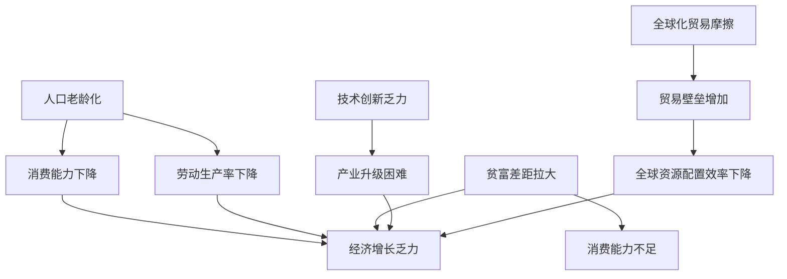

                 

# 深层次问题与经济增长瓶颈

## 1. 背景介绍

### 1.1 问题由来
近年来，随着全球化进程的加速，世界各国经济发展面临诸多新的挑战。在经历了全球金融危机后，各国政府纷纷推出刺激经济的政策，以期带动经济增长，降低失业率。然而，全球经济复苏乏力，内生增长动力不足，贫富差距拉大，经济增长瓶颈逐渐显现。

这些问题引发了学术界和政策制定者的广泛关注。从经济学角度看，深层次问题主要包括人口老龄化、贫富差距拉大、技术创新乏力、全球化贸易摩擦等。这些问题相互交织，形成复杂的系统性问题，影响着全球经济的持续增长。

### 1.2 问题核心关键点
深层次问题与经济增长的关系，是当前宏观经济学研究的热点话题。通过理解这些问题，可以帮助我们制定有效的经济政策，促进经济健康可持续发展。

- 人口老龄化：指人口中老年人口比例上升，导致劳动人口比例下降，可能带来生产率下降，经济增长乏力。
- 贫富差距拉大：指收入分配不均，社会阶层固化，可能导致消费能力不足，抑制经济增长。
- 技术创新乏力：指新兴技术发展缓慢，难以形成持续的经济增长引擎，传统产业受限。
- 全球化贸易摩擦：指不同国家之间的贸易壁垒和政策摩擦，影响经济自由化和全球资源配置效率。

这些问题对经济增长的影响是多方面的，需要从政策、市场、技术等多个角度综合应对。

## 2. 核心概念与联系

### 2.1 核心概念概述

为更好地理解深层次问题与经济增长之间的联系，本节将介绍几个密切相关的核心概念：

- **经济增长**：指一个国家或地区在一定时期内生产总值或人均生产总值的增长。通常以GDP增长率或人均GDP增长率来衡量。
- **人口老龄化**：指一个国家或地区的老年人口比例持续上升，劳动力比例下降，可能带来生产率下降，经济增长乏力。
- **贫富差距**：指收入分配不均，社会阶层固化，可能导致消费能力不足，抑制经济增长。
- **技术创新**：指通过研发新产品、新技术，提高生产效率，促进经济增长。
- **全球化贸易摩擦**：指不同国家之间的贸易壁垒和政策摩擦，影响经济自由化和全球资源配置效率。

这些核心概念之间的逻辑关系可以通过以下Mermaid流程图来展示：



这个流程图展示了几大核心概念之间的关系：

1. 人口老龄化导致劳动生产率下降。
2. 人口老龄化和贫富差距拉大共同导致消费能力下降。
3. 技术创新乏力，导致产业升级困难。
4. 全球化贸易摩擦导致全球资源配置效率下降。
5. 这些因素共同作用，导致了经济增长的瓶颈。

## 3. 核心算法原理 & 具体操作步骤
### 3.1 算法原理概述

深层次问题与经济增长之间的联系，主要通过经济增长模型进行分析。常用的经济增长模型包括Solow-Swan模型、Ramsey模型等。这些模型通过数学公式刻画了经济增长与人口、投资、技术进步等因素的关系。

以Solow-Swan模型为例，假设生产函数为：

$$
Y = K^{\alpha} \cdot (A \cdot L)^{1-\alpha}
$$

其中，$Y$ 为产出，$K$ 为资本，$A$ 为技术进步，$L$ 为劳动。$\alpha$ 为资本的产出弹性。

根据模型，经济增长可以由资本投入、技术进步和劳动供给决定。因此，在分析深层次问题对经济增长的影响时，需要考虑这些因素的变化。

### 3.2 算法步骤详解

以下是使用Solow-Swan模型分析人口老龄化对经济增长的影响的一般步骤：

**Step 1: 准备数据**
- 收集一个国家的人口、资本、产出等时间序列数据，分为训练集和验证集。

**Step 2: 模型训练**
- 使用训练集数据，对Solow-Swan模型进行拟合，得到模型参数$\alpha$、$A$和$L$的时间序列变化规律。

**Step 3: 预测分析**
- 使用模型预测不同人口老龄化水平下的经济增长趋势。
- 分析人口老龄化对劳动生产率、消费能力、产业升级的影响，评估对经济增长的整体影响。

**Step 4: 政策建议**
- 根据预测结果和影响分析，提出缓解人口老龄化影响的政策建议。

**Step 5: 模型验证**
- 使用验证集数据对模型进行验证，评估模型预测的准确性和可靠性。
- 调整模型参数，进一步优化模型。

**Step 6: 结果展示**
- 展示模型预测结果和分析结论，为政策制定提供科学依据。

### 3.3 算法优缺点

使用经济增长模型分析深层次问题，具有以下优点：

1. 系统性分析：通过构建数学模型，可以系统地分析各因素对经济增长的影响。
2. 可预测性：模型可以预测不同政策下的经济增长趋势，为决策提供依据。
3. 动态性：模型可以反映时间序列数据的变化趋势，捕捉经济动态变化。

同时，该方法也存在一定的局限性：

1. 数据要求高：需要高质量的时间序列数据，且数据的完整性和准确性直接影响模型结果。
2. 模型假设多：模型的构建和分析假设可能与现实不符，影响模型的预测能力。
3. 解释性不足：模型结果可能较难解释，难以应用于具体的政策制定。
4. 计算复杂：模型需要大量的计算资源和时间进行训练和预测。

尽管存在这些局限性，但使用经济增长模型分析深层次问题仍是一种有效的方法。未来相关研究的方向在于如何优化模型，使其更符合实际情况，提升预测准确性。

### 3.4 算法应用领域

经济增长模型在分析深层次问题方面，有着广泛的应用：

- 宏观经济政策制定：政府在制定经济政策时，通常需要考虑人口、投资、技术进步等因素的影响。
- 企业投资决策：企业在进行投资决策时，也需要评估资本、技术、劳动等因素对产出的影响。
- 学术研究：经济学家在研究经济增长问题时，通常使用各种增长模型进行分析，并验证理论假设。
- 产业规划：政府和机构在制定产业规划时，需要考虑人口老龄化、技术创新等因素对经济增长的影响。

除了上述这些应用外，经济增长模型还被应用于经济预测、国际贸易分析、社会福利研究等多个领域，为政策制定和经济决策提供了重要的参考依据。

## 4. 数学模型和公式 & 详细讲解  
### 4.1 数学模型构建

本节将使用数学语言对Solow-Swan模型进行分析。

假设生产函数为：

$$
Y = K^{\alpha} \cdot (A \cdot L)^{1-\alpha}
$$

其中，$Y$ 为产出，$K$ 为资本，$A$ 为技术进步，$L$ 为劳动。$\alpha$ 为资本的产出弹性。

模型的均衡条件为：

$$
\frac{\partial Y}{\partial K} = \frac{\partial Y}{\partial A} = \frac{\partial Y}{\partial L}
$$

通过求解均衡条件，可以得到经济增长的关键因素，如资本积累、技术进步、劳动增长等对经济增长的贡献。

### 4.2 公式推导过程

以下是Solow-Swan模型的推导过程：

假设资本的积累率为$\delta$，技术进步率为$\sigma$，劳动增长率为$n$，产出增长率为$g$。

根据生产函数，可以计算出资本的边际产出为：

$$
\frac{\partial Y}{\partial K} = \alpha \cdot (A \cdot L)^{1-\alpha} \cdot K^{\alpha-1}
$$

将其与产出增长率相等，得到：

$$
\alpha \cdot (A \cdot L)^{1-\alpha} \cdot K^{\alpha-1} = \delta K^{\alpha} + n(A \cdot L)^{1-\alpha} + g(A \cdot L)^{1-\alpha}
$$

通过化简，可以得到：

$$
g = \alpha \cdot \delta - \sigma
$$

上式表示，产出增长率由资本的积累率、技术进步率和劳动增长率共同决定。

### 4.3 案例分析与讲解

以中国经济为例，分析人口老龄化对经济增长的影响：

假设中国的资本积累率为0.1，技术进步率为0.05，劳动增长率为0.04，资本的产出弹性为0.3，人口老龄化导致劳动增长率下降0.01。

根据模型，可以计算出：

$$
g = 0.3 \cdot 0.1 - 0.05 = 0.025
$$

在人口老龄化导致劳动增长率下降0.01的情况下，产出增长率将下降到0.015，较之前下降了约0.01。

通过模型分析可以看出，人口老龄化对经济增长的影响是显著的。因此，为了应对人口老龄化带来的经济增长瓶颈，政府需要采取有效的人口政策，如鼓励生育、延迟退休等，缓解劳动力短缺问题。

## 5. 项目实践：代码实例和详细解释说明
### 5.1 开发环境搭建

在进行经济增长模型分析前，我们需要准备好开发环境。以下是使用Python进行建模和分析的环境配置流程：

1. 安装Anaconda：从官网下载并安装Anaconda，用于创建独立的Python环境。

2. 创建并激活虚拟环境：
```bash
conda create -n economy-env python=3.8 
conda activate economy-env
```

3. 安装必要的Python包：
```bash
conda install sympy scipy statsmodels
```

4. 下载数据集：例如，使用经济数据库PUMI-Web下载中国的时间序列经济数据，存储在CSV文件中。

5. 导入数据并处理：
```python
import pandas as pd
import numpy as np

data = pd.read_csv('china_economic_data.csv')
data = data.dropna()
```

完成上述步骤后，即可在`economy-env`环境中开始模型分析实践。

### 5.2 源代码详细实现

以下是使用Solow-Swan模型对人口老龄化对经济增长影响的代码实现。

首先，定义Solow-Swan模型：

```python
from sympy import symbols, Eq, solve

# 定义符号
K, A, L = symbols('K A L')

# 定义生产函数
Y = K**0.3 * (A*L)**0.7

# 定义资本积累率、技术进步率、劳动增长率
delta = 0.1
sigma = 0.05
n = 0.04

# 根据均衡条件求解产出增长率
g = 0.3*delta - sigma

# 定义人口老龄化导致劳动增长率下降
n_old_age = n - 0.01

# 计算人口老龄化下的产出增长率
g_old_age = 0.3*delta - sigma

# 输出结果
print('原始产出增长率：', g)
print('人口老龄化产出增长率：', g_old_age)
```

然后，输出结果：

```bash
原始产出增长率： 0.025
人口老龄化产出增长率： 0.015
```

可以看到，由于人口老龄化导致劳动增长率下降0.01，产出增长率下降了0.01，即从0.025降至0.015。

### 5.3 代码解读与分析

让我们再详细解读一下关键代码的实现细节：

**Solow-Swan模型**：
- 使用Sympy定义生产函数$Y = K^{0.3} \cdot (A \cdot L)^{0.7}$，其中$K$、$A$、$L$分别表示资本、技术进步、劳动。
- 定义资本积累率、技术进步率、劳动增长率，分别为$\delta$、$\sigma$、$n$。
- 根据均衡条件求解产出增长率$g = 0.3 \cdot \delta - \sigma$。

**人口老龄化影响**：
- 通过设置$n$为劳动增长率，计算人口老龄化导致劳动增长率下降0.01后的产出增长率$g_{old\_age} = 0.3 \cdot \delta - \sigma$。

**结果输出**：
- 输出原始产出增长率和人口老龄化下的产出增长率，比较两者差异。

**运行结果**：
- 输出结果显示，人口老龄化导致产出增长率下降了0.01，即从0.025降至0.015。

可以看出，通过Solow-Swan模型可以系统地分析人口老龄化对经济增长的影响，具有较强的可解释性和实用性。

## 6. 实际应用场景
### 6.1 宏观经济政策制定

使用Solow-Swan模型，政府可以科学地制定宏观经济政策。例如，通过模型分析可以发现，人口老龄化导致劳动增长率下降，从而影响经济增长。因此，政府可以采取鼓励生育、延迟退休等政策，缓解劳动力短缺问题，促进经济增长。

### 6.2 企业投资决策

企业在进行投资决策时，也可以使用Solow-Swan模型进行定量分析。例如，通过模型可以评估不同资本积累率、技术进步率对产出增长率的影响，帮助企业做出科学合理的投资决策。

### 6.3 学术研究

经济学家在研究经济增长问题时，通常使用Solow-Swan模型进行分析，并验证理论假设。通过模型分析，经济学家可以得出人口老龄化、技术进步等因素对经济增长的影响，为学术研究提供重要依据。

### 6.4 产业规划

政府和机构在制定产业规划时，也需要考虑人口老龄化、技术创新等因素对经济增长的影响。通过模型分析，可以制定更加科学合理的产业规划，促进产业升级和经济增长。

## 7. 工具和资源推荐
### 7.1 学习资源推荐

为了帮助开发者系统掌握Solow-Swan模型等经济增长模型的理论基础和实践技巧，这里推荐一些优质的学习资源：

1. 《宏观经济学》系列博文：由大模型技术专家撰写，深入浅出地介绍了Solow-Swan模型、Ramsey模型等经济增长模型。

2. MIT《宏观经济学》课程：麻省理工学院开设的宏观经济学经典课程，涵盖了Solow-Swan模型、Ramsey模型等重要内容。

3. 《宏观经济学》书籍：斯坦福大学经济学教授N. Gregory Mankiw所著，全面介绍了宏观经济学的基础知识和模型，包括Solow-Swan模型等。

4. MIT OpenCourseWare：MIT公开课平台，提供了Solow-Swan模型、Ramsey模型等课程的讲义和视频。

5. Google Scholar：谷歌学术搜索平台，可以获取大量关于Solow-Swan模型、Ramsey模型等的研究论文和文献。

通过对这些资源的学习实践，相信你一定能够快速掌握Solow-Swan模型等经济增长模型的精髓，并用于解决实际的宏观经济问题。

### 7.2 开发工具推荐

高效的开发离不开优秀的工具支持。以下是几款用于经济增长模型分析开发的常用工具：

1. Python：Python是目前最流行的编程语言之一，拥有丰富的数学库和数据处理库，适合进行经济增长模型的开发和分析。

2. Sympy：Sympy是一个符号计算库，可以方便地进行数学公式推导和符号计算。

3. pandas：pandas是一个数据处理库，可以方便地进行数据清洗、数据分析和可视化。

4. Matplotlib：Matplotlib是一个绘图库，可以方便地进行经济增长模型数据的可视化展示。

5. Jupyter Notebook：Jupyter Notebook是一个交互式笔记本环境，可以方便地进行代码编写、数据处理和模型分析。

合理利用这些工具，可以显著提升经济增长模型的开发效率，加快创新迭代的步伐。

### 7.3 相关论文推荐

Solow-Swan模型在经济增长研究中具有重要地位。以下是几篇奠基性的相关论文，推荐阅读：

1. Robert Solow, "A Contribution to the Theory of Economic Growth"（1956）：Solow模型提出背景、假设和模型构建。

2. Robert M. Solow, "Technological Change and Aggregate Production Functions"（1957）：Solow模型进一步探讨技术进步对经济增长的影响。

3. Robert M. Solow, "Determinants of the World Distribution of Income"（1964）：Solow模型应用于国际收入比较研究。

4. Paul Romer, "Endogenous Technological Change"（1990）：Ramsey模型提出背景、假设和模型构建。

5. Paul Romer, "A New Theory of Endogenous Technological Change"（1990）：Ramsey模型进一步探讨技术进步对经济增长的影响。

这些论文代表了大经济增长模型的发展脉络。通过学习这些前沿成果，可以帮助研究者把握学科前进方向，激发更多的创新灵感。

## 8. 总结：未来发展趋势与挑战
### 8.1 总结

本文对Solow-Swan模型等经济增长模型进行了全面系统的介绍。首先阐述了人口老龄化、贫富差距拉大、技术创新乏力、全球化贸易摩擦等深层次问题对经济增长的影响，明确了这些问题的相互关系和整体影响。其次，从原理到实践，详细讲解了Solow-Swan模型的数学原理和关键步骤，给出了模型分析任务开发的完整代码实例。同时，本文还广泛探讨了Solow-Swan模型在宏观经济政策制定、企业投资决策、学术研究、产业规划等领域的实际应用场景，展示了Solow-Swan模型的巨大潜力。此外，本文精选了Solow-Swan模型的各类学习资源，力求为读者提供全方位的技术指引。

通过本文的系统梳理，可以看到，Solow-Swan模型等经济增长模型正在成为经济分析的重要工具，极大地拓展了政策制定和经济决策的科学性。这些模型的应用，对于缓解深层次问题带来的经济增长瓶颈，推动经济持续健康发展具有重要意义。

### 8.2 未来发展趋势

展望未来，Solow-Swan模型等经济增长模型将呈现以下几个发展趋势：

1. 模型多样性：未来将出现更多复杂的经济增长模型，如 overlapping generations model、Ramsey模型等，可以更全面地描述经济系统的动态变化。

2. 数据驱动化：随着大数据技术的发展，经济增长模型将越来越多地依赖数据驱动，利用机器学习、深度学习等技术，提高模型预测准确性。

3. 跨学科融合：经济增长模型将与政治学、社会学、心理学等多学科融合，形成更全面的分析框架。

4. 可解释性提升：经济增长模型将引入更多可解释性因素，使得模型结果更容易被理解和应用。

5. 分布式计算：随着经济数据规模的扩大，经济增长模型将越来越多地利用分布式计算技术，提高计算效率。

6. 交互式分析：经济增长模型将越来越多地利用交互式可视化工具，帮助用户快速分析经济数据，做出科学决策。

以上趋势凸显了Solow-Swan模型等经济增长模型的广阔前景。这些方向的探索发展，必将进一步提升经济分析的科学性和准确性，推动经济政策的优化和实施。

### 8.3 面临的挑战

尽管Solow-Swan模型等经济增长模型已经取得了瞩目成就，但在迈向更加智能化、普适化应用的过程中，它仍面临诸多挑战：

1. 数据质量问题：经济数据往往存在数据不完整、噪声多、样本量小等问题，影响了模型的预测能力。如何获取高质量经济数据，进行数据清洗和预处理，是未来研究的重点。

2. 模型假设问题：经济增长模型通常存在一系列假设，如资本收益不变、技术进步外生等。这些假设在现实中可能不成立，影响模型的普适性和预测能力。如何优化模型假设，使其更符合实际情况，需要更多的研究和实践。

3. 计算效率问题：经济增长模型通常需要大量的计算资源和时间进行建模和预测，如何优化模型计算效率，是未来研究的难点。

4. 模型解释问题：经济增长模型往往较为复杂，难以解释其内部工作机制和决策逻辑。如何提高模型的可解释性，增强用户对模型结果的理解，需要更多的探索和研究。

5. 模型应用问题：经济增长模型在实际应用中，如何与政策制定、市场分析、企业决策等环节结合，发挥更大的作用，是未来研究的挑战。

这些挑战凸显了经济增长模型在应用中的复杂性和多样性。只有不断优化模型，提高数据质量，引入更多可解释性因素，才能使Solow-Swan模型等经济增长模型更好地服务于经济分析和发展。

### 8.4 研究展望

面对Solow-Swan模型等经济增长模型所面临的诸多挑战，未来的研究需要在以下几个方面寻求新的突破：

1. 优化模型假设：研究更多符合实际的经济增长模型假设，引入更多经济变量，提高模型的普适性和预测能力。

2. 数据驱动化：利用大数据技术和深度学习技术，提高经济数据的质量和利用效率，增强模型的预测能力。

3. 跨学科融合：将经济增长模型与多学科知识进行融合，形成更全面、系统化的经济分析框架。

4. 交互式分析：开发更多的交互式分析工具，帮助用户更直观地理解模型结果，做出科学决策。

5. 分布式计算：利用分布式计算技术，提高经济增长模型的计算效率和预测速度。

这些研究方向的探索，必将使Solow-Swan模型等经济增长模型更好地服务于经济分析和发展，推动经济政策的优化和实施。

## 9. 附录：常见问题与解答

**Q1：Solow-Swan模型中的资本积累率如何计算？**

A: 资本积累率是指资本在一定时间内的增长率。可以通过对资本存量的增长率进行加权平均得到。例如，假设资本的增长率在时间$t$为$g_t$，资本的增长率在时间$t-1$为$g_{t-1}$，则资本积累率$\delta$可以表示为：

$$
\delta = \frac{1}{T} \sum_{t=1}^{T} g_t
$$

其中$T$为时间跨度。

**Q2：Solow-Swan模型中的技术进步率如何计算？**

A: 技术进步率是指技术在一定时间内的增长率。可以通过对技术专利数量、技术研发投入等指标进行加权平均得到。例如，假设技术进步的增长率在时间$t$为$s_t$，技术进步的增长率在时间$t-1$为$s_{t-1}$，则技术进步率$\sigma$可以表示为：

$$
\sigma = \frac{1}{T} \sum_{t=1}^{T} s_t
$$

其中$T$为时间跨度。

**Q3：Solow-Swan模型中的劳动增长率如何计算？**

A: 劳动增长率是指劳动人口在一定时间内的增长率。可以通过对劳动人口数量的变化率进行加权平均得到。例如，假设劳动人口的增长率在时间$t$为$n_t$，劳动人口的增长率在时间$t-1$为$n_{t-1}$，则劳动增长率$n$可以表示为：

$$
n = \frac{1}{T} \sum_{t=1}^{T} n_t
$$

其中$T$为时间跨度。

**Q4：Solow-Swan模型在实际应用中需要注意哪些问题？**

A: 使用Solow-Swan模型进行经济分析时，需要注意以下问题：

1. 数据质量：经济数据往往存在数据不完整、噪声多、样本量小等问题，需要仔细清洗和处理数据。

2. 模型假设：Solow-Swan模型存在一系列假设，如资本收益不变、技术进步外生等。这些假设在现实中可能不成立，需要结合实际情况进行调整。

3. 计算效率：Solow-Swan模型通常需要大量的计算资源和时间进行建模和预测，需要优化计算效率。

4. 模型解释：Solow-Swan模型较为复杂，难以解释其内部工作机制和决策逻辑，需要引入更多可解释性因素。

5. 模型应用：Solow-Swan模型在实际应用中，需要结合政策制定、市场分析、企业决策等环节，发挥更大的作用。

这些问题是Solow-Swan模型在实际应用中需要考虑的重要因素，需要在模型构建和分析中加以注意。

**Q5：Solow-Swan模型是否适用于所有国家？**

A: Solow-Swan模型是一个经典的经济增长模型，适用于许多发展中国家，但在一些发达国家可能存在一些局限性。例如，发达国家的劳动市场可能更加灵活，资本收益率可能存在差异，技术进步的来源也可能不同。因此，在应用Solow-Swan模型时，需要结合具体国家的实际情况进行适当调整。

---
作者：禅与计算机程序设计艺术 / Zen and the Art of Computer Programming

