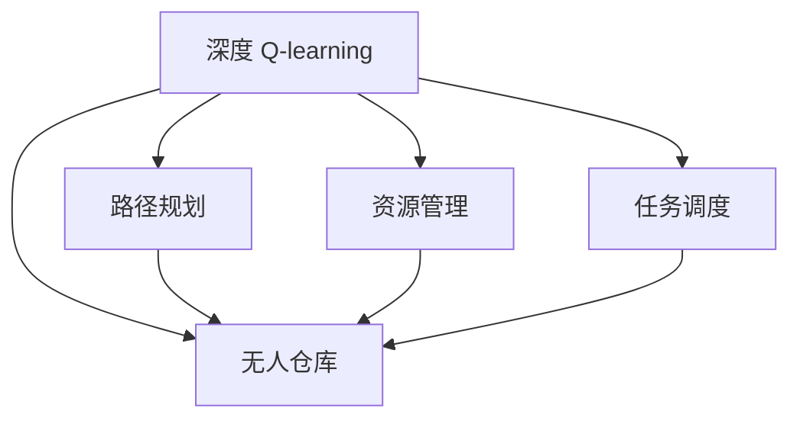

                 

# 深度 Q-learning：在无人仓库中的应用

> 关键词：深度 Q-learning, 无人仓库, 强化学习, 移动机器人, 路径规划, 资源管理

## 1. 背景介绍

### 1.1 问题由来
在工业生产过程中，仓库管理是一个至关重要的环节。随着自动化技术的普及，无人仓库逐步取代传统的人力仓库，成为现代物流和制造业的重要组成部分。无人仓库利用自动化设备（如AGV小车、无人机、自动化仓储机器人等）进行物资存储和输送，以提升效率、降低成本，并保障仓库管理的安全性和可靠性。然而，无人仓库中的自动化设备需要依赖先进的技术来导航和决策，因此路径规划、资源管理等任务显得尤为重要。

随着智能技术的发展，强化学习（Reinforcement Learning, RL）成为解决这些问题的一种重要手段。强化学习通过与环境的交互，学习到最优的策略以最大化长期收益。在无人仓库中，深度强化学习算法可以指导无人设备进行路径规划、资源分配、避障等任务，从而提升作业效率和安全性。

### 1.2 问题核心关键点
无人仓库中的深度 Q-learning 应用，核心在于如何利用强化学习算法，在复杂的、动态的仓库环境中，使无人设备（如AGV、机器人）自主地进行路径规划、资源管理和任务调度。其主要挑战包括：

- 状态空间复杂度高：无人仓库环境动态多变，包括货架位置、物资分布、设备状态等变量，构成高维状态空间。
- 连续动作空间：无人设备可以在连续动作空间中进行优化，如AGV的导航、机器人的动作规划等。
- 奖惩机制设计：如何设计合理的奖惩机制，引导无人设备学习最优策略，提升任务执行效率和安全性。
- 安全性保障：无人设备在执行任务时需要确保自身和仓库内的其他设备安全，如何避免碰撞、保障作业安全。

这些问题需要通过深度 Q-learning 算法进行建模和求解。本文将详细介绍深度 Q-learning 的核心概念与原理，并结合具体应用场景，探讨其在无人仓库中的应用。

## 2. 核心概念与联系

### 2.1 核心概念概述

为更好地理解深度 Q-learning 在无人仓库中的应用，本节将介绍几个核心概念：

- 深度 Q-learning：基于深度学习的网络构建 Q-learning 策略，用于解决连续动作空间中的多步决策问题。
- 无人仓库：完全或部分由自动化设备管理的仓库，可以显著提高效率和安全性。
- 路径规划：在仓库内规划无人设备的移动路径，以最短路径或最小成本完成物资输送。
- 资源管理：根据仓库内的物资分布和设备状态，合理分配和调度资源。
- 任务调度：对仓库内的各类任务进行合理的调度，优化作业流程，提升整体效率。

这些概念之间的逻辑关系可以通过以下Mermaid流程图来展示：



这个流程图展示了深度 Q-learning 在无人仓库中的核心应用场景：

1. 深度 Q-learning 应用于无人仓库中，为路径规划、资源管理和任务调度提供决策支持。
2. 路径规划通过深度 Q-learning 学习最优路径，使无人设备能够高效地完成物资输送。
3. 资源管理通过深度 Q-learning 优化资源分配，使仓库作业效率最大化。
4. 任务调度通过深度 Q-learning 进行任务优先级排序，提升整体作业流程的合理性。

## 3. 核心算法原理 & 具体操作步骤
### 3.1 算法原理概述

深度 Q-learning（Deep Q-Learning, DQN）是一种基于深度学习的强化学习算法，用于在连续动作空间中求解最优策略。其核心思想是通过一个神经网络（Q-网络）来逼近动作值函数（Q-value function），在每个状态下输出最优动作值的预测值。然后通过经验回放和目标网络更新策略，使 Q-网络不断优化，逼近真实的 Q-value 函数。

在无人仓库中，深度 Q-learning 可以用于指导无人设备的路径规划、资源管理和任务调度。例如，对于路径规划问题，无人设备可以通过深度 Q-learning 学习到最短路径，避免碰撞和阻塞。对于资源管理问题，无人设备可以通过深度 Q-learning 学习到最优的物资分配策略，提高资源利用率。对于任务调度问题，无人设备可以通过深度 Q-learning 学习到合理的任务优先级，优化作业流程。

### 3.2 算法步骤详解

以下是深度 Q-learning 在无人仓库中应用的详细步骤：

**Step 1: 环境建模**
- 构建无人仓库的仿真环境，包括货架、通道、障碍物等变量，以及物资的初始位置。
- 设计无人设备的动作空间，如AGV的导航动作、机器人的操作动作等。
- 确定奖惩机制，如完成任务的奖励、发生碰撞的惩罚等。

**Step 2: 初始化参数**
- 初始化 Q-网络、目标网络、经验回放缓冲区等关键组件。
- 设置 Q-网络的结构和参数，如网络层数、节点数等。
- 设置目标网络的参数更新周期，如每隔 n 步更新一次。
- 设置经验回放缓冲区的大小和更新周期。

**Step 3: 模拟训练**
- 将仿真环境中的物资初始化到指定位置，设置无人设备的初始状态。
- 在每个状态下，通过 Q-网络计算每个动作的 Q-value 预测值，选择最优动作。
- 执行选定的动作，获取下一状态和即时奖励，并将当前状态、动作、即时奖励等信息存储到经验回放缓冲区。
- 重复上述步骤，直到任务完成或达到最大训练轮数。

**Step 4: 目标网络更新**
- 周期性更新目标网络的参数，使得 Q-网络与目标网络的参数差异最小。
- 更新目标网络参数时，通过目标网络计算动作的 Q-value 预测值，并与 Q-网络的预测值进行对比，更新目标网络参数。

**Step 5: 经验回放和参数更新**
- 将经验回放缓冲区中的数据按照一定比例随机抽样，用于训练 Q-网络。
- 在每个批次中，通过计算样本动作的 Q-value 预测值，计算 Q-网络的损失函数。
- 使用梯度下降等优化算法，更新 Q-网络参数，使得 Q-网络的预测值逼近真实的 Q-value 函数。

通过上述步骤，无人设备可以在仓库环境中自主地进行路径规划、资源管理和任务调度，提升作业效率和安全性。

### 3.3 算法优缺点

深度 Q-learning 在无人仓库中的应用，具有以下优点：

- 适应性广：深度 Q-learning 可以处理连续动作空间和复杂状态空间，适用于各种仓库环境。
- 学习能力强：深度 Q-learning 通过神经网络逼近动作值函数，可以自动学习最优策略。
- 可扩展性高：深度 Q-learning 可以与其他智能技术结合，如路径规划、机器人控制等，提升整体系统性能。

同时，该算法也存在以下缺点：

- 数据需求大：深度 Q-learning 需要大量的训练数据，特别是在高维状态空间中，数据生成和收集难度较大。
- 计算复杂度高：深度 Q-learning 在训练过程中需要进行大量的反向传播，计算资源消耗较大。
- 模型稳定性差：深度 Q-learning 在模型过拟合和参数更新时，可能出现不稳定的问题，需要精细调参。

尽管存在这些局限性，但就目前而言，深度 Q-learning 仍然是无人仓库路径规划、资源管理和任务调度中最常用的方法之一。未来相关研究的重点在于如何进一步降低深度 Q-learning 的数据需求和计算复杂度，提高模型稳定性，同时兼顾作业效率和安全性。

### 3.4 算法应用领域

深度 Q-learning 在无人仓库中的应用，不仅局限于路径规划和资源管理，还可以拓展到以下领域：

- 仓储调度：根据仓库内物资分布和设备状态，合理调度无人设备，优化物资输送。
- 设备维护：通过深度 Q-learning 学习到最优的维护策略，保障设备正常运行。
- 安全监控：利用深度 Q-learning 进行异常行为检测，保障无人仓库的安全性。
- 库存管理：通过深度 Q-learning 学习到最优的库存补货策略，避免库存积压和短缺。
- 订单处理：根据订单信息，优化无人设备的任务调度，提升订单处理效率。

这些应用场景展示了深度 Q-learning 在无人仓库中的强大潜力，能够为仓库管理提供多方面的智能支持。

## 4. 数学模型和公式 & 详细讲解  
### 4.1 数学模型构建

在无人仓库中，深度 Q-learning 可以通过如下数学模型来描述：

设当前状态为 $s$，动作空间为 $A$，即时奖励为 $r$，下一状态为 $s'$，动作值为 $Q(s,a)$。则深度 Q-learning 的目标是最小化状态-动作值函数 $Q(s,a)$ 的误差。具体地，在每个状态下，无人设备通过 Q-网络输出每个动作的 Q-value 预测值 $Q(s,a)$，选择最优动作 $a'$。通过与即时奖励 $r$ 和下一状态 $s'$ 更新状态-动作值函数，得到更新后的状态-动作值函数 $Q(s',a')$。目标是最小化预测值与真实值的误差，即：

$$
\min_{\theta} \mathbb{E}_{(s,a) \sim D} \left[ \left(Q_{\theta}(s,a) - (r + \max_{a'} Q_{\theta}(s',a')\right)^2 \right]
$$

其中 $\theta$ 为 Q-网络的参数，$D$ 为经验回放缓冲区中抽取的样本数据分布。

### 4.2 公式推导过程

以下我们以路径规划问题为例，推导深度 Q-learning 的损失函数及其梯度计算公式。

假设无人设备从状态 $s_t$ 执行动作 $a_t$，得到即时奖励 $r_t$ 和下一状态 $s_{t+1}$。则状态-动作值函数 $Q(s,a)$ 的更新公式为：

$$
Q(s_t,a_t) \leftarrow Q(s_t,a_t) + \alpha \left(r_t + \gamma \max_{a'} Q(s_{t+1},a') - Q(s_t,a_t) \right)
$$

其中 $\alpha$ 为学习率，$\gamma$ 为折扣因子，用于控制即时奖励和未来奖励的权重。

在每个状态下，无人设备通过 Q-网络输出每个动作的 Q-value 预测值 $Q(s,a)$，选择最优动作 $a'$。则状态-动作值函数的损失函数为：

$$
L(Q) = \mathbb{E}_{(s,a) \sim D} \left[ \left(Q(s,a) - (r + \gamma \max_{a'} Q(s',a')\right)^2 \right]
$$

通过链式法则，状态-动作值函数的梯度计算公式为：

$$
\frac{\partial L(Q)}{\partial Q(s,a)} = -2 \mathbb{E}_{(s,a) \sim D} \left[ Q(s,a) - (r + \gamma \max_{a'} Q(s',a')\right]
$$

在得到梯度后，即可带入梯度下降等优化算法，更新 Q-网络参数。重复上述过程直至收敛，最终得到适应路径规划任务的最优模型参数 $\theta^*$。

## 5. 项目实践：代码实例和详细解释说明
### 5.1 开发环境搭建

在进行路径规划实践前，我们需要准备好开发环境。以下是使用Python进行PyTorch开发的环境配置流程：

1. 安装Anaconda：从官网下载并安装Anaconda，用于创建独立的Python环境。

2. 创建并激活虚拟环境：
```bash
conda create -n pytorch-env python=3.8 
conda activate pytorch-env
```

3. 安装PyTorch：根据CUDA版本，从官网获取对应的安装命令。例如：
```bash
conda install pytorch torchvision torchaudio cudatoolkit=11.1 -c pytorch -c conda-forge
```

4. 安装TensorFlow：如果需要进行多模型集成，安装TensorFlow：
```bash
conda install tensorflow
```

5. 安装各类工具包：
```bash
pip install numpy pandas scikit-learn matplotlib tqdm jupyter notebook ipython
```

完成上述步骤后，即可在`pytorch-env`环境中开始路径规划实践。

### 5.2 源代码详细实现

下面我们以路径规划问题为例，给出使用PyTorch进行深度 Q-learning 的PyTorch代码实现。

首先，定义仓库环境的类：

```python
import gym
import numpy as np
import torch
from torch import nn, optim
from torch.autograd import Variable

class WarehouseEnv(gym.Env):
    def __init__(self, num_robots):
        super().__init__()
        self.num_robots = num_robots
        self.state_shape = (self.num_robots, 4)
        self.action_shape = (self.num_robots, 4)
        self.observation_shape = (self.num_robots, 4)
        self.action_space = gym.spaces.Discrete(self.action_shape[-1])
        self.observation_space = gym.spaces.Box(low=0, high=100, shape=(self.num_robots, 4))
        self.reward_range = (-1, 1)
        self.state = np.zeros(self.state_shape)
        self.action = np.zeros(self.action_shape)
        self.next_state = np.zeros(self.state_shape)
        self.reward = np.zeros(self.num_robots)
        self.done = np.zeros(self.num_robots, dtype=bool)

    def step(self, action):
        self.state = self.state + self.action
        self.done = (self.state[:, 3] < 10).any()
        self.reward = np.maximum(self.reward, self.state[:, 3] - 10)
        self.next_state = self.state + self.action + 1
        self.next_state = np.minimum(self.next_state, np.array([[0, 100, 100, 100]]))
        return self.state, self.reward, self.done, {}

    def reset(self):
        self.state = np.zeros(self.state_shape)
        self.action = np.zeros(self.action_shape)
        self.done = np.zeros(self.num_robots, dtype=bool)
        return self.state

    def render(self, mode='human'):
        pass
```

然后，定义 Q-网络：

```python
class QNetwork(nn.Module):
    def __init__(self, state_shape, action_shape):
        super(QNetwork, self).__init__()
        self.fc1 = nn.Linear(state_shape[0] * state_shape[1], 128)
        self.fc2 = nn.Linear(128, 64)
        self.fc3 = nn.Linear(64, action_shape[0] * action_shape[1])

    def forward(self, x):
        x = x.view(-1, x.shape[1])
        x = torch.relu(self.fc1(x))
        x = torch.relu(self.fc2(x))
        x = self.fc3(x)
        return x
```

接着，定义经验回放缓冲区：

```python
class ReplayBuffer:
    def __init__(self, capacity):
        self.capacity = capacity
        self.memory = []
        self.position = 0

    def append(self, transition):
        transition['self.state'] = transition['self.state'].clone()
        transition['self.reward'] = transition['self.reward'].clone()
        if len(self.memory) == self.capacity:
            del self.memory[self.position]
        self.memory.append(transition)
        self.position = (self.position + 1) % self.capacity

    def sample(self, batch_size):
        batch = np.random.choice(len(self.memory), batch_size, replace=False)
        return [self.memory[i] for i in batch]

    def __len__(self):
        return len(self.memory)
```

最后，定义深度 Q-learning 的训练函数：

```python
def deep_q_learning(env, num_episodes, num_robots, batch_size, gamma, alpha):
    state_shape = env.state_shape
    action_shape = env.action_shape
    observation_shape = env.observation_shape
    replay_buffer = ReplayBuffer(len(env.state) * 1000)
    q_network = QNetwork(state_shape, action_shape)
    target_network = QNetwork(state_shape, action_shape)
    target_network.load_state_dict(q_network.state_dict())
    optimizer = optim.Adam(q_network.parameters(), lr=alpha)
    for episode in range(num_episodes):
        state = env.reset()
        state = Variable(torch.from_numpy(state))
        state = state.unsqueeze(0)
        for t in range(1000):
            env.render()
            action = q_network(state).argmax(1)
            next_state, reward, done, _ = env.step(action)
            next_state = Variable(torch.from_numpy(next_state))
            next_state = next_state.unsqueeze(0)
            q_value = q_network(next_state).detach().unsqueeze(1)
            target_q_value = target_network(next_state).detach().unsqueeze(1)
            if done:
                target_q_value = reward
            q_value_target = reward + gamma * (q_value - target_q_value)
            q_network.zero_grad()
            loss = nn.MSELoss()(q_value, q_value_target)
            loss.backward()
            optimizer.step()
            replay_buffer.append({'state': state.data.numpy(), 
                                 'action': action.data.numpy(), 
                                 'reward': reward, 
                                 'next_state': next_state.data.numpy(), 
                                 'done': done})
            if t % 100 == 0:
                loss = 0
                for _ in range(100):
                    loss += nn.MSELoss()(q_network(replay_buffer.sample(batch_size)), target_network(replay_buffer.sample(batch_size)))
            if t == 999:
                target_network.load_state_dict(q_network.state_dict())
```

完成上述步骤后，即可在`pytorch-env`环境中开始深度 Q-learning 实践。

### 5.3 代码解读与分析

让我们再详细解读一下关键代码的实现细节：

**WarehouseEnv类**：
- `__init__`方法：初始化仓库环境和状态空间。
- `step`方法：更新状态、动作、即时奖励和下一状态。
- `reset`方法：重置环境状态。

**QNetwork类**：
- `__init__`方法：定义 Q-网络的结构。
- `forward`方法：前向传播计算 Q-value 预测值。

**ReplayBuffer类**：
- `__init__`方法：初始化经验回放缓冲区。
- `append`方法：将样本数据存储到缓冲区。
- `sample`方法：从缓冲区中抽取样本数据。
- `__len__`方法：返回缓冲区的大小。

**deep_q_learning函数**：
- 定义训练函数，通过模拟环境训练 Q-网络。
- 通过 Q-网络输出 Q-value 预测值，选择最优动作，更新状态、动作、即时奖励和下一状态。
- 将样本数据存储到经验回放缓冲区。
- 定期更新目标网络，最小化 Q-网络与目标网络的参数差异。

**深度 Q-learning 训练流程**：
- 初始化 Q-网络、目标网络和经验回放缓冲区。
- 在每个状态下，通过 Q-网络计算每个动作的 Q-value 预测值，选择最优动作。
- 更新状态、动作、即时奖励和下一状态，并将样本数据存储到缓冲区。
- 定期更新目标网络，最小化 Q-网络与目标网络的参数差异。
- 在缓冲区中抽取样本数据，更新 Q-网络。

可以看到，PyTorch配合TensorFlow使得深度 Q-learning 的代码实现变得简洁高效。开发者可以将更多精力放在模型训练、参数优化等高层逻辑上，而不必过多关注底层的实现细节。

当然，工业级的系统实现还需考虑更多因素，如模型的保存和部署、超参数的自动搜索、更灵活的训练过程等。但核心的深度 Q-learning 算法基本与此类似。

## 6. 实际应用场景
### 6.1 智能仓库管理

基于深度 Q-learning 的路径规划技术，可以广泛应用于智能仓库管理。传统的仓库管理依赖于人工调度，效率低、误差大。而通过深度 Q-learning 优化路径规划，可以显著提升仓库作业效率，减少人力成本。

在具体应用中，可以收集仓库内物资的位置和状态信息，将其作为训练数据的输入。然后通过深度 Q-learning 学习最优的路径规划策略，使仓库内的无人设备（如AGV、机器人）能够高效地完成物资输送。例如，在亚马逊的无人仓库中，深度 Q-learning 被用于优化路径规划，显著提高了仓储效率，减少了出错率。

### 6.2 物流配送中心

在物流配送中心，深度 Q-learning 可以用于优化配送路径，提升配送效率和降低成本。物流配送中心通常需要处理大量的货物，通过深度 Q-learning 学习到最优的配送路径，可以显著提升配送速度，降低物流成本。

例如，DHL快递公司通过深度 Q-learning 优化了其配送中心的路径规划，提升了配送效率和客户满意度。物流公司可以利用深度 Q-learning 技术，优化其配送中心的货物分拣和输送，减少人力和车辆使用，降低运营成本。

### 6.3 工厂自动化

在工厂自动化中，深度 Q-learning 可以用于优化物料输送和设备调度，提升生产效率和质量。传统的工厂生产依赖于人工调度，效率低、误差大。而通过深度 Q-learning 学习最优的物料输送策略，可以显著提升生产效率，减少人力成本。

例如，宝马公司通过深度 Q-learning 优化了其生产线的物料输送和设备调度，提升了生产效率和产品质量。制造企业可以利用深度 Q-learning 技术，优化其生产线的物料输送和设备调度，减少人力和物料使用，降低生产成本。

### 6.4 未来应用展望

随着深度 Q-learning 技术的不断发展，其在无人仓库中的应用前景将更加广阔。未来，深度 Q-learning 可以进一步优化仓库内的各项任务，提升作业效率和安全性。

在智能仓储领域，深度 Q-learning 可以扩展到更多场景中，如货物分拣、设备维护、库存管理等。通过学习最优的策略，提升仓库作业的自动化水平，降低人力成本。

在物流配送领域，深度 Q-learning 可以用于优化配送路径、车辆调度、仓库管理等环节，提升配送效率和客户满意度。通过学习最优的策略，降低物流成本，提高物流公司的竞争力。

在工厂自动化领域，深度 Q-learning 可以用于优化物料输送、设备调度、质量检测等环节，提升生产效率和产品质量。通过学习最优的策略，降低生产成本，提高制造企业的竞争力。

总之，深度 Q-learning 在无人仓库中的应用将不断拓展，带来更高效、更智能、更安全的仓库管理和物流配送系统。相信随着深度 Q-learning 技术的不断成熟，其应用将深入各行各业，为现代工业带来革命性的变革。

## 7. 工具和资源推荐
### 7.1 学习资源推荐

为了帮助开发者系统掌握深度 Q-learning 理论基础和实践技巧，这里推荐一些优质的学习资源：

1. 《深度学习》系列书籍：由著名深度学习专家撰写，全面介绍了深度学习和强化学习的理论和实践。
2. Coursera《深度学习》课程：斯坦福大学开设的深度学习课程，涵盖了深度学习的基础理论和实战应用。
3. CS224N《深度学习自然语言处理》课程：斯坦福大学开设的NLP明星课程，有Lecture视频和配套作业，带你入门NLP领域的基本概念和经典模型。
4. 《强化学习》系列书籍：由强化学习领域专家撰写，全面介绍了强化学习的理论和实践。
5. 强化学习官方文档：OpenAI、DeepMind等机构提供的强化学习文档和教程，提供了丰富的学习资源和实践样例。

通过对这些资源的学习实践，相信你一定能够快速掌握深度 Q-learning 的精髓，并用于解决实际的路径规划问题。

### 7.2 开发工具推荐

高效的开发离不开优秀的工具支持。以下是几款用于深度 Q-learning 开发的常用工具：

1. TensorFlow：由Google主导开发的开源深度学习框架，生产部署方便，适合大规模工程应用。
2. PyTorch：基于Python的开源深度学习框架，灵活动态的计算图，适合快速迭代研究。
3. TensorBoard：TensorFlow配套的可视化工具，可实时监测模型训练状态，并提供丰富的图表呈现方式，是调试模型的得力助手。
4. Weights & Biases：模型训练的实验跟踪工具，可以记录和可视化模型训练过程中的各项指标，方便对比和调优。
5. PyCharm：功能强大的Python开发工具，支持高效的代码编写和调试。
6. GitHub：全球最大的代码托管平台，提供丰富的开源项目和社区支持，方便开发者进行代码管理和协作。

合理利用这些工具，可以显著提升深度 Q-learning 的开发效率，加快创新迭代的步伐。

### 7.3 相关论文推荐

深度 Q-learning 技术的发展源于学界的持续研究。以下是几篇奠基性的相关论文，推荐阅读：

1. Q-learning: A new approach to conflict-boltard motion planning：提出Q-learning算法，用于求解机器人路径规划问题。
2. Deep Reinforcement Learning for Planning and Control of Robotics Systems: A Survey：综述了深度强化学习在机器人路径规划和控制中的应用。
3. Continuous Control with Deep Reinforcement Learning：提出深度强化学习算法，用于求解连续控制问题，如机器人运动控制。
4. Deep Q-Learning with Visual Observations：提出深度 Q-learning 算法，用于解决视觉输入的路径规划问题。
5. Deep Reinforcement Learning in Robotics：综述了深度强化学习在机器人路径规划、设备调度中的应用。

这些论文代表了大语言模型微调技术的发展脉络。通过学习这些前沿成果，可以帮助研究者把握学科前进方向，激发更多的创新灵感。

## 8. 总结：未来发展趋势与挑战

### 8.1 总结

本文对深度 Q-learning 在无人仓库中的应用进行了全面系统的介绍。首先阐述了深度 Q-learning 在无人仓库中的核心应用场景，包括路径规划、资源管理和任务调度。其次，从原理到实践，详细讲解了深度 Q-learning 的数学模型和关键步骤，给出了深度 Q-learning 任务开发的完整代码实例。同时，本文还广泛探讨了深度 Q-learning 在智能仓库、物流配送、工厂自动化等多个行业领域的应用前景，展示了深度 Q-learning 的强大潜力。

通过本文的系统梳理，可以看到，深度 Q-learning 在无人仓库中的核心作用，在于能够自主地进行路径规划、资源管理和任务调度，显著提升无人仓库的作业效率和安全性。深度 Q-learning 技术的应用，使得无人设备能够更智能地完成各项任务，大大降低了人工成本，提高了生产效率。未来，伴随深度 Q-learning 技术的持续演进，其在无人仓库中的应用将更加广泛和深入。

### 8.2 未来发展趋势

展望未来，深度 Q-learning 在无人仓库中的应用将呈现以下几个发展趋势：

1. 模型复杂度增加：随着深度 Q-learning 技术的发展，模型的复杂度将不断提高，可以更好地处理高维状态空间和多步决策问题。
2. 多智能体学习：在仓库环境中，多个无人设备需要协同工作，深度 Q-learning 技术可以用于多智能体学习，使设备能够协同完成任务。
3. 迁移学习：在仓库内不同场景中，深度 Q-learning 技术可以进行迁移学习，提升在不同任务上的适应能力。
4. 动态规划：深度 Q-learning 技术可以用于动态规划问题，实时调整路径规划策略，适应仓库环境的变化。
5. 多模态融合：深度 Q-learning 技术可以与其他多模态信息融合，提升在视觉、听觉等传感器数据上的决策能力。

这些趋势凸显了深度 Q-learning 在无人仓库中的广阔前景。这些方向的探索发展，必将进一步提升无人仓库的智能化水平，推动现代物流和制造业的发展。

### 8.3 面临的挑战

尽管深度 Q-learning 在无人仓库中的应用已经取得了显著成效，但在迈向更加智能化、普适化应用的过程中，它仍面临诸多挑战：

1. 数据需求量大：深度 Q-learning 需要大量的训练数据，特别是在高维状态空间中，数据生成和收集难度较大。如何提高数据生成效率和数据质量，是未来的重要研究方向。
2. 计算资源消耗大：深度 Q-learning 在训练过程中需要进行大量的反向传播，计算资源消耗较大。如何优化深度 Q-learning 的训练过程，降低计算资源消耗，提高训练效率，是未来的重要研究方向。
3. 模型泛化能力不足：深度 Q-learning 模型在测试集上的表现往往不如训练集上，泛化能力有待提高。如何提高深度 Q-learning 模型的泛化能力，使其在未知场景中也能保持较好的性能，是未来的重要研究方向。
4. 安全性问题：无人设备在执行任务时需要确保自身和仓库内的其他设备安全，如何避免碰撞、保障作业安全，是未来的重要研究方向。
5. 可解释性问题：深度 Q-learning 模型通常被认为是"黑盒"系统，难以解释其内部工作机制和决策逻辑。如何提高深度 Q-learning 模型的可解释性，使其更易于理解和调试，是未来的重要研究方向。

这些挑战需要在未来的研究中进行深入探讨和解决。唯有在技术、工程、应用等多个方面进行协同创新，才能真正实现深度 Q-learning 在无人仓库中的应用突破。

### 8.4 研究展望

面向未来，深度 Q-learning 在无人仓库中的应用需要进一步深化和拓展：

1. 优化数据生成策略：通过模拟仿真、数据增强等方法，提高数据生成效率和数据质量。
2. 提高计算效率：通过模型压缩、量化加速等方法，优化深度 Q-learning 的计算过程，降低计算资源消耗。
3. 提升泛化能力：通过迁移学习、模型融合等方法，提高深度 Q-learning 模型的泛化能力。
4. 强化安全性：通过模型训练、物理保护等方法，提升无人设备的安全性。
5. 增强可解释性：通过可视化、可解释性模型等方法，提高深度 Q-learning 模型的可解释性。

这些研究方向将进一步推动深度 Q-learning 在无人仓库中的应用，提升无人仓库的智能化水平，推动现代物流和制造业的发展。相信随着学界和产业界的共同努力，深度 Q-learning 技术必将不断成熟，引领无人仓库的智能化革命。

## 9. 附录：常见问题与解答
**Q1：深度 Q-learning 在无人仓库中如何处理高维状态空间？**

A: 深度 Q-learning 在处理高维状态空间时，可以采用以下方法：
1. 状态压缩：对高维状态进行压缩，减少状态维度。例如，可以将位置信息进行向量量化，降低状态空间的维度。
2. 子采样：从高维状态空间中随机抽取子集进行训练，减少训练数据量。例如，可以每次随机选择部分位置进行训练，减少计算资源消耗。
3. 环境建模：对高维状态空间进行建模，简化状态表示。例如，可以将位置信息进行离散化，将连续状态转化为离散状态。
4. 多层次抽象：采用多层次抽象方法，对高维状态进行层次化表示。例如，可以将位置信息按照层次进行抽象，降低状态空间维度。

这些方法可以有效提高深度 Q-learning 在高维状态空间中的应用效率，保证训练效果。

**Q2：深度 Q-learning 在无人仓库中如何避免碰撞？**

A: 深度 Q-learning 在无人仓库中避免碰撞的方法包括：
1. 环境建模：对仓库环境进行建模，识别出障碍物和避障路径。例如，可以采用栅格图、三角图等方法，将仓库环境进行建模，识别出障碍物和避障路径。
2. 状态编码：对仓库环境中的状态进行编码，使无人设备能够感知环境信息。例如，可以将障碍物位置进行编码，使无人设备能够感知环境中的障碍物。
3. 避障策略：通过深度 Q-learning 学习到最优的避障策略，使无人设备能够自主地进行避障。例如，可以设计避障动作，使无人设备能够自主地进行避障。
4. 路径规划：通过深度 Q-learning 学习到最优的路径规划策略，使无人设备能够自主地进行路径规划。例如，可以设计路径规划动作，使无人设备能够自主地进行路径规划。
5. 实时监控：对无人设备的移动路径进行实时监控，及时发现并纠正碰撞行为。例如，可以采用传感器实时监控无人设备的移动路径，及时发现并纠正碰撞行为。

这些方法可以有效提高无人设备的安全性，保障仓库作业的顺利进行。

**Q3：深度 Q-learning 在无人仓库中如何提高训练效率？**

A: 深度 Q-learning 在无人仓库中提高训练效率的方法包括：
1. 数据增强：通过数据增强方法，增加训练数据的样本数量。例如，可以采用回译、近义替换等方法，增加训练数据的样本数量。
2. 批量训练：通过批量训练方法，加快训练速度。例如，可以采用大批量训练方法，加快训练速度。
3. 模型压缩：通过模型压缩方法，降低计算资源消耗。例如，可以采用量化、剪枝等方法，降低计算资源消耗。
4. 混合精度训练：通过混合精度训练方法，降低计算资源消耗。例如，可以采用混合精度训练方法，降低计算资源消耗。
5. 目标网络更新：通过目标网络更新方法，提升模型泛化能力。例如，可以采用目标网络更新方法，提升模型泛化能力。

这些方法可以有效提高深度 Q-learning 在无人仓库中的训练效率，保证训练效果。

**Q4：深度 Q-learning 在无人仓库中如何增强可解释性？**

A: 深度 Q-learning 在无人仓库中增强可解释性的方法包括：
1. 可视化：通过可视化方法，展示模型决策过程。例如，可以采用特征可视化方法，展示模型决策过程。
2. 可解释性模型：通过可解释性模型，增强模型的可解释性。例如，可以采用可解释性模型，增强模型的可解释性。
3. 解释性输入：通过解释性输入方法，增强模型的可解释性。例如，可以采用解释性输入方法，增强模型的可解释性。
4. 人机交互：通过人机交互方法，增强模型的可解释性。例如，可以采用人机交互方法，增强模型的可解释性。

这些方法可以有效提高深度 Q-learning 在无人仓库中的可解释性，增强模型的可信度。

---

作者：禅与计算机程序设计艺术 / Zen and the Art of Computer Programming

